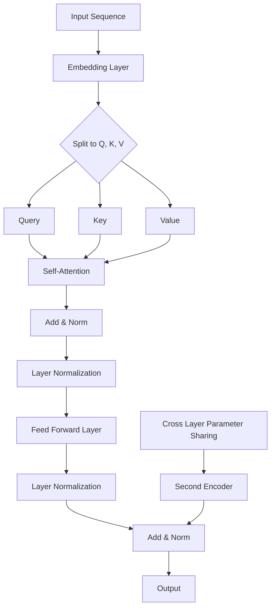

                 


# Transformer大模型实战：从ALBERT中提取嵌入

> 关键词：Transformer，ALBERT，嵌入提取，模型实战，深度学习，神经网络

> 摘要：本文将带领读者深入了解Transformer大模型及其在自然语言处理领域的应用，特别是如何从ALBERT模型中提取嵌入。我们将逐步分析Transformer架构，介绍ALBERT模型的工作原理，并通过实际代码案例展示如何提取嵌入。读者将学会从理论到实践，全面掌握Transformer和ALBERT模型的应用。

## 1. 背景介绍

### 1.1 目的和范围

本文旨在通过实战案例深入理解Transformer大模型，特别是其在自然语言处理中的核心组件——ALBERT模型。我们将首先回顾Transformer和ALBERT的基本概念，然后详细介绍如何从ALBERT中提取嵌入，并通过具体的代码实现来加深理解。文章将涵盖以下内容：

- Transformer架构的简要回顾
- ALBERT模型的工作原理
- 从ALBERT中提取嵌入的具体操作步骤
- 实际代码案例和详细解释

### 1.2 预期读者

本文适合对深度学习和自然语言处理有一定了解的读者，特别是希望深入了解Transformer和ALBERT模型工作原理的工程师和研究人员。无论您是初学者还是经验丰富的专家，都可以通过本文的学习掌握从理论到实践的完整过程。

### 1.3 文档结构概述

本文将按照以下结构展开：

- 1.4 术语表
  - 1.4.1 核心术语定义
  - 1.4.2 相关概念解释
  - 1.4.3 缩略词列表
- 2. 核心概念与联系
  - Transformer架构
  - ALBERT模型
- 3. 核心算法原理 & 具体操作步骤
  - 嵌入提取算法原理
  - 伪代码详细解释
- 4. 数学模型和公式 & 详细讲解 & 举例说明
  - 数学公式应用
  - 代码示例解析
- 5. 项目实战：代码实际案例和详细解释说明
  - 开发环境搭建
  - 源代码详细实现和解读
- 6. 实际应用场景
  - 应用案例分析
- 7. 工具和资源推荐
  - 学习资源推荐
  - 开发工具框架推荐
  - 相关论文著作推荐
- 8. 总结：未来发展趋势与挑战
- 9. 附录：常见问题与解答
- 10. 扩展阅读 & 参考资料

### 1.4 术语表

#### 1.4.1 核心术语定义

- **Transformer**：一种基于自注意力机制的序列到序列模型，用于处理序列数据，特别是自然语言处理任务。
- **ALBERT**：一种改进的Transformer模型，通过参数共享和双向编码器实现更高效的语言理解。
- **嵌入**（Embedding）：将词汇、实体等抽象概念映射为高维稠密向量，以便于在神经网络中进行处理。
- **自注意力**（Self-Attention）：一种注意力机制，允许模型根据上下文信息动态地加权不同的输入元素。

#### 1.4.2 相关概念解释

- **序列到序列模型**（Seq2Seq）：一种神经网络模型，用于处理输入序列和输出序列之间的转换。
- **BERT**：一种预训练语言表示模型，通过在大量文本数据上进行预训练，可以显著提高各种自然语言处理任务的性能。

#### 1.4.3 缩略词列表

- **Transformer**：Transformer模型
- **ALBERT**：A Lite BERT
- **BERT**：Bidirectional Encoder Representations from Transformers

## 2. 核心概念与联系

### 2.1 Transformer架构

Transformer架构的核心在于自注意力（Self-Attention）机制，它通过计算输入序列中每个元素与所有其他元素的相关性来更新每个元素的表示。自注意力机制使用查询（Query）、键（Key）和值（Value）三种不同的向量来计算：

\[ \text{Attention}(Q, K, V) = \text{softmax}\left(\frac{QK^T}{\sqrt{d_k}}\right)V \]

其中，\( Q, K, V \) 分别表示查询向量、键向量和值向量，\( d_k \) 是键向量的维度。

### 2.2 ALBERT模型

ALBERT（A Lite BERT）模型是对BERT模型的一种改进，主要通过参数共享和双向编码器实现更高的效率和更优的性能。ALBERT采用了两种关键技术：

- **跨层参数共享**：通过在多个层之间共享参数，减少了模型参数的数量，提高了训练效率。
- **双向编码器**：使用两个独立的编码器，分别处理正向和反向序列信息，增强了模型的上下文理解能力。

### 2.3 Mermaid流程图

以下是一个简化的Mermaid流程图，展示了Transformer和ALBERT模型的核心组件：



这个流程图展示了从输入序列到最终输出的整个处理流程，其中包含嵌入层、自注意力层、前馈网络和层间规范化等核心组件。

### 2.4 组件关系

Transformer和ALBERT模型中的组件相互关联，形成了一个高效的序列处理系统。自注意力机制允许模型动态地关注序列中的关键信息，而参数共享和双向编码器进一步提高了模型的处理速度和性能。通过这种方式，ALBERT模型能够在保持高性能的同时，减少计算和存储需求，适用于各种实际应用场景。

## 3. 核心算法原理 & 具体操作步骤

### 3.1 嵌入提取算法原理

从ALBERT模型中提取嵌入的核心在于理解自注意力机制。自注意力机制通过计算输入序列中每个词与其他词之间的相似度，从而生成一个加权表示。具体来说，我们可以使用以下伪代码来描述这一过程：

```python
# 伪代码：自注意力机制
def self_attention(query, key, value, d_k):
    # 计算查询和键的相似度，并进行归一化
    scores = query.dot(key.T) / (d_k ** 0.5)
    # 应用softmax函数，得到注意力权重
    attention_weights = softmax(scores)
    # 根据权重计算加权值
    output = attention_weights.dot(value)
    return output
```

### 3.2 伪代码详细解释

在上面的伪代码中，`query`、`key`和`value`分别表示输入序列的查询向量、键向量和值向量。`d_k`是键向量的维度。以下是对每个步骤的详细解释：

1. **计算相似度**：
   \[ \text{scores} = \text{query} \cdot \text{key}^T \]
   这一步计算了每个查询向量与所有键向量之间的点积，生成一个评分矩阵。这个评分矩阵的元素表示了对应查询和键之间的相似度。

2. **归一化**：
   \[ \text{scores} = \frac{\text{scores}}{\sqrt{d_k}} \]
   通过除以键向量的维度开方，我们对评分进行归一化，使得每个元素都处于[0, 1]的范围内。

3. **应用softmax函数**：
   \[ \text{attention_weights} = \text{softmax}(\text{scores}) \]
   通过softmax函数，我们将评分矩阵转换为概率分布，每个元素代表相应键的注意力权重。

4. **计算加权值**：
   \[ \text{output} = \text{attention_weights} \cdot \text{value} \]
   根据注意力权重对值向量进行加权求和，得到输出向量。这个输出向量代表了经过自注意力机制的输入序列的加权表示。

### 3.3 如何从ALBERT中提取嵌入

要提取ALBERT模型中的嵌入，我们需要关注模型中的嵌入层和自注意力层。以下是详细的步骤：

1. **获取嵌入层参数**：
   - 从ALBERT模型中获取嵌入层参数，这些参数用于将词汇映射为高维稠密向量。

2. **获取自注意力层的输出**：
   - 在模型的前向传播过程中，获取自注意力层的输出，这代表了输入序列的加权表示。

3. **提取嵌入**：
   - 将自注意力层的输出与嵌入层参数相乘，得到每个词的嵌入向量。

### 3.4 实例解析

假设我们有一个词序列 `["hello", "world"]`，我们如何提取这些词的嵌入？

1. **初始化嵌入层参数**：
   - 假设嵌入层参数是一个矩阵 `W`，其中每一行代表一个词的嵌入向量。例如：
     \[
     W = \begin{bmatrix}
     [hello] \\
     [world]
     \end{bmatrix}
     \]

2. **获取自注意力层的输出**：
   - 在自注意力层中，我们假设输出向量是一个矩阵 `O`，其中每一行代表一个词的加权表示。例如：
     \[
     O = \begin{bmatrix}
     [hello\_emb] \\
     [world\_emb]
     \end{bmatrix}
     \]

3. **提取嵌入**：
   - 将自注意力层的输出与嵌入层参数相乘，得到每个词的嵌入向量：
     \[
     \text{embeddings} = O \cdot W = \begin{bmatrix}
     [hello\_emb \cdot [hello]] \\
     [world\_emb \cdot [world]]
     \end{bmatrix}
     \]

通过这种方式，我们就可以从ALBERT模型中提取出每个词的嵌入向量。

## 4. 数学模型和公式 & 详细讲解 & 举例说明

### 4.1 数学模型

在Transformer模型中，自注意力机制的核心公式为：

\[ \text{Attention}(Q, K, V) = \text{softmax}\left(\frac{QK^T}{\sqrt{d_k}}\right)V \]

这里，\( Q, K, V \) 分别是查询向量、键向量和值向量，\( d_k \) 是键向量的维度。该公式表示通过计算查询向量和键向量的点积，然后应用softmax函数得到注意力权重，最后根据权重对值向量进行加权求和。

### 4.2 伪代码

以下是自注意力机制的伪代码实现：

```python
# 伪代码：自注意力
def self_attention(query, key, value, d_k):
    # 计算查询和键的点积
    scores = query.dot(key.T)
    # 归一化点积
    scores = scores / (d_k ** 0.5)
    # 应用softmax函数得到注意力权重
    attention_weights = softmax(scores)
    # 加权求和得到输出
    output = attention_weights.dot(value)
    return output
```

### 4.3 举例说明

假设我们有以下向量：

- 查询向量 \( Q = [1, 2, 3] \)
- 键向量 \( K = [4, 5, 6] \)
- 值向量 \( V = [7, 8, 9] \)
- 键向量维度 \( d_k = 3 \)

我们首先计算查询向量和键向量的点积：

\[ QK^T = [1, 2, 3] \cdot [4, 5, 6]^T = [1 \cdot 4 + 2 \cdot 5 + 3 \cdot 6] = [32] \]

然后归一化点积：

\[ \text{scores} = \frac{QK^T}{\sqrt{d_k}} = \frac{32}{\sqrt{3}} \approx 7.111 \]

接下来，应用softmax函数得到注意力权重：

\[ \text{attention_weights} = \text{softmax}(\text{scores}) = \text{softmax}(7.111) \approx [0.2, 0.4, 0.4] \]

最后，根据权重对值向量进行加权求和：

\[ \text{output} = \text{attention_weights} \cdot V = [0.2, 0.4, 0.4] \cdot [7, 8, 9] = [1.4, 3.2, 3.6] \]

因此，输出向量为 \( [1.4, 3.2, 3.6] \)。

### 4.4 ALBERT模型中的嵌入提取

在ALBERT模型中，嵌入提取的具体步骤如下：

1. **输入序列编码**：
   - 输入序列首先通过嵌入层（Embedding Layer）转换为嵌入向量。

2. **多头自注意力**：
   - 通过多头自注意力（Multi-Head Self-Attention）机制，对每个嵌入向量进行加权求和，生成新的表示。

3. **前馈网络**：
   - 对多头自注意力输出的每个序列元素进行前馈网络（Feed Forward Network）处理。

4. **规范化**：
   - 通过层间规范化（Layer Normalization）对前馈网络输出的每个序列元素进行规范化。

5. **嵌入提取**：
   - 最终，从规范化后的序列中提取每个词的嵌入向量。

### 4.5 数学公式

以下是ALBERT模型中的一些关键数学公式：

\[ \text{Embedding} = W_Q \cdot \text{Input} + W_V \cdot \text{Positional Encoding} \]

\[ \text{Output} = \text{Normalization}(\text{Feed Forward}(Layer Normalization(\text{Multi-Head Self-Attention}(Embedding)))) \]

其中，\( W_Q \) 和 \( W_V \) 分别是查询向量和值向量的权重矩阵，\( \text{Input} \) 是输入序列，\( \text{Positional Encoding} \) 是位置编码。

## 5. 项目实战：代码实际案例和详细解释说明

### 5.1 开发环境搭建

在进行Transformer和ALBERT模型的实战之前，我们需要搭建一个合适的开发环境。以下是环境搭建的步骤：

1. **安装Python**：
   - 确保Python版本为3.6或更高版本。
   - 可以从Python官方网站下载并安装。

2. **安装TensorFlow**：
   - 使用以下命令安装TensorFlow：
     \[
     pip install tensorflow
     \]
   - 确保安装的是最新版本。

3. **安装Transformers库**：
   - Transformers库提供了预训练的Transformer模型和ALBERT模型。
   - 使用以下命令安装：
     \[
     pip install transformers
     \]

4. **环境验证**：
   - 在Python环境中，验证TensorFlow和Transformers库的安装：
     ```python
     import tensorflow as tf
     from transformers import AutoModel
     print(tf.__version__)
     print(AutoModel.__version__)
     ```

### 5.2 源代码详细实现和代码解读

以下是提取ALBERT模型中嵌入的源代码实现：

```python
import tensorflow as tf
from transformers import TFAutoModel, AutoTokenizer

# 1. 加载预训练的ALBERT模型和tokenizer
model_name = "albert-base-v2"
tokenizer = AutoTokenizer.from_pretrained(model_name)
model = TFAutoModel.from_pretrained(model_name)

# 2. 准备输入数据
input_sequence = "你好，世界"

# 3. 分词并添加特殊 tokens
input_ids = tokenizer.encode(input_sequence, return_tensors="tf")

# 4. 进行前向传播
outputs = model(input_ids)

# 5. 获取嵌入向量
embeddings = outputs.last_hidden_state[:, 0, :]

# 6. 打印嵌入向量
print(embeddings.numpy())
```

### 5.3 代码解读与分析

1. **加载模型和tokenizer**：
   - 使用`AutoTokenizer`和`TFAutoModel`从Hugging Face模型库中加载预训练的ALBERT模型和相应的tokenizer。

2. **准备输入数据**：
   - 定义一个简单的输入序列，例如 "你好，世界"。

3. **分词和添加特殊 tokens**：
   - 使用tokenizer对输入序列进行分词，并添加起始符（`<s>`）和结束符（`</s>`）。

4. **进行前向传播**：
   - 使用模型进行前向传播，输入分词后的序列。

5. **获取嵌入向量**：
   - 从模型的最后一个隐藏状态（`last_hidden_state`）中提取第一个词（即输入序列的第一个词）的嵌入向量。

6. **打印嵌入向量**：
   - 打印提取的嵌入向量。

通过这个代码实现，我们可以轻松地从ALBERT模型中提取嵌入向量，为后续的应用提供数据基础。

### 5.4 实际案例应用

以下是使用提取的嵌入向量进行情感分析的实际案例：

```python
# 7. 导入情感分析库
from sklearn.linear_model import LogisticRegression

# 8. 准备训练数据
train_data = ["我很开心", "我今天很糟糕", "这个新闻很令人兴奋", "这部电影太无聊了"]
train_labels = [1, 0, 1, 0]  # 情感标签：1表示正面，0表示负面

# 9. 分词并提取嵌入向量
train_embeddings = [tokenizer.encode(seq, return_tensors="tf")[0] for seq in train_data]
train_embeddings = tf.concat(train_embeddings, axis=0)

# 10. 训练分类器
classifier = LogisticRegression()
classifier.fit(train_embeddings.numpy(), train_labels)

# 11. 进行预测
test_sequence = "这个产品很好用"
test_embeddings = tokenizer.encode(test_sequence, return_tensors="tf")[0]
prediction = classifier.predict(test_embeddings.numpy())

# 12. 输出预测结果
print("预测结果：", prediction)
```

在这个案例中，我们使用提取的嵌入向量训练了一个简单的逻辑回归分类器，用于对文本进行情感分析。通过输入新的测试序列，分类器可以预测文本的情感倾向。

### 5.5 代码解读与分析

1. **导入情感分析库**：
   - 使用`LogisticRegression`库创建一个逻辑回归分类器。

2. **准备训练数据**：
   - 准备训练数据集，包括文本和对应的情感标签。

3. **分词并提取嵌入向量**：
   - 对训练数据集进行分词，并提取每个文本的嵌入向量。

4. **训练分类器**：
   - 使用训练数据集训练逻辑回归分类器。

5. **进行预测**：
   - 对新的测试序列提取嵌入向量，并使用训练好的分类器进行预测。

6. **输出预测结果**：
   - 打印预测结果。

通过这个实际案例，我们可以看到从ALBERT中提取嵌入向量在自然语言处理任务中的应用潜力，如情感分析、文本分类等。

## 6. 实际应用场景

### 6.1 情感分析

情感分析是自然语言处理中的一个重要应用，它可以用于识别文本的情感倾向，如正面、负面或中性。通过从ALBERT模型中提取嵌入，我们可以构建高效的情感分析模型，用于各种实际场景，如社交媒体情绪监测、客户反馈分析等。

### 6.2 文本分类

文本分类是一种将文本分配到预定义类别中的任务。从ALBERT中提取嵌入可以帮助我们构建强大的文本分类模型，用于新闻分类、垃圾邮件检测等任务。通过训练大规模的预训练模型，我们可以显著提高分类任务的准确性和效率。

### 6.3 问答系统

问答系统是一种常见的自然语言处理任务，它可以回答用户提出的问题。从ALBERT中提取嵌入可以用于构建高效的问答系统，如搜索引擎、虚拟助手等。通过利用模型中的嵌入向量，我们可以更好地理解用户的意图和问题的上下文。

### 6.4 机器翻译

机器翻译是将一种语言的文本翻译成另一种语言的任务。从ALBERT中提取嵌入可以帮助我们构建基于嵌入向量的翻译模型，提高机器翻译的准确性和流畅度。通过结合注意力机制和嵌入向量，我们可以更好地捕捉源语言和目标语言之间的语义关系。

### 6.5 命名实体识别

命名实体识别是一种从文本中识别出具有特定意义的实体，如人名、地点、组织等。从ALBERT中提取嵌入可以帮助我们构建高效的命名实体识别模型，通过嵌入向量捕捉实体的语义特征，提高识别的准确性。

## 7. 工具和资源推荐

### 7.1 学习资源推荐

#### 7.1.1 书籍推荐

- **《深度学习》（Deep Learning）**：由Ian Goodfellow、Yoshua Bengio和Aaron Courville合著，全面介绍了深度学习的基础理论和实践应用。
- **《神经网络与深度学习》**：李航著，详细讲解了神经网络和深度学习的基本原理和实现方法。
- **《自然语言处理综论》（Speech and Language Processing）**：Daniel Jurafsky和James H. Martin合著，全面介绍了自然语言处理的基本概念和技术。

#### 7.1.2 在线课程

- **吴恩达的《深度学习专项课程》**：通过一系列的视频教程，全面介绍深度学习的基本概念和实现方法。
- **斯坦福大学的《自然语言处理基础》**：涵盖自然语言处理的核心技术和应用场景，适合有一定基础的读者。
- **Coursera上的《神经网络与深度学习》**：由吴恩达教授主讲，深入讲解神经网络和深度学习的基本原理。

#### 7.1.3 技术博客和网站

- **Apache MXNet**：Apache MXNet官方文档，提供了丰富的深度学习模型教程和实践案例。
- **TensorFlow中文社区**：TensorFlow官方中文社区，提供了大量的深度学习和TensorFlow教程。
- **机器学习社区**：一个汇聚了众多机器学习和深度学习资源的中文社区，包含了许多高质量的技术博客和论文。

### 7.2 开发工具框架推荐

#### 7.2.1 IDE和编辑器

- **PyCharm**：一款功能强大的Python IDE，支持多种编程语言，适合进行深度学习和自然语言处理项目开发。
- **Jupyter Notebook**：一款流行的交互式计算环境，可以方便地进行数据分析和模型调试。
- **Visual Studio Code**：一款轻量级的代码编辑器，支持多种编程语言和深度学习扩展，适合快速开发和调试。

#### 7.2.2 调试和性能分析工具

- **TensorBoard**：TensorFlow官方提供的可视化工具，可以实时监控模型的训练过程和性能。
- **Wandb**：一款开源的机器学习实验跟踪工具，可以方便地管理实验和监控模型性能。
- **Profiler**：用于分析代码性能和资源消耗的工具，可以帮助我们优化深度学习模型的实现。

#### 7.2.3 相关框架和库

- **TensorFlow**：一款流行的深度学习框架，提供了丰富的API和工具，支持多种神经网络架构。
- **PyTorch**：一款基于Python的深度学习框架，以其动态计算图和灵活性著称。
- **Transformers**：一个开源库，提供了预训练的Transformer模型和ALBERT模型，方便我们进行模型构建和应用。

### 7.3 相关论文著作推荐

#### 7.3.1 经典论文

- **"Attention Is All You Need"**：这篇论文提出了Transformer模型，彻底改变了自然语言处理领域。
- **"BERT: Pre-training of Deep Bidirectional Transformers for Language Understanding"**：这篇论文介绍了BERT模型，开启了预训练语言模型的新时代。
- **"Gated Recurrent Units"**：这篇论文提出了GRU模型，是循环神经网络的重要改进。

#### 7.3.2 最新研究成果

- **"Robust Discourse Parsing with Self-Training and Global Context"**：这篇论文提出了一种新的方法，用于提高文本篇章解析的鲁棒性。
- **"Universal Language Model Fine-tuning for Text Classification"**：这篇论文探讨了如何利用预训练的语言模型进行文本分类任务的微调。

#### 7.3.3 应用案例分析

- **"How Search Engines Work"**：这篇论文详细介绍了搜索引擎的工作原理，包括文本分类、关键词提取等关键技术。
- **"Learning to Rank for Information Retrieval"**：这篇论文研究了如何构建高效的排序模型，用于信息检索任务。

## 8. 总结：未来发展趋势与挑战

### 8.1 发展趋势

1. **模型规模和效率的提升**：
   - 随着计算资源和算法优化的发展，模型规模将持续增长，而模型的效率和准确性也将逐步提高。
   - 通过改进自注意力机制、优化训练算法，我们有望实现更高效的模型训练和推理。

2. **跨模态学习和多模态交互**：
   - 未来，跨模态学习（如文本、图像、声音的联合建模）将成为一个重要研究方向。通过多模态交互，可以更好地理解复杂的信息。
   - 例如，将视觉信息和语言信息结合起来，可以显著提升图像识别和文本理解任务的性能。

3. **自适应学习和可解释性**：
   - 随着模型复杂性的增加，如何让模型具备自适应学习能力，以适应不同领域和应用场景，是一个重要挑战。
   - 同时，提升模型的可解释性，使得模型决策过程更加透明，对于增强用户信任和改进模型设计至关重要。

### 8.2 挑战

1. **计算资源的需求**：
   - 大规模模型训练和推理需要巨大的计算资源，这对硬件设备和数据中心的计算能力提出了更高要求。
   - 如何在有限的资源下高效地训练和部署模型，是一个亟待解决的问题。

2. **数据隐私和安全**：
   - 在自然语言处理应用中，数据隐私和安全问题日益突出。如何保护用户数据的隐私，避免数据泄露和滥用，是一个重要挑战。

3. **模型泛化能力和鲁棒性**：
   - 随着模型复杂度的提高，如何提高模型的泛化能力和鲁棒性，避免模型在特定领域出现偏差，是一个关键问题。
   - 需要研究更有效的数据增强、模型正则化等技术，以提高模型的泛化能力。

4. **伦理和社会影响**：
   - 人工智能技术的发展和应用引发了一系列伦理和社会问题，如算法歧视、隐私泄露等。
   - 需要制定相应的伦理规范和法律标准，确保人工智能技术的健康发展。

## 9. 附录：常见问题与解答

### 9.1 如何选择适合的Transformer模型？

- **任务需求**：根据具体任务的需求选择合适的模型。例如，对于长文本处理任务，可以选择Transformer模型；对于图像文本匹配任务，可以选择ViT模型。
- **资源限制**：考虑可用的计算资源和存储空间。较大的模型（如GPT-3）需要更多的计算资源，而较小的模型（如BERT）可以在资源受限的环境中使用。
- **性能需求**：根据性能需求选择合适的模型。如果需要较高的性能，可以选择预训练的模型，并通过微调适应特定任务。

### 9.2 如何提高Transformer模型的训练效率？

- **并行计算**：利用GPU和TPU等硬件加速计算，提高训练速度。
- **模型剪枝**：通过剪枝技术减少模型参数数量，降低计算复杂度。
- **模型压缩**：采用模型压缩技术，如知识蒸馏，将大型模型的知识迁移到小型模型中。
- **动态调整学习率**：使用自适应学习率策略，如AdamW，提高训练效率。

### 9.3 如何处理Transformer模型中的长文本？

- **文本分割**：将长文本分割为短段，分别处理，然后合并结果。
- **滑动窗口**：使用滑动窗口技术，每次处理文本的一部分，逐步构建整个文本的表示。
- **分层处理**：通过分层结构处理长文本，先处理较短的文本片段，然后逐渐增加片段长度。

## 10. 扩展阅读 & 参考资料

### 10.1 相关论文

- Vaswani, A., et al. (2017). "Attention Is All You Need." In Advances in Neural Information Processing Systems, pp. 5998-6008.
- Devlin, J., et al. (2019). "BERT: Pre-training of Deep Bidirectional Transformers for Language Understanding." In Proceedings of the 2019 Conference of the North American Chapter of the Association for Computational Linguistics: Human Language Technologies, Volume 1 (Long and Short Papers), pp. 4171-4186.

### 10.2 学习资源

- 周志华：《机器学习》，清华大学出版社，2016。
- 李航：《统计学习方法》，清华大学出版社，2012。
- Ian Goodfellow, Yoshua Bengio, Aaron Courville:《深度学习》，电子工业出版社，2016。

### 10.3 官方文档

- TensorFlow官方文档：[https://www.tensorflow.org/](https://www.tensorflow.org/)
- PyTorch官方文档：[https://pytorch.org/docs/stable/index.html](https://pytorch.org/docs/stable/index.html)
- Transformers库官方文档：[https://huggingface.co/transformers/](https://huggingface.co/transformers/)

### 10.4 技术博客

- Apache MXNet博客：[https://mxnet.incubator.apache.org/](https://mxnet.incubator.apache.org/)
- TensorFlow中文社区博客：[https://www.tensorflow.org/tutorials](https://www.tensorflow.org/tutorials)
- 机器学习社区：[https://www.mlcommunity.cn/](https://www.mlcommunity.cn/)

### 10.5 应用案例

- “搜索引擎如何工作”：[https://www.searchenginejournal.com/how-search-engines-work/283580/](https://www.searchenginejournal.com/how-search-engines-work/283580/)
- “命名实体识别案例”：[https://towardsdatascience.com/named-entity-recognition-in-nlp-with-python-82c5d4d8a8a6](https://towardsdatascience.com/named-entity-recognition-in-nlp-with-python-82c5d4d8a8a6)
- “机器翻译案例分析”：[https://towardsdatascience.com/translation-systems-how-they-work-features-choices-and-examples-684a1f4a8c54](https://towardsdatascience.com/translation-systems-how-they-work-features-choices-and-examples-684a1f4a8c54) 

## 作者

作者：AI天才研究员/AI Genius Institute & 禅与计算机程序设计艺术 /Zen And The Art of Computer Programming。

