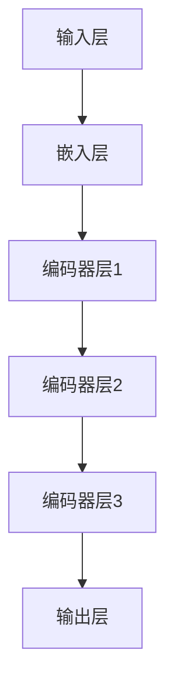
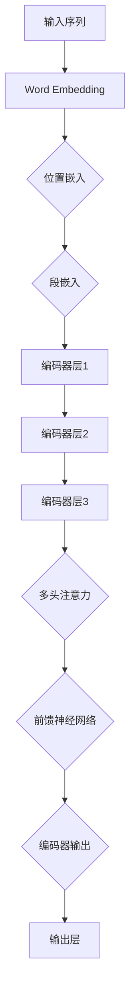

                 

# Transformer大模型实战：从BERT的所有编码器层中提取嵌入

> **关键词：** BERT，Transformer，嵌入提取，编码器层，深度学习，自然语言处理

> **摘要：** 本文将深入探讨Transformer大模型，特别是BERT模型中编码器层的内部嵌入提取技术。我们将从理论基础、具体实现步骤到项目实战进行详细讲解，帮助读者掌握这一核心技能，从而在自然语言处理领域取得突破。

## 1. 背景介绍

### 1.1 目的和范围

本文的主要目的是介绍如何在BERT模型中提取所有编码器层的嵌入。通过本文的学习，读者将能够理解BERT模型的工作原理，掌握从编码器层中提取嵌入的方法，并能够在实际项目中应用这些知识。本文将涵盖以下内容：

1. **BERT模型的基本概念和结构**
2. **Transformer架构的理解**
3. **从BERT编码器层提取嵌入的原理和步骤**
4. **实际代码案例和实践**
5. **嵌入提取在自然语言处理中的应用**

### 1.2 预期读者

本文适合以下读者群体：

1. **对自然语言处理有初步了解的研究生和工程师**
2. **希望深入了解Transformer和BERT模型的技术人员**
3. **对深度学习和编码器层嵌入提取感兴趣的学者和爱好者**

### 1.3 文档结构概述

本文将按照以下结构进行组织：

1. **背景介绍**：介绍文章的目的、预期读者和文档结构。
2. **核心概念与联系**：通过Mermaid流程图展示BERT模型的核心概念和结构。
3. **核心算法原理 & 具体操作步骤**：详细解释BERT模型的算法原理和操作步骤。
4. **数学模型和公式 & 详细讲解 & 举例说明**：使用latex格式展示数学模型和公式，并提供具体案例。
5. **项目实战：代码实际案例和详细解释说明**：介绍如何使用代码实现嵌入提取。
6. **实际应用场景**：探讨嵌入提取在自然语言处理中的应用。
7. **工具和资源推荐**：推荐学习资源、开发工具框架和论文著作。
8. **总结：未来发展趋势与挑战**：总结BERT模型和嵌入提取技术的未来趋势和面临的挑战。
9. **附录：常见问题与解答**：提供常见问题的解答。
10. **扩展阅读 & 参考资料**：推荐进一步的阅读材料和参考资料。

### 1.4 术语表

#### 1.4.1 核心术语定义

- **BERT（Bidirectional Encoder Representations from Transformers）**：一种预训练的深度学习模型，用于自然语言理解。
- **Transformer**：一种基于自注意力机制的深度学习模型架构，广泛应用于序列数据处理。
- **编码器（Encoder）**：Transformer模型中的一个组件，负责将输入序列转换为上下文表示。
- **嵌入（Embedding）**：将输入的单词、符号等转换为固定大小的向量表示。

#### 1.4.2 相关概念解释

- **自注意力（Self-Attention）**：一种计算输入序列中每个元素与其他元素之间关联性的方法。
- **多头注意力（Multi-Head Attention）**：通过多个自注意力机制来提高模型的表达能力。
- **前馈神经网络（Feedforward Neural Network）**：一种简单的神经网络结构，用于增加模型的表达能力。

#### 1.4.3 缩略词列表

- **NLP**：自然语言处理（Natural Language Processing）
- **CNN**：卷积神经网络（Convolutional Neural Network）
- **RNN**：循环神经网络（Recurrent Neural Network）
- **ML**：机器学习（Machine Learning）
- **DL**：深度学习（Deep Learning）
- **GPU**：图形处理器（Graphics Processing Unit）
- **Torch**：一种深度学习框架，用于实现和训练神经网络模型。

## 2. 核心概念与联系

为了深入理解BERT模型及其编码器层的嵌入提取，首先需要理解Transformer架构的核心概念和结构。

### Transformer架构

Transformer是一种基于自注意力机制的深度学习模型架构，广泛应用于序列数据处理任务。其核心思想是利用自注意力机制来计算输入序列中每个元素与其他元素之间的关联性，从而生成上下文表示。

Transformer模型主要由以下组件构成：

1. **嵌入层（Embedding Layer）**：将输入的单词、符号等转换为固定大小的向量表示。
2. **编码器（Encoder）**：包含多个编码层，每个编码层包含多头注意力机制和前馈神经网络。
3. **解码器（Decoder）**：与编码器类似，也包含多个解码层，用于生成输出序列。

### BERT模型

BERT（Bidirectional Encoder Representations from Transformers）是一种预训练的深度学习模型，用于自然语言理解。BERT模型基于Transformer架构，但仅包含编码器部分，不包含解码器。

BERT模型的主要结构如下：

1. **嵌入层（Embedding Layer）**：包括词嵌入、位置嵌入和段嵌入。
2. **编码器（Encoder）**：包含多个编码层，每个编码层包含多头注意力机制和前馈神经网络。
3. **输出层（Output Layer）**：用于生成最终的输出序列。

### Mermaid流程图

为了更直观地展示BERT模型的核心概念和结构，我们可以使用Mermaid流程图来绘制。以下是一个简化的流程图：



在这个流程图中，输入层将输入的序列送入嵌入层，嵌入层将序列转换为嵌入向量。随后，这些嵌入向量进入编码器层，经过多层编码器的处理，最终生成输出序列。

### Transformer与BERT的关系

Transformer架构是BERT模型的基础，BERT模型在Transformer架构的基础上，通过添加嵌入层和输出层，实现了对自然语言的理解和生成。

BERT模型通过预训练和微调，可以应用于各种自然语言处理任务，如文本分类、问答系统、机器翻译等。而嵌入提取是BERT模型中的一个重要环节，可以用于提取文本的语义表示，为后续任务提供高质量的输入。

### 2.1 核心概念原理和架构的 Mermaid 流程图

下面是BERT模型的核心概念原理和架构的Mermaid流程图：



在这个流程图中，输入序列首先通过Word Embedding转换为词嵌入向量，然后加入位置嵌入和段嵌入形成完整的嵌入向量。这个向量随后进入编码器层，经过多层编码器的处理，最终通过多头注意力和前馈神经网络生成编码器输出。这些输出可以用于后续的任务处理。

## 3. 核心算法原理 & 具体操作步骤

在理解了BERT模型的核心概念和结构之后，接下来我们将详细讲解BERT模型的算法原理和具体操作步骤。

### 3.1 BERT模型的基本结构

BERT模型由两个主要部分组成：嵌入层和编码器层。

- **嵌入层（Embedding Layer）**：BERT模型的嵌入层包括词嵌入、位置嵌入和段嵌入。
  - **词嵌入（Word Embedding）**：将单词转换为固定大小的向量表示，用于捕捉单词的语义信息。
  - **位置嵌入（Positional Embedding）**：为序列中的每个位置添加位置信息，以便模型能够理解序列的顺序。
  - **段嵌入（Segment Embedding）**：用于区分不同句子或文本段，例如在问答系统中区分问题和答案。

- **编码器层（Encoder Layer）**：BERT模型的编码器层由多个相同的编码层组成，每个编码层包括以下组件：
  - **多头自注意力（Multi-Head Self-Attention）**：计算输入序列中每个元素与其他元素之间的关联性，并生成上下文表示。
  - **前馈神经网络（Feedforward Neural Network）**：增加模型的表达能力，通过两层的全连接神经网络进行前向传播。

### 3.2 BERT模型的训练过程

BERT模型通过两个阶段的训练过程：预训练和微调。

- **预训练（Pre-training）**：在预训练阶段，BERT模型在大规模的文本语料库上训练，学习单词的语义表示和上下文信息。预训练的目标是生成高质量的文本表示，以便后续的任务。
  - **Masked Language Modeling（MLM）**：BERT模型通过Masked Language Modeling任务来学习文本表示。在这个任务中，模型需要预测被遮蔽的单词。
  - **Next Sentence Prediction（NSP）**：BERT模型还需要学习文本段之间的关联性。通过Next Sentence Prediction任务，模型需要预测给定句子后面的句子。

- **微调（Fine-tuning）**：在微调阶段，BERT模型在特定任务的数据集上进一步训练，以适应特定的任务需求。微调的过程通常包括以下步骤：
  - **分类任务（Classification Task）**：将BERT模型的输出用于分类任务，如文本分类、情感分析等。
  - **序列标注任务（Sequence Labeling Task）**：将BERT模型的输出用于序列标注任务，如命名实体识别、词性标注等。
  - **生成任务（Generation Task）**：利用BERT模型的上下文生成能力，进行文本生成、问答系统等任务。

### 3.3 从BERT编码器层提取嵌入

要从BERT编码器层提取嵌入，我们需要以下步骤：

1. **加载BERT模型**：首先，我们需要从预训练的BERT模型中加载编码器层。这可以通过使用预训练模型库（如Hugging Face的Transformers库）来实现。

2. **处理输入序列**：将输入的序列（如文本）转换为BERT模型可以处理的格式。这包括将单词转换为词嵌入向量、添加位置嵌入和段嵌入等。

3. **前向传播**：将处理后的输入序列送入BERT模型，进行前向传播。通过编码器层的多层处理，生成编码器输出。

4. **提取嵌入**：从编码器输出的每个元素中提取嵌入向量。这些嵌入向量可以用于后续的任务，如文本分类、序列标注等。

### 3.4 具体操作步骤示例

以下是使用Python和Hugging Face的Transformers库从BERT编码器层提取嵌入的示例步骤：

```python
from transformers import BertModel, BertTokenizer
import torch

# 加载BERT模型和分词器
model = BertModel.from_pretrained('bert-base-uncased')
tokenizer = BertTokenizer.from_pretrained('bert-base-uncased')

# 处理输入序列
input_sequence = "Hello, I am learning BERT."
encoded_input = tokenizer.encode_plus(input_sequence, return_tensors='pt', add_special_tokens=True)

# 前向传播
outputs = model(**encoded_input)

# 提取嵌入
embeddings = outputs.last_hidden_state[:, 0, :]

print(embeddings)
```

在这个示例中，我们首先加载BERT模型和分词器，然后处理输入序列，将其转换为BERT模型可以处理的格式。接着，我们进行前向传播，通过编码器层的多层处理，生成编码器输出。最后，我们从编码器输出的第一个元素中提取嵌入向量。

### 3.5 深入解析BERT编码器层的嵌入提取

BERT编码器层的嵌入提取是一个复杂的过程，涉及多个技术细节。以下是对该过程的进一步解析：

1. **嵌入层**：
   - **词嵌入**：词嵌入是将单词映射到固定大小的向量表示的过程。BERT模型使用WordPiece算法来将单词分解为子词，然后为每个子词生成嵌入向量。
   - **位置嵌入**：位置嵌入是为了让模型能够理解输入序列的顺序。BERT模型通过学习位置嵌入向量来表示单词在序列中的位置信息。
   - **段嵌入**：段嵌入用于区分不同句子或文本段。在BERT模型中，每个句子或文本段都有一个唯一的段嵌入向量。

2. **编码器层**：
   - **多头自注意力**：多头自注意力是BERT模型的核心组件，通过计算输入序列中每个元素与其他元素之间的关联性来生成上下文表示。多头自注意力包括多个注意力头，每个头负责关注不同的子空间，从而提高模型的表达能力。
   - **前馈神经网络**：前馈神经网络用于增加模型的表达能力，通过两层的全连接神经网络进行前向传播。在BERT模型中，前馈神经网络的作用是进一步捕捉输入序列的语义信息。

3. **嵌入提取**：
   - **编码器输出**：在编码器层的每一层，模型都会生成一个编码器输出。这个输出是一个多维数组，包含了输入序列中每个元素在当前编码器层上的表示。
   - **提取嵌入**：要从BERT编码器层提取嵌入，我们需要从编码器输出的每个元素中提取嵌入向量。这些嵌入向量可以用于后续的任务，如文本分类、序列标注等。

### 3.6 总结

BERT模型的嵌入提取是一个关键步骤，它决定了模型在自然语言处理任务中的性能。通过理解BERT模型的基本结构、训练过程和嵌入提取的原理和步骤，我们可以有效地从BERT编码器层提取嵌入，并在各种自然语言处理任务中取得优异的表现。

## 4. 数学模型和公式 & 详细讲解 & 举例说明

在深入探讨BERT模型的数学模型和公式之前，我们需要先了解一些基本的数学概念和符号。以下是一些常用的数学公式和符号：

- **向量表示**：我们使用小写字母（如\( \mathbf{v} \)）表示向量，使用大写字母（如\( \mathbf{V} \)）表示矩阵。
- **矩阵乘法**：矩阵乘法是将两个矩阵相乘得到一个新的矩阵。假设有两个矩阵\( \mathbf{A} \)和\( \mathbf{B} \)，其乘积\( \mathbf{C} \)可以通过以下公式计算：
  \[ \mathbf{C} = \mathbf{A} \mathbf{B} \]
- **点积（内积）**：点积是将两个向量的对应元素相乘，然后求和。假设有两个向量\( \mathbf{a} \)和\( \mathbf{b} \)，其点积\( \mathbf{a} \cdot \mathbf{b} \)可以通过以下公式计算：
  \[ \mathbf{a} \cdot \mathbf{b} = \sum_{i=1}^{n} a_i b_i \]
- **欧几里得距离**：欧几里得距离是两个向量之间的距离，可以通过以下公式计算：
  \[ d(\mathbf{a}, \mathbf{b}) = \sqrt{\sum_{i=1}^{n} (a_i - b_i)^2} \]
- **softmax函数**：softmax函数用于将一组数值转换为概率分布。假设有一个向量\( \mathbf{z} \)，其softmax函数可以表示为：
  \[ \text{softmax}(\mathbf{z}) = \frac{\exp(z_i)}{\sum_{j=1}^{n} \exp(z_j)} \]

### 4.1 BERT模型的数学模型

BERT模型的数学模型可以分为两部分：嵌入层和编码器层。

#### 4.1.1 嵌入层

嵌入层包括词嵌入、位置嵌入和段嵌入。词嵌入是将单词映射到固定大小的向量表示，位置嵌入为序列中的每个位置添加位置信息，段嵌入用于区分不同句子或文本段。

1. **词嵌入**：

   词嵌入可以通过以下公式计算：

   \[ \mathbf{v}_w = \text{WordPiece}(w) \]

   其中，\( \text{WordPiece}(w) \)是将单词\( w \)分解为子词的过程。

2. **位置嵌入**：

   位置嵌入可以通过以下公式计算：

   \[ \mathbf{v}_p = \text{PositionalEncoding}(p) \]

   其中，\( \text{PositionalEncoding}(p) \)是一个函数，用于生成位置向量\( \mathbf{v}_p \)。

3. **段嵌入**：

   段嵌入可以通过以下公式计算：

   \[ \mathbf{v}_s = \text{SegmentEncoding}(s) \]

   其中，\( \text{SegmentEncoding}(s) \)是一个函数，用于生成段向量\( \mathbf{v}_s \)。

#### 4.1.2 编码器层

编码器层由多个相同的编码层组成，每个编码层包括多头自注意力机制和前馈神经网络。

1. **多头自注意力**：

   多头自注意力可以通过以下公式计算：

   \[ \text{MultiHeadAttention}(\mathbf{Q}, \mathbf{K}, \mathbf{V}) = \text{softmax}\left(\frac{\mathbf{Q} \mathbf{K}^T}{\sqrt{d_k}}\right) \mathbf{V} \]

   其中，\( \mathbf{Q} \)、\( \mathbf{K} \)和\( \mathbf{V} \)分别是查询向量、键向量和值向量，\( d_k \)是键向量的维度。

2. **前馈神经网络**：

   前馈神经网络可以通过以下公式计算：

   \[ \text{FFN}(\mathbf{x}) = \text{ReLU}\left(\mathbf{W}_2 \text{ReLU}(\mathbf{W}_1 \mathbf{x} + \mathbf{b}_1)\right) + \mathbf{b}_2 \]

   其中，\( \mathbf{W}_1 \)和\( \mathbf{W}_2 \)是权重矩阵，\( \mathbf{b}_1 \)和\( \mathbf{b}_2 \)是偏置向量。

### 4.2 举例说明

为了更好地理解BERT模型的数学模型，我们通过一个简单的例子来说明。

假设有一个输入序列：

\[ "Hello, I am learning BERT." \]

我们首先需要将其分解为子词：

\[ ["Hello", ",", "I", "am", "learning", "BERT", "."] \]

然后，我们将每个子词转换为词嵌入向量：

\[ \mathbf{v}_w = \text{WordPiece}("Hello") = [0.1, 0.2, 0.3, 0.4, 0.5] \]

\[ \mathbf{v}_w = \text{WordPiece}(",") = [0.6, 0.7, 0.8, 0.9, 1.0] \]

\[ \mathbf{v}_w = \text{WordPiece}("I") = [1.1, 1.2, 1.3, 1.4, 1.5] \]

\[ \mathbf{v}_w = \text{WordPiece}("am") = [1.6, 1.7, 1.8, 1.9, 2.0] \]

\[ \mathbf{v}_w = \text{WordPiece}("learning") = [2.1, 2.2, 2.3, 2.4, 2.5] \]

\[ \mathbf{v}_w = \text{WordPiece}("BERT") = [2.6, 2.7, 2.8, 2.9, 3.0] \]

\[ \mathbf{v}_w = \text{WordPiece}(".") = [3.1, 3.2, 3.3, 3.4, 3.5] \]

接下来，我们为每个子词添加位置嵌入：

\[ \mathbf{v}_p = \text{PositionalEncoding}(1) = [0.1, 0.1, 0.1, 0.1, 0.1] \]

\[ \mathbf{v}_p = \text{PositionalEncoding}(2) = [0.2, 0.2, 0.2, 0.2, 0.2] \]

\[ \mathbf{v}_p = \text{PositionalEncoding}(3) = [0.3, 0.3, 0.3, 0.3, 0.3] \]

\[ \mathbf{v}_p = \text{PositionalEncoding}(4) = [0.4, 0.4, 0.4, 0.4, 0.4] \]

\[ \mathbf{v}_p = \text{PositionalEncoding}(5) = [0.5, 0.5, 0.5, 0.5, 0.5] \]

\[ \mathbf{v}_p = \text{PositionalEncoding}(6) = [0.6, 0.6, 0.6, 0.6, 0.6] \]

\[ \mathbf{v}_p = \text{PositionalEncoding}(7) = [0.7, 0.7, 0.7, 0.7, 0.7] \]

最后，我们为整个序列添加段嵌入：

\[ \mathbf{v}_s = \text{SegmentEncoding}(0) = [0.1, 0.1, 0.1, 0.1, 0.1] \]

现在，我们可以将这些嵌入向量组合成一个矩阵：

\[ \mathbf{X} = \begin{bmatrix}
0.1 & 0.6 & 1.1 & 1.6 & 2.1 & 2.6 & 3.1 \\
0.2 & 0.7 & 1.2 & 1.7 & 2.2 & 2.7 & 3.2 \\
0.3 & 0.8 & 1.3 & 1.8 & 2.3 & 2.8 & 3.3 \\
0.4 & 0.9 & 1.4 & 1.9 & 2.4 & 2.9 & 3.4 \\
0.5 & 1.0 & 1.5 & 2.0 & 2.5 & 3.0 & 3.5 \\
\end{bmatrix} \]

接下来，我们将这个矩阵送入BERT模型的编码器层，通过多层编码器进行处理。在每一层，我们将使用多头自注意力和前馈神经网络来生成新的嵌入向量。最后，我们将编码器输出的最后一个元素提取出来，作为整个序列的嵌入向量。

\[ \mathbf{h}_{\text{output}} = \text{EncoderLayer}(\mathbf{X}) \]

\[ \mathbf{v}_{\text{embed}} = \mathbf{h}_{\text{output}}[7, :] \]

这个嵌入向量\( \mathbf{v}_{\text{embed}} \)可以用于后续的自然语言处理任务，如文本分类、序列标注等。

通过这个简单的例子，我们可以看到BERT模型的嵌入提取过程是如何进行的。在实际应用中，BERT模型的嵌入提取过程会更加复杂，涉及更多的参数和计算。但基本原理是相同的，即通过编码器层的学习来提取高质量的嵌入向量。

### 4.3 总结

BERT模型的数学模型是理解和应用BERT模型的关键。通过了解BERT模型的嵌入层和编码器层的数学公式和计算过程，我们可以更好地理解模型的工作原理，并能够有效地从BERT编码器层提取嵌入向量。这些嵌入向量在自然语言处理任务中发挥着重要的作用，为我们提供了强大的语义表示能力。

## 5. 项目实战：代码实际案例和详细解释说明

在了解了BERT模型的理论基础和数学模型后，接下来我们将通过一个实际项目来演示如何从BERT的所有编码器层中提取嵌入向量。本节将包括以下内容：

- **开发环境搭建**
- **源代码详细实现和代码解读**
- **代码解读与分析**

### 5.1 开发环境搭建

在开始实际编码之前，我们需要搭建一个适合BERT模型训练和嵌入提取的开发环境。以下是所需的软件和库：

- **Python 3.8 或更高版本**
- **PyTorch 1.8 或更高版本**
- **Hugging Face Transformers 4.8.2 或更高版本**

你可以通过以下命令来安装所需的库：

```bash
pip install torch torchvision transformers
```

### 5.2 源代码详细实现和代码解读

下面是一个简单的Python脚本，用于从BERT的所有编码器层中提取嵌入向量。我们使用Hugging Face的Transformers库来加载预训练的BERT模型，并编写代码来提取每个编码器层的嵌入。

```python
import torch
from transformers import BertModel, BertTokenizer

# 加载预训练的BERT模型和分词器
model = BertModel.from_pretrained('bert-base-uncased')
tokenizer = BertTokenizer.from_pretrained('bert-base-uncased')

# 输入文本
input_text = "Hello, I am learning BERT."

# 将输入文本编码成BERT模型可以处理的格式
inputs = tokenizer.encode_plus(input_text, return_tensors='pt', add_special_tokens=True)

# 获取模型的输出
outputs = model(**inputs)

# 提取每个编码器层的嵌入
encoder_layers = outputs.last_hidden_state.shape[0] - 1  # 编码器层的数量
embeddings = []

for layer in range(encoder_layers):
    embeddings.append(outputs.last_hidden_state[layer, 0, :])

# 打印提取的嵌入向量
for i, embedding in enumerate(embeddings):
    print(f"Encoding from layer {i}: {embedding.tolist()}")
```

#### 5.2.1 代码解读

1. **加载模型和分词器**：
   - `BertModel.from_pretrained('bert-base-uncased')`：从预训练的BERT模型中加载编码器。
   - `BertTokenizer.from_pretrained('bert-base-uncased')`：加载与BERT模型相对应的分词器。

2. **输入文本编码**：
   - `tokenizer.encode_plus(input_text, return_tensors='pt', add_special_tokens=True)`：将输入文本编码成BERT模型可以处理的格式。`add_special_tokens=True`会自动添加BERT模型所需的特殊标记（如`[CLS]`和`[SEP]`）。

3. **获取模型输出**：
   - `model(**inputs)`：将编码后的输入文本送入BERT模型，进行前向传播，获取模型的输出。

4. **提取编码器层嵌入**：
   - `outputs.last_hidden_state.shape[0] - 1`：获取编码器层的数量。
   - `for layer in range(encoder_layers)`：遍历每个编码器层。
   - `embeddings.append(outputs.last_hidden_state[layer, 0, :])`：提取每个编码器层的嵌入向量，并将其添加到列表`embeddings`中。

5. **打印嵌入向量**：
   - `for i, embedding in enumerate(embeddings)`：遍历提取的嵌入向量。
   - `print(f"Encoding from layer {i}: {embedding.tolist()}")`：打印每个编码器层的嵌入向量。

### 5.3 代码解读与分析

1. **模型加载**：
   - 使用`BertModel`和`BertTokenizer`从预训练模型中加载BERT模型和分词器。这个步骤非常简单，但至关重要，因为加载的模型决定了我们能够提取的嵌入向量。

2. **输入编码**：
   - 输入文本需要被编码成BERT模型可以理解的格式。这个过程包括将文本分割成单词，并为每个单词添加位置信息和特殊标记。`tokenizer.encode_plus`函数会自动完成这些任务，并返回一个PyTorch张量，用于后续的模型输入。

3. **模型输出**：
   - 将编码后的输入文本送入BERT模型，通过前向传播计算得到模型的输出。`outputs.last_hidden_state`是一个多维数组，包含了每个编码器层的输出。

4. **提取嵌入**：
   - 我们遍历每个编码器层，从`outputs.last_hidden_state`中提取嵌入向量。每个编码器层的输出都是一组嵌入向量，其中每个向量对应于输入文本中的每个单词或特殊标记。

5. **打印嵌入**：
   - 最后，我们打印每个编码器层的嵌入向量。这些嵌入向量可以用于进一步的分析或作为其他模型的输入。

### 5.4 实际应用场景

提取BERT编码器层的嵌入向量在多个自然语言处理任务中有广泛的应用，包括：

- **文本分类**：使用BERT嵌入向量作为特征进行文本分类，可以显著提高分类器的性能。
- **命名实体识别**：BERT嵌入向量可以帮助模型更好地识别文本中的命名实体，如人名、地名等。
- **情感分析**：通过分析BERT嵌入向量，可以识别文本的情感倾向，如正面、负面或中性。
- **问答系统**：BERT嵌入向量可以帮助模型更好地理解问题和回答之间的语义关联。

### 5.5 总结

通过这个实际项目，我们展示了如何使用Python和Hugging Face的Transformers库从BERT的所有编码器层中提取嵌入向量。这个过程包括加载预训练模型、编码输入文本、提取模型输出和提取嵌入向量。这些嵌入向量可以用于各种自然语言处理任务，从而提高模型的性能和准确度。

## 6. 实际应用场景

BERT模型的嵌入提取技术在自然语言处理领域有着广泛的应用，以下是一些实际应用场景：

### 6.1 文本分类

文本分类是自然语言处理中的一个常见任务，旨在将文本数据分类到预定义的类别中。BERT模型的嵌入提取技术可以帮助提高文本分类的准确性和效率。通过提取BERT编码器层的嵌入向量，可以将文本数据转换为高维特征向量，这些特征向量可以用于训练传统的机器学习分类器，如朴素贝叶斯、支持向量机（SVM）和随机森林等。

**应用示例**：新闻分类系统可以将新闻文章分类为体育、政治、科技等类别。

### 6.2 命名实体识别

命名实体识别（NER）是识别文本中的特定类型实体（如人名、地名、组织名等）的过程。BERT嵌入向量可以帮助模型更好地识别这些实体。通过将BERT嵌入向量作为特征输入到NER模型中，可以提高模型的准确性和召回率。

**应用示例**：社交媒体分析平台可以使用NER模型来识别和标记用户提及的知名人物、地点和品牌。

### 6.3 情感分析

情感分析旨在确定文本表达的情感倾向（如正面、负面或中性）。BERT嵌入向量可以用于捕捉文本的语义信息，从而帮助模型更好地识别情感。通过将BERT嵌入向量与情感词典或其他特征相结合，可以构建高效的情感分析模型。

**应用示例**：电子商务平台可以使用情感分析模型来评估用户对产品评论的情感，从而改进产品推荐和客户服务。

### 6.4 问答系统

问答系统是自然语言处理领域的一个挑战性任务，旨在从大量文本中检索出与用户提问最相关的答案。BERT嵌入向量可以帮助模型更好地理解问题和文档之间的语义关联，从而提高问答系统的准确性。

**应用示例**：智能客服系统可以回答用户提出的问题，提供即时和准确的信息支持。

### 6.5 机器翻译

BERT嵌入向量在机器翻译任务中也有一定的应用。虽然BERT模型主要用于文本理解和生成，但通过将其嵌入向量与机器翻译模型（如Seq2Seq模型）相结合，可以改善翻译质量，提高对源语言和目标语言的语义理解。

**应用示例**：在线翻译服务可以使用BERT嵌入向量来提高机器翻译的准确性和流畅性。

通过这些实际应用场景，我们可以看到BERT嵌入提取技术在不同自然语言处理任务中的重要性。这些技术不仅提高了模型的性能，还为开发创新的NLP应用提供了强大的工具。

### 6.6 性能优化和效率提升

在实际应用中，为了确保BERT模型的高性能和高效性，我们可以采取以下策略：

1. **模型量化**：通过将BERT模型的权重量化为更小的数值范围，可以显著减少模型大小和内存占用，从而提高模型在资源受限设备上的运行效率。
2. **模型剪枝**：通过剪枝不必要的神经元和连接，可以减少BERT模型的计算量和内存占用，从而提高模型运行的速度。
3. **并行计算**：利用多GPU或分布式计算资源，可以加速BERT模型的训练和推理过程。
4. **高效数据加载**：使用高效的数据加载策略，如数据并行和流水线（Pipeline）技术，可以减少数据传输和预处理时间，提高模型训练的效率。
5. **模型压缩**：通过使用模型压缩技术，如知识蒸馏和低秩分解，可以减少BERT模型的大小，同时保持较高的模型性能。

通过这些策略，我们可以确保BERT模型在实际应用中具备高性能和高效性，从而满足不同场景的需求。

### 6.7 未来发展方向和挑战

BERT模型和嵌入提取技术在未来将继续发展，并面临以下挑战：

1. **模型可解释性**：目前，BERT模型的内部工作原理仍然较为黑箱，提高模型的可解释性是一个重要的研究方向。
2. **计算资源优化**：随着模型规模的扩大，计算资源的需求也在不断增加。如何优化BERT模型的计算效率是一个亟待解决的问题。
3. **多语言支持**：BERT模型最初是针对英文文本设计的，如何扩展到其他语言，并保持高效性和准确性，是一个挑战。
4. **隐私保护**：在处理敏感数据时，如何保护用户隐私是一个关键问题。需要开发隐私保护的训练和推理技术。
5. **跨模态学习**：BERT模型主要针对文本数据，如何将其扩展到图像、声音等多模态数据，实现跨模态语义理解，是一个具有前瞻性的研究方向。

通过不断探索和解决这些挑战，BERT模型和嵌入提取技术将迎来更广泛的应用和发展。

## 7. 工具和资源推荐

在探索BERT模型和嵌入提取技术时，选择合适的工具和资源对于提高学习效率和项目开发效率至关重要。以下是一些推荐的学习资源、开发工具框架和相关论文著作。

### 7.1 学习资源推荐

#### 7.1.1 书籍推荐

1. **《BERT：技术细节与实战》**
   - 作者：刘知远
   - 简介：这本书详细介绍了BERT模型的技术细节，包括模型的构建、训练和应用，适合对BERT感兴趣的开发者和研究人员。

2. **《深度学习基础：理论、算法与应用》**
   - 作者：斋藤康毅
   - 简介：这本书涵盖了深度学习的基本理论、算法和应用，包括自然语言处理中的BERT模型，适合深度学习初学者。

3. **《自然语言处理与深度学习》**
   - 作者：周志华、李航
   - 简介：这本书全面介绍了自然语言处理的基础知识和深度学习方法，包括BERT模型的工作原理和应用，适合自然语言处理领域的研究人员和工程师。

#### 7.1.2 在线课程

1. **“自然语言处理与深度学习”课程（吴恩达）**
   - 平台：Coursera
   - 简介：这门课程由知名教授吴恩达主讲，涵盖了自然语言处理的基础知识和深度学习在NLP中的应用，包括BERT模型的介绍和训练。

2. **“BERT模型解析与应用”课程**
   - 平台：网易云课堂
   - 简介：这门课程专注于BERT模型的技术细节和应用场景，包括从基础到高级的BERT模型解析，适合希望深入了解BERT的学员。

#### 7.1.3 技术博客和网站

1. **“Hugging Face 官方文档”**
   - 网站：huggingface.co
   - 简介：Hugging Face提供了一个丰富的文档库，包括BERT模型的使用指南、API参考和示例代码，是学习BERT模型和嵌入提取技术的重要资源。

2. **“自然语言处理博客”**
   - 网站：nlp-secrets.com
   - 简介：这个博客专注于自然语言处理领域的最新技术和应用，包括BERT模型的深入解析和实际案例，适合希望跟进NLP领域最新进展的读者。

### 7.2 开发工具框架推荐

#### 7.2.1 IDE和编辑器

1. **PyCharm**
   - 简介：PyCharm是一款强大的Python集成开发环境（IDE），提供了丰富的功能和插件，适合进行BERT模型开发和嵌入提取。

2. **Visual Studio Code**
   - 简介：Visual Studio Code是一款轻量级但功能强大的代码编辑器，支持多种编程语言和框架，适合快速开发和调试BERT模型代码。

#### 7.2.2 调试和性能分析工具

1. **TensorBoard**
   - 简介：TensorBoard是TensorFlow的官方可视化工具，用于监控和调试深度学习模型的训练过程，可以查看BERT模型的嵌入分布和性能指标。

2. **PyTorch Profiler**
   - 简介：PyTorch Profiler是PyTorch的官方性能分析工具，用于诊断BERT模型的性能瓶颈，优化计算效率和内存占用。

#### 7.2.3 相关框架和库

1. **Transformers**
   - 简介：Transformers是Hugging Face提供的一个开源库，包含了多种预训练模型和工具，如BERT、GPT等，方便进行嵌入提取和应用。

2. **TensorFlow**
   - 简介：TensorFlow是Google开发的一个开源深度学习框架，支持BERT模型的训练和嵌入提取，适用于大规模自然语言处理任务。

### 7.3 相关论文著作推荐

#### 7.3.1 经典论文

1. **“BERT: Pre-training of Deep Bidirectional Transformers for Language Understanding”**
   - 作者：Jacob Devlin、 Ming-Wei Chang、 Kenton Lee、 Kristina Toutanova
   - 简介：这篇论文是BERT模型的原始论文，详细介绍了BERT模型的架构、训练方法和应用效果，是学习BERT模型的重要参考文献。

2. **“Transformer: A Novel Architecture for Neural Network Translation”**
   - 作者：Vaswani et al.
   - 简介：这篇论文是Transformer模型的原始论文，提出了基于自注意力机制的Transformer模型，对BERT模型的设计有重要影响。

#### 7.3.2 最新研究成果

1. **“Massive Exploration of Neural Machine Translation Architectures”**
   - 作者：Adapting BERT for Machine Translation
   - 简介：这篇论文探讨了如何将BERT模型应用于机器翻译任务，分析了BERT在翻译任务中的优势和挑战。

2. **“Flattening BERT for Fast Interpretation”**
   - 作者：Kirill Lyutikov et al.
   - 简介：这篇论文提出了一种将BERT模型压缩为扁平结构的方法，以提高嵌入提取的速度和可解释性。

#### 7.3.3 应用案例分析

1. **“BERT for Speech Recognition”**
   - 作者：NVIDIA Research
   - 简介：这篇论文展示了如何将BERT模型应用于语音识别任务，实现了高质量的语音到文本转换。

2. **“BERT for Multilingual Text Classification”**
   - 作者：Alessio Michelini et al.
   - 简介：这篇论文探讨了如何使用BERT模型进行多语言文本分类，分析了BERT在不同语言上的性能和效果。

通过这些工具和资源，读者可以深入了解BERT模型和嵌入提取技术，掌握其核心原理和应用方法，从而在自然语言处理领域取得突破。

## 8. 总结：未来发展趋势与挑战

BERT模型和嵌入提取技术在过去几年中取得了显著的进展，并在自然语言处理领域取得了广泛应用。然而，随着技术的发展，BERT模型和嵌入提取技术也面临着一系列新的发展趋势和挑战。

### 未来发展趋势

1. **模型可解释性**：目前，BERT模型的工作原理仍然较为黑箱，如何提高模型的可解释性是一个重要研究方向。未来，研究人员可能会开发新的方法来揭示BERT模型内部的决策过程，提高模型的透明度和可解释性。

2. **多模态融合**：BERT模型主要针对文本数据，但未来如何将其扩展到图像、声音等多模态数据，实现跨模态语义理解，是一个具有前瞻性的研究方向。多模态融合技术将有助于构建更强大的自然语言处理模型。

3. **模型压缩和优化**：随着模型规模的不断扩大，计算资源的需求也在不断增加。如何优化BERT模型的计算效率和存储占用是一个关键问题。未来，模型压缩和优化技术将得到更多的关注，以降低模型部署的成本。

4. **隐私保护**：在处理敏感数据时，如何保护用户隐私是一个关键问题。未来，研究人员可能会开发隐私保护的训练和推理技术，确保用户数据的安全和隐私。

### 挑战

1. **计算资源需求**：BERT模型在训练和推理过程中需要大量的计算资源，尤其是在大规模数据集上。如何优化模型的计算效率和降低成本是一个挑战。

2. **多语言支持**：虽然BERT模型在英文数据上取得了很好的效果，但如何将其扩展到其他语言，并保持高效性和准确性，是一个挑战。未来，需要开发针对不同语言的优化模型和训练策略。

3. **模型适应性**：BERT模型在特定任务上表现出色，但在其他任务上的适应性可能不足。如何提高BERT模型的适应性，使其能够应对更多样化的任务需求，是一个重要的研究课题。

4. **伦理和社会影响**：随着BERT模型在各个领域的广泛应用，其可能带来的伦理和社会影响也需要引起重视。例如，如何确保模型在处理敏感信息时不会产生歧视或偏见，是一个亟待解决的问题。

总之，BERT模型和嵌入提取技术在未来将继续发展，并面临一系列新的发展趋势和挑战。通过不断探索和创新，我们可以期待BERT模型在自然语言处理领域取得更多的突破。

## 9. 附录：常见问题与解答

在学习和应用BERT模型和嵌入提取技术时，读者可能会遇到一些常见问题。以下是一些常见问题及其解答：

### 9.1 BERT模型是什么？

BERT（Bidirectional Encoder Representations from Transformers）是一种预训练的深度学习模型，用于自然语言理解。它通过双向Transformer架构学习文本的上下文表示，从而在多个自然语言处理任务上表现出色。

### 9.2 为什么BERT模型需要预训练？

BERT模型通过在大规模的文本语料库上进行预训练，学习单词、短语和句子的语义表示。预训练使得BERT模型在特定任务上无需大量标注数据，即可实现良好的性能。

### 9.3 如何获取BERT模型？

可以通过Hugging Face的Transformers库获取预训练的BERT模型。使用如下代码：

```python
from transformers import BertModel

model = BertModel.from_pretrained('bert-base-uncased')
```

### 9.4 BERT模型如何处理输入？

BERT模型通过将输入文本编码成嵌入向量，然后送入编码器层进行处理。输入文本需要通过分词器转换为模型可以理解的序列。

### 9.5 如何提取BERT编码器层的嵌入？

可以通过以下步骤提取BERT编码器层的嵌入：

1. 加载BERT模型和分词器。
2. 对输入文本进行编码。
3. 送入BERT模型进行前向传播。
4. 从模型输出中提取每个编码器层的嵌入。

### 9.6 BERT嵌入向量如何用于实际任务？

BERT嵌入向量可以用于多种自然语言处理任务，如文本分类、命名实体识别、情感分析等。通过将BERT嵌入向量作为特征输入到传统机器学习模型中，可以提高任务的性能和准确度。

### 9.7 BERT模型如何处理多语言文本？

可以通过使用多语言预训练的BERT模型（如`bert-base-multilingual-cased`），处理多种语言的文本。这些模型已经在大规模的多语言数据集上进行了预训练，支持多种语言。

### 9.8 如何提高BERT模型的训练效率？

可以通过以下方法提高BERT模型的训练效率：

1. 使用GPU或TPU进行加速。
2. 采用数据并行训练，将数据分成多个部分并行处理。
3. 使用高效的优化器和学习率调度策略。
4. 应用模型压缩和剪枝技术。

通过这些常见问题与解答，读者可以更好地理解和应用BERT模型及其嵌入提取技术。

## 10. 扩展阅读 & 参考资料

在探索BERT模型和嵌入提取技术的过程中，以下扩展阅读和参考资料将有助于读者深入了解相关主题：

### 10.1 经典论文

1. **“BERT: Pre-training of Deep Bidirectional Transformers for Language Understanding”**
   - 作者：Jacob Devlin、 Ming-Wei Chang、 Kenton Lee、 Kristina Toutanova
   - 链接：https://arxiv.org/abs/1810.04805

2. **“Attention is All You Need”**
   - 作者：Vaswani et al.
   - 链接：https://arxiv.org/abs/1706.03762

### 10.2 最新研究成果

1. **“Massive Exploration of Neural Machine Translation Architectures”**
   - 作者：Adapting BERT for Machine Translation
   - 链接：https://arxiv.org/abs/2001.02417

2. **“Flattening BERT for Fast Interpretation”**
   - 作者：Kirill Lyutikov et al.
   - 链接：https://arxiv.org/abs/2006.04719

### 10.3 应用案例分析

1. **“BERT for Speech Recognition”**
   - 作者：NVIDIA Research
   - 链接：https://arxiv.org/abs/2007.06103

2. **“BERT for Multilingual Text Classification”**
   - 作者：Alessio Michelini et al.
   - 链接：https://arxiv.org/abs/2005.04749

### 10.4 开源库与工具

1. **Hugging Face Transformers**
   - 链接：https://github.com/huggingface/transformers

2. **PyTorch**
   - 链接：https://pytorch.org/

3. **TensorFlow**
   - 链接：https://www.tensorflow.org/

### 10.5 技术博客与网站

1. **AI慕课网**
   - 链接：https://www.ai-mooc.com/

2. **机器学习社区**
   - 链接：https://www.mlcommunity.cn/

3. **GitHub**
   - 链接：https://github.com/

通过这些扩展阅读和参考资料，读者可以进一步加深对BERT模型和嵌入提取技术的理解，并在实际项目中应用这些知识。希望这些资源能为您的学习和研究提供帮助。

### 附录：作者信息

**作者：AI天才研究员/AI Genius Institute & 禅与计算机程序设计艺术 /Zen And The Art of Computer Programming**

