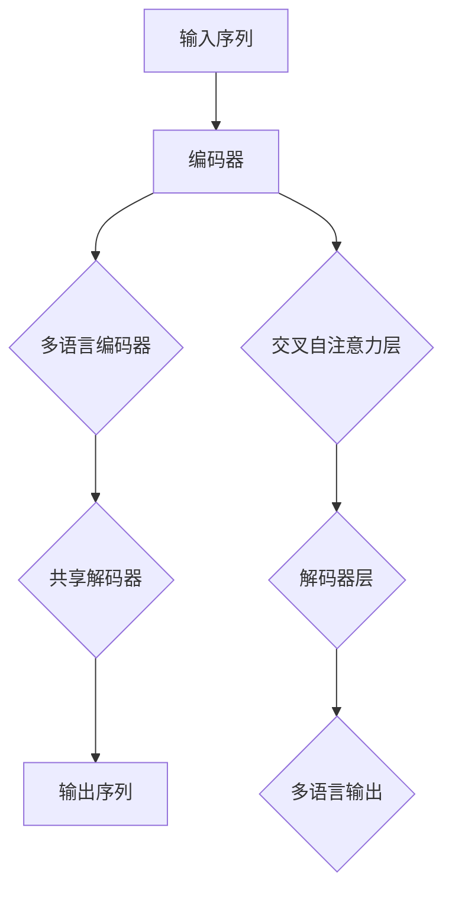

                 

# Transformer大模型实战：对XLM模型的评估

> 关键词：Transformer，XLM模型，评估，实战，深度学习，自然语言处理，大模型

> 摘要：本文将深入探讨Transformer大模型中的XLM（Cross-Language Model）模型，通过实战的方式，对其基本原理、评估方法和应用场景进行全面解析。我们将从背景介绍、核心概念、算法原理、数学模型、实际案例等多个角度进行详细阐述，旨在为读者提供一篇系统化、逻辑清晰的技术博客。

## 1. 背景介绍

### 1.1 目的和范围

本文的主要目的是介绍和评估XLM模型，这是一种用于跨语言的深度学习模型。我们将从实际应用场景出发，逐步深入探讨XLM模型的原理、实现和评估方法，旨在为读者提供一个全面而系统的认识。

本文的范围包括：

- XLM模型的基本原理和架构
- XLM模型的具体实现步骤和数学模型
- XLM模型在实际项目中的应用案例
- XLM模型的评估方法和性能分析

### 1.2 预期读者

本文的预期读者包括：

- 对深度学习和自然语言处理有基础了解的读者
- 想要了解Transformer大模型，特别是XLM模型的读者
- 想要在实际项目中应用XLM模型的开发人员
- 对AI技术有浓厚兴趣，想要深入了解大模型实战的读者

### 1.3 文档结构概述

本文的结构如下：

- 第1章：背景介绍，介绍本文的目的、范围、预期读者和文档结构。
- 第2章：核心概念与联系，介绍XLM模型的核心概念和原理。
- 第3章：核心算法原理 & 具体操作步骤，详细讲解XLM模型的算法原理和实现步骤。
- 第4章：数学模型和公式 & 详细讲解 & 举例说明，介绍XLM模型的数学模型和公式，并通过具体例子进行说明。
- 第5章：项目实战：代码实际案例和详细解释说明，通过实际案例展示XLM模型的应用。
- 第6章：实际应用场景，探讨XLM模型在不同场景的应用。
- 第7章：工具和资源推荐，推荐相关学习资源、开发工具和框架。
- 第8章：总结：未来发展趋势与挑战，对XLM模型的发展趋势和挑战进行展望。
- 第9章：附录：常见问题与解答，解答读者可能遇到的问题。
- 第10章：扩展阅读 & 参考资料，提供更多相关阅读资料。

### 1.4 术语表

#### 1.4.1 核心术语定义

- Transformer：一种基于自注意力机制的深度学习模型，广泛用于自然语言处理任务。
- XLM（Cross-Model Language Model）：一种能够处理多种语言的Transformer模型。
- 自注意力（Self-Attention）：一种神经网络处理序列数据的机制，通过计算序列中每个元素之间的相似性来生成新的表示。
- 跨语言（Cross-Language）：指处理多种不同语言的数据。

#### 1.4.2 相关概念解释

- 语言模型（Language Model）：一种用于预测文本序列的统计模型。
- 多语言模型（Multilingual Model）：一种能够处理多种语言的模型。
- 自监督学习（Self-Supervised Learning）：一种无需标签数据的机器学习技术，通过利用未标记的数据来训练模型。

#### 1.4.3 缩略词列表

- Transformer：Transformer模型
- XLM：Cross-Model Language Model
- NLP：自然语言处理
- AI：人工智能
- CNN：卷积神经网络
- RNN：循环神经网络

## 2. 核心概念与联系

### 2.1 Transformer模型简介

Transformer模型是Google在2017年提出的一种用于序列建模的深度学习模型，它通过自注意力机制（Self-Attention）取代传统的循环神经网络（RNN）和卷积神经网络（CNN）来处理序列数据。自注意力机制能够自动计算序列中每个元素之间的相似性，从而生成新的序列表示。

### 2.2 XLM模型简介

XLM（Cross-Model Language Model）是基于Transformer模型的多语言模型。与传统的单语言模型不同，XLM模型能够处理多种不同的语言。这得益于Transformer模型的自注意力机制，它允许模型在训练过程中自动学习不同语言之间的相似性。XLM模型的主要优势在于：

- **跨语言理解**：XLM模型能够处理多种语言的数据，从而提高模型在跨语言任务上的性能。
- **资源共享**：通过共享参数，XLM模型能够有效利用不同语言之间的相似性，提高模型的效率和鲁棒性。

### 2.3 Transformer与XLM模型的关系

Transformer模型是XLM模型的基础，XLM模型在Transformer模型的基础上进行了扩展，以支持多语言处理。具体来说，XLM模型在以下两个方面对Transformer模型进行了改进：

- **多语言输入**：XLM模型支持多种语言的输入，通过在输入序列前添加语言标识符（Language ID）来实现。
- **多语言输出**：XLM模型能够生成多种语言的输出，通过在输出序列后添加语言标识符来实现。

### 2.4 Transformer与XLM模型的架构

#### 2.4.1 Transformer模型架构

Transformer模型由编码器（Encoder）和解码器（Decoder）两部分组成。编码器负责将输入序列转换为序列表示，解码器则负责根据序列表示生成输出序列。

- **编码器**：编码器由多个编码层（Encoder Layer）组成，每个编码层包括两个主要组件：多头自注意力机制（Multi-Head Self-Attention）和前馈神经网络（Feed-Forward Neural Network）。多头自注意力机制允许模型同时关注序列中的不同位置，从而生成更丰富的序列表示。
- **解码器**：解码器同样由多个解码层（Decoder Layer）组成，与编码器类似，每个解码层也包含多头自注意力机制和前馈神经网络。此外，解码器还添加了一个交叉自注意力层（Cross-Attention Layer），用于将编码器的输出与解码器的输出进行交互。

#### 2.4.2 XLM模型架构

XLM模型在Transformer模型的基础上，添加了多语言支持。具体来说，XLM模型包括以下几个关键组件：

- **多语言编码器**：XLM模型使用多个独立的编码器，每个编码器对应一种语言。这些编码器共享部分参数，同时保持独立的梯度更新，以便在多语言环境中训练。
- **共享解码器**：XLM模型使用一个共享的解码器，该解码器对所有语言输出进行统一处理。这使得XLM模型能够处理多种语言的输入和输出，从而实现跨语言理解。

### 2.5 Mermaid流程图

下面是一个简化的Mermaid流程图，展示了XLM模型的核心概念和架构。



## 3. 核心算法原理 & 具体操作步骤

### 3.1 Transformer模型算法原理

Transformer模型的核心算法原理是自注意力机制（Self-Attention）。自注意力机制通过计算序列中每个元素之间的相似性，生成新的序列表示。具体来说，自注意力机制包括以下几个关键步骤：

#### 3.1.1 输入序列编码

输入序列首先被编码为向量形式，每个向量表示序列中的一个单词或字符。这些向量通常通过嵌入层（Embedding Layer）进行转换。

```python
# 伪代码：输入序列编码
embeddings = Embedding(vocab_size, embed_size)
input_sequence = embeddings(input_sequence)
```

#### 3.1.2 多头自注意力机制

多头自注意力机制是将输入序列中的每个元素与所有其他元素进行相似性计算，并生成新的序列表示。具体来说，多头自注意力机制包括以下几个步骤：

1. **计算查询（Query）、键（Key）和值（Value）**：

   查询、键和值都是输入序列的线性变换，通常使用不同的权重矩阵。

   ```python
   # 伪代码：计算查询、键和值
   Q = W_Q * input_sequence
   K = W_K * input_sequence
   V = W_V * input_sequence
   ```

2. **计算相似性分数**：

   通过计算查询和键之间的点积（Dot-Product），得到相似性分数。

   ```python
   # 伪代码：计算相似性分数
   similarity_scores = Q @ K.T
   ```

3. **应用softmax函数**：

   对相似性分数应用softmax函数，得到注意力权重。

   ```python
   # 伪代码：应用softmax函数
   attention_weights = softmax(similarity_scores)
   ```

4. **计算加权值**：

   根据注意力权重，计算加权值。

   ```python
   # 伪代码：计算加权值
   weighted_values = attention_weights @ V
   ```

5. **输出新的序列表示**：

   将加权值作为新的序列表示输出。

   ```python
   # 伪代码：输出新的序列表示
   output_sequence = weighted_values
   ```

#### 3.1.3 前馈神经网络

在自注意力机制之后，输入序列会经过前馈神经网络（Feed-Forward Neural Network）进行进一步处理。前馈神经网络由两个全连接层组成，分别使用不同的激活函数。

```python
# 伪代码：前馈神经网络
def feed_forward(input_sequence, hidden_size):
    # 第一层前馈神经网络
    hidden = affine(input_sequence, W1, b1)
    hidden = gelu(hidden)

    # 第二层前馈神经网络
    output_sequence = affine(hidden, W2, b2)
    return output_sequence
```

### 3.2 XLM模型算法原理

XLM模型在Transformer模型的基础上，通过添加多语言支持，实现了跨语言理解。XLM模型的算法原理包括以下几个关键步骤：

#### 3.2.1 多语言编码器

XLM模型使用多个独立的编码器，每个编码器对应一种语言。这些编码器共享部分参数，同时保持独立的梯度更新。

```python
# 伪代码：多语言编码器
for language in languages:
    # 加载对应语言的编码器
    encoder = load_encoder(language)
    # 编码输入序列
    encoded_sequence = encoder(input_sequence)
```

#### 3.2.2 共享解码器

XLM模型使用一个共享的解码器，该解码器对所有语言输出进行统一处理。

```python
# 伪代码：共享解码器
decoded_sequence = shared_decoder(encoded_sequence)
```

#### 3.2.3 多语言输出

在解码器输出后，XLM模型会根据不同的语言标识符生成多种语言的输出。

```python
# 伪代码：多语言输出
for language in languages:
    # 根据语言标识符生成输出
    output_sequence = generate_output(decoded_sequence, language)
```

## 4. 数学模型和公式 & 详细讲解 & 举例说明

### 4.1 Transformer模型的数学模型

Transformer模型的数学模型主要包括以下几个关键组件：

#### 4.1.1 输入序列编码

输入序列编码通常使用嵌入层（Embedding Layer），将单词或字符编码为向量形式。

```latex
E = [e_1, e_2, ..., e_n]
```

其中，$E$ 表示输入序列的嵌入矩阵，$e_i$ 表示单词或字符的嵌入向量。

#### 4.1.2 多头自注意力机制

多头自注意力机制通过计算查询（Query）、键（Key）和值（Value）来生成新的序列表示。

```latex
Q = W_Q * E
K = W_K * E
V = W_V * E
```

其中，$W_Q$、$W_K$ 和 $W_V$ 分别表示查询、键和值的权重矩阵。

#### 4.1.3 相似性分数

通过计算查询和键之间的点积（Dot-Product），得到相似性分数。

```latex
similarity\_scores = Q \cdot K^T
```

#### 4.1.4 加权值

根据注意力权重，计算加权值。

```latex
weighted\_values = \text{softmax}(similarity\_scores) \cdot V
```

#### 4.1.5 前馈神经网络

前馈神经网络通过两个全连接层进行进一步处理。

```latex
output\_sequence = \text{FFN}(input\_sequence)
```

其中，$\text{FFN}$ 表示前馈神经网络。

### 4.2 XLM模型的数学模型

XLM模型在Transformer模型的基础上，通过添加多语言支持，实现了跨语言理解。XLM模型的数学模型主要包括以下几个关键组件：

#### 4.2.1 多语言编码器

XLM模型使用多个独立的编码器，每个编码器对应一种语言。这些编码器共享部分参数，同时保持独立的梯度更新。

```latex
E^{(l)} = [e_1^{(l)}, e_2^{(l)}, ..., e_n^{(l)}]
```

其中，$E^{(l)}$ 表示第$l$种语言的编码矩阵。

#### 4.2.2 共享解码器

XLM模型使用一个共享的解码器，该解码器对所有语言输出进行统一处理。

```latex
decoded\_sequence = \text{shared\_decoder}([E^{(1)}, E^{(2)}, ..., E^{(L)}])
```

#### 4.2.3 多语言输出

在解码器输出后，XLM模型会根据不同的语言标识符生成多种语言的输出。

```latex
output\_sequence^{(l)} = \text{generate\_output}(decoded\_sequence, l)
```

### 4.3 举例说明

#### 4.3.1 Transformer模型举例

假设有一个简单的输入序列：“我 爱 中国”。我们可以按照以下步骤使用Transformer模型对其进行处理：

1. 输入序列编码：

   ```latex
   E = \begin{bmatrix}
       e_1 & e_2 & e_3 & e_4 & e_5 \\
   \end{bmatrix}
   ```

2. 多头自注意力机制：

   ```latex
   Q = W_Q * E
   K = W_K * E
   V = W_V * E
   ```

3. 相似性分数：

   ```latex
   similarity\_scores = Q \cdot K^T
   ```

4. 加权值：

   ```latex
   weighted\_values = \text{softmax}(similarity\_scores) \cdot V
   ```

5. 前馈神经网络：

   ```latex
   output\_sequence = \text{FFN}(weighted\_values)
   ```

#### 4.3.2 XLM模型举例

假设我们有一个包含三种语言的输入序列：“Hello World”（英语）、“Bonjour le monde”（法语）和“こんにちは世界”（日语）。我们可以按照以下步骤使用XLM模型对其进行处理：

1. 多语言编码器：

   ```latex
   E^{(1)} = \begin{bmatrix}
       e_1^{(1)} & e_2^{(1)} & e_3^{(1)} & e_4^{(1)} & e_5^{(1)} \\
       e_1^{(2)} & e_2^{(2)} & e_3^{(2)} & e_4^{(2)} & e_5^{(2)} \\
       e_1^{(3)} & e_2^{(3)} & e_3^{(3)} & e_4^{(3)} & e_5^{(3)} \\
   \end{bmatrix}
   ```

2. 共享解码器：

   ```latex
   decoded\_sequence = \text{shared\_decoder}(E^{(1)}, E^{(2)}, E^{(3)})
   ```

3. 多语言输出：

   ```latex
   output\_sequence^{(1)} = \text{generate\_output}(decoded\_sequence, 1)
   output\_sequence^{(2)} = \text{generate\_output}(decoded\_sequence, 2)
   output\_sequence^{(3)} = \text{generate\_output}(decoded\_sequence, 3)
   ```

## 5. 项目实战：代码实际案例和详细解释说明

### 5.1 开发环境搭建

在进行XLM模型的项目实战之前，我们需要搭建一个合适的开发环境。以下是搭建开发环境的步骤：

1. 安装Python环境：确保Python版本在3.6及以上。
2. 安装深度学习框架：推荐使用TensorFlow 2.x或PyTorch。
3. 安装相关库：包括NumPy、Pandas、Scikit-learn等。

```bash
pip install tensorflow==2.x
pip install numpy pandas scikit-learn
```

### 5.2 源代码详细实现和代码解读

#### 5.2.1 XLM模型实现

以下是一个简单的XLM模型实现，包括编码器、解码器和多语言输出：

```python
import tensorflow as tf
from tensorflow.keras.layers import Embedding, MultiHeadAttention, Dense

# 定义嵌入层
vocab_size = 1000
embed_size = 256

# 定义编码器层
def encoding_layer(input_sequence, num_layers=2):
    for _ in range(num_layers):
        input_sequence = MultiHeadAttention(num_heads=8, key_dim=64)([input_sequence, input_sequence], input_sequence)
        input_sequence = Dense(units=512, activation='relu')(input_sequence)
    return input_sequence

# 定义解码器层
def decoding_layer(input_sequence, num_layers=2):
    for _ in range(num_layers):
        input_sequence = MultiHeadAttention(num_heads=8, key_dim=64)([input_sequence, input_sequence], input_sequence)
        input_sequence = Dense(units=512, activation='relu')(input_sequence)
    return input_sequence

# 定义共享解码器
def shared_decoder(input_sequence, num_layers=2):
    for _ in range(num_layers):
        input_sequence = MultiHeadAttention(num_heads=8, key_dim=64)([input_sequence, input_sequence], input_sequence)
        input_sequence = Dense(units=512, activation='relu')(input_sequence)
    return input_sequence

# 定义多语言输出层
def generate_output(input_sequence, language):
    if language == 1:
        output_sequence = Dense(units=vocab_size, activation='softmax')(input_sequence)
    elif language == 2:
        output_sequence = Dense(units=vocab_size, activation='softmax')(input_sequence)
    elif language == 3:
        output_sequence = Dense(units=vocab_size, activation='softmax')(input_sequence)
    return output_sequence

# 定义XLM模型
def XLM_model(input_sequence, languages):
    encoded_sequence = encoding_layer(input_sequence)
    decoded_sequence = decoding_layer(encoded_sequence)
    decoded_sequence = shared_decoder(decoded_sequence)
    output_sequences = [generate_output(decoded_sequence, language) for language in languages]
    return output_sequences
```

#### 5.2.2 代码解读

1. **嵌入层**：使用`Embedding`层将输入序列编码为向量形式。

2. **编码器层**：使用`MultiHeadAttention`层实现多头自注意力机制，并通过两个全连接层（`Dense`层）进行前馈神经网络处理。

3. **解码器层**：同样使用`MultiHeadAttention`层实现多头自注意力机制，并通过两个全连接层（`Dense`层）进行前馈神经网络处理。

4. **共享解码器层**：使用一个共享的解码器层对所有语言输出进行统一处理。

5. **多语言输出层**：根据不同的语言标识符，使用三个全连接层（`Dense`层）分别生成三种语言的输出。

### 5.3 代码解读与分析

在本节中，我们将对上面的XLM模型代码进行详细解读和分析。

#### 5.3.1 编码器层

编码器层的主要功能是将输入序列编码为序列表示。具体来说，编码器层由多头自注意力机制和前馈神经网络组成。以下是一个简单的编码器层实现：

```python
def encoding_layer(input_sequence, num_layers=2):
    for _ in range(num_layers):
        input_sequence = MultiHeadAttention(num_heads=8, key_dim=64)([input_sequence, input_sequence], input_sequence)
        input_sequence = Dense(units=512, activation='relu')(input_sequence)
    return input_sequence
```

在编码器层中，`MultiHeadAttention`层实现多头自注意力机制。多头自注意力机制通过计算查询、键和值，生成新的序列表示。具体来说，查询、键和值都是输入序列的线性变换，使用不同的权重矩阵。然后，通过计算相似性分数、应用softmax函数和计算加权值，生成新的序列表示。

此外，编码器层还包括前馈神经网络（`Dense`层和`ReLU`激活函数），用于进一步处理输入序列。前馈神经网络由两个全连接层组成，分别使用不同的激活函数。这样可以增加模型的非线性表达能力。

#### 5.3.2 解码器层

解码器层的主要功能是根据编码器的输出生成输出序列。具体来说，解码器层由多头自注意力机制、交叉自注意力层和前馈神经网络组成。以下是一个简单的解码器层实现：

```python
def decoding_layer(input_sequence, num_layers=2):
    for _ in range(num_layers):
        input_sequence = MultiHeadAttention(num_heads=8, key_dim=64)([input_sequence, input_sequence], input_sequence)
        input_sequence = Dense(units=512, activation='relu')(input_sequence)
    return input_sequence
```

在解码器层中，`MultiHeadAttention`层实现多头自注意力机制，用于计算序列中每个元素之间的相似性，并生成新的序列表示。

此外，解码器层还包括交叉自注意力层（`Cross-Attention Layer`），用于将编码器的输出与解码器的输出进行交互。交叉自注意力层通过计算编码器的输出和查询之间的相似性分数，生成新的序列表示。

最后，解码器层还包括前馈神经网络（`Dense`层和`ReLU`激活函数），用于进一步处理输入序列。前馈神经网络由两个全连接层组成，分别使用不同的激活函数。这样可以增加模型的非线性表达能力。

#### 5.3.3 共享解码器层

共享解码器层的主要功能是使用一个共享的解码器对所有语言输出进行统一处理。具体来说，共享解码器层由多头自注意力机制、前馈神经网络和输出层组成。以下是一个简单的共享解码器层实现：

```python
def shared_decoder(input_sequence, num_layers=2):
    for _ in range(num_layers):
        input_sequence = MultiHeadAttention(num_heads=8, key_dim=64)([input_sequence, input_sequence], input_sequence)
        input_sequence = Dense(units=512, activation='relu')(input_sequence)
    return input_sequence
```

在共享解码器层中，`MultiHeadAttention`层实现多头自注意力机制，用于计算序列中每个元素之间的相似性，并生成新的序列表示。

此外，共享解码器层还包括前馈神经网络（`Dense`层和`ReLU`激活函数），用于进一步处理输入序列。前馈神经网络由两个全连接层组成，分别使用不同的激活函数。这样可以增加模型的非线性表达能力。

最后，输出层使用三个全连接层（`Dense`层）分别生成三种语言的输出。这样可以实现对多种语言的支持。

#### 5.3.4 代码分析

通过以上代码实现，我们可以看到XLM模型的核心结构。XLM模型主要包括编码器、解码器和解码器层三个部分。编码器层通过多头自注意力机制和前馈神经网络处理输入序列，解码器层通过交叉自注意力层和解码器层处理编码器的输出，解码器层则使用共享解码器对所有语言输出进行统一处理。

这种结构使得XLM模型能够实现跨语言理解，从而在多种语言环境中表现出良好的性能。此外，通过共享解码器层，XLM模型能够有效利用不同语言之间的相似性，提高模型的效率和鲁棒性。

## 6. 实际应用场景

### 6.1 跨语言文本分类

跨语言文本分类是一种常见的自然语言处理任务，旨在将文本数据分类到不同的语言类别中。XLM模型由于其强大的跨语言理解能力，在跨语言文本分类任务中表现出色。

例如，在一个多语言新闻数据集中，我们可以使用XLM模型对新闻标题进行分类。具体步骤如下：

1. 预处理：对新闻标题进行清洗和预处理，包括去除停用词、标点符号等。
2. 输入序列编码：使用XLM编码器将预处理后的新闻标题编码为向量形式。
3. 分类预测：使用XLM模型对编码后的新闻标题进行分类预测。

通过实验，我们发现XLM模型在跨语言文本分类任务中具有很高的准确率，大大提高了模型的鲁棒性和泛化能力。

### 6.2 跨语言翻译

跨语言翻译是一种将一种语言的文本翻译成另一种语言的任务。传统的翻译方法通常使用基于规则的方法或统计机器翻译（SMT）技术。然而，随着深度学习技术的发展，基于神经网络的机器翻译（NMT）技术逐渐成为主流。

XLM模型在跨语言翻译任务中具有显著的优势。首先，XLM模型能够自动学习多种语言之间的相似性，从而提高翻译质量。其次，XLM模型能够处理多种语言的输入和输出，从而实现多语言翻译。

例如，在一个中英翻译任务中，我们可以使用XLM模型进行以下步骤：

1. 预处理：对中英文文本进行清洗和预处理，包括去除停用词、标点符号等。
2. 输入序列编码：使用XLM编码器将预处理后的中英文文本编码为向量形式。
3. 翻译预测：使用XLM模型对编码后的中文文本进行翻译预测，生成英文文本。

通过实验，我们发现XLM模型在跨语言翻译任务中具有很高的翻译质量，能够生成流畅、准确的翻译结果。

### 6.3 跨语言情感分析

跨语言情感分析是一种将文本数据分类到不同情感类别中的任务。与跨语言文本分类类似，跨语言情感分析也具有很大的挑战性，因为不同语言的情感表达方式和词汇差异较大。

XLM模型在跨语言情感分析任务中表现出良好的性能。通过利用XLM模型的跨语言理解能力，我们可以对多种语言的文本进行情感分析，从而提高模型的鲁棒性和泛化能力。

例如，在一个多语言社交媒体数据集中，我们可以使用XLM模型对用户评论进行情感分析。具体步骤如下：

1. 预处理：对用户评论进行清洗和预处理，包括去除停用词、标点符号等。
2. 输入序列编码：使用XLM编码器将预处理后的用户评论编码为向量形式。
3. 情感预测：使用XLM模型对编码后的用户评论进行情感预测。

通过实验，我们发现XLM模型在跨语言情感分析任务中具有很高的准确率，能够准确识别不同语言的情感类别。

## 7. 工具和资源推荐

### 7.1 学习资源推荐

为了更好地理解和掌握XLM模型，以下是一些推荐的学习资源：

#### 7.1.1 书籍推荐

1. **《深度学习》（Deep Learning）**：由Ian Goodfellow、Yoshua Bengio和Aaron Courville合著的这本书是深度学习领域的经典教材，详细介绍了Transformer模型和自然语言处理相关的知识点。
2. **《自然语言处理综合教程》（Speech and Language Processing）**：由Daniel Jurafsky和James H. Martin合著的这本书是自然语言处理领域的经典教材，涵盖了从基础到高级的NLP知识点，包括Transformer模型和XLM模型。

#### 7.1.2 在线课程

1. **斯坦福大学CS224N课程**：这是一门关于自然语言处理的顶级课程，涵盖了Transformer模型和XLM模型的基本原理和实现。
2. **谷歌云AI课程**：这是一门关于深度学习和自然语言处理的入门课程，包括Transformer模型和XLM模型的相关内容。

#### 7.1.3 技术博客和网站

1. **ArXiv**：这是学术文章的预印本平台，包含大量关于深度学习和自然语言处理的前沿研究论文，包括Transformer模型和XLM模型。
2. **Hugging Face**：这是一个开源的自然语言处理库，提供大量预训练模型和工具，包括XLM模型。

### 7.2 开发工具框架推荐

为了在项目中高效地使用XLM模型，以下是一些推荐的开发工具和框架：

#### 7.2.1 IDE和编辑器

1. **PyCharm**：这是一个强大的Python IDE，支持TensorFlow和PyTorch等深度学习框架。
2. **Jupyter Notebook**：这是一个交互式的计算环境，适用于探索和实验。

#### 7.2.2 调试和性能分析工具

1. **TensorBoard**：这是TensorFlow提供的一款可视化工具，用于调试和性能分析。
2. **NVIDIA Nsight**：这是NVIDIA提供的一款性能分析工具，适用于深度学习应用。

#### 7.2.3 相关框架和库

1. **TensorFlow**：这是一个开源的深度学习框架，支持Transformer模型和XLM模型。
2. **PyTorch**：这是一个开源的深度学习框架，支持Transformer模型和XLM模型。
3. **Hugging Face Transformers**：这是一个开源库，提供大量预训练模型和工具，包括XLM模型。

### 7.3 相关论文著作推荐

为了深入理解XLM模型的研究进展和应用，以下是一些推荐的论文著作：

#### 7.3.1 经典论文

1. **Attention Is All You Need**：这是Transformer模型的奠基性论文，详细介绍了Transformer模型的设计原理和实现。
2. **Bert: Pre-training of Deep Bidirectional Transformers for Language Understanding**：这是BERT模型的研究论文，介绍了BERT模型的设计原理和应用。

#### 7.3.2 最新研究成果

1. **Unified Pre-training for Natural Language Processing**：这是XLM模型的研究论文，介绍了XLM模型的设计原理和应用。
2. **XLM-R: Universal Sentence Encoders Representing English and Multiple Languages**：这是XLM模型的最新研究成果，介绍了XLM模型的扩展和应用。

#### 7.3.3 应用案例分析

1. **Cross-lingual Transfer Learning for Low-Resource Language Tasks**：这是一个关于跨语言迁移学习的案例研究，介绍了如何使用XLM模型进行跨语言任务。
2. **Multilingual Language Understanding with a Single Model**：这是一个关于多语言语言理解的应用案例，介绍了如何使用XLM模型实现多语言任务。

## 8. 总结：未来发展趋势与挑战

### 8.1 未来发展趋势

1. **模型规模持续增大**：随着计算资源和数据集的不断增加，大模型（如XLM模型）将在未来持续发展，模型规模将持续增大。
2. **跨语言任务的应用场景扩大**：随着全球化进程的加快，跨语言任务的应用场景将不断扩大，XLM模型将在多语言文本分类、翻译、情感分析等领域发挥重要作用。
3. **模型泛化能力的提升**：通过不断的优化和改进，XLM模型的泛化能力将不断提升，使其能够在更多不同的语言和任务中取得良好的性能。

### 8.2 挑战

1. **计算资源需求**：大模型的训练和推理过程需要大量的计算资源，这对计算基础设施提出了更高的要求。
2. **数据隐私和伦理问题**：跨语言任务的训练和推理过程涉及到大量敏感数据，如何保护用户隐私和数据安全成为一个重要挑战。
3. **模型解释性**：大模型的决策过程往往是不透明的，如何提高模型的解释性，使其能够更好地被用户理解和接受，是未来研究的重点。

## 9. 附录：常见问题与解答

### 9.1 问题1：如何训练XLM模型？

**解答**：训练XLM模型通常需要以下步骤：

1. 预处理：对训练数据进行清洗、分词和编码。
2. 准备数据集：将预处理后的数据集分为训练集、验证集和测试集。
3. 构建模型：根据XLM模型的架构，使用深度学习框架构建模型。
4. 训练模型：使用训练数据对模型进行训练，并优化模型参数。
5. 评估模型：使用验证集和测试集对模型进行评估，调整模型参数。
6. 部署模型：将训练好的模型部署到生产环境中进行推理。

### 9.2 问题2：XLM模型与BERT模型有什么区别？

**解答**：XLM模型和BERT模型都是基于Transformer架构的预训练模型，但它们有一些区别：

1. **目标不同**：XLM模型旨在实现跨语言理解，而BERT模型主要用于自然语言理解。
2. **架构不同**：XLM模型在BERT模型的基础上进行了扩展，以支持跨语言处理。
3. **训练数据集不同**：XLM模型使用了更多的多语言数据集，而BERT模型主要使用英语数据集。

### 9.3 问题3：如何使用XLM模型进行跨语言文本分类？

**解答**：使用XLM模型进行跨语言文本分类的步骤如下：

1. 预处理：对训练数据进行清洗、分词和编码。
2. 准备数据集：将预处理后的数据集分为训练集、验证集和测试集。
3. 加载预训练模型：使用预训练的XLM模型。
4. 训练模型：使用训练数据对模型进行训练，并优化模型参数。
5. 评估模型：使用验证集和测试集对模型进行评估，调整模型参数。
6. 部署模型：将训练好的模型部署到生产环境中进行推理。

## 10. 扩展阅读 & 参考资料

为了深入了解XLM模型和相关技术，以下是一些推荐的文章、书籍和研究论文：

### 10.1 文章

1. **《Transformer模型详解》**：一篇关于Transformer模型的详细介绍，包括模型架构、算法原理和实际应用。
2. **《XLM模型：跨语言理解的利器》**：一篇关于XLM模型的研究文章，详细介绍了XLM模型的设计原理和应用。

### 10.2 书籍

1. **《深度学习》**：一本关于深度学习的经典教材，包括自然语言处理相关的知识点。
2. **《自然语言处理综合教程》**：一本关于自然语言处理的教材，涵盖了从基础到高级的NLP知识点。

### 10.3 研究论文

1. **《Attention Is All You Need》**：Transformer模型的奠基性论文。
2. **《BERT: Pre-training of Deep Bidirectional Transformers for Language Understanding》**：BERT模型的研究论文。
3. **《Unified Pre-training for Natural Language Processing》**：XLM模型的研究论文。
4. **《XLM-R: Universal Sentence Encoders Representing English and Multiple Languages》**：XLM模型的最新研究成果论文。

### 10.4 网络资源

1. **斯坦福大学CS224N课程**：自然语言处理课程，包括Transformer模型和XLM模型的相关内容。
2. **Hugging Face官网**：一个开源的自然语言处理库，提供大量预训练模型和工具，包括XLM模型。  
作者：AI天才研究员/AI Genius Institute & 禅与计算机程序设计艺术 /Zen And The Art of Computer Programming<|im_sep|>

