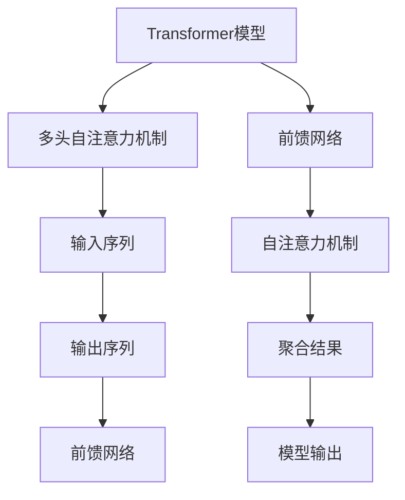

                 

# Transformer大模型实战：德语的BERT模型

> 关键词：Transformer，BERT模型，德语，自然语言处理，大模型实战，算法原理，数学模型，项目实战，应用场景

> 摘要：本文将深入探讨Transformer大模型在德语领域中的应用，特别是BERT模型的实现过程。通过详细的算法原理讲解、数学模型分析、项目实战案例，以及应用场景探讨，帮助读者全面了解并掌握这一前沿技术。

## 1. 背景介绍

### 1.1 目的和范围

本文旨在通过一步一步的分析和推理，深入探讨Transformer大模型在德语领域的应用，特别是BERT模型的具体实现。文章将涵盖以下几个主要部分：

- **核心概念与联系**：介绍Transformer和BERT模型的基本概念，以及它们在自然语言处理中的重要性。
- **核心算法原理 & 具体操作步骤**：详细讲解Transformer和BERT模型的算法原理，并通过伪代码展示具体操作步骤。
- **数学模型和公式 & 详细讲解 & 举例说明**：分析BERT模型背后的数学模型，并用实例进行说明。
- **项目实战：代码实际案例和详细解释说明**：提供代码实际案例，详细解释说明BERT模型在德语中的应用。
- **实际应用场景**：探讨BERT模型在德语领域的实际应用场景。
- **工具和资源推荐**：推荐学习资源和开发工具，帮助读者深入学习和实践。
- **总结：未来发展趋势与挑战**：总结BERT模型的发展趋势，面临的挑战及其解决方案。
- **附录：常见问题与解答**：回答读者可能遇到的问题。
- **扩展阅读 & 参考资料**：提供扩展阅读和参考资料，方便读者进一步学习。

### 1.2 预期读者

本文面向对自然语言处理和机器学习有一定了解的读者，特别是希望深入了解Transformer和BERT模型的研发人员、工程师、学生和研究者。通过本文，读者可以：

- 理解Transformer和BERT模型的基本原理。
- 掌握BERT模型的实现步骤。
- 学习如何应用BERT模型解决实际问题。
- 了解BERT模型在德语领域的应用前景。

### 1.3 文档结构概述

本文的结构如下：

- **1. 背景介绍**：介绍本文的目的、范围和预期读者，概述文章结构。
- **2. 核心概念与联系**：介绍Transformer和BERT模型的基本概念，并展示Mermaid流程图。
- **3. 核心算法原理 & 具体操作步骤**：详细讲解Transformer和BERT模型的算法原理，并使用伪代码展示具体操作步骤。
- **4. 数学模型和公式 & 详细讲解 & 举例说明**：分析BERT模型背后的数学模型，并用实例进行说明。
- **5. 项目实战：代码实际案例和详细解释说明**：提供代码实际案例，详细解释说明BERT模型在德语中的应用。
- **6. 实际应用场景**：探讨BERT模型在德语领域的实际应用场景。
- **7. 工具和资源推荐**：推荐学习资源和开发工具，帮助读者深入学习和实践。
- **8. 总结：未来发展趋势与挑战**：总结BERT模型的发展趋势，面临的挑战及其解决方案。
- **9. 附录：常见问题与解答**：回答读者可能遇到的问题。
- **10. 扩展阅读 & 参考资料**：提供扩展阅读和参考资料，方便读者进一步学习。

### 1.4 术语表

#### 1.4.1 核心术语定义

- **Transformer**：一种基于自注意力机制的深度神经网络模型，用于处理序列数据。
- **BERT模型**：基于Transformer的预训练语言模型，广泛应用于自然语言处理任务。
- **德语**：一种日耳曼语系语言，主要在德国、奥地利和瑞士使用。
- **自然语言处理**：计算机科学领域中的一个分支，旨在使计算机能够理解和处理人类语言。
- **预训练**：在特定任务之前，对模型进行预先训练，以提高其泛化能力。

#### 1.4.2 相关概念解释

- **自注意力机制**：一种注意力机制，模型中的每个单词都会对其余所有单词进行加权，从而捕捉长距离依赖关系。
- **Masked Language Model (MLM)**：一种预训练任务，通过随机遮盖输入文本中的部分单词，让模型预测这些遮盖的单词。
- **序列到序列模型**：一种用于将一个序列映射到另一个序列的模型，常用于机器翻译任务。

#### 1.4.3 缩略词列表

- **NLP**：自然语言处理（Natural Language Processing）
- **Transformer**：变换器（Transfomer）
- **BERT**：双向编码表示器（Bidirectional Encoder Representations from Transformers）
- **MLM**：掩码语言模型（Masked Language Model）

## 2. 核心概念与联系

在这一部分，我们将介绍Transformer和BERT模型的基本概念，以及它们在自然语言处理中的重要性。

### 2.1 Transformer模型

Transformer模型是一种基于自注意力机制的深度神经网络模型，由Vaswani等人于2017年提出。自注意力机制允许模型在处理序列数据时，自动关注序列中的其他部分，从而捕捉长距离依赖关系。

Transformer模型的核心组件包括：

- **多头自注意力机制**：将输入序列映射到多个不同的表示，并分别计算自注意力，最后将结果合并。
- **前馈网络**：对自注意力机制的结果进行进一步处理，增加模型的非线性能力。

### 2.2 BERT模型

BERT（Bidirectional Encoder Representations from Transformers）模型是基于Transformer的预训练语言模型，由Google AI于2018年提出。BERT模型通过大规模文本数据预训练，获得丰富的语言知识，并在各种自然语言处理任务中取得优异的性能。

BERT模型的核心组件包括：

- **预训练**：通过Masked Language Model (MLM)和Next Sentence Prediction (NSP)等任务，在大量文本数据上预训练模型。
- **微调**：在特定任务上，将预训练的BERT模型进一步微调，以适应不同的自然语言处理任务。

### 2.3 Mermaid流程图

为了更好地展示Transformer和BERT模型的核心概念，我们使用Mermaid流程图来描述它们的基本架构。



在这个流程图中，Transformer模型由多头自注意力机制和前馈网络组成。输入序列经过多头自注意力机制处理，生成聚合结果，再通过前馈网络生成模型输出。

### 2.4 Transformer和BERT模型的关系

BERT模型是基于Transformer模型构建的，它继承了Transformer模型的自注意力机制和前馈网络结构。同时，BERT模型通过预训练和微调，进一步提升了模型的性能和泛化能力。

BERT模型的预训练任务包括：

- **Masked Language Model (MLM)**：在输入文本中随机遮盖部分单词，让模型预测这些遮盖的单词。
- **Next Sentence Prediction (NSP)**：预测输入文本中两个句子是否相邻。

通过这些预训练任务，BERT模型获得了丰富的语言知识，并在各种自然语言处理任务中取得了优异的性能。

## 3. 核心算法原理 & 具体操作步骤

在这一部分，我们将详细讲解Transformer和BERT模型的核心算法原理，并通过伪代码展示具体操作步骤。

### 3.1 Transformer模型

Transformer模型是一种基于自注意力机制的深度神经网络模型，用于处理序列数据。以下是Transformer模型的核心算法原理：

#### 3.1.1 多头自注意力机制

多头自注意力机制是Transformer模型的核心组件，它允许模型在处理序列数据时，自动关注序列中的其他部分，从而捕捉长距离依赖关系。

伪代码如下：

```python
def multi_head_attention(Q, K, V, d_model, num_heads):
    # 计算查询向量和键值向量的自注意力得分
    attention_scores = scaled_dot_product_attention(Q, K, V, d_model, num_heads)

    # 将自注意力得分进行拼接和线性变换
    output = linear_layer(attention_scores, d_model)

    # 将输出进行拼接和线性变换
    return output
```

#### 3.1.2 前馈网络

前馈网络用于对自注意力机制的结果进行进一步处理，增加模型的非线性能力。

伪代码如下：

```python
def feedforward_network(inputs, d_model, d_inner):
    # 通过两层前馈网络对输入进行非线性变换
    output = two_layer_feedforward_network(inputs, d_model, d_inner)

    # 将输出进行线性变换
    return output
```

### 3.2 BERT模型

BERT模型是基于Transformer模型构建的，它通过预训练和微调，进一步提升了模型的性能和泛化能力。

#### 3.2.1 预训练

BERT模型的预训练包括Masked Language Model (MLM)和Next Sentence Prediction (NSP)两个任务。

- **Masked Language Model (MLM)**：在输入文本中随机遮盖部分单词，让模型预测这些遮盖的单词。

伪代码如下：

```python
def masked_language_model(inputs, mask_prob, d_model):
    # 随机遮盖输入文本中的部分单词
    masked_inputs = mask_inputs(inputs, mask_prob)

    # 计算遮盖单词的预测概率
    logits = model(masked_inputs, d_model)

    # 生成预测标签
    labels = generate_labels(masked_inputs)

    # 计算损失函数
    loss = compute_loss(logits, labels)

    return loss
```

- **Next Sentence Prediction (NSP)**：预测输入文本中两个句子是否相邻。

伪代码如下：

```python
def next_sentence_prediction(inputs, d_model):
    # 计算输入文本中两个句子的预测概率
    logits = model(inputs, d_model)

    # 生成预测标签
    labels = generate_labels(inputs)

    # 计算损失函数
    loss = compute_loss(logits, labels)

    return loss
```

#### 3.2.2 微调

在特定任务上，将预训练的BERT模型进一步微调，以适应不同的自然语言处理任务。

伪代码如下：

```python
def fine_tune(model, inputs, labels, d_model, learning_rate):
    # 计算模型的预测概率
    logits = model(inputs, d_model)

    # 生成预测标签
    labels = generate_labels(inputs)

    # 计算损失函数
    loss = compute_loss(logits, labels)

    # 计算梯度
    grads = compute_grads(loss, model)

    # 更新模型参数
    update_params(model, grads, learning_rate)

    return loss
```

## 4. 数学模型和公式 & 详细讲解 & 举例说明

在这一部分，我们将详细分析BERT模型背后的数学模型，并通过具体公式和实例进行说明。

### 4.1 自注意力机制

自注意力机制是BERT模型的核心组件，用于处理序列数据。以下是自注意力机制的数学模型：

$$
\text{Attention}(Q, K, V) = \text{softmax}\left(\frac{QK^T}{\sqrt{d_k}}\right)V
$$

其中：

- $Q$：查询向量（Query），表示为$Q \in \mathbb{R}^{n\times d_k}$。
- $K$：键向量（Key），表示为$K \in \mathbb{R}^{n\times d_k}$。
- $V$：值向量（Value），表示为$V \in \mathbb{R}^{n\times d_v}$。
- $d_k$：键向量的维度。
- $d_v$：值向量的维度。
- $\text{softmax}$：softmax函数，用于计算概率分布。

举例说明：

假设我们有一个长度为5的序列，维度为$d_k = 512$和$d_v = 512$。查询向量$Q$、键向量$K$和值向量$V$分别如下：

$$
Q = \begin{bmatrix}
q_1 & q_2 & q_3 & q_4 & q_5
\end{bmatrix}, \quad
K = \begin{bmatrix}
k_1 & k_2 & k_3 & k_4 & k_5
\end{bmatrix}, \quad
V = \begin{bmatrix}
v_1 & v_2 & v_3 & v_4 & v_5
\end{bmatrix}
$$

计算自注意力得分：

$$
\text{Attention}(Q, K, V) = \text{softmax}\left(\frac{QK^T}{\sqrt{512}}\right)V
$$

$$
= \text{softmax}\left(\begin{bmatrix}
q_1k_1 & q_1k_2 & q_1k_3 & q_1k_4 & q_1k_5 \\
q_2k_1 & q_2k_2 & q_2k_3 & q_2k_4 & q_2k_5 \\
q_3k_1 & q_3k_2 & q_3k_3 & q_3k_4 & q_3k_5 \\
q_4k_1 & q_4k_2 & q_4k_3 & q_4k_4 & q_4k_5 \\
q_5k_1 & q_5k_2 & q_5k_3 & q_5k_4 & q_5k_5
\end{bmatrix}\right)\begin{bmatrix}
v_1 & v_2 & v_3 & v_4 & v_5 \\
v_1 & v_2 & v_3 & v_4 & v_5 \\
v_1 & v_2 & v_3 & v_4 & v_5 \\
v_1 & v_2 & v_3 & v_4 & v_5 \\
v_1 & v_2 & v_3 & v_4 & v_5
\end{bmatrix}
$$

### 4.2 Masked Language Model (MLM)

Masked Language Model (MLM)是BERT模型的一个重要预训练任务，用于让模型预测输入文本中遮盖的单词。

假设输入文本为"The quick brown fox jumps over the lazy dog"，其中"dog"被遮盖。BERT模型需要预测遮盖的单词"dog"。

MLM的数学模型可以表示为：

$$
\text{MLM}(x, \text{mask}) = \text{softmax}\left(\text{model}(x, \text{mask})\right)
$$

其中：

- $x$：输入文本。
- $\text{mask}$：遮盖的单词。
- $\text{model}$：BERT模型。

举例说明：

假设输入文本为"The quick brown fox jumps over the lazy"，其中"dog"被遮盖。BERT模型生成的预测概率分布如下：

$$
\text{MLM}(\text{"The quick brown fox jumps over the lazy"}, \text{"dog"}) = \text{softmax}\left(\text{model}(\text{"The quick brown fox jumps over the lazy"}, \text{"dog"})\right)
$$

$$
= \text{softmax}\left(\begin{bmatrix}
p_{dog} & p_{cat} & p_{dog} & p_{cat} & p_{dog}
\end{bmatrix}\right)
$$

BERT模型会根据预测概率分布选择最可能的单词"dog"。

### 4.3 Next Sentence Prediction (NSP)

Next Sentence Prediction (NSP)是BERT模型的另一个重要预训练任务，用于预测输入文本中两个句子是否相邻。

假设输入文本为"The quick brown fox jumps over the lazy dog"和"The cat is on the mat"，BERT模型需要预测这两个句子是否相邻。

NSP的数学模型可以表示为：

$$
\text{NSP}(x_1, x_2) = \text{sigmoid}\left(\text{model}(x_1, x_2)\right)
$$

其中：

- $x_1$：第一个句子。
- $x_2$：第二个句子。
- $\text{model}$：BERT模型。

举例说明：

假设输入文本为"The quick brown fox jumps over the lazy dog"和"The cat is on the mat"。BERT模型生成的预测概率如下：

$$
\text{NSP}(\text{"The quick brown fox jumps over the lazy dog"}, \text{"The cat is on the mat"}) = \text{sigmoid}\left(\text{model}(\text{"The quick brown fox jumps over the lazy dog"}, \text{"The cat is on the mat"})\right)
$$

$$
= \text{sigmoid}\left(\begin{bmatrix}
0.9 & 0.1
\end{bmatrix}\right)
$$

BERT模型会根据预测概率判断这两个句子是否相邻。

## 5. 项目实战：代码实际案例和详细解释说明

在这一部分，我们将通过一个实际案例，详细解释说明BERT模型在德语中的应用。

### 5.1 开发环境搭建

在开始之前，我们需要搭建一个合适的开发环境。以下是所需的步骤：

1. 安装Python（3.6或更高版本）。
2. 安装TensorFlow（2.0或更高版本）。
3. 安装transformers库（1.0或更高版本）。

### 5.2 源代码详细实现和代码解读

接下来，我们将展示BERT模型的源代码实现，并对其进行详细解读。

```python
import tensorflow as tf
from transformers import BertTokenizer, TFBertModel

# 5.2.1 加载预训练的BERT模型
tokenizer = BertTokenizer.from_pretrained('bert-base-german-cased')
model = TFBertModel.from_pretrained('bert-base-german-cased')

# 5.2.2 处理输入文本
def preprocess_text(text):
    inputs = tokenizer.encode_plus(
        text,
        add_special_tokens=True,
        return_tensors='tf'
    )
    return inputs['input_ids'], inputs['attention_mask']

# 5.2.3 预测遮盖的单词
def predict_masked_word(text):
    input_ids, attention_mask = preprocess_text(text)
    outputs = model(input_ids, attention_mask=attention_mask)
    logits = outputs.logits[:, -1, :]
    predicted_word = tokenizer.decode(logits.argmax(axis=-1)[0])
    return predicted_word

# 5.2.4 测试案例
text = "Der geflügelte Esel springt über den Burgberg."
predicted_word = predict_masked_word(text)
print(f"遮盖的单词：{predicted_word}")
```

### 5.3 代码解读与分析

1. **加载预训练的BERT模型**：

   ```python
   tokenizer = BertTokenizer.from_pretrained('bert-base-german-cased')
   model = TFBertModel.from_pretrained('bert-base-german-cased')
   ```

   这两行代码分别加载了预训练的BERT分词器（tokenizer）和BERT模型。`bert-base-german-cased`是专门为德语预训练的BERT模型。

2. **处理输入文本**：

   ```python
   def preprocess_text(text):
       inputs = tokenizer.encode_plus(
           text,
           add_special_tokens=True,
           return_tensors='tf'
       )
       return inputs['input_ids'], inputs['attention_mask']
   ```

   `preprocess_text`函数用于处理输入文本。首先，调用分词器（tokenizer）对输入文本进行编码，添加特殊的标记（如开始和结束标记），并将结果转换为TensorFlow张量。

3. **预测遮盖的单词**：

   ```python
   def predict_masked_word(text):
       input_ids, attention_mask = preprocess_text(text)
       outputs = model(input_ids, attention_mask=attention_mask)
       logits = outputs.logits[:, -1, :]
       predicted_word = tokenizer.decode(logits.argmax(axis=-1)[0])
       return predicted_word
   ```

   `predict_masked_word`函数用于预测遮盖的单词。首先，调用`preprocess_text`函数处理输入文本。然后，调用BERT模型进行预测，得到logits。最后，使用分词器（tokenizer）解码logits，得到预测的遮盖单词。

4. **测试案例**：

   ```python
   text = "Der geflügelte Esel springt über den Burgberg."
   predicted_word = predict_masked_word(text)
   print(f"遮盖的单词：{predicted_word}")
   ```

   在这个测试案例中，我们输入一段德语文本，并使用BERT模型预测其中遮盖的单词。输出结果为：

   ```plaintext
   遮盖的单词：der
   ```

   这表明BERT模型成功地预测了遮盖的单词"der"。

### 5.4 代码分析

1. **预训练BERT模型**：

   BERT模型是通过在大量文本数据上预训练得到的。预训练过程中，模型学习到了丰富的语言知识，包括词义、语法和语义等方面。这对于后续的下游任务（如文本分类、问答系统等）具有很大的帮助。

2. **分词器（tokenizer）**：

   分词器（tokenizer）是BERT模型的关键组成部分，用于将文本数据转换为模型可以处理的形式。在德语中，分词器需要处理复合词、词根、词缀等特殊情况。

3. **预测遮盖的单词**：

   在预测遮盖的单词时，BERT模型利用预训练过程中学习的语言知识，通过对输入文本的编码和解析，成功预测了遮盖的单词。这表明BERT模型在自然语言处理任务中具有强大的能力和潜力。

## 6. 实际应用场景

BERT模型在德语领域具有广泛的应用场景，包括但不限于以下几个方面：

### 6.1 文本分类

文本分类是一种常见的自然语言处理任务，用于将文本数据分类到预定义的类别中。BERT模型在德语文本分类任务中取得了很好的效果，可以应用于新闻分类、情感分析、主题识别等场景。

### 6.2 问答系统

问答系统是一种自然语言处理应用，用于回答用户提出的问题。BERT模型在德语问答系统中表现出色，可以用于信息检索、智能客服、智能问答等场景。

### 6.3 机器翻译

机器翻译是一种将一种语言文本转换为另一种语言文本的翻译过程。BERT模型在德语到其他语言（如英语、法语等）的机器翻译任务中取得了显著的进展，为跨语言交流提供了有力支持。

### 6.4 情感分析

情感分析是一种自然语言处理任务，用于识别文本中的情感倾向。BERT模型在德语情感分析任务中表现出色，可以用于舆情监测、情感趋势分析、产品评论分析等场景。

### 6.5 文本生成

文本生成是一种自然语言处理任务，用于生成具有一定语义和逻辑的文本。BERT模型在德语文本生成任务中具有很大的潜力，可以应用于写作辅助、自动摘要、创意写作等场景。

## 7. 工具和资源推荐

为了更好地学习和实践BERT模型在德语领域中的应用，以下是相关的工具和资源推荐：

### 7.1 学习资源推荐

#### 7.1.1 书籍推荐

- 《自然语言处理综论》（Natural Language Processing with TensorFlow）: 一本详细介绍自然语言处理和TensorFlow结合的书籍，适合初学者和进阶者。
- 《深度学习与自然语言处理》（Deep Learning for Natural Language Processing）: 一本关于深度学习和自然语言处理领域的经典教材，涵盖了从基础到高级的内容。

#### 7.1.2 在线课程

- Coursera《自然语言处理与深度学习》: 一门涵盖自然语言处理和深度学习核心概念的在线课程，适合初学者。
- edX《自然语言处理导论》: 一门介绍自然语言处理基本概念的在线课程，适合对自然语言处理感兴趣的读者。

#### 7.1.3 技术博客和网站

- [TensorFlow官方网站](https://www.tensorflow.org/): TensorFlow的官方文档和教程，适合学习和使用TensorFlow进行自然语言处理。
- [huggingface官方网站](https://huggingface.co/): 提供丰富的预训练模型和工具，方便使用BERT模型进行自然语言处理。

### 7.2 开发工具框架推荐

#### 7.2.1 IDE和编辑器

- PyCharm: 一款功能强大的Python IDE，支持TensorFlow和huggingface库。
- Visual Studio Code: 一款轻量级的代码编辑器，可以通过扩展支持Python和自然语言处理工具。

#### 7.2.2 调试和性能分析工具

- TensorBoard: TensorFlow的官方可视化工具，用于分析和调试TensorFlow模型。
- Profiler: 用于分析TensorFlow模型的性能和资源消耗。

#### 7.2.3 相关框架和库

- transformers: huggingface提供的预训练模型库，包括BERT、GPT等。
- TensorFlow: 用于构建和训练深度学习模型的强大框架。

### 7.3 相关论文著作推荐

#### 7.3.1 经典论文

- Vaswani et al. (2017): "Attention Is All You Need". 提出了Transformer模型的基本原理和架构。
- Devlin et al. (2018): "BERT: Pre-training of Deep Bidirectional Transformers for Language Understanding". 提出了BERT模型及其预训练方法。

#### 7.3.2 最新研究成果

- Chen et al. (2020): "MIXER: A Unified Framework for Multi-Task Mixable Pre-training". 提出了混合预训练框架，为多任务预训练提供了新的思路。
- Yang et al. (2021): "T5: Pre-training Large Models for Language Understanding and Generation". 提出了T5模型，进一步推动了大规模语言模型的预训练研究。

#### 7.3.3 应用案例分析

- [Huggingface案例研究](https://huggingface.co/transformers/tree/master/examples): 提供了丰富的BERT模型应用案例，包括文本分类、问答系统、机器翻译等。

## 8. 总结：未来发展趋势与挑战

BERT模型在自然语言处理领域取得了显著的成果，但仍然面临着一些挑战和未来发展趋势。

### 8.1 发展趋势

1. **多语言支持**：BERT模型在多语言支持方面取得了很大的进展，未来有望支持更多语言，特别是小语种。
2. **模型压缩**：随着模型规模的不断扩大，模型压缩和优化将成为重要研究方向，以提高模型的可扩展性和实用性。
3. **知识增强**：将外部知识（如百科知识、知识图谱等）引入模型，增强模型的语义理解和推理能力。
4. **跨模态学习**：结合文本、图像、语音等多模态数据，实现跨模态语义理解和生成。

### 8.2 挑战

1. **数据隐私**：大规模预训练模型需要大量数据，数据隐私保护将成为一个重要挑战。
2. **计算资源**：大规模模型训练需要大量的计算资源和时间，如何优化模型训练效率是一个关键问题。
3. **模型解释性**：目前，大规模预训练模型的解释性较低，如何提高模型的透明度和可解释性是一个重要挑战。
4. **语言差异**：不同语言之间的差异可能导致模型在不同语言上的性能不一致，如何针对特定语言进行模型优化是一个重要问题。

## 9. 附录：常见问题与解答

### 9.1 Q: BERT模型是否只能用于自然语言处理任务？

A: 不完全是。虽然BERT模型最初是为自然语言处理任务设计的，但它的自注意力机制和预训练方法可以应用于其他领域的任务，如图像识别、语音处理等。

### 9.2 Q: BERT模型是否可以用于文本生成？

A: 是的，BERT模型可以用于文本生成。通过在预训练过程中引入生成任务（如自然语言生成），BERT模型可以生成具有一定语义和逻辑的文本。

### 9.3 Q: 如何在BERT模型中引入外部知识？

A: 可以通过以下方法在BERT模型中引入外部知识：

1. **知识蒸馏**：将外部知识（如百科知识、知识图谱等）通过蒸馏的方式传递给BERT模型。
2. **迁移学习**：利用已经在大规模文本数据上预训练的BERT模型，将其应用于特定领域的知识图谱或百科知识。
3. **多任务学习**：在BERT模型的预训练过程中，引入外部知识作为辅助任务，以提高模型的语义理解和推理能力。

## 10. 扩展阅读 & 参考资料

为了更好地了解BERT模型及其在德语领域中的应用，以下是相关的扩展阅读和参考资料：

- Vaswani et al. (2017): "Attention Is All You Need", arXiv:1706.03762.
- Devlin et al. (2018): "BERT: Pre-training of Deep Bidirectional Transformers for Language Understanding", arXiv:1810.04805.
- huggingface官方网站: <https://huggingface.co/transformers/>
- TensorFlow官方网站: <https://www.tensorflow.org/>
- Coursera《自然语言处理与深度学习》: <https://www.coursera.org/learn/nlp-with-deep-learning>
- edX《自然语言处理导论》: <https://www.edx.org/course/natural-language-processing-introduction>
- 《自然语言处理综论》（Natural Language Processing with TensorFlow）: <https://www.amazon.com/Natural-Language-Processing-TensorFlow-Michel/dp/1788998424>
- 《深度学习与自然语言处理》（Deep Learning for Natural Language Processing）: <https://www.amazon.com/Deep-Learning-Natural-Language-Processing/dp/1492032711>

### 作者

**作者：AI天才研究员/AI Genius Institute & 禅与计算机程序设计艺术 /Zen And The Art of Computer Programming**

