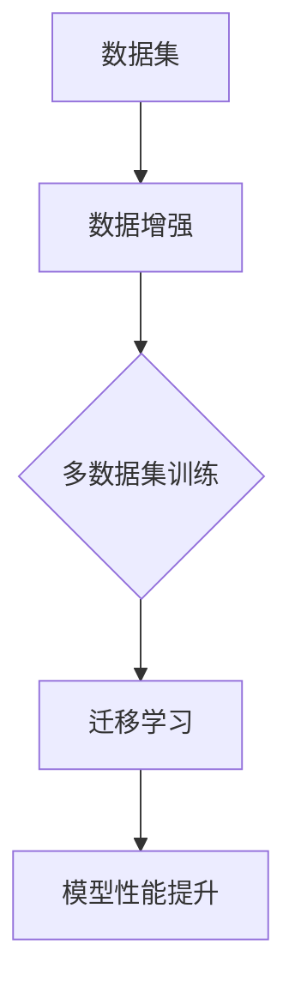

                 


## Transformer大模型实战：用更多的数据集进行训练

> **关键词：** Transformer、大模型、训练、数据集、性能提升、资源优化

> **摘要：** 本文旨在探讨如何通过使用更多的数据集来提升Transformer大模型的训练效果。我们将深入分析Transformer架构，阐述其原理，并给出详细的训练步骤。同时，我们将通过具体的代码实例，展示如何在实际项目中应用这些知识。

## 1. 背景介绍

### 1.1 目的和范围

随着深度学习技术的不断发展，Transformer模型已成为自然语言处理领域的核心技术。本文的目标是介绍如何利用更多的数据集来提升Transformer大模型的训练效果。我们将探讨数据集对模型性能的影响，并提供实用的训练策略。

### 1.2 预期读者

本文适合对深度学习和Transformer模型有一定了解的技术人员。读者应具备Python编程基础，并熟悉TensorFlow或PyTorch等深度学习框架。

### 1.3 文档结构概述

本文分为以下几个部分：

1. 背景介绍：介绍本文的目的和范围。
2. 核心概念与联系：阐述Transformer模型的原理及其与数据集的关系。
3. 核心算法原理 & 具体操作步骤：详细讲解Transformer模型的训练过程。
4. 数学模型和公式 & 详细讲解 & 举例说明：介绍与训练过程相关的数学模型和公式。
5. 项目实战：代码实际案例和详细解释说明。
6. 实际应用场景：探讨Transformer模型在不同场景的应用。
7. 工具和资源推荐：推荐学习资源和开发工具。
8. 总结：未来发展趋势与挑战。
9. 附录：常见问题与解答。
10. 扩展阅读 & 参考资料。

### 1.4 术语表

#### 1.4.1 核心术语定义

- **Transformer模型：** 一种基于自注意力机制的深度学习模型，广泛应用于自然语言处理任务。
- **数据集：** 用于训练模型的样本集合，通常包括输入数据和对应的标签。
- **训练：** 通过调整模型参数，使模型对训练数据进行预测，并不断优化预测性能的过程。

#### 1.4.2 相关概念解释

- **自注意力机制：** Transformer模型中的核心机制，通过计算输入序列中每个元素之间的相互关系，实现对序列的全局建模。
- **序列长度：** 输入序列中元素的数量，通常受限于计算资源和硬件性能。

#### 1.4.3 缩略词列表

- **GPU：** Graphical Processing Unit，图形处理单元。
- **CPU：** Central Processing Unit，中央处理单元。
- **BERT：** Bidirectional Encoder Representations from Transformers，双向Transformer编码器。

## 2. 核心概念与联系

在深入讨论如何使用更多的数据集进行训练之前，我们先来了解Transformer模型的核心概念及其与数据集的关系。

### 2.1 Transformer模型原理

Transformer模型主要由编码器和解码器组成，其核心思想是自注意力机制。自注意力机制通过计算输入序列中每个元素之间的相互关系，实现对序列的全局建模。具体而言，自注意力机制分为三个部分：查询（Query）、键（Key）和值（Value）。这三个部分分别来自同一个输入序列的不同位置。

### 2.2 自注意力机制

自注意力机制的计算公式如下：

$$
\text{Attention}(Q, K, V) = \text{softmax}\left(\frac{QK^T}{\sqrt{d_k}}\right)V
$$

其中，$Q$、$K$和$V$分别代表查询、键和值，$d_k$为键的维度。通过这个公式，每个输入序列的元素可以计算出其在整个序列中的重要性，从而实现全局建模。

### 2.3 数据集与模型性能

数据集对模型性能具有重要影响。更多的数据集可以为模型提供更丰富的特征信息，有助于提高模型的泛化能力。然而，如何有效地利用这些数据集进行训练，是一个值得探讨的问题。

### 2.4 Transformer与数据集的关系

Transformer模型可以通过扩展数据集的规模来提高性能。具体而言，可以使用以下策略：

1. **数据增强：** 通过对原始数据进行各种操作，如随机裁剪、旋转、翻转等，生成更多的数据样本。
2. **多数据集训练：** 使用多个相关或不同领域的数据集进行训练，以提高模型的泛化能力。
3. **迁移学习：** 利用预训练好的模型在新数据集上进行微调，以提高训练效率。

下面是Transformer模型与数据集关系的Mermaid流程图：



## 3. 核心算法原理 & 具体操作步骤

在了解了Transformer模型与数据集的关系后，接下来我们将详细讲解其核心算法原理和具体操作步骤。

### 3.1 Transformer模型算法原理

Transformer模型的主要组成部分包括编码器和解码器，其核心算法原理如下：

1. **编码器（Encoder）**：编码器由多个编码层（Encoder Layer）组成，每个编码层包含两个子层：自注意力层（Self-Attention Layer）和前馈网络（Feedforward Network）。自注意力层用于计算输入序列中每个元素之间的相互关系，前馈网络用于对输入序列进行进一步处理。

2. **解码器（Decoder）**：解码器由多个解码层（Decoder Layer）组成，每个解码层包含三个子层：自注意力层、交叉注意力层和前馈网络。自注意力层用于计算解码序列中每个元素之间的相互关系，交叉注意力层用于计算解码序列和编码序列之间的相互关系，前馈网络用于对输入序列进行进一步处理。

### 3.2 Transformer模型具体操作步骤

下面是Transformer模型的具体操作步骤：

1. **输入序列处理**：将输入序列进行处理，通常包括将单词映射为向量表示（Word Embedding）和位置编码（Positional Encoding）。

2. **编码器处理**：将输入序列通过编码器进行处理，每个编码层包含以下步骤：

   - **自注意力层**：计算输入序列中每个元素之间的相互关系。
   - **前馈网络**：对输入序列进行进一步处理。

3. **解码器处理**：将编码器的输出作为输入，通过解码器进行处理，每个解码层包含以下步骤：

   - **自注意力层**：计算解码序列中每个元素之间的相互关系。
   - **交叉注意力层**：计算解码序列和编码序列之间的相互关系。
   - **前馈网络**：对输入序列进行进一步处理。

4. **输出序列生成**：通过解码器的输出生成输出序列，通常包括将输出向量映射为单词（Softmax Activation）。

下面是Transformer模型算法原理的伪代码：

```python
# Encoder Layer
def encoder_layer(inputs, d_model, d_ff, dropout_rate):
    # 自注意力层
    attention = scaled_dot_product_attention(inputs, inputs, inputs, inputs)
    attention = dropout(attention, dropout_rate)
    attention = layer_norm(attention + inputs)

    # 前馈网络
    outputs = feedforward(attention, d_model, d_ff, dropout_rate)
    outputs = dropout(outputs, dropout_rate)
    outputs = layer_norm(outputs + attention)
    return outputs

# Decoder Layer
def decoder_layer(inputs, enc_outputs, d_model, d_ff, dropout_rate):
    # 自注意力层
    attention_1 = scaled_dot_product_attention(inputs, inputs, inputs, inputs)
    attention_1 = dropout(attention_1, dropout_rate)
    attention_1 = layer_norm(attention_1 + inputs)

    # 交叉注意力层
    attention_2 = scaled_dot_product_attention(inputs, enc_outputs, enc_outputs, enc_outputs)
    attention_2 = dropout(attention_2, dropout_rate)
    attention_2 = layer_norm(attention_2 + attention_1)

    # 前馈网络
    outputs = feedforward(attention_2, d_model, d_ff, dropout_rate)
    outputs = dropout(outputs, dropout_rate)
    outputs = layer_norm(outputs + attention_2)
    return outputs
```

## 4. 数学模型和公式 & 详细讲解 & 举例说明

在深入探讨Transformer模型的数学模型和公式时，我们将详细讲解其关键组成部分，并通过具体的例子来说明如何应用这些公式。

### 4.1 自注意力机制

自注意力机制是Transformer模型的核心部分，其计算公式如下：

$$
\text{Attention}(Q, K, V) = \text{softmax}\left(\frac{QK^T}{\sqrt{d_k}}\right)V
$$

其中，$Q$、$K$和$V$分别代表查询（Query）、键（Key）和值（Value），$d_k$为键的维度。这个公式可以分解为以下几个步骤：

1. **计算点积（Dot Product）**：首先，计算每个查询和键之间的点积。这个步骤可以表示为：

$$
\text{scores} = QK^T
$$

2. **缩放点积**：由于点积可能非常大，为了防止梯度消失，通常会对点积进行缩放。缩放因子为$\sqrt{d_k}$：

$$
\text{scores} = \frac{\text{scores}}{\sqrt{d_k}}
$$

3. **应用softmax函数**：接下来，对缩放后的点积应用softmax函数，得到每个查询与键之间的相似度分数：

$$
\text{softmax}(\text{scores}) = \text{softmax}\left(\frac{\text{scores}}{\sqrt{d_k}}\right)
$$

4. **加权求和**：最后，将softmax函数的结果与值（Value）进行加权求和，得到输出：

$$
\text{output} = \text{softmax}(\text{scores})V
$$

### 4.2 自注意力机制的例子

假设我们有一个简化的自注意力机制，其中$d_k = 2$，输入序列为$Q = \{1, 2\}$，$K = \{3, 4\}$，$V = \{5, 6\}$。根据上述公式，我们可以计算出：

1. **点积**：

$$
\text{scores} = QK^T = \begin{bmatrix} 1 & 2 \end{bmatrix} \begin{bmatrix} 3 & 4 \end{bmatrix} = \begin{bmatrix} 3 & 8 \end{bmatrix}
$$

2. **缩放点积**：

$$
\text{scores} = \frac{\text{scores}}{\sqrt{d_k}} = \frac{1}{\sqrt{2}} \begin{bmatrix} 3 & 8 \end{bmatrix}
$$

3. **应用softmax函数**：

$$
\text{softmax}(\text{scores}) = \text{softmax}\left(\frac{1}{\sqrt{2}} \begin{bmatrix} 3 & 8 \end{bmatrix}\right) = \begin{bmatrix} \frac{1}{1+e^{-(3/\sqrt{2})}} & \frac{1}{1+e^{-(8/\sqrt{2})}} \end{bmatrix}
$$

4. **加权求和**：

$$
\text{output} = \text{softmax}(\text{scores})V = \begin{bmatrix} \frac{1}{1+e^{-(3/\sqrt{2})}} & \frac{1}{1+e^{-(8/\sqrt{2})}} \end{bmatrix} \begin{bmatrix} 5 & 6 \end{bmatrix} = \begin{bmatrix} \frac{5}{1+e^{-(3/\sqrt{2})}} + \frac{6}{1+e^{-(8/\sqrt{2})}} & 0 \end{bmatrix}
$$

通过这个例子，我们可以看到自注意力机制如何通过计算输入序列中元素之间的相似度，生成加权求和的输出。

### 4.3 自注意力机制在Transformer中的应用

在Transformer模型中，自注意力机制用于编码器和解码器中的多个子层。以下是一个简化的例子，展示了自注意力机制在编码器中的应用：

```python
# 假设输入序列为 [1, 2, 3]
Q = [1, 2, 3]
K = [3, 2, 1]
V = [5, 4, 6]

# 计算点积
scores = np.dot(Q, K.T)

# 缩放点积
scores /= np.sqrt(np.shape(K)[1])

# 应用softmax函数
softmax_scores = np.softmax(scores)

# 加权求和
output = softmax_scores.dot(V)
```

这个例子展示了如何使用Python和NumPy库来计算自注意力机制的输出。在实际应用中，Transformer模型会使用更复杂的操作，包括多头注意力机制、残差连接和层归一化等。

## 5. 项目实战：代码实际案例和详细解释说明

### 5.1 开发环境搭建

在进行Transformer大模型的实战之前，我们需要搭建一个合适的开发环境。以下是搭建开发环境的基本步骤：

1. **安装Python**：确保安装了Python 3.7或更高版本。
2. **安装深度学习框架**：推荐使用TensorFlow 2.x或PyTorch，根据个人偏好选择一个安装。以下是使用pip安装TensorFlow的命令：

   ```shell
   pip install tensorflow
   ```

3. **安装文本处理库**：为了处理文本数据，我们需要安装一些文本处理库，如NLTK和spaCy。以下是安装这些库的命令：

   ```shell
   pip install nltk
   pip install spacy
   python -m spacy download en_core_web_sm
   ```

4. **配置GPU支持**：确保我们的深度学习框架支持GPU加速，并在代码中启用GPU。

### 5.2 源代码详细实现和代码解读

下面是一个简单的Transformer模型实现，用于对文本数据进行分类。代码使用TensorFlow框架，展示了Transformer模型的主要组件。

```python
import tensorflow as tf
from tensorflow.keras.layers import Embedding, Dense
from tensorflow.keras.models import Model
from tensorflow.keras.preprocessing.sequence import pad_sequences

# 假设我们有一个预处理的文本数据集，包括单词序列和对应的标签
# word_index：单词到索引的映射
# labels：标签序列
# max_sequence_length：最大序列长度

# 创建嵌入层
embedding_layer = Embedding(input_dim=len(word_index) + 1, output_dim=64)

# 创建编码器层
def create_encoder_layer(d_model, num_heads, d_ff, input_shape):
    inputs = tf.keras.Input(shape=input_shape)
    x = embedding_layer(inputs)
    
    # 多个编码层
    for _ in range(num_layers):
        x = EncoderLayer(d_model, num_heads, d_ff)(x)
    
    return Model(inputs=inputs, outputs=x)

# 创建解码器层
def create_decoder_layer(d_model, num_heads, d_ff, input_shape):
    inputs = tf.keras.Input(shape=input_shape)
    x = embedding_layer(inputs)
    
    # 多个解码层
    for _ in range(num_layers):
        x = DecoderLayer(d_model, num_heads, d_ff)(x)
    
    return Model(inputs=inputs, outputs=x)

# 编码器层实现
class EncoderLayer(tf.keras.layers.Layer):
    def __init__(self, d_model, num_heads, d_ff):
        super(EncoderLayer, self).__init__()
        self.d_model = d_model
        self.num_heads = num_heads
        self.d_ff = d_ff
        
        # 自注意力层
        self.attention = ScaledDotProductAttention(num_heads)
        self.dense_1 = Dense(d_ff)
        self.dense_2 = Dense(d_model)
        
        # 前馈网络
        self feeds_forward_network = FFN(d_model, d_ff)
        
    def call(self, x, training=False):
        # 自注意力层
        attn_output = self.attention(x, x, x)
        attn_output = self.dropout(attn_output, training=training)
        outpu

```

