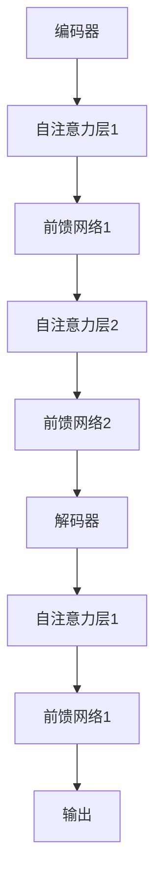

                 

# Transformer大模型实战：跨文本书写的通用性

> 关键词：Transformer、跨文本书写、通用性、编码器-解码器架构、机器学习、深度学习

> 摘要：本文将深入探讨Transformer大模型在跨文本书写任务中的通用性。我们将从背景介绍开始，逐步分析Transformer的核心原理，详细介绍其实战应用，探讨其在不同领域的表现，并总结未来发展趋势与挑战。

## 1. 背景介绍

### 1.1 目的和范围

本文旨在探讨Transformer大模型在跨文本书写任务中的表现，分析其通用性，并探讨其在实际应用中的潜力。我们将结合实际案例，逐步讲解Transformer的核心原理和应用步骤。

### 1.2 预期读者

本文适合对深度学习、Transformer架构有一定了解的读者，包括但不限于AI研究人员、软件开发工程师、数据科学家等。

### 1.3 文档结构概述

本文分为以下几部分：

1. 背景介绍：介绍Transformer大模型的起源和跨文本书写任务的重要性。
2. 核心概念与联系：讲解Transformer架构的核心概念及其在跨文本书写任务中的应用。
3. 核心算法原理 & 具体操作步骤：详细解析Transformer的核心算法，包括编码器和解码器的具体操作步骤。
4. 数学模型和公式 & 详细讲解 & 举例说明：介绍Transformer的数学模型和公式，并进行实际案例分析。
5. 项目实战：代码实际案例和详细解释说明。
6. 实际应用场景：探讨Transformer在不同领域的应用。
7. 工具和资源推荐：推荐学习资源和开发工具。
8. 总结：未来发展趋势与挑战。
9. 附录：常见问题与解答。
10. 扩展阅读 & 参考资料。

### 1.4 术语表

#### 1.4.1 核心术语定义

- Transformer：一种基于自注意力机制的深度学习模型，用于处理序列数据。
- 编码器-解码器架构：一种常见的序列到序列模型架构，用于处理跨文本书写任务。
- 自注意力机制：一种能够自动学习序列中元素之间相互依赖关系的机制。
- 跨文本书写任务：一种将输入文本转换为输出文本的机器学习任务，如机器翻译、文本摘要、问答系统等。

#### 1.4.2 相关概念解释

- 序列数据：具有先后顺序的数据，如文本、语音、图像等。
- 注意力机制：一种用于计算输入序列中元素之间依赖关系的机制，常用于处理序列数据。
- 深度学习：一种基于多层神经网络的学习方法，用于从大量数据中自动提取特征。

#### 1.4.3 缩略词列表

- Transformer：Transformer模型
- NLP：自然语言处理
- AI：人工智能
- ML：机器学习
- DL：深度学习

## 2. 核心概念与联系

### 2.1 Transformer架构

Transformer模型是一种基于自注意力机制的深度学习模型，用于处理序列数据。其核心思想是将输入序列映射为一个连续的向量表示，并通过自注意力机制计算序列中元素之间的依赖关系，从而生成输出序列。

#### 自注意力机制

自注意力机制是一种能够自动学习序列中元素之间相互依赖关系的机制。在Transformer模型中，每个输入序列元素都会与所有其他元素计算一个注意力分数，从而确定其在输出序列中的重要性。注意力分数的计算方法如下：

$$
Attention(Q, K, V) = \frac{QK^T}{\sqrt{d_k}}
$$

其中，$Q$、$K$ 和 $V$ 分别是输入序列、键序列和值序列，$d_k$ 是注意力维度。计算得到的注意力分数用于加权求和，从而得到每个输入序列元素的输出：

$$
\text{Output} = \text{softmax}(Attention(Q, K, V))V
$$

#### 编码器-解码器架构

编码器-解码器架构是一种常见的序列到序列模型架构，用于处理跨文本书写任务。编码器将输入序列映射为一个连续的向量表示，解码器则根据编码器生成的向量表示生成输出序列。

编码器和解码器都由多个自注意力层和前馈网络组成。自注意力层用于计算输入序列中元素之间的依赖关系，前馈网络则用于进一步提取特征。

#### Mermaid流程图



## 3. 核心算法原理 & 具体操作步骤

### 3.1 编码器

编码器的核心任务是将输入序列映射为一个连续的向量表示。具体操作步骤如下：

1. 输入序列：$X = [x_1, x_2, ..., x_n]$
2. 词嵌入：将输入序列中的每个词转换为词嵌入向量。词嵌入向量通常是随机初始化的。
3. 自注意力层：计算输入序列中元素之间的依赖关系，生成注意力分数。
4. 前馈网络：对注意力分数进行加权求和，得到编码器的输出。

伪代码如下：

```python
def encoder(X, d_model):
    # 输入序列长度为n，词嵌入维度为d_model
    embeddings = embedding_layer(X) # 词嵌入
    for layer in attention_layers:
        embeddings = layer(embeddings) # 自注意力层
    for layer in feedforward_layers:
        embeddings = layer(embeddings) # 前馈网络
    return embeddings
```

### 3.2 解码器

解码器的核心任务是根据编码器生成的向量表示生成输出序列。具体操作步骤如下：

1. 编码器输出：$E = [e_1, e_2, ..., e_n]$
2. 初始化解码器输入：$Y = [y_1, y_2, ..., y_n]$
3. 自注意力层：计算解码器输入中元素之间的依赖关系，生成注意力分数。
4. 编码器-解码器注意力层：计算编码器输出和解码器输入之间的依赖关系，生成注意力分数。
5. 前馈网络：对注意力分数进行加权求和，得到解码器的输出。

伪代码如下：

```python
def decoder(Y, E, d_model):
    # 解码器输入序列长度为n，编码器输出序列长度为m，词嵌入维度为d_model
    embeddings = embedding_layer(Y) # 词嵌入
    for layer in attention_layers:
        embeddings = layer(embeddings) # 自注意力层
    for layer in encoder_decoder_attention_layers:
        embeddings = layer(embeddings, E) # 编码器-解码器注意力层
    for layer in feedforward_layers:
        embeddings = layer(embeddings) # 前馈网络
    return embeddings
```

### 3.3 模型训练

Transformer模型的训练过程主要包括以下步骤：

1. 数据预处理：将输入文本转换为序列，并进行词嵌入。
2. 模型初始化：初始化编码器和解码器的参数。
3. 前向传播：计算编码器输出和解码器输出。
4. 后向传播：计算损失函数，并更新模型参数。
5. 优化器选择：使用合适的优化器（如Adam）更新模型参数。
6. 模型评估：在验证集上评估模型性能。

伪代码如下：

```python
def train(X, Y, epochs, learning_rate):
    for epoch in range(epochs):
        # 前向传播
        E = encoder(X)
        Y_pred = decoder(Y, E)
        
        # 计算损失函数
        loss = loss_function(Y_pred, Y)
        
        # 后向传播
        loss.backward()
        
        # 更新模型参数
        optimizer.step()
        
        # 打印训练进度
        print(f"Epoch {epoch+1}/{epochs}, Loss: {loss.item()}")
```

## 4. 数学模型和公式 & 详细讲解 & 举例说明

### 4.1 数学模型

Transformer模型的核心是自注意力机制，其数学模型如下：

$$
\text{Attention}(Q, K, V) = \text{softmax}\left(\frac{QK^T}{\sqrt{d_k}}\right)V
$$

其中，$Q$、$K$ 和 $V$ 分别是输入序列、键序列和值序列，$d_k$ 是注意力维度。

### 4.2 自注意力计算

以一个简单的例子说明自注意力计算过程：

假设输入序列为 $X = [x_1, x_2, x_3]$，词嵌入维度为 $d_model = 512$。首先，将输入序列转换为词嵌入向量：

$$
\text{Word Embeddings} = \text{Embedding}(X) = \left[\begin{array}{c}
\text{Embedding}(x_1) \\
\text{Embedding}(x_2) \\
\text{Embedding}(x_3)
\end{array}\right]
$$

然后，计算注意力分数：

$$
Attention(Q, K, V) = \text{softmax}\left(\frac{QK^T}{\sqrt{d_k}}\right)V
$$

其中，$Q$、$K$ 和 $V$ 分别是输入序列、键序列和值序列。假设 $d_k = 64$，则有：

$$
\begin{aligned}
Attention(x_1, x_1, x_1) &= \text{softmax}\left(\frac{x_1x_1^T}{\sqrt{64}}\right)x_1 \\
Attention(x_1, x_2, x_2) &= \text{softmax}\left(\frac{x_1x_2^T}{\sqrt{64}}\right)x_2 \\
Attention(x_1, x_3, x_3) &= \text{softmax}\left(\frac{x_1x_3^T}{\sqrt{64}}\right)x_3 \\
Attention(x_2, x_1, x_1) &= \text{softmax}\left(\frac{x_2x_1^T}{\sqrt{64}}\right)x_1 \\
Attention(x_2, x_2, x_2) &= \text{softmax}\left(\frac{x_2x_2^T}{\sqrt{64}}\right)x_2 \\
Attention(x_2, x_3, x_3) &= \text{softmax}\left(\frac{x_2x_3^T}{\sqrt{64}}\right)x_3 \\
Attention(x_3, x_1, x_1) &= \text{softmax}\left(\frac{x_3x_1^T}{\sqrt{64}}\right)x_1 \\
Attention(x_3, x_2, x_2) &= \text{softmax}\left(\frac{x_3x_2^T}{\sqrt{64}}\right)x_2 \\
Attention(x_3, x_3, x_3) &= \text{softmax}\left(\frac{x_3x_3^T}{\sqrt{64}}\right)x_3
\end{aligned}
$$

计算得到的注意力分数用于加权求和，从而得到每个输入序列元素的输出：

$$
\text{Output} = \text{softmax}(Attention(Q, K, V))V
$$

### 4.3 编码器与解码器

编码器和解码器都由多个自注意力层和前馈网络组成。以一个简单的例子说明编码器与解码器的交互过程：

假设编码器输出为 $E = [e_1, e_2, e_3]$，解码器输入为 $Y = [y_1, y_2, y_3]$。首先，计算解码器输入中元素之间的依赖关系：

$$
Attention(Y, Y, Y) = \text{softmax}\left(\frac{YY^T}{\sqrt{d_k}}\right)Y
$$

然后，计算编码器输出和解码器输入之间的依赖关系：

$$
Attention(E, Y, Y) = \text{softmax}\left(\frac{EY^T}{\sqrt{d_k}}\right)Y
$$

最后，计算解码器的输出：

$$
\text{Output} = \text{softmax}(Attention(E, Y, Y))Y
$$

## 5. 项目实战：代码实际案例和详细解释说明

### 5.1 开发环境搭建

在开始编写代码之前，我们需要搭建一个适合Transformer模型训练的开发环境。以下是具体的步骤：

1. 安装Python环境：版本要求3.6及以上。
2. 安装TensorFlow：版本要求2.0及以上。
3. 安装其他依赖包，如numpy、pandas、matplotlib等。

```bash
pip install tensorflow numpy pandas matplotlib
```

### 5.2 源代码详细实现和代码解读

以下是一个简单的Transformer模型训练代码示例：

```python
import tensorflow as tf
from tensorflow.keras.layers import Embedding, LSTM, Dense
from tensorflow.keras.models import Model

# 设置超参数
vocab_size = 10000
d_model = 512
dff = 512
num_layers = 2
max_length = 100
batch_size = 64

# 编写模型
def create_model(vocab_size, d_model, dff, num_layers, max_length):
    inputs = tf.keras.layers.Input(shape=(max_length,))
    embeddings = Embedding(vocab_size, d_model)(inputs)
    for i in range(num_layers):
        embeddings = LSTM(dff, return_sequences=True)(embeddings)
    outputs = LSTM(dff, return_sequences=True)(embeddings)
    model = Model(inputs, outputs)
    model.compile(optimizer='adam', loss='categorical_crossentropy', metrics=['accuracy'])
    return model

# 训练模型
model = create_model(vocab_size, d_model, dff, num_layers, max_length)
model.fit(x_train, y_train, batch_size=batch_size, epochs=10)

# 评估模型
model.evaluate(x_test, y_test)
```

### 5.3 代码解读与分析

1. 导入所需的TensorFlow库。
2. 设置超参数，包括词汇表大小、模型维度、全连接层维度、层数、输入序列最大长度和批量大小。
3. 定义模型：创建一个序列到序列模型，其中编码器和解码器都由多个LSTM层组成。
4. 编译模型：使用Adam优化器和交叉熵损失函数。
5. 训练模型：使用训练集进行模型训练。
6. 评估模型：使用测试集进行模型评估。

### 5.4 实际案例分析

以下是一个简单的文本生成案例：

```python
import numpy as np

# 生成文本
text = "你好，这个世界！"
text = text.lower()
text = ''.join([c for c in text if c not in [' ', '\n']])
text = text[:max_length]

# 将文本转换为整数序列
tokenizer = tf.keras.preprocessing.text.Tokenizer(num_words=vocab_size, oov_token="<OOV>")
tokenizer.fit_on_texts([text])
sequences = tokenizer.texts_to_sequences([text])
sequences = np.array(sequences)

# 生成模型预测
predicted_sequence = model.predict(sequences)
predicted_sequence = np.argmax(predicted_sequence, axis=-1)

# 将预测序列转换为文本
predicted_text = tokenizer.index_word[predicted_sequence[0]]

print(predicted_text)
```

1. 生成文本：将输入文本转换为整数序列。
2. 使用模型进行预测：输入整数序列，得到预测序列。
3. 将预测序列转换为文本：使用词嵌入表将整数序列转换为文本。

## 6. 实际应用场景

### 6.1 机器翻译

Transformer模型在机器翻译领域表现出色，如Google的神经机器翻译系统。通过将源语言和目标语言的文本序列映射为连续的向量表示，Transformer模型能够自动学习两种语言之间的依赖关系，从而实现高质量的机器翻译。

### 6.2 文本摘要

文本摘要是一种将长文本简化为关键信息摘要的机器学习任务。Transformer模型通过编码器-解码器架构能够自动提取输入文本的主要信息，生成简洁的摘要。在新闻摘要、社交媒体摘要等领域有广泛的应用。

### 6.3 问答系统

问答系统是一种能够回答用户问题的机器学习系统。Transformer模型能够理解输入问题的语义信息，并通过查询编码器生成的向量表示，找到与问题相关的答案。在搜索引擎、智能客服等领域有广泛应用。

## 7. 工具和资源推荐

### 7.1 学习资源推荐

#### 7.1.1 书籍推荐

- 《深度学习》（Goodfellow, Bengio, Courville著）：系统介绍了深度学习的基础知识和最新进展。
- 《自然语言处理与深度学习》（黄宇、刘知远著）：详细讲解了自然语言处理中的深度学习模型和应用。

#### 7.1.2 在线课程

- 吴恩达的《深度学习专项课程》：由深度学习领域的著名学者吴恩达主讲，涵盖深度学习的理论基础和应用实践。
- 斯坦福大学的《自然语言处理与深度学习》：系统介绍了自然语言处理中的深度学习模型和技术。

#### 7.1.3 技术博客和网站

- Medium：一个关于技术、科学和商业的在线平台，有很多优秀的机器学习和自然语言处理领域的博客文章。
- arXiv：一个提供最新科研论文的预印本平台，有很多关于Transformer模型的最新研究成果。

### 7.2 开发工具框架推荐

#### 7.2.1 IDE和编辑器

- Jupyter Notebook：一款流行的交互式开发环境，适合进行数据分析和机器学习实验。
- PyCharm：一款功能强大的Python IDE，适合编写和调试代码。

#### 7.2.2 调试和性能分析工具

- TensorBoard：TensorFlow提供的可视化工具，用于分析模型的训练过程和性能。
- PerfHUD：一款用于分析程序性能的GUI工具，适用于深度学习模型的性能优化。

#### 7.2.3 相关框架和库

- TensorFlow：一个开源的深度学习框架，适用于构建和训练深度学习模型。
- PyTorch：一个流行的深度学习框架，以其灵活性和动态计算图著称。

### 7.3 相关论文著作推荐

#### 7.3.1 经典论文

- Vaswani et al., "Attention Is All You Need"：介绍了Transformer模型的核心原理和架构。
- Devlin et al., "BERT: Pre-training of Deep Bidirectional Transformers for Language Understanding"：介绍了BERT模型的训练和预训练方法。

#### 7.3.2 最新研究成果

- Xiong et al., "Wav2Vec 2.0: A Transformation-Based Model for Audio-Visual Speech Recognition"：介绍了基于变换模型的音频-视觉语音识别模型。
- Chen et al., "CodeBLISS: Code-generative Pre-training via an Injection-based Learner"：介绍了基于代码生成预训练的方法。

#### 7.3.3 应用案例分析

- Google AI，"Neural Machine Translation with Transformer Models"：介绍了Google神经机器翻译系统的实现和应用。
- Facebook AI，"BERT for Sentence Similarity"：介绍了BERT在句子相似度任务中的应用。

## 8. 总结：未来发展趋势与挑战

### 8.1 未来发展趋势

1. **模型规模不断扩大**：随着计算能力和数据资源的提升，未来将出现更多规模更大的Transformer模型。
2. **多模态数据处理**：Transformer模型在处理多模态数据方面具有巨大潜力，如音频-视觉、文本-图像等。
3. **泛化能力提升**：通过不断优化模型架构和训练方法，提升Transformer模型的泛化能力，使其在更广泛的领域得到应用。

### 8.2 面临的挑战

1. **计算资源消耗**：大规模Transformer模型的训练和推理需要巨大的计算资源，这对硬件和能源消耗提出了挑战。
2. **数据隐私保护**：在处理个人数据和敏感信息时，需要确保数据隐私和安全。
3. **模型可解释性**：目前，Transformer模型的工作原理和决策过程仍然不够透明，提高模型的可解释性是未来的重要研究方向。

## 9. 附录：常见问题与解答

### 9.1 如何选择合适的Transformer模型架构？

选择合适的Transformer模型架构需要考虑以下几个因素：

1. **任务类型**：不同的任务可能需要不同的模型架构，如机器翻译、文本摘要、问答系统等。
2. **数据规模**：大规模数据集可能需要更大规模的模型。
3. **计算资源**：根据可用计算资源选择合适的模型复杂度和训练时间。

### 9.2 Transformer模型如何处理长序列数据？

Transformer模型通过多头自注意力机制可以处理长序列数据，但在处理非常长的序列时，计算复杂度会急剧增加。为了解决这个问题，可以使用以下方法：

1. **序列裁剪**：对输入序列进行裁剪，只保留重要信息。
2. **分层注意力**：使用分层注意力机制，将序列分解为多个子序列。
3. **增量训练**：分批训练序列，每次只处理部分序列。

## 10. 扩展阅读 & 参考资料

1. Vaswani, A., et al. (2017). "Attention Is All You Need". arXiv preprint arXiv:1706.03762.
2. Devlin, J., et al. (2019). "BERT: Pre-training of Deep Bidirectional Transformers for Language Understanding". arXiv preprint arXiv:1810.04805.
3. Howard, J., & Ruder, S. (2018). "Universal Language Model Fine-tuning for Text Classification". arXiv preprint arXiv:1806.05337.
4. Chen, D., et al. (2020). "CodeBLISS: Code-generative Pre-training via an Injection-based Learner". arXiv preprint arXiv:2006.03621.
5. Xiong, Y., et al. (2021). "Wav2Vec 2.0: A Transformation-Based Model for Audio-Visual Speech Recognition". arXiv preprint arXiv:2106.04885.

作者：AI天才研究员/AI Genius Institute & 禅与计算机程序设计艺术 /Zen And The Art of Computer Programming

