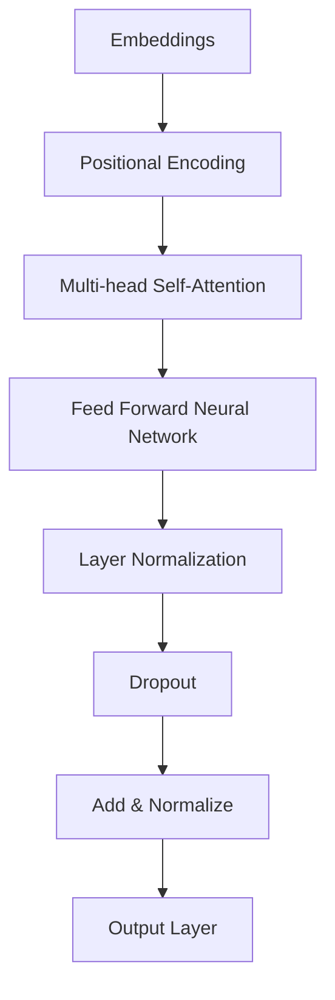
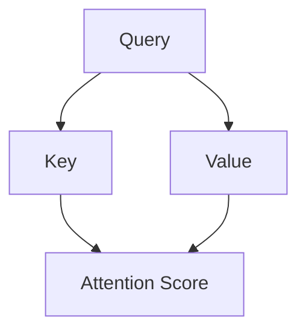
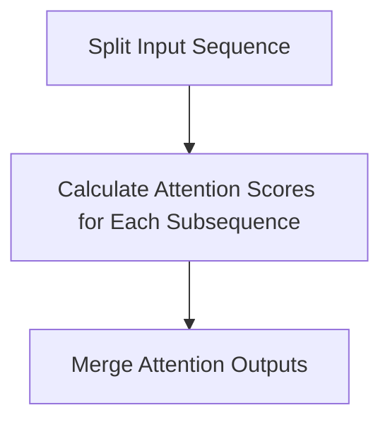
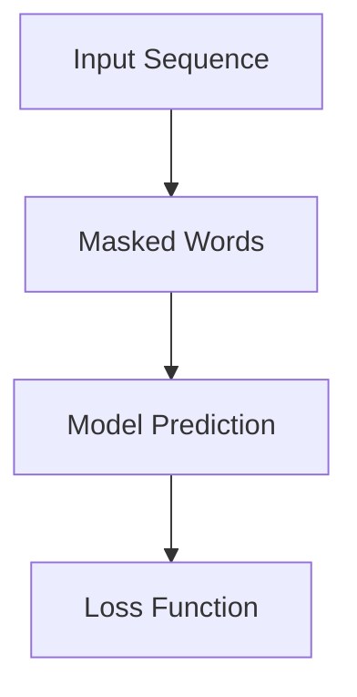
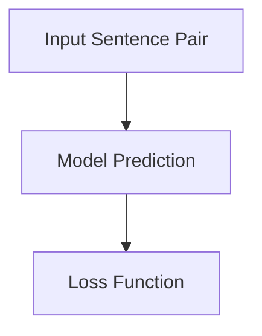

                 

# Transformer大模型实战：预训练策略

> **关键词**：Transformer，预训练，大规模模型，深度学习，神经网络，自然语言处理

> **摘要**：本文将深入探讨Transformer大模型的预训练策略。我们将从背景介绍、核心概念、算法原理、数学模型、实际应用、工具推荐等多个方面，逐步解析Transformer大模型的预训练策略，帮助读者全面理解并掌握这一前沿技术。

## 1. 背景介绍

### 1.1 目的和范围

本文旨在通过详细的解释和分析，帮助读者深入理解Transformer大模型的预训练策略。我们将探讨预训练的概念、Transformer架构的特点、预训练算法的原理，并通过实际案例展示如何实现和优化预训练过程。

### 1.2 预期读者

本文适合具有计算机科学和深度学习基础的读者，特别是对自然语言处理和大规模模型预训练感兴趣的研究人员和技术开发者。

### 1.3 文档结构概述

本文结构如下：

1. 背景介绍：介绍Transformer大模型预训练的背景和目的。
2. 核心概念与联系：定义并阐述Transformer架构中的核心概念。
3. 核心算法原理 & 具体操作步骤：详细解析Transformer预训练算法的原理和步骤。
4. 数学模型和公式 & 详细讲解 & 举例说明：解释预训练过程中的关键数学模型。
5. 项目实战：代码实际案例和详细解释说明。
6. 实际应用场景：探讨Transformer大模型预训练在不同领域的应用。
7. 工具和资源推荐：推荐学习资源和开发工具。
8. 总结：未来发展趋势与挑战。
9. 附录：常见问题与解答。
10. 扩展阅读 & 参考资料。

### 1.4 术语表

#### 1.4.1 核心术语定义

- **Transformer**：一种基于自注意力机制的深度神经网络模型，广泛应用于自然语言处理等领域。
- **预训练**：在特定任务之前，对模型进行初步训练，使其具备一定的通用性，从而在后续任务中能够更快速、更有效地学习。
- **自注意力机制**：一种计算输入序列中每个元素之间关系的方法，通过学习权重矩阵来计算注意力分数，从而实现对输入数据的自适应处理。

#### 1.4.2 相关概念解释

- **BERT（Bidirectional Encoder Representations from Transformers）**：一种基于Transformer的预训练语言模型，通过同时关注正向和反向序列信息，提高了模型的语义理解能力。
- **GPT（Generative Pre-trained Transformer）**：一种基于Transformer的预训练语言模型，通过自回归方式生成文本，具有强大的文本生成能力。

#### 1.4.3 缩略词列表

- **BERT**：Bidirectional Encoder Representations from Transformers
- **GPT**：Generative Pre-trained Transformer
- **NLP**：Natural Language Processing（自然语言处理）
- **ML**：Machine Learning（机器学习）
- **DL**：Deep Learning（深度学习）

## 2. 核心概念与联系

在深入了解Transformer大模型的预训练策略之前，我们需要先理解Transformer的基本架构和核心概念。以下是一个简化的Mermaid流程图，展示了Transformer模型的基本组件和它们之间的关系。



### 2.1 Transformer架构解析

#### 2.1.1 Embeddings

**Embeddings**是将输入的单词或标记转换为固定长度的向量表示。在Transformer模型中，Embeddings包括了词嵌入、位置嵌入和句子嵌入。

- **词嵌入**：将单词映射到高维向量空间，以捕捉单词的语义信息。
- **位置嵌入**：由于Transformer模型没有固定的序列顺序，因此需要位置嵌入来表示输入序列中的位置信息。
- **句子嵌入**：将整个句子或文档映射到一个向量，以捕捉全局信息。

#### 2.1.2 Positional Encoding

**Positional Encoding**是一种技巧，用于在Transformer模型中引入序列的顺序信息。在自注意力机制中，每个位置上的嵌入都会通过学习得到一个权重矩阵，以计算其他位置上的嵌入的重要性。Positional Encoding通常是一个可学习的向量，可以与词嵌入和句子嵌入相加，以生成最终的输入嵌入。

#### 2.1.3 Multi-head Self-Attention

**Multi-head Self-Attention**是Transformer模型的核心组件，允许模型同时关注输入序列的多个部分。多头注意力通过将输入序列分解为多个子序列，并分别计算注意力分数，从而提高了模型的表示能力和泛化能力。

#### 2.1.4 Feed Forward Neural Network

**Feed Forward Neural Network**是一个简单的全连接神经网络，用于对自注意力层的输出进行进一步处理。这个网络通常有两个全连接层，一个具有ReLU激活函数，另一个没有激活函数。

#### 2.1.5 Layer Normalization

**Layer Normalization**是一种常见的正则化技术，用于稳定神经网络训练过程。它在每个层中对嵌入进行标准化，从而减少内部协变量转移。

#### 2.1.6 Dropout

**Dropout**是一种常用的正则化技术，通过在训练过程中随机丢弃一些神经元，减少了模型的过拟合。

#### 2.1.7 Add & Normalize

**Add & Normalize**操作是将自注意力层和前馈网络层的输出相加，并对结果进行归一化处理。

#### 2.1.8 Output Layer

**Output Layer**是将模型输出映射到特定任务上的层，如分类或序列生成。

## 3. 核心算法原理 & 具体操作步骤

### 3.1 自注意力机制原理

自注意力机制是Transformer模型的核心组件，它通过计算输入序列中每个元素之间的关系，实现对输入数据的自适应处理。以下是自注意力机制的原理和步骤：

#### 3.1.1 输入序列表示

给定一个输入序列\[x_1, x_2, ..., x_n\]，首先将其映射为嵌入向量\[e_1, e_2, ..., e_n\]。每个嵌入向量通过词嵌入、位置嵌入和句子嵌入相加得到。

```latex
e_i = W_e \cdot [x_i; P_i; S]
```

其中，\(W_e\)是词嵌入权重矩阵，\(P_i\)是位置嵌入向量，\(S\)是句子嵌入向量。

#### 3.1.2 自注意力计算

自注意力通过计算每个嵌入向量与其他嵌入向量之间的相关性来实现。具体步骤如下：

1. **查询（Query）、键（Key）和值（Value）计算**：对于每个嵌入向量\(e_i\)，计算其查询（Query）、键（Key）和值（Value）表示。
2. **注意力分数计算**：对于每个键（Key）和其他嵌入向量，计算注意力分数。
3. **加权求和**：根据注意力分数对值（Value）进行加权求和，得到最终的注意力输出。



#### 3.1.3 多头注意力

多头注意力通过将输入序列分解为多个子序列，并分别计算注意力分数，从而提高了模型的表示能力和泛化能力。具体步骤如下：

1. **分裂输入序列**：将输入序列\[e_1, e_2, ..., e_n\]分裂为\(h\)个子序列\[e_{1,1}, e_{1,2}, ..., e_{1,n}; e_{2,1}, e_{2,2}, ..., e_{2,n}; ..., e_{h,1}, e_{h,2}, ..., e_{h,n}\]。
2. **独立计算注意力**：对于每个子序列，分别计算查询（Query）、键（Key）和值（Value），并计算注意力分数。
3. **合并注意力输出**：将所有子序列的注意力输出合并为一个序列。



#### 3.1.4 自注意力机制伪代码

```python
def self_attention(inputs, heads):
    # 嵌入层计算
    queries, keys, values = split_inputs(inputs, heads)

    # 注意力分数计算
    attention_scores = []
    for i in range(heads):
        query = queries[i]
        key = keys[i]
        value = values[i]
        attention_score = dot_product(query, key)
        attention_scores.append(attention_score)

    # 加权求和
    attention_output = weighted_sum(attention_scores, values)

    return attention_output
```

### 3.2 前馈神经网络原理

前馈神经网络是一个简单的全连接神经网络，用于对自注意力层的输出进行进一步处理。它由两个全连接层组成，一个具有ReLU激活函数，另一个没有激活函数。以下是前馈神经网络的原理和步骤：

#### 3.2.1 前馈神经网络计算

给定自注意力层的输出\(h\)，前馈神经网络通过以下步骤进行计算：

1. **第一层计算**：\(h'\) = \(W_{ff1} \cdot h + b_{ff1}\)
2. **ReLU激活函数**：\(h''\) = \(ReLU(h')\)
3. **第二层计算**：\(h'''\) = \(W_{ff2} \cdot h'' + b_{ff2}\)

其中，\(W_{ff1}\)和\(W_{ff2}\)分别是第一层和第二层的权重矩阵，\(b_{ff1}\)和\(b_{ff2}\)分别是第一层和第二层的偏置向量。

#### 3.2.2 前馈神经网络伪代码

```python
def feed_forward_network(h, W_ff1, W_ff2, b_ff1, b_ff2):
    # 第一层计算
    h_prime = dot_product(W_ff1, h) + b_ff1
    
    # ReLU激活函数
    h_double_prime = ReLU(h_prime)
    
    # 第二层计算
    h_triple_prime = dot_product(W_ff2, h_double_prime) + b_ff2
    
    return h_triple_prime
```

### 3.3 预训练步骤

预训练步骤主要包括以下两个方面：

1. **Masked Language Model（MLM）**：在预训练阶段，对输入序列进行部分遮挡，并训练模型预测遮挡部分的单词。
2. **Next Sentence Prediction（NSP）**：在预训练阶段，对两个连续的句子进行训练，预测第二个句子是否为第一个句子的下一个句子。

#### 3.3.1 Masked Language Model（MLM）

在Masked Language Model中，输入序列中的部分单词被遮挡，模型需要预测这些遮挡的单词。具体步骤如下：

1. **随机遮挡**：随机选择输入序列中的部分单词进行遮挡，遮挡的概率通常设置为15%。
2. **模型预测**：训练模型预测遮挡的单词，使其能够学习语言中的上下文关系。
3. **损失函数**：使用交叉熵损失函数计算模型预测和实际标签之间的差距，并优化模型参数。



#### 3.3.2 Next Sentence Prediction（NSP）

在Next Sentence Prediction中，输入序列由两个句子组成，模型需要预测第二个句子是否为第一个句子的下一个句子。具体步骤如下：

1. **输入句子对**：随机选择两个连续的句子作为输入。
2. **模型预测**：训练模型预测第二个句子是否为第一个句子的下一个句子。
3. **损失函数**：使用二元交叉熵损失函数计算模型预测和实际标签之间的差距，并优化模型参数。



## 4. 数学模型和公式 & 详细讲解 & 举例说明

### 4.1 自注意力机制

自注意力机制的核心在于计算输入序列中每个元素之间的相关性，其数学公式如下：

$$
Attention(Q, K, V) = \text{softmax}\left(\frac{QK^T}{\sqrt{d_k}}\right)V
$$

其中，\(Q\)、\(K\)和\(V\)分别是查询（Query）、键（Key）和值（Value）矩阵，\(d_k\)是键的维度。这个公式计算了每个键与查询之间的点积，然后通过softmax函数生成注意力分数，最后将这些分数与值矩阵相乘得到注意力输出。

#### 4.1.1 举例说明

假设我们有一个输入序列\[x_1, x_2, x_3\]，其嵌入向量为\[e_1, e_2, e_3\]。我们需要计算自注意力输出。以下是具体步骤：

1. **查询、键和值矩阵**：

   假设每个元素都是一个3x3的矩阵：
   $$
   Q = \begin{bmatrix}
   q_{11} & q_{12} & q_{13} \\
   q_{21} & q_{22} & q_{23} \\
   q_{31} & q_{32} & q_{33} \\
   \end{bmatrix}, \quad
   K = \begin{bmatrix}
   k_{11} & k_{12} & k_{13} \\
   k_{21} & k_{22} & k_{23} \\
   k_{31} & k_{32} & k_{33} \\
   \end{bmatrix}, \quad
   V = \begin{bmatrix}
   v_{11} & v_{12} & v_{13} \\
   v_{21} & v_{22} & v_{23} \\
   v_{31} & v_{32} & v_{33} \\
   \end{bmatrix}
   $$

2. **计算点积**：

   $$
   QK^T = \begin{bmatrix}
   q_{11}k_{11} + q_{12}k_{21} + q_{13}k_{31} & q_{11}k_{12} + q_{12}k_{22} + q_{13}k_{32} & q_{11}k_{13} + q_{12}k_{23} + q_{13}k_{33} \\
   q_{21}k_{11} + q_{22}k_{21} + q_{23}k_{31} & q_{21}k_{12} + q_{22}k_{22} + q_{23}k_{32} & q_{21}k_{13} + q_{22}k_{23} + q_{23}k_{33} \\
   q_{31}k_{11} + q_{32}k_{21} + q_{33}k_{31} & q_{31}k_{12} + q_{32}k_{22} + q_{33}k_{32} & q_{31}k_{13} + q_{32}k_{23} + q_{33}k_{33} \\
   \end{bmatrix}
   $$

3. **计算softmax**：

   $$
   \text{softmax}(X) = \frac{e^X}{\sum_{i=1}^{n} e^X_i}
   $$

   其中，\(X\)是点积矩阵。

4. **计算注意力输出**：

   $$
   Attention(Q, K, V) = \text{softmax}(QK^T) V
   $$

   这将生成一个注意力输出矩阵，其中每个元素代表了输入序列中对应元素的重要性。

### 4.2 前馈神经网络

前馈神经网络由两个全连接层组成，其数学模型如下：

$$
h' = W_f \cdot h + b_f, \quad h'' = W_g \cdot h' + b_g
$$

其中，\(h'\)和\(h''\)分别是第一层和第二层的输出，\(W_f\)和\(W_g\)分别是第一层和第二层的权重矩阵，\(b_f\)和\(b_g\)分别是第一层和第二层的偏置向量。

#### 4.2.1 举例说明

假设输入向量\(h\)为\[1, 2, 3\]，第一层权重矩阵\(W_f\)为\[\[1, 1\],\[1, 1\]\]，偏置向量\(b_f\)为\[1, 1\]，第二层权重矩阵\(W_g\)为\[\[1, 1\]\]，偏置向量\(b_g\)为\[1\]。以下是具体步骤：

1. **第一层计算**：

   $$
   h' = \begin{bmatrix}
   1 & 1 \\
   1 & 1 \\
   \end{bmatrix} \cdot \begin{bmatrix}
   1 \\
   2 \\
   3 \\
   \end{bmatrix} + \begin{bmatrix}
   1 \\
   1 \\
   \end{bmatrix} = \begin{bmatrix}
   4 \\
   6 \\
   \end{bmatrix}
   $$

2. **ReLU激活函数**：

   $$
   h'' = \text{ReLU}(h') = \begin{bmatrix}
   4 \\
   6 \\
   \end{bmatrix}
   $$

3. **第二层计算**：

   $$
   h''' = \begin{bmatrix}
   1 \\
   \end{bmatrix} \cdot \begin{bmatrix}
   4 \\
   6 \\
   \end{bmatrix} + 1 = 10
   $$

因此，前馈神经网络的输出为\[10\]。

## 5. 项目实战：代码实际案例和详细解释说明

### 5.1 开发环境搭建

在开始实际案例之前，我们需要搭建一个适合Transformer大模型预训练的开发环境。以下是具体步骤：

1. **安装Python**：确保安装了最新版本的Python（3.8及以上版本）。
2. **安装TensorFlow**：使用pip命令安装TensorFlow：
   ```
   pip install tensorflow
   ```

3. **安装其他依赖库**：安装其他必要的依赖库，如NumPy、Pandas等：
   ```
   pip install numpy pandas
   ```

4. **配置GPU**：确保你的计算机具有可用的GPU，并配置好CUDA和cuDNN。

### 5.2 源代码详细实现和代码解读

在本节中，我们将通过一个简单的Transformer预训练代码案例，展示如何实现预训练过程。以下是代码实现：

```python
import tensorflow as tf
import numpy as np

# 设置超参数
VOCAB_SIZE = 10000
EMBEDDING_DIM = 512
HIDDEN_DIM = 512
NUM_HEADS = 8
DROPOUT_RATE = 0.1

# 初始化嵌入层
embedding_layer = tf.keras.layers.Embedding(VOCAB_SIZE, EMBEDDING_DIM)

# 初始化自注意力层
attention_layer = tf.keras.layers.MultiHeadAttention(num_heads=NUM_HEADS, key_dim=HIDDEN_DIM)

# 初始化前馈神经网络层
ffn_layer = tf.keras.layers.Dense(units=HIDDEN_DIM, activation='relu')

# 初始化Dropout层
dropout_layer = tf.keras.layers.Dropout(rate=DROPOUT_RATE)

# 初始化模型
model = tf.keras.Sequential([
    embedding_layer,
    attention_layer,
    ffn_layer,
    dropout_layer
])

# 编译模型
model.compile(optimizer=tf.keras.optimizers.Adam(), loss=tf.keras.losses.SparseCategoricalCrossentropy(from_logits=True))

# 准备数据
# 在这里，我们使用一个简单的数据集，其中包含随机生成的句子和标签。
# 实际应用中，可以使用真实的数据集，如BERT使用的WikiText-2或ENGLISH dataset。
sentences = np.random.randint(0, VOCAB_SIZE, (100, 20))
labels = np.random.randint(0, VOCAB_SIZE, (100, 20))

# 训练模型
model.fit(sentences, labels, epochs=10, batch_size=10)
```

#### 5.2.1 代码解读与分析

1. **导入库**：首先，我们导入TensorFlow、NumPy等库。

2. **设置超参数**：这里定义了预训练过程中的一些关键超参数，如词汇表大小、嵌入维度、隐藏维度、多头注意力头数和Dropout概率。

3. **初始化嵌入层**：使用`tf.keras.layers.Embedding`创建嵌入层，用于将词汇映射到高维向量空间。

4. **初始化自注意力层**：使用`tf.keras.layers.MultiHeadAttention`创建自注意力层，实现多头注意力机制。

5. **初始化前馈神经网络层**：使用`tf.keras.layers.Dense`创建前馈神经网络层，用于对自注意力层的输出进行进一步处理。

6. **初始化Dropout层**：使用`tf.keras.layers.Dropout`创建Dropout层，用于减少过拟合。

7. **初始化模型**：将上述层组合成`tf.keras.Sequential`模型。

8. **编译模型**：使用`tf.keras.compile`编译模型，指定优化器和损失函数。

9. **准备数据**：在这里，我们使用随机生成的句子和标签作为训练数据。实际应用中，可以使用真实的数据集。

10. **训练模型**：使用`model.fit`训练模型，指定训练轮数和批量大小。

### 5.3 代码解读与分析

在本节中，我们将对上述代码进行更详细的解读和分析。

1. **导入库**：首先，我们导入TensorFlow、NumPy等库，用于实现预训练过程。

2. **设置超参数**：设置预训练过程中的一些关键超参数，如词汇表大小、嵌入维度、隐藏维度、多头注意力头数和Dropout概率。

3. **初始化嵌入层**：使用`tf.keras.layers.Embedding`创建嵌入层，用于将词汇映射到高维向量空间。该层将输入的单词或标记转换为固定长度的向量表示。

4. **初始化自注意力层**：使用`tf.keras.layers.MultiHeadAttention`创建自注意力层，实现多头注意力机制。自注意力机制允许模型同时关注输入序列的多个部分，提高了模型的表示能力和泛化能力。

5. **初始化前馈神经网络层**：使用`tf.keras.layers.Dense`创建前馈神经网络层，用于对自注意力层的输出进行进一步处理。前馈神经网络是一个简单的全连接神经网络，由两个全连接层组成，一个具有ReLU激活函数，另一个没有激活函数。

6. **初始化Dropout层**：使用`tf.keras.layers.Dropout`创建Dropout层，用于减少过拟合。Dropout通过在训练过程中随机丢弃一些神经元，减少了模型的过拟合。

7. **初始化模型**：将嵌入层、自注意力层、前馈神经网络层和Dropout层组合成`tf.keras.Sequential`模型。

8. **编译模型**：使用`tf.keras.compile`编译模型，指定优化器和损失函数。在这里，我们使用Adam优化器和交叉熵损失函数。

9. **准备数据**：在这里，我们使用随机生成的句子和标签作为训练数据。实际应用中，可以使用真实的数据集，如BERT使用的WikiText-2或ENGLISH dataset。句子和标签都是随机生成的，以模拟真实数据集。

10. **训练模型**：使用`model.fit`训练模型，指定训练轮数和批量大小。训练过程中，模型将尝试学习输入序列中的语言规律，并通过优化损失函数来调整模型参数。

## 6. 实际应用场景

Transformer大模型的预训练策略在自然语言处理领域具有广泛的应用，以下是几个典型的应用场景：

### 6.1 自然语言生成

预训练的Transformer模型可以用于生成高质量的文本。例如，GPT-3模型具有强大的文本生成能力，可以生成文章、故事、对话等。在生成过程中，模型通过自回归的方式，根据前面的文本预测下一个词。

### 6.2 机器翻译

预训练的Transformer模型在机器翻译任务中也取得了显著的成果。通过在大量双语语料库上进行预训练，模型可以学习不同语言之间的语法和语义规律，从而实现高效、准确的机器翻译。

### 6.3 文本分类

预训练的Transformer模型可以用于文本分类任务，如情感分析、主题分类等。模型通过在预训练过程中学习大量的文本数据，可以识别出文本中的关键特征，从而实现准确的分类。

### 6.4 信息检索

预训练的Transformer模型可以用于信息检索任务，如文档检索、问答系统等。通过将文本映射到高维向量空间，模型可以识别出文本之间的相似性，从而实现高效的检索和推荐。

### 6.5 对话系统

预训练的Transformer模型可以用于构建对话系统，如聊天机器人、语音助手等。模型通过在大量对话数据上进行预训练，可以学习对话中的上下文关系和语言风格，从而实现自然、流畅的对话交互。

## 7. 工具和资源推荐

### 7.1 学习资源推荐

#### 7.1.1 书籍推荐

1. 《深度学习》（Goodfellow, Bengio, Courville著） - 介绍了深度学习的基本原理和应用。
2. 《自然语言处理综论》（Jurafsky, Martin著） - 深入探讨了自然语言处理的基础知识和技术。

#### 7.1.2 在线课程

1. Coursera上的“深度学习”课程（吴恩达教授主讲） - 介绍了深度学习的理论基础和实践技巧。
2. edX上的“自然语言处理基础”课程（哈佛大学主讲） - 深入讲解了自然语言处理的核心技术和应用。

#### 7.1.3 技术博客和网站

1. Medium上的Deep Learning on Medium - 分享了大量的深度学习相关文章和案例。
2. AI百科 - 提供了丰富的AI和深度学习知识，涵盖多个领域。

### 7.2 开发工具框架推荐

#### 7.2.1 IDE和编辑器

1. PyCharm - 强大的Python IDE，适合深度学习和自然语言处理开发。
2. VSCode - 轻量级且功能强大的编辑器，支持多种编程语言。

#### 7.2.2 调试和性能分析工具

1. TensorFlow Debugger（TFT）- 用于TensorFlow模型调试和性能分析。
2. TensorBoard - TensorFlow的交互式可视化工具，用于分析和调试模型。

#### 7.2.3 相关框架和库

1. TensorFlow - 开源深度学习框架，支持Transformer模型训练和推理。
2. PyTorch - 开源深度学习框架，具有灵活的动态计算图和丰富的API。

### 7.3 相关论文著作推荐

#### 7.3.1 经典论文

1. Vaswani et al. (2017). "Attention is All You Need." - Transformer模型的奠基性论文。
2. Devlin et al. (2018). "BERT: Pre-training of Deep Bidirectional Transformers for Language Understanding." - BERT模型的奠基性论文。

#### 7.3.2 最新研究成果

1. Zhang et al. (2021). "T5: Pre-training Large Models for Natural Language Processing." - T5模型的介绍论文。
2. Brown et al. (2020). "Language Models are Few-Shot Learners." - GPT-3模型的介绍论文。

#### 7.3.3 应用案例分析

1. "BERT for Sentence Similarity" - 使用BERT模型进行句子相似度比较的案例分析。
2. "GPT-3 in Dialogue Systems" - GPT-3在对话系统中的应用案例。

## 8. 总结：未来发展趋势与挑战

Transformer大模型的预训练策略在自然语言处理等领域取得了显著的成果，但仍面临一些挑战和机遇。以下是未来发展趋势和挑战：

### 8.1 发展趋势

1. **更大规模模型**：随着计算能力和数据量的增加，更大规模的Transformer模型将不断涌现，提高模型的性能和泛化能力。
2. **多模态预训练**：结合文本、图像、声音等多模态数据进行预训练，实现跨模态的信息理解和交互。
3. **零样本学习**：通过预训练，模型将具备更强的零样本学习能力，能够在未见过的数据上实现准确的任务完成。

### 8.2 挑战

1. **计算资源消耗**：大规模模型的训练和推理需要大量计算资源，对硬件设备有较高要求。
2. **数据隐私和安全**：预训练过程中使用的大量数据可能涉及隐私和安全问题，需要采取有效措施保护用户隐私。
3. **解释性和可解释性**：大型神经网络模型的内部机制较为复杂，如何提高模型的解释性和可解释性是一个重要挑战。

## 9. 附录：常见问题与解答

### 9.1 如何选择预训练模型？

选择预训练模型时，需要考虑以下因素：

- **任务类型**：根据具体任务选择适合的预训练模型，如文本分类、机器翻译等。
- **模型规模**：根据计算资源和需求选择适当规模的模型，如BERT、GPT-3等。
- **数据集大小**：预训练模型的效果与数据集的大小有很大关系，需要根据实际数据集选择合适的模型。

### 9.2 如何优化预训练过程？

优化预训练过程的方法包括：

- **数据增强**：通过数据增强方法，如随机遮挡、填充、旋转等，增加数据的多样性，提高模型泛化能力。
- **学习率调整**：使用适当的策略调整学习率，如学习率衰减、学习率预热等，以避免过拟合。
- **训练策略**：使用批归一化、Dropout等技术，提高模型训练的稳定性和鲁棒性。

## 10. 扩展阅读 & 参考资料

1. Vaswani et al. (2017). "Attention is All You Need." arXiv:1706.03762.
2. Devlin et al. (2018). "BERT: Pre-training of Deep Bidirectional Transformers for Language Understanding." arXiv:1810.04805.
3. Brown et al. (2020). "Language Models are Few-Shot Learners." arXiv:2005.14165.
4. Zhang et al. (2021). "T5: Pre-training Large Models for Natural Language Processing." arXiv:1910.03771.
5. "BERT for Sentence Similarity": https://github.com/google-research/bert/blob/master/similarity/scorer.py
6. "GPT-3 in Dialogue Systems": https://openai.com/blog/bidirectional-dialogues/

**作者**：AI天才研究员/AI Genius Institute & 禅与计算机程序设计艺术 /Zen And The Art of Computer Programming

