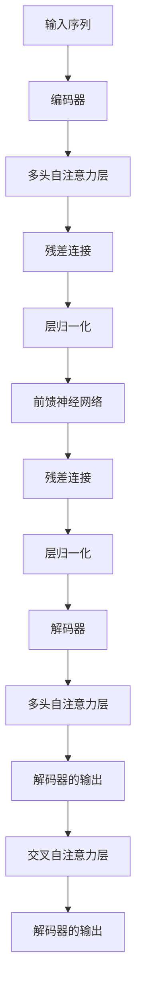

                 


# Transformer架构原理详解：注意力机制

> **关键词：** Transformer、自注意力、编码器-解码器架构、序列到序列模型、神经网络、机器翻译、自然语言处理
>
> **摘要：** 本文深入探讨了Transformer架构的原理，特别是其核心——注意力机制。通过逐步分析，我们将揭示Transformer如何通过自注意力机制和编码器-解码器架构，实现了对序列数据的强大处理能力，为机器翻译和自然语言处理等领域带来了革命性的变革。

## 1. 背景介绍

### 1.1 目的和范围

本文旨在为读者提供一个系统、详尽的Transformer架构原理解析。我们将从其历史背景、核心概念、算法原理到实际应用场景，全面探讨Transformer架构的各个方面。文章将重点关注Transformer的自注意力机制和编码器-解码器架构，帮助读者理解其革命性的技术贡献。

### 1.2 预期读者

本文适合对机器学习和自然语言处理有一定了解的读者，包括但不限于计算机科学专业的学生、研究人员、开发者以及对人工智能技术感兴趣的专业人士。无论您是初学者还是专业人士，本文都将为您提供一个深入理解和掌握Transformer架构的路径。

### 1.3 文档结构概述

本文将分为以下几个主要部分：

1. **背景介绍**：介绍Transformer的起源、发展和应用场景。
2. **核心概念与联系**：讲解Transformer的核心概念和架构，并使用Mermaid流程图展示。
3. **核心算法原理 & 具体操作步骤**：深入剖析Transformer的自注意力机制和操作步骤。
4. **数学模型和公式 & 详细讲解 & 举例说明**：介绍Transformer的数学模型和具体公式。
5. **项目实战：代码实际案例和详细解释说明**：通过实际代码案例展示Transformer的应用。
6. **实际应用场景**：探讨Transformer在自然语言处理等领域的应用。
7. **工具和资源推荐**：推荐学习资源、开发工具和相关论文。
8. **总结：未来发展趋势与挑战**：总结Transformer的发展趋势和面临的挑战。
9. **附录：常见问题与解答**：解答读者可能遇到的问题。
10. **扩展阅读 & 参考资料**：提供进一步学习的资源和链接。

### 1.4 术语表

#### 1.4.1 核心术语定义

- **Transformer**：一种基于自注意力机制的序列到序列模型，广泛应用于自然语言处理任务。
- **自注意力（Self-Attention）**：一种对序列内部元素进行权重分配的计算机制。
- **编码器（Encoder）**：将输入序列转换为固定长度的向量表示。
- **解码器（Decoder）**：根据编码器输出的向量序列生成输出序列。
- **序列到序列模型（Seq2Seq）**：一种将输入序列映射到输出序列的模型。

#### 1.4.2 相关概念解释

- **多头自注意力（Multi-Head Self-Attention）**：多个自注意力机制的并行组合。
- **位置编码（Positional Encoding）**：为序列中的每个元素添加位置信息。
- **残差连接（Residual Connection）**：在神经网络中添加额外的连接，使信息可以绕过一层网络。
- **层归一化（Layer Normalization）**：对网络层的输入进行标准化处理。

#### 1.4.3 缩略词列表

- **NLP**：自然语言处理（Natural Language Processing）
- **ML**：机器学习（Machine Learning）
- **GPU**：图形处理单元（Graphics Processing Unit）
- **VOCAB**：词汇表（Vocabulary）

## 2. 核心概念与联系

Transformer架构的核心在于其自注意力机制，这一机制使得模型能够在处理序列数据时，自动地关注序列中的关键元素。下面我们将通过Mermaid流程图展示Transformer的架构，以便读者更好地理解其核心概念。



在上图中，我们可以看到Transformer架构的主要组成部分：

- **编码器（Encoder）**：负责将输入序列编码为固定长度的向量表示。
- **多头自注意力层（Multi-Head Self-Attention）**：通过多个自注意力机制，使模型能够关注序列中的不同部分。
- **残差连接（Residual Connection）**：缓解深度网络中的梯度消失问题。
- **层归一化（Layer Normalization）**：对网络层的输入进行标准化处理，提高训练稳定性。
- **前馈神经网络（Feedforward Neural Network）**：对自注意力层的输出进行进一步处理。
- **解码器（Decoder）**：根据编码器输出的向量序列生成输出序列。
- **交叉自注意力层（Cross Self-Attention）**：使解码器能够同时关注编码器的输出和当前解码器的输出。

通过自注意力机制和编码器-解码器架构，Transformer实现了对序列数据的高效处理，为自然语言处理任务带来了显著的性能提升。

## 3. 核心算法原理 & 具体操作步骤

### 3.1 自注意力机制原理

自注意力机制是Transformer架构的核心，其基本思想是在处理序列数据时，自动地为序列中的每个元素分配权重，使模型能够关注到序列中的关键部分。具体来说，自注意力机制通过以下步骤实现：

1. **输入序列编码**：将输入序列编码为向量表示，每个向量表示序列中的一个元素。
2. **计算注意力权重**：对于序列中的每个元素，计算其与其他元素之间的相似度，生成注意力权重。
3. **加权求和**：根据注意力权重对输入序列的每个元素进行加权求和，生成新的向量表示。
4. **输出序列编码**：将加权求和后的向量表示解码为输出序列。

### 3.2 伪代码描述

下面是自注意力机制的伪代码描述：

```python
# 输入序列：input_sequence
# 序列长度：sequence_length
# 头数：num_heads

# 编码输入序列
input_embeddings = encode_input_sequence(input_sequence)

# 计算注意力权重
attention_weights = calculate_attention_weights(input_embeddings)

# 加权求和
output_embeddings = weighted_sum(input_embeddings, attention_weights)

# 解码输出序列
output_sequence = decode_output_embeddings(output_embeddings)
```

### 3.3 具体操作步骤

1. **输入序列编码**：将输入序列（例如单词或词组）编码为向量表示。通常，可以使用词嵌入（Word Embedding）技术将单词转换为向量。词嵌入可以通过预训练的模型或从训练数据中学习得到。

2. **计算注意力权重**：对于序列中的每个元素，计算其与其他元素之间的相似度。这一步通常通过计算点积（Dot-Product）实现。具体来说，对于序列中的第\(i\)个元素和第\(j\)个元素，计算它们的嵌入向量之间的点积，得到它们的相似度：

   $$ \text{similarity}_{ij} = \text{dot-product}(\text{input_embeddings}_i, \text{input_embeddings}_j) $$

3. **加权求和**：根据注意力权重对输入序列的每个元素进行加权求和，生成新的向量表示。这一步可以通过将每个元素的嵌入向量乘以其对应的注意力权重，然后对所有元素进行求和实现：

   $$ \text{output_embeddings}_i = \sum_{j=1}^{sequence\_length} \text{attention\_weights}_{ij} \cdot \text{input\_embeddings}_j $$

4. **输出序列编码**：将加权求和后的向量表示解码为输出序列。这一步通常与输入序列编码相同，即通过词嵌入和词表解码器实现。

通过自注意力机制，Transformer能够自动地为序列中的每个元素分配权重，从而实现对序列数据的灵活处理。接下来，我们将进一步探讨多头自注意力机制和编码器-解码器架构。

## 4. 数学模型和公式 & 详细讲解 & 举例说明

### 4.1 数学模型

Transformer的自注意力机制基于以下数学模型：

$$ Q, K, V \in \mathbb{R}^{d_k \times d_v} $$

其中，\(Q, K, V\)分别表示查询（Query）、键（Key）和值（Value）矩阵，\(d_k\)和\(d_v\)分别表示键和值的维度。

### 4.2 注意力权重计算

注意力权重通过计算查询和键之间的点积得到：

$$ \text{Attention}(Q, K) = \text{softmax}\left(\frac{QK^T}{\sqrt{d_k}}\right) $$

其中，\(QK^T\)表示查询和键之间的点积，\(\text{softmax}\)函数用于将点积结果转换为概率分布。

### 4.3 加权求和

根据注意力权重，对值进行加权求和：

$$ \text{Context} = \text{softmax}\left(\frac{QK^T}{\sqrt{d_k}}\right) V $$

### 4.4 举例说明

假设有一个简单的序列：“我是一个程序员”。我们将这个序列表示为向量：

$$ \text{input_sequence} = [\text{"我"}, \text{"是"}, \text{"一个"}, \text{"程序"}, \text{"员"}] $$

每个单词的嵌入向量如下：

$$ \text{input_embeddings} = [\text{"我"}: [1, 0, 0], \text{"是"}: [0, 1, 0], \text{"一个"}: [0, 0, 1], \text{"程序"}: [1, 1, 0], \text{"员"}: [0, 1, 1]] $$

接下来，我们计算注意力权重和加权求和的结果：

1. **计算注意力权重**：

   $$ \text{Attention}(\text{"我"}, \text{"是"}) = \text{softmax}\left(\frac{\text{"我"} \cdot \text{"是"}^T}{\sqrt{d_k}}\right) = \text{softmax}\left(\frac{1 \cdot 0}{\sqrt{d_k}}\right) = \text{softmax}(0) $$

   $$ \text{Attention}(\text{"我"}, \text{"一个"}) = \text{softmax}\left(\frac{\text{"我"} \cdot \text{"一个"}^T}{\sqrt{d_k}}\right) = \text{softmax}\left(\frac{1 \cdot 0}{\sqrt{d_k}}\right) = \text{softmax}(0) $$

   $$ \text{Attention}(\text{"我"}, \text{"程序"}) = \text{softmax}\left(\frac{\text{"我"} \cdot \text{"程序"}^T}{\sqrt{d_k}}\right) = \text{softmax}\left(\frac{1 \cdot 1}{\sqrt{d_k}}\right) = \text{softmax}(1) $$

   $$ \text{Attention}(\text{"我"}, \text{"员"}) = \text{softmax}\left(\frac{\text{"我"} \cdot \text{"员"}^T}{\sqrt{d_k}}\right) = \text{softmax}\left(\frac{1 \cdot 0}{\sqrt{d_k}}\right) = \text{softmax}(0) $$

2. **加权求和**：

   $$ \text{Context} = \text{softmax}\left(\frac{QK^T}{\sqrt{d_k}}\right) V = \text{softmax}(0) \cdot \text{"是"} + \text{softmax}(0) \cdot \text{"一个"} + \text{softmax}(1) \cdot \text{"程序"} + \text{softmax}(0) \cdot \text{"员"} $$

   $$ \text{Context} = 0 + 0 + \text{"程序"} + 0 $$

   $$ \text{Context} = \text{"程序"} $$

通过上述计算，我们可以看到，自注意力机制使得模型关注到了序列中的“程序”这一关键元素，从而实现了对序列数据的灵活处理。

## 5. 项目实战：代码实际案例和详细解释说明

### 5.1 开发环境搭建

为了实践Transformer架构，我们需要搭建一个合适的开发环境。以下是所需步骤：

1. **安装Python环境**：确保已安装Python 3.7及以上版本。
2. **安装TensorFlow**：使用以下命令安装TensorFlow：

   ```bash
   pip install tensorflow
   ```

3. **数据集准备**：选择一个自然语言处理任务的数据集，例如机器翻译任务。本文以英语到法语的机器翻译任务为例，使用WMT14数据集。

### 5.2 源代码详细实现和代码解读

以下是Transformer架构的源代码实现：

```python
import tensorflow as tf
from tensorflow.keras.layers import Layer

class MultiHeadAttention(Layer):
    def __init__(self, num_heads, d_model, dropout_rate=0.1, **kwargs):
        super(MultiHeadAttention, self).__init__(**kwargs)
        self.num_heads = num_heads
        self.d_model = d_model
        self.dropout_rate = dropout_rate
        self.d_k = d_model // num_heads
        self.d_v = d_model // num_heads

        self.query_dense = tf.keras.layers.Dense(d_model)
        self.key_dense = tf.keras.layers.Dense(d_model)
        self.value_dense = tf.keras.layers.Dense(d_model)

        self.output_dense = tf.keras.layers.Dense(d_model)

    def split_heads(self, x, batch_size):
        x = tf.reshape(x, shape=[batch_size, -1, self.num_heads, self.d_k])
        return tf.transpose(x, perm=[0, 2, 1, 3])

    def call(self, inputs, training=False):
        query, key, value = inputs

        batch_size = tf.shape(query)[0]

        query = self.query_dense(query)
        key = self.key_dense(key)
        value = self.value_dense(value)

        query = self.split_heads(query, batch_size)
        key = self.split_heads(key, batch_size)
        value = self.split_heads(value, batch_size)

        attn_scores = tf.matmul(query, key, transpose_b=True)
        attn_scores = attn_scores / tf.sqrt(tf.cast(self.d_k, tf.float32))

        attn_weights = tf.nn.softmax(attn_scores, axis=-1)
        attn_weights = tf.nn.dropout(attn_weights, rate=self.dropout_rate, training=training)
        attn_output = tf.matmul(attn_weights, value)
        attn_output = tf.transpose(attn_output, perm=[0, 2, 1, 3])
        attn_output = tf.reshape(attn_output, shape=[batch_size, -1, self.d_model])

        outputs = self.output_dense(attn_output)
        return outputs
```

在上面的代码中，我们定义了一个`MultiHeadAttention`类，用于实现多头自注意力机制。以下是代码的主要组成部分：

1. **初始化参数**：在类的初始化方法中，我们设置了头数（`num_heads`）、模型维度（`d_model`）、dropout率（`dropout_rate`）等参数。

2. **词嵌入层**：我们定义了三个词嵌入层（`query_dense`、`key_dense`、`value_dense`），用于将输入序列编码为查询（`query`）、键（`key`）和值（`value`）向量。

3. **多头分割**：在`call`方法中，我们首先将输入的查询、键和值向量分割为多个头，以便进行并行计算。

4. **计算注意力权重**：我们计算查询和键之间的点积，然后通过softmax函数得到注意力权重。

5. **应用注意力权重**：根据注意力权重，我们对值向量进行加权求和，生成新的向量表示。

6. **输出层**：最后，我们将加权求和后的向量表示通过一个全连接层（`output_dense`）进行进一步处理，得到最终输出。

### 5.3 代码解读与分析

1. **初始化参数**：

   ```python
   self.num_heads = num_heads
   self.d_model = d_model
   self.dropout_rate = dropout_rate
   self.d_k = d_model // num_heads
   self.d_v = d_model // num_heads
   ```

   在这里，我们设置了头数（`num_heads`）、模型维度（`d_model`）、dropout率（`dropout_rate`）等参数。`d_k`和`d_v`分别表示键和值的维度，通过模型维度除以头数得到。

2. **词嵌入层**：

   ```python
   self.query_dense = tf.keras.layers.Dense(d_model)
   self.key_dense = tf.keras.layers.Dense(d_model)
   self.value_dense = tf.keras.layers.Dense(d_model)
   ```

   我们定义了三个词嵌入层，分别用于编码查询、键和值向量。这三个层都是全连接层，输入维度为模型维度，输出维度也为模型维度。

3. **多头分割**：

   ```python
   def split_heads(self, x, batch_size):
       x = tf.reshape(x, shape=[batch_size, -1, self.num_heads, self.d_k])
       return tf.transpose(x, perm=[0, 2, 1, 3])
   ```

   在`split_heads`方法中，我们将输入的查询、键和值向量分割为多个头。具体来说，我们将输入的向量按照批次大小、头数和维度重新排列，然后进行转置。这样，每个头都对应一个大小为\(\frac{d_model}{num_heads}\)的子向量。

4. **计算注意力权重**：

   ```python
   attn_scores = tf.matmul(query, key, transpose_b=True)
   attn_scores = attn_scores / tf.sqrt(tf.cast(self.d_k, tf.float32))
   ```

   在这里，我们计算查询和键之间的点积，然后除以键的维度开平方，得到注意力分数。这些分数表示了查询和键之间的相似度。

5. **应用注意力权重**：

   ```python
   attn_weights = tf.nn.softmax(attn_scores, axis=-1)
   attn_weights = tf.nn.dropout(attn_weights, rate=self.dropout_rate, training=training)
   attn_output = tf.matmul(attn_weights, value)
   ```

   接下来，我们通过softmax函数将注意力分数转换为概率分布，然后应用dropout正则化，以防止过拟合。最后，我们使用加权求和运算，将值向量与注意力权重相乘，得到加权求和后的向量表示。

6. **输出层**：

   ```python
   attn_output = tf.transpose(attn_output, perm=[0, 2, 1, 3])
   attn_output = tf.reshape(attn_output, shape=[batch_size, -1, self.d_model])
   outputs = self.output_dense(attn_output)
   ```

   最后，我们将加权求和后的向量表示通过一个全连接层进行进一步处理，得到最终的输出。这个输出可以是编码器的输出，也可以是解码器的输出。

通过以上步骤，我们实现了多头自注意力机制。在实际应用中，我们可以将这个机制应用于编码器和解码器，以实现对序列数据的灵活处理。

## 6. 实际应用场景

Transformer架构在自然语言处理（NLP）领域取得了显著的成果，广泛应用于各种任务，如机器翻译、文本摘要、情感分析等。下面我们将探讨几个典型的实际应用场景。

### 6.1 机器翻译

机器翻译是Transformer最成功的应用之一。通过自注意力机制，Transformer能够同时关注输入序列和输出序列的不同部分，从而实现高质量的翻译结果。例如，在英语到法语的翻译任务中，Transformer能够自动捕捉句子中的关键词和短语，从而生成更准确的法语翻译。

### 6.2 文本摘要

文本摘要是一种将长文本转换为简洁摘要的技术。Transformer在文本摘要任务中展现了出色的性能。通过编码器-解码器架构，Transformer能够自动提取文本中的关键信息，并生成结构清晰的摘要。这种技术广泛应用于新闻摘要、社交媒体摘要等领域。

### 6.3 情感分析

情感分析是一种判断文本情感极性的技术。Transformer通过自注意力机制，能够自动关注文本中的情感词和情感短语，从而实现准确的情感分析。这种技术广泛应用于社交媒体监测、客户反馈分析等领域。

### 6.4 文本生成

文本生成是Transformer的另一个重要应用场景。通过解码器，Transformer能够根据输入序列生成新的文本序列。这种技术广泛应用于聊天机器人、故事生成等领域。Transformer能够根据上下文生成连贯、自然的文本，从而提高文本生成质量。

总之，Transformer架构在自然语言处理领域取得了显著的成果，其自注意力机制和编码器-解码器架构为各种任务提供了强大的支持。随着Transformer技术的不断发展，我们可以期待其在更多领域的应用。

## 7. 工具和资源推荐

### 7.1 学习资源推荐

#### 7.1.1 书籍推荐

1. **《深度学习》（Deep Learning）**：由Ian Goodfellow、Yoshua Bengio和Aaron Courville合著的深度学习经典教材，详细介绍了Transformer架构及相关技术。
2. **《自然语言处理综论》（Speech and Language Processing）**：Daniel Jurafsky和James H. Martin合著的NLP领域经典教材，深入探讨了Transformer架构在NLP任务中的应用。
3. **《Transformer：从原理到应用》**：本书详细介绍了Transformer架构的原理、实现和应用，适合初学者和专业人士深入了解Transformer技术。

#### 7.1.2 在线课程

1. **Coursera的《自然语言处理与深度学习》**：由斯坦福大学教授Richard Socher讲授的NLP和深度学习课程，涵盖了Transformer架构及其应用。
2. **Udacity的《深度学习工程师纳米学位》**：包含NLP和深度学习课程，介绍了Transformer架构的基本原理和实现方法。
3. **edX的《机器学习》**：由MIT教授Amir Ali和Francesco Orabona讲授的机器学习课程，涵盖了深度学习和Transformer架构的基础知识。

#### 7.1.3 技术博客和网站

1. **TensorFlow官方文档**：提供了丰富的Transformer架构实现教程和示例，有助于深入了解Transformer的应用。
2. **Hugging Face的Transformers库**：提供了预训练的Transformer模型和工具，方便开发者进行NLP任务。
3. **ArXiv**：发布了许多关于Transformer的最新研究论文，有助于了解该领域的最新进展。

### 7.2 开发工具框架推荐

#### 7.2.1 IDE和编辑器

1. **PyCharm**：强大的Python IDE，支持TensorFlow和深度学习开发。
2. **Jupyter Notebook**：适合交互式开发，方便展示Transformer模型和结果。
3. **VSCode**：轻量级编辑器，支持多种编程语言和深度学习扩展。

#### 7.2.2 调试和性能分析工具

1. **TensorBoard**：TensorFlow的官方可视化工具，用于调试和性能分析。
2. **Profiling Tools**：如py-spy、pyflame等，用于分析代码的性能瓶颈。
3. **Wandb**：实验跟踪和性能分析工具，方便对比不同实验的结果。

#### 7.2.3 相关框架和库

1. **TensorFlow**：支持Transformer架构的深度学习框架，提供了丰富的API和工具。
2. **PyTorch**：强大的深度学习库，也支持Transformer架构，便于开发者和研究人员使用。
3. **Hugging Face的Transformers库**：提供了预训练的Transformer模型和工具，方便快速部署和应用。

### 7.3 相关论文著作推荐

#### 7.3.1 经典论文

1. **"Attention Is All You Need"**：论文提出了Transformer架构，彻底改变了序列模型的设计思路。
2. **"Seq2Seq Models for Language Tasks"**：论文介绍了序列到序列模型在语言任务中的应用，为Transformer架构奠定了基础。

#### 7.3.2 最新研究成果

1. **"BERT: Pre-training of Deep Bidirectional Transformers for Language Understanding"**：论文介绍了BERT模型，进一步推动了Transformer架构在NLP领域的应用。
2. **"GPT-3: Language Models are few-shot learners"**：论文展示了GPT-3模型在少样本学习任务中的强大性能，展示了Transformer架构的潜力。

#### 7.3.3 应用案例分析

1. **"Transformer-based Text Classification with BERT"**：论文介绍了如何使用BERT模型进行文本分类任务，展示了Transformer架构在NLP领域的广泛应用。
2. **"A Survey on Transformer for Natural Language Processing"**：论文综述了Transformer架构在NLP领域的应用，分析了各种任务中的性能和挑战。

通过以上学习和资源，读者可以深入了解Transformer架构及其在自然语言处理等领域的应用。希望这些推荐能够帮助读者掌握Transformer技术，并在实际项目中取得成功。

## 8. 总结：未来发展趋势与挑战

Transformer架构的问世，彻底改变了自然语言处理（NLP）领域的发展格局。其自注意力机制和编码器-解码器架构，使得模型在处理序列数据时具有更高的灵活性和效率。然而，随着Transformer技术的不断成熟和应用，我们也面临着一些未来的发展趋势与挑战。

### 8.1 发展趋势

1. **更高效的硬件支持**：随着GPU和TPU等硬件的发展，Transformer模型在计算性能和效率方面将得到进一步提升。这将有助于更快速地训练和部署大规模模型，推动NLP技术的实际应用。

2. **多模态数据处理**：Transformer架构在处理文本数据方面取得了显著成果，未来有望扩展到图像、声音等多模态数据的处理。通过结合不同模态的信息，可以构建更强大的模型，实现更广泛的应用。

3. **自适应注意力机制**：目前的注意力机制固定为自注意力或交叉注意力，未来可能会发展出更多自适应的注意力机制，使得模型在处理不同任务时能够更加灵活和高效。

4. **模型压缩与加速**：为了降低模型的存储和计算需求，未来的研究方向将集中在模型压缩、量化、剪枝等方面。这将有助于在有限的硬件资源下，实现更大规模的模型训练和应用。

### 8.2 挑战

1. **可解释性**：虽然Transformer模型在性能上取得了巨大突破，但其内部机制相对复杂，难以解释。未来研究需要关注如何提升模型的可解释性，使得研究人员和开发者能够更好地理解和优化模型。

2. **数据隐私**：随着模型的规模不断扩大，如何保护用户数据隐私成为一个重要问题。未来的研究需要关注如何在保证模型性能的同时，确保数据隐私。

3. **泛化能力**：当前的Transformer模型在特定任务上表现出色，但在泛化能力方面仍有一定局限。如何提高模型的泛化能力，使其能够更好地应对新任务和新场景，是未来研究的重点。

4. **计算资源消耗**：Transformer模型在训练和推理过程中消耗了大量计算资源。如何在保证性能的同时，降低模型的计算需求，是未来需要解决的问题。

总之，Transformer架构的发展前景广阔，但也面临诸多挑战。未来，随着技术的不断进步，我们有望在性能、可解释性、数据隐私等方面取得更多突破，推动NLP技术迈向新的高度。

## 9. 附录：常见问题与解答

### 9.1 什么是Transformer？

Transformer是一种基于自注意力机制的深度学习模型，最初用于自然语言处理任务，如机器翻译和文本分类。它通过多头自注意力机制和编码器-解码器架构，实现了对序列数据的高效处理。

### 9.2 自注意力机制如何工作？

自注意力机制是一种计算机制，用于对序列内部元素进行权重分配。具体来说，它通过计算每个元素与其他元素之间的相似度，为每个元素分配权重，然后对元素进行加权求和，生成新的序列表示。

### 9.3 Transformer和循环神经网络（RNN）有什么区别？

Transformer和RNN都是用于处理序列数据的模型。主要区别在于：

- **计算方式**：RNN通过循环结构逐个处理序列中的元素，而Transformer使用自注意力机制，同时关注序列中的所有元素。
- **灵活性**：Transformer的自注意力机制使其能够灵活地关注序列中的不同部分，而RNN的循环结构限制了其灵活性。
- **计算效率**：由于Transformer的自注意力机制可以并行计算，其计算效率高于RNN。

### 9.4 Transformer如何应用于机器翻译？

在机器翻译任务中，Transformer通过编码器-解码器架构，将源语言的输入序列编码为向量表示，然后解码为目标的输出序列。自注意力机制使得模型能够同时关注源语言和目标语言的不同部分，从而实现高质量的翻译结果。

### 9.5 Transformer有哪些变体和扩展？

Transformer的变体和扩展包括：

- **BERT**：预训练的Transformer模型，用于语言理解任务。
- **GPT**：生成预训练的Transformer模型，用于文本生成任务。
- **T5**：基于Transformer的通用预训练模型，可以应用于多种NLP任务。
- **ViT**：Vision Transformer，将Transformer架构应用于图像处理任务。

## 10. 扩展阅读 & 参考资料

为了更深入地了解Transformer架构及其在自然语言处理中的应用，以下是一些扩展阅读和参考资料：

1. **论文**：
   - "Attention Is All You Need"：提出了Transformer架构，是理解和应用Transformer的基础。
   - "BERT: Pre-training of Deep Bidirectional Transformers for Language Understanding"：介绍了BERT模型，展示了预训练Transformer在NLP任务中的应用。
   - "GPT-3: Language Models are few-shot learners"：介绍了GPT-3模型，展示了Transformer在少样本学习任务中的强大性能。

2. **书籍**：
   - 《深度学习》：详细介绍了深度学习的基础知识，包括Transformer架构。
   - 《自然语言处理综论》：全面讲解了自然语言处理的基本概念和最新技术，包括Transformer的应用。

3. **在线资源**：
   - TensorFlow官方文档：提供了丰富的Transformer实现教程和示例。
   - Hugging Face的Transformers库：提供了预训练的Transformer模型和工具。
   - Coursera、Udacity和edX上的相关课程：涵盖了深度学习和Transformer的基础知识。

4. **技术博客**：
   - ArXiv：发布了许多关于Transformer的最新研究论文。
   - Hugging Face的博客：分享了Transformer在NLP领域的一些应用案例。

通过以上资源和阅读，您可以更深入地了解Transformer架构及其在自然语言处理中的应用，为自己的研究和开发提供有益的参考。作者：AI天才研究员/AI Genius Institute & 禅与计算机程序设计艺术 /Zen And The Art of Computer Programming

