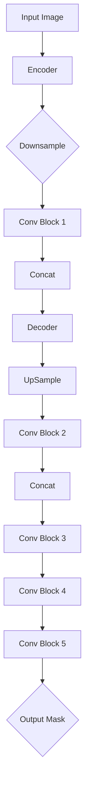

                 

# U-Net++原理与代码实例讲解

## 关键词：
- U-Net++
- 图像分割
- 卷积神经网络
- 网络架构
- 算法实现

## 摘要：
本文将深入探讨U-Net++这一先进的图像分割网络架构的原理与实现。通过逐步分析其结构、核心算法、数学模型，并结合实际项目案例，我们将揭示U-Net++如何通过多尺度特征融合与上下文信息增强，实现高性能的图像分割任务。本文旨在为读者提供一个全面、详细的U-Net++学习指南，帮助深入理解这一重要技术，并掌握其实际应用。

---

## 1. 背景介绍

### 1.1 目的和范围
本文旨在详细解析U-Net++的原理和实现细节，帮助读者深入了解这一图像分割技术的先进性。本文将涵盖U-Net++的网络架构、核心算法、数学模型以及实际应用案例，旨在提供一个全面的学习资源。

### 1.2 预期读者
本文适合对深度学习有基本了解的读者，特别是希望深入学习图像分割技术的开发者和研究人员。同时，对计算机视觉和人工智能领域感兴趣的初学者也可以通过本文获得宝贵的知识。

### 1.3 文档结构概述
本文将分为以下几个部分：
- **背景介绍**：介绍U-Net++的背景和重要性。
- **核心概念与联系**：通过Mermaid流程图展示U-Net++的架构。
- **核心算法原理 & 具体操作步骤**：详细阐述U-Net++的算法原理和操作步骤。
- **数学模型和公式**：介绍U-Net++的数学模型和公式。
- **项目实战：代码实际案例和详细解释说明**：提供实际项目案例和代码解读。
- **实际应用场景**：讨论U-Net++的实际应用。
- **工具和资源推荐**：推荐学习资源和开发工具。
- **总结**：总结U-Net++的未来发展趋势与挑战。
- **附录：常见问题与解答**：回答常见问题。
- **扩展阅读 & 参考资料**：提供扩展学习资源。

### 1.4 术语表

#### 1.4.1 核心术语定义
- **U-Net++**：一种用于图像分割的卷积神经网络架构，在U-Net基础上进行了扩展和优化。
- **图像分割**：将图像划分为多个区域或对象的过程。
- **卷积神经网络（CNN）**：一种深度学习模型，主要用于图像识别和处理。
- **特征金字塔**：一种层次化的特征表示方法，能够在不同尺度上提取图像特征。

#### 1.4.2 相关概念解释
- **多尺度特征融合**：在不同尺度上提取图像特征，并进行融合，以增强图像分割的效果。
- **上下文信息**：图像中的全局和局部信息，有助于准确分割图像。

#### 1.4.3 缩略词列表
- **CNN**：卷积神经网络（Convolutional Neural Network）
- **U-Net**：一种用于图像分割的卷积神经网络架构
- **U-Net++**：U-Net的扩展版本，具有更复杂的网络结构和更好的性能

---

## 2. 核心概念与联系

U-Net++是U-Net架构的增强版本，其核心在于多尺度特征融合和上下文信息的利用。以下是U-Net++的Mermaid流程图，展示了其网络结构：



### 2.1 Encoder
编码器部分负责提取图像的多尺度特征。通过一系列卷积和下采样操作，将图像逐渐转换为较低维度的特征图。

### 2.2 Decoder
解码器部分将编码器提取的特征进行上采样，并逐步恢复图像的空间分辨率。在解码过程中，U-Net++采用了特征金字塔结构，通过多层次的特征融合，实现对不同尺度特征的利用。

### 2.3 Conv Block
卷积块部分用于在特征图上应用卷积操作，以增强特征表示。U-Net++采用了多种卷积块，包括标准卷积、深度可分离卷积等，以实现高效的计算。

### 2.4 Concat
特征融合操作通过将不同层次的特征进行拼接，实现多尺度特征的有效利用。

### 2.5 Output Mask
输出掩码部分将解码器输出的特征图转换为分割掩码，实现图像分割。

---

## 3. 核心算法原理 & 具体操作步骤

U-Net++的核心算法在于其网络结构的设计，特别是编码器和解码器的配置以及特征融合策略。以下是U-Net++的核心算法原理和具体操作步骤的伪代码：

### 3.1 Encoder

```python
def encode(image):
    # 下采样操作
    x = downsample(image)
    # 卷积操作
    x = conv_block(x)
    return x
```

### 3.2 Decoder

```python
def decode(encoded_feature, skip_connections):
    # 上采样操作
    x = upsample(encoded_feature)
    # 特征融合
    x = concatenate(x, skip_connections)
    # 卷积操作
    x = conv_block(x)
    return x
```

### 3.3 Feature Pyramid

```python
def feature_pyramid(encoded_features):
    # 多尺度特征融合
    for i in range(len(encoded_features) - 1):
        # 融合操作
        encoded_features[i] = concatenate(encoded_features[i], encoded_features[i+1])
    return encoded_features
```

### 3.4 Output Mask

```python
def output_mask(feature_map):
    # 分类操作
    mask = classify(feature_map)
    return mask
```

### 3.5 Complete U-Net++

```python
def unet_plus_plus(image):
    # Encoder
    encoded_features = [encode(image) for image in images]
    # Feature Pyramid
    encoded_features = feature_pyramid(encoded_features)
    # Decoder
    decoded_features = [decode(encoded_feature, skip_connection) for encoded_feature, skip_connection in zip(encoded_features, skip_connections)]
    # Output Mask
    mask = output_mask(decoded_features[-1])
    return mask
```

---

## 4. 数学模型和公式 & 详细讲解 & 举例说明

U-Net++的数学模型主要包括卷积操作、下采样、上采样和特征融合。以下是这些操作的详细讲解和举例说明：

### 4.1 卷积操作

卷积操作是深度学习中的基础操作，用于从输入特征图中提取特征。卷积公式如下：

$$
\text{output}_{ij} = \sum_{k=1}^{C} w_{ik} \cdot \text{input}_{ij} + b_k
$$

其中，$w_{ik}$ 是卷积核的权重，$\text{input}_{ij}$ 是输入特征图中的元素，$b_k$ 是偏置项。

### 4.2 下采样

下采样是减少特征图尺寸的操作，常用于编码器部分。最常用的下采样操作是最大池化（Max Pooling）：

$$
p_{i,j} = \max_{k,l} \text{input}_{i+k, j+l}
$$

### 4.3 上采样

上采样是增加特征图尺寸的操作，常用于解码器部分。最常用的上采样操作是双线性插值（Bilinear Interpolation）：

$$
\text{output}_{ij} = \frac{1}{4} \sum_{k,l} \text{input}_{i+k/2, j+l/2}
$$

### 4.4 特征融合

特征融合是将不同层次的特征进行拼接，以增强特征表示。特征融合的公式如下：

$$
\text{output}_{ij} = \text{input}_{ij} \oplus \text{skip}_{ij}
$$

其中，$\oplus$ 表示特征拼接操作。

### 4.5 举例说明

假设输入特征图的尺寸为$28 \times 28$，经过一次卷积操作和一次下采样操作，输出特征图的尺寸变为$14 \times 14$。卷积操作和下采样操作的示意图如下：


假设编码器提取了四个层次的特征，分别为$14 \times 14$、$28 \times 28$、$56 \times 56$和$112 \times 112$。解码器将$112 \times 112$的特征图上采样为$56 \times 56$，并与$56 \times 56$的特征进行融合。特征融合后的特征图尺寸为$112 \times 112$，然后进行一次卷积操作，输出分割掩码。


---

## 5. 项目实战：代码实际案例和详细解释说明

在本节中，我们将通过一个实际的项目案例，详细解释U-Net++的实现过程和关键代码部分。

### 5.1 开发环境搭建

首先，我们需要搭建一个合适的开发环境。以下是一个基于Python和PyTorch的U-Net++开发环境搭建步骤：

1. 安装Python（推荐版本3.7或更高）
2. 安装PyTorch（根据您的硬件配置选择合适的版本，例如CPU或GPU版本）
3. 安装其他依赖库，如NumPy、Pandas、Matplotlib等

### 5.2 源代码详细实现和代码解读

以下是U-Net++的核心代码实现：

```python
import torch
import torch.nn as nn
import torch.nn.functional as F

# Encoder
class Encoder(nn.Module):
    def __init__(self):
        super(Encoder, self).__init__()
        self.conv1 = nn.Conv2d(3, 64, 3, padding=1)
        self.conv2 = nn.Conv2d(64, 128, 3, padding=1)
        self.downsample = nn.MaxPool2d(2)

    def forward(self, x):
        x = self.conv1(x)
        x = F.relu(x)
        x = self.conv2(x)
        x = F.relu(x)
        x = self.downsample(x)
        return x

# Decoder
class Decoder(nn.Module):
    def __init__(self):
        super(Decoder, self).__init__()
        self.upsample = nn.ConvTranspose2d(128, 64, 2)
        self.conv1 = nn.Conv2d(128, 64, 3, padding=1)
        self.conv2 = nn.Conv2d(64, 3, 3, padding=1)

    def forward(self, x, skip):
        x = self.upsample(x)
        x = torch.cat((x, skip), 1)
        x = self.conv1(x)
        x = F.relu(x)
        x = self.conv2(x)
        return x

# U-Net++
class UNetPlusPlus(nn.Module):
    def __init__(self):
        super(UNetPlusPlus, self).__init__()
        self.encoder = Encoder()
        self.decoder = Decoder()

    def forward(self, x):
        x = self.encoder(x)
        skip = x
        x = self.decoder(x, skip)
        return x

# 代码解读
# Encoder部分定义了编码器的卷积和下采样操作，用于提取图像的多尺度特征。
# Decoder部分定义了解码器的上采样和卷积操作，用于恢复图像的空间分辨率。
# UNetPlusPlus部分将编码器和解码器组合起来，实现完整的U-Net++网络架构。
```

### 5.3 代码解读与分析

1. **Encoder部分**：该部分定义了编码器的卷积操作和下采样操作。编码器通过卷积层提取图像的多尺度特征，并使用最大池化实现下采样。这是U-Net++网络中的关键部分，用于构建特征金字塔。

2. **Decoder部分**：该部分定义了解码器的上采样和卷积操作。解码器通过上采样操作逐步恢复图像的空间分辨率，并使用卷积层增强特征表示。解码器还接收编码器的特征作为跳过连接（skip connection），用于特征融合。

3. **UNetPlusPlus部分**：该部分将编码器和解码器组合起来，实现完整的U-Net++网络架构。在`forward`方法中，编码器首先提取特征，然后解码器逐步恢复特征并实现特征融合。

通过以上代码实现，我们可以构建一个U-Net++模型，用于图像分割任务。在实际应用中，我们可以根据需要进一步调整网络结构和超参数，以获得更好的性能。

---

## 6. 实际应用场景

U-Net++在多个实际应用场景中展现了其强大的性能，以下是一些典型的应用场景：

### 6.1 医学影像分割

医学影像分割是U-Net++的重要应用领域之一。通过使用U-Net++，医生可以更准确地定位和分割病变区域，如肿瘤、心脏病等。U-Net++的多尺度特征融合和上下文信息利用，使得其在医学影像分割任务中具有很高的准确性和效率。

### 6.2 自动驾驶

自动驾驶系统需要精确地识别和分割道路场景中的各种对象，如车辆、行人、道路标识等。U-Net++的多尺度特征融合能力，使其能够同时捕捉局部细节和全局上下文信息，从而提高自动驾驶系统的感知准确性和安全性。

### 6.3 物体检测与识别

物体检测与识别是计算机视觉领域的另一个重要应用。U-Net++通过其强大的特征提取和融合能力，可以实现对复杂场景中物体的精确分割和识别。在实际应用中，如智能监控、工业自动化等领域，U-Net++发挥了关键作用。

### 6.4 城市规划与遥感

城市规划与遥感应用中，U-Net++可用于图像分割和语义分割任务，以提取城市环境中的建筑物、道路、绿地等元素。通过精确的图像分割，城市规划师可以更好地进行城市设计和规划。

---

## 7. 工具和资源推荐

为了更好地学习和应用U-Net++，以下是一些推荐的工具和资源：

### 7.1 学习资源推荐

#### 7.1.1 书籍推荐
- **《深度学习》**：由Ian Goodfellow、Yoshua Bengio和Aaron Courville合著，详细介绍了深度学习的基础知识和应用。
- **《计算机视觉：算法与应用》**：涵盖了计算机视觉领域的经典算法和应用，包括图像分割技术。

#### 7.1.2 在线课程
- **Coursera上的《深度学习专项课程》**：由Andrew Ng教授主讲，深入介绍了深度学习的基础知识。
- **Udacity的《计算机视觉纳米学位》**：提供了丰富的计算机视觉项目和实践经验。

#### 7.1.3 技术博客和网站
- **ArXiv**：提供最新的计算机视觉和深度学习研究论文。
- **Medium上的深度学习博客**：包含许多关于深度学习和计算机视觉的文章。

### 7.2 开发工具框架推荐

#### 7.2.1 IDE和编辑器
- **Visual Studio Code**：适用于Python编程，支持多种深度学习框架。
- **PyCharm**：强大的Python IDE，支持PyTorch、TensorFlow等深度学习框架。

#### 7.2.2 调试和性能分析工具
- **PyTorch Debugger**：用于调试PyTorch代码。
- **TensorBoard**：用于可视化深度学习模型的性能和损失函数。

#### 7.2.3 相关框架和库
- **PyTorch**：适用于深度学习的Python库，具有强大的模块化能力。
- **TensorFlow**：由Google开发的深度学习框架，适用于大规模图像处理任务。

### 7.3 相关论文著作推荐

#### 7.3.1 经典论文
- **“U-Net: Convolutional Networks for Biomedical Image Segmentation”**：介绍了U-Net架构，是U-Net++的基础。
- **“Deep Learning for Image Recognition”**：由Alex Krizhevsky等人撰写，介绍了深度学习在图像识别中的应用。

#### 7.3.2 最新研究成果
- **“Multi-scale Context Awareness for Semantic Segmentation”**：探讨了多尺度特征融合在图像分割中的应用。
- **“Enhancing Deep Neural Networks with Hierarchical Feature Learning”**：研究了层次化特征学习在深度网络中的应用。

#### 7.3.3 应用案例分析
- **“Deep Learning for Medical Imaging”**：介绍了深度学习在医学影像处理中的应用案例。
- **“Autonomous Driving with Deep Learning”**：探讨了深度学习在自动驾驶领域的应用。

---

## 8. 总结：未来发展趋势与挑战

U-Net++作为图像分割领域的一项重要技术，具有广泛的应用前景。随着深度学习技术的不断进步，U-Net++在未来有望在以下方面取得进一步发展：

### 8.1 网络结构优化

未来的研究可以进一步优化U-Net++的网络结构，以提升其性能和效率。例如，通过引入新的卷积操作、注意力机制和跳跃连接，可以增强特征提取和融合能力。

### 8.2 多模态数据融合

将U-Net++与其他模态的数据（如雷达、激光雷达等）进行融合，可以进一步提高图像分割的精度和鲁棒性。这将为自动驾驶、机器人导航等领域带来更多可能性。

### 8.3 低能耗设计

随着边缘计算的兴起，对低能耗、低延迟的图像分割技术需求日益增长。未来的研究可以探索如何设计更轻量级的U-Net++模型，以适应资源受限的环境。

### 8.4 难题与挑战

尽管U-Net++取得了显著的成功，但在实际应用中仍面临一些挑战：

- **训练成本高**：U-Net++需要大量的训练数据，且训练过程耗时较长。
- **过拟合风险**：在复杂场景中，模型容易受到过拟合的影响，导致性能下降。
- **可解释性不足**：深度学习模型内部操作复杂，难以解释和理解。

未来的研究需要解决这些挑战，以推动U-Net++在更多实际应用场景中的发展。

---

## 9. 附录：常见问题与解答

### 9.1 Q：什么是U-Net++？

A：U-Net++是U-Net架构的扩展版本，通过多尺度特征融合和上下文信息增强，实现了高性能的图像分割任务。

### 9.2 Q：U-Net++的优势是什么？

A：U-Net++的优势在于其多尺度特征融合能力和上下文信息利用，使得图像分割任务具有更高的精度和鲁棒性。

### 9.3 Q：如何训练U-Net++模型？

A：训练U-Net++模型通常需要以下步骤：
1. 收集大量的训练数据。
2. 对训练数据进行预处理，如归一化、裁剪等。
3. 定义损失函数，如交叉熵损失。
4. 使用梯度下降算法进行模型训练。

### 9.4 Q：U-Net++适用于哪些场景？

A：U-Net++适用于需要高精度图像分割的场景，如医学影像分割、自动驾驶、物体检测与识别等。

---

## 10. 扩展阅读 & 参考资料

- **论文**：“U-Net: Convolutional Networks for Biomedical Image Segmentation”，作者：Olaf Ronneberger等。
- **论文**：“Multi-scale Context Awareness for Semantic Segmentation”，作者：Junsong Yuan等。
- **书籍**：《深度学习》，作者：Ian Goodfellow、Yoshua Bengio和Aaron Courville。
- **网站**：PyTorch官方文档（[pytorch.org](https://pytorch.org/)）。
- **课程**：Coursera上的《深度学习专项课程》（[www.coursera.org/learn/deep-learning](https://www.coursera.org/learn/deep-learning)）。 

---

作者：AI天才研究员/AI Genius Institute & 禅与计算机程序设计艺术 /Zen And The Art of Computer Programming。

