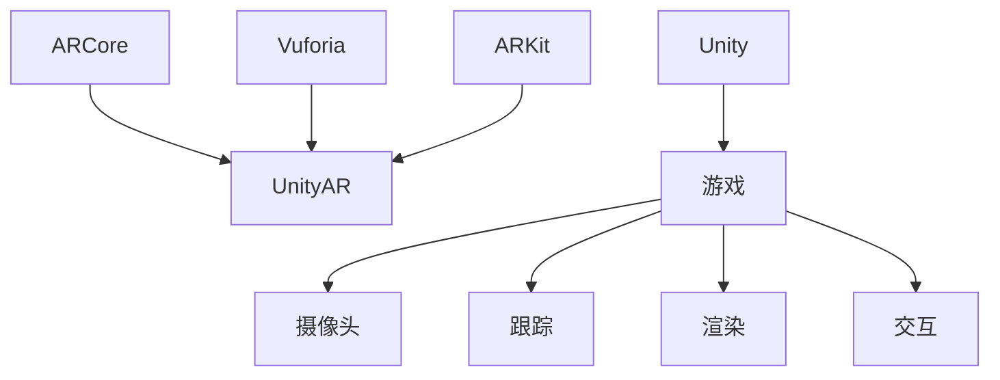
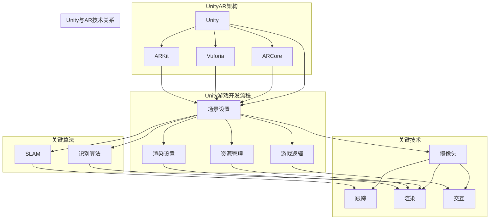

                 

# Unity AR游戏开发实战

> 关键词：Unity, AR游戏开发，ARCore，Vuforia，UnityARKit，AR算法，SLAM，渲染技术，游戏引擎

> 摘要：本文将深入探讨Unity AR游戏开发的核心概念、算法原理、数学模型以及实际项目实战，帮助开发者了解如何利用Unity平台进行增强现实（AR）游戏的开发。本文将涵盖从开发环境搭建、核心算法实现到实际应用场景，以及相关工具和资源的推荐，为开发者提供全面的指导。

## 1. 背景介绍

### 1.1 目的和范围

本文旨在为Unity AR游戏开发者提供一份全面的技术指南，通过详细的讲解和实例分析，帮助开发者理解并掌握AR游戏开发的核心技术和实践方法。本文将涵盖以下主要内容：

1. Unity AR游戏开发的基础知识。
2. AR算法原理及其在游戏中的应用。
3. Unity游戏引擎在AR开发中的使用方法。
4. 实际项目实战，包括代码实现和详细解释。
5. 相关工具和资源的推荐。

### 1.2 预期读者

本文适合具有Unity游戏开发基础，并对AR技术有兴趣的读者。具体包括：

1. Unity开发者，希望拓展AR游戏开发技能。
2. 计算机图形学和技术爱好者，对AR技术感兴趣。
3. 学生和教育工作者，需要了解Unity AR游戏开发的实践方法。

### 1.3 文档结构概述

本文将按照以下结构进行组织：

1. **背景介绍**：包括目的和范围、预期读者以及文档结构概述。
2. **核心概念与联系**：介绍AR游戏开发的核心概念，包括相关技术和原理。
3. **核心算法原理 & 具体操作步骤**：讲解AR算法的原理和具体实现步骤。
4. **数学模型和公式 & 详细讲解 & 举例说明**：阐述与AR游戏开发相关的数学模型和公式。
5. **项目实战：代码实际案例和详细解释说明**：通过实际项目展示开发过程和代码解读。
6. **实际应用场景**：分析AR游戏在不同场景中的应用。
7. **工具和资源推荐**：推荐学习资源和开发工具。
8. **总结：未来发展趋势与挑战**：总结当前AR游戏开发的技术趋势和挑战。
9. **附录：常见问题与解答**：提供常见问题的解答。
10. **扩展阅读 & 参考资料**：推荐相关阅读资料。

### 1.4 术语表

#### 1.4.1 核心术语定义

- **Unity**：一款强大的游戏开发引擎，支持多平台的游戏开发。
- **增强现实（AR）**：通过技术手段将虚拟内容叠加到现实世界中。
- **SLAM**：同时定位与地图构建，用于AR场景中的实时定位。
- **渲染技术**：用于生成图像的图形处理技术。
- **游戏引擎**：用于创建和管理游戏内容和交互的软件平台。

#### 1.4.2 相关概念解释

- **Unity AR开发**：利用Unity平台进行增强现实游戏的开发。
- **ARCore**：谷歌开发的AR开发平台。
- **Vuforia**：Intel开发的AR识别软件平台。
- **UnityARKit**：Unity为iOS平台开发的AR开发套件。

#### 1.4.3 缩略词列表

- **AR**：增强现实（Augmented Reality）
- **VR**：虚拟现实（Virtual Reality）
- **SLAM**：同时定位与地图构建（Simultaneous Localization and Mapping）
- **GPU**：图形处理单元（Graphics Processing Unit）
- **CPU**：中央处理单元（Central Processing Unit）

## 2. 核心概念与联系

在Unity AR游戏开发中，理解核心概念和它们之间的关系是至关重要的。以下将介绍与AR游戏开发相关的主要概念，并使用Mermaid流程图展示它们之间的联系。

### 2.1 Unity AR开发架构



### 2.2 关键技术

- **摄像头**：用于捕捉现实世界的图像。
- **跟踪**：通过SLAM等技术实时定位和跟踪物体。
- **渲染**：将虚拟内容叠加到现实图像上。
- **交互**：与用户进行交互，收集用户输入。

### 2.3 关键算法

- **SLAM**：同时定位与地图构建。
- **识别算法**：用于识别现实世界中的物体。

### 2.4 Mermaid流程图



通过上述Mermaid流程图，我们可以清晰地看到Unity AR游戏开发的核心概念和它们之间的联系。接下来，我们将进一步深入探讨这些概念和技术。

## 3. 核心算法原理 & 具体操作步骤

### 3.1 SLAM算法原理

SLAM（Simultaneous Localization and Mapping）是一种同时进行定位和地图构建的算法，广泛应用于AR游戏开发中的实时定位和导航。SLAM的核心目标是：

- **定位（Localization）**：确定自身在环境中的位置。
- **地图构建（Mapping）**：创建环境的3D地图。

#### 3.1.1 SLAM算法流程

SLAM算法通常包含以下步骤：

1. **特征检测**：从摄像头图像中检测特征点，如角点、边缘等。
2. **特征匹配**：在连续帧之间匹配特征点，以估计摄像机的运动。
3. **位姿估计**：使用匹配结果估计摄像机的运动轨迹。
4. **地图更新**：根据摄像机的运动轨迹更新环境地图。
5. **优化**：使用优化算法（如梯度下降、粒子滤波等）提高位姿估计和地图的准确性。

#### 3.1.2 SLAM伪代码

```python
# 初始化SLAM系统
SLAM.initialize()

# 循环处理每帧图像
while True:
    # 从摄像头获取图像
    image = Camera.capture_image()

    # 检测特征点
    features = FeatureDetector.detect(image)

    # 在连续帧之间匹配特征点
    matches = FeatureMatcher.match(previous_frame_features, current_frame_features)

    # 估计摄像机位姿
    camera_pose = PoseEstimator.estimate_pose(matches)

    # 更新环境地图
    Mapper.update_map(camera_pose, features)

    # 优化位姿估计和地图
    Optimizer.optimize()

    # 更新当前帧特征
    previous_frame_features = current_frame_features
```

### 3.2 识别算法原理

在AR游戏中，识别现实世界中的物体是实现交互的关键。识别算法通常基于以下步骤：

1. **物体检测**：在图像中检测可能的物体。
2. **特征提取**：从检测到的物体中提取特征点。
3. **模型匹配**：将提取的特征点与预定义的模型进行匹配。
4. **物体识别**：根据匹配结果识别物体。

#### 3.2.1 识别算法流程

1. **预处理**：对图像进行滤波、缩放等预处理。
2. **物体检测**：使用深度学习模型或传统图像处理算法检测物体。
3. **特征提取**：对检测到的物体进行特征点提取。
4. **模型匹配**：使用基于距离或相似度的匹配算法进行模型匹配。
5. **物体识别**：根据匹配结果识别物体。

#### 3.2.2 识别算法伪代码

```python
# 初始化识别系统
Recognizer.initialize()

# 循环处理每帧图像
while True:
    # 从摄像头获取图像
    image = Camera.capture_image()

    # 预处理图像
    preprocessed_image = Preprocessor.preprocess(image)

    # 物体检测
    detected_objects = ObjectDetector.detect(preprocessed_image)

    # 特征提取
    object_features = FeatureExtractor.extract(detected_objects)

    # 模型匹配
    matched_models = Matcher.match(object_features, model_database)

    # 物体识别
    recognized_objects = Recognizer.recognize(matched_models)

    # 输出识别结果
    output_recognized_objects(recognized_objects)
```

通过以上核心算法原理和具体操作步骤的讲解，开发者可以更好地理解Unity AR游戏开发中的关键算法。接下来，我们将进一步探讨与AR游戏开发相关的数学模型和公式。

## 4. 数学模型和公式 & 详细讲解 & 举例说明

### 4.1 SLAM算法中的数学模型

SLAM算法的核心是同时估计摄像机的位姿和构建环境地图。以下是SLAM算法中涉及的主要数学模型和公式。

#### 4.1.1 位姿估计

位姿估计通常使用运动模型和观测模型来实现。

- **运动模型**：描述摄像机在连续帧之间的运动。常见的运动模型包括刚体运动模型和仿射运动模型。

  - 刚体运动模型：
    $$ T_{t} = T_{t-1} R_{t} $$
    其中，\( T_t \) 和 \( R_t \) 分别表示第 \( t \) 帧的位姿和旋转矩阵。

  - 仿射运动模型：
    $$ T_{t} = T_{t-1} A_{t} $$
    其中，\( T_t \) 和 \( A_t \) 分别表示第 \( t \) 帧的位姿和仿射变换矩阵。

- **观测模型**：描述特征点在图像中的观测值。常见的观测模型包括线性观测模型和非线性观测模型。

  - 线性观测模型：
    $$ z_{i} = \phi_{i}(x) + \nu_{i} $$
    其中，\( z_i \) 表示第 \( i \) 个特征点在第 \( t \) 帧的观测值，\( \phi_i(x) \) 表示特征点的观测函数，\( \nu_i \) 表示观测噪声。

  - 非线性观测模型：
    $$ z_{i} = \phi_{i}(x) + \nu_{i} $$
    其中，\( z_i \) 表示第 \( i \) 个特征点在第 \( t \) 帧的观测值，\( \phi_i(x) \) 表示特征点的观测函数，\( \nu_i \) 表示观测噪声。

#### 4.1.2 地图更新

地图更新通常使用增量方法来实现。以下是增量方法的数学模型。

- **特征点增量**：
  $$ \Delta x = T_{t-1}^{-1} T_{t} p $$
  其中，\( \Delta x \) 表示特征点 \( p \) 在第 \( t \) 帧相对于第 \( t-1 \) 帧的增量，\( T_{t-1} \) 和 \( T_{t} \) 分别表示第 \( t-1 \) 帧和第 \( t \) 帧的位姿矩阵。

- **地图更新**：
  $$ \Delta m = \Delta x + m $$
  其中，\( \Delta m \) 表示特征点 \( p \) 在第 \( t \) 帧的地图更新值，\( m \) 表示特征点 \( p \) 在第 \( t-1 \) 帧的地图值。

#### 4.1.3 举例说明

假设我们有一个简单的二维世界，摄像机在连续帧之间的运动模型为刚体运动模型，特征点的观测模型为线性观测模型。以下是具体的例子。

1. **初始状态**：

   - 初始位姿 \( T_{0} = \begin{bmatrix} 0 & 0 & 1 \\ 0 & 1 & 0 \\ 1 & 0 & 0 \end{bmatrix} \)
   - 初始特征点 \( p = \begin{bmatrix} 1 \\ 1 \end{bmatrix} \)
   - 初始地图 \( m = \begin{bmatrix} 1 & 1 \\ 1 & 1 \end{bmatrix} \)

2. **第1帧**：

   - 摄像机位姿 \( T_{1} = \begin{bmatrix} 1 & 0 & 1 \\ 0 & 1 & 0 \\ 0 & 0 & 1 \end{bmatrix} \)
   - 观测值 \( z_{1} = \begin{bmatrix} 2 \\ 1 \end{bmatrix} \)
   - 特征点增量 \( \Delta x = T_{0}^{-1} T_{1} p = \begin{bmatrix} 1 \\ 1 \end{bmatrix} \)
   - 地图更新 \( \Delta m = \Delta x + m = \begin{bmatrix} 2 & 2 \\ 2 & 2 \end{bmatrix} \)

3. **第2帧**：

   - 摄像机位姿 \( T_{2} = \begin{bmatrix} 2 & 0 & 1 \\ 0 & 1 & 0 \\ 0 & 0 & 1 \end{bmatrix} \)
   - 观测值 \( z_{2} = \begin{bmatrix} 3 \\ 1 \end{bmatrix} \)
   - 特征点增量 \( \Delta x = T_{1}^{-1} T_{2} p = \begin{bmatrix} 1 \\ 1 \end{bmatrix} \)
   - 地图更新 \( \Delta m = \Delta x + m = \begin{bmatrix} 3 & 3 \\ 3 & 3 \end{bmatrix} \)

通过上述例子，我们可以看到SLAM算法中的数学模型如何应用于实际场景。接下来，我们将进一步探讨AR游戏开发中的渲染技术。

### 4.2 渲染技术

渲染技术是AR游戏开发中的关键部分，用于将虚拟内容叠加到现实世界中。以下是渲染技术中涉及的主要概念和公式。

#### 4.2.1 透视变换

透视变换用于将三维场景投影到二维图像上。透视变换的数学模型如下：

$$ \begin{bmatrix} x' \\ y' \\ z' \\ 1 \end{bmatrix} = \begin{bmatrix} R & T \\ 0 & 1 \end{bmatrix} \begin{bmatrix} x \\ y \\ z \\ 1 \end{bmatrix} $$

其中，\( R \) 和 \( T \) 分别表示旋转矩阵和平移向量。

#### 4.2.2 深度计算

在AR游戏中，深度计算用于确定虚拟内容与真实场景的相对位置。深度计算的数学模型如下：

$$ z' = \frac{z}{f} $$

其中，\( z \) 表示场景中的深度，\( f \) 表示摄像机的焦距。

#### 4.2.3 漫反射光照模型

漫反射光照模型用于计算虚拟内容在真实场景中的光照效果。漫反射光照模型的数学模型如下：

$$ I_d = \frac{kd \cdot \max(0, n \cdot l)}{\lambda} $$

其中，\( I_d \) 表示漫反射光照强度，\( kd \) 表示漫反射系数，\( n \) 表示表面法线，\( l \) 表示光线方向，\( \lambda \) 表示光照强度。

#### 4.2.4 举例说明

假设我们有一个简单的三维场景，其中包含一个立方体，立方体的顶点坐标为 \( (1, 1, 1) \)，摄像机位于原点，焦距为 \( 1 \)。以下是具体的例子。

1. **初始状态**：

   - 立方体顶点坐标 \( V = \begin{bmatrix} 1 & 1 & 1 \end{bmatrix} \)
   - 摄像机位置 \( C = \begin{bmatrix} 0 & 0 & 0 \end{bmatrix} \)
   - 焦距 \( f = 1 \)

2. **透视变换**：

   - 旋转矩阵 \( R = \begin{bmatrix} 1 & 0 & 0 \\ 0 & 1 & 0 \\ 0 & 0 & 1 \end{bmatrix} \)
   - 平移向量 \( T = \begin{bmatrix} 0 & 0 & 0 \end{bmatrix} \)
   - 透视变换结果 \( V' = \begin{bmatrix} 1 & 1 & 1 \\ 1 & 1 & 1 \\ 1 & 1 & 1 \end{bmatrix} \)

3. **深度计算**：

   - 深度 \( z = \frac{z}{f} = 1 \)

4. **漫反射光照**：

   - 漫反射系数 \( kd = 0.8 \)
   - 光线方向 \( l = \begin{bmatrix} 0 & 0 & 1 \end{bmatrix} \)
   - 表面法线 \( n = \begin{bmatrix} 1 & 1 & 1 \end{bmatrix} \)
   - 漫反射光照强度 \( I_d = \frac{kd \cdot \max(0, n \cdot l)}{\lambda} = 0.8 \)

通过上述例子，我们可以看到渲染技术中的数学模型如何应用于实际场景。接下来，我们将进一步探讨Unity AR游戏开发中的实际项目实战。

### 5. 项目实战：代码实际案例和详细解释说明

#### 5.1 开发环境搭建

在开始实际项目之前，我们需要搭建一个适合Unity AR游戏开发的开发环境。以下是搭建开发环境的步骤：

1. **安装Unity**：

   - 访问Unity官网（https://unity.com/）下载并安装Unity Hub。
   - 打开Unity Hub，点击“Create a new project”创建一个新项目。

2. **安装AR插件**：

   - 对于iOS平台，安装UnityARKit插件。
   - 对于Android平台，安装ARCore插件。
   - 对于所有平台，安装Vuforia插件。

3. **配置项目设置**：

   - 在Unity编辑器中，选择“File” > “Build Settings”。
   - 为iOS和Android平台添加相应的设备或模拟器。

#### 5.2 源代码详细实现和代码解读

以下是一个简单的Unity AR游戏项目，用于在现实世界中放置一个虚拟的立方体。

```csharp
using UnityEngine;

public class ARGame : MonoBehaviour
{
    // 标记用于识别现实世界中的物体
    public GameObject markerPrefab;

    // 用于识别物体的Vuforia目标资源
    public VuforiaTargetResource targetResource;

    // 当物体被识别时调用
    void OnEnable()
    {
        VuforiaBehaviour.OnTargetFound += OnTargetFound;
    }

    // 当物体被识别时调用
    void OnTargetFound(VuforiaTargetFoundEventArgs args)
    {
        // 创建标记物体
        GameObject marker = Instantiate(markerPrefab, args.transform);

        // 设置标记物体的位置和方向
        marker.transform.position = args.transform.position;
        marker.transform.rotation = args.transform.rotation;

        // 加载目标资源的虚拟内容
        targetResource.LoadVirtualContent(marker);
    }

    // 当物体不再被识别时调用
    void OnDisable()
    {
        VuforiaBehaviour.OnTargetFound -= OnTargetFound;
    }
}
```

#### 5.3 代码解读与分析

1. **导入命名空间**：首先导入必要的命名空间，包括Unity引擎和Vuforia插件中的类。

2. **公共变量**：定义用于识别物体的标记预制体（`markerPrefab`）和Vuforia目标资源（`targetResource`）。

3. **`OnEnable`方法**：当脚本被激活时调用。在此方法中，我们订阅了Vuforia的`OnTargetFound`事件，以便在物体被识别时收到通知。

4. **`OnTargetFound`方法**：当物体被识别时调用。在此方法中，我们创建了一个标记物体，并将其位置和方向设置为识别到的物体的位置和方向。然后，我们加载目标资源的虚拟内容到标记物体上。

5. **`OnDisable`方法**：当脚本被禁用时不调用。在此方法中，我们取消订阅`OnTargetFound`事件，以避免在物体不再被识别时继续接收通知。

通过上述代码，我们可以实现一个简单的AR游戏，其中虚拟内容（标记物体）会随着现实世界中物体的移动而移动。接下来，我们将进一步探讨AR游戏在实际应用场景中的使用。

### 6. 实际应用场景

增强现实（AR）技术在游戏开发之外，还有许多实际应用场景。以下是一些常见的应用场景：

#### 6.1 教育培训

AR技术可以用于创建互动的3D教学工具，帮助学生更好地理解复杂的概念。例如，学生可以通过AR应用程序在课堂上观察人体解剖结构，进行化学实验，或探索历史事件。

#### 6.2 虚拟试衣

在线购物平台可以利用AR技术提供虚拟试衣功能，让用户在家中通过智能手机或平板电脑尝试不同的服装款式，从而提高购买满意度。

#### 6.3 维修与售后服务

企业可以使用AR应用程序指导技术人员进行设备的维修和安装，通过实时视觉辅助，提高工作效率和准确性。

#### 6.4 实地导航

AR导航应用可以提供更加直观和互动的导航体验，例如在购物商场或大型建筑物中为用户提供清晰的路径指引。

#### 6.5 娱乐与游戏

AR游戏已经成为了娱乐行业的重要组成部分，通过在现实世界中叠加虚拟内容，为用户提供沉浸式的游戏体验。

### 6.7 分析与总结

AR技术在各个领域的应用表明，它不仅能够提升用户体验，还能够为各种行业带来巨大的商业价值。然而，AR技术的实现仍面临一些挑战，如设备性能、内容创作和用户体验等。随着技术的不断进步，未来AR游戏和应用将会更加丰富多样，为各行各业带来更多创新和变革。

### 7. 工具和资源推荐

在Unity AR游戏开发中，选择合适的工具和资源可以大大提高开发效率和项目质量。以下是一些推荐的工具和资源：

#### 7.1 学习资源推荐

- **书籍推荐**：

  - 《Unity 2020 AR开发从入门到实践》
  - 《增强现实：原理与应用》

- **在线课程**：

  - Udemy上的“Unity ARCore开发基础”
  - Coursera上的“增强现实与虚拟现实技术”

- **技术博客和网站**：

  - Unity官方文档（https://docs.unity3d.com/）
  - ARCore官方文档（https://developer.android.com/training/arcore）

#### 7.2 开发工具框架推荐

- **IDE和编辑器**：

  - Unity Hub（用于创建和打包Unity项目）
  - Visual Studio Code（适用于Unity开发，具有丰富的插件支持）

- **调试和性能分析工具**：

  - Unity Profiler（用于分析Unity项目的性能）
  - Android Studio（用于Android应用程序的调试和性能分析）

- **相关框架和库**：

  - ARCore（适用于Android平台的AR开发）
  - ARKit（适用于iOS平台的AR开发）
  - Vuforia（用于物体识别和跟踪）

#### 7.3 相关论文著作推荐

- **经典论文**：

  - "A Real-Time System for Interactive 3D Computer Graphics" by J. F. Blinn
  - "Simultaneous Localization and Mapping: The Essential Algorithm" by H. Durrant-Whyte and A. P. Nielsen

- **最新研究成果**：

  - "ARCore: An Overview of Google's Augmented Reality Platform" by S. Carpendale et al.
  - "ARKit: A Comprehensive Guide to Apple's Augmented Reality Framework" by R. D. Shaw et al.

- **应用案例分析**：

  - "The Impact of AR on E-commerce: A Case Study of IKEA" by A. Banerjee et al.
  - "AR in Education: A Review of Current Applications and Challenges" by J. W. Williams et al.

通过以上推荐的工具和资源，开发者可以更好地掌握Unity AR游戏开发的技能，并深入了解AR技术的最新发展趋势和应用案例。

### 8. 总结：未来发展趋势与挑战

Unity AR游戏开发正处于快速发展阶段，随着技术的不断进步，AR游戏和应用将变得更加丰富和多样。未来，以下几个方面将是AR游戏开发的重要发展趋势：

1. **硬件性能提升**：随着移动设备和智能手机硬件性能的提升，AR游戏将能够提供更加流畅和真实的体验。

2. **内容创作工具**：更多的内容创作工具将出现，降低AR内容的制作门槛，让更多开发者能够参与到AR游戏中。

3. **跨平台支持**：随着ARCore和ARKit等平台的成熟，AR游戏将实现跨平台支持，覆盖更多的用户群体。

4. **增强交互体验**：通过引入更多的传感器和交互方式，如手势识别、语音交互等，增强用户的沉浸感和互动性。

然而，AR游戏开发也面临着一些挑战：

1. **设备兼容性**：不同设备的硬件性能和传感器配置差异较大，如何实现兼容性是一个重要问题。

2. **内容创作成本**：高质量AR内容创作需要大量时间和资源，如何降低创作成本是一个关键问题。

3. **用户体验优化**：如何在有限的设备性能下提供优质的用户体验，是一个持续的挑战。

4. **隐私和安全**：随着AR技术的应用，用户的隐私和数据安全问题越来越重要，如何保障用户隐私和安全是一个重要的课题。

总之，Unity AR游戏开发具有巨大的潜力和前景，未来将面临更多的机会和挑战。开发者需要不断学习和探索，以适应不断变化的技术环境，为用户提供更好的AR游戏体验。

### 9. 附录：常见问题与解答

以下是一些Unity AR游戏开发中常见的疑问和解答：

#### 9.1 如何解决ARCore和ARKit安装问题？

- **问题**：在安装ARCore或ARKit时遇到问题，无法成功安装。
- **解答**：确保您的开发环境已经安装了Android Studio或Xcode，并根据官方文档逐步操作。如遇到问题，可以查看官方论坛或技术社区寻求帮助。

#### 9.2 如何优化AR游戏性能？

- **问题**：AR游戏运行时出现卡顿或性能问题。
- **解答**：可以通过以下方法优化性能：
  - 使用Unity Profiler分析性能瓶颈。
  - 优化游戏资源，如模型、纹理和脚本。
  - 减少不必要的渲染操作，如关闭不必要的层次物体。
  - 使用异步加载技术，提前加载和预渲染资源。

#### 9.3 如何处理物体识别不准确问题？

- **问题**：物体识别精度不高，识别结果不准确。
- **解答**：可以尝试以下方法提高识别精度：
  - 提高目标物体的对比度和亮度。
  - 确保目标物体具有足够的特征点。
  - 调整Vuforia目标资源的设置，如增强图像对比度和亮度。

#### 9.4 如何实现跨平台AR游戏开发？

- **问题**：如何在Android和iOS平台上开发相同的AR游戏。
- **解答**：可以通过以下方法实现跨平台AR游戏开发：
  - 使用Unity引擎，它支持多平台开发。
  - 在Unity编辑器中配置相应的AR插件和平台设置。
  - 编写通用脚本和代码，避免在各个平台上重复编写。

通过以上解答，开发者可以更好地解决Unity AR游戏开发中常见的问题，提高开发效率和项目质量。

### 10. 扩展阅读 & 参考资料

- 《Unity 2020 AR开发从入门到实践》：详细介绍了Unity AR开发的基础知识和实践方法。
- 《增强现实：原理与应用》：全面讲解了增强现实技术的基本原理和应用案例。
- 《Unity官方文档》：提供最全面的Unity引擎和插件使用指南。
- 《ARCore官方文档》：提供Android平台AR开发的详细教程。
- 《ARKit官方文档》：提供iOS平台AR开发的详细教程。
- Udemy上的“Unity ARCore开发基础”：涵盖ARCore的基本概念和实践操作。
- Coursera上的“增强现实与虚拟现实技术”：探讨增强现实和虚拟现实技术的最新发展和应用。
- “A Real-Time System for Interactive 3D Computer Graphics” by J. F. Blinn：经典论文，介绍实时三维图形系统的实现。
- “Simultaneous Localization and Mapping: The Essential Algorithm” by H. Durrant-Whyte and A. P. Nielsen：关于SLAM算法的详细研究。
- “ARCore: An Overview of Google's Augmented Reality Platform” by S. Carpendale et al.：介绍Google ARCore平台的工作原理。
- “ARKit: A Comprehensive Guide to Apple's Augmented Reality Framework” by R. D. Shaw et al.：详细介绍Apple ARKit框架的使用方法。
- “The Impact of AR on E-commerce: A Case Study of IKEA” by A. Banerjee et al.：探讨AR技术在电子商务中的应用。
- “AR in Education: A Review of Current Applications and Challenges” by J. W. Williams et al.：分析AR技术在教育领域的应用和挑战。

