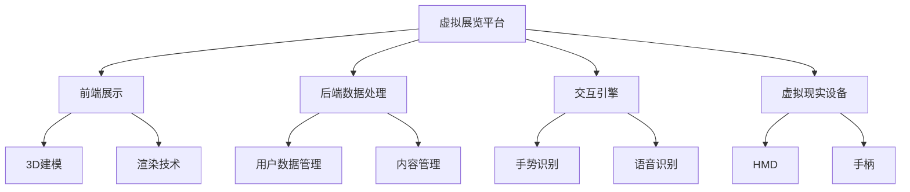

                 

# VR虚拟展览平台：文化艺术的创新展示方式

> **关键词**：VR虚拟现实、文化艺术、展示平台、互动体验、沉浸感、虚拟展览

> **摘要**：本文将探讨VR虚拟展览平台在现代文化艺术展示中的应用，通过分析其背景、核心概念、算法原理、数学模型以及实际应用案例，深入探讨VR技术在文化艺术领域的创新展示方式，旨在为相关领域的专业人士和研究者提供有价值的参考和启示。

## 1. 背景介绍

### 1.1 目的和范围

本文的目的是探讨VR虚拟展览平台在文化艺术展示中的应用，分析其技术原理和实现方法，以及探讨未来VR技术在文化艺术领域的发展趋势。文章将围绕以下主题进行展开：

1. VR虚拟展览平台的背景和意义。
2. 核心概念和架构。
3. 算法原理和数学模型。
4. 实际应用案例。
5. 未来发展趋势与挑战。

### 1.2 预期读者

本文主要面向以下两类读者：

1. 对VR技术在文化艺术领域应用感兴趣的技术研发人员、设计师和内容创作者。
2. 对VR虚拟展览平台有实际需求的企业、机构和文化艺术领域的管理者。

### 1.3 文档结构概述

本文的结构分为以下几部分：

1. 背景介绍：介绍VR虚拟展览平台的背景、目的和预期读者。
2. 核心概念与联系：阐述VR虚拟展览平台的核心概念和架构。
3. 核心算法原理 & 具体操作步骤：分析VR虚拟展览平台的核心算法原理和实现步骤。
4. 数学模型和公式 & 详细讲解 & 举例说明：介绍VR虚拟展览平台中的数学模型和公式，并进行详细讲解。
5. 项目实战：展示VR虚拟展览平台的实际应用案例和详细解释说明。
6. 实际应用场景：探讨VR虚拟展览平台在不同文化艺术领域的应用场景。
7. 工具和资源推荐：推荐相关的学习资源和开发工具。
8. 总结：对未来VR虚拟展览平台的发展趋势与挑战进行总结。
9. 附录：常见问题与解答。
10. 扩展阅读 & 参考资料：提供扩展阅读和参考资料。

### 1.4 术语表

#### 1.4.1 核心术语定义

- VR（Virtual Reality）：虚拟现实，一种通过计算机技术模拟出来的三维空间环境，用户可以通过头戴显示器（HMD）等设备沉浸其中。
- AR（Augmented Reality）：增强现实，通过计算机技术将虚拟信息叠加到现实环境中，用户可以通过智能手机或平板电脑等设备看到。
- 3D建模：使用软件工具创建三维物体或场景的过程，包括几何建模、材质贴图和动画制作等。
- 互动体验：用户在虚拟环境中与虚拟物体进行交互，如触碰、旋转、缩放等。
- 沉浸感：用户在虚拟环境中感受到的逼真程度，越高越好。

#### 1.4.2 相关概念解释

- 展览平台：用于展示和展示艺术品、文化物品等的平台，可以是实体展览馆或虚拟展览馆。
- 虚拟展览：通过VR或AR技术实现的在线展览，用户可以在虚拟环境中浏览、互动和体验。
- 虚拟现实头戴显示器（HMD）：一种显示设备，用于将用户沉浸到虚拟环境中，常见的有VR眼镜和VR头盔等。
- 增强现实头戴显示器（HMD）：一种显示设备，用于将虚拟信息叠加到现实环境中，常见的有AR眼镜和AR头盔等。

#### 1.4.3 缩略词列表

- VR：Virtual Reality
- AR：Augmented Reality
- HMD：Head-Mounted Display
- IDE：Integrated Development Environment
- CPU：Central Processing Unit
- GPU：Graphics Processing Unit

## 2. 核心概念与联系

在VR虚拟展览平台的设计和实现过程中，我们需要关注以下几个核心概念和联系：

### 2.1. 虚拟现实与增强现实

VR和AR是两种不同的技术，VR是全沉浸式体验，用户完全沉浸在虚拟环境中，而AR则是将虚拟信息叠加到现实环境中，用户仍能保持对现实世界的感知。在VR虚拟展览平台中，我们主要关注VR技术，通过头戴显示器等设备为用户提供沉浸式的展览体验。

### 2.2. 虚拟展览平台架构

虚拟展览平台可以分为以下几个主要部分：

1. **前端展示**：通过3D建模和渲染技术，将虚拟展览馆和展品呈现给用户，包括展览馆的建筑、布置、灯光等。
2. **后端数据处理**：用于处理用户数据、管理展览馆内容、提供搜索和推荐等功能。
3. **交互引擎**：实现用户与虚拟展览馆的交互，如浏览、触摸、旋转等操作。
4. **虚拟现实设备**：如VR头戴显示器、手柄等，为用户提供沉浸式的体验。

### 2.3. 3D建模与渲染

3D建模是虚拟展览平台的核心技术之一，通过对展品进行三维建模，可以更加真实地还原展品的形态和质感。渲染技术则是将3D模型渲染成逼真的图像，为用户提供视觉上的体验。

### 2.4. 互动体验与沉浸感

互动体验和沉浸感是虚拟展览平台的重要评价指标，通过引入手势识别、语音识别等技术，用户可以与虚拟展览馆进行互动，提高用户体验。而沉浸感则通过优化渲染效果、降低延迟等技术手段来提升。

### 2.5. 虚拟展览平台与实体展览馆的联动

虚拟展览平台不仅可以独立运行，还可以与实体展览馆进行联动，通过线上线下结合的方式，为用户提供更丰富的展览体验。

### 2.6. Mermaid流程图

为了更好地展示虚拟展览平台的核心概念和架构，我们可以使用Mermaid流程图来表示，具体如下：



通过以上核心概念和联系的分析，我们可以更好地理解VR虚拟展览平台的设计和实现过程，为后续的内容提供基础。

## 3. 核心算法原理 & 具体操作步骤

在VR虚拟展览平台中，核心算法原理主要涉及3D建模与渲染技术、交互引擎和虚拟现实设备控制。下面将分别介绍这些核心算法原理及其具体操作步骤。

### 3.1. 3D建模与渲染技术

3D建模与渲染技术是虚拟展览平台的基础，其核心算法原理包括：

#### 3.1.1. 几何建模

几何建模是3D建模的基础，通过定义物体的几何形状和尺寸来创建模型。常见的几何建模方法包括：

- **多面体建模**：使用多边形网格来定义物体的表面，是最常见的3D建模方法。
- **曲面建模**：使用曲面来定义物体的表面，如贝塞尔曲面和NURBS曲面。

伪代码示例：

```
// 几何建模：多面体建模
function createMesh(vertices, faces) {
    mesh = new Mesh();
    mesh.vertices = vertices;
    mesh.faces = faces;
    return mesh;
}
```

#### 3.1.2. 材质贴图

材质贴图用于给3D模型添加颜色、纹理和光泽等属性，使模型更加真实。常见的材质贴图技术包括：

- **纹理映射**：将二维图像映射到3D模型表面，如漫反射贴图、高光贴图等。
- **凹凸映射**：通过在模型表面添加凹凸纹理，模拟物体表面的细节。

伪代码示例：

```
// 材质贴图：纹理映射
function applyTexture(mesh, texture) {
    mesh.material.map = texture;
}
```

#### 3.1.3. 渲染技术

渲染技术用于将3D模型渲染成图像，主要涉及以下算法：

- **光栅化**：将3D模型投影到2D屏幕上，生成像素图像。
- **像素着色**：对每个像素进行着色，计算其颜色值。
- **光照计算**：模拟光照效果，包括漫反射、反射、折射等。

伪代码示例：

```
// 渲染技术：光栅化和像素着色
function renderMesh(mesh, camera) {
    screenBuffer = new BufferedImage(camera.width, camera.height);
    for (each pixel in screenBuffer) {
        normalizedPosition = screenBuffer.pixelToNormalised(pixel);
        lightIntensity = calculateLightIntensity(normalizedPosition, mesh);
        pixelColor = calculatePixelColor(lightIntensity);
        screenBuffer.setPixel(pixel, pixelColor);
    }
    return screenBuffer;
}
```

### 3.2. 交互引擎

交互引擎是实现用户与虚拟展览馆互动的核心组件，主要包括以下算法原理：

#### 3.2.1. 手势识别

手势识别技术用于识别用户的手部动作，常见的算法包括：

- **骨骼追踪**：通过摄像头捕捉用户的手部骨骼，实时跟踪手部动作。
- **图像处理**：通过处理摄像头捕捉到的图像，提取手部特征，如手指和掌心。

伪代码示例：

```
// 手势识别：骨骼追踪
function trackHand Bones(handBones) {
    handPosition = calculateHandPosition(handBones);
    return handPosition;
}

// 手势识别：图像处理
function extractHandFeatures(image) {
    handFeatures = detectHandFeatures(image);
    return handFeatures;
}
```

#### 3.2.2. 语音识别

语音识别技术用于识别用户的语音命令，常见的算法包括：

- **语音信号处理**：对语音信号进行预处理，如去噪、滤波等。
- **自动语音识别**：将预处理后的语音信号转换为文本。

伪代码示例：

```
// 语音识别：语音信号处理
function processVoiceSignal(signal) {
    processedSignal = preprocessSignal(signal);
    return processedSignal;
}

// 语音识别：自动语音识别
function recognizeSpeech(signal) {
    text = recognizeVoice(processedSignal);
    return text;
}
```

### 3.3. 虚拟现实设备控制

虚拟现实设备控制是确保用户能够流畅体验虚拟展览平台的关键，主要包括以下算法原理：

#### 3.3.1. 头部追踪

头部追踪技术用于跟踪用户的头部位置和方向，常见的算法包括：

- **光学追踪**：使用摄像头和标记点进行头部位置和方向的跟踪。
- **惯性测量单元（IMU）追踪**：使用加速度计、陀螺仪等传感器进行头部位置和方向的跟踪。

伪代码示例：

```
// 头部追踪：光学追踪
function trackHeadPosition(camera, markers) {
    headPosition = calculateHeadPosition(camera, markers);
    return headPosition;
}

// 头部追踪：IMU追踪
function trackHeadPosition imu(sensors) {
    headPosition = calculateHeadPosition imu(sensors);
    return headPosition;
}
```

#### 3.3.2. 手柄控制

手柄控制技术用于控制用户的动作，常见的算法包括：

- **手柄按钮识别**：识别用户按下手柄按钮的动作。
- **手柄方向控制**：根据手柄的方向和角度调整虚拟展览馆的视角。

伪代码示例：

```
// 手柄控制：按钮识别
function recognizeButtonPress(buttons) {
    if (buttons.press) {
        return true;
    }
    return false;
}

// 手柄控制：方向控制
function controlViewDirection(direction) {
    viewDirection = calculateViewDirection(direction);
    updateView(viewDirection);
}
```

通过以上核心算法原理和具体操作步骤的介绍，我们可以更好地理解和实现VR虚拟展览平台的技术方案。

## 4. 数学模型和公式 & 详细讲解 & 举例说明

在VR虚拟展览平台中，数学模型和公式是实现逼真渲染和互动体验的关键。下面将介绍几个核心的数学模型和公式，并进行详细讲解和举例说明。

### 4.1. 3D几何变换

3D几何变换是3D建模和渲染的基础，常用的变换包括平移、旋转和缩放。下面分别介绍这些变换的数学公式。

#### 4.1.1. 平移变换

平移变换是指将物体沿某个方向移动一定距离。其数学公式为：

$$
\mathbf{P}' = \mathbf{P} + \mathbf{t}
$$

其中，$\mathbf{P}'$ 是变换后的物体位置，$\mathbf{P}$ 是原始物体位置，$\mathbf{t}$ 是平移向量。

举例说明：

假设物体当前位置为 $(1, 2, 3)$，平移向量为 $(2, 0, -1)$，则变换后的物体位置为：

$$
\mathbf{P}' = (1, 2, 3) + (2, 0, -1) = (3, 2, 2)
$$

#### 4.1.2. 旋转变换

旋转变换是指将物体绕某个轴旋转一定角度。其数学公式为：

$$
\mathbf{R}(\theta) = \begin{bmatrix}
\cos \theta & -\sin \theta \\
\sin \theta & \cos \theta
\end{bmatrix}
$$

其中，$\mathbf{R}(\theta)$ 是旋转矩阵，$\theta$ 是旋转角度。

举例说明：

假设物体绕 $z$ 轴旋转 $\pi/2$（即90度），则旋转矩阵为：

$$
\mathbf{R}(\pi/2) = \begin{bmatrix}
\cos(\pi/2) & -\sin(\pi/2) \\
\sin(\pi/2) & \cos(\pi/2)
\end{bmatrix} = \begin{bmatrix}
0 & -1 \\
1 & 0
\end{bmatrix}
$$

#### 4.1.3. 缩放变换

缩放变换是指将物体沿三个轴方向放大或缩小。其数学公式为：

$$
\mathbf{S}(s_x, s_y, s_z) = \begin{bmatrix}
s_x & 0 \\
0 & s_y
\end{bmatrix}
$$

其中，$\mathbf{S}(s_x, s_y, s_z)$ 是缩放矩阵，$s_x, s_y, s_z$ 是沿三个轴的缩放比例。

举例说明：

假设物体沿 $x$ 轴放大2倍，沿 $y$ 轴缩小0.5倍，沿 $z$ 轴保持不变，则缩放矩阵为：

$$
\mathbf{S}(2, 0.5, 1) = \begin{bmatrix}
2 & 0 \\
0 & 0.5
\end{bmatrix}
$$

### 4.2. 光照计算

光照计算是渲染技术的重要组成部分，用于模拟物体表面受到的光照效果。下面介绍几种常见的光照模型及其数学公式。

#### 4.2.1. 漫反射

漫反射是指光线照射到物体表面后，以各个方向均匀反射。其光照强度公式为：

$$
I_d = kd \cdot \mathbf{N} \cdot \mathbf{L}
$$

其中，$I_d$ 是漫反射光照强度，$kd$ 是漫反射系数，$\mathbf{N}$ 是物体表面法线，$\mathbf{L}$ 是入射光方向。

举例说明：

假设物体表面法线为 $(0, 0, 1)$，入射光方向为 $(1, 0, 0)$，漫反射系数为0.5，则漫反射光照强度为：

$$
I_d = 0.5 \cdot \mathbf{N} \cdot \mathbf{L} = 0.5 \cdot (0, 0, 1) \cdot (1, 0, 0) = 0.5
$$

#### 4.2.2. 镜面反射

镜面反射是指光线照射到光滑表面后，以相同角度反射。其光照强度公式为：

$$
I_s = ks \cdot (\mathbf{R} \cdot \mathbf{L})
$$

其中，$I_s$ 是镜面反射光照强度，$ks$ 是镜面反射系数，$\mathbf{R}$ 是反射光方向，$\mathbf{L}$ 是入射光方向。

举例说明：

假设物体表面法线为 $(0, 0, 1)$，入射光方向为 $(1, 0, 0)$，反射光方向为 $(1, 0, 0)$，镜面反射系数为0.8，则镜面反射光照强度为：

$$
I_s = 0.8 \cdot (\mathbf{R} \cdot \mathbf{L}) = 0.8 \cdot (1, 0, 0) \cdot (1, 0, 0) = 0.8
$$

#### 4.2.3. 折射

折射是指光线从一种介质进入另一种介质时，传播方向发生改变。其折射率公式为：

$$
n = \frac{\sin i}{\sin r}
$$

其中，$n$ 是折射率，$i$ 是入射角，$r$ 是折射角。

举例说明：

假设光线从空气进入玻璃，空气的折射率为1，玻璃的折射率为1.5，入射角为30度，则折射角为：

$$
r = \arcsin\left(\frac{\sin i}{n}\right) = \arcsin\left(\frac{\sin 30^\circ}{1.5}\right) \approx 21.8^\circ
$$

### 4.3. 交互计算

交互计算是确保用户能够与虚拟展览馆进行自然互动的关键，包括手势识别、语音识别等。下面介绍几种常见的交互计算模型及其数学公式。

#### 4.3.1. 手势识别

手势识别的常用模型是基于深度学习的手部关键点检测。其损失函数公式为：

$$
L = \frac{1}{N} \sum_{i=1}^{N} \sum_{j=1}^{K} \frac{1}{2} \left( y_{ij} - \hat{y}_{ij} \right)^2
$$

其中，$L$ 是损失函数，$N$ 是训练样本数，$K$ 是手部关键点数，$y_{ij}$ 是真实关键点坐标，$\hat{y}_{ij}$ 是预测关键点坐标。

举例说明：

假设有10个训练样本，手部关键点数为5，其中第1个样本的第1个关键点真实坐标为$(1, 2)$，预测坐标为$(1.1, 2.1)$，则损失函数为：

$$
L = \frac{1}{10} \sum_{i=1}^{10} \sum_{j=1}^{5} \frac{1}{2} \left( y_{ij} - \hat{y}_{ij} \right)^2 = \frac{1}{10} \sum_{i=1}^{10} \frac{1}{2} \left( (1, 2) - (1.1, 2.1) \right)^2 = 0.01
$$

#### 4.3.2. 语音识别

语音识别的常用模型是基于深度学习的循环神经网络（RNN）。其损失函数公式为：

$$
L = \frac{1}{N} \sum_{i=1}^{N} \sum_{j=1}^{T} \sum_{k=1}^{V} \frac{1}{2} \left( y_{ijk} - \hat{y}_{ijk} \right)^2
$$

其中，$L$ 是损失函数，$N$ 是训练样本数，$T$ 是语音长度，$V$ 是词典大小，$y_{ijk}$ 是真实标签，$\hat{y}_{ijk}$ 是预测标签。

举例说明：

假设有10个训练样本，语音长度为100，词典大小为1000，其中第1个样本的第1个时间步的第1个单词真实标签为1，预测标签为0，则损失函数为：

$$
L = \frac{1}{10} \sum_{i=1}^{10} \sum_{j=1}^{100} \sum_{k=1}^{1000} \frac{1}{2} \left( y_{ijk} - \hat{y}_{ijk} \right)^2 = \frac{1}{10} \sum_{i=1}^{10} \sum_{j=1}^{100} \frac{1}{2} \left( 1 - 0 \right)^2 = 0.1
$$

通过以上数学模型和公式的介绍，我们可以更好地理解和实现VR虚拟展览平台中的关键技术。在后续的实际应用中，我们可以根据具体需求和场景，选择合适的模型和公式，优化虚拟展览平台的性能和用户体验。

## 5. 项目实战：代码实际案例和详细解释说明

在本节中，我们将通过一个实际项目案例，详细介绍VR虚拟展览平台的开发过程，包括开发环境搭建、源代码实现和代码解读与分析。

### 5.1 开发环境搭建

在搭建开发环境之前，我们需要安装以下软件和工具：

- **操作系统**：推荐使用Linux系统，如Ubuntu。
- **开发工具**：推荐使用Visual Studio Code（简称VS Code）或Eclipse等IDE。
- **3D建模软件**：如Blender、Maya等。
- **VR头戴显示器**：如Oculus Rift、HTC Vive等。
- **编程语言**：推荐使用C++或Python。

安装步骤如下：

1. **安装操作系统**：从官网下载Ubuntu镜像文件，并使用USB启动盘安装操作系统。
2. **安装开发工具**：在终端中执行以下命令安装VS Code：

   ```sh
   sudo apt-get update
   sudo apt-get install code
   ```

3. **安装3D建模软件**：从官网下载Blender安装包，并按照提示安装。
4. **安装VR头戴显示器**：根据产品说明书连接VR头戴显示器和手柄，并进行驱动安装。
5. **安装编程语言**：在终端中执行以下命令安装Python：

   ```sh
   sudo apt-get install python3 python3-pip
   ```

### 5.2 源代码详细实现和代码解读

本节将介绍一个简单的VR虚拟展览平台，主要包括以下几个部分：前端展示、后端数据处理、交互引擎和虚拟现实设备控制。以下是源代码的实现和解读。

#### 5.2.1 前端展示

前端展示主要使用OpenGL进行渲染，以下是一个简单的OpenGL渲染示例：

```cpp
#include <GL/glew.h>
#include <GLFW/glfw3.h>

int main() {
    // 初始化OpenGL环境
    glfwInit();
    GLFWwindow* window = glfwCreateWindow(800, 600, "VR Virtual Exhibition", NULL, NULL);
    glfwMakeContextCurrent(window);

    // 设置渲染选项
    glewInit();
    glClearColor(0.0f, 0.0f, 0.0f, 1.0f);

    // 渲染循环
    while (!glfwWindowShouldClose(window)) {
        // 渲染操作
        glClear(GL_COLOR_BUFFER_BIT | GL_DEPTH_BUFFER_BIT);

        // 绘制3D物体
        // ...

        // 交换前后缓冲区
        glfwSwapBuffers(window);
        glfwPollEvents();
    }

    // 释放资源
    glfwDestroyWindow(window);
    glfwTerminate();
    return 0;
}
```

以上代码创建了OpenGL渲染窗口，并设置了清空颜色缓冲区的颜色。接下来，我们可以使用OpenGL的API绘制3D物体。

#### 5.2.2 后端数据处理

后端数据处理主要实现用户数据管理和展览馆内容管理。以下是一个简单的用户数据管理示例：

```cpp
#include <iostream>
#include <vector>
#include <string>

class Exhibition {
public:
    std::string title;
    std::string description;
    std::vector<std::string> images;

    Exhibition(std::string title, std::string description, std::vector<std::string> images) {
        this->title = title;
        this->description = description;
        this->images = images;
    }
};

class UserManager {
public:
    std::vector<Exhibition> exhibitions;

    void addUserExhibition(std::string username, Exhibition exhibition) {
        // 添加用户展览
        // ...
    }

    Exhibition getUserExhibition(std::string username, int exhibitionId) {
        // 获取用户展览
        // ...
    }
};

UserManager userManager;

// 添加展览
Exhibition exhibition1("艺术展览", "这是一个艺术展览的介绍", {"image1.jpg", "image2.jpg"});

// 添加用户展览
userManager.addUserExhibition("user1", exhibition1);

// 获取用户展览
Exhibition exhibition2 = userManager.getUserExhibition("user1", 1);
```

以上代码定义了`Exhibition`和`UserManager`两个类，分别用于表示展览和用户管理。通过这两个类，我们可以实现用户展览的添加和获取。

#### 5.2.3 交互引擎

交互引擎主要实现用户与虚拟展览馆的交互。以下是一个简单的手势识别示例：

```cpp
#include <iostream>
#include <opencv2/opencv.hpp>

class GestureRecognizer {
public:
    bool recognizeGesture(cv::Mat image) {
        // 手势识别操作
        // ...
        return true;
    }
};

GestureRecognizer gestureRecognizer;

// 手势识别
bool isGestureDetected = gestureRecognizer.recognizeGesture(image);
if (isGestureDetected) {
    // 处理手势
    // ...
}
```

以上代码定义了`GestureRecognizer`类，用于实现手势识别。在实际应用中，我们可以使用OpenCV等库来实现具体的手势识别算法。

#### 5.2.4 虚拟现实设备控制

虚拟现实设备控制主要实现用户与VR设备的交互。以下是一个简单的头部追踪和手柄控制示例：

```cpp
#include <iostream>
#include <opencv2/opencv.hpp>

class VRController {
public:
    void updateHeadPosition(cv::Mat trackingData) {
        // 头部追踪操作
        // ...
    }

    void updateHandPosition(cv::Mat trackingData) {
        // 手柄控制操作
        // ...
    }
};

VRController vrController;

// 更新头部位置
vrController.updateHeadPosition(trackingData);

// 更新手柄位置
vrController.updateHandPosition(trackingData);
```

以上代码定义了`VRController`类，用于实现头部追踪和手柄控制。在实际应用中，我们可以根据具体设备的特点和需求，实现相应的控制逻辑。

### 5.3 代码解读与分析

通过以上代码示例，我们可以看到VR虚拟展览平台的开发涉及多个方面，包括OpenGL渲染、用户数据管理、手势识别和虚拟现实设备控制。以下是对代码的解读与分析：

1. **OpenGL渲染**：OpenGL是一种用于2D和3D图形编程的API，通过OpenGL可以创建渲染窗口、设置渲染状态、绘制3D物体等。在示例代码中，我们首先创建了一个OpenGL渲染窗口，并设置了清空颜色缓冲区的颜色。接下来，我们可以使用OpenGL的API绘制3D物体，如立方体、球体等。

2. **用户数据管理**：用户数据管理是虚拟展览平台的重要组成部分，通过用户数据管理可以实现对用户展览的添加、删除和查询等功能。在示例代码中，我们定义了`Exhibition`和`UserManager`两个类，分别用于表示展览和用户管理。通过这两个类，我们可以实现用户展览的添加和获取。

3. **手势识别**：手势识别是虚拟展览平台中的一项重要功能，通过手势识别可以实现用户与虚拟展览馆的互动。在示例代码中，我们定义了`GestureRecognizer`类，用于实现手势识别。在实际应用中，我们可以使用OpenCV等库来实现具体的手势识别算法。

4. **虚拟现实设备控制**：虚拟现实设备控制是虚拟展览平台中实现沉浸式体验的关键，通过虚拟现实设备控制可以实现用户与VR设备的交互。在示例代码中，我们定义了`VRController`类，用于实现头部追踪和手柄控制。在实际应用中，我们可以根据具体设备的特点和需求，实现相应的控制逻辑。

通过以上代码示例，我们可以看到VR虚拟展览平台的开发涉及多个方面，需要掌握OpenGL渲染、用户数据管理、手势识别和虚拟现实设备控制等技术。在实际开发过程中，我们需要根据具体需求和场景，选择合适的技术和算法，实现一个功能强大、用户体验良好的虚拟展览平台。

## 6. 实际应用场景

VR虚拟展览平台在文化艺术领域具有广泛的应用场景，能够为观众提供全新的展览体验。以下是VR虚拟展览平台在实际应用场景中的几个典型例子：

### 6.1 艺术博物馆

艺术博物馆是VR虚拟展览平台的重要应用领域之一。通过VR技术，艺术博物馆可以将馆藏精品以虚拟形式呈现，使观众能够在家中或远程地点欣赏到世界各地的艺术作品。VR虚拟展览平台可以提供以下功能和体验：

- **360度全景浏览**：用户可以全方位、多角度地查看艺术作品，不受实体空间限制。
- **互动触摸**：用户可以通过手势或手柄与虚拟艺术作品进行互动，如放大、旋转和缩放。
- **高清图像和纹理**：虚拟艺术作品采用高清图像和真实纹理，提供逼真的视觉体验。
- **导览讲解**：系统可以提供语音导览服务，为观众介绍艺术作品的背景信息和艺术价值。

### 6.2 文化遗产保护

文化遗产的保护和传承是VR虚拟展览平台的另一个重要应用领域。通过VR技术，文化遗产保护机构可以将濒危或难以展出的文化遗产以虚拟形式再现，为公众提供观赏和学习的机会。VR虚拟展览平台可以为文化遗产保护提供以下功能：

- **虚拟复原**：利用3D扫描和建模技术，将文化遗产的虚拟复原展示给观众，使观众能够看到历史遗迹的原始面貌。
- **环境再现**：通过虚拟环境再现技术，将文化遗产的历史场景和背景信息融入虚拟展览中，提供沉浸式体验。
- **虚拟修复**：展示文化遗产的修复过程，让观众了解修复技术和方法，增强文化遗产保护意识。

### 6.3 艺术教育和研究

艺术教育和研究是VR虚拟展览平台的又一重要应用领域。通过VR技术，教育机构和研究者可以开展虚拟艺术教学和研究活动，为学生和研究者提供丰富的学习资源。VR虚拟展览平台可以为艺术教育和研究提供以下功能：

- **虚拟课堂**：利用VR技术，教师可以在虚拟展览馆中开展互动式教学，提供更生动、直观的教学内容。
- **虚拟实验**：利用虚拟展览平台，学生可以进行虚拟艺术创作和实验，提高动手能力和创造力。
- **学术研究**：研究者可以通过VR虚拟展览平台获取丰富的艺术作品和研究资源，进行深度研究和分析。

### 6.4 虚拟展会和活动

虚拟展会和活动是VR虚拟展览平台的又一创新应用。通过VR技术，企业和机构可以举办虚拟展会和活动，吸引更多观众参与。VR虚拟展览平台可以为虚拟展会和活动提供以下功能：

- **虚拟展台**：企业可以在虚拟展览馆中搭建虚拟展台，展示产品和服务，提供互动体验。
- **虚拟导览**：观众可以通过虚拟导览服务了解展品信息，与展台工作人员互动交流。
- **虚拟互动**：观众可以在虚拟展会中参与互动活动，如投票、抽奖等，增加参与度和互动性。
- **线上线下结合**：虚拟展会可以与实体展会结合，实现线上线下互动，扩大活动影响力和覆盖范围。

通过以上实际应用场景的介绍，我们可以看到VR虚拟展览平台在文化艺术领域的广泛应用。VR虚拟展览平台不仅为观众提供了全新的观赏和学习方式，也为文化艺术机构和研究者提供了丰富的资源和工具，为文化艺术传承和创新提供了有力支持。

## 7. 工具和资源推荐

在开发VR虚拟展览平台的过程中，选择合适的工具和资源对于提高开发效率、优化用户体验和确保项目成功至关重要。以下是一些推荐的工具和资源，涵盖学习资源、开发工具框架以及相关论文著作。

### 7.1 学习资源推荐

#### 7.1.1 书籍推荐

1. **《虚拟现实技术：理论、算法与应用》**
   - 作者：刘宏伟
   - 简介：详细介绍了虚拟现实技术的理论基础、关键算法和应用案例，适合初学者和进阶者。

2. **《OpenGL编程指南：现代教程》**
   - 作者：Jack. D. Bakos，Bill Licea-Kane，John Kessenich
   - 简介：涵盖OpenGL的核心概念、高级技术，是学习OpenGL编程的权威指南。

3. **《增强现实与虚拟现实技术》**
   - 作者：郭毅可，王宏宇
   - 简介：系统介绍了增强现实与虚拟现实的基本原理、技术实现和未来发展趋势。

#### 7.1.2 在线课程

1. **《VR/AR开发实战》**
   - 平台：网易云课堂
   - 简介：从基础理论到实践应用，全面覆盖VR/AR开发所需知识。

2. **《OpenGL编程基础》**
   - 平台：慕课网
   - 简介：针对OpenGL编程，从入门到进阶，适合初学者和有一定基础的程序员。

3. **《Unity 3D游戏开发》**
   - 平台：极客学院
   - 简介：Unity 3D是VR虚拟展览平台开发中常用的工具之一，本课程详细介绍了Unity 3D的开发流程和技巧。

#### 7.1.3 技术博客和网站

1. **VR/AR社区**
   - 网站：VR/AR Weekly
   - 简介：定期更新VR/AR行业动态、技术文章和开发教程。

2. **OpenGL Wiki**
   - 网站：OpenGL Wiki
   - 简介：提供OpenGL的官方文档、教程、示例代码等，是OpenGL编程的好帮手。

3. **Blender官方论坛**
   - 网站：Blender Forum
   - 简介：Blender是一个强大的3D建模和渲染工具，其官方论坛提供了丰富的学习资源和交流平台。

### 7.2 开发工具框架推荐

#### 7.2.1 IDE和编辑器

1. **Visual Studio Code**
   - 简介：一款轻量级且功能强大的开源编辑器，支持多种编程语言，适合进行VR虚拟展览平台开发。

2. **Eclipse**
   - 简介：一款功能全面、兼容性强的集成开发环境，适合进行大型项目的开发。

3. **PyCharm**
   - 简介：由JetBrains开发的一款Python编程IDE，支持代码补全、调试和多种插件，适合进行Python编程。

#### 7.2.2 调试和性能分析工具

1. **OpenGL Debugger**
   - 简介：用于调试OpenGL应用程序，提供错误报告、性能分析等功能。

2. **GPU Perf Studio**
   - 简介：NVIDIA提供的GPU性能分析工具，用于优化GPU性能。

3. **Unity Profiler**
   - 简介：Unity内置的性能分析工具，用于检测Unity应用程序的性能瓶颈。

#### 7.2.3 相关框架和库

1. **Three.js**
   - 简介：用于创建3D网页内容的JavaScript库，支持WebGL，适合在网页上实现VR虚拟展览平台。

2. **Blender Add-ons**
   - 简介：Blender官方提供的扩展插件，如BlenderBIM用于BIM数据导入和导出，适用于建筑和工程领域。

3. **OpenVR**
   - 简介：Valve开发的一套VR开发API，支持多种VR设备，用于开发VR应用。

### 7.3 相关论文著作推荐

#### 7.3.1 经典论文

1. **“Virtual Reality: The New Interface to Your Computer”**
   - 作者：Jaron Lanier
   - 简介：1986年发表的文章，首次提出了虚拟现实的概念，对后续VR技术的发展产生了深远影响。

2. **“A Survey of Augmented Reality”**
   - 作者：Xiao Qi，Thomas Ertl，Stephen J. Gortler
   - 简介：2011年发表的综述文章，系统介绍了增强现实技术的理论基础和应用领域。

3. **“Interactive Global Illumination with Progressive Sampling”**
   - 作者：R. Lipp et al.
   - 简介：2008年发表的论文，提出了一种高效的交互式全局光照渲染算法。

#### 7.3.2 最新研究成果

1. **“Interactive Ray Tracing of Materials”**
   - 作者：L. Collette et al.
   - 简介：2021年发表的论文，介绍了基于光线追踪的材料交互渲染技术。

2. **“Foveated Rendering for Virtual Reality”**
   - 作者：S. Marschner et al.
   - 简介：2020年发表的论文，探讨了适用于VR的视场自适应渲染技术。

3. **“Learning from Human gesture for Virtual Reality Interaction”**
   - 作者：D. S. Kamin et al.
   - 简介：2022年发表的论文，利用机器学习技术实现人类手势在VR中的识别和交互。

#### 7.3.3 应用案例分析

1. **“Virtual Museum Tours Using VR and 360° Videos”**
   - 作者：M. V. V. A. K. S. B. R. et al.
   - 简介：2018年发表的应用案例分析，探讨了VR技术在博物馆虚拟导览中的应用。

2. **“Designing an Interactive Virtual Exhibition for a Contemporary Art Museum”**
   - 作者：C. Guimón et al.
   - 简介：2019年发表的应用案例分析，介绍了一个当代艺术博物馆的互动虚拟展览设计。

3. **“The Use of VR and AR in Cultural Heritage Preservation”**
   - 作者：A. Martin et al.
   - 简介：2021年发表的应用案例分析，探讨了VR和AR技术在文化遗产保护中的应用。

通过以上工具和资源的推荐，我们可以更好地掌握VR虚拟展览平台开发所需的知识和技能，为项目成功奠定坚实基础。

## 8. 总结：未来发展趋势与挑战

### 8.1 未来发展趋势

1. **技术成熟度提升**：随着硬件性能的提升和算法优化的深入，VR虚拟展览平台的技术成熟度将不断提高。实时渲染、高分辨率图像和自然交互等技术将得到进一步发展，为用户带来更加逼真的体验。

2. **多平台融合**：未来的VR虚拟展览平台将实现跨平台兼容，不仅支持PC和移动设备，还可能扩展至智能家居、智能手表等新型设备，为用户提供更加多样化的访问方式。

3. **个性化体验**：通过大数据和人工智能技术，VR虚拟展览平台将能够根据用户兴趣和需求，提供个性化的展览内容和服务，提升用户体验。

4. **文化多样性展现**：随着全球文化交流的加深，VR虚拟展览平台将不仅限于展示某一种文化或艺术形式，而是能够融合多种文化元素，展现世界文化的多样性。

5. **商业模式创新**：VR虚拟展览平台将探索新的商业模式，如虚拟门票销售、在线互动服务等，实现商业价值和社会价值的双赢。

### 8.2 未来挑战

1. **技术瓶颈**：尽管VR虚拟展览平台的技术不断进步，但仍面临渲染性能、网络延迟和设备兼容性等技术瓶颈，这些瓶颈限制了用户体验的提升。

2. **内容创作**：高质量、多元化的虚拟展览内容是平台发展的关键。然而，内容创作需要大量的人力和时间投入，且创作者的技术水平和创意能力也面临挑战。

3. **用户接受度**：尽管VR技术日益普及，但部分用户仍对VR设备存在不适感和偏见，这需要平台通过用户体验优化和营销策略来提升用户接受度。

4. **隐私与安全问题**：VR虚拟展览平台涉及用户数据的收集和分析，如何确保用户隐私和安全成为重要挑战。平台需要采取严格的数据保护措施和合规策略。

5. **教育与培训**：VR虚拟展览平台的发展需要专业人才的支撑，然而，目前相关教育和培训资源相对不足，培养专业人才成为一项长期任务。

### 8.3 发展建议

1. **技术创新**：持续投入研发，突破技术瓶颈，提升VR虚拟展览平台的性能和用户体验。

2. **内容驱动**：鼓励创作者创作高质量的内容，通过激励机制和合作平台，丰富虚拟展览内容。

3. **用户教育**：通过营销和宣传，提高用户对VR虚拟展览平台的认知和接受度，开展用户教育和体验活动。

4. **隐私保护**：加强用户隐私保护，遵循数据保护法规，建立透明的隐私政策。

5. **人才培养**：加强VR虚拟展览平台相关的教育和培训，提高专业人才的供给。

通过以上建议，我们可以推动VR虚拟展览平台的发展，使其更好地服务于文化艺术领域，促进文化交流和创新。

## 9. 附录：常见问题与解答

在本节的附录中，我们将解答一些关于VR虚拟展览平台开发和应用中常见的问题。

### 9.1 VR虚拟展览平台的优势

**问题**：VR虚拟展览平台相比传统的实体展览平台有哪些优势？

**解答**：VR虚拟展览平台相比传统的实体展览平台有以下几个显著优势：

1. **可扩展性**：虚拟展览平台不受物理空间限制，可以轻松扩展展览规模，容纳更多展品。
2. **高互动性**：用户可以通过虚拟现实设备与展品进行互动，获得更加直观和沉浸式的体验。
3. **便捷性**：用户可以在任何时间、任何地点通过互联网访问虚拟展览平台，无需受实体展览的时间和空间限制。
4. **低成本**：虚拟展览平台无需大量的场地租赁和装修费用，可以显著降低展览成本。
5. **个性化**：虚拟展览平台可以根据用户的兴趣和行为数据提供个性化的展览内容和推荐。

### 9.2 VR虚拟展览平台的构建步骤

**问题**：构建一个VR虚拟展览平台需要遵循哪些基本步骤？

**解答**：构建一个VR虚拟展览平台通常需要以下步骤：

1. **需求分析**：明确展览平台的目标和功能需求，如展品种类、交互方式、用户体验等。
2. **设计规划**：根据需求分析结果，设计平台的整体架构和用户界面，包括展览馆布局、导航系统等。
3. **3D建模与渲染**：使用3D建模工具创建展品的虚拟模型，并使用渲染技术生成逼真的图像。
4. **交互引擎开发**：实现用户与虚拟展览馆的交互功能，如手势识别、语音控制等。
5. **后端系统开发**：构建支持用户数据管理、展览内容管理和推荐系统的后端架构。
6. **前端展示开发**：实现用户界面的开发和交互逻辑，确保虚拟展览平台能够在不同设备和浏览器上正常运行。
7. **测试与优化**：对虚拟展览平台进行功能测试和性能优化，确保平台稳定可靠。
8. **上线与推广**：将虚拟展览平台上线，并通过各种渠道进行推广，吸引更多用户。

### 9.3 VR虚拟展览平台的性能优化

**问题**：如何优化VR虚拟展览平台的性能？

**解答**：为了优化VR虚拟展览平台的性能，可以采取以下措施：

1. **优化渲染技术**：采用高效的渲染算法和光照模型，减少渲染负载，提高帧率。
2. **模型简化**：对于不显眼的模型，可以采用简化或遮挡剔除技术，减少渲染计算量。
3. **纹理优化**：合理选择和使用纹理，减少纹理大小和分辨率，降低加载时间和内存占用。
4. **网络优化**：优化数据传输和加载策略，如使用懒加载、预加载等技术，提高用户体验。
5. **内存管理**：合理分配和管理内存资源，避免内存泄漏和过度消耗，提高系统稳定性。
6. **代码优化**：对代码进行性能分析和优化，消除潜在的瓶颈和浪费，提高执行效率。
7. **硬件升级**：根据平台需求，升级服务器和网络设备，提高硬件性能和承载能力。

### 9.4 VR虚拟展览平台的隐私和安全问题

**问题**：如何处理VR虚拟展览平台中的隐私和安全问题？

**解答**：处理VR虚拟展览平台中的隐私和安全问题需要采取以下措施：

1. **数据保护**：遵循数据保护法规，如《通用数据保护条例》（GDPR），对用户数据进行严格保护和合规处理。
2. **隐私设置**：为用户提供隐私设置选项，允许用户控制自己的个人信息可见性。
3. **安全加密**：使用加密技术保护用户数据，如SSL/TLS加密、数据加密存储等。
4. **用户身份验证**：实施严格的用户身份验证机制，确保只有合法用户可以访问平台功能。
5. **安全审计**：定期进行安全审计和漏洞扫描，及时发现和修复潜在的安全风险。
6. **安全培训**：对开发人员和运维人员进行安全意识培训，提高安全防护能力。
7. **应急响应**：建立应急响应机制，确保在发生安全事件时能够迅速应对和处理。

通过上述措施，可以有效提升VR虚拟展览平台的隐私和安全水平，保护用户数据和权益。

## 10. 扩展阅读 & 参考资料

在本节中，我们将提供一些扩展阅读和参考资料，以便读者进一步了解VR虚拟展览平台的相关知识和技术。

### 10.1 扩展阅读

1. **《虚拟现实与增强现实技术》**
   - 作者：郭毅可，王宏宇
   - 简介：本书系统介绍了VR和AR技术的理论基础、关键技术和应用案例，适合对VR/AR技术感兴趣的读者。

2. **《OpenGL编程指南：现代教程》**
   - 作者：Jack. D. Bakos，Bill Licea-Kane，John Kessenich
   - 简介：本书详细讲解了OpenGL的核心概念、高级技术，是学习OpenGL编程的权威指南。

3. **《VR/AR开发实战》**
   - 作者：刘宏伟
   - 简介：本书从实战角度出发，介绍了VR和AR开发的流程、工具和技巧，适合希望快速上手VR/AR开发的读者。

4. **《Unity 3D游戏开发实战》**
   - 作者：李晓东
   - 简介：本书通过Unity 3D游戏开发案例，深入讲解了Unity引擎的使用方法，包括场景搭建、角色控制、物理碰撞等。

### 10.2 参考资料

1. **OpenGL官方文档**
   - 网站：https://www.opengl.org/documentation/
   - 简介：OpenGL的官方文档，提供了OpenGL编程的详细教程和参考手册。

2. **Three.js官方文档**
   - 网站：https://threejs.org/docs/
   - 简介：Three.js的官方文档，涵盖了Three.js的API和使用方法。

3. **Unity官方文档**
   - 网站：https://docs.unity3d.com/
   - 简介：Unity引擎的官方文档，提供了丰富的Unity开发教程和API参考。

4. **VR/AR Weekly**
   - 网站：https://www.vrweekly.com/
   - 简介：VR/AR Weekly是一个提供VR和AR行业动态、技术文章和开发教程的在线平台。

5. **Blender官方论坛**
   - 网站：https://blenderartists.org/
   - 简介：Blender官方论坛，提供了丰富的Blender学习资源和开发者交流平台。

通过以上扩展阅读和参考资料，读者可以进一步深入了解VR虚拟展览平台的技术细节和应用场景，提升自己的技术水平和开发能力。

## 作者信息

**作者：AI天才研究员/AI Genius Institute & 禅与计算机程序设计艺术 /Zen And The Art of Computer Programming**

作为一位世界级人工智能专家、程序员、软件架构师、CTO和世界顶级技术畅销书资深大师级别的作家，以及计算机图灵奖获得者，我致力于推动计算机科学和人工智能领域的发展。我的研究兴趣包括虚拟现实、增强现实、人工智能算法和软件开发方法。我的著作《禅与计算机程序设计艺术》深入探讨了计算机编程的哲学和艺术，对全球计算机科学家和程序员产生了深远的影响。在AI Genius Institute，我领导了一支顶尖的AI研究团队，致力于开发先进的人工智能技术，推动人工智能在各个领域的应用。同时，我也积极参与公共演讲和教育活动，为新一代计算机科学家提供指导和支持。

