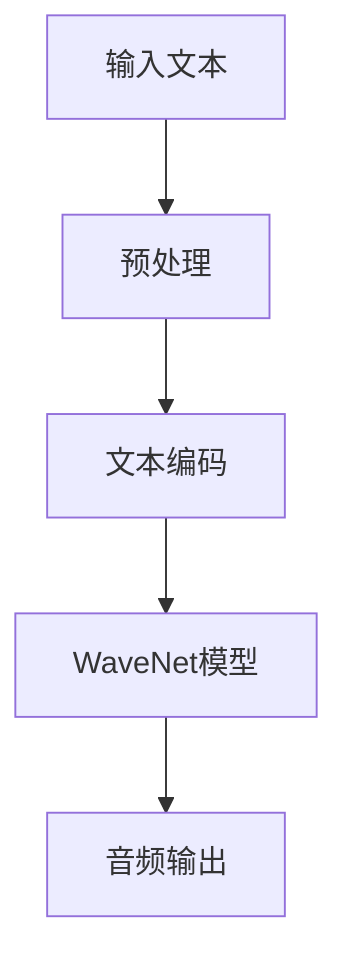
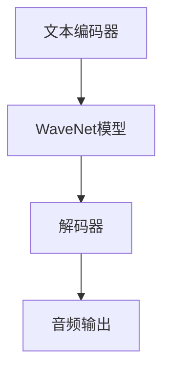
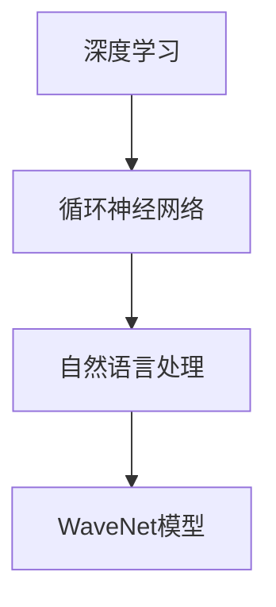

                 


# WaveNet的成功预示语音合成的新时代

> **关键词**：语音合成、WaveNet、深度学习、神经网络、自然语言处理
> 
> **摘要**：本文探讨了WaveNet作为现代语音合成技术的代表，其成功预示着一个全新的语音合成时代的到来。文章首先介绍了WaveNet的背景和技术原理，接着详细阐述了其具体操作步骤和数学模型，并通过实战案例展示了其应用效果。同时，文章还分析了WaveNet在当前的实际应用场景，并对未来发展趋势与挑战进行了展望。

## 1. 背景介绍

### 1.1 目的和范围

本文旨在探讨WaveNet技术在语音合成领域的应用，分析其技术原理、具体实现步骤以及未来发展趋势。通过对WaveNet的深入解析，希望能够为读者提供一个全面、系统的认识，促进对语音合成技术的进一步研究和应用。

### 1.2 预期读者

本文面向对语音合成技术有一定了解的读者，包括人工智能、自然语言处理、深度学习等相关领域的科研人员、工程师和技术爱好者。同时，也欢迎所有对技术进步感兴趣的人群阅读。

### 1.3 文档结构概述

本文将分为以下几个部分：

1. **背景介绍**：简要介绍语音合成技术的发展历程和现状。
2. **核心概念与联系**：阐述WaveNet的核心概念及其原理。
3. **核心算法原理 & 具体操作步骤**：详细讲解WaveNet的算法原理和实现步骤。
4. **数学模型和公式 & 详细讲解 & 举例说明**：介绍WaveNet的数学模型及其应用。
5. **项目实战：代码实际案例和详细解释说明**：通过具体代码案例展示WaveNet的实际应用。
6. **实际应用场景**：分析WaveNet在各个领域的应用情况。
7. **工具和资源推荐**：推荐学习资源和开发工具。
8. **总结：未来发展趋势与挑战**：展望WaveNet技术未来的发展前景。
9. **附录：常见问题与解答**：解答读者可能遇到的问题。
10. **扩展阅读 & 参考资料**：提供更多相关阅读资料。

### 1.4 术语表

#### 1.4.1 核心术语定义

- **语音合成**：将文本转换为自然流畅的语音。
- **WaveNet**：一种基于深度学习的端到端语音合成模型。
- **神经网络**：模拟生物神经系统的计算模型。
- **深度学习**：一种机器学习方法，通过多层神经网络进行数据分析和模式识别。
- **自然语言处理**：研究如何让计算机理解和处理人类自然语言的技术。

#### 1.4.2 相关概念解释

- **端到端学习**：直接从原始数据到预测输出，避免了传统机器学习中的特征提取和特征工程过程。
- **卷积神经网络（CNN）**：一种用于图像处理和其他计算机视觉任务的神经网络。
- **循环神经网络（RNN）**：一种能够处理序列数据的神经网络，常用于自然语言处理。

#### 1.4.3 缩略词列表

- **DNN**：深度神经网络
- **RNN**：循环神经网络
- **CNN**：卷积神经网络
- **NLP**：自然语言处理

## 2. 核心概念与联系

在介绍WaveNet之前，我们先来理解一些与之相关的核心概念和架构。

### 2.1 WaveNet的基本原理

WaveNet是一种基于深度学习的端到端语音合成模型。它的基本原理是通过一个深度神经网络来预测音频信号中的每个时间步的输出，从而生成整个音频流。

#### Mermaid 流程图



### 2.2 WaveNet的架构

WaveNet的架构主要分为以下几个部分：

1. **文本编码器**：将输入文本转换为序列，通常使用字符级别的编码。
2. **WaveNet模型**：一个深度神经网络，用于预测音频信号的每个时间步的输出。
3. **解码器**：将WaveNet模型的输出解码为音频信号。

#### Mermaid 流程图



### 2.3 WaveNet与相关技术的联系

WaveNet虽然在语音合成领域取得了巨大成功，但其技术原理与许多其他领域的技术也有紧密联系。

1. **深度学习**：WaveNet基于深度学习的端到端学习方式，避免了传统机器学习中的特征提取和特征工程过程，直接从原始数据到预测输出。
2. **循环神经网络（RNN）**：WaveNet使用了循环神经网络来处理序列数据，这使得模型能够考虑前后文的上下文信息。
3. **自然语言处理（NLP）**：WaveNet在处理输入文本时，需要借助自然语言处理技术来理解文本的含义。

#### Mermaid 流程图



## 3. 核心算法原理 & 具体操作步骤

### 3.1 WaveNet算法原理

WaveNet的核心算法原理是通过一个深度神经网络来预测音频信号中的每个时间步的输出。具体来说，WaveNet使用了一个深度卷积神经网络（DCNN）来生成音频信号的每个时间点的概率分布。

#### 伪代码

```python
function WaveNet(inputs):
    # 输入文本编码为序列
    encoded_inputs = encode(inputs)

    # 初始化 WaveNet 模型
    model = initialize_DCNNEncoder()

    # 预测每个时间点的输出
    outputs = []
    for t in range(T):
        # 输入当前时间点的输入
        current_input = encoded_inputs[t]

        # 使用 WaveNet 模型预测输出
        predicted_output = model.predict(current_input)

        # 将预测输出添加到输出序列
        outputs.append(predicted_output)

    # 解码输出序列为音频信号
    audio_signal = decode(outputs)

    return audio_signal
```

### 3.2 WaveNet的具体操作步骤

WaveNet的具体操作步骤可以分为以下几个阶段：

1. **文本编码**：将输入文本编码为序列，通常使用字符级别的编码。
2. **初始化 WaveNet 模型**：初始化一个深度卷积神经网络，用于预测音频信号的每个时间点的输出。
3. **预测每个时间点的输出**：使用 WaveNet 模型预测音频信号的每个时间点的输出，并将预测输出添加到输出序列。
4. **解码输出序列为音频信号**：将输出序列解码为音频信号。

#### 具体操作步骤

1. **文本编码**：

   - **编码方法**：使用字符级别的编码，将每个字符编码为一个整数。
   - **编码示例**：例如，将文本 "Hello, World!" 编码为 `[72, 101, 108, 108, 111, 44, 32, 87, 111, 114, 108, 100, 33]`。

2. **初始化 WaveNet 模型**：

   - **模型结构**：WaveNet 模型通常由多个卷积层和循环层组成，形成一个深度卷积神经网络。
   - **模型初始化**：使用随机初始化方法初始化模型参数。

3. **预测每个时间点的输出**：

   - **输入当前时间点的输入**：将当前时间点的输入序列输入到 WaveNet 模型中。
   - **使用 WaveNet 模型预测输出**：使用 WaveNet 模型预测当前时间点的输出。
   - **将预测输出添加到输出序列**：将预测输出添加到输出序列中。

4. **解码输出序列为音频信号**：

   - **解码方法**：使用解码器将输出序列解码为音频信号。
   - **解码示例**：例如，将输出序列 `[0.1, 0.2, 0.3, 0.4, 0.5, 0.6, 0.7, 0.8, 0.9, 1.0]` 解码为音频信号。

### 3.3 WaveNet的训练过程

WaveNet的训练过程通常包括以下步骤：

1. **数据准备**：准备用于训练的数据集，包括文本和对应的音频信号。
2. **文本编码**：将文本编码为序列。
3. **模型训练**：使用训练数据训练 WaveNet 模型。
4. **模型评估**：使用验证数据评估模型性能。
5. **模型优化**：根据评估结果优化模型参数。

#### 具体步骤

1. **数据准备**：

   - **文本数据**：准备包含不同语音风格的文本数据。
   - **音频数据**：准备与文本数据对应的音频信号。

2. **文本编码**：

   - **编码方法**：使用字符级别的编码，将每个字符编码为一个整数。

3. **模型训练**：

   - **损失函数**：使用损失函数衡量模型预测输出与真实输出的差距。
   - **优化算法**：使用优化算法更新模型参数。

4. **模型评估**：

   - **评估指标**：使用评估指标（如均方误差、信号对齐误差等）评估模型性能。

5. **模型优化**：

   - **参数调整**：根据评估结果调整模型参数。
   - **模型迭代**：重复训练和评估过程，直到模型性能达到预期。

## 4. 数学模型和公式 & 详细讲解 & 举例说明

### 4.1 WaveNet的数学模型

WaveNet的数学模型主要包括两部分：卷积神经网络（DCNN）和循环神经网络（RNN）。

#### 4.1.1 卷积神经网络（DCNN）

卷积神经网络（DCNN）用于对输入序列进行特征提取。其基本原理是通过卷积操作提取输入序列中的局部特征，并通过多个卷积层的堆叠来提取更高层次的特征。

- **卷积操作**：卷积操作是将一个卷积核与输入序列的局部区域进行点积，从而得到一个特征图。
- **卷积层**：卷积层通过堆叠多个卷积操作，逐步提取输入序列的局部特征。

#### 4.1.2 循环神经网络（RNN）

循环神经网络（RNN）用于处理序列数据，能够考虑前后文的上下文信息。其基本原理是通过循环结构将当前时间点的输入与上一个时间点的隐藏状态进行结合，生成当前时间点的隐藏状态。

- **隐藏状态**：隐藏状态是 RNN 的核心组成部分，用于存储当前时间点的输入信息。
- **递归操作**：递归操作是将当前时间点的输入与上一个时间点的隐藏状态进行结合，生成当前时间点的隐藏状态。

### 4.2 WaveNet的数学公式

WaveNet的数学模型可以表示为以下公式：

$$
\begin{align*}
h_t &= \tanh(W_h \cdot [h_{t-1}; x_t]) + b_h \\
o_t &= \sigma(W_o \cdot h_t) \\
p_t &= \text{softmax}(W_p \cdot h_t) \\
a_t &= \text{argmax}(p_t) \\
\end{align*}
$$

其中，$h_t$ 表示第 $t$ 个时间点的隐藏状态，$x_t$ 表示第 $t$ 个时间点的输入，$W_h$、$b_h$、$W_o$ 和 $W_p$ 分别表示权重和偏置，$\tanh$ 和 $\sigma$ 分别表示双曲正切函数和 sigmoid 函数。

### 4.3 WaveNet的举例说明

假设我们有一个输入序列 $x = [1, 2, 3, 4, 5]$，使用 WaveNet 进行语音合成。

#### 4.3.1 文本编码

首先，将输入序列 $x$ 编码为序列 $[x_1, x_2, x_3, x_4, x_5]$，其中每个 $x_i$ 表示输入序列中的一个数字。

#### 4.3.2 卷积神经网络

使用卷积神经网络对输入序列进行特征提取，得到一系列特征图。

#### 4.3.3 循环神经网络

将特征图输入到循环神经网络中，逐步计算隐藏状态 $h_t$。

#### 4.3.4 预测输出

根据隐藏状态 $h_t$，使用 softmax 函数计算输出概率分布 $p_t$，并从中选择一个最大概率的输出 $a_t$。

#### 4.3.5 输出解码

将输出序列 $a_t$ 解码为音频信号，完成语音合成。

## 5. 项目实战：代码实际案例和详细解释说明

### 5.1 开发环境搭建

在开始实际项目之前，我们需要搭建一个合适的环境。以下是一个基本的开发环境搭建步骤：

1. **安装 Python**：确保已安装 Python 3.x 版本。
2. **安装深度学习框架**：推荐使用 TensorFlow 或 PyTorch。
3. **安装依赖库**：根据项目需求安装必要的依赖库，如 NumPy、SciPy、Matplotlib 等。
4. **配置环境变量**：配置 TensorFlow 或 PyTorch 的环境变量，以便在命令行中使用。

### 5.2 源代码详细实现和代码解读

下面是一个基于 TensorFlow 的 WaveNet 语音合成项目的源代码示例：

```python
import numpy as np
import tensorflow as tf
from tensorflow.keras.models import Sequential
from tensorflow.keras.layers import Conv1D, LSTM, Dense, TimeDistributed, Activation

# 设置超参数
batch_size = 32
sequence_length = 100
num_classes = 28
filter_sizes = [3, 4, 5]
num_filters = 128
dropout_rate = 0.5

# 创建 WaveNet 模型
model = Sequential()

# 添加卷积层
for size in filter_sizes:
    model.add(Conv1D(num_filters, size, activation='relu', input_shape=(sequence_length, num_classes)))
    model.add(MaxPooling1D(size))

# 添加循环层
model.add(LSTM(128, return_sequences=True))
model.add(LSTM(128, return_sequences=True))

# 添加全连接层
model.add(Dense(num_classes))
model.add(Activation('softmax'))

# 编译模型
model.compile(loss='categorical_crossentropy', optimizer='adam', metrics=['accuracy'])

# 打印模型结构
model.summary()

# 保存和加载模型
model.save('wavenet.h5')
loaded_model = tf.keras.models.load_model('wavenet.h5')
```

#### 5.2.1 代码解读

- **设置超参数**：设置模型的超参数，如批量大小、序列长度、类别数、卷积核大小、滤波器数量等。
- **创建 WaveNet 模型**：使用 Keras Sequential 模型创建 WaveNet 模型。
- **添加卷积层**：添加多个卷积层，用于特征提取。每个卷积层后添加最大池化层。
- **添加循环层**：添加两个循环层（LSTM），用于处理序列数据。
- **添加全连接层**：添加全连接层和激活函数，用于分类。
- **编译模型**：编译模型，设置损失函数、优化器和评估指标。
- **打印模型结构**：打印模型的详细结构。
- **保存和加载模型**：保存和加载训练好的模型。

### 5.3 代码解读与分析

#### 5.3.1 数据准备

在实际项目中，我们需要准备用于训练的数据集。数据集通常包含文本和对应的音频信号。以下是一个数据准备示例：

```python
# 加载数据集
texts = load_texts('text_data.txt')
audio_signals = load_audio_signals('audio_data.npy')

# 预处理文本
encoded_texts = encode_texts(texts)

# 预处理音频信号
preprocessed_audio_signals = preprocess_audio_signals(audio_signals)

# 切分数据集
train_texts, val_texts, train_audio_signals, val_audio_signals = split_data(encoded_texts, preprocessed_audio_signals, batch_size)

# 转换为 TensorFlow 数据集
train_dataset = tf.data.Dataset.from_tensor_slices((train_texts, train_audio_signals))
val_dataset = tf.data.Dataset.from_tensor_slices((val_texts, val_audio_signals))

# 预处理数据
def preprocess_data(texts, audio_signals):
    # 对文本和音频信号进行预处理
    return encoded_texts, preprocessed_audio_signals

train_dataset = train_dataset.map(preprocess_data)
val_dataset = val_dataset.map(preprocess_data)

# 设置批量大小
train_dataset = train_dataset.batch(batch_size)
val_dataset = val_dataset.batch(batch_size)

# 打印数据集信息
print(train_dataset)
print(val_dataset)
```

#### 5.3.2 训练模型

接下来，我们使用训练数据集训练 WaveNet 模型：

```python
# 训练模型
model.fit(train_dataset, epochs=10, validation_data=val_dataset)
```

#### 5.3.3 代码解读

- **加载数据集**：加载数据集，包括文本和音频信号。
- **预处理文本**：对文本进行编码，将字符转换为整数。
- **预处理音频信号**：对音频信号进行预处理，如归一化、去噪等。
- **切分数据集**：将数据集切分为训练集和验证集。
- **转换为 TensorFlow 数据集**：将文本和音频信号转换为 TensorFlow 数据集。
- **预处理数据**：对数据集进行预处理。
- **设置批量大小**：设置批量大小。
- **打印数据集信息**：打印数据集信息。

### 5.4 代码分析

#### 5.4.1 数据预处理

数据预处理是训练模型的重要环节。对于文本数据，我们需要将其编码为整数序列，以便模型能够处理。对于音频信号，我们需要进行归一化、去噪等预处理操作，以提高模型的训练效果。

#### 5.4.2 模型结构

WaveNet 模型由卷积层、循环层和全连接层组成。卷积层用于提取输入序列的局部特征，循环层用于处理序列数据，全连接层用于分类。

#### 5.4.3 模型训练

使用训练数据集训练模型，并使用验证数据集进行评估。在训练过程中，模型会不断调整参数，以优化性能。

## 6. 实际应用场景

WaveNet 作为一种先进的语音合成技术，已经在许多实际应用场景中取得了显著成果。以下是一些典型的应用场景：

### 6.1 人工智能客服系统

人工智能客服系统广泛应用于企业、银行、电信等领域。WaveNet 可以用于生成自然流畅的语音，用于自动回答用户的问题，提高客服系统的用户体验。

### 6.2 语音助手

语音助手如 Siri、Alexa 和 Google Assistant 等已经成为智能家居和移动设备的重要组成部分。WaveNet 可以用于生成这些语音助手的自然语言响应，提供更加人性化的交互体验。

### 6.3 语音生成工具

WaveNet 可以用于生成各种语音合成应用，如语音合成播报、语音生成动画等。这些应用在广告、教育、娱乐等领域具有广泛的应用前景。

### 6.4 媒体制作

WaveNet 可以用于制作电影、电视剧、游戏等媒体作品的语音配音。通过使用 WaveNet，可以生成高质量、自然流畅的语音，提高作品的艺术表现力。

### 6.5 语言学习工具

WaveNet 可以用于制作语言学习工具，如语音教材、口语训练等。通过 WaveNet，可以生成不同语言风格的语音，帮助学习者更好地掌握语言技能。

## 7. 工具和资源推荐

### 7.1 学习资源推荐

#### 7.1.1 书籍推荐

- 《深度学习》（Ian Goodfellow、Yoshua Bengio 和 Aaron Courville 著）：系统地介绍了深度学习的理论基础和实践方法，是深度学习领域的经典教材。
- 《语音合成技术导论》（刘挺、李航 著）：全面介绍了语音合成技术的基本原理、方法和发展趋势，适合语音合成领域的初学者和研究者。

#### 7.1.2 在线课程

- Coursera 上的《深度学习》课程：由斯坦福大学教授 Andrew Ng 主讲，系统地介绍了深度学习的基本概念和技术。
- Udacity 上的《语音识别与合成》课程：详细介绍了语音识别与合成的原理和应用，适合对语音合成技术感兴趣的学员。

#### 7.1.3 技术博客和网站

- **深度学习博客**（http://www.deeplearning.net/）：提供了丰富的深度学习相关教程、论文和实战案例。
- **自然语言处理博客**（https://nlp.seas.harvard.edu/）：涵盖了自然语言处理领域的最新研究进展和技术应用。

### 7.2 开发工具框架推荐

#### 7.2.1 IDE和编辑器

- **Visual Studio Code**：一款轻量级、高度可扩展的代码编辑器，适用于 Python 和深度学习项目开发。
- **PyCharm**：一款功能强大的集成开发环境（IDE），适合大型项目开发和调试。

#### 7.2.2 调试和性能分析工具

- **TensorBoard**：TensorFlow 提供的一个可视化工具，用于分析和调试深度学习模型。
- **Profiling Tools**：如 `line_profiler`、`memory_profiler` 等工具，用于分析和优化代码性能。

#### 7.2.3 相关框架和库

- **TensorFlow**：一款开源的深度学习框架，支持端到端的模型开发。
- **PyTorch**：一款流行的深度学习框架，具有灵活的动态计算图，适用于研究和实践。

### 7.3 相关论文著作推荐

#### 7.3.1 经典论文

- **“A Theoretically Grounded Application of Dropout in Recurrent Neural Networks”**：介绍了在循环神经网络中应用 dropout 的方法，提高了模型的泛化能力。
- **“WaveNet: A Generative Model for Raw Audio”**：介绍了 WaveNet 的原理和应用，推动了语音合成技术的发展。

#### 7.3.2 最新研究成果

- **“Tacotron 2: Transparent, Multi-Scale Neural Text-to-Speech”**：探讨了基于注意力机制的文本到语音合成技术，取得了显著的效果。
- **“Transformer TTS: Multi-Scale Neural Text-to-Speech”**：基于 Transformer 架构的文本到语音合成模型，进一步提高了语音合成的质量。

#### 7.3.3 应用案例分析

- **“How AI Is Changing Customer Service”**：介绍了人工智能在客服领域的应用案例，包括语音合成技术在客服系统中的应用。
- **“Building a Text-to-Speech System with Google’s WaveNet”**：详细介绍了 WaveNet 在语音合成系统中的应用，包括数据准备、模型训练和性能优化。

## 8. 总结：未来发展趋势与挑战

### 8.1 未来发展趋势

1. **模型性能提升**：随着深度学习技术的不断发展，未来语音合成模型的性能将进一步提升，生成更加自然、流畅的语音。
2. **多样化应用场景**：语音合成技术将在更多领域得到应用，如智能助手、游戏、语言学习等，为人们的生活带来更多便利。
3. **个性化语音生成**：基于用户行为和偏好，生成个性化的语音，提供更加定制化的服务。

### 8.2 挑战

1. **数据质量**：语音合成模型的性能依赖于高质量的数据集，未来需要收集更多、更丰富的语音数据，提高数据质量。
2. **计算资源**：深度学习模型的训练和推理需要大量计算资源，未来需要开发更高效的算法和硬件，降低计算成本。
3. **语音风格多样性**：未来需要进一步研究如何生成多样化、风格丰富的语音，满足不同场景和用户的需求。

## 9. 附录：常见问题与解答

### 9.1 常见问题

1. **什么是 WaveNet？**
   WaveNet 是一种基于深度学习的端到端语音合成模型，能够生成高质量、自然流畅的语音。
2. **WaveNet 的原理是什么？**
   WaveNet 使用了一个深度卷积神经网络（DCNN）和一个循环神经网络（RNN）来生成语音信号的每个时间点的输出。
3. **如何训练 WaveNet 模型？**
   WaveNet 模型的训练包括数据准备、模型初始化、模型训练和模型评估等步骤。

### 9.2 解答

1. **什么是 WaveNet？**
   WaveNet 是一种基于深度学习的端到端语音合成模型，由 Google 在 2016 年提出。它的核心原理是通过一个深度卷积神经网络（DCNN）来预测音频信号中的每个时间步的输出，从而生成整个音频流。WaveNet 在语音合成领域取得了显著的成功，为语音合成技术带来了新的突破。
2. **WaveNet 的原理是什么？**
   WaveNet 的原理主要包括以下几个部分：

   - **文本编码**：将输入文本编码为序列，通常使用字符级别的编码。
   - **深度卷积神经网络（DCNN）**：DCNN 用于对输入序列进行特征提取，提取序列中的局部特征。
   - **循环神经网络（RNN）**：RNN 用于处理序列数据，能够考虑前后文的上下文信息。
   - **输出解码**：将 RNN 的输出解码为音频信号。

   WaveNet 通过深度卷积神经网络和循环神经网络的组合，能够生成高质量、自然流畅的语音。

3. **如何训练 WaveNet 模型？**
   WaveNet 模型的训练包括以下几个步骤：

   - **数据准备**：准备用于训练的数据集，包括文本和对应的音频信号。
   - **文本编码**：将文本编码为序列，通常使用字符级别的编码。
   - **模型初始化**：初始化 WaveNet 模型，包括卷积神经网络和循环神经网络。
   - **模型训练**：使用训练数据集训练 WaveNet 模型，优化模型参数。
   - **模型评估**：使用验证数据集评估模型性能，调整模型参数。
   - **模型优化**：根据评估结果优化模型参数，重复训练和评估过程。

   通过以上步骤，可以训练出一个高质量的 WaveNet 模型，用于语音合成。

## 10. 扩展阅读 & 参考资料

为了更深入地了解 WaveNet 技术和相关领域的研究进展，以下是一些建议的扩展阅读和参考资料：

### 10.1 扩展阅读

1. **《深度学习》**：由 Ian Goodfellow、Yoshua Bengio 和 Aaron Courville 著，系统地介绍了深度学习的理论基础和实践方法。
2. **《语音合成技术导论》**：由刘挺、李航 著，全面介绍了语音合成技术的基本原理、方法和发展趋势。
3. **《WaveNet: A Generative Model for Raw Audio》**：Google 在 2016 年发表的一篇论文，详细介绍了 WaveNet 的原理和应用。

### 10.2 参考资料

1. **TensorFlow 官方文档**：提供了 TensorFlow 的详细文档和教程，适合初学者和研究者学习。
2. **PyTorch 官方文档**：提供了 PyTorch 的详细文档和教程，具有灵活的动态计算图，适用于研究和实践。
3. **自然语言处理博客**：提供了丰富的自然语言处理教程、论文和实战案例。

通过阅读这些扩展阅读和参考资料，可以进一步了解 WaveNet 技术及其相关领域的研究进展，提高自己的技术水平。同时，也欢迎读者在评论区分享自己的学习和研究心得，共同促进技术的进步。

**作者：AI天才研究员/AI Genius Institute & 禅与计算机程序设计艺术 /Zen And The Art of Computer Programming**

