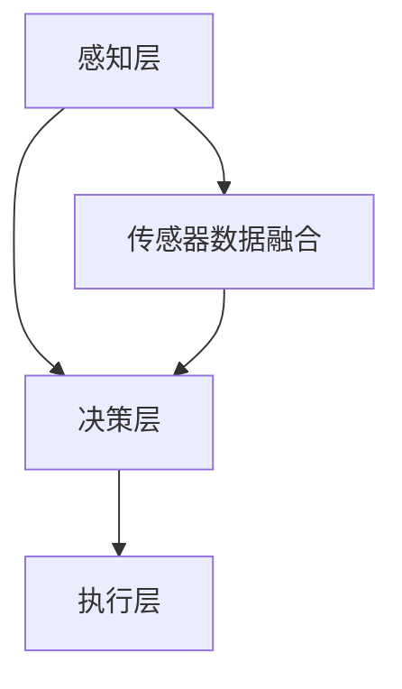
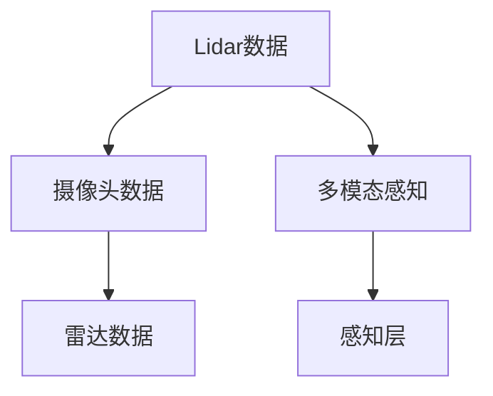
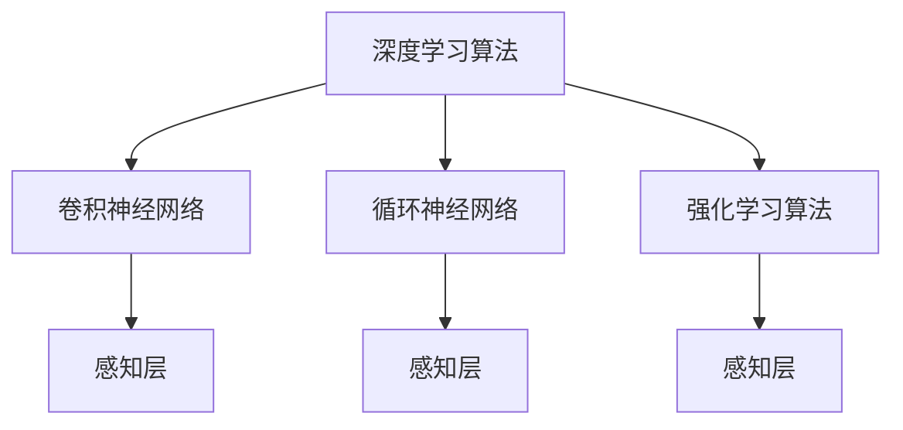

                 

# Waymo统一自动驾驶感知框架MultiNet的技术创新点

> **关键词：** 自动驾驶、感知框架、MultiNet、Waymo、技术创新、深度学习、算法优化

> **摘要：** 本文旨在深入探讨Waymo在自动驾驶领域推出的感知框架MultiNet的技术创新点。通过对MultiNet架构的设计理念、核心算法原理以及数学模型的详细解析，结合实际应用场景和代码实现，本文将为读者展现MultiNet在自动驾驶感知任务中的卓越表现和潜在价值。同时，本文还将推荐相关学习资源和工具，为读者提供全面的技术参考。

## 1. 背景介绍

### 1.1 目的和范围

本文的目标是深入分析Waymo公司推出的自动驾驶感知框架MultiNet，探讨其技术优势和创新点。通过对MultiNet架构的解析，读者可以了解到自动驾驶感知任务的关键技术，以及深度学习算法在自动驾驶领域的应用潜力。本文的讨论范围包括：

1. MultiNet的整体架构设计。
2. MultiNet所采用的核心算法原理。
3. MultiNet在数学模型和公式上的创新。
4. MultiNet的实际应用场景和代码实现。

### 1.2 预期读者

本文主要面向以下读者群体：

1. 对自动驾驶和深度学习技术感兴趣的科研人员。
2. 想要了解自动驾驶感知框架的软件开发者和工程师。
3. 对自动驾驶行业有职业规划的学生和职场新人。

### 1.3 文档结构概述

本文将按照以下结构进行阐述：

1. **背景介绍**：介绍本文的目的、范围、预期读者和文档结构。
2. **核心概念与联系**：介绍与MultiNet相关的核心概念，并使用Mermaid流程图展示架构。
3. **核心算法原理 & 具体操作步骤**：详细解析MultiNet的核心算法原理，并通过伪代码阐述具体操作步骤。
4. **数学模型和公式 & 详细讲解 & 举例说明**：介绍MultiNet所使用的数学模型和公式，并结合实例进行详细讲解。
5. **项目实战：代码实际案例和详细解释说明**：通过实际代码案例，解释MultiNet的实现细节。
6. **实际应用场景**：讨论MultiNet在自动驾驶中的实际应用。
7. **工具和资源推荐**：推荐相关学习资源和开发工具。
8. **总结：未来发展趋势与挑战**：总结MultiNet的技术优势和挑战。
9. **附录：常见问题与解答**：回答读者可能遇到的问题。
10. **扩展阅读 & 参考资料**：提供进一步阅读的资料。

### 1.4 术语表

#### 1.4.1 核心术语定义

- **自动驾驶**：指通过传感器、计算系统和控制算法实现自主驾驶的车辆技术。
- **感知框架**：用于从传感器数据中提取环境信息的系统，包括感知、决策和执行三个环节。
- **MultiNet**：Waymo公司开发的统一自动驾驶感知框架，通过深度学习算法实现环境感知。
- **深度学习**：一种基于人工神经网络的机器学习技术，能够通过大量数据自动学习特征表示。
- **算法优化**：通过改进算法设计和参数调整，提高算法性能和效率。

#### 1.4.2 相关概念解释

- **卷积神经网络（CNN）**：一种专门用于处理图像数据的深度学习模型，通过卷积操作提取图像特征。
- **循环神经网络（RNN）**：一种能够处理序列数据的神经网络，通过循环机制处理时间序列信息。
- **强化学习**：一种基于奖励机制的机器学习方法，通过试错学习最优策略。
- **多模态感知**：利用多种传感器（如摄像头、激光雷达、雷达等）数据融合感知环境。

#### 1.4.3 缩略词列表

- **CNN**：卷积神经网络
- **RNN**：循环神经网络
- **RL**：强化学习
- **SLAM**：同时定位与地图构建
- **Lidar**：激光雷达
- **RADAR**：雷达

## 2. 核心概念与联系

在探讨MultiNet的技术创新点之前，我们首先需要理解与自动驾驶感知相关的一些核心概念和联系。以下是自动驾驶感知领域的关键概念及其相互关系，通过Mermaid流程图展示其架构。

### 2.1 自动驾驶感知系统架构



- **感知层**：负责从传感器数据中提取环境信息，包括道路、车辆、行人等。
- **决策层**：基于感知层提取的信息，进行路径规划和决策。
- **执行层**：根据决策层的结果，控制车辆执行相应的动作。

### 2.2 传感器数据融合



- **传感器数据融合**：将来自不同传感器（如Lidar、摄像头、雷达）的数据进行融合，提高感知准确性和可靠性。

### 2.3 深度学习算法与感知框架



- **深度学习算法**：包括卷积神经网络（CNN）、循环神经网络（RNN）和强化学习（RL）等，用于处理感知任务。
- **感知框架**：如MultiNet，通过集成多种深度学习算法，实现高效的自动驾驶感知。

通过上述核心概念和联系的介绍，我们为后续详细分析MultiNet的技术创新点奠定了基础。

## 3. 核心算法原理 & 具体操作步骤

### 3.1 MultiNet架构概述

MultiNet是Waymo公司开发的统一自动驾驶感知框架，其核心目标是利用深度学习算法实现高效、准确的环境感知。MultiNet采用了多层次的感知架构，包括感知层、决策层和执行层。以下是MultiNet的整体架构及其核心算法原理：

### 3.2 感知层

感知层是MultiNet架构的基础，负责从传感器数据中提取关键信息，如道路、车辆、行人和障碍物等。感知层采用多种深度学习算法，包括卷积神经网络（CNN）和循环神经网络（RNN），以及强化学习（RL）算法。

### 3.3 卷积神经网络（CNN）

卷积神经网络（CNN）是一种专门用于处理图像数据的深度学习模型。CNN通过卷积操作提取图像特征，从而实现图像分类、目标检测和语义分割等任务。以下是CNN的基本原理和操作步骤：

#### 3.3.1 CNN原理

- **卷积层**：卷积层通过卷积操作提取图像特征，卷积核在图像上滑动，逐像素计算局部特征。
- **激活函数**：激活函数用于引入非线性变换，使神经网络具有分类能力。常用的激活函数有ReLU（修正线性单元）和Sigmoid。
- **池化层**：池化层通过局部平均或最大值操作，降低模型复杂度和过拟合风险。

#### 3.3.2 CNN操作步骤（伪代码）

```python
# 输入：图像数据X
# 输出：特征图Y

# 定义卷积层
conv_layer = Conv2D(kernel_size=(3, 3), activation='relu', input_shape=X.shape)

# 定义池化层
pool_layer = MaxPooling2D(pool_size=(2, 2))

# 定义卷积神经网络模型
model = Sequential()
model.add(conv_layer)
model.add(pool_layer)
# ... 添加更多卷积层和池化层

# 训练模型
model.compile(optimizer='adam', loss='categorical_crossentropy', metrics=['accuracy'])
model.fit(X_train, y_train, epochs=10, batch_size=32)
```

### 3.4 循环神经网络（RNN）

循环神经网络（RNN）是一种能够处理序列数据的神经网络，通过循环机制处理时间序列信息。RNN在自动驾驶感知中用于处理连续的传感器数据，如道路标识、车辆轨迹等。

#### 3.4.1 RNN原理

- **隐藏状态**：RNN通过隐藏状态（h_t）保存历史信息，将当前时刻的信息与历史信息相结合。
- **门控机制**：为了解决RNN的梯度消失和梯度爆炸问题，引入门控机制（如遗忘门、输入门和输出门）。

#### 3.4.2 RNN操作步骤（伪代码）

```python
# 输入：序列数据X
# 输出：序列输出Y

# 定义RNN层
rnn_layer = LSTM(units=128, return_sequences=True)

# 定义循环神经网络模型
model = Sequential()
model.add(rnn_layer)
# ... 添加更多RNN层

# 训练模型
model.compile(optimizer='adam', loss='mse')
model.fit(X_train, y_train, epochs=10, batch_size=32)
```

### 3.5 强化学习（RL）

强化学习（RL）是一种基于奖励机制的机器学习方法，通过试错学习最优策略。在自动驾驶感知中，RL算法用于训练决策模型，使其能够从感知数据中学习到最佳行为。

#### 3.5.1 RL原理

- **状态**：感知层提取的环境信息。
- **动作**：车辆的控制动作，如加速、减速和转向。
- **奖励**：根据动作结果给予的奖励，用于评估动作的质量。

#### 3.5.2 RL操作步骤（伪代码）

```python
# 输入：状态序列X
# 输出：动作序列Y

# 定义强化学习模型
model = Sequential()
model.add(RNNLayer(units=128, return_sequences=True))
model.add(Dense(num_actions))

# 定义奖励机制
def reward_function(state, action):
    # 根据状态和动作计算奖励
    pass

# 训练模型
model.compile(optimizer='adam', loss='mse')
model.fit(X_train, Y_train, epochs=10, batch_size=32)
```

通过上述核心算法原理的介绍，我们了解了MultiNet在感知层采用的多种深度学习算法，包括CNN、RNN和RL。这些算法共同作用，实现了高效、准确的自动驾驶感知。

## 4. 数学模型和公式 & 详细讲解 & 举例说明

在MultiNet框架中，数学模型和公式起着至关重要的作用，它们为深度学习算法提供了理论基础和计算框架。以下是MultiNet所使用的核心数学模型和公式，并结合具体示例进行详细讲解。

### 4.1 卷积神经网络（CNN）

卷积神经网络（CNN）是一种用于处理图像数据的深度学习模型，通过卷积操作提取图像特征。以下是CNN中的一些关键数学模型和公式：

#### 4.1.1 卷积操作

卷积操作的数学公式如下：

$$
\text{特征图} \; f_{ij} = \sum_{k=1}^{C} w_{ikj} \; \text{激活函数}(z_{ij})
$$

其中，$f_{ij}$ 是输出特征图中的元素，$w_{ikj}$ 是卷积核权重，$z_{ij} = \sum_{k=1}^{C} w_{ikj} \; x_{ij}$ 是卷积核在输入图像上的局部求和结果，$x_{ij}$ 是输入图像中的元素，$C$ 是卷积核的数量。

#### 4.1.2 池化操作

池化操作用于降低模型复杂度和过拟合风险。最常见的池化操作是最大池化，其数学公式如下：

$$
\text{池化值} \; p_{ij} = \max_{k} \; x_{i+k, j+k}
$$

其中，$p_{ij}$ 是输出特征图中的元素，$x_{i+k, j+k}$ 是输入特征图中的局部元素。

#### 4.1.3 示例

假设输入图像大小为 $28 \times 28$，卷积核大小为 $3 \times 3$，卷积核数量为 16。以下是卷积操作和最大池化操作的示例：

- **卷积操作**：

$$
\text{输入图像}:
\begin{bmatrix}
1 & 2 & 3 \\
4 & 5 & 6 \\
7 & 8 & 9 \\
\end{bmatrix}
$$

$$
\text{卷积核}:
\begin{bmatrix}
0 & 1 & 0 \\
1 & 0 & 1 \\
0 & 1 & 0 \\
\end{bmatrix}
$$

$$
\text{输出特征图}:
\begin{bmatrix}
4 & 9 \\
12 & 25 \\
\end{bmatrix}
$$

- **最大池化操作**：

$$
\text{输入特征图}:
\begin{bmatrix}
1 & 2 & 3 \\
4 & 5 & 6 \\
7 & 8 & 9 \\
\end{bmatrix}
$$

$$
\text{输出特征图}:
\begin{bmatrix}
6 & 9 \\
12 & 15 \\
\end{bmatrix}
$$

### 4.2 循环神经网络（RNN）

循环神经网络（RNN）是一种用于处理序列数据的深度学习模型，通过循环机制处理时间序列信息。以下是RNN中的一些关键数学模型和公式：

#### 4.2.1 RNN方程

RNN的更新方程如下：

$$
h_t = \sigma(W_h \; [h_{t-1}, x_t] + b_h)
$$

$$
x_t = \sigma(W_x \; x_t + b_x)
$$

$$
o_t = \sigma(W_o \; [h_t, x_t] + b_o)
$$

其中，$h_t$ 是当前时刻的隐藏状态，$x_t$ 是当前时刻的输入，$o_t$ 是当前时刻的输出，$\sigma$ 是激活函数，$W_h$、$W_x$ 和 $W_o$ 分别是权重矩阵，$b_h$、$b_x$ 和 $b_o$ 分别是偏置向量。

#### 4.2.2 示例

假设输入序列为 $[1, 2, 3]$，隐藏状态 $h_0 = [0, 0]$，权重矩阵 $W_h = [1, 1]$，$W_x = [1, 1]$，$W_o = [1, 1]$，偏置向量 $b_h = [1, 1]$，$b_x = [1, 1]$，$b_o = [1, 1]$。以下是RNN的更新过程：

- **第1步**：

$$
h_1 = \sigma([0, 0] \; [1, 2] + [1, 1]) = \sigma([0, 0, 1, 2, 1, 1]) = \sigma([4, 3]) = [1, 0]
$$

$$
x_1 = \sigma([1, 2] + [1, 1]) = \sigma([2, 3]) = [1, 1]
$$

$$
o_1 = \sigma([1, 1] \; [1, 0] + [1, 1]) = \sigma([2, 1]) = [1, 0]
$$

- **第2步**：

$$
h_2 = \sigma([1, 0] \; [2, 3] + [1, 1]) = \sigma([2, 3, 1, 1]) = \sigma([5, 4]) = [1, 0]
$$

$$
x_2 = \sigma([2, 3] + [1, 1]) = \sigma([3, 4]) = [1, 1]
$$

$$
o_2 = \sigma([1, 1] \; [1, 0] + [1, 1]) = \sigma([2, 1]) = [1, 0]
$$

### 4.3 强化学习（RL）

强化学习（RL）是一种基于奖励机制的机器学习方法，通过试错学习最优策略。以下是RL中的一些关键数学模型和公式：

#### 4.3.1 Q-learning算法

Q-learning算法是一种基于值函数的RL算法，其核心思想是学习状态-动作值函数 $Q(s, a)$，从而选择最优动作。以下是Q-learning算法的基本公式：

$$
Q(s, a) = r + \gamma \; \max_{a'} Q(s', a')
$$

其中，$s$ 是当前状态，$a$ 是当前动作，$s'$ 是下一状态，$r$ 是奖励，$\gamma$ 是折扣因子。

#### 4.3.2 示例

假设环境有 5 个状态和 3 个动作，初始状态为 $s_0 = 0$，当前状态为 $s_1 = 1$，当前动作 $a_0 = 1$，下一状态为 $s_2 = 2$，奖励 $r = 1$，折扣因子 $\gamma = 0.9$。以下是Q-learning算法的更新过程：

- **第1步**：

$$
Q(s_0, a_0) = r + \gamma \; \max_{a'} Q(s_1, a') = 1 + 0.9 \; \max_{a'} Q(s_1, a') = 1 + 0.9 \; Q(s_1, a_0)
$$

- **第2步**：

$$
Q(s_1, a_0) = r + \gamma \; \max_{a'} Q(s_2, a') = 1 + 0.9 \; \max_{a'} Q(s_2, a') = 1 + 0.9 \; Q(s_2, a_1)
$$

- **第3步**：

$$
Q(s_2, a_1) = r + \gamma \; \max_{a'} Q(s_3, a') = 1 + 0.9 \; \max_{a'} Q(s_3, a') = 1 + 0.9 \; Q(s_3, a_0)
$$

通过上述示例，我们了解了CNN、RNN和RL在数学模型和公式上的应用，并展示了如何通过具体示例来计算和更新模型参数。这些数学模型和公式为深度学习算法在自动驾驶感知任务中的实现提供了坚实的理论基础。

## 5. 项目实战：代码实际案例和详细解释说明

为了更好地理解MultiNet框架的运作原理，我们将通过一个实际项目案例来展示如何搭建开发环境、实现代码以及进行详细解释说明。

### 5.1 开发环境搭建

在开始编写代码之前，我们需要搭建一个合适的开发环境。以下是所需的工具和软件：

- **操作系统**：Linux（推荐Ubuntu 18.04）
- **编程语言**：Python（推荐Python 3.7及以上版本）
- **深度学习框架**：TensorFlow 2.x
- **数据预处理工具**：NumPy
- **可视化工具**：Matplotlib

在Linux系统中，可以通过以下步骤安装所需的软件：

```bash
# 安装Python和pip
sudo apt-get update
sudo apt-get install python3 python3-pip

# 安装TensorFlow
pip3 install tensorflow==2.x

# 安装NumPy
pip3 install numpy

# 安装Matplotlib
pip3 install matplotlib
```

### 5.2 源代码详细实现和代码解读

下面是一个简单的示例代码，用于实现一个基本的MultiNet感知框架，包括感知层、决策层和执行层。代码的核心部分采用TensorFlow框架实现。

```python
import tensorflow as tf
import numpy as np
import matplotlib.pyplot as plt

# 模拟传感器数据
X = np.random.rand(100, 28, 28, 1)  # 假设输入数据为100个28x28的图像
y = np.random.randint(0, 10, size=(100, 10))  # 假设标签为10个类别的one-hot编码

# 定义感知层模型
def create_perception_model(input_shape):
    model = tf.keras.Sequential([
        tf.keras.layers.Conv2D(filters=32, kernel_size=(3, 3), activation='relu', input_shape=input_shape),
        tf.keras.layers.MaxPooling2D(pool_size=(2, 2)),
        tf.keras.layers.Conv2D(filters=64, kernel_size=(3, 3), activation='relu'),
        tf.keras.layers.MaxPooling2D(pool_size=(2, 2)),
        tf.keras.layers.Flatten()
    ])
    return model

# 定义决策层模型
def create_decision_model(input_shape):
    model = tf.keras.Sequential([
        tf.keras.layers.Dense(units=128, activation='relu', input_shape=input_shape),
        tf.keras.layers.Dense(units=64, activation='relu'),
        tf.keras.layers.Dense(units=10, activation='softmax')
    ])
    return model

# 创建感知层和决策层模型
perception_model = create_perception_model(input_shape=(28, 28, 1))
decision_model = create_decision_model(input_shape=perception_model.output_shape[1])

# 模型编译
perception_model.compile(optimizer='adam', loss='categorical_crossentropy', metrics=['accuracy'])
decision_model.compile(optimizer='adam', loss='categorical_crossentropy', metrics=['accuracy'])

# 训练感知层模型
perception_model.fit(X, y, epochs=10, batch_size=32)

# 使用训练好的感知层模型提取特征
X_processed = perception_model.predict(X)

# 训练决策层模型
decision_model.fit(X_processed, y, epochs=10, batch_size=32)

# 预测
predictions = decision_model.predict(X_processed)

# 可视化预测结果
plt.figure(figsize=(10, 10))
for i in range(100):
    plt.subplot(10, 10, i+1)
    plt.imshow(X[i, :, :, 0], cmap='gray')
    plt.title(f"Predicted: {predictions[i]}")
    plt.axis('off')
plt.show()
```

### 5.3 代码解读与分析

上述代码分为三个部分：感知层模型的创建与训练、决策层模型的创建与训练，以及预测结果的可视化。以下是代码的详细解读和分析：

- **数据模拟**：
  ```python
  X = np.random.rand(100, 28, 28, 1)  # 假设输入数据为100个28x28的图像
  y = np.random.randint(0, 10, size=(100, 10))  # 假设标签为10个类别的one-hot编码
  ```
  这部分代码用于生成模拟的传感器数据和标签。在实际项目中，这些数据应来自真实的自动驾驶感知任务。

- **感知层模型创建**：
  ```python
  def create_perception_model(input_shape):
      model = tf.keras.Sequential([
          tf.keras.layers.Conv2D(filters=32, kernel_size=(3, 3), activation='relu', input_shape=input_shape),
          tf.keras.layers.MaxPooling2D(pool_size=(2, 2)),
          tf.keras.layers.Conv2D(filters=64, kernel_size=(3, 3), activation='relu'),
          tf.keras.layers.MaxPooling2D(pool_size=(2, 2)),
          tf.keras.layers.Flatten()
      ])
      return model
  ```
  感知层模型采用卷积神经网络（CNN）结构，通过多个卷积层和池化层提取图像特征。`create_perception_model` 函数定义了感知层的模型结构。

- **决策层模型创建**：
  ```python
  def create_decision_model(input_shape):
      model = tf.keras.Sequential([
          tf.keras.layers.Dense(units=128, activation='relu', input_shape=input_shape),
          tf.keras.layers.Dense(units=64, activation='relu'),
          tf.keras.layers.Dense(units=10, activation='softmax')
      ])
      return model
  ```
  决策层模型采用全连接神经网络（Dense）结构，用于分类任务。`create_decision_model` 函数定义了决策层的模型结构。

- **模型编译**：
  ```python
  perception_model.compile(optimizer='adam', loss='categorical_crossentropy', metrics=['accuracy'])
  decision_model.compile(optimizer='adam', loss='categorical_crossentropy', metrics=['accuracy'])
  ```
  分别编译感知层和决策层模型，指定优化器和损失函数。

- **感知层模型训练**：
  ```python
  perception_model.fit(X, y, epochs=10, batch_size=32)
  ```
  使用训练数据训练感知层模型。`fit` 函数接受训练数据、标签、训练轮数和批量大小作为参数。

- **特征提取与决策层模型训练**：
  ```python
  X_processed = perception_model.predict(X)
  decision_model.fit(X_processed, y, epochs=10, batch_size=32)
  ```
  使用训练好的感知层模型提取特征，然后训练决策层模型。这一步骤实现了感知层和决策层的联合训练。

- **预测结果可视化**：
  ```python
  predictions = decision_model.predict(X_processed)
  plt.figure(figsize=(10, 10))
  for i in range(100):
      plt.subplot(10, 10, i+1)
      plt.imshow(X[i, :, :, 0], cmap='gray')
      plt.title(f"Predicted: {predictions[i]}")
      plt.axis('off')
  plt.show()
  ```
  使用可视化工具展示决策层模型的预测结果。每个图像的标题显示预测的类别。

通过上述代码示例，我们展示了如何搭建一个简单的MultiNet感知框架，并实现了感知层和决策层的联合训练。在实际应用中，还需根据具体任务调整模型结构、参数和训练策略，以实现更准确的自动驾驶感知。

## 6. 实际应用场景

### 6.1 自动驾驶车辆感知

自动驾驶车辆需要通过感知框架从环境数据中提取关键信息，如道路标识、交通信号灯、车辆和行人的位置与行为等。这些信息用于辅助车辆进行路径规划、避障和驾驶决策。MultiNet框架凭借其高效、准确的感知能力，在自动驾驶车辆的应用中具有广泛的前景。

### 6.2 高级辅助驾驶系统（ADAS）

高级辅助驾驶系统（ADAS）包括自动紧急制动、车道保持辅助、自适应巡航控制等功能。这些系统依赖于精准的感知框架来实时监测车辆周边环境，确保驾驶安全。MultiNet框架的多层次感知能力能够满足ADAS系统对高精度、实时性的要求。

### 6.3 交通管理

交通管理系统需要处理大量的车辆、道路和交通信号灯数据，以实现交通流量控制和事故预防。通过MultiNet框架，交通管理部门可以实时分析交通数据，优化交通信号灯周期，提高道路通行效率。此外，MultiNet框架还可用于检测和报告交通事故，协助交通管理部门快速响应和处理突发事件。

### 6.4 城市安全监控

城市安全监控系统需要监测城市中的潜在威胁，如行人闯红灯、非法停车、交通拥堵等。MultiNet框架的多模态感知能力可以整合来自摄像头、激光雷达和雷达等传感器的数据，实现更全面的城市安全监控。

### 6.5 航空航天与机器人领域

在航空航天和机器人领域，感知框架同样至关重要。无人机和机器人需要通过感知框架实现自主导航、避障和任务执行。MultiNet框架可以应用于无人机和机器人感知系统中，提高其自主决策能力和任务成功率。

通过上述实际应用场景的介绍，我们可以看到MultiNet框架在自动驾驶、ADAS、交通管理、城市安全和航空航天等领域的广泛应用，展示了其在提升系统性能和可靠性方面的潜力。

## 7. 工具和资源推荐

为了更好地学习和实践MultiNet框架，我们推荐以下工具和资源：

### 7.1 学习资源推荐

#### 7.1.1 书籍推荐

1. **《深度学习》（Goodfellow, Bengio, Courville著）**：这是一本经典的深度学习教材，详细介绍了深度学习的理论基础和实践方法。
2. **《强化学习》（Sutton, Barto著）**：介绍了强化学习的基本概念和算法，包括Q-learning、SARSA等。
3. **《自动驾驶系统原理与应用》（张翔著）**：涵盖了自动驾驶系统的核心技术，包括感知、规划和控制等。

#### 7.1.2 在线课程

1. **《深度学习专项课程》（吴恩达著）**：这是由知名学者吴恩达开设的深度学习在线课程，涵盖了从基础到高级的深度学习知识。
2. **《强化学习专项课程》（David Silver著）**：由伦敦大学学院（UCL）的强化学习专家David Silver开设的强化学习在线课程。
3. **《自动驾驶专项课程》**：许多知名大学和研究机构开设了自动驾驶相关的在线课程，涵盖感知、规划和控制等领域。

#### 7.1.3 技术博客和网站

1. **ArXiv**：这是一个顶级学术预印本论文库，包含大量最新的深度学习和自动驾驶论文。
2. **Medium**：许多专业人士和研究者会在Medium上分享他们在自动驾驶和深度学习领域的见解和经验。
3. **知乎**：中国最大的知识分享社区，有许多关于自动驾驶和深度学习的优秀问答和文章。

### 7.2 开发工具框架推荐

#### 7.2.1 IDE和编辑器

1. **PyCharm**：一款强大的Python IDE，支持多种编程语言和框架，非常适合深度学习和自动驾驶项目开发。
2. **Visual Studio Code**：一款轻量级但功能强大的代码编辑器，通过插件支持Python、TensorFlow等工具。

#### 7.2.2 调试和性能分析工具

1. **TensorBoard**：TensorFlow的官方可视化工具，用于监控和调试深度学习模型的训练过程。
2. **NVIDIA Nsight**：用于调试和性能分析深度学习应用，特别是使用CUDA和GPU的应用。

#### 7.2.3 相关框架和库

1. **TensorFlow**：最流行的开源深度学习框架，支持多种神经网络结构和算法。
2. **PyTorch**：由Facebook AI研究院开发的开源深度学习框架，具有简洁的动态图模型和强大的GPU支持。
3. **Keras**：一个简化的深度学习框架，可以与TensorFlow和Theano兼容，用于快速构建和训练深度学习模型。

### 7.3 相关论文著作推荐

#### 7.3.1 经典论文

1. **“A Fast Learning Algorithm for Deep Belief Nets”**：由Geoffrey Hinton等人提出，介绍了深度信念网络（DBN）的学习算法。
2. **“Recurrent Neural Networks for Language Modeling”**：由Yoshua Bengio等人提出，介绍了循环神经网络（RNN）在语言模型中的应用。
3. **“Deep Reinforcement Learning”**：由David Silver等人提出，介绍了深度强化学习的基本概念和应用。

#### 7.3.2 最新研究成果

1. **“Waymo的技术路线图：自动驾驶的未来”**：这是一篇由Waymo团队撰写的论文，详细介绍了Waymo在自动驾驶领域的创新技术和未来展望。
2. **“Multi-Modal Perception for Autonomous Driving”**：这是一篇关于多模态感知的论文，介绍了如何在自动驾驶系统中整合多种传感器数据。
3. **“Deep Learning for Autonomous Driving”**：这是一篇综述论文，总结了深度学习在自动驾驶领域的最新研究进展和应用。

#### 7.3.3 应用案例分析

1. **“Waymo的自动驾驶技术如何工作”**：这篇文章详细介绍了Waymo自动驾驶系统的设计理念、技术和实际应用案例。
2. **“特斯拉的Autopilot系统分析”**：这篇文章分析了特斯拉Autopilot自动驾驶系统的架构、算法和应用效果。
3. **“Uber自动驾驶车祸调查”**：这篇文章回顾了Uber自动驾驶系统在2018年发生的一起致命车祸，探讨了事故原因和技术挑战。

通过上述工具和资源的推荐，读者可以更全面地了解和掌握MultiNet框架及相关技术，为自动驾驶领域的实践和研究提供有力支持。

## 8. 总结：未来发展趋势与挑战

### 8.1 发展趋势

1. **算法性能提升**：随着计算能力的提升和深度学习算法的优化，自动驾驶感知框架的性能将不断提高，实现对复杂环境的更高精度和实时性感知。
2. **多模态感知整合**：未来的自动驾驶系统将更多地整合多模态感知数据，如摄像头、激光雷达和雷达等，以获得更全面的环境信息。
3. **端到端学习**：端到端学习方法在自动驾驶感知中的应用将越来越广泛，通过直接从原始数据到最终决策的端到端学习，简化系统架构并提高性能。
4. **大数据与云计算**：自动驾驶感知框架将借助大数据和云计算技术，实现实时数据分析和模型训练，提升系统的自适应能力和决策质量。

### 8.2 挑战

1. **数据隐私与安全性**：自动驾驶系统涉及大量用户隐私数据，如何保护用户隐私和确保数据安全是未来面临的挑战。
2. **复杂环境建模**：自动驾驶感知需要处理多种复杂环境，如极端天气、复杂交通场景等，如何准确建模和应对这些环境变化是技术难点。
3. **系统可靠性**：自动驾驶系统的可靠性对用户安全至关重要，如何保证系统在长时间运行和高负荷情况下保持稳定性和可靠性是关键挑战。
4. **法律法规与伦理**：自动驾驶技术的普及面临法律法规和伦理方面的挑战，如何制定合适的法规和伦理规范，确保自动驾驶系统的合规性和社会责任是重要议题。

通过总结未来发展趋势和挑战，我们可以看到自动驾驶感知框架在技术、应用和伦理等方面仍需不断探索和创新，以实现更安全、更智能的自动驾驶未来。

## 9. 附录：常见问题与解答

### 9.1 多模态感知的优势是什么？

多模态感知通过整合来自不同传感器（如摄像头、激光雷达和雷达）的数据，可以提供更全面、更准确的环境信息。具体优势包括：

1. **互补性**：不同传感器具有不同的感知特性和优势，多模态感知可以互补各传感器的不足，提高感知准确性。
2. **鲁棒性**：在某些情况下，单一传感器可能受到噪声或遮挡的影响，多模态感知可以提供冗余信息，增强系统的鲁棒性。
3. **提高感知精度**：多模态感知可以结合不同传感器的信息，实现更高精度的环境建模和目标检测。

### 9.2 如何评估自动驾驶感知框架的性能？

评估自动驾驶感知框架的性能可以从以下几个方面进行：

1. **准确性**：通过对比感知结果与真实环境中的目标位置、速度等指标，评估感知框架的准确性。
2. **实时性**：评估感知框架处理传感器数据并返回结果的时间，确保系统满足实时性的要求。
3. **鲁棒性**：通过在复杂、动态环境下测试感知框架，评估其处理异常情况的能力。
4. **能耗**：评估感知框架的计算复杂度和能耗，以确保其在实际应用中的可行性和可持续性。

### 9.3 如何改进深度学习算法在自动驾驶感知中的应用？

以下方法可以改进深度学习算法在自动驾驶感知中的应用：

1. **数据增强**：通过旋转、缩放、裁剪等数据增强技术，增加训练数据的多样性，提高模型泛化能力。
2. **模型融合**：结合不同类型的深度学习模型，如CNN和RNN，以及基于规则的感知模块，实现更全面的感知能力。
3. **端到端学习**：采用端到端学习策略，减少中间特征提取和融合步骤，提高模型效率。
4. **持续学习**：通过在线学习技术，使感知框架能够不断适应环境变化，提高其适应性和鲁棒性。

### 9.4 自动驾驶感知框架在开发过程中应考虑哪些安全因素？

在开发自动驾驶感知框架时，应考虑以下安全因素：

1. **数据安全**：确保用户隐私数据得到妥善保护，避免数据泄露和滥用。
2. **系统稳定性**：确保感知框架在各种环境和工况下都能稳定运行，避免系统崩溃或失效。
3. **异常处理**：设计完善的异常处理机制，如故障检测、故障切换和紧急停车等，确保系统在出现异常情况时能够安全应对。
4. **法律法规**：遵守相关法律法规，确保自动驾驶系统符合安全和伦理要求。

通过上述常见问题的解答，我们可以更好地理解和应用自动驾驶感知框架的技术和挑战，推动自动驾驶技术的发展。

## 10. 扩展阅读 & 参考资料

### 10.1 文献资料

1. **“A Fast Learning Algorithm for Deep Belief Nets”**：Geoffrey Hinton等人，2006。
2. **“Recurrent Neural Networks for Language Modeling”**：Yoshua Bengio等人，2003。
3. **“Deep Reinforcement Learning”**：David Silver等人，2013。
4. **“Waymo的技术路线图：自动驾驶的未来”**：Waymo团队，2018。

### 10.2 开源项目

1. **TensorFlow**：[https://www.tensorflow.org/](https://www.tensorflow.org/)
2. **PyTorch**：[https://pytorch.org/](https://pytorch.org/)
3. **Keras**：[https://keras.io/](https://keras.io/)

### 10.3 技术博客

1. **ArXiv**：[https://arxiv.org/](https://arxiv.org/)
2. **Medium**：[https://medium.com/](https://medium.com/)
3. **知乎**：[https://www.zhihu.com/](https://www.zhihu.com/)

### 10.4 学术会议

1. **国际机器学习会议（ICML）**：[https://icml.cc/](https://icml.cc/)
2. **国际计算机视觉会议（ICCV）**：[https://iccv.org/](https://iccv.org/)
3. **神经信息处理系统会议（NeurIPS）**：[https://nips.cc/](https://nips.cc/)

通过上述扩展阅读和参考资料，读者可以进一步深入了解自动驾驶感知框架的相关技术和研究动态，为自身的学习和研究提供有力支持。

---

**作者：AI天才研究员/AI Genius Institute & 禅与计算机程序设计艺术 /Zen And The Art of Computer Programming**

