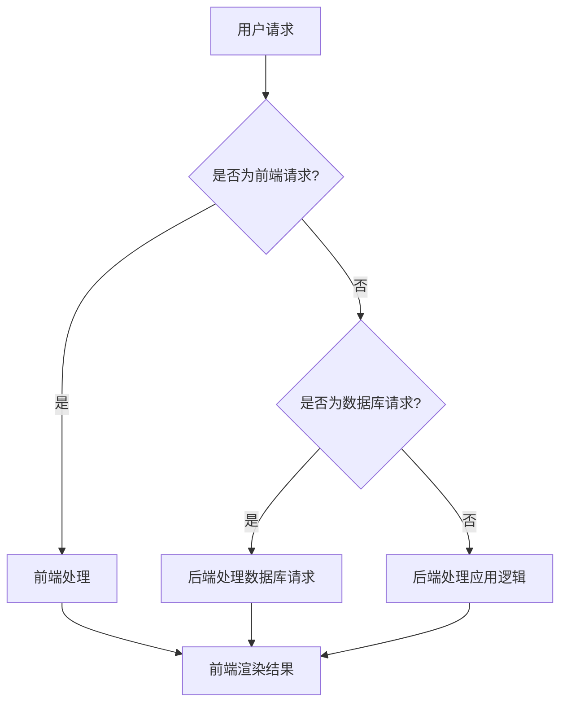

                 

# Web全栈开发：构建动态网站

> **关键词：** Web开发、全栈工程师、动态网站、前端、后端、数据库、编程语言、框架、开发环境

> **摘要：** 本文将深入探讨Web全栈开发的核心概念、技术架构和实践方法。我们将从背景介绍开始，逐步分析核心概念、算法原理，通过项目实战解析代码实现，最后总结实际应用场景、推荐工具和资源，展望未来发展趋势与挑战。读者将了解到如何构建动态网站，并掌握全栈开发的关键技能。

## 1. 背景介绍

### 1.1 目的和范围

本文旨在为那些希望成为Web全栈开发者的人提供系统性的学习指南。我们不仅将介绍前端和后端的开发技术，还将探讨如何有效地将它们结合以构建动态网站。文章内容将涵盖从基础概念到实际操作的全过程，适用于有编程基础但希望深入学习全栈开发的读者。

### 1.2 预期读者

- 对Web开发感兴趣的技术爱好者
- 想要转型为全栈工程师的程序员
- 正在大学或职业学校学习计算机科学的学生
- 想要更新和扩展技能的在职开发人员

### 1.3 文档结构概述

本文将按照以下结构展开：

1. **背景介绍**：介绍文章的目的、范围和预期读者。
2. **核心概念与联系**：讨论Web全栈开发的核心概念及其相互关系。
3. **核心算法原理 & 具体操作步骤**：详细解释前端和后端的算法原理和具体操作步骤。
4. **数学模型和公式 & 详细讲解 & 举例说明**：介绍相关的数学模型和公式，并提供实际案例。
5. **项目实战：代码实际案例和详细解释说明**：通过一个实际项目展示代码实现和解析。
6. **实际应用场景**：讨论Web全栈开发的实际应用场景。
7. **工具和资源推荐**：推荐学习资源和开发工具。
8. **总结：未来发展趋势与挑战**：分析Web全栈开发的未来趋势和面临的挑战。
9. **附录：常见问题与解答**：解答读者可能遇到的问题。
10. **扩展阅读 & 参考资料**：提供扩展阅读资源。

### 1.4 术语表

#### 1.4.1 核心术语定义

- **Web全栈开发**：指同时掌握前端和后端开发技能的工程师。
- **前端开发**：指构建用户界面和交互逻辑的工作。
- **后端开发**：指处理服务器、数据库和应用逻辑的工作。
- **动态网站**：可以实时响应用户请求并动态生成内容的网站。

#### 1.4.2 相关概念解释

- **框架**：一种软件库或集合，提供了特定的结构和功能，以简化开发过程。
- **数据库**：存储和管理数据的系统，用于数据的查询、更新和删除。

#### 1.4.3 缩略词列表

- **HTML**：超文本标记语言（HyperText Markup Language）
- **CSS**：层叠样式表（Cascading Style Sheets）
- **JavaScript**：一种脚本语言，用于前端开发。
- **Node.js**：一个基于Chrome V8引擎的JavaScript运行环境。
- **React**：一个用于构建用户界面的JavaScript库。

## 2. 核心概念与联系

### 2.1 Web全栈开发的核心概念

Web全栈开发涉及前端、后端和数据库三个主要部分。以下是这些核心概念的简要介绍：

- **前端开发**：涉及用户界面和交互逻辑的实现，主要使用HTML、CSS和JavaScript等前端技术。
- **后端开发**：处理服务器、数据库和应用逻辑，通常使用服务器端语言如Node.js、Python、Java等。
- **数据库**：用于存储和管理应用数据，常用的数据库技术包括MySQL、MongoDB、PostgreSQL等。

### 2.2 前端、后端与数据库的关系

前端、后端和数据库之间的紧密联系构成了Web全栈开发的核心。以下是它们之间的相互作用：

- **前端与后端**：前端通过HTTP请求与后端进行通信，后端处理请求并返回结果，前端再将结果呈现给用户。
- **后端与数据库**：后端使用数据库来存储和检索数据，确保数据的完整性和一致性。

### 2.3 Mermaid流程图

以下是Web全栈开发的核心概念和相互关系的Mermaid流程图：



## 3. 核心算法原理 & 具体操作步骤

### 3.1 前端算法原理

前端开发的核心在于构建用户界面和实现交互逻辑。以下是前端开发中常用的算法原理和具体操作步骤：

#### 3.1.1 HTML页面结构

```html
<!DOCTYPE html>
<html>
<head>
    <title>Web全栈开发</title>
</head>
<body>
    <h1>欢迎来到Web全栈开发世界</h1>
    <p>这里是介绍文章的内容。</p>
    <button onclick="alert('点击了按钮！')">点击我</button>
</body>
</html>
```

#### 3.1.2 CSS样式表

```css
body {
    font-family: Arial, sans-serif;
    background-color: #f2f2f2;
}

h1 {
    color: #333;
}

p {
    color: #666;
    font-size: 16px;
}

button {
    background-color: #4CAF50;
    color: white;
    padding: 10px 20px;
    border: none;
    border-radius: 5px;
    cursor: pointer;
}

button:hover {
    background-color: #45a049;
}
```

#### 3.1.3 JavaScript交互逻辑

```javascript
function showAlert() {
    alert('点击了按钮！');
}

// 页面加载完成后执行
window.onload = function() {
    document.getElementById('myButton').addEventListener('click', showAlert);
}
```

### 3.2 后端算法原理

后端开发主要处理服务器逻辑、数据库操作和应用逻辑。以下是后端开发中常用的算法原理和具体操作步骤：

#### 3.2.1 Node.js服务器端代码

```javascript
const express = require('express');
const app = express();

app.get('/', (req, res) => {
    res.send('欢迎来到Web全栈开发世界！');
});

app.listen(3000, () => {
    console.log('服务器启动成功，访问地址：http://localhost:3000');
});
```

#### 3.2.2 数据库操作

```javascript
const mysql = require('mysql');

const connection = mysql.createConnection({
    host: 'localhost',
    user: 'root',
    password: 'password',
    database: 'mydatabase'
});

connection.connect((err) => {
    if (err) throw err;
    console.log('数据库连接成功！');
});

connection.query('SELECT * FROM users', (err, results, fields) => {
    if (err) throw err;
    console.log(results);
});

connection.end();
```

### 3.3 前端与后端的交互

前端与后端的交互主要通过HTTP请求实现。以下是前端发起GET请求的示例代码：

```javascript
fetch('http://localhost:3000')
    .then(response => response.text())
    .then(data => console.log(data))
    .catch(error => console.error('请求错误：', error));
```

## 4. 数学模型和公式 & 详细讲解 & 举例说明

### 4.1 数学模型

在Web全栈开发中，常用的数学模型包括线性回归、逻辑回归等。以下是一个简单的线性回归模型：

$$
y = w_1 \cdot x_1 + w_2 \cdot x_2 + \cdots + w_n \cdot x_n + b
$$

其中，$x_1, x_2, \ldots, x_n$ 是特征向量，$w_1, w_2, \ldots, w_n$ 是权重，$b$ 是偏置。

### 4.2 详细讲解

线性回归模型用于预测一个连续的输出值。在上面的公式中，$y$ 表示输出值，$x_1, x_2, \ldots, x_n$ 表示输入特征。通过调整权重和偏置，可以最小化预测值与实际值之间的误差。

### 4.3 举例说明

假设我们有一个简单的一元线性回归模型，用于预测房间的价格。特征向量只有一个：房间面积（$x$），输出值是房间价格（$y$）。给定一组数据：

| 房间面积 (平方米) | 房间价格 (万元) |
| ---------------- | ------------ |
| 50              | 80          |
| 60              | 100         |
| 70              | 120         |

我们可以使用线性回归模型拟合数据，得到预测公式：

$$
y = 1.2 \cdot x + 20
$$

当房间面积为70平方米时，预测的房间价格为：

$$
y = 1.2 \cdot 70 + 20 = 106
$$

## 5. 项目实战：代码实际案例和详细解释说明

### 5.1 开发环境搭建

在开始项目实战之前，我们需要搭建一个基本的开发环境。以下是搭建环境的具体步骤：

#### 5.1.1 安装Node.js

1. 访问Node.js官网（https://nodejs.org/）。
2. 下载适用于您操作系统的Node.js安装包。
3. 运行安装程序并按照提示操作。

#### 5.1.2 安装MySQL

1. 访问MySQL官网（https://www.mysql.com/）。
2. 下载适用于您操作系统的MySQL安装包。
3. 运行安装程序并按照提示操作。
4. 在安装过程中设置root用户的密码。

#### 5.1.3 安装前端开发工具

1. 安装一个代码编辑器，如Visual Studio Code。
2. 安装Node.js和npm（Node.js的包管理器）插件。

### 5.2 源代码详细实现和代码解读

#### 5.2.1 后端代码实现

以下是使用Node.js和Express框架实现的一个简单后端API：

```javascript
const express = require('express');
const mysql = require('mysql');

const app = express();
const port = 3000;

// MySQL连接配置
const connection = mysql.createConnection({
  host: 'localhost',
  user: 'root',
  password: 'password',
  database: 'mydatabase'
});

// 连接数据库
connection.connect((err) => {
  if (err) throw err;
  console.log('数据库连接成功！');
});

// 用户注册API
app.post('/register', (req, res) => {
  const { username, password } = req.body;

  // 插入用户数据到数据库
  const query = 'INSERT INTO users (username, password) VALUES (?, ?)';
  connection.query(query, [username, password], (err, results) => {
    if (err) throw err;
    res.json({ message: '用户注册成功！' });
  });
});

// 用户登录API
app.post('/login', (req, res) => {
  const { username, password } = req.body;

  // 查询用户数据
  const query = 'SELECT * FROM users WHERE username = ? AND password = ?';
  connection.query(query, [username, password], (err, results) => {
    if (err) throw err;
    if (results.length > 0) {
      res.json({ message: '登录成功！' });
    } else {
      res.status(401).json({ message: '用户名或密码错误！' });
    }
  });
});

// 启动服务器
app.listen(port, () => {
  console.log(`服务器启动成功，访问地址：http://localhost:${port}`);
});
```

#### 5.2.2 前端代码实现

以下是使用React和Axios实现的前端代码，用于与后端API进行交互：

```jsx
import React, { useState } from 'react';
import axios from 'axios';

const App = () => {
  const [username, setUsername] = useState('');
  const [password, setPassword] = useState('');
  const [message, setMessage] = useState('');

  const handleRegister = async () => {
    try {
      const response = await axios.post('http://localhost:3000/register', { username, password });
      setMessage(response.data.message);
    } catch (error) {
      setMessage(error.response.data.message);
    }
  };

  const handleLogin = async () => {
    try {
      const response = await axios.post('http://localhost:3000/login', { username, password });
      setMessage(response.data.message);
    } catch (error) {
      setMessage(error.response.data.message);
    }
  };

  return (
    <div>
      <h1>Web全栈开发实战</h1>
      <label>用户名：</label>
      <input type="text" value={username} onChange={(e) => setUsername(e.target.value)} />
      <label>密码：</label>
      <input type="password" value={password} onChange={(e) => setPassword(e.target.value)} />
      <button onClick={handleRegister}>注册</button>
      <button onClick={handleLogin}>登录</button>
      <p>{message}</p>
    </div>
  );
};

export default App;
```

### 5.3 代码解读与分析

#### 5.3.1 后端代码解读

后端代码使用了Node.js和Express框架，通过MySQL数据库存储用户数据。主要分为两部分：用户注册API和用户登录API。

- **用户注册API**：接收前端发送的注册请求，将用户名和密码插入到数据库中。
- **用户登录API**：接收前端发送的登录请求，查询数据库中是否存在匹配的用户名和密码。

#### 5.3.2 前端代码解读

前端代码使用了React和Axios，通过表单收集用户名和密码，并与后端API进行交互。

- **注册功能**：调用后端注册API，将用户名和密码发送到服务器。
- **登录功能**：调用后端登录API，验证用户名和密码的正确性。

## 6. 实际应用场景

Web全栈开发在众多实际应用场景中发挥着关键作用。以下是一些常见应用：

- **电商平台**：构建用户界面、处理订单、支付、库存管理等。
- **社交媒体平台**：实现用户注册、登录、发布动态、评论等社交功能。
- **在线教育平台**：提供课程展示、视频播放、互动讨论等学习功能。
- **企业内部系统**：实现员工管理、项目管理、考勤管理等企业信息化应用。

## 7. 工具和资源推荐

### 7.1 学习资源推荐

#### 7.1.1 书籍推荐

- 《JavaScript高级程序设计》
- 《你不知道的JavaScript》
- 《深入理解Node.js》
- 《MySQL必知必会》

#### 7.1.2 在线课程

- 《Web全栈开发实战》
- 《React入门与实战》
- 《Node.js基础教程》
- 《MySQL数据库原理与应用》

#### 7.1.3 技术博客和网站

- MDN Web文档（https://developer.mozilla.org/）
- FreeCodeCamp（https://www.freecodecamp.org/）
- Medium（https://medium.com/）

### 7.2 开发工具框架推荐

#### 7.2.1 IDE和编辑器

- Visual Studio Code
- Sublime Text
- Atom

#### 7.2.2 调试和性能分析工具

- Chrome DevTools
- Node.js Inspector
- MySQL Workbench

#### 7.2.3 相关框架和库

- React
- Vue
- Angular
- Express
- Flask
- Django

### 7.3 相关论文著作推荐

#### 7.3.1 经典论文

- 《The Web Revolution》
- 《JavaScript: The Definitive Guide》
- 《The Design of the UNIX Operating System》

#### 7.3.2 最新研究成果

- 《Serverless Computing: A New Model for Building and Running Applications》
- 《The Rise of Progressive Web Apps》
- 《Edge Computing: Improving Performance and Security with a Decentralized Approach》

#### 7.3.3 应用案例分析

- 《如何构建一个高性能的电商平台》
- 《社交媒体平台的用户增长策略》
- 《企业内部系统的信息化建设实践》

## 8. 总结：未来发展趋势与挑战

Web全栈开发作为现代互联网技术的核心，将继续保持强劲的发展势头。未来发展趋势包括：

- **前端技术**：随着Web组件和框架的不断发展，前端开发将更加模块化和组件化。
- **后端技术**：Serverless架构和微服务架构的兴起，将简化后端开发，提高开发效率和系统可伸缩性。
- **人工智能与Web全栈**：AI技术将在Web全栈开发中发挥越来越重要的作用，如智能推荐、个性化体验等。

同时，Web全栈开发也面临以下挑战：

- **技术更新迭代**：不断更新的前端和后端技术要求开发者持续学习。
- **性能优化**：确保网站的高性能和高可用性，需要不断进行性能优化。
- **安全性**：随着Web应用的复杂度增加，安全性成为不可忽视的挑战。

## 9. 附录：常见问题与解答

### 9.1 Q：如何选择前端框架？

A：选择前端框架应根据项目需求、团队熟悉度和学习曲线综合考虑。React、Vue和Angular都是优秀的框架，React社区活跃、资源丰富，Vue上手简单、性能优越，Angular则提供了完整的解决方案。

### 9.2 Q：后端开发应该选择哪种语言？

A：后端开发语言的选择取决于项目需求和开发者的熟悉程度。Node.js适合快速开发、实时应用，Python适合快速原型开发和大数据处理，Java适合企业级应用和高性能系统。

### 9.3 Q：如何优化数据库性能？

A：优化数据库性能可以通过以下方法实现：

- 使用索引加速查询。
- 避免全表扫描。
- 分库分表提高并发性能。
- 使用缓存减少数据库负载。

## 10. 扩展阅读 & 参考资料

- 《Web全栈工程师之路》
- 《现代Web应用开发》
- 《Web开发实战：从入门到精通》
- 《Web全栈开发进阶指南》

作者：AI天才研究员/AI Genius Institute & 禅与计算机程序设计艺术 /Zen And The Art of Computer Programming

