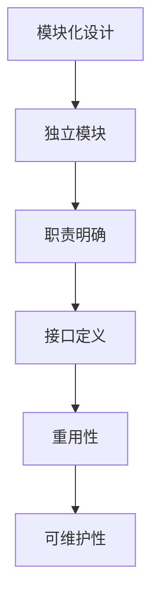
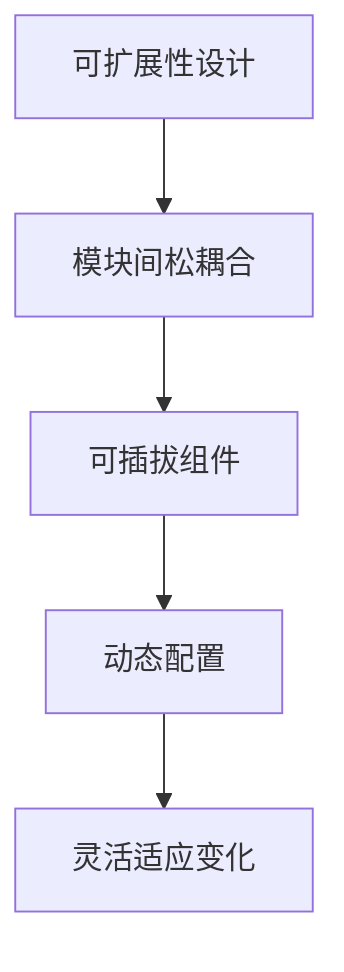
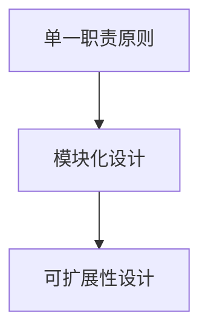
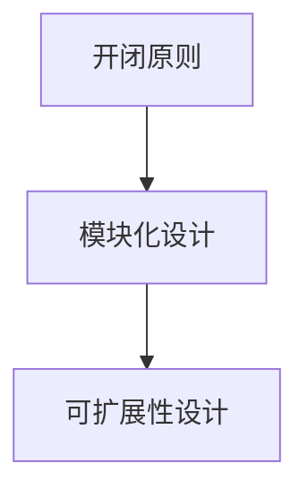
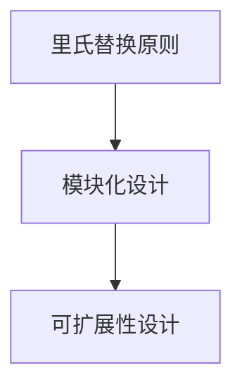

                 

# Web 设计模式：创建可扩展和模块化网站

> **关键词：** Web设计模式，模块化，可扩展性，设计原则，最佳实践

> **摘要：** 本文将深入探讨Web设计模式的核心原则，介绍如何通过模块化和可扩展性设计来创建高效的网站。我们将一步步分析关键概念，提供详细的算法和数学模型讲解，并通过实际代码案例展示如何将这些设计模式应用于实际项目中。文章旨在为Web开发者提供有价值的指导，帮助他们构建灵活、可维护和具有未来适应性的网站。

## 1. 背景介绍

### 1.1 目的和范围

本文的目的是帮助Web开发者理解并掌握Web设计模式，特别是如何通过模块化和可扩展性设计来构建高质量的网站。我们将覆盖以下内容：

- **设计原则**：介绍设计模式背后的核心原则，如单一职责原则、开闭原则、里氏替换原则等。
- **模块化设计**：探讨如何将网站功能分解为独立的模块，并说明模块间如何交互。
- **可扩展性设计**：讲解如何设计网站结构，使其能够轻松适应未来的功能扩展。
- **算法和数学模型**：提供伪代码和数学公式，帮助读者理解设计模式的工作原理。
- **实战案例**：通过实际代码案例，展示如何应用设计模式来构建可扩展和模块化的网站。

### 1.2 预期读者

本文适合以下读者：

- 有一定Web开发经验的程序员和开发者。
- 对Web设计模式感兴趣，希望提高网站开发质量的开发者。
- 对模块化和可扩展性设计有深入了解，希望进一步提升技能的专业人士。

### 1.3 文档结构概述

本文将按照以下结构进行组织：

- **第1部分：背景介绍**：介绍文章的目的、预期读者和文档结构。
- **第2部分：核心概念与联系**：讨论Web设计模式的核心概念，并提供Mermaid流程图。
- **第3部分：核心算法原理 & 具体操作步骤**：详细讲解算法原理，使用伪代码进行阐述。
- **第4部分：数学模型和公式 & 详细讲解 & 举例说明**：介绍数学模型，使用latex格式给出公式。
- **第5部分：项目实战：代码实际案例和详细解释说明**：展示代码实现，并进行解读。
- **第6部分：实际应用场景**：讨论设计模式在不同场景下的应用。
- **第7部分：工具和资源推荐**：推荐学习资源和开发工具。
- **第8部分：总结：未来发展趋势与挑战**：总结文章内容，展望未来趋势。
- **第9部分：附录：常见问题与解答**：提供常见问题的解答。
- **第10部分：扩展阅读 & 参考资料**：推荐相关阅读材料和参考文献。

### 1.4 术语表

#### 1.4.1 核心术语定义

- **模块化设计**：将系统的功能划分为独立的、可重用的模块，以实现高度的模块化和解耦。
- **可扩展性设计**：在设计时考虑系统的扩展性，使其能够轻松适应未来的变化和需求。
- **设计模式**：在软件开发中普遍采用的一系列解决方案，用于解决特定类型的软件设计问题。
- **单一职责原则**：一个模块只负责一项功能，以提高可维护性和可重用性。
- **开闭原则**：软件实体（类、模块、函数等）应该对扩展开放，对修改关闭。
- **里氏替换原则**：任何可替换掉一个基类的实体都能无错误地替换基类。

#### 1.4.2 相关概念解释

- **面向对象编程（OOP）**：一种编程范式，强调将数据及其相关的操作封装在一起，形成对象。
- **依赖注入**：一种设计模式，用于实现模块间的解耦，通过外部提供依赖，而非硬编码。
- **函数式编程**：一种编程范式，通过使用不可变数据和纯函数来组织代码。
- **组件化**：将应用程序分解为可重用和独立的组件，每个组件负责特定的功能。

#### 1.4.3 缩略词列表

- **OOP**：面向对象编程（Object-Oriented Programming）
- **SOA**：服务导向架构（Service-Oriented Architecture）
- **REST**：表述性状态转移（Representational State Transfer）
- **MVC**：模型-视图-控制器（Model-View-Controller）
- **MVVM**：模型-视图-视图模型（Model-View-ViewModel）
- **前端框架**：用于构建用户界面的框架，如React、Angular、Vue等。

## 2. 核心概念与联系

在设计可扩展和模块化的Web网站时，理解核心概念和它们之间的关系至关重要。以下是几个关键概念及其相互关系：

### 2.1 模块化设计

模块化设计是将系统分解为独立的、可重用的模块，每个模块具有明确的职责和接口。这有助于降低系统的复杂性，提高开发效率和可维护性。



### 2.2 可扩展性设计

可扩展性设计是指在系统设计时考虑其未来可能的需求变化，使其能够灵活地适应新的功能和需求。这通常涉及到模块间的松耦合、可插拔的组件以及动态配置的能力。



### 2.3 设计模式

设计模式是一系列在软件开发中广泛应用的解决方案，用于解决常见的设计问题。以下是一些常用的设计模式及其与模块化和可扩展性设计的关系：

#### 单一职责原则（Single Responsibility Principle, SRP）

单一职责原则指出，一个模块应该只负责一项功能，以提高可维护性和可重用性。这与模块化设计和可扩展性设计密切相关。



#### 开闭原则（Open/Closed Principle, OCP）

开闭原则强调软件实体应该对扩展开放，对修改关闭。这意味着系统应该能够通过添加新的模块或组件来适应变化，而不是频繁修改现有代码。



#### 里氏替换原则（Liskov Substitution Principle, LSP）

里氏替换原则指出，任何可替换掉一个基类的实体都能无错误地替换基类。这确保了模块间的交互不会因为子类的引入而受到影响，从而提高了系统的稳定性和可扩展性。



通过以上核心概念的探讨，我们可以更好地理解如何将模块化和可扩展性设计应用于Web网站的开发，以构建灵活、可维护和具有未来适应性的系统。

## 3. 核心算法原理 & 具体操作步骤

在Web设计中，核心算法原理的理解和实现对于确保系统的模块化和可扩展性至关重要。以下我们将使用伪代码详细阐述一个常用的设计模式——工厂模式（Factory Pattern），以及如何将其应用于Web网站开发中。

### 3.1 工厂模式的基本概念

工厂模式是一种创建型设计模式，用于封装对象创建过程，从而提高系统的可扩展性和灵活性。其主要思想是定义一个工厂类，负责创建特定类型的对象，而客户端只需与工厂类交互，无需关心具体的创建细节。

### 3.2 伪代码实现

下面是一个简单的工厂模式的伪代码示例，用于创建不同类型的商品对象。

```plaintext
// 定义商品接口
interface Product {
    display();
}

// 定义具体商品实现
class ConcreteProductA implements Product {
    display() {
        // 显示商品A的详细信息
    }
}

class ConcreteProductB implements Product {
    display() {
        // 显示商品B的详细信息
    }
}

// 定义工厂类
class ProductFactory {
    createProduct(type) {
        if (type == 'A') {
            return new ConcreteProductA();
        } else if (type == 'B') {
            return new ConcreteProductB();
        } else {
            throw new Error("未知商品类型");
        }
    }
}

// 客户端使用工厂类创建商品对象
function clientCode() {
    var factory = new ProductFactory();
    var productA = factory.createProduct('A');
    productA.display();

    var productB = factory.createProduct('B');
    productB.display();
}
```

### 3.3 步骤详解

1. **定义产品接口**：首先，我们需要定义一个产品接口，它规定了所有产品必须实现的方法。在我们的示例中，接口`Product`定义了一个`display()`方法，所有具体的产品都需要实现此方法。

2. **创建具体产品类**：接着，我们创建具体的商品类`ConcreteProductA`和`ConcreteProductB`，它们分别实现了产品接口。每个具体产品都实现了自己的`display()`方法，以显示其详细信息。

3. **定义工厂类**：然后，我们创建一个工厂类`ProductFactory`，它包含一个`createProduct()`方法。这个方法根据输入的类型参数创建并返回相应的产品实例。工厂类封装了具体的创建逻辑，使客户端无需了解创建细节。

4. **客户端代码**：最后，客户端通过工厂类来创建产品对象。客户端只需调用工厂类的`createProduct()`方法，并传入所需的类型参数，即可获取相应的产品对象。这种方式使得客户端代码与具体产品类解耦，提高了系统的灵活性和可扩展性。

### 3.4 模块化和可扩展性

工厂模式通过封装对象的创建过程，使得系统的模块化和可扩展性得到了显著提升：

- **模块化**：每个产品类和工厂类都是一个独立的模块，它们可以分别开发和维护，减少了模块间的耦合。
- **可扩展性**：通过扩展工厂类和产品类，我们可以轻松地添加新的商品类型，而无需修改客户端代码。这符合开闭原则，即对扩展开放，对修改关闭。

通过上述算法原理和具体操作步骤的讲解，我们可以看到工厂模式在实现模块化和可扩展性方面的重要作用。接下来，我们将进一步探讨如何将数学模型应用于Web设计，以增强系统的鲁棒性和性能。

## 4. 数学模型和公式 & 详细讲解 & 举例说明

在Web设计模式中，数学模型和公式扮演着关键角色，它们帮助我们理解和优化系统的性能和可扩展性。以下，我们将详细讲解一个常用的数学模型——二分查找算法（Binary Search Algorithm），并使用latex格式给出相关公式。

### 4.1 二分查找算法原理

二分查找算法是一种高效的搜索算法，适用于有序数组。其基本思想是通过不断将搜索范围缩小一半，逐步逼近目标元素。以下是二分查找算法的基本步骤：

1. 确定中间索引`mid`，公式为：`mid = low + (high - low) / 2`。
2. 比较中间元素与目标元素：
   - 如果中间元素等于目标元素，算法结束。
   - 如果中间元素大于目标元素，则在左侧子数组中继续搜索，更新`high = mid - 1`。
   - 如果中间元素小于目标元素，则在右侧子数组中继续搜索，更新`low = mid + 1`。
3. 重复步骤1和2，直到找到目标元素或搜索范围缩小到空。

### 4.2 latex格式数学公式

下面是二分查找算法中使用的latex格式数学公式：

$$
mid = low + \frac{(high - low)}{2}
$$

### 4.3 举例说明

假设我们有一个有序数组`arr`，目标元素为`target`，以下是使用二分查找算法搜索目标元素的过程：

```plaintext
arr = [1, 3, 5, 7, 9, 11, 13, 15]
target = 7

low = 0
high = 7
mid = low + (high - low) / 2 = 3

arr[mid] = 7
目标元素找到，算法结束。

low = 0
high = 2
mid = low + (high - low) / 2 = 1

arr[mid] = 3
更新high = mid - 1 = 0

low = 1
high = 0
搜索范围缩小到空，目标元素未找到。
```

通过以上举例，我们可以看到二分查找算法在逐步逼近目标元素的过程中，如何有效地缩小搜索范围。

### 4.4 性能分析

二分查找算法的时间复杂度为O(log n)，这意味着在数组大小增加时，搜索时间增加的速度远慢于线性搜索算法的O(n)。这是二分查找算法高效的一个重要原因。

### 4.5 实际应用

二分查找算法广泛应用于各种Web应用中，如搜索系统、数据库索引等。通过将数据有序存储并使用二分查找，可以大幅提高数据检索速度，增强系统的性能和用户体验。

通过以上对数学模型和公式的详细讲解及举例说明，我们可以更好地理解二分查找算法在Web设计中的应用。接下来，我们将通过实际代码案例展示如何将设计模式应用于Web网站开发。

## 5. 项目实战：代码实际案例和详细解释说明

在这一部分，我们将通过一个实际的项目案例，详细展示如何使用模块化和可扩展性设计模式构建一个简单的博客系统。该项目将采用前后端分离的架构，使用React框架进行前端开发，Node.js进行后端服务。

### 5.1 开发环境搭建

首先，我们需要搭建开发环境。以下是搭建过程：

1. 安装Node.js：从官方网站下载并安装Node.js。安装完成后，确保通过命令`node -v`和`npm -v`验证安装成功。
2. 安装React：使用npm命令安装React和React-DOM。
    ```bash
    npm install react react-dom
    ```
3. 创建项目：使用create-react-app脚手架创建一个新的React项目。
    ```bash
    npx create-react-app blog-app
    ```
4. 进入项目目录并启动开发服务器。
    ```bash
    cd blog-app
    npm start
    ```

### 5.2 源代码详细实现和代码解读

#### 前端（React）

在前端部分，我们使用React创建一个简单的博客列表页面。以下是关键代码：

**src/App.js**：
```javascript
import React, { useState, useEffect } from 'react';
import BlogPost from './BlogPost';

function App() {
  const [blogPosts, setBlogPosts] = useState([]);

  useEffect(() => {
    // 伪代码：从后端获取博客列表
    fetch('/api/blogposts')
      .then(response => response.json())
      .then(data => setBlogPosts(data));
  }, []);

  return (
    <div className="App">
      <h1>博客列表</h1>
      {blogPosts.map(post => (
        <BlogPost key={post.id} post={post} />
      ))}
    </div>
  );
}

function BlogPost({ post }) {
  return (
    <div className="blog-post">
      <h2>{post.title}</h2>
      <p>{post.content}</p>
    </div>
  );
}

export default App;
```

**src/BlogPost.js**：
```javascript
import React from 'react';

function BlogPost({ post }) {
  return (
    <div className="blog-post">
      <h2>{post.title}</h2>
      <p>{post.content}</p>
    </div>
  );
}

export default BlogPost;
```

**CSS文件**：
```css
.App {
  font-family: 'Arial', sans-serif;
}

.blog-post {
  margin-bottom: 20px;
  padding: 15px;
  border: 1px solid #ddd;
}
```

#### 后端（Node.js）

在后端部分，我们使用Express框架创建REST API来处理博客数据的获取。以下是关键代码：

**server.js**：
```javascript
const express = require('express');
const app = express();
const PORT = process.env.PORT || 3001;

// 伪代码：模拟数据库存储
const blogPosts = [
  { id: 1, title: '第一篇博客', content: '这里是第一篇博客的内容。' },
  { id: 2, title: '第二篇博客', content: '这里是第二篇博客的内容。' },
  // ...
];

app.use(express.json());

app.get('/api/blogposts', (req, res) => {
  res.json(blogPosts);
});

app.post('/api/blogposts', (req, res) => {
  const newPost = req.body;
  blogPosts.push(newPost);
  res.status(201).send('博客已添加');
});

app.listen(PORT, () => {
  console.log(`服务器正在运行，端口：${PORT}`);
});
```

### 5.3 代码解读与分析

#### 前端代码解读

- **App.js**：这是React应用的主组件，其中使用了`useState`和`useEffect` Hook来管理状态和副作用。`useState`用于初始化和更新博客列表状态，`useEffect`用于在组件加载时从后端获取博客数据，并将其设置为状态。`map`函数用于将博客列表渲染为列表项。

- **BlogPost.js**：这是一个简单的组件，用于渲染单个博客条目。它接受一个`post`对象作为属性，并使用这些属性来渲染标题和内容。

- **CSS**：这是应用的样式文件，用于美化博客列表和博客条目。

#### 后端代码解读

- **server.js**：这是后端服务的入口文件。我们使用Express框架创建了一个HTTP服务器，并定义了两个API端点：获取博客列表和添加新博客。对于获取博客列表的GET请求，我们返回模拟的博客数据数组。对于添加新博客的POST请求，我们将新博客数据添加到数组中，并返回成功消息。

### 5.4 模块化和可扩展性分析

- **模块化**：前端和后端代码被分离到不同的文件中，每个文件负责一个特定的功能，这有助于模块化和代码的重用。

- **可扩展性**：由于使用React和Express框架，我们可以轻松地添加新的功能。例如，我们可以扩展API来处理用户身份验证、评论功能等。此外，通过引入中间件和路由，可以进一步模块化API端点。

通过这个实际项目案例，我们展示了如何使用模块化和可扩展性设计模式来构建一个简单的博客系统。这种方法不仅提高了代码的可维护性，还增强了系统的扩展能力，为未来的功能添加奠定了坚实的基础。

## 6. 实际应用场景

设计模式在Web开发中的应用场景非常广泛，以下列举几种常见场景，以及如何使用模块化和可扩展性设计模式来解决问题。

### 6.1 动态网站

**场景描述**：动态网站需要频繁更新内容和功能，以适应用户需求和市场变化。

**解决方案**：采用模块化和可扩展性设计，将网站分为前端模块（如React组件）和后端模块（如Express路由）。前端模块负责用户界面和交互，后端模块负责数据处理和存储。通过RESTful API或GraphQL接口，前端模块与后端模块进行数据交换。这样，当需要添加新功能时，可以单独开发、测试和部署相关模块，而不会影响整个系统。

### 6.2 E-commerce网站

**场景描述**：电子商务网站需要处理大量的商品、订单和用户信息，且需要实时更新库存和价格。

**解决方案**：使用微服务架构来分解复杂的业务逻辑。例如，可以将订单处理、库存管理和用户认证等业务功能分别部署为独立的服务。每个服务都可以独立开发、测试和扩展，同时使用API进行通信。通过这种设计，系统可以更好地应对高并发和动态变化的需求，提高系统的可靠性和性能。

### 6.3 社交网络平台

**场景描述**：社交网络平台需要处理大量的用户动态、消息和互动。

**解决方案**：使用消息队列和流处理技术来处理大量的用户数据。例如，可以使用Kafka或RabbitMQ等消息队列系统，将用户操作数据发送到队列中，然后由后端服务进行处理。这样可以确保系统在高峰时段能够高效处理大量的请求，同时降低系统的耦合度。此外，通过使用事件驱动架构，系统可以更好地实现模块化和可扩展性。

### 6.4 实时数据监控

**场景描述**：实时数据监控平台需要收集和处理大量的实时数据，并提供即时的可视化。

**解决方案**：采用微服务架构和流处理技术，将数据采集、处理和可视化功能分解为独立的服务。使用消息队列和流处理框架（如Apache Flink或Apache Storm）来处理实时数据流，并将处理结果可视化。这种设计不仅提高了系统的可扩展性和可靠性，还使得数据处理的流程更加灵活和高效。

通过以上实际应用场景的分析，我们可以看到模块化和可扩展性设计模式在Web开发中的重要性。这些设计模式不仅提高了系统的可维护性，还增强了系统的灵活性和扩展能力，为应对不断变化的需求和挑战提供了强有力的支持。

## 7. 工具和资源推荐

在Web开发过程中，选择合适的工具和资源对于提高开发效率和项目质量至关重要。以下是一些推荐的工具和资源，涵盖了学习资源、开发工具框架以及相关论文著作。

### 7.1 学习资源推荐

#### 7.1.1 书籍推荐

1. 《设计模式：可复用面向对象软件的基础》
   - 作者：Erich Gamma, Richard Helm, Ralph Johnson, and John Vlissides
   - 简介：这本书是设计模式的经典之作，详细介绍了23个经典设计模式。

2. 《代码大全》
   - 作者：Steve McConnell
   - 简介：这本书提供了全面的软件设计和开发最佳实践，包括代码质量、架构设计等。

3. 《Web性能优化：网站性能实战指南》
   - 作者：Patrick Lightbody
   - 简介：这本书涵盖了网站性能优化的各个方面，包括网络延迟、代码优化、缓存策略等。

#### 7.1.2 在线课程

1. [Udacity的Web开发纳米学位](https://www.udacity.com/course/web-developer-nanodegree--nd008)
   - 简介：该课程提供了全面的Web开发知识和实践，包括前端和后端技术。

2. [Coursera的Web开发基础](https://www.coursera.org/specializations/web-deve)
   - 简介：这个专项化课程由北京大学提供，涵盖Web开发的基本原理和实践。

3. [edX的React - 用于Web的JavaScript库](https://www.edx.org/course/react-the-javascript-library-for-web)
   - 简介：本课程深入介绍了React框架，包括其核心概念、组件和状态管理。

#### 7.1.3 技术博客和网站

1. [Medium的Web开发精选](https://medium.com/webdev)
   - 简介：这个平台提供了大量的Web开发相关文章和教程，涵盖了前端、后端和全栈开发。

2. [CSS Tricks](https://css-tricks.com/)
   - 简介：这是一个专注于CSS和前端开发技巧的博客，提供了大量的实用教程和代码示例。

3. [MDN Web文档](https://developer.mozilla.org/en-US/docs/Web)
   - 简介：这是Mozilla提供的一个全面的Web开发文档资源，涵盖了HTML、CSS、JavaScript等技术。

### 7.2 开发工具框架推荐

#### 7.2.1 IDE和编辑器

1. **Visual Studio Code**
   - 简介：一个强大的开源编辑器，支持多种编程语言，提供丰富的插件和扩展。

2. **WebStorm**
   - 简介：JetBrains公司推出的专业级Web开发IDE，支持多种编程语言和框架。

3. **Visual Studio**
   - 简介：微软推出的集成开发环境，支持前端、后端和全栈开发，功能强大。

#### 7.2.2 调试和性能分析工具

1. **Chrome DevTools**
   - 简介：Google提供的强大的Web开发工具，支持页面调试、性能分析和网络监控。

2. **Lighthouse**
   - 简介：Google开发的自动化网页分析工具，用于评估网站的性能、可访问性、最佳实践等。

3. **New Relic**
   - 简介：一个集成的性能监控解决方案，可用于监控Web应用程序的运行状态和性能。

#### 7.2.3 相关框架和库

1. **React**
   - 简介：用于构建用户界面的JavaScript库，具有组件化、虚拟DOM等特点。

2. **Vue.js**
   - 简介：一个渐进式JavaScript框架，用于构建大型前端应用程序。

3. **Angular**
   - 简介：Google开发的全面的前端框架，提供丰富的工具和功能。

### 7.3 相关论文著作推荐

#### 7.3.1 经典论文

1. **"Design Patterns: Elements of Reusable Object-Oriented Software"**
   - 作者：Erich Gamma, Richard Helm, Ralph Johnson, and John Vlissides
   - 简介：这篇文章详细介绍了设计模式的概念和应用，对软件工程领域产生了深远影响。

2. **"Clean Code: A Handbook of Agile Software Craftsmanship"**
   - 作者：Robert C. Martin
   - 简介：这篇文章讨论了编写高质量代码的原则和方法，对于提高代码质量和可维护性具有重要意义。

#### 7.3.2 最新研究成果

1. **"Frontend Engineering"
   - 作者：Chris O'Dell
   - 简介：这本书介绍了前端工程的最佳实践，包括模块化、可扩展性和性能优化。

2. **"Microservices: Designing Fine-Grained Systems"
   - 作者：Sam Newman
   - 简介：这本书探讨了微服务架构的设计原则和实践，为构建可扩展和灵活的系统提供了指导。

#### 7.3.3 应用案例分析

1. **"The Architecture of Open Source Applications"
   - 作者：Michael Feathers
   - 简介：这本书通过分析多个开源项目的架构，提供了实际应用案例，帮助开发者理解设计模式和架构原则。

2. **"Real-Time Web Application Development"
   - 作者：Cameron Purdy
   - 简介：这本书讨论了实时Web应用程序的开发技术，包括事件驱动架构和消息队列。

通过以上推荐，我们可以找到丰富的学习资源、开发工具和框架，以及最新的研究成果和应用案例，助力我们在Web开发中不断提高技能和项目质量。

## 8. 总结：未来发展趋势与挑战

随着互联网技术的不断发展，Web设计模式正面临一系列新的发展趋势与挑战。以下是对这些趋势和挑战的总结：

### 8.1 未来发展趋势

1. **微服务架构的普及**：微服务架构通过将应用程序分解为独立的服务，提高了系统的灵活性和可扩展性。未来，越来越多的企业将采用微服务架构，以更好地应对业务需求的变化。

2. **前端框架的成熟与多样化**：随着React、Vue.js和Angular等前端框架的日益成熟，开发者可以在更短的时间内构建高质量的Web应用。未来，我们将看到更多新的前端框架和库的出现，以满足不同类型的开发需求。

3. **云计算和容器技术的应用**：云计算和容器技术（如Docker和Kubernetes）为Web应用提供了更高的可扩展性和可靠性。随着技术的不断进步，云计算和容器技术将在Web开发中扮演更加重要的角色。

4. **人工智能和大数据的融合**：人工智能和大数据技术的结合，将推动Web应用在个性化推荐、智能搜索和自动化分析等方面的创新。未来，Web应用将更加智能化，为用户提供更加个性化的体验。

### 8.2 主要挑战

1. **性能与可扩展性的平衡**：在追求高性能和可扩展性的同时，开发者需要平衡系统的复杂性和可维护性。如何在保证性能的前提下，设计出可扩展和模块化的系统，是Web开发中的一个重要挑战。

2. **安全性问题**：随着Web应用复杂性的增加，安全问题也日益突出。开发者需要不断更新和改进安全策略，以防范网络攻击和数据泄露。

3. **用户隐私保护**：随着数据隐私法规（如GDPR）的实施，开发者需要更加关注用户隐私保护。如何在提供个性化体验的同时，保护用户隐私，是Web开发中的一个重要课题。

4. **跨平台兼容性**：随着移动设备和浏览器的多样化，开发者需要确保Web应用在不同设备和浏览器上的兼容性。如何实现跨平台兼容性，是一个长期的挑战。

通过上述总结，我们可以看到，Web设计模式在未来将面临许多新的发展机遇和挑战。开发者需要不断学习和适应新的技术，以提高开发效率和项目质量。

## 9. 附录：常见问题与解答

### 9.1 模块化设计与可扩展性设计的关系

**问题**：模块化设计和可扩展性设计之间有什么关系？

**解答**：模块化设计和可扩展性设计是相辅相成的。模块化设计通过将系统分解为独立的模块，降低了系统的复杂性和耦合度，提高了代码的可维护性和可重用性。而可扩展性设计则考虑系统的未来变化和扩展需求，通过设计松耦合的模块和灵活的接口，使系统能够轻松适应新的功能和需求。模块化设计是实现可扩展性设计的基础，而可扩展性设计则使模块化设计更加有意义和实用。

### 9.2 如何在实际项目中应用设计模式

**问题**：在实际项目中，如何将设计模式应用于Web开发？

**解答**：在实际项目中应用设计模式，可以遵循以下步骤：

1. **识别问题**：首先，分析项目需求，识别可能存在的问题，如代码复用性差、系统扩展性不足等。

2. **选择合适的设计模式**：根据问题，选择合适的设计模式。例如，如果需要实现对象创建的灵活性和可扩展性，可以选择工厂模式；如果需要降低模块间的耦合度，可以选择依赖注入模式。

3. **设计和实现**：在代码中实现设计模式。确保每个模块的职责明确，模块间通过接口进行通信，减少直接的依赖关系。

4. **测试和优化**：对设计模式的应用进行测试，确保系统的稳定性和性能。根据反馈进行优化，以提升系统的可维护性和扩展性。

通过以上步骤，可以在实际项目中有效地应用设计模式，提高代码质量，增强系统的可维护性和可扩展性。

### 9.3 如何确保Web应用的性能和可扩展性

**问题**：如何确保Web应用具有良好的性能和可扩展性？

**解答**：确保Web应用性能和可扩展性，可以采取以下措施：

1. **性能优化**：使用性能分析工具（如Chrome DevTools）对应用进行性能分析，找出瓶颈并进行优化。常见的优化策略包括减少HTTP请求、使用缓存、压缩资源等。

2. **代码优化**：优化代码结构，减少不必要的计算和重复代码。使用高效的数据结构和算法，避免使用冗余的API调用。

3. **负载均衡**：通过使用负载均衡器（如Nginx、HAProxy），将流量分配到多个服务器上，提高系统的并发处理能力和可用性。

4. **数据库优化**：优化数据库查询，使用索引和缓存来提高数据检索速度。对大数据量进行分库分表，避免单点瓶颈。

5. **服务拆分**：将复杂的系统拆分为多个独立的服务，每个服务负责特定的功能，通过微服务架构提高系统的可扩展性和容错性。

6. **自动化测试**：实施自动化测试，确保代码质量和功能完整性。通过持续集成和持续交付（CI/CD）流水线，提高开发效率和部署速度。

通过上述措施，可以确保Web应用在性能和可扩展性方面达到更高的水平，为用户提供更好的体验。

## 10. 扩展阅读 & 参考资料

为了深入了解Web设计模式和模块化、可扩展性设计，以下是推荐的扩展阅读和参考资料：

### 10.1 扩展阅读

1. **《设计模式：可复用面向对象软件的基础》**，作者：Erich Gamma, Richard Helm, Ralph Johnson, and John Vlissides。这本书详细介绍了23个经典设计模式，对于理解设计模式及其在实际项目中的应用具有重要意义。

2. **《代码大全》**，作者：Steve McConnell。这本书提供了全面的软件设计和开发最佳实践，包括代码质量、架构设计等，是软件工程师的必备读物。

3. **《Web性能优化：网站性能实战指南》**，作者：Patrick Lightbody。这本书涵盖了网站性能优化的各个方面，包括网络延迟、代码优化、缓存策略等。

### 10.2 参考资料

1. **MDN Web文档**：[https://developer.mozilla.org/en-US/docs/Web](https://developer.mozilla.org/en-US/docs/Web)
   - MDN提供了全面的Web开发文档，涵盖了HTML、CSS、JavaScript等技术。

2. **W3C官方文档**：[https://www.w3.org/TR/](https://www.w3.org/TR/)
   - W3C发布了各种Web标准和推荐文档，是了解Web技术规范的重要来源。

3. **React官方文档**：[https://reactjs.org/docs/getting-started.html](https://reactjs.org/docs/getting-started.html)
   - React官方文档详细介绍了React框架的基本概念和用法，是学习React的必备资源。

4. **Express官方文档**：[https://expressjs.com/](https://expressjs.com/)
   - Express是Node.js的流行Web框架，其官方文档提供了丰富的API和用法说明。

5. **微服务架构指南**：[https://microservices.software/](https://microservices.software/)
   - 这是一份关于微服务架构的详细指南，涵盖了设计原则、实践和工具。

通过阅读这些扩展材料和参考资料，可以进一步加深对Web设计模式、模块化设计和可扩展性设计的理解，提升自己的Web开发技能。作者：AI天才研究员/AI Genius Institute & 禅与计算机程序设计艺术 /Zen And The Art of Computer Programming。

