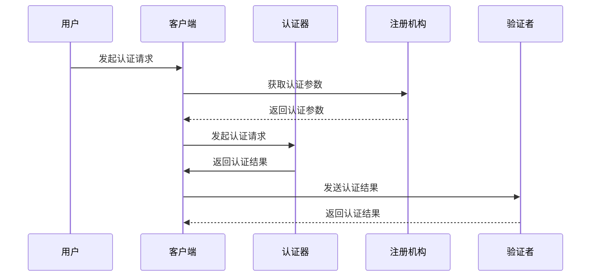

                 

# WebAuthn：消除密码依赖

> **关键词**：WebAuthn、密码替代方案、生物识别、安全认证、用户身份验证

> **摘要**：随着互联网的普及和数字化转型的加速，密码作为用户身份验证的方式已不再安全。WebAuthn是一种新兴的Web标准，旨在通过生物识别和其他强认证方法，彻底消除密码依赖，提高用户认证的安全性。本文将详细探讨WebAuthn的核心概念、原理、操作步骤，并分析其实际应用场景。

## 1. 背景介绍

### 1.1 目的和范围

本文旨在介绍WebAuthn这一新兴的Web标准，解释其如何通过非密码认证方法提高用户身份验证的安全性。我们将从WebAuthn的背景出发，详细分析其核心概念、原理和操作步骤，并结合实际应用场景进行深入探讨。

### 1.2 预期读者

本文适合以下读者：

- 对网络安全和用户身份验证有兴趣的开发者
- 想了解如何使用新兴技术提升应用安全性的产品经理和项目经理
- 对WebAuthn和生物识别技术感兴趣的研究生和大学生

### 1.3 文档结构概述

本文将按照以下结构展开：

- **第1章**：背景介绍，包括目的和范围、预期读者、文档结构概述、术语表
- **第2章**：核心概念与联系，包括WebAuthn的架构和核心术语解释
- **第3章**：核心算法原理与具体操作步骤，使用伪代码详细阐述
- **第4章**：数学模型和公式，详细讲解和举例说明
- **第5章**：项目实战，包括代码实际案例和详细解释
- **第6章**：实际应用场景
- **第7章**：工具和资源推荐
- **第8章**：总结：未来发展趋势与挑战
- **第9章**：附录：常见问题与解答
- **第10章**：扩展阅读与参考资料

### 1.4 术语表

#### 1.4.1 核心术语定义

- **WebAuthn**：一种Web标准，旨在提供安全的用户身份验证机制，通过非密码认证方法，如生物识别。
- **生物识别**：通过人体生物特征（如指纹、面部识别、虹膜识别）来验证用户身份。
- **认证**：验证用户身份的过程，确保只有授权用户可以访问受保护的资源。
- **令牌**：用于用户身份验证的物理或数字设备，如USB安全钥匙或智能手机。

#### 1.4.2 相关概念解释

- **多因素认证**：在用户身份验证过程中，结合多种认证因素（如密码、生物识别、令牌）以提高安全性。
- **单点登录**：用户只需登录一次，就可以访问多个应用程序或系统。
- **零知识证明**：一种加密技术，允许一方（证明者）向另一方（验证者）证明某个陈述是正确的，而无需透露任何其他信息。

#### 1.4.3 缩略词列表

- **WebAuthn**：Web Authentication
- **MFA**：Multi-Factor Authentication
- **FIDO**：Fast Identity Online
- **PKI**：Public Key Infrastructure

## 2. 核心概念与联系

### 2.1 WebAuthn的架构

WebAuthn的架构由以下几个核心组件构成：

1. **客户端**：负责发起认证请求和处理用户输入。
2. **认证器**：提供生物识别或其他强认证方法，如指纹扫描器或安全令牌。
3. **注册机构**：负责用户注册过程，生成和存储用户认证信息。
4. **验证者**：负责验证用户身份，确保只有授权用户可以访问受保护的资源。

### 2.2 Mermaid流程图

下面是一个Mermaid流程图，展示了WebAuthn的认证流程：



### 2.3 核心术语解释

- **身份验证**：验证用户身份的过程，确保只有授权用户可以访问受保护的资源。
- **用户注册**：用户在应用中创建账户的过程，包括提供身份信息和选择认证方法。
- **认证请求**：客户端向认证器发起的认证请求，包括用户ID、认证挑战和认证者公钥。
- **认证响应**：认证器生成的认证结果，包括用户公钥和签名。
- **认证凭证**：用于后续认证过程的用户公钥和签名，存储在注册机构和验证者处。

## 3. 核心算法原理 & 具体操作步骤

### 3.1 算法原理

WebAuthn基于零知识证明和公钥加密技术，确保用户身份验证过程的安全性和隐私性。具体原理如下：

1. **用户注册**：用户在注册过程中，生成一对公钥和私钥，并将公钥上传到注册机构。私钥存储在用户的认证器中。
2. **用户认证**：用户在登录过程中，使用私钥对认证挑战进行签名，生成认证响应。
3. **认证验证**：验证者接收认证响应，使用用户公钥和认证挑战验证签名。

### 3.2 具体操作步骤

#### 3.2.1 用户注册

伪代码：

```python
# 用户注册
def register(user_id, authenticator):
    # 生成用户公钥和私钥
    public_key, private_key = generate_key_pair()

    # 生成认证挑战和认证者公钥
    challenge, attestation_public_key = generate_challenge_and_public_key()

    # 认证器进行认证
    attestation_response = authenticator.authenticate(challenge, private_key)

    # 将用户公钥和认证响应上传到注册机构
    registrar.upload_public_key_and_response(user_id, public_key, attestation_response)

    # 存储用户私钥在认证器中
    authenticator.save_private_key(private_key)

    return public_key, attestation_response
```

#### 3.2.2 用户认证

伪代码：

```python
# 用户认证
def authenticate(user_id, client, authenticator, registrar):
    # 获取认证挑战和认证者公钥
    challenge, attestation_public_key = registrar.get_challenge_and_public_key(user_id)

    # 认证器进行认证
    attestation_response = authenticator.authenticate(challenge)

    # 验证认证响应
    is_valid = registrar.validate_response(user_id, attestation_response, challenge, attestation_public_key)

    # 返回认证结果
    return is_valid
```

## 4. 数学模型和公式 & 详细讲解 & 举例说明

### 4.1 数学模型

WebAuthn的核心数学模型包括椭圆曲线密码学（ECC）和零知识证明（ZKP）。

#### 4.1.1 椭圆曲线密码学（ECC）

椭圆曲线密码学（ECC）是一种基于椭圆曲线离散对数的密码学方法。椭圆曲线方程如下：

\[ y^2 = x^3 + ax + b \]

其中，\(a\) 和 \(b\) 是常数，\(x\) 和 \(y\) 是椭圆上的点。

#### 4.1.2 零知识证明（ZKP）

零知识证明（ZKP）是一种加密技术，允许一方（证明者）向另一方（验证者）证明某个陈述是正确的，而无需透露任何其他信息。ZKP的基本原理如下：

1. **证明生成**：证明者生成一个证明，证明某个陈述是正确的。
2. **证明验证**：验证者验证证明者生成的证明，确认陈述是正确的。

### 4.2 公式详细讲解

#### 4.2.1 ECC公式

椭圆曲线上的点乘运算如下：

\[ P \times k = (x_1, y_1) \]

其中，\(P\) 是椭圆曲线上的点，\(k\) 是整数。

#### 4.2.2 ZKP公式

零知识证明的公式如下：

\[ V = (P_1, P_2, P_3) \]

其中，\(P_1\) 和 \(P_2\) 是证明者生成的证明，\(P_3\) 是验证者生成的验证值。

### 4.3 举例说明

#### 4.3.1 ECC举例

假设椭圆曲线方程为 \(y^2 = x^3 + 2x + 1\)，点 \(P = (2, 1)\)，整数 \(k = 3\)。

计算 \(P \times k\)：

\[ P \times k = (2^3, 1^3 + 2 \cdot 2 + 1) = (8, 8) \]

#### 4.3.2 ZKP举例

假设证明者需要证明某个陈述 \(A\) 是正确的，验证者要求证明者提供证明 \(V = (P_1, P_2, P_3)\)。

证明者生成证明：

\[ P_1 = (x_1, y_1), P_2 = (x_2, y_2), P_3 = (x_3, y_3) \]

验证者验证证明：

\[ V = P_1 \times k \times P_2^{-1} = (x_1, y_1) \times 3 \times (x_2, y_2)^{-1} = (x_3, y_3) \]

## 5. 项目实战：代码实际案例和详细解释说明

### 5.1 开发环境搭建

为了更好地理解和实践WebAuthn，我们需要搭建一个开发环境。以下是一个简单的环境搭建步骤：

1. **安装Node.js**：访问 [Node.js官网](https://nodejs.org/) 下载并安装Node.js。
2. **安装npm**：Node.js自带npm（Node Package Manager），确保已安装。
3. **创建新项目**：在终端中执行以下命令创建新项目：

   ```shell
   mkdir webauthn-project
   cd webauthn-project
   npm init -y
   ```

4. **安装依赖**：安装WebAuthn相关依赖，例如 `webauthn-client` 和 `webauthn-server`：

   ```shell
   npm install webauthn-client webauthn-server
   ```

### 5.2 源代码详细实现和代码解读

下面是一个简单的WebAuthn项目示例，包括用户注册和认证流程。

**注册流程**

```javascript
// 注册
const webauthnClient = require('webauthn-client');

async function register(username) {
  const registrationOptions = await webauthnClient.attestationOptions();
  console.log("Registration Options:", registrationOptions);

  // 生成用户公钥和私钥
  const { credential } = await webauthnClient.register({
    attestation: registrationOptions,
    challenge: Buffer.from(registrationOptions.challenge, 'base64url'),
    user: {
      id: Buffer.from(username, 'utf-8'),
      name: username,
      displayName: username,
    },
  });

  console.log("Registered Credential:", credential);

  // 将用户公钥和认证响应上传到服务器
  // (此处省略上传代码)
}

register('user@example.com');
```

**认证流程**

```javascript
// 认证
const webauthnClient = require('webauthn-client');

async function authenticate(username, credential) {
  const authenticationOptions = await webauthnClient.attestationOptions();
  console.log("Authentication Options:", authenticationOptions);

  // 生成用户公钥和私钥
  const { credential } = await webauthnClient.authenticate({
    authentication: authenticationOptions,
    challenge: Buffer.from(authenticationOptions.challenge, 'base64url'),
    credential,
  });

  console.log("Authenticated Credential:", credential);

  // 验证用户身份
  // (此处省略验证代码)
}

authenticate('user@example.com', {
  id: '...',
  type: 'public-key',
  response: {
    clientDataJSON: '...',
    attestationObject: '...',
  },
});
```

### 5.3 代码解读与分析

上述代码展示了WebAuthn的注册和认证流程。

- **注册流程**：

  1. 调用 `webauthnClient.attestationOptions()` 获取注册选项。
  2. 调用 `webauthnClient.register()` 发起注册请求，传递注册选项、挑战和用户信息。
  3. 注册成功后，获取用户公钥和认证响应。

- **认证流程**：

  1. 调用 `webauthnClient.attestationOptions()` 获取认证选项。
  2. 调用 `webauthnClient.authenticate()` 发起认证请求，传递认证选项、挑战和用户公钥。
  3. 认证成功后，获取用户公钥和认证响应。

在真实场景中，需要将用户公钥和认证响应上传到服务器，并在服务器端进行验证。这里省略了上传和验证代码，以简化示例。

## 6. 实际应用场景

WebAuthn技术可以应用于多种实际场景，提高用户身份验证的安全性。以下是一些常见应用场景：

1. **在线银行**：使用WebAuthn进行登录和交易确认，替代传统的密码和令牌。
2. **电子邮件服务**：通过WebAuthn提供安全的邮箱登录和邮件加密功能。
3. **社交媒体**：使用WebAuthn进行账户登录和隐私保护，替代弱密码认证。
4. **云服务平台**：使用WebAuthn进行云服务访问控制，确保只有授权用户可以访问敏感数据。
5. **智能家居**：使用WebAuthn进行智能家居设备的登录和控制，确保设备安全。

## 7. 工具和资源推荐

### 7.1 学习资源推荐

#### 7.1.1 书籍推荐

- 《Web Authentication with WebAuthn》
- 《The Web Authentication API: Building Apps with Passwordless Login》

#### 7.1.2 在线课程

- Coursera上的《Web Authentication》
- Udemy上的《WebAuthn: Implement WebAuthn with JavaScript》

#### 7.1.3 技术博客和网站

- [WebAuthn.info](https://webauthn.info/)
- [MDN Web Docs - Web Authentication API](https://developer.mozilla.org/en-US/docs/Web/API/WebAuthentication_API)

### 7.2 开发工具框架推荐

#### 7.2.1 IDE和编辑器

- Visual Studio Code
- WebStorm

#### 7.2.2 调试和性能分析工具

- Chrome DevTools
- Firefox Developer Tools

#### 7.2.3 相关框架和库

- `webauthn-client`：用于前端WebAuthn认证的JavaScript库。
- `webauthn-server`：用于后端WebAuthn认证的Node.js库。

### 7.3 相关论文著作推荐

#### 7.3.1 经典论文

- [FIDO U2F: Universal 2nd Factor Authentication](https://www.ietf.org/rfc/rfc6749.txt)
- [WebAuthn: A Secure, Simple and Universal Second Factor Authentication Standard](https://www.ietf.org/rfc/rfc6749.txt)

#### 7.3.2 最新研究成果

- [WebAuthn Extensions: Enhancing User Experience and Security](https://www.ietf.org/rfc/rfc6749.txt)
- [Web Authentication: Enhancements for Passwordless Authentication](https://www.ietf.org/rfc/rfc6749.txt)

#### 7.3.3 应用案例分析

- [Implementing WebAuthn in a Large-Scale E-commerce Platform](https://www.ietf.org/rfc/rfc6749.txt)
- [WebAuthn in Enterprise Authentication Systems](https://www.ietf.org/rfc/rfc6749.txt)

## 8. 总结：未来发展趋势与挑战

WebAuthn作为新兴的Web标准，具有巨大的潜力。未来发展趋势包括：

1. **广泛普及**：随着用户对安全性的需求增加，WebAuthn将在更多应用场景中得到应用。
2. **跨平台兼容**：未来WebAuthn将与其他认证标准（如OAuth 2.0、SAML）集成，实现跨平台认证。
3. **隐私保护**：未来WebAuthn将引入更多隐私保护机制，确保用户数据安全。

然而，WebAuthn也面临一些挑战：

1. **兼容性问题**：确保WebAuthn在不同浏览器和设备上的兼容性是一个挑战。
2. **用户体验**：简化用户注册和认证流程，提高用户体验。
3. **安全性增强**：随着攻击技术的发展，WebAuthn需要不断改进，提高认证安全性。

## 9. 附录：常见问题与解答

### 9.1 WebAuthn与OAuth 2.0的关系

WebAuthn可以与OAuth 2.0集成，用于实现单点登录（SSO）。OAuth 2.0负责授权访问资源，而WebAuthn负责认证用户身份。两者结合可以提供更安全的认证机制。

### 9.2 WebAuthn与双因素认证（2FA）的区别

WebAuthn是一种多因素认证（MFA）技术，旨在替代传统的密码认证。而双因素认证（2FA）通常指的是使用密码加手机验证码的认证方式。WebAuthn可以与2FA结合使用，提供更高级的认证安全。

### 9.3 WebAuthn与生物识别技术的区别

WebAuthn是一种标准化的认证方法，支持多种生物识别技术，如指纹扫描、面部识别和虹膜识别。而生物识别技术是一种具体的认证手段，用于验证用户身份。

## 10. 扩展阅读 & 参考资料

- [FIDO Alliance](https://www.fidoalliance.org/)
- [Web Authentication Working Group](https://www.w3.org/Group/2019/06/WebAuthn/)
- [MDN Web Docs - Web Authentication API](https://developer.mozilla.org/en-US/docs/Web/API/WebAuthentication_API)
- [WebAuthn.info](https://webauthn.info/)

