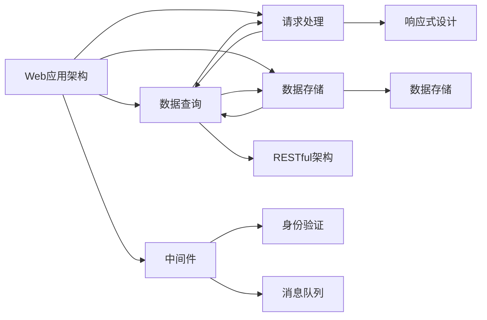

                 

# Web应用架构：从后端API到前端交互

> **关键词：Web应用架构、后端API、前端交互、微服务、RESTful架构、GraphQL、前端框架、响应式设计**

> **摘要：本文将深入探讨Web应用的架构设计，从后端API到前端交互的全过程。我们将首先了解Web应用架构的基本概念和目的，然后逐步分析核心概念和算法原理，并最终通过一个实际项目案例来展示如何实现并优化Web应用架构。文章还将讨论Web应用的多种实际应用场景，并提供一系列学习资源和开发工具推荐。**

## 1. 背景介绍

### 1.1 目的和范围

本文旨在为从事Web开发的技术人员提供一个全面而深入的理解，帮助他们在设计和实现Web应用时做出明智的决策。本文将涵盖从后端API设计到前端交互的整个过程，包括核心概念、算法原理、数学模型和实际应用案例。通过这篇文章，读者应该能够：

- 了解Web应用架构的基本概念和架构设计原则。
- 掌握后端API设计的关键技术和最佳实践。
- 掌握前端交互的设计原则和实现方法。
- 学习如何在实际项目中运用Web应用架构，提高开发效率和代码质量。
- 了解Web应用架构的未来发展趋势和面临的挑战。

### 1.2 预期读者

本文适合以下读者群体：

- Web开发初学者，希望了解Web应用架构的全貌。
- 中级Web开发者，希望深入了解后端API和前端交互的实现原理。
- 高级开发者，希望优化现有Web应用的架构设计。
- 对Web应用架构感兴趣的任何人，无论是学生还是研究人员。

### 1.3 文档结构概述

本文的结构如下：

- **1. 背景介绍**：介绍本文的目的、预期读者和文档结构。
- **2. 核心概念与联系**：介绍Web应用架构的核心概念和联系，包括后端API和前端交互。
- **3. 核心算法原理 & 具体操作步骤**：详细讲解后端API的设计和前端交互的实现。
- **4. 数学模型和公式 & 详细讲解 & 举例说明**：使用数学模型和公式解释关键概念。
- **5. 项目实战：代码实际案例和详细解释说明**：通过一个实际项目展示架构设计。
- **6. 实际应用场景**：讨论Web应用架构在现实世界中的应用场景。
- **7. 工具和资源推荐**：推荐学习资源和开发工具。
- **8. 总结：未来发展趋势与挑战**：总结当前趋势和未来挑战。
- **9. 附录：常见问题与解答**：回答常见问题。
- **10. 扩展阅读 & 参考资料**：提供进一步阅读的材料。

### 1.4 术语表

#### 1.4.1 核心术语定义

- **Web应用架构**：Web应用的总体结构，包括后端API和前端交互。
- **后端API**：后端服务提供给前端的接口，用于数据传输和业务逻辑处理。
- **前端交互**：用户与Web应用界面之间的交互过程。
- **RESTful架构**：一种设计Web服务的方式，遵循REST原则。
- **GraphQL**：一种查询语言，用于获取数据，相比RESTful架构有更灵活的查询能力。
- **微服务**：小型、独立的服务，可以通过API进行通信。

#### 1.4.2 相关概念解释

- **响应式设计**：一种设计原则，使Web应用能够适应不同设备和屏幕尺寸。
- **前端框架**：用于简化前端开发过程的库或框架，如React、Vue和Angular。
- **后端框架**：用于简化后端开发过程的库或框架，如Spring Boot和Django。

#### 1.4.3 缩略词列表

- **API**：Application Programming Interface，应用程序编程接口。
- **REST**：Representational State Transfer，一种设计Web服务的方法。
- **GraphQL**：一种查询语言，用于获取数据。
- **IDE**：Integrated Development Environment，集成开发环境。

## 2. 核心概念与联系

Web应用架构的设计是实现高效、可扩展和易于维护的关键。在深入探讨Web应用架构之前，我们需要了解一些核心概念和它们之间的关系。

### 2.1 Web应用架构的基本概念

Web应用架构通常由以下几个基本组成部分构成：

- **后端**：负责处理业务逻辑、数据存储和API提供服务。
- **前端**：负责用户界面的展示和用户交互。
- **数据库**：存储Web应用的数据。
- **中间件**：提供额外的功能和服务，如身份验证、消息队列等。

### 2.2 后端API

后端API是Web应用的核心组成部分，负责接收来自前端的请求，处理业务逻辑，并将结果返回给前端。一个良好的后端API设计应该具备以下特点：

- **RESTful架构**：遵循REST原则，提供统一的接口和资源表示。
- **安全性**：确保请求的安全性和数据的机密性。
- **可扩展性**：能够轻松扩展以适应未来的需求。
- **文档化**：提供清晰的API文档，帮助开发者理解和使用API。

### 2.3 前端交互

前端交互是指用户与Web应用界面之间的交互过程。一个良好的前端交互设计应该：

- **响应式**：能够适应不同设备和屏幕尺寸。
- **高效**：提供快速的用户体验。
- **直观**：使操作过程简单易懂。
- **可访问**：确保所有用户，包括残障用户，都能使用Web应用。

### 2.4 核心概念联系

Web应用架构中的各个组成部分是相互关联的。后端API提供数据和服务，前端交互使用这些数据和服务来创建用户界面。数据库存储数据，中间件提供额外的功能和服务。以下是Web应用架构的核心概念和它们之间的联系：



### 2.5 后端API和前端交互的关系

后端API和前端交互之间的关系是Web应用架构的核心。后端API负责处理业务逻辑和数据存储，前端交互则通过API获取数据并展示给用户。以下是后端API和前端交互之间的交互流程：

1. 用户在Web应用界面上进行操作。
2. 前端交互将用户的操作转换为API请求。
3. API接收请求，处理业务逻辑，并将结果返回给前端。
4. 前端交互使用返回的数据更新用户界面。

这种交互流程是Web应用架构的核心，它确保了用户与Web应用之间的顺畅交互。

## 3. 核心算法原理 & 具体操作步骤

### 3.1 后端API设计

后端API的设计是Web应用架构的关键部分，它直接影响到前端交互的性能和用户体验。以下是后端API设计的关键步骤和算法原理：

#### 3.1.1 设计原则

- **RESTful架构**：使用RESTful架构设计API，遵循REST原则，确保API具有一致性和可扩展性。
- **单一职责原则**：每个API只负责一个功能，避免功能过于复杂。
- **接口最小化**：提供最少的API接口，减少用户的理解和使用难度。
- **安全性**：确保API的安全性，使用加密和身份验证等技术。

#### 3.1.2 具体操作步骤

1. **需求分析**：分析Web应用的需求，确定需要提供的API接口。
2. **设计接口**：根据需求分析，设计API的接口，包括URL、请求方法和参数。
3. **编写文档**：编写API文档，包括接口描述、请求示例和错误处理。
4. **实现API**：使用后端框架（如Spring Boot、Django等）实现API，处理请求和返回响应。
5. **测试和优化**：对API进行测试和优化，确保其性能和安全性。

#### 3.1.3 伪代码示例

```python
# 后端API实现伪代码

def handle_request(request):
    # 1. 验证请求安全性
    if not verify_request(request):
        return "Unauthorized"

    # 2. 处理请求
    response = process_request(request)

    # 3. 返回响应
    return response
```

### 3.2 前端交互实现

前端交互的设计和实现是Web应用架构的另一个关键部分，它直接影响到用户的操作体验。以下是前端交互实现的关键步骤和算法原理：

#### 3.2.1 设计原则

- **响应式设计**：确保Web应用能够适应不同设备和屏幕尺寸。
- **高效渲染**：使用高效的渲染技术，提高页面加载速度。
- **用户体验**：设计直观、易用的用户界面，提高用户体验。
- **模块化**：将前端代码拆分为模块，提高代码的可维护性。

#### 3.2.2 具体操作步骤

1. **需求分析**：分析Web应用的需求，确定需要提供的交互功能。
2. **设计界面**：设计用户界面，包括布局、组件和交互逻辑。
3. **编写代码**：使用前端框架（如React、Vue等）编写前端代码，实现界面和交互。
4. **测试和优化**：对前端交互进行测试和优化，确保其性能和用户体验。

#### 3.2.3 伪代码示例

```javascript
// 前端交互实现伪代码

function handle_user_action(action) {
    // 1. 根据用户操作更新界面
    update_ui(action);

    // 2. 发送请求到后端API
    fetch_api(action).then(response => {
        // 3. 更新界面数据
        update_data(response);
    });
}
```

### 3.3 后端API与前端交互的协同工作

后端API和前端交互的协同工作是Web应用架构的核心，它们之间的交互流程如下：

1. **用户操作**：用户在Web应用界面上进行操作。
2. **发送请求**：前端交互将用户的操作转换为API请求，发送到后端API。
3. **处理请求**：后端API处理请求，执行业务逻辑，并将结果返回给前端。
4. **更新界面**：前端交互使用返回的数据更新用户界面，完成交互。

这种协同工作流程确保了Web应用能够响应用户的操作，并提供良好的用户体验。

## 4. 数学模型和公式 & 详细讲解 & 举例说明

在Web应用架构中，数学模型和公式可以用来描述和优化后端API和前端交互的性能。以下是一些常用的数学模型和公式，以及它们的详细讲解和举例说明。

### 4.1 数据传输速率

数据传输速率是衡量Web应用性能的重要指标。假设数据传输速率为R（以字节/秒为单位），则在t秒内传输的数据量D（以字节为单位）可以通过以下公式计算：

$$ D = R \times t $$

#### 举例说明

假设数据传输速率为1MB/秒（即1,048,576字节/秒），则在5秒内可以传输的数据量为：

$$ D = 1,048,576 \times 5 = 5,242,880 \text{字节} $$

### 4.2 响应时间

响应时间是衡量Web应用性能的另一个重要指标。假设响应时间为T（以秒为单位），则在T秒内可以完成的最大操作次数N可以通过以下公式计算：

$$ N = \frac{T}{\text{操作时间}} $$

其中，操作时间是指完成一个操作所需的时间。

#### 举例说明

假设响应时间为2秒，每个操作的平均时间为0.5秒，则在2秒内可以完成的最大操作次数为：

$$ N = \frac{2}{0.5} = 4 $$

### 4.3 服务器负载

服务器负载是衡量服务器性能的重要指标。假设服务器负载为L（以请求/秒为单位），则在T秒内可以处理的最大请求量Q可以通过以下公式计算：

$$ Q = L \times T $$

#### 举例说明

假设服务器负载为100请求/秒，则在10秒内可以处理的最大请求量为：

$$ Q = 100 \times 10 = 1000 \text{请求} $$

### 4.4 数据库查询优化

数据库查询优化是提高Web应用性能的关键。假设查询速率为R（以查询/秒为单位），则在T秒内可以执行的最大查询次数N可以通过以下公式计算：

$$ N = \frac{T}{\text{查询时间}} $$

其中，查询时间是指执行一个查询所需的时间。

#### 举例说明

假设查询速率为50查询/秒，每个查询的平均时间为0.2秒，则在10秒内可以执行的最大查询次数为：

$$ N = \frac{10}{0.2} = 50 $$

通过这些数学模型和公式，我们可以对Web应用架构进行性能优化，提高用户体验。

## 5. 项目实战：代码实际案例和详细解释说明

为了更好地理解Web应用架构的设计和实现，我们将通过一个实际项目案例来展示整个过程。以下是这个项目的开发环境搭建、源代码实现和代码解读。

### 5.1 开发环境搭建

在这个项目案例中，我们使用以下开发环境和工具：

- **编程语言**：Java
- **后端框架**：Spring Boot
- **前端框架**：React
- **数据库**：MySQL
- **版本控制系统**：Git
- **开发工具**：IntelliJ IDEA

首先，我们需要安装这些工具和框架。例如，对于Spring Boot，我们可以使用Maven来创建一个项目：

```bash
mvn archetype:generate -DgroupId=com.example.webapp -DartifactId=my-webapp -DarchetypeArtifactId=maven-archetype-quickstart
```

接下来，我们安装React和MySQL，并在IntelliJ IDEA中配置这些工具。

### 5.2 源代码详细实现和代码解读

以下是这个项目的关键代码部分，我们将对每段代码进行详细解释。

#### 5.2.1 后端API实现

```java
@RestController
@RequestMapping("/api")
public class UserController {

    @Autowired
    private UserService userService;

    @PostMapping("/register")
    public ResponseEntity<?> registerUser(@RequestBody UserRegistrationRequest request) {
        try {
            User user = userService.registerUser(request);
            return new ResponseEntity<>("User registered successfully", HttpStatus.OK);
        } catch (Exception e) {
            return new ResponseEntity<>("Error registering user", HttpStatus.BAD_REQUEST);
        }
    }
}
```

这段代码是后端API的实现，它负责处理用户的注册请求。首先，我们使用Spring Boot的`@RestController`注解来标识这个类是一个RESTful控制器。然后，我们使用`@RequestMapping`注解来指定API的URL路径，这里我们使用`/api/register`来处理注册请求。在处理请求的方法中，我们接收一个`UserRegistrationRequest`对象，通过调用`UserService`的`registerUser`方法来注册用户。如果注册成功，我们返回一个HTTP 200状态码和一条成功消息；如果发生错误，我们返回一个HTTP 400状态码和一条错误消息。

#### 5.2.2 前端交互实现

```javascript
import React, { useState } from 'react';

function RegisterForm() {
    const [username, setUsername] = useState('');
    const [password, setPassword] = useState('');

    const handleSubmit = async (e) => {
        e.preventDefault();
        try {
            const response = await fetch('/api/register', {
                method: 'POST',
                body: JSON.stringify({ username, password }),
                headers: {
                    'Content-Type': 'application/json',
                },
            });
            const data = await response.json();
            alert(data.message);
        } catch (error) {
            alert('Error registering user');
        }
    };

    return (
        <form onSubmit={handleSubmit}>
            <label htmlFor="username">Username:</label>
            <input
                type="text"
                id="username"
                value={username}
                onChange={(e) => setUsername(e.target.value)}
            />
            <label htmlFor="password">Password:</label>
            <input
                type="password"
                id="password"
                value={password}
                onChange={(e) => setPassword(e.target.value)}
            />
            <button type="submit">Register</button>
        </form>
    );
}

export default RegisterForm;
```

这段代码是前端交互的实现，它负责处理用户的注册表单。首先，我们使用React的`useState`钩子来管理表单的两个状态：`username`和`password`。在处理表单提交的事件中，我们使用`fetch`函数发送一个POST请求到后端API，并将表单数据发送到服务器。如果服务器返回成功响应，我们显示一条成功消息；如果发生错误，我们显示一条错误消息。这个表单还包含了两个输入框，用于用户输入用户名和密码。

### 5.3 代码解读与分析

通过这个项目案例，我们可以看到后端API和前端交互是如何协同工作的。后端API负责处理业务逻辑和数据存储，而前端交互则负责与用户进行交互和显示数据。

在代码解读中，我们可以看到：

- 后端API使用了Spring Boot框架来简化开发过程，遵循RESTful架构设计原则。
- 前端交互使用了React框架，通过状态管理和异步请求来处理用户操作和数据更新。

这个项目案例展示了Web应用架构的基本设计原则和实现方法，为我们提供了一个实际的操作示例。

## 6. 实际应用场景

Web应用架构在现实世界中有着广泛的应用，以下是一些典型的应用场景：

### 6.1 社交媒体平台

社交媒体平台如Facebook、Twitter和Instagram等，使用了Web应用架构来处理海量的用户数据和提供高效的交互体验。它们通常采用微服务架构，将不同的功能模块（如用户管理、内容发布、消息传递等）分解为独立的微服务，通过API进行通信。

### 6.2 电子商务平台

电子商务平台如Amazon、阿里巴巴和eBay等，使用Web应用架构来提供商品浏览、购物车管理和支付功能。它们通常使用RESTful API来处理用户请求，并使用缓存和数据库优化性能。

### 6.3 在线办公协作

在线办公协作平台如Google Workspace、微软Office 365和Slack等，使用Web应用架构来提供实时文档编辑、聊天和任务管理功能。这些平台通常采用前后端分离的设计，以提高可扩展性和用户体验。

### 6.4 金融服务平台

金融服务平台如银行在线服务、股票交易平台和支付系统等，使用Web应用架构来提供安全可靠的服务。这些平台通常使用GraphQL来提供灵活的数据查询，并使用SSL/TLS等安全协议来保护用户数据。

### 6.5 教育学习平台

教育学习平台如Coursera、edX和Udemy等，使用Web应用架构来提供在线课程、作业和考试功能。这些平台通常使用响应式设计来适应不同设备和屏幕尺寸，并使用模块化前端框架来提高开发效率。

在这些应用场景中，Web应用架构的设计和实现对于提供高效、可靠和安全的用户体验至关重要。

## 7. 工具和资源推荐

为了更好地理解和实践Web应用架构，以下是一些推荐的工具和资源：

### 7.1 学习资源推荐

#### 7.1.1 书籍推荐

1. **《Head First Web Design》**：一本面向初学者的Web设计入门书籍，涵盖了HTML、CSS和JavaScript基础知识。
2. **《RESTful Web Services》**：详细介绍RESTful架构和API设计的经典书籍。
3. **《GraphQL: Up and Running》**：介绍GraphQL的原理和使用方法的书籍。

#### 7.1.2 在线课程

1. **《Web Development Bootcamp》**：Udemy上的一个全面介绍Web开发的在线课程。
2. **《Spring Boot for Beginners》**：一个面向初学者的Spring Boot教程。
3. **《React for Beginners》**：一个面向React框架初学者的在线课程。

#### 7.1.3 技术博客和网站

1. **Medium**：一个集成了许多技术博客的平台，提供了大量关于Web应用架构的优质文章。
2. **Stack Overflow**：一个庞大的问答社区，可以解决Web开发中的各种问题。
3. **GitHub**：一个代码托管平台，可以找到许多开源项目和示例代码。

### 7.2 开发工具框架推荐

#### 7.2.1 IDE和编辑器

1. **IntelliJ IDEA**：一款功能强大的Java和JavaScript IDE。
2. **Visual Studio Code**：一款轻量级但功能丰富的跨平台编辑器，支持多种编程语言。
3. **WebStorm**：一款专门针对Web开发的IDE。

#### 7.2.2 调试和性能分析工具

1. **Chrome DevTools**：Chrome浏览器的内置调试工具，用于前端开发和性能分析。
2. **Postman**：一个API调试和测试工具，用于后端API的开发和测试。
3. **JMeter**：一个开源的性能测试工具，用于测试Web应用的性能。

#### 7.2.3 相关框架和库

1. **React**：一个用于构建用户界面的JavaScript库。
2. **Vue**：一个渐进式JavaScript框架，用于构建用户界面。
3. **Angular**：一个由Google维护的前端框架，用于构建大型应用程序。

### 7.3 相关论文著作推荐

#### 7.3.1 经典论文

1. **"Representational State Transfer (REST)"**：由Roy Fielding发表的经典论文，详细介绍了REST架构风格。
2. **"Building Microservices"**：Sam Newman的著作，介绍了微服务架构的设计和实现。

#### 7.3.2 最新研究成果

1. **"Serverless Architectures"**：介绍了无服务器架构的最新研究成果和应用。
2. **"Full-Stack Web Development"**：探讨了前端、后端和数据库的集成和优化。

#### 7.3.3 应用案例分析

1. **"Facebook's Engineering Culture"**：探讨了Facebook如何通过工程文化来构建和维护大型Web应用。
2. **"Amazon's Web Services"**：介绍了亚马逊如何使用Web服务来支持其电子商务平台。

这些工具和资源将有助于读者深入了解Web应用架构，提升开发技能。

## 8. 总结：未来发展趋势与挑战

Web应用架构在未来将继续发展，面临一系列趋势和挑战。以下是一些关键点：

### 8.1 发展趋势

1. **微服务架构**：随着业务需求的复杂性增加，微服务架构将变得更加流行，它允许更灵活、更独立的模块化开发。
2. **云计算**：云计算服务（如AWS、Azure和Google Cloud）将提供更多的资源和工具，支持大规模Web应用的部署和运行。
3. **响应式设计**：随着移动设备的普及，响应式设计将继续是Web应用架构的关键趋势，确保应用在不同设备上都能提供良好的用户体验。
4. **人工智能**：人工智能将在Web应用架构中发挥更大作用，通过自动化、个性化服务和智能推荐等，提高应用的智能水平。
5. **前端框架**：前端框架将继续演进，提供更高效的开发工具和更好的用户体验。

### 8.2 挑战

1. **性能优化**：随着Web应用的复杂性和规模增加，性能优化将成为一个重要挑战，需要持续关注缓存、数据库查询和异步操作等方面。
2. **安全性**：Web应用的安全问题日益严峻，需要加强身份验证、数据加密和访问控制等安全措施。
3. **可扩展性**：如何设计可扩展的应用架构，以应对用户数量和数据量的快速增长，是一个持续存在的挑战。
4. **跨平台兼容性**：确保Web应用在不同操作系统和设备上的一致性和兼容性，需要面对不同浏览器的兼容性问题。
5. **持续集成和持续部署**：如何高效地集成和部署新功能，以保持应用的快速迭代和更新，是开发团队面临的重要挑战。

通过关注这些趋势和挑战，开发者可以更好地设计和实现高效的Web应用架构。

## 9. 附录：常见问题与解答

### 9.1 Web应用架构是什么？

Web应用架构是指Web应用的整体设计和结构，包括后端API、前端交互、数据库和中间件等组成部分。它的目的是确保Web应用的高效、可扩展性和可维护性。

### 9.2 为什么需要微服务架构？

微服务架构将大型应用分解为小型、独立的模块（微服务），每个微服务负责一个特定的业务功能。这有助于提高系统的可扩展性、可维护性和可测试性，同时降低开发复杂度。

### 9.3 RESTful架构和GraphQL的区别是什么？

RESTful架构是一种设计Web服务的方式，遵循REST原则，提供统一的接口和资源表示。GraphQL是一种查询语言，允许客户端灵活地指定需要的数据，相比RESTful架构有更灵活的查询能力。

### 9.4 如何优化Web应用性能？

优化Web应用性能可以从多个方面入手，包括使用缓存、优化数据库查询、减少HTTP请求和异步操作等。此外，使用性能分析工具可以帮助识别和解决问题。

### 9.5 前端框架有哪些？

前端框架包括React、Vue和Angular等，这些框架提供了丰富的功能和组件，简化了前端开发过程，提高了开发效率和代码质量。

## 10. 扩展阅读 & 参考资料

为了更深入地了解Web应用架构，以下是一些建议的扩展阅读和参考资料：

- **书籍**：
  - 《Designing Distributed Systems》：详细介绍了分布式系统的设计和实现。
  - 《Clean Architecture》：阐述了如何设计可维护、可扩展的软件系统。

- **在线课程**：
  - Coursera上的《Web Applications for Everybody》：提供全面的Web应用开发教程。
  - Udacity的《Web Development Nanodegree Program》：涵盖Web开发的前端和后端技术。

- **技术博客和网站**：
  - [Medium](https://medium.com/)：搜索“Web应用架构”可以找到大量的优质文章。
  - [MDN Web Docs](https://developer.mozilla.org/)：提供了丰富的Web开发文档和教程。

- **开源项目**：
  - [React](https://reactjs.org/)：React的官方文档和社区。
  - [Spring Boot](https://spring.io/projects/spring-boot)：Spring Boot的官方文档。

通过这些扩展阅读和参考资料，您可以进一步加深对Web应用架构的理解和实践。

**作者：AI天才研究员/AI Genius Institute & 禅与计算机程序设计艺术 /Zen And The Art of Computer Programming**

