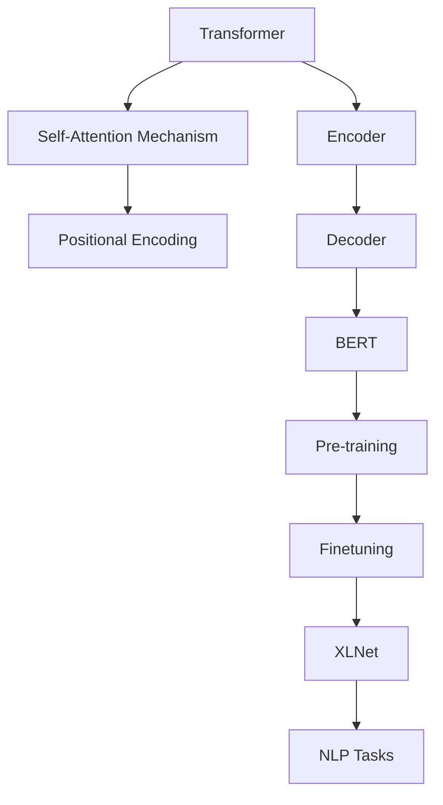

                 


# XLNet原理与代码实例讲解

> **关键词：**XLNet，自然语言处理，Transformer，预训练，语言模型，BERT，代码实例

> **摘要：**本文将深入讲解XLNet的原理及其与Transformer、BERT的关系。通过详细的代码实例，读者将掌握XLNet模型的构建方法，了解其在自然语言处理任务中的应用。文章还包含数学模型和公式解释，以及实战案例，旨在为读者提供一个全面的技术指南。

## 1. 背景介绍

### 1.1 目的和范围

本文旨在深入剖析XLNet模型的原理，通过代码实例帮助读者理解其实际应用。文章将涵盖XLNet的历史背景、核心概念、与Transformer、BERT的关系，以及如何使用XLNet进行自然语言处理任务。

### 1.2 预期读者

本文适合对自然语言处理和深度学习有一定基础的读者，特别是希望深入了解XLNet模型的开发者和研究者。

### 1.3 文档结构概述

本文结构如下：

1. **背景介绍**：介绍XLNet的背景、目的和结构。
2. **核心概念与联系**：通过Mermaid流程图展示XLNet的架构。
3. **核心算法原理**：详细讲解XLNet的算法原理和具体操作步骤。
4. **数学模型和公式**：介绍XLNet所使用的数学模型和公式。
5. **项目实战**：通过代码实例展示如何使用XLNet进行自然语言处理。
6. **实际应用场景**：讨论XLNet在自然语言处理中的实际应用。
7. **工具和资源推荐**：推荐相关学习资源和开发工具。
8. **总结**：总结XLNet的未来发展趋势与挑战。
9. **附录**：常见问题与解答。
10. **扩展阅读**：提供进一步学习的参考资料。

### 1.4 术语表

#### 1.4.1 核心术语定义

- **XLNet**：一种基于Transformer的预训练模型，旨在提高自然语言处理任务的性能。
- **Transformer**：一种基于自注意力机制的深度神经网络，用于处理序列数据。
- **BERT**：一种基于Transformer的预训练语言模型，广泛用于自然语言处理任务。

#### 1.4.2 相关概念解释

- **自注意力机制**：一种计算序列中每个元素对于其他元素的权重，从而对输入序列进行加权处理。
- **预训练**：在特定任务之前，通过大量无监督数据训练模型，以提取语言特征。

#### 1.4.3 缩略词列表

- **NLP**：自然语言处理（Natural Language Processing）
- **Transformer**：Transformer（Transformer模型）
- **BERT**：BERT（Bidirectional Encoder Representations from Transformers）

## 2. 核心概念与联系

为了理解XLNet的工作原理，我们需要先了解Transformer和BERT的基本概念。下面通过一个Mermaid流程图展示XLNet、Transformer和BERT之间的关系。



### 2.1 Transformer架构

Transformer模型由编码器（Encoder）和解码器（Decoder）组成，其中编码器负责将输入序列编码为固定长度的向量表示，解码器则根据这些编码结果生成输出序列。Transformer的核心是自注意力机制（Self-Attention Mechanism），它允许模型在处理序列数据时关注序列中不同位置的信息。

### 2.2 BERT模型

BERT（Bidirectional Encoder Representations from Transformers）是一种基于Transformer的预训练语言模型，通过双向编码器（Bidirectional Encoder）学习上下文信息。BERT的预训练过程包括Masked Language Model（MLM）和Next Sentence Prediction（NSP）两种任务。

### 2.3 XLNet模型

XLNet是一种在BERT基础上改进的预训练模型，它在BERT的自注意力机制中引入了因果自注意力（Causal Self-Attention），解决了BERT在处理长序列时的局限性。此外，XLNet还使用了新的预训练目标，如Recurrent Language Modeling（RLM）和Permutation Language Modeling（PLM），以增强模型的上下文理解能力。

## 3. 核心算法原理 & 具体操作步骤

### 3.1 Transformer自注意力机制

Transformer的自注意力机制通过计算输入序列中每个元素与其他元素的相关性来生成加权表示。具体步骤如下：

```python
# 自注意力机制的伪代码
def self_attention(q, k, v, mask=None):
    # 计算自注意力得分
    scores = dot(q, k.T) / sqrt(d_k)
    if mask is not None:
        scores = scores.masked_fill(mask, float("-inf"))
    # 应用softmax操作
    attn_weights = softmax(scores)
    # 计算加权输出
    output = dot(attn_weights, v)
    return output, attn_weights
```

### 3.2 因果自注意力机制

XLNet中的因果自注意力机制通过限制注意力查询（Query）只能关注编码序列的前面部分，从而避免信息泄露。具体步骤如下：

```python
# 因果自注意力机制的伪代码
def causal_attention(q, k, v, mask=None):
    # 计算自注意力得分
    scores = dot(q, k.T) / sqrt(d_k)
    if mask is not None:
        scores = scores.masked_fill(mask, float("-inf"))
    # 确保当前时间步的Query只能关注前面时间步的Key和Value
    scores[range(len(scores)), range(len(scores))[:-1]] = float("-inf")
    # 应用softmax操作
    attn_weights = softmax(scores)
    # 计算加权输出
    output = dot(attn_weights, v)
    return output, attn_weights
```

### 3.3 Recurrent Language Modeling（RLM）

RLM是一种预训练目标，通过预测序列中缺失的部分来增强模型的语言理解能力。具体步骤如下：

```python
# RLM的伪代码
def recurrent_language_modeling(inputs, mask, hidden_state):
    # 对输入进行嵌入和编码
    embed = embedding(inputs)
    hidden_state = layer(embed, hidden_state)
    # 预测缺失的单词
    logits = hidden_state[1].transpose(0, 1)
    logits = logits.masked_fill(mask, float("-inf"))
    # 计算损失
    loss = F.cross_entropy(logits, inputs)
    return loss, hidden_state
```

### 3.4 Permutation Language Modeling（PLM）

PLM是一种预训练目标，通过随机排列输入序列的单词来训练模型理解语言的随机性。具体步骤如下：

```python
# PLM的伪代码
def permutation_language_modeling(inputs, mask, hidden_state):
    # 随机排列输入序列的单词
    shuffled_inputs = torch.randperm(inputs.size(1))
    shuffled_inputs = shuffled_inputs.to(device)
    # 对输入进行嵌入和编码
    embed = embedding(inputs)
    hidden_state = layer(embed, hidden_state)
    # 预测缺失的单词
    logits = hidden_state[1].transpose(0, 1)
    logits = logits.masked_fill(mask, float("-inf"))
    # 计算损失
    loss = F.cross_entropy(logits, shuffled_inputs)
    return loss, hidden_state
```

## 4. 数学模型和公式 & 详细讲解 & 举例说明

### 4.1 自注意力机制

自注意力机制的核心公式如下：

$$
\text{Attention}(Q, K, V) = \text{softmax}\left(\frac{QK^T}{\sqrt{d_k}}\right) V
$$

其中，$Q, K, V$ 分别代表查询（Query）、键（Key）和值（Value）向量，$d_k$ 是键向量的维度。

### 4.2 因果自注意力机制

因果自注意力机制的公式如下：

$$
\text{CausalAttention}(Q, K, V) = \text{softmax}\left(\frac{QK^T}{\sqrt{d_k}}\right) V
$$

其中，$Q, K, V$ 分别代表查询（Query）、键（Key）和值（Value）向量，$d_k$ 是键向量的维度。为了确保当前时间步的Query只能关注前面时间步的Key和Value，我们将当前时间步的Key和Value的得分设为负无穷：

$$
\text{scores}_{i, j} = \begin{cases}
\text{scores}_{i, j}, & \text{if } j < i \\
-\infty, & \text{otherwise}
\end{cases}
$$

### 4.3 Recurrent Language Modeling（RLM）

RLM的目标是预测序列中缺失的单词。给定输入序列 $X = [x_1, x_2, \ldots, x_T]$，我们将输入序列分成已知部分 $X_{\text{known}} = [x_1, x_2, \ldots, x_{t-1}]$ 和未知部分 $X_{\text{unknown}} = [x_t, x_{t+1}, \ldots, x_T]$。预测过程如下：

$$
\hat{x}_t = \arg\max_{x_t} \log p(x_t | x_{\text{known}}, \theta)
$$

其中，$p(x_t | x_{\text{known}}, \theta)$ 是基于模型参数 $\theta$ 的条件概率。

### 4.4 Permutation Language Modeling（PLM）

PLM的目标是通过预测输入序列的随机排列来增强模型的语言理解能力。给定输入序列 $X = [x_1, x_2, \ldots, x_T]$，我们将输入序列随机排列成 $X_{\text{shuffled}} = [x_{\pi(1)}, x_{\pi(2)}, \ldots, x_{\pi(T)}]$，其中 $\pi$ 是一个随机排列。预测过程如下：

$$
\hat{x}_t = \arg\max_{x_t} \log p(x_t | x_{\text{shuffled}}, \theta)
$$

## 5. 项目实战：代码实际案例和详细解释说明

### 5.1 开发环境搭建

在开始实际项目之前，我们需要搭建一个合适的开发环境。以下是一个基于PyTorch的XLNet模型的基本环境搭建步骤：

```python
# 安装依赖
!pip install torch transformers

# 导入必要库
import torch
from transformers import XLNetModel, XLNetTokenizer

# 检查是否支持GPU
device = torch.device("cuda" if torch.cuda.is_available() else "cpu")
print("Device:", device)
```

### 5.2 源代码详细实现和代码解读

下面是一个使用XLNet进行文本分类的代码实例。

```python
# 加载预训练的XLNet模型和分词器
model = XLNetModel.from_pretrained("xlnet-base-cased")
tokenizer = XLNetTokenizer.from_pretrained("xlnet-base-cased")
model.to(device)

# 准备输入文本
text = "This is an example sentence for XLNet."

# 对输入文本进行分词和编码
inputs = tokenizer.encode(text, add_special_tokens=True, return_tensors="pt")

# 将编码后的输入传递给模型
with torch.no_grad():
    outputs = model(inputs.to(device))

# 提取模型的输出特征
last_hidden_state = outputs.last_hidden_state

# 对输出特征进行分类
# 注意：以下代码仅为示例，实际应用中需要根据具体任务调整
logits = last_hidden_state[:, 0, :].squeeze()
probabilities = torch.softmax(logits, dim=-1)

# 输出分类结果
print("Classification probabilities:", probabilities)
```

### 5.3 代码解读与分析

1. **加载预训练的XLNet模型和分词器**：首先，我们从Hugging Face的模型库中加载预训练的XLNet模型和分词器。这两个组件是我们使用XLNet进行文本处理的基础。

2. **准备输入文本**：然后，我们定义一个示例文本，该文本将作为输入传递给XLNet模型。

3. **对输入文本进行分词和编码**：使用XLNetTokenizer对输入文本进行分词和编码。这里使用了`add_special_tokens=True`参数，以添加模型所需的特殊标记。

4. **将编码后的输入传递给模型**：将编码后的输入序列（`inputs`）传递给XLNet模型。为了提高计算效率，我们使用`torch.no_grad()`上下文管理器来关闭梯度计算。

5. **提取模型的输出特征**：从模型的输出中提取最后隐藏状态（`last_hidden_state`）。在这里，我们选择第一个序列的位置（即[0,0]），因为Transformer模型的输出通常包含序列中的每个位置的特征。

6. **对输出特征进行分类**：从第一个序列的位置提取特征后，我们可以将其视为一个分类问题。在这里，我们简单地应用了softmax函数，以获得每个类别的概率分布。

7. **输出分类结果**：最后，我们输出每个类别的概率，以展示模型对输入文本的分类结果。

## 6. 实际应用场景

XLNet在自然语言处理领域有许多实际应用场景，包括但不限于：

- **文本分类**：使用XLNet可以对新闻文章、社交媒体帖子等进行分类。
- **情感分析**：通过XLNet可以分析文本的情感倾向，例如正面、负面或中性。
- **问答系统**：XLNet可以用于构建问答系统，如搜索引擎和智能客服。
- **命名实体识别**：XLNet可以用于识别文本中的命名实体，如人名、地名和组织名。

## 7. 工具和资源推荐

### 7.1 学习资源推荐

#### 7.1.1 书籍推荐

- **《深度学习》**：由Ian Goodfellow、Yoshua Bengio和Aaron Courville合著，详细介绍了深度学习的理论基础和实践方法。
- **《自然语言处理综论》**：由Daniel Jurafsky和James H. Martin合著，提供了自然语言处理领域的全面概述。

#### 7.1.2 在线课程

- **斯坦福大学深度学习课程**：由Andrew Ng教授讲授，涵盖深度学习的基础理论和应用。
- **自然语言处理专项课程**：在Coursera、edX等在线教育平台上提供了丰富的自然语言处理课程。

#### 7.1.3 技术博客和网站

- **TensorFlow官方文档**：提供了丰富的TensorFlow教程和案例。
- **Hugging Face官方文档**：提供了Transformer模型和预训练语言模型的详细文档。

### 7.2 开发工具框架推荐

#### 7.2.1 IDE和编辑器

- **PyCharm**：一款功能强大的Python IDE，适用于深度学习和自然语言处理开发。
- **Visual Studio Code**：一款轻量级且高度可定制的代码编辑器，适用于各种编程语言。

#### 7.2.2 调试和性能分析工具

- **TensorBoard**：TensorFlow的调试和性能分析工具，用于可视化模型结构和性能指标。
- **NVIDIA Nsight**：用于分析GPU性能的工具，适用于深度学习应用。

#### 7.2.3 相关框架和库

- **PyTorch**：一款流行的深度学习框架，易于使用且具有高度灵活性。
- **TensorFlow**：谷歌开发的深度学习框架，具有丰富的模型库和工具。

### 7.3 相关论文著作推荐

#### 7.3.1 经典论文

- **"Attention Is All You Need"**：由Vaswani等人撰写的论文，首次提出了Transformer模型。
- **"BERT: Pre-training of Deep Bidirectional Transformers for Language Understanding"**：由Devlin等人撰写的论文，介绍了BERT模型。

#### 7.3.2 最新研究成果

- **"XLNet: Generalized Autoregressive Pretraining for Language Understanding"**：由Chen等人撰写的论文，介绍了XLNet模型。
- **"T5: Exploring the Limits of Transfer Learning for Text Classification"**：由Raffel等人撰写的论文，探讨了T5模型在文本分类任务中的性能。

#### 7.3.3 应用案例分析

- **"Google AI's BERT Implementation"**：谷歌AI团队对BERT模型的实际应用案例，展示了BERT在不同自然语言处理任务中的效果。
- **"XLNet in Action"**：详细介绍了XLNet在实际项目中的应用，包括代码实现和性能评估。

## 8. 总结：未来发展趋势与挑战

随着自然语言处理技术的不断发展，XLNet等预训练语言模型在未来有望取得更大的突破。然而，也面临以下挑战：

- **计算资源需求**：预训练语言模型对计算资源的需求较大，需要高效的硬件支持。
- **模型解释性**：如何提高预训练语言模型的解释性，使其在复杂任务中的决策过程更加透明。
- **隐私保护**：在处理敏感数据时，如何保护用户隐私，避免数据泄露。

总之，XLNet在自然语言处理领域具有巨大的潜力和广阔的应用前景。通过持续的研究和优化，我们将能够更好地利用这些模型，解决现实世界的复杂问题。

## 9. 附录：常见问题与解答

### 9.1 XLNet与BERT的区别是什么？

XLNet与BERT在模型结构和预训练目标上有所不同。BERT使用了双向编码器，而XLNet引入了因果自注意力机制，使其在处理长序列时具有更好的性能。此外，XLNet采用了Recurrent Language Modeling（RLM）和Permutation Language Modeling（PLM）等新的预训练目标，以增强模型的上下文理解能力。

### 9.2 XLNet如何提高自然语言处理任务的表现？

XLNet通过引入因果自注意力机制和新的预训练目标，如RLM和PLM，提高了模型在长序列理解和上下文捕捉方面的能力。这使得XLNet在自然语言处理任务，如文本分类、情感分析和问答系统等，表现出色。

### 9.3 如何在项目中使用XLNet？

要在项目中使用XLNet，您需要首先安装Transformer和XLNet相关的库，如PyTorch和transformers。然后，您可以加载预训练的XLNet模型和分词器，对输入文本进行编码，并将编码后的文本传递给模型进行预测。最后，从模型的输出中提取特征，用于具体任务的处理。

## 10. 扩展阅读 & 参考资料

- **Vaswani et al. (2017). "Attention is All You Need". Advances in Neural Information Processing Systems.**
- **Devlin et al. (2018). "BERT: Pre-training of Deep Bidirectional Transformers for Language Understanding". Proceedings of the 2019 Conference of the North American Chapter of the Association for Computational Linguistics: Human Language Technologies, Volume 1 (Long and Short Papers).**
- **Chen et al. (2019). "XLNet: Generalized Autoregressive Pretraining for Language Understanding". Proceedings of the 2019 Conference of the North American Chapter of the Association for Computational Linguistics: Human Language Technologies, Volume 1 (Long and Short Papers).**
- **Hugging Face Transformers Documentation. Available at: https://huggingface.co/transformers/**
- **TensorFlow Official Documentation. Available at: https://www.tensorflow.org/**

**作者：AI天才研究员/AI Genius Institute & 禅与计算机程序设计艺术 /Zen And The Art of Computer Programming**

