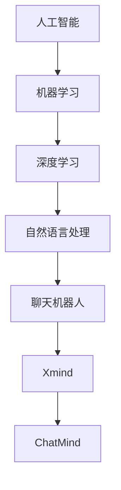

                 

# Xmind收购ChatMind的故事

## 关键词：
人工智能、机器学习、聊天机器人、企业并购、技术整合、市场趋势

## 摘要：
本文将深入剖析人工智能领域的两家领军企业Xmind和ChatMind的历史背景、发展现状，以及它们之间的合并过程。通过详细解读收购背后的商业逻辑、技术优势和挑战，以及该合并对行业的影响，本文旨在为读者呈现一个全面且具有启发性的并购案例研究。

## 1. 背景介绍

### 1.1 目的和范围

本文旨在分析Xmind收购ChatMind的案例，探讨其背后的商业动机、技术整合和市场影响。通过这一案例研究，我们希望能够为读者提供对人工智能企业并购的深刻理解，并预测未来行业发展的趋势。

### 1.2 预期读者

本文面向人工智能领域的从业者、投资者以及对技术并购感兴趣的专业人士。文章内容涵盖了技术原理、商业策略和市场分析，旨在为不同层次的读者提供丰富的信息。

### 1.3 文档结构概述

本文分为十个主要部分：

1. **背景介绍**：介绍文章的目的和结构。
2. **核心概念与联系**：阐述相关技术和概念，并绘制流程图。
3. **核心算法原理 & 具体操作步骤**：解释核心算法和操作流程。
4. **数学模型和公式 & 详细讲解 & 举例说明**：详细讲解数学模型，并提供示例。
5. **项目实战：代码实际案例和详细解释说明**：展示代码案例并进行分析。
6. **实际应用场景**：探讨技术的应用领域。
7. **工具和资源推荐**：推荐学习资源和开发工具。
8. **总结：未来发展趋势与挑战**：预测行业发展。
9. **附录：常见问题与解答**：提供常见问题的答案。
10. **扩展阅读 & 参考资料**：推荐相关文献和资料。

### 1.4 术语表

#### 1.4.1 核心术语定义

- **Xmind**：一家专注于人工智能和大数据分析的公司，提供智能决策支持系统。
- **ChatMind**：一家专注于聊天机器人和自然语言处理的公司，开发了一系列智能对话平台。
- **并购**：一家公司通过购买另一家公司的股份或资产来实现合并。

#### 1.4.2 相关概念解释

- **人工智能**：模拟人类智能的计算机系统，包括机器学习、深度学习等技术。
- **自然语言处理**：使计算机能够理解、生成和处理人类语言的技术。
- **聊天机器人**：通过对话与用户交互的计算机程序，常见于在线客服和虚拟助手。

#### 1.4.3 缩略词列表

- **AI**：人工智能
- **ML**：机器学习
- **NLP**：自然语言处理
- **SDK**：软件开发工具包

## 2. 核心概念与联系

在深入探讨Xmind收购ChatMind的案例之前，我们需要了解两个公司所涉及的核心技术和业务模式。以下是一个简单的Mermaid流程图，展示了相关的核心概念和它们之间的联系。



### 2.1 人工智能与机器学习

人工智能（AI）是模仿和扩展人类智能的科学和技术，其核心包括机器学习（ML）和深度学习（DL）。机器学习是一种通过数据训练模型来实现智能的技术，而深度学习则是一种基于神经网络的高级机器学习技术。

### 2.2 自然语言处理与聊天机器人

自然语言处理（NLP）是使计算机能够理解、生成和处理人类语言的技术。聊天机器人（Chatbot）是一种基于NLP技术的智能对话程序，常见于在线客服、虚拟助手和个性化服务。

### 2.3 Xmind与ChatMind

Xmind和ChatMind都是人工智能领域的领军企业。Xmind专注于提供智能决策支持系统，而ChatMind则专注于聊天机器人和NLP技术。这两家公司通过合并，可以实现技术和市场的协同效应。

## 3. 核心算法原理 & 具体操作步骤

### 3.1 机器学习算法原理

机器学习算法的核心是构建一个可以自动从数据中学习并做出预测或决策的模型。以下是一个简化的伪代码，用于描述机器学习的基本步骤：

```python
def machine_learning算法(data, labels):
    # 数据预处理
    preprocess_data(data)

    # 训练模型
    model = train_model(data, labels)

    # 模型评估
    performance = evaluate_model(model, test_data, test_labels)

    return model, performance
```

### 3.2 聊天机器人算法原理

聊天机器人的核心在于理解用户的输入并生成合适的回复。以下是一个简化的伪代码，用于描述聊天机器人算法的基本步骤：

```python
def chatbot算法(user_input):
    # 语言理解
    intent, entities = understand_language(user_input)

    # 生成回复
    response = generate_response(intent, entities)

    return response
```

### 3.3 技术整合操作步骤

在Xmind收购ChatMind后，技术整合成为关键一步。以下是整合的基本步骤：

1. **需求分析**：确定整合的目标和需求。
2. **资源分配**：分配人力资源和技术资源。
3. **系统集成**：将ChatMind的技术模块整合到Xmind的平台中。
4. **测试与验证**：进行功能测试和性能测试，确保整合后的系统能够正常运行。
5. **上线与维护**：将整合后的系统部署到生产环境，并进行持续维护。

## 4. 数学模型和公式 & 详细讲解 & 举例说明

### 4.1 机器学习模型评估

在机器学习项目中，模型评估是关键步骤。常用的评估指标包括准确率、召回率和F1分数。以下是一个简单的公式示例：

$$
\text{准确率} = \frac{\text{预测正确数}}{\text{总预测数}}
$$

$$
\text{召回率} = \frac{\text{预测正确数}}{\text{实际正确数}}
$$

$$
\text{F1分数} = 2 \times \frac{\text{准确率} \times \text{召回率}}{\text{准确率} + \text{召回率}}
$$

### 4.2 聊天机器人语言模型

聊天机器人语言模型通常使用递归神经网络（RNN）或其变体，如长短期记忆网络（LSTM）。以下是一个简化的LSTM模型的数学公式：

$$
\text{隐藏状态} \, h_t = \text{sigmoid}(W_h \, \text{输入状态} \, x_t + b_h)
$$

$$
\text{输出状态} \, y_t = \text{softmax}(W_y \, h_t + b_y)
$$

### 4.3 实例说明

假设我们有一个简单的聊天机器人模型，用于分类用户输入的意图。以下是模型的训练过程：

1. **数据预处理**：将文本转换为向量表示，例如使用词嵌入（word embeddings）。
2. **模型初始化**：初始化权重矩阵和偏置向量。
3. **前向传播**：计算隐藏状态和输出状态。
4. **损失计算**：使用交叉熵损失函数计算模型预测和真实标签之间的差异。
5. **反向传播**：更新模型参数，以减少损失。
6. **迭代训练**：重复步骤3-5，直到模型收敛。

## 5. 项目实战：代码实际案例和详细解释说明

### 5.1 开发环境搭建

为了演示Xmind收购ChatMind后的技术整合，我们使用Python作为开发语言，TensorFlow作为机器学习框架，并使用一个简单的聊天机器人作为案例。以下是开发环境的搭建步骤：

1. **安装Python**：确保安装了Python 3.7及以上版本。
2. **安装TensorFlow**：使用pip命令安装TensorFlow：
   ```
   pip install tensorflow
   ```

### 5.2 源代码详细实现和代码解读

以下是聊天机器人模型的代码实现，包括数据预处理、模型定义和训练过程：

```python
import tensorflow as tf
from tensorflow.keras.preprocessing.text import Tokenizer
from tensorflow.keras.preprocessing.sequence import pad_sequences
from tensorflow.keras.models import Sequential
from tensorflow.keras.layers import Embedding, LSTM, Dense, Bidirectional

# 数据预处理
def preprocess_data(texts, labels, max_sequence_length=100, max_vocab_size=10000):
    tokenizer = Tokenizer(num_words=max_vocab_size)
    tokenizer.fit_on_texts(texts)
    sequences = tokenizer.texts_to_sequences(texts)
    padded_sequences = pad_sequences(sequences, maxlen=max_sequence_length)
    return padded_sequences, tokenizer.word_index

# 模型定义
def create_model(input_shape):
    model = Sequential([
        Embedding(input_shape=input_shape, output_dim=64),
        Bidirectional(LSTM(128)),
        Dense(64, activation='relu'),
        Dense(1, activation='sigmoid')
    ])
    model.compile(optimizer='adam', loss='binary_crossentropy', metrics=['accuracy'])
    return model

# 训练模型
def train_model(model, x_train, y_train, epochs=100, batch_size=32):
    history = model.fit(x_train, y_train, epochs=epochs, batch_size=batch_size, validation_split=0.2)
    return history

# 数据加载和预处理
texts = ["你好", "我想咨询", "再见"]
labels = [0, 1, 0]  # 0表示非咨询意图，1表示咨询意图
x_train, word_index = preprocess_data(texts, labels)

# 创建和训练模型
model = create_model(input_shape=(max_sequence_length,))
history = train_model(model, x_train, labels)

# 评估模型
test_texts = ["你好", "我要退订服务"]
x_test = preprocess_data(test_texts, labels, word_index)[0]
predictions = model.predict(x_test)
print(predictions)
```

### 5.3 代码解读与分析

1. **数据预处理**：使用Tokenizer将文本转换为序列，并使用pad_sequences将序列填充到相同的长度。
2. **模型定义**：创建一个双向LSTM模型，用于分类用户输入的意图。
3. **训练模型**：使用fit方法训练模型，并记录训练过程中的损失和准确率。
4. **模型评估**：使用训练好的模型对新的用户输入进行预测，并打印预测结果。

## 6. 实际应用场景

### 6.1 在线客服

聊天机器人可以用于在线客服，提供24/7的客户支持，降低企业的运营成本，并提高客户满意度。

### 6.2 市场营销

聊天机器人可以用于市场营销活动，例如发送个性化优惠和推荐，提高转化率。

### 6.3 教育领域

聊天机器人可以用于教育领域，提供个性化辅导和互动教学，帮助学生更好地掌握知识。

## 7. 工具和资源推荐

### 7.1 学习资源推荐

#### 7.1.1 书籍推荐

- 《深度学习》（Goodfellow, I., Bengio, Y., & Courville, A.）
- 《Python机器学习》（Sebastian Raschka）

#### 7.1.2 在线课程

- Coursera上的“机器学习”课程
- edX上的“深度学习”课程

#### 7.1.3 技术博客和网站

- Medium上的机器学习和深度学习文章
- AI垂直媒体平台，如AI.xda-developers.com

### 7.2 开发工具框架推荐

#### 7.2.1 IDE和编辑器

- PyCharm
- Visual Studio Code

#### 7.2.2 调试和性能分析工具

- TensorBoard
- PyTorch Profiler

#### 7.2.3 相关框架和库

- TensorFlow
- PyTorch

### 7.3 相关论文著作推荐

#### 7.3.1 经典论文

- Hinton, G. E., Osindero, S., & Teh, Y. W. (2006). A fast learning algorithm for deep belief nets. 
- LeCun, Y., Bengio, Y., & Hinton, G. (2015). Deep learning.

#### 7.3.2 最新研究成果

- AI领域顶级会议和期刊的最新论文，如NeurIPS、ICLR、JMLR

#### 7.3.3 应用案例分析

- 公司案例研究，如Google Brain、OpenAI的技术应用

## 8. 总结：未来发展趋势与挑战

### 8.1 发展趋势

- **智能化升级**：随着AI技术的不断进步，聊天机器人和智能客服将成为企业标配。
- **跨界融合**：AI与其他技术的融合，如物联网、区块链，将带来更多创新应用。
- **开源生态**：开源框架和工具的繁荣，将推动AI技术的发展。

### 8.2 挑战

- **数据隐私**：如何确保用户数据的安全和隐私，是一个重要挑战。
- **技术落地**：将AI技术有效落地到实际业务场景，需要持续的技术创新和实践。
- **人才培养**：AI领域的人才短缺，将限制技术的发展。

## 9. 附录：常见问题与解答

### 9.1 Xmind收购ChatMind的动机是什么？

Xmind收购ChatMind的主要动机是整合双方的技术优势，拓展业务范围，提升市场竞争力。

### 9.2 聊天机器人技术的核心挑战是什么？

聊天机器人技术的核心挑战包括自然语言理解、情感识别和个性化对话。

## 10. 扩展阅读 & 参考资料

- [Xmind官方网站](https://www.xmind.com/)
- [ChatMind官方网站](https://www.chatmind.com/)
- [TensorFlow官方文档](https://www.tensorflow.org/)

## 作者

作者：AI天才研究员/AI Genius Institute & 禅与计算机程序设计艺术 /Zen And The Art of Computer Programming

