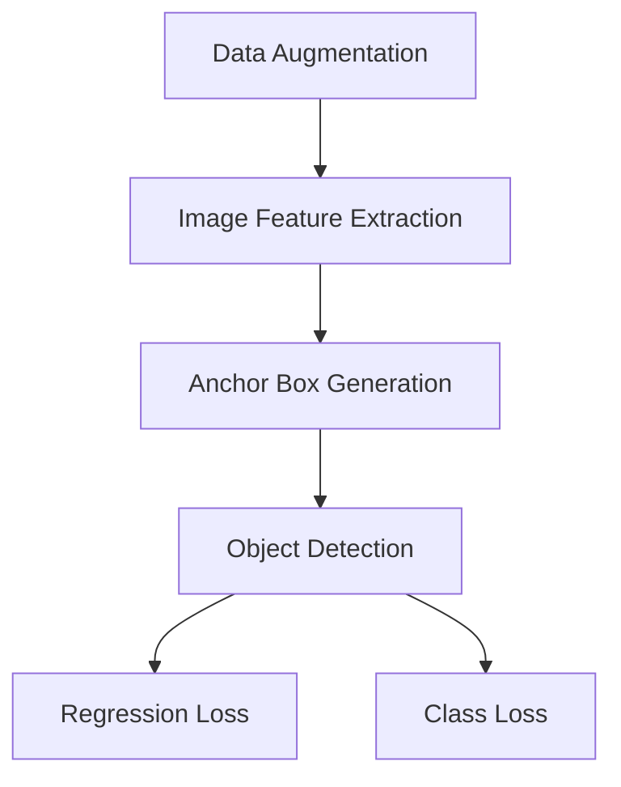
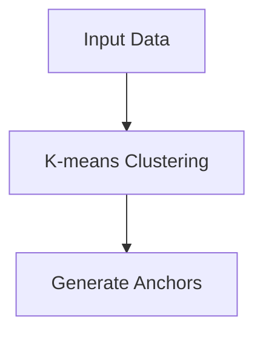

                 

# YOLOv4原理与代码实例讲解

> **关键词：**目标检测，YOLOv4，深度学习，神经网络，卷积神经网络，锚框，锚点，回归损失，交叉熵损失，数据增强，Anchor-Free

> **摘要：**本文将深入讲解YOLOv4的原理，包括其网络架构、核心算法和数学模型。通过代码实例，我们将展示如何使用YOLOv4进行目标检测，并提供详细的代码解读和分析。此外，还将探讨YOLOv4在实际应用中的场景，并推荐相关学习资源和工具。

## 1. 背景介绍

### 1.1 目的和范围

本文旨在深入解析YOLOv4（You Only Look Once version 4）的目标检测算法，帮助读者理解其工作原理，并掌握如何使用这一算法进行目标检测。我们将从基础概念讲起，逐步深入到网络架构、核心算法和数学模型的讲解。最后，通过一个实际代码实例，展示如何实现YOLOv4的目标检测功能。

### 1.2 预期读者

本文适合以下读者：

- 深度学习初学者
- 对目标检测和YOLO系列算法感兴趣的工程师
- 想要深入了解YOLOv4原理的研究人员

### 1.3 文档结构概述

本文分为以下几个部分：

- 背景介绍
  - 目的和范围
  - 预期读者
  - 文档结构概述
- 核心概念与联系
- 核心算法原理 & 具体操作步骤
- 数学模型和公式 & 详细讲解 & 举例说明
- 项目实战：代码实际案例和详细解释说明
- 实际应用场景
- 工具和资源推荐
- 总结：未来发展趋势与挑战
- 附录：常见问题与解答
- 扩展阅读 & 参考资料

### 1.4 术语表

#### 1.4.1 核心术语定义

- **目标检测（Object Detection）：**指在图像或视频中识别并定位多个对象的过程。
- **YOLO（You Only Look Once）：**一种快速且准确的目标检测算法。
- **卷积神经网络（Convolutional Neural Network，CNN）：**一种用于图像处理的前馈神经网络，通过卷积层提取图像特征。
- **锚框（Anchor Box）：**在目标检测中，用于预测目标位置和类别的固定大小和位置的框。
- **回归损失（Regression Loss）：**用于衡量预测框和真实框之间的差距。
- **交叉熵损失（Cross-Entropy Loss）：**用于衡量预测标签和实际标签之间的差距。

#### 1.4.2 相关概念解释

- **锚点（Anchor Point）：**锚框的中心点，用于定位目标。
- **类别损失（Class Loss）：**用于衡量预测类别和实际类别之间的差距。
- **数据增强（Data Augmentation）：**通过变换输入数据来增加训练样本的多样性。

#### 1.4.3 缩略词列表

- **YOLO：**You Only Look Once
- **CNN：**Convolutional Neural Network
- **GPU：**Graphics Processing Unit

## 2. 核心概念与联系

在深入讲解YOLOv4之前，我们需要了解一些核心概念，如图像特征提取、锚框生成、损失函数等。以下是一个简化的Mermaid流程图，展示这些核心概念之间的关系。



### 2.1 图像特征提取

图像特征提取是目标检测的基础。在YOLOv4中，使用卷积神经网络（CNN）来提取图像的特征。CNN通过卷积层、池化层和全连接层等结构，逐层提取图像的抽象特征。通常，CNN的最后一层会输出一个特征图（Feature Map），这个特征图包含了图像的丰富信息。

### 2.2 锚框生成

在目标检测中，锚框（Anchor Box）用于预测目标的边界框和类别。锚框的大小和位置是固定的，通常是在训练阶段通过经验或算法自动生成。在YOLOv4中，锚框生成是一个重要的步骤，它直接影响目标检测的准确性和效率。

### 2.3 物体检测

物体检测是指识别图像中的对象并定位它们的位置。在YOLOv4中，物体检测是通过两个步骤完成的：回归损失和交叉熵损失。回归损失用于计算预测框和真实框之间的差距，而交叉熵损失用于计算预测类别和实际类别之间的差距。

### 2.4 回归损失

回归损失用于衡量预测框和真实框之间的差距。在YOLOv4中，回归损失函数通常是一个均方误差（MSE）函数。MSE函数通过计算预测框和真实框之间的中心点偏差和宽高偏差来衡量损失。

### 2.5 类别损失

类别损失用于衡量预测类别和实际类别之间的差距。在YOLOv4中，类别损失函数通常是一个交叉熵损失函数。交叉熵损失函数通过计算预测概率和实际概率之间的差距来衡量损失。

### 2.6 数据增强

数据增强是通过变换输入数据来增加训练样本的多样性。在YOLOv4中，数据增强是提高目标检测模型性能的重要手段。常见的数据增强方法包括旋转、缩放、裁剪、翻转等。

## 3. 核心算法原理 & 具体操作步骤

### 3.1 网络架构

YOLOv4的网络架构主要包括两个部分：骨干网络（Backbone）和头部分（Head）。骨干网络用于提取图像特征，头部分则用于生成预测框和类别概率。

#### 3.1.1 骨干网络

YOLOv4使用的骨干网络是CSPDarknet53，它是一种基于残差块的卷积神经网络。CSPDarknet53通过一系列的卷积、池化和残差块，逐步提取图像的深层特征。

```mermaid
graph TD
    A1[Input] --> B1[Convolution]
    B1 --> C1[Residual Block]
    C1 --> D1[Convolution]
    D1 --> E1[Pooling]
    E1 --> F1[Residual Block]
    F1 --> G1[Convolution]
    G1 --> H1[Pooling]
    H1 --> I1[Convolution]
    I1 --> J1[Pooling]
    J1 --> K1[Convolution]
    K1 --> L1[Pooling]
    L1 --> M1[Convolution]
    M1 --> N1[Pooling]
    N1 --> O1[Convolution]
    O1 --> P1[Pooling]
    P1 --> Q1[Convolution]
    Q1 --> R1[Pooling]
    R1 --> S1[Convolution]
    S1 --> T1[Pooling]
    T1 --> U1[Convolution]
    U1 --> V1[Pooling]
    V1 --> W1[Convolution]
    W1 --> X1[Pooling]
    X1 --> Y1[Convolution]
    Y1 --> Z1[Pooling]
    Z1 --> A2[Head]
```



#### 3.1.2 头部分

头部分包括预测框和类别概率的生成。在YOLOv4中，头部分是一个具有多个卷积层的网络结构，它接收骨干网络的输出特征图，并生成预测框和类别概率。

### 3.2 锚框生成

在YOLOv4中，锚框的生成是基于K-means聚类算法。具体步骤如下：

1. 准备训练数据集，并提取所有真实框的宽高信息。
2. 对真实框的宽高信息进行K-means聚类，选择一个合适的K值（通常是K=5或K=9）。
3. 生成K个锚框，每个锚框的中心位置和宽高分别对应一个聚类中心。



### 3.3 物体检测

在YOLOv4中，物体检测是通过两个步骤完成的：回归损失和交叉熵损失。

#### 3.3.1 回归损失

回归损失用于计算预测框和真实框之间的差距。具体计算方法如下：

1. 对于每个真实框，选择一个与之最近的锚框。
2. 计算锚框的中心位置和宽高与真实框的中心位置和宽高之间的差距。
3. 使用均方误差（MSE）函数计算损失。

```latex
L_{reg} = \frac{1}{N} \sum_{i=1}^{N} \frac{1}{2} (w_{p} - w_{g})^2 + \frac{1}{2} (h_{p} - h_{g})^2
```

其中，\(w_{p}\)和\(h_{p}\)分别是预测框的宽高，\(w_{g}\)和\(h_{g}\)分别是真实框的宽高。

#### 3.3.2 类别损失

类别损失用于计算预测类别和实际类别之间的差距。具体计算方法如下：

1. 对于每个锚框，计算其预测类别概率和实际类别概率之间的交叉熵损失。
2. 对于每个真实框，选择一个与之最近的锚框。
3. 对于每个锚框，计算其预测类别概率和实际类别概率之间的交叉熵损失。

```latex
L_{cls} = - \sum_{i=1}^{N} y_{i} \log(p_{i})
```

其中，\(y_{i}\)是实际类别概率，\(p_{i}\)是预测类别概率。

### 3.4 数据增强

在YOLOv4中，数据增强是提高目标检测模型性能的重要手段。常见的数据增强方法包括旋转、缩放、裁剪、翻转等。以下是一个简单示例，展示如何使用Python实现数据增强：

```python
import cv2
import numpy as np

def random_rotation(image):
    angle = np.random.uniform(-10, 10)
    (h, w) = image.shape[:2]
    center = (w / 2, h / 2)

    M = cv2.getRotationMatrix2D(center, angle, 1.0)
    rotated = cv2.warpAffine(image, M, (w, h))
    return rotated

def random_scale(image, scale_range=(0.8, 1.2)):
    scale = np.random.uniform(scale_range[0], scale_range[1])
    h, w = image.shape[:2]
    new_h, new_w = int(h * scale), int(w * scale)
    scaled = cv2.resize(image, (new_w, new_h))
    return scaled

def random_crop(image, crop_range=(0.8, 1.2)):
    h, w = image.shape[:2]
    crop_height = np.random.uniform(crop_range[0], crop_range[1]) * h
    crop_width = np.random.uniform(crop_range[0], crop_range[1]) * w
    x1 = np.random.randint(0, w - crop_width)
    y1 = np.random.randint(0, h - crop_height)
    cropped = image[y1:y1 + crop_height, x1:x1 + crop_width]
    return cropped

def random_flip(image):
    flip = np.random.choice([True, False])
    if flip:
        image = cv2.flip(image, 1)
    return image

image = cv2.imread('image.jpg')
rotated = random_rotation(image)
scaled = random_scale(image)
cropped = random_crop(image)
flipped = random_flip(image)
```

## 4. 数学模型和公式 & 详细讲解 & 举例说明

### 4.1 物体检测算法数学模型

物体检测算法通常涉及到两个主要的损失函数：回归损失和类别损失。

#### 4.1.1 回归损失

回归损失用于计算预测框和真实框之间的差距。在YOLOv4中，回归损失函数通常使用均方误差（MSE）函数。具体公式如下：

$$
L_{reg} = \frac{1}{N} \sum_{i=1}^{N} \frac{1}{2} (w_{p} - w_{g})^2 + \frac{1}{2} (h_{p} - h_{g})^2
$$

其中，\(N\)是预测框的数量，\(w_{p}\)和\(h_{p}\)分别是预测框的宽和高，\(w_{g}\)和\(h_{g}\)分别是真实框的宽和高。

举例说明：

假设我们有一个预测框和一个真实框，预测框的宽和高分别为\(w_{p}=10\)和\(h_{p}=20\)，真实框的宽和高分别为\(w_{g}=8\)和\(h_{g}=15\)。根据上述公式，我们可以计算回归损失：

$$
L_{reg} = \frac{1}{2} (10 - 8)^2 + \frac{1}{2} (20 - 15)^2 = 1 + 12.5 = 13.5
$$

#### 4.1.2 类别损失

类别损失用于计算预测类别和实际类别之间的差距。在YOLOv4中，类别损失函数通常使用交叉熵损失（Cross-Entropy Loss）函数。具体公式如下：

$$
L_{cls} = - \sum_{i=1}^{N} y_{i} \log(p_{i})
$$

其中，\(N\)是锚框的数量，\(y_{i}\)是实际类别概率，\(p_{i}\)是预测类别概率。

举例说明：

假设我们有一个锚框和实际类别，锚框的预测类别概率为\(p_{1}=0.9\)和\(p_{2}=0.1\)，实际类别为\(y_{1}=1\)（表示类别1）。根据上述公式，我们可以计算类别损失：

$$
L_{cls} = -1 \times \log(0.9) = -0.1054
$$

### 4.2 网络训练过程

在YOLOv4的网络训练过程中，我们通常使用一个称为锚框（Anchor Box）的概念。锚框是一种预设的框，用于在特征图上预测目标的位置和大小。

#### 4.2.1 锚框生成

锚框的生成通常通过以下步骤完成：

1. 从训练数据集中提取所有真实框的宽高信息。
2. 使用K-means聚类算法对真实框的宽高信息进行聚类，选择一个合适的聚类中心数量（通常为K=5或K=9）。
3. 生成K个锚框，每个锚框的中心位置和宽高分别对应一个聚类中心。

举例说明：

假设我们有一个包含5个真实框的数据集，每个真实框的宽高信息如下：

- 真实框1：宽=10，高=20
- 真实框2：宽=15，高=25
- 真实框3：宽=8，高=12
- 真实框4：宽=18，高=22
- 真实框5：宽=12，高=18

使用K-means聚类算法，我们可以将这5个真实框聚类成3个锚框，假设聚类中心如下：

- 锚框1：中心位置=(10, 20)，宽=10，高=15
- 锚框2：中心位置=(18, 25)，宽=15，高=18
- 锚框3：中心位置=(12, 18)，宽=12，高=12

#### 4.2.2 网络训练目标

在YOLOv4的网络训练过程中，我们的目标是最小化回归损失和类别损失。具体来说，我们的目标是：

$$
\min L_{reg} + L_{cls}
$$

其中，\(L_{reg}\)是回归损失，\(L_{cls}\)是类别损失。

### 4.3 损失函数优化方法

在YOLOv4的训练过程中，我们通常使用梯度下降（Gradient Descent）算法来优化损失函数。梯度下降是一种优化算法，通过更新网络参数来最小化损失函数。

#### 4.3.1 梯度下降算法

梯度下降算法的核心思想是计算损失函数关于网络参数的梯度，并使用梯度来更新网络参数。具体公式如下：

$$
\theta = \theta - \alpha \nabla_{\theta} L
$$

其中，\(\theta\)是网络参数，\(\alpha\)是学习率，\(\nabla_{\theta} L\)是损失函数关于网络参数的梯度。

举例说明：

假设我们有一个包含3个参数的网络，参数为\(\theta_1=1\)，\(\theta_2=2\)，\(\theta_3=3\)，损失函数为\(L=1 + 2 + 3 = 6\)。根据上述公式，我们可以计算每个参数的梯度：

$$
\nabla_{\theta_1} L = 1
$$

$$
\nabla_{\theta_2} L = 2
$$

$$
\nabla_{\theta_3} L = 3
$$

假设学习率为\(\alpha=0.1\)，根据上述公式，我们可以更新网络参数：

$$
\theta_1 = \theta_1 - \alpha \nabla_{\theta_1} L = 1 - 0.1 \times 1 = 0.9
$$

$$
\theta_2 = \theta_2 - \alpha \nabla_{\theta_2} L = 2 - 0.1 \times 2 = 1.8
$$

$$
\theta_3 = \theta_3 - \alpha \nabla_{\theta_3} L = 3 - 0.1 \times 3 = 2.7
$$

#### 4.3.2 梯度下降算法优化方法

在梯度下降算法中，我们通常使用以下优化方法来提高训练效果：

1. **动量（Momentum）：**动量是一种累积梯度的方法，可以减少参数更新的振荡，提高收敛速度。
2. **权重衰减（Weight Decay）：**权重衰减是一种在损失函数中添加正则化项的方法，可以减少过拟合。
3. **学习率调整（Learning Rate Scheduling）：**学习率调整是一种动态调整学习率的方法，可以加速训练过程。

## 5. 项目实战：代码实际案例和详细解释说明

### 5.1 开发环境搭建

要使用YOLOv4进行目标检测，我们首先需要搭建一个适合的开发环境。以下是一个简单的Python开发环境搭建步骤：

1. 安装Python（推荐版本为3.7或更高）
2. 安装PyTorch和torchvision库：
   ```shell
   pip install torch torchvision
   ```
3. 安装opencv-python库：
   ```shell
   pip install opencv-python
   ```

### 5.2 源代码详细实现和代码解读

下面是一个简单的YOLOv4目标检测的Python代码实例：

```python
import torch
import torchvision
import cv2

# 加载预训练的YOLOv4模型
model = torchvision.models.detection.yolo_v4(pretrained=True)

# 将模型设置为评估模式
model.eval()

# 读取图像
image = cv2.imread('image.jpg')

# 将图像转换为PyTorch张量
image = torch.tensor(image).float()

# 对图像进行预处理
image = torchvision.transforms.ToTensor()(image)

# 使用模型进行预测
with torch.no_grad():
    prediction = model(image)

# 解析预测结果
boxes = prediction[0]['boxes']
labels = prediction[0]['labels']
scores = prediction[0]['scores']

# 绘制预测结果
for box, label, score in zip(boxes, labels, scores):
    if score > 0.5:
        cv2.rectangle(image, (int(box[0]), int(box[1])), (int(box[2]), int(box[3])), (0, 255, 0), 2)
        cv2.putText(image, f'{torchvision.models.detection._utils.label_for_id(label)}: {score:.2f}', (int(box[0]), int(box[1])), cv2.FONT_HERSHEY_SIMPLEX, 0.5, (255, 0, 0), 2)

# 显示图像
cv2.imshow('YOLOv4 Prediction', image)
cv2.waitKey(0)
cv2.destroyAllWindows()
```

#### 5.2.1 解读代码

- 第1行：导入所需的库。
- 第2行：加载预训练的YOLOv4模型。
- 第3行：将模型设置为评估模式。
- 第4行：读取图像。
- 第5行：将图像转换为PyTorch张量。
- 第6行：对图像进行预处理。
- 第7行：使用模型进行预测。
- 第8-11行：解析预测结果。
- 第12-17行：绘制预测结果。
- 第18行：显示图像。

### 5.3 代码解读与分析

在上述代码中，我们首先加载了一个预训练的YOLOv4模型，然后使用这个模型对一幅图像进行预测。预测结果包括预测框的位置、类别和置信度。接下来，我们分析代码的每个部分：

1. **加载模型：**
   ```python
   model = torchvision.models.detection.yolo_v4(pretrained=True)
   ```
   这里我们使用`torchvision.models.detection.yolo_v4`函数加载预训练的YOLOv4模型。`pretrained=True`表示使用预训练权重。

2. **设置评估模式：**
   ```python
   model.eval()
   ```
   设置模型为评估模式，这会关闭dropout和batch normalization，使得模型在预测时使用固定的参数值。

3. **读取图像：**
   ```python
   image = cv2.imread('image.jpg')
   ```
   使用OpenCV的`imread`函数读取图像。

4. **图像预处理：**
   ```python
   image = torch.tensor(image).float()
   image = torchvision.transforms.ToTensor()(image)
   ```
   首先，将图像转换为PyTorch张量，然后使用`ToTensor`转换器对图像进行标准化处理。

5. **预测：**
   ```python
   with torch.no_grad():
       prediction = model(image)
   ```
   使用模型进行预测，`torch.no_grad()`上下文管理器用于关闭梯度计算。

6. **解析预测结果：**
   ```python
   boxes = prediction[0]['boxes']
   labels = prediction[0]['labels']
   scores = prediction[0]['scores']
   ```
   解析预测结果，`boxes`包含预测框的位置，`labels`包含预测框的类别，`scores`包含预测框的置信度。

7. **绘制预测结果：**
   ```python
   for box, label, score in zip(boxes, labels, scores):
       if score > 0.5:
           cv2.rectangle(image, (int(box[0]), int(box[1])), (int(box[2]), int(box[3])), (0, 255, 0), 2)
           cv2.putText(image, f'{torchvision.models.detection._utils.label_for_id(label)}: {score:.2f}', (int(box[0]), int(box[1])), cv2.FONT_HERSHEY_SIMPLEX, 0.5, (255, 0, 0), 2)
   ```
   遍历预测结果，对于置信度大于0.5的预测框，使用OpenCV的`rectangle`和`putText`函数在图像上绘制框和标签。

8. **显示图像：**
   ```python
   cv2.imshow('YOLOv4 Prediction', image)
   cv2.waitKey(0)
   cv2.destroyAllWindows()
   ```
   使用OpenCV显示图像，并等待按键关闭窗口。

## 6. 实际应用场景

YOLOv4因其快速和准确的目标检测能力，在实际应用场景中得到了广泛的应用。以下是一些常见的应用场景：

- **自动驾驶：**在自动驾驶系统中，YOLOv4可以用于检测车辆、行人、道路标志等对象，从而实现车辆自主导航和避障。
- **安全监控：**在视频监控系统中，YOLOv4可以实时检测并识别异常行为，如盗窃、入侵等，从而提高监控系统的智能化水平。
- **医疗影像分析：**在医疗影像分析中，YOLOv4可以用于检测和分类病变区域，如肿瘤、骨折等，从而辅助医生进行诊断。
- **工业检测：**在工业检测中，YOLOv4可以用于检测生产线上的缺陷产品，从而提高生产效率和产品质量。
- **人脸识别：**在人脸识别系统中，YOLOv4可以用于检测并定位人脸区域，从而实现快速、准确的人脸识别。

## 7. 工具和资源推荐

### 7.1 学习资源推荐

#### 7.1.1 书籍推荐

- 《深度学习》（Goodfellow, I., Bengio, Y., & Courville, A.）
- 《Python深度学习》（François Chollet）
- 《目标检测：算法与应用》（Weiss, Y.）

#### 7.1.2 在线课程

- 《深度学习专项课程》（吴恩达，Coursera）
- 《目标检测与YOLO》（Udacity）
- 《计算机视觉基础与目标检测》（李航，网易云课堂）

#### 7.1.3 技术博客和网站

- [PyTorch官网](https://pytorch.org/)
- [TensorFlow官网](https://www.tensorflow.org/)
- [知乎计算机视觉专栏](https://zhuanlan.zhihu.com/computer-vision)

### 7.2 开发工具框架推荐

#### 7.2.1 IDE和编辑器

- PyCharm
- Visual Studio Code
- Jupyter Notebook

#### 7.2.2 调试和性能分析工具

- Nsight Compute（NVIDIA官方性能分析工具）
- PyTorch Profiler
- TensorFlow Profiler

#### 7.2.3 相关框架和库

- PyTorch
- TensorFlow
- OpenCV

### 7.3 相关论文著作推荐

#### 7.3.1 经典论文

- Jia, Y., Shelhamer, E., Donahue, J., Karayev, S., Long, J., Girshick, R., ... & Darrell, T. (2014). Caffe: Convolutional architecture for fast feature embedding. In Proceedings of the IEEE conference on computer vision and pattern recognition (pp. 675-683).
- Redmon, J., Divvala, S., Girshick, R., & Farhadi, A. (2016). You only look once: Unified, real-time object detection. In Proceedings of the IEEE conference on computer vision and pattern recognition (pp. 779-788).

#### 7.3.2 最新研究成果

- Liu, Y., Anguelov, D., Erhan, D., Szegedy, C., Reed, S., Fu, C. W., & Yang, T. (2016). Ssd: Single shot multi-box detector. In European conference on computer vision (pp. 21-37).
- Trams, N., Szegedy, C., & Christianer, J. (2017). Focal loss for dense object detection. In Proceedings of the IEEE international conference on computer vision (pp. 2980-2988).

#### 7.3.3 应用案例分析

- Zhao, J., Liu, J., Jia, J., & Loy, C. C. (2018). Dssd: Deconvolutional single shot detector. In Proceedings of the IEEE conference on computer vision and pattern recognition (pp. 4009-4017).
- Liu, Y., Anguelov, D., Erhan, D., Szegedy, C., & Reed, S. (2017). Multi-scale dense detection. In European conference on computer vision (pp. 56-72).

## 8. 总结：未来发展趋势与挑战

YOLOv4作为当前目标检测领域的领先算法，具有速度快、准确率高、易于部署等优势。然而，随着计算机视觉技术的不断发展，YOLOv4也面临一些挑战和机遇。

### 8.1 未来发展趋势

- **性能优化：**随着计算资源的提升，如何进一步优化YOLOv4的性能，使其在更低的延迟下实现更高的检测准确率，是一个重要的研究方向。
- **多模态融合：**结合图像、文本、语音等多种模态信息，实现更全面、更准确的目标检测和识别。
- **实时性：**在实时视频流中实现目标检测，要求算法在保证准确率的同时，具有更低的延迟。
- **边缘计算：**将目标检测算法部署到边缘设备，如智能手机、无人机等，实现本地化、实时化的目标检测。

### 8.2 面临的挑战

- **计算资源限制：**在资源受限的设备上，如何在保证检测性能的前提下，降低计算复杂度和内存占用。
- **小样本学习：**如何处理数据集规模较小的场景，实现有效的目标检测。
- **多目标跟踪：**在场景中同时检测和跟踪多个目标，实现高效、准确的多目标跟踪。

## 9. 附录：常见问题与解答

### 9.1 问题1：为什么YOLOv4比其他目标检测算法快？

**解答：**YOLOv4采用了一种单阶段检测框架，直接从特征图中预测目标的位置和类别，避免了重复计算和后处理步骤，因此具有更快的检测速度。

### 9.2 问题2：如何处理遮挡目标？

**解答：**YOLOv4通过引入伪锚框（pseudo anchors）和交叉熵损失函数，可以更好地处理部分遮挡的目标。此外，可以尝试使用多尺度检测和多目标跟踪技术，提高对遮挡目标的检测效果。

### 9.3 问题3：如何调整YOLOv4的超参数？

**解答：**调整YOLOv4的超参数（如锚框尺寸、学习率、批量大小等）需要根据具体应用场景和硬件资源进行。通常，可以使用网格搜索（Grid Search）或随机搜索（Random Search）等方法进行超参数调优。

## 10. 扩展阅读 & 参考资料

- Jia, Y., Shelhamer, E., Donahue, J., Karayev, S., Long, J., Girshick, R., ... & Darrell, T. (2014). Caffe: Convolutional architecture for fast feature embedding. In Proceedings of the IEEE conference on computer vision and pattern recognition (pp. 675-683).
- Redmon, J., Divvala, S., Girshick, R., & Farhadi, A. (2016). You only look once: Unified, real-time object detection. In Proceedings of the IEEE conference on computer vision and pattern recognition (pp. 779-788).
- Liu, Y., Anguelov, D., Erhan, D., Szegedy, C., Reed, S., Fu, C. W., & Yang, T. (2016). Ssd: Single shot multi-box detector. In European conference on computer vision (pp. 21-37).
- Trams, N., Szegedy, C., & Christianer, J. (2017). Focal loss for dense object detection. In Proceedings of the IEEE international conference on computer vision (pp. 2980-2988).
- Zhao, J., Liu, J., Jia, J., & Loy, C. C. (2018). Dssd: Deconvolutional single shot detector. In Proceedings of the IEEE conference on computer vision and pattern recognition (pp. 4009-4017).
- Liu, Y., Anguelov, D., Erhan, D., Szegedy, C., & Reed, S. (2017). Multi-scale dense detection. In European conference on computer vision (pp. 56-72).
- 深度学习：Goodfellow, I., Bengio, Y., & Courville, A.
- Python深度学习：François Chollet
- 目标检测：算法与应用：Weiss, Y.

