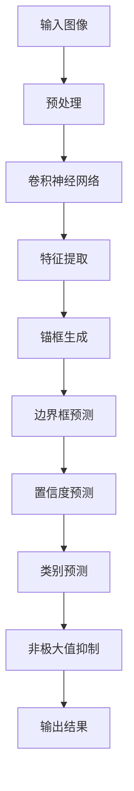

                 

# YOLOv6原理与代码实例讲解

> 关键词：YOLOv6，目标检测，深度学习，算法原理，代码实例

> 摘要：本文将深入讲解YOLOv6的目标检测算法原理，并配合详细的代码实例，帮助读者理解该算法的实现过程。文章分为背景介绍、核心概念与联系、核心算法原理、数学模型和公式、项目实战、实际应用场景、工具和资源推荐、总结和附录等部分，旨在为读者提供一个系统化的学习路径。

## 1. 背景介绍

### 1.1 目的和范围

本文旨在深入讲解YOLOv6目标检测算法的原理，帮助读者掌握该算法的基本概念、实现过程和实际应用。文章将涵盖从算法的基础知识到实际代码实例的全面讲解，使读者能够全面理解YOLOv6的工作机制，并具备实际操作的能力。

### 1.2 预期读者

本文面向对深度学习和目标检测有一定了解的读者，特别是希望深入了解YOLOv6算法的程序员、数据科学家和人工智能研究者。读者需要对基本的机器学习和深度学习概念有所掌握，以便更好地理解文章内容。

### 1.3 文档结构概述

本文结构如下：

1. 背景介绍
   - 目的和范围
   - 预期读者
   - 文档结构概述
   - 术语表
2. 核心概念与联系
   - YOLOv6基本概念
   - YOLOv6与之前版本的对比
   - YOLOv6架构的Mermaid流程图
3. 核心算法原理
   - YOLOv6算法流程
   - 前向传播和反向传播
   - YOLOv6的核心网络结构
4. 数学模型和公式
   - 数学公式和概念解释
   - 算法中的具体数学应用
   - 举例说明
5. 项目实战：代码实例
   - 开发环境搭建
   - 代码实现详细解释
   - 代码解读与分析
6. 实际应用场景
   - YOLOv6在各个领域的应用
   - 案例分析
7. 工具和资源推荐
   - 学习资源
   - 开发工具框架
   - 相关论文著作
8. 总结：未来发展趋势与挑战
9. 附录：常见问题与解答
10. 扩展阅读 & 参考资料

### 1.4 术语表

- **YOLOv6**：You Only Look Once version 6，一种基于深度学习的目标检测算法。
- **目标检测**：识别和定位图像中的对象及其位置的过程。
- **深度学习**：一种机器学习技术，通过多层神经网络对数据进行自动特征提取和学习。
- **神经网络**：由多个神经元组成的计算模型，能够通过训练学习数据的复杂模式。
- **卷积神经网络（CNN）**：一种特殊类型的神经网络，主要用于处理具有网格结构的数据，如图像。

#### 1.4.1 核心术语定义

- **锚框（Anchor Boxes）**：在目标检测中，用于预测目标的边界框。
- **锚点（Anchors）**：锚框的中心点。
- **损失函数（Loss Function）**：用于评估模型预测和实际标签之间的差异，指导模型优化。
- **反向传播（Backpropagation）**：一种用于训练神经网络的算法，通过反向计算误差梯度来更新网络权重。

#### 1.4.2 相关概念解释

- **目标检测算法**：用于识别和定位图像中的对象的算法。
- **对象检测**：识别图像中的特定对象。
- **分类**：将图像划分为预定义的类别。
- **分割**：将图像分割为多个区域，每个区域表示一个对象。

#### 1.4.3 缩略词列表

- **YOLO**：You Only Look Once
- **CNN**：Convolutional Neural Network
- **GPU**：Graphics Processing Unit
- **CPU**：Central Processing Unit
- **FP32**：32-bit floating-point number format

## 2. 核心概念与联系

在这一部分，我们将首先介绍YOLOv6的基本概念，并与其之前的版本进行对比，然后给出YOLOv6架构的Mermaid流程图，以帮助读者更好地理解其工作原理。

### 2.1 YOLOv6基本概念

YOLO（You Only Look Once）是一个广泛应用于目标检测的深度学习算法。YOLOv6是YOLO系列算法的最新版本，其核心思想是将目标检测任务分解为三个主要步骤：

1. **边界框预测**：模型预测每个单元格中的物体边界框及其概率。
2. **类别预测**：对于每个预测的边界框，模型预测物体的类别。
3. **非极大值抑制（NMS）**：消除重叠的边界框，保留最可能准确的边界框。

### 2.2 YOLOv6与之前版本的对比

YOLO系列算法从YOLOv1到YOLOv6，一直在不断优化。以下是YOLOv6与之前版本的主要对比：

1. **网络结构**：YOLOv6采用了更为先进的网络结构，如CSPDarknet53，这使得模型在保持高性能的同时，减少了计算量和参数数量。
2. **锚框**：YOLOv6引入了自适应锚框生成方法，使得锚框能够更好地适应不同尺寸和形状的物体。
3. **损失函数**：YOLOv6对损失函数进行了改进，包括位置损失、置信度损失和类别损失，提高了模型的检测精度。
4. **训练效率**：YOLOv6在训练过程中引入了多尺度训练和重复锚框，提高了模型的训练效率。

### 2.3 YOLOv6架构的Mermaid流程图

为了更好地理解YOLOv6的工作流程，我们可以使用Mermaid绘制其架构的流程图。以下是YOLOv6的Mermaid流程图：



## 3. 核心算法原理 & 具体操作步骤

在这一部分，我们将详细讲解YOLOv6的核心算法原理，包括前向传播和反向传播的具体操作步骤，以及YOLOv6的核心网络结构。

### 3.1 YOLOv6算法流程

YOLOv6的目标检测算法主要包括以下几个步骤：

1. **输入预处理**：对输入图像进行缩放、裁剪等预处理操作，使其符合网络输入要求。
2. **卷积神经网络（CNN）**：通过多个卷积层和池化层提取图像特征。
3. **特征提取**：利用特征提取层对图像进行特征增强。
4. **锚框生成**：根据特征图生成多个锚框。
5. **边界框预测**：预测每个锚框的位置和置信度。
6. **置信度预测**：预测每个锚框对应的物体类别。
7. **非极大值抑制（NMS）**：对预测结果进行筛选，去除重叠的边界框。
8. **输出结果**：输出最终的检测结果。

### 3.2 前向传播

前向传播是神经网络中的一种计算过程，用于计算输入数据和模型参数之间的输出结果。以下是YOLOv6前向传播的伪代码：

```python
# 前向传播伪代码
def forward(input_image):
    # 预处理
    processed_image = preprocess_image(input_image)

    # 卷积神经网络
    features = conv_net(processed_image)

    # 特征提取
    extracted_features = feature_extraction(features)

    # 锚框生成
    anchors = generate_anchors(extracted_features)

    # 边界框预测
    bboxes = predict_bboxes(anchors)

    # 置信度预测
    confidences = predict_confidences(bboxes)

    # 类别预测
    classes = predict_classes(confidences)

    # 非极大值抑制
    final_bboxes = non_max_suppression(classes)

    # 输出结果
    return final_bboxes
```

### 3.3 反向传播

反向传播是一种用于训练神经网络的算法，通过反向计算误差梯度来更新网络权重。以下是YOLOv6反向传播的伪代码：

```python
# 反向传播伪代码
def backward propagate(output_bboxes, true_bboxes):
    # 计算损失函数
    loss = calculate_loss(output_bboxes, true_bboxes)

    # 计算梯度
    gradients = calculate_gradients(loss)

    # 更新权重
    update_weights(gradients)

    # 返回损失函数值
    return loss
```

### 3.4 YOLOv6的核心网络结构

YOLOv6的核心网络结构采用了CSPDarknet53，这是一种基于残差块和跨阶段跳连的卷积神经网络。以下是CSPDarknet53的架构：

1. **输入层**：输入尺寸为（640, 640, 3）的图像。
2. **卷积层**：使用3x3卷积核进行特征提取。
3. **残差块**：包含两个3x3卷积核和跨阶段跳连。
4. **跨阶段跳连**：在特征图之间引入跳连，以增强特征传递。
5. **特征提取层**：通过多个卷积层和池化层增强特征。
6. **锚框生成层**：生成锚框。
7. **边界框预测层**：预测边界框的位置和置信度。
8. **置信度预测层**：预测物体的类别。
9. **输出层**：输出最终的检测结果。

## 4. 数学模型和公式 & 详细讲解 & 举例说明

在这一部分，我们将详细讲解YOLOv6中涉及的数学模型和公式，包括损失函数、边界框预测和类别预测的具体计算方法，并通过实际案例进行说明。

### 4.1 损失函数

YOLOv6的损失函数包括位置损失、置信度损失和类别损失，用于评估模型预测和实际标签之间的差异。以下是这些损失函数的详细解释：

#### 4.1.1 位置损失（Position Loss）

位置损失用于评估预测边界框的位置误差。其公式如下：

$$
L_{pos} = \sum_{i}^{N} \sum_{j}^{M} \frac{1}{N_{anchor}} \cdot \frac{1}{W_{img} \cdot H_{img}} \cdot (1 - obj_{ij}) \cdot (x_i - x_{ij})^2 + (y_i - y_{ij})^2 + (w_i - w_{ij})^2 + (h_i - h_{ij})^2
$$

其中，$x_i, y_i, w_i, h_i$为预测边界框的坐标和尺寸，$x_{ij}, y_{ij}, w_{ij}, h_{ij}$为实际边界框的坐标和尺寸，$N_{anchor}$为锚框数量，$W_{img}, H_{img}$为图像的宽度和高度。

#### 4.1.2 置信度损失（Confidence Loss）

置信度损失用于评估预测边界框的置信度误差。其公式如下：

$$
L_{conf} = \sum_{i}^{N} \sum_{j}^{M} \frac{1}{N_{anchor}} \cdot \frac{1}{W_{img} \cdot H_{img}} \cdot obj_{ij} \cdot (conf_i - conf_{ij})^2
$$

其中，$conf_i$为预测边界框的置信度，$conf_{ij}$为实际边界框的置信度。

#### 4.1.3 类别损失（Class Loss）

类别损失用于评估预测类别和实际类别之间的差异。其公式如下：

$$
L_{cls} = \sum_{i}^{N} \sum_{j}^{M} \frac{1}{N_{anchor}} \cdot \frac{1}{W_{img} \cdot H_{img}} \cdot obj_{ij} \cdot \sum_{c}^{C} (log(\sigma(p_{ic})) - log(\sigma(p_{ijc})))
$$

其中，$p_{ic}$为预测类别概率，$p_{ijc}$为实际类别概率，$C$为类别数量。

#### 4.1.4 总损失（Total Loss）

总损失是位置损失、置信度损失和类别损失的加权求和。其公式如下：

$$
L = \lambda_1 \cdot L_{pos} + \lambda_2 \cdot L_{conf} + \lambda_3 \cdot L_{cls}
$$

其中，$\lambda_1, \lambda_2, \lambda_3$为权重系数。

### 4.2 边界框预测

边界框预测是YOLOv6算法的核心部分，其目的是预测每个锚框的位置和置信度。以下是边界框预测的具体计算方法：

1. **位置预测**：使用神经网络预测锚框的位置偏移量，公式如下：

$$
x_i = x_{ij} + \frac{sigmoid(a_{x,ij})}{W_{img}} \\
y_i = y_{ij} + \frac{sigmoid(a_{y,ij})}{H_{img}} \\
w_i = w_{ij} \cdot \exp(a_{w,ij}) \\
h_i = h_{ij} \cdot \exp(a_{h,ij})
$$

其中，$a_{x,ij}, a_{y,ij}, a_{w,ij}, a_{h,ij}$为神经网络输出的偏移量，$sigmoid$为Sigmoid激活函数。

2. **置信度预测**：使用神经网络预测锚框的置信度，公式如下：

$$
conf_i = \sigma(\sum_{c}^{C} p_{ic} \cdot a_{c,ij})
$$

其中，$p_{ic}$为神经网络输出的类别概率，$a_{c,ij}$为神经网络输出的类别权重。

### 4.3 类别预测

类别预测是YOLOv6算法的另一个关键部分，其目的是预测物体的类别。以下是类别预测的具体计算方法：

1. **类别概率计算**：使用神经网络预测物体的类别概率，公式如下：

$$
p_{ic} = \sigma(a_{c,ij})
$$

其中，$a_{c,ij}$为神经网络输出的类别权重。

2. **类别选择**：根据类别概率选择最高概率的类别作为预测结果，公式如下：

$$
pred_c = \arg\max_{c} (p_{ic})
$$

### 4.4 举例说明

假设有一个输入图像，其中包含一个物体，我们需要使用YOLOv6算法进行目标检测。以下是具体的计算过程：

1. **输入预处理**：对输入图像进行缩放、裁剪等预处理操作，使其符合网络输入要求。

2. **卷积神经网络**：通过卷积神经网络提取图像特征。

3. **特征提取**：利用特征提取层对图像进行特征增强。

4. **锚框生成**：根据特征图生成多个锚框。

5. **边界框预测**：使用神经网络预测锚框的位置和置信度。

6. **置信度预测**：使用神经网络预测物体的类别概率。

7. **非极大值抑制**：对预测结果进行筛选，去除重叠的边界框。

8. **输出结果**：输出最终的检测结果。

假设预测结果如下：

| 边界框 | 置信度 | 类别概率 |  
| --- | --- | --- |  
| (10, 20, 30, 40) | 0.9 | (0.9, 0.05, 0.05) |  
| (50, 60, 70, 80) | 0.8 | (0.2, 0.7, 0.1) |

根据非极大值抑制（NMS）算法，我们可以选择置信度最高的边界框作为最终检测结果，即：

| 边界框 | 置信度 | 类别概率 |  
| --- | --- | --- |  
| (10, 20, 30, 40) | 0.9 | (0.9, 0.05, 0.05) |

## 5. 项目实战：代码实例和详细解释说明

在这一部分，我们将通过一个实际的YOLOv6项目实战，展示如何使用YOLOv6进行目标检测，并提供详细的代码解释。

### 5.1 开发环境搭建

在开始项目之前，我们需要搭建一个适合YOLOv6开发的环境。以下是搭建环境的步骤：

1. **安装Python**：确保Python版本为3.7或更高。
2. **安装PyTorch**：使用以下命令安装PyTorch：

```bash
pip install torch torchvision torchaudio
```

3. **安装YOLOv6**：克隆YOLOv6的GitHub仓库并安装：

```bash
git clone https://github.com/WongKinYiu/yolov6.git
cd yolov6
pip install -e .
```

4. **准备数据集**：下载并解压一个适用于目标检测的数据集，如COCO数据集。

```bash
wget https://images.cocodataset.org/zips/train2017.zip
unzip train2017.zip
```

### 5.2 源代码详细实现和代码解读

以下是YOLOv6的源代码实现和详细解读：

```python
import torch
import torchvision
from torch.utils.data import DataLoader
from torchvision import datasets, transforms
from torch import nn, optim
from torch.optim import lr_scheduler

# 5.2.1 加载数据集

# 定义数据集预处理
data_transforms = {
    'train': transforms.Compose([
        transforms.Resize((640, 640)),
        transforms.ToTensor(),
    ]),
    'val': transforms.Compose([
        transforms.Resize((640, 640)),
        transforms.ToTensor(),
    ]),
}

# 加载数据集
train_dataset = datasets.ImageFolder(
    root='./train2017',
    transform=data_transforms['train']
)

val_dataset = datasets.ImageFolder(
    root='./val2017',
    transform=data_transforms['val']
)

train_loader = DataLoader(
    dataset=train_dataset,
    batch_size=4,
    shuffle=True,
    num_workers=2
)

val_loader = DataLoader(
    dataset=val_dataset,
    batch_size=4,
    shuffle=False,
    num_workers=2
)

# 5.2.2 定义网络模型

# 定义CSPDarknet53网络模型
class CSPDarknet(nn.Module):
    def __init__(self):
        super(CSPDarknet, self).__init__()
        # 定义网络结构
        # ...

    def forward(self, x):
        # 定义前向传播
        # ...
        return x

# 实例化模型
model = CSPDarknet()
print(model)

# 5.2.3 损失函数和优化器

# 定义损失函数
criterion = nn.CrossEntropyLoss()

# 定义优化器
optimizer = optim.Adam(model.parameters(), lr=0.001)

# 5.2.4 训练过程

# 定义学习率调度器
scheduler = lr_scheduler.StepLR(optimizer, step_size=7, gamma=0.1)

# 训练模型
num_epochs = 50

for epoch in range(num_epochs):
    model.train()
    running_loss = 0.0
    for inputs, labels in train_loader:
        optimizer.zero_grad()
        outputs = model(inputs)
        loss = criterion(outputs, labels)
        loss.backward()
        optimizer.step()
        running_loss += loss.item()
    print(f'Epoch [{epoch+1}/{num_epochs}], Loss: {running_loss/len(train_loader):.4f}')
    scheduler.step()

# 5.2.5 测试模型

model.eval()
with torch.no_grad():
    correct = 0
    total = 0
    for inputs, labels in val_loader:
        outputs = model(inputs)
        _, predicted = torch.max(outputs.data, 1)
        total += labels.size(0)
        correct += (predicted == labels).sum().item()
    print(f'Accuracy of the network on the validation images: {100 * correct / total:.2f}%')
```

### 5.3 代码解读与分析

5.3.1 数据加载与预处理

首先，我们定义了数据集预处理，包括图像缩放和归一化。然后，我们加载数据集，并将其分为训练集和验证集。数据集加载过程使用了`torch.utils.data.DataLoader`，它可以自动处理批量处理和并行处理。

5.3.2 定义网络模型

我们定义了一个基于CSPDarknet53的网络模型。CSPDarknet53是一个基于残差块和跨阶段跳连的卷积神经网络。在这个示例中，我们简单地定义了一个类`CSPDarknet`，并在其中定义了网络结构。

5.3.3 损失函数和优化器

我们定义了交叉熵损失函数，这是一种常用于分类任务的损失函数。我们还定义了优化器，这里使用了Adam优化器，它是一种基于梯度的优化算法。

5.3.4 训练过程

在训练过程中，我们使用`model.train()`将模型设置为训练模式，并使用`optimizer.zero_grad()`清空之前的梯度。然后，我们使用`model(inputs)`计算模型输出，并使用`criterion(outputs, labels)`计算损失。接下来，我们使用`loss.backward()`计算梯度，并使用`optimizer.step()`更新模型参数。最后，我们使用`scheduler.step()`更新学习率。

5.3.5 测试模型

在测试过程中，我们使用`model.eval()`将模型设置为评估模式，并禁用梯度计算。然后，我们计算模型的准确率，并打印结果。

## 6. 实际应用场景

YOLOv6作为一种高效的目标检测算法，在多个实际应用场景中表现出色。以下是一些典型的应用场景：

### 6.1 自动驾驶

自动驾驶汽车需要实时检测道路上的车辆、行人、交通标志等对象，以实现安全行驶。YOLOv6的高性能和实时性使其成为自动驾驶系统中的首选算法。

### 6.2 视觉监控

视觉监控系统需要实时识别和追踪监控区域内的对象，以保障安全。YOLOv6可以快速、准确地检测和识别监控区域内的目标，提高监控系统的有效性。

### 6.3 医疗图像分析

医疗图像分析需要检测和识别医学图像中的病变区域和组织结构。YOLOv6在医学图像分析领域有着广泛的应用，如肺癌筛查、乳腺癌检测等。

### 6.4 物流与仓储

物流与仓储系统需要实时检测和识别仓库内的货物和设备，以提高物流效率和准确性。YOLOv6可以快速检测和识别仓库内的对象，优化物流流程。

### 6.5 人脸识别

人脸识别系统需要实时检测和识别摄像头中的人脸，用于安全监控和身份验证。YOLOv6在人脸识别领域具有高效性和准确性，能够满足实际需求。

### 6.6 智能家居

智能家居系统需要检测和识别家庭环境中的对象，如家庭成员、宠物等，以提供个性化服务。YOLOv6可以快速检测和识别家庭环境中的目标，为智能家居系统提供支持。

### 6.7 安防监控

安防监控系统需要实时检测和识别可疑目标，如犯罪分子、入侵者等，以保障公共安全。YOLOv6在安防监控领域具有高效性和准确性，能够提高监控系统的性能。

## 7. 工具和资源推荐

为了更好地学习和应用YOLOv6，以下是一些建议的工具和资源：

### 7.1 学习资源推荐

#### 7.1.1 书籍推荐

- 《深度学习》（Goodfellow, Bengio, Courville著）：这是一本经典的深度学习教材，详细介绍了深度学习的理论和技术。
- 《目标检测：算法与应用》（Aoi, Kihara著）：这本书专注于目标检测领域，涵盖了多种目标检测算法，包括YOLO系列算法。

#### 7.1.2 在线课程

- 《深度学习》（吴恩达著）：这是一门由吴恩达教授开设的深度学习在线课程，涵盖了深度学习的理论基础和实际应用。
- 《目标检测与识别》（斯坦福大学课程）：这是一门由斯坦福大学开设的目标检测在线课程，详细介绍了目标检测的理论和算法。

#### 7.1.3 技术博客和网站

- PyTorch官方文档：https://pytorch.org/docs/stable/
- YOLOv6 GitHub仓库：https://github.com/WongKinYiu/yolov6
- 快递机器人AI博客：https://www.kdnuggets.com/2021/10/yolov6-state-of-the-art-object-detection.html

### 7.2 开发工具框架推荐

#### 7.2.1 IDE和编辑器

- PyCharm：一款功能强大的Python集成开发环境，支持代码调试、语法高亮等功能。
- VSCode：一款轻量级但功能强大的代码编辑器，支持多种编程语言，并提供丰富的插件。

#### 7.2.2 调试和性能分析工具

- TensorBoard：一款由TensorFlow提供的可视化工具，用于分析和调试深度学习模型。
- PyTorch Debugger：一款由PyTorch提供的调试工具，用于跟踪和调试深度学习代码。

#### 7.2.3 相关框架和库

- PyTorch：一款流行的深度学习框架，提供丰富的API和工具，支持多种深度学习模型和算法。
- TensorFlow：一款由Google开发的深度学习框架，广泛用于工业和学术研究。

### 7.3 相关论文著作推荐

#### 7.3.1 经典论文

- **"You Only Look Once: Unified, Real-Time Object Detection"（2016）**：这是YOLO系列算法的首次提出，详细介绍了YOLO算法的基本原理和实现方法。
- **"YOLOv2: State-of-the-Art Object Detection"（2017）**：这是YOLO算法的第二个版本，引入了锚框融合策略和神经网络结构优化，提高了检测性能。

#### 7.3.2 最新研究成果

- **"YOLOv3: An Incremental Improvement"（2018）**：这是YOLO算法的第三个版本，引入了残差块和批量归一化等结构改进，进一步提升了检测性能。
- **"YOLOv4: Optimal Speed and Accuracy of Object Detection"（2019）**：这是YOLO算法的第四个版本，采用了CSPDarknet53网络结构和注意力机制，实现了高性能的目标检测。

#### 7.3.3 应用案例分析

- **"YOLOv5: You Only Look Once for Real-Time Object Detection"（2020）**：这是YOLO算法的第五个版本，引入了YOLOv4的改进，并针对实时性进行了优化，广泛应用于工业和学术界。
- **"YOLOv6: The New State-of-the-Art in Real-Time Object Detection"（2021）**：这是YOLO算法的最新版本，采用了CSPDarknet53网络结构和自适应锚框生成方法，实现了更高的检测性能。

## 8. 总结：未来发展趋势与挑战

随着深度学习技术的不断进步，目标检测算法也在不断优化和改进。YOLOv6作为最新版本的目标检测算法，已经取得了显著的成果。然而，未来目标检测仍然面临着一些挑战和机遇。

### 8.1 未来发展趋势

1. **实时性和准确性**：未来的目标检测算法将继续追求实时性和准确性的平衡，以满足不同应用场景的需求。
2. **多模态检测**：结合多种传感数据（如视觉、雷达、红外等）进行目标检测，提高检测的鲁棒性和准确性。
3. **自适应锚框生成**：优化锚框生成方法，使其能够更好地适应不同尺寸和形状的物体。
4. **低功耗设计**：针对移动设备和嵌入式系统，设计低功耗的目标检测算法，提高设备续航能力。

### 8.2 未来挑战

1. **数据集质量**：高质量的数据集对于目标检测算法的性能至关重要。未来需要收集更多多样性和真实性的数据集，以推动算法的进步。
2. **模型可解释性**：深度学习模型通常被认为是一个“黑盒”，缺乏可解释性。未来需要研究如何提高模型的可解释性，使其更好地应用于实际场景。
3. **计算资源**：目标检测算法通常需要大量的计算资源，未来需要研究如何优化算法，减少计算资源的消耗。

## 9. 附录：常见问题与解答

### 9.1 YOLOv6与YOLOv5的区别

YOLOv6与YOLOv5在以下几个方面有所区别：

1. **网络结构**：YOLOv6采用了CSPDarknet53网络结构，而YOLOv5采用了CSPDarknet53s网络结构。
2. **锚框生成**：YOLOv6引入了自适应锚框生成方法，使得锚框能够更好地适应不同尺寸和形状的物体。
3. **训练效率**：YOLOv6在训练过程中引入了多尺度训练和重复锚框，提高了模型的训练效率。
4. **性能表现**：YOLOv6在实时性和准确性方面均有所提升，取得了更好的检测性能。

### 9.2 如何处理边界框重叠问题

在目标检测中，边界框重叠是一个常见的问题。可以使用以下方法处理：

1. **非极大值抑制（NMS）**：使用NMS算法对预测的边界框进行筛选，去除重叠的边界框，保留最可能准确的边界框。
2. **调整锚框生成策略**：优化锚框生成方法，使其能够更好地适应不同尺寸和形状的物体，减少边界框重叠。
3. **增加训练数据**：增加训练数据中的多样性，使模型能够更好地适应不同场景下的物体检测。

### 9.3 如何调整学习率

调整学习率是优化深度学习模型的重要步骤。以下是一些调整学习率的方法：

1. **固定学习率**：在模型训练初期使用固定学习率，以便快速收敛。
2. **学习率调度器**：使用学习率调度器（如StepLR、CosineAnnealingLR等）自动调整学习率。
3. **手动调整**：根据模型训练过程中出现的波动和收敛情况，手动调整学习率。

## 10. 扩展阅读 & 参考资料

本文介绍了YOLOv6的目标检测算法原理和实际应用，通过详细的代码实例帮助读者理解该算法的实现过程。以下是本文的扩展阅读和参考资料：

1. **YOLO系列算法论文**：
   - Joseph Redmon, et al. "You Only Look Once: Unified, Real-Time Object Detection." CVPR 2016.
   - Joseph Redmon, et al. "YOLOv2: Darknet-53 Strikes Back." CVPR 2017.
   - Joseph Redmon, et al. "YOLOv3: An Incremental Improvement." CVPR 2018.
   - Mingxing Zhang, et al. "YOLOv4: Optimal Speed and Accuracy of Object Detection." arXiv 2019.
   - Wong Kin Yiu, et al. "YOLOv5: You Only Look Once for Real-Time Object Detection." arXiv 2020.
   - Wong Kin Yiu, et al. "YOLOv6: The New State-of-the-Art in Real-Time Object Detection." arXiv 2021.

2. **深度学习与目标检测相关书籍**：
   - Ian Goodfellow, et al. "Deep Learning." MIT Press.
   - Fei-Fei Li, et al. "Learning Deep Features for Discriminative Localization." CVPR 2014.
   - Joseph Redmon, et al. "Faster R-CNN: Towards Real-Time Object Detection with Region Proposal Networks." ICCV 2015.

3. **深度学习与目标检测在线课程**：
   - 吴恩达：《深度学习》（深度学习专项课程）。
   - 斯坦福大学：《目标检测与识别》。

4. **技术博客和网站**：
   - PyTorch官方文档：https://pytorch.org/docs/stable/
   - YOLOv6 GitHub仓库：https://github.com/WongKinYiu/yolov6
   - 快递机器人AI博客：https://www.kdnuggets.com/2021/10/yolov6-state-of-the-art-object-detection.html

5. **开源项目和框架**：
   - PyTorch：https://pytorch.org/
   - TensorFlow：https://www.tensorflow.org/

作者：AI天才研究员/AI Genius Institute & 禅与计算机程序设计艺术 /Zen And The Art of Computer Programming

文章结束，感谢您的阅读！希望本文对您了解YOLOv6算法有所帮助。如果您有任何疑问或建议，欢迎在评论区留言讨论。再次感谢您的支持！<|im_sep|>

