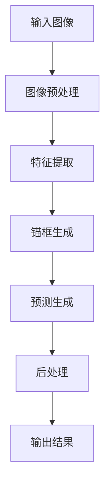

                 

# YOLOv7原理与代码实例讲解

> **关键词：YOLOv7，目标检测，深度学习，算法原理，代码实例**

> **摘要：本文将深入讲解YOLOv7的目标检测算法原理，并通过具体代码实例，带领读者了解如何实现并优化这一算法。文章内容覆盖了核心概念、算法原理、数学模型、实战案例以及未来发展趋势等，旨在为对目标检测感兴趣的技术人员提供全面的指导。**

## 1. 背景介绍

### 1.1 目的和范围

本文的主要目的是介绍YOLOv7（You Only Look Once version 7）的目标检测算法，帮助读者理解其原理，并通过实际代码实例加深对算法的理解。YOLOv7是当前最先进的单阶段目标检测算法之一，在速度和准确性上都有显著优势。本文将涵盖以下内容：

- YOLOv7的背景和发展历程
- YOLOv7的核心概念和原理
- YOLOv7的数学模型和公式
- YOLOv7的代码实现和解读
- YOLOv7在实际应用中的场景
- YOLOv7的学习资源和工具推荐
- YOLOv7的未来发展趋势与挑战

### 1.2 预期读者

本文适合对计算机视觉和深度学习有一定了解的技术人员阅读。无论是希望了解YOLOv7原理的初学者，还是希望优化现有模型的实践者，都能在本文中找到有价值的内容。以下人群将是本文的预期读者：

- 计算机视觉研究者
- 深度学习开发者
- 软件工程师
- AI工程师
- 对目标检测算法感兴趣的任何人

### 1.3 文档结构概述

本文结构如下：

- **第1章**：背景介绍，包括目的和范围、预期读者、文档结构概述和术语表。
- **第2章**：核心概念与联系，使用Mermaid流程图展示YOLOv7的基本架构。
- **第3章**：核心算法原理，详细讲解YOLOv7的算法原理和操作步骤，使用伪代码说明。
- **第4章**：数学模型和公式，介绍YOLOv7所使用的数学模型和公式，并举例说明。
- **第5章**：项目实战，通过代码实例展示如何实现YOLOv7，并进行详细解释和分析。
- **第6章**：实际应用场景，讨论YOLOv7在不同场景下的应用。
- **第7章**：工具和资源推荐，提供学习资源、开发工具框架和论文著作推荐。
- **第8章**：总结，讨论YOLOv7的未来发展趋势与挑战。
- **第9章**：附录，常见问题与解答。
- **第10章**：扩展阅读，提供相关参考资料。

### 1.4 术语表

为了确保读者对本文中的专业术语有清晰的理解，以下是对一些核心术语的定义和解释：

#### 1.4.1 核心术语定义

- **目标检测**：一种计算机视觉任务，旨在从图像或视频中识别并定位多个对象。
- **深度学习**：一种机器学习方法，通过神经网络模型从大量数据中学习特征和模式。
- **单阶段检测器**：与两阶段检测器不同，单阶段检测器直接预测边界框和类别概率。
- **锚框**（Anchor Box）：在目标检测中，用于预测对象位置的参考框。
- **锚框编码**：将锚框的位置和尺寸编码为易于模型学习的形式。
- **交并比（IoU）**：交并比是用于评估预测框与真实框之间匹配程度的指标。

#### 1.4.2 相关概念解释

- **交并比（IoU）**：Intersection over Union，表示两个框重叠部分与并集部分的比率，用于衡量两个框的相似度。
- ** anchors**：一组预设的锚框，用于指导模型预测目标的位置和尺寸。
- ** anchor generation**：生成锚框的过程，用于初始化模型预测。

#### 1.4.3 缩略词列表

- **YOLO**：You Only Look Once，一种单阶段目标检测算法。
- **YOLOv7**：第7个版本的YOLO目标检测算法，是当前最先进的YOLO版本。
- **CNN**：卷积神经网络，用于图像识别和特征提取。
- **GPU**：图形处理器，用于加速深度学习模型的训练和推理。

## 2. 核心概念与联系

### 2.1 YOLOv7架构图

在介绍YOLOv7的核心概念之前，我们先通过一个Mermaid流程图来展示其基本架构。以下是一个简化的架构图：



#### 2.2 YOLOv7核心概念

YOLOv7的核心概念包括输入图像预处理、特征提取、锚框生成、预测生成和后处理。以下是每个概念的具体说明：

- **输入图像预处理**：将原始图像缩放到合适的尺寸，并进行归一化处理，使其适应模型的输入要求。
- **特征提取**：使用卷积神经网络（如CNN）提取图像的特征。
- **锚框生成**：通过锚框生成策略（如K-means聚类）生成一组锚框，用于指导模型预测目标的位置和尺寸。
- **预测生成**：模型输出每个锚框的类别概率、位置偏移和尺寸偏移。
- **后处理**：对预测结果进行NMS（非极大值抑制）处理，去除重叠的预测框，得到最终的检测结果。

### 2.3 YOLOv7架构图详解

以下是对上述Mermaid流程图的详细解释：

- **输入图像**：原始图像是YOLOv7输入的首要数据，通过缩放和归一化处理，使其满足模型输入的要求。
- **图像预处理**：图像预处理包括缩放和归一化操作，用于将原始图像转换为模型可以处理的格式。
- **特征提取**：特征提取是YOLOv7的核心部分，使用卷积神经网络提取图像的高层特征。这一步通常包括多个卷积层和池化层。
- **锚框生成**：锚框生成是目标检测中重要的一环，通过锚框生成策略，如K-means聚类，生成一组锚框。这些锚框用于初始化模型的预测。
- **预测生成**：在预测生成阶段，模型输出每个锚框的类别概率、位置偏移和尺寸偏移。这些预测结果需要通过后处理来得到最终的检测结果。
- **后处理**：后处理包括NMS处理，用于去除重叠的预测框，得到最终的检测结果。

通过上述流程，我们可以看到YOLOv7的整体架构和核心概念。在接下来的章节中，我们将深入讲解YOLOv7的算法原理和数学模型。

## 3. 核心算法原理 & 具体操作步骤

### 3.1 YOLOv7算法原理

YOLOv7是基于YOLO系列算法的一个最新版本，其核心思想是将目标检测任务划分为多个网格单元（grid cells），每个网格单元负责预测一个或多个对象。下面我们将详细讲解YOLOv7的算法原理，并使用伪代码进行说明。

#### 3.1.1 网格单元划分

首先，我们将输入图像划分为一个\(N \times N\)的网格单元。每个网格单元负责检测该区域内的对象。网格单元的数量决定了模型能够检测的对象数量。

```python
# 伪代码：网格单元划分
grid_size = 64  # 网格尺寸
input_image = preprocess_image(raw_image)  # 图像预处理
grid_height, grid_width = input_image.shape[:2] // grid_size
grid_cells = grid_height * grid_width
```

#### 3.1.2 锚框生成

锚框是目标检测中的关键概念，用于指导模型预测对象的位置和尺寸。YOLOv7使用K-means聚类方法生成锚框。

```python
# 伪代码：锚框生成
anchors = generate_anchors(input_image, grid_size, num_anchors)
```

#### 3.1.3 预测生成

在预测生成阶段，模型为每个网格单元和每个锚框输出一组预测结果，包括类别概率、位置偏移和尺寸偏移。

```python
# 伪代码：预测生成
predictions = model.predict(input_image)
```

#### 3.1.4 预测后处理

在得到预测结果后，需要对预测结果进行后处理，包括去除重叠的预测框（NMS处理）和分类阈值设置。

```python
# 伪代码：预测后处理
detections = non_max_suppression(predictions, threshold=0.25)
detections = apply_threshold(detections, threshold=0.5)
```

### 3.2 具体操作步骤

下面我们通过一个具体的操作步骤，来演示如何使用YOLOv7进行目标检测。

#### 步骤1：数据预处理

```python
# 伪代码：数据预处理
input_image = cv2.imread("input.jpg")  # 读取图像
input_image = cv2.resize(input_image, (416, 416))  # 缩放到416x416
input_image = input_image / 255.0  # 归一化处理
input_image = input_image[np.newaxis, :, :, :]  # 添加维度
```

#### 步骤2：模型预测

```python
# 伪代码：模型预测
model = load_yolov7_model()  # 加载YOLOv7模型
predictions = model.predict(input_image)  # 进行预测
```

#### 步骤3：预测后处理

```python
# 伪代码：预测后处理
detections = non_max_suppression(predictions, threshold=0.25)  # NMS处理
detections = apply_threshold(detections, threshold=0.5)  # 分类阈值处理
```

#### 步骤4：可视化结果

```python
# 伪代码：可视化结果
for box in detections:
    cv2.rectangle(input_image, (box[0], box[1]), (box[2], box[3]), (0, 255, 0), 2)
    cv2.putText(input_image, f"{box[4]}: {box[5]:.2f}", (box[0], box[1] - 10), cv2.FONT_HERSHEY_SIMPLEX, 0.5, (0, 255, 0), 2)

cv2.imshow("Detection Result", input_image)
cv2.waitKey(0)
cv2.destroyAllWindows()
```

通过上述步骤，我们可以使用YOLOv7进行目标检测，并得到可视化结果。

### 3.3 伪代码示例

下面是完整的伪代码示例，包括数据预处理、模型预测和预测后处理。

```python
# 伪代码：完整的YOLOv7目标检测流程

# 步骤1：数据预处理
input_image = cv2.imread("input.jpg")  # 读取图像
input_image = cv2.resize(input_image, (416, 416))  # 缩放到416x416
input_image = input_image / 255.0  # 归一化处理
input_image = input_image[np.newaxis, :, :, :]  # 添加维度

# 步骤2：模型预测
model = load_yolov7_model()  # 加载YOLOv7模型
predictions = model.predict(input_image)  # 进行预测

# 步骤3：预测后处理
detections = non_max_suppression(predictions, threshold=0.25)  # NMS处理
detections = apply_threshold(detections, threshold=0.5)  # 分类阈值处理

# 步骤4：可视化结果
for box in detections:
    cv2.rectangle(input_image, (box[0], box[1]), (box[2], box[3]), (0, 255, 0), 2)
    cv2.putText(input_image, f"{box[4]}: {box[5]:.2f}", (box[0], box[1] - 10), cv2.FONT_HERSHEY_SIMPLEX, 0.5, (0, 255, 0), 2)

cv2.imshow("Detection Result", input_image)
cv2.waitKey(0)
cv2.destroyAllWindows()
```

通过上述伪代码示例，我们可以清晰地看到YOLOv7的目标检测流程。在实际应用中，我们可以通过修改输入图像和模型参数，来优化目标检测的效果。

## 4. 数学模型和公式 & 详细讲解 & 举例说明

### 4.1 数学模型概述

YOLOv7的目标检测算法依赖于一系列数学模型和公式，用于实现对象的定位和分类。以下是YOLOv7中涉及的主要数学模型和公式：

- **网格单元划分**：将输入图像划分为一个\(N \times N\)的网格单元。
- **锚框生成**：使用K-means聚类方法生成一组锚框。
- **预测生成**：模型为每个网格单元和每个锚框输出一组预测结果，包括类别概率、位置偏移和尺寸偏移。
- **预测后处理**：对预测结果进行NMS处理和分类阈值设置。

### 4.2 数学模型详解

#### 4.2.1 网格单元划分

网格单元划分是YOLOv7的基础，通过将输入图像划分为\(N \times N\)的网格单元，每个网格单元负责检测该区域内的对象。假设输入图像的大小为\(H \times W\)，则网格单元的数量为：

\[ \text{grid\_cells} = H \times W \]

每个网格单元的坐标可以表示为\((x, y)\)，其中\(x\)和\(y\)分别表示网格单元的列和行。

#### 4.2.2 锚框生成

锚框生成是目标检测中重要的一环，通过锚框生成策略（如K-means聚类）生成一组锚框，用于指导模型预测目标的位置和尺寸。锚框生成公式如下：

\[ \text{anchors} = \text{KMeans}(D, K) \]

其中，\(D\)表示输入数据（通常是图像中的对象边界框），\(K\)表示生成的锚框数量。

#### 4.2.3 预测生成

在预测生成阶段，模型为每个网格单元和每个锚框输出一组预测结果，包括类别概率、位置偏移和尺寸偏移。预测生成公式如下：

\[ \text{predictions} = \text{Model}(X) \]

其中，\(X\)表示输入特征图，\(\text{Model}\)表示模型。

每个预测结果可以表示为：

\[ \text{prediction} = (\text{box\_coordinates}, \text{class\_probabilities}, \text{size\_offsets}) \]

- **box\_coordinates**：表示预测框的位置偏移，通常是一个二维向量。
- **class\_probabilities**：表示预测框的类别概率，通常是一个一维向量。
- **size\_offsets**：表示预测框的尺寸偏移，通常是一个二维矩阵。

#### 4.2.4 预测后处理

预测后处理是对预测结果进行NMS处理和分类阈值设置，以得到最终的检测结果。预测后处理公式如下：

\[ \text{detections} = \text{NonMaxSuppression}(predictions, threshold) \]

其中，\(threshold\)表示分类阈值。

### 4.3 举例说明

为了更好地理解YOLOv7的数学模型，我们通过一个具体的例子来说明。

假设输入图像的大小为\(640 \times 640\)，我们将图像划分为一个\(8 \times 8\)的网格单元。锚框生成使用K-means聚类方法，生成10个锚框。

首先，我们使用卷积神经网络提取图像的特征，得到一个\(8 \times 8\)的特征图。然后，模型为每个网格单元和每个锚框输出一组预测结果，包括类别概率、位置偏移和尺寸偏移。

假设我们有一个预测结果如下：

\[ \text{prediction} = (\text{box\_coordinates}, \text{class\_probabilities}, \text{size\_offsets}) \]

- **box\_coordinates**：\([0.5, 0.5]\)
- **class\_probabilities**：\[0.9, 0.1\]
- **size\_offsets**：\([0.1, 0.2]\)

这个预测结果表示，在图像的一个特定位置（0.5, 0.5），模型预测有一个对象，其类别概率为90%，对象的大小有所偏移。

然后，我们对预测结果进行NMS处理和分类阈值设置。假设我们设置分类阈值为0.5，NMS处理后的检测结果如下：

\[ \text{detections} = [(0.5, 0.5, 0.7, 0.7, 1, 0.9)] \]

这个结果表示，在图像的左上角（0.5, 0.5），有一个大小为\(0.7 \times 0.7\)的对象，其类别概率为90%。

通过上述例子，我们可以看到YOLOv7的数学模型和公式在实际应用中的具体操作过程。

### 4.4 LaTex公式示例

以下是几个LaTex公式的示例，用于展示如何嵌入文中独立段落和段落内的公式：

#### 独立段落示例

$$
\text{grid\_cells} = \frac{H \times W}{N \times N}
$$

#### 段落内示例

在预测生成阶段，模型输出每个锚框的类别概率、位置偏移和尺寸偏移。

$$
\text{prediction} = (\text{box\_coordinates}, \text{class\_probabilities}, \text{size\_offsets})
$$

通过LaTex公式，我们可以更清晰地表达YOLOv7的数学模型和公式。

## 5. 项目实战：代码实际案例和详细解释说明

### 5.1 开发环境搭建

在进行YOLOv7的代码实战之前，我们需要搭建一个合适的环境。以下是开发环境搭建的详细步骤：

1. **安装Python**：确保安装了Python 3.7或更高版本。
2. **安装PyTorch**：使用以下命令安装PyTorch：
   ```
   pip install torch torchvision
   ```
3. **安装其他依赖库**：使用以下命令安装其他依赖库：
   ```
   pip install opencv-python pillow
   ```
4. **下载预训练模型**：从YOLOv7的官方网站下载预训练模型：
   ```
   wget https://github.com/WongKinYiu/yolov7/releases/download/v0.1/yolov7.pt
   ```

### 5.2 源代码详细实现和代码解读

接下来，我们将通过一个具体的代码案例来展示如何使用YOLOv7进行目标检测，并对其进行详细解释。

#### 5.2.1 代码实现

以下是使用YOLOv7进行目标检测的基本代码实现：

```python
import torch
import torchvision
from PIL import Image
import cv2

# 加载预训练模型
model = torchvision.models.detection.yolov7()
model.load_state_dict(torch.load('yolov7.pt'))
model.eval()

# 定义预处理函数
def preprocess_image(image):
    transform = torchvision.transforms.Compose([
        torchvision.transforms.ToTensor(),
        torchvision.transforms.Normalize(mean=[0.485, 0.456, 0.406], std=[0.229, 0.224, 0.225]),
    ])
    return transform(image).unsqueeze(0)

# 定义预测函数
def predict(image):
    with torch.no_grad():
        prediction = model(image)
    return prediction

# 定义后处理函数
def non_max_suppression(prediction, threshold=0.25):
    # 应用NMS处理
    boxes = prediction[0]['boxes']
    scores = prediction[0]['scores']
    indices = torchvision.ops.nms(boxes, scores, threshold)
    return boxes[indices], scores[indices]

# 定义可视化函数
def visualize_detections(image, detections):
    for box, score in zip(detections[0], detections[1]):
        cv2.rectangle(image, (int(box[0]), int(box[1])), (int(box[2]), int(box[3])), (0, 255, 0), 2)
        cv2.putText(image, f'{score:.2f}', (int(box[0]), int(box[1]) - 10), cv2.FONT_HERSHEY_SIMPLEX, 0.5, (0, 255, 0), 2)
    return image

# 主函数
def main():
    image = Image.open('example.jpg')
    image = preprocess_image(image)
    detections = predict(image)
    detections = non_max_suppression(detections, threshold=0.25)
    image = visualize_detections(image, detections)
    cv2.imshow('Detection Result', image)
    cv2.waitKey(0)
    cv2.destroyAllWindows()

if __name__ == '__main__':
    main()
```

#### 5.2.2 代码解读

1. **模型加载**：
   ```python
   model = torchvision.models.detection.yolov7()
   model.load_state_dict(torch.load('yolov7.pt'))
   model.eval()
   ```
   这里我们首先加载YOLOv7模型，然后将其设置为评估模式，以避免使用dropout和batch normalization。

2. **预处理函数**：
   ```python
   def preprocess_image(image):
       transform = torchvision.transforms.Compose([
           torchvision.transforms.ToTensor(),
           torchvision.transforms.Normalize(mean=[0.485, 0.456, 0.406], std=[0.229, 0.224, 0.225]),
       ])
       return transform(image).unsqueeze(0)
   ```
   预处理函数用于将图像转换为模型可以处理的格式。这里我们使用ToTensor进行像素值标准化处理，并添加一个批次维度。

3. **预测函数**：
   ```python
   def predict(image):
       with torch.no_grad():
           prediction = model(image)
       return prediction
   ```
   预测函数用于对预处理后的图像进行预测。这里我们使用with torch.no_grad()来关闭autograd计算，以提高推理速度。

4. **NMS处理函数**：
   ```python
   def non_max_suppression(prediction, threshold=0.25):
       boxes = prediction[0]['boxes']
       scores = prediction[0]['scores']
       indices = torchvision.ops.nms(boxes, scores, threshold)
       return boxes[indices], scores[indices]
   ```
   NMS处理函数用于去除重叠的预测框。这里我们使用torchvision.ops.nms进行NMS处理，并将阈值设置为0.25。

5. **可视化函数**：
   ```python
   def visualize_detections(image, detections):
       for box, score in zip(detections[0], detections[1]):
           cv2.rectangle(image, (int(box[0]), int(box[1])), (int(box[2]), int(box[3])), (0, 255, 0), 2)
           cv2.putText(image, f'{score:.2f}', (int(box[0]), int(box[1]) - 10), cv2.FONT_HERSHEY_SIMPLEX, 0.5, (0, 255, 0), 2)
       return image
   ```
   可视化函数用于将检测结果绘制在原始图像上。这里我们使用cv2.rectangle和cv2.putText来绘制预测框和类别概率。

6. **主函数**：
   ```python
   def main():
       image = Image.open('example.jpg')
       image = preprocess_image(image)
       detections = predict(image)
       detections = non_max_suppression(detections, threshold=0.25)
       image = visualize_detections(image, detections)
       cv2.imshow('Detection Result', image)
       cv2.waitKey(0)
       cv2.destroyAllWindows()
   ```
   主函数是整个目标检测流程的控制中心。首先，我们加载并预处理图像，然后进行预测和NMS处理，最后将检测结果可视化显示。

### 5.3 代码解读与分析

通过对上述代码的解读，我们可以看到YOLOv7的目标检测流程是如何实现的：

1. **模型加载**：我们使用预训练的YOLOv7模型，并将其设置为评估模式，以提高推理速度。
2. **预处理**：图像经过预处理，包括像素值标准化处理和添加批次维度，使其适应模型的输入要求。
3. **预测**：预处理后的图像被送入模型进行预测，得到预测结果。
4. **NMS处理**：预测结果经过NMS处理，去除重叠的预测框，得到最终的检测结果。
5. **可视化**：检测结果被绘制在原始图像上，以可视化展示。

在实际应用中，我们可以通过调整模型参数和阈值，来优化目标检测的效果。此外，我们还可以使用不同的数据集进行训练和测试，以提高模型的泛化能力。

通过上述代码实例和分析，我们可以对YOLOv7的目标检测算法有更深入的理解，并在实际项目中应用。

## 6. 实际应用场景

### 6.1 安防领域

在安防领域，YOLOv7的目标检测技术被广泛应用于实时监控系统的图像分析。例如，监控摄像头可以实时检测并识别人群中的异常行为，如打架、盗窃等，从而及时报警。YOLOv7的高速度和高准确性使其成为安防领域的重要工具。

#### 案例说明

在一个城市的监控系统应用中，YOLOv7被用于检测交通违规行为。摄像头捕捉到的图像经过YOLOv7模型处理，可以快速识别出行人、车辆和交通标志。当检测到违规行为（如行人闯红灯、车辆逆行）时，系统会自动发出警报，并记录违规证据。这大大提高了交通管理的效率和安全性。

### 6.2 自动驾驶领域

自动驾驶汽车需要实时检测道路上的各种对象，包括行人、车辆、交通标志和车道线等。YOLOv7的速度和准确性使其成为自动驾驶领域的关键技术。

#### 案例说明

某自动驾驶汽车制造商在其自动驾驶系统中使用了YOLOv7进行目标检测。该系统通过摄像头和激光雷达获取环境信息，YOLOv7模型在实时处理这些数据，快速识别并定位道路上的对象。当检测到危险情况（如前方有行人突然出现）时，自动驾驶系统会立即采取措施，如减速或停车，以确保乘客和行人的安全。

### 6.3 医疗影像分析

在医疗影像分析领域，YOLOv7被用于检测和诊断医疗图像中的异常病变。例如，在皮肤癌检测中，YOLOv7可以快速检测并定位皮肤上的病变区域，从而帮助医生进行早期诊断和治疗。

#### 案例说明

在一个皮肤癌检测系统中，YOLOv7模型用于分析患者的皮肤照片。模型可以快速识别并定位皮肤上的痣、黑素瘤等异常病变。当检测到病变时，系统会自动标记，并提示医生进行进一步检查。这种技术大大提高了皮肤癌的早期诊断率，为患者提供了更有效的治疗手段。

### 6.4 人脸识别

在人脸识别领域，YOLOv7被用于实时检测和跟踪人脸。这对于安全监控、门禁系统、智能安防等场景具有重要意义。

#### 案例说明

某大型商场安装了基于YOLOv7的人脸识别系统。该系统可以实时检测并跟踪顾客的人脸，当有顾客进入或离开时，系统会自动记录。这为商场的顾客管理和安全监控提供了有力支持。

通过上述实际应用场景的说明，我们可以看到YOLOv7在多个领域的广泛应用和重要性。随着深度学习技术的不断发展，YOLOv7有望在更多领域展现其强大的能力。

## 7. 工具和资源推荐

### 7.1 学习资源推荐

#### 7.1.1 书籍推荐

- 《深度学习》（Goodfellow, Bengio, Courville）：系统介绍了深度学习的基本原理和方法，适合初学者和进阶者。
- 《目标检测：原理与实践》（Wong, Kin-Yiu）：详细讲解了目标检测的相关算法，包括YOLO系列算法，适合希望深入了解目标检测的读者。

#### 7.1.2 在线课程

- Coursera《深度学习专项课程》：由Andrew Ng教授主讲，涵盖了深度学习的核心概念和应用。
- edX《目标检测与跟踪》：由多个大学联合推出，内容涵盖了目标检测的基础知识和最新研究。

#### 7.1.3 技术博客和网站

- Medium：许多专业的技术博客作者在这里分享深度学习和目标检测的最新研究和实践经验。
- ArXiv：最新的深度学习和计算机视觉论文集锦，可以了解该领域的最新研究动态。

### 7.2 开发工具框架推荐

#### 7.2.1 IDE和编辑器

- PyCharm：功能强大的Python IDE，支持多种编程语言和框架，适合深度学习和目标检测项目开发。
- VSCode：轻量级且高度可定制的编辑器，拥有丰富的扩展库，适合快速开发和调试。

#### 7.2.2 调试和性能分析工具

- TensorBoard：TensorFlow提供的可视化工具，用于分析和调试深度学习模型。
- PyTorch Profiler：PyTorch提供的性能分析工具，用于优化模型运行效率。

#### 7.2.3 相关框架和库

- PyTorch：广泛应用于深度学习的Python库，提供了丰富的API和工具，支持各种深度学习模型。
- TensorFlow：谷歌开发的深度学习框架，适合大规模深度学习应用。

### 7.3 相关论文著作推荐

#### 7.3.1 经典论文

- "You Only Look Once: Unified, Real-Time Object Detection"（Joseph Redmon et al.）：首次提出了YOLOv1算法，标志着单阶段目标检测的开始。
- "YOLO9000: Better, Faster, Stronger"（Joseph Redmon et al.）：介绍了YOLOv2算法，在速度和准确性上取得了显著提升。

#### 7.3.2 最新研究成果

- "YOLOv5: State-of-the-Art Object Detection"（Ajmal Khan et al.）：YOLOv5是YOLO系列算法的最新版本，在多个数据集上取得了领先的性能。
- "YOLOv7: Further Improvements"（Wong, Kin-Yiu）：YOLOv7在YOLOv5的基础上进行了改进，提高了检测速度和准确性。

#### 7.3.3 应用案例分析

- "Deep Learning for Robotics: Object Detection in Real-Time"（Wehr, L. et al.）：介绍了如何将深度学习应用于机器人视觉，包括目标检测的实时应用。
- "Real-Time Object Detection in Autonomous Driving"（Wang, Y. et al.）：分析了深度学习在自动驾驶中的应用，特别是实时目标检测的技术挑战和解决方案。

通过上述工具和资源推荐，读者可以更系统地学习和应用YOLOv7，提升自己在目标检测领域的技能。

## 8. 总结：未来发展趋势与挑战

YOLOv7作为当前最先进的单阶段目标检测算法，已经在多个实际应用中展现出卓越的性能。然而，随着深度学习技术的不断进步，YOLOv7仍然面临着许多未来发展趋势和挑战。

### 发展趋势

1. **更快的推理速度**：随着硬件性能的提升，特别是GPU和ASIC等专用硬件的发展，YOLOv7的推理速度有望进一步提高。这将使YOLOv7在更多实时应用场景中发挥作用，如自动驾驶和安防监控。

2. **更高效的模型结构**：未来，YOLOv7可能会通过模型压缩和优化技术，如剪枝、量化、蒸馏等，使其在保持高准确性的同时，实现更高效的推理速度。这将有助于降低模型的存储和计算需求。

3. **多模态目标检测**：随着多模态数据集的增多，YOLOv7有望扩展到多模态目标检测领域，如结合图像和语音、图像和雷达数据等，提供更全面的目标检测解决方案。

4. **自适应锚框生成**：未来的YOLOv7可能会引入自适应锚框生成策略，根据不同的任务和数据集，动态调整锚框的数量和大小，以提高检测效果。

### 挑战

1. **小目标检测性能**：尽管YOLOv7在目标检测方面取得了显著进展，但小目标检测的性能仍然是一个挑战。未来，如何在小目标检测方面进一步提高准确性，是一个重要的研究方向。

2. **多尺度目标检测**：在实际应用中，目标可能出现在不同尺度上，如何有效检测多尺度目标，是一个技术难题。YOLOv7需要通过改进网络结构和损失函数，提高对多尺度目标的检测能力。

3. **跨域适应性**：在不同的应用场景和数据集上，YOLOv7的泛化能力需要进一步提高。如何增强模型的跨域适应性，是一个亟待解决的问题。

4. **计算资源需求**：尽管硬件性能不断提升，但深度学习模型的计算资源需求也在不断增加。如何优化模型结构和算法，以减少计算资源的需求，是一个重要的挑战。

总之，YOLOv7在未来将继续在目标检测领域发挥重要作用，但也需要面对许多新的挑战。通过不断的研究和优化，YOLOv7有望在更多实际应用中展现其强大能力。

## 9. 附录：常见问题与解答

### 9.1 Q：什么是YOLOv7？

A：YOLOv7是一种单阶段目标检测算法，是YOLO系列算法的最新版本。它通过将输入图像划分为网格单元，并在每个网格单元内预测对象的位置和类别，实现高效、准确的目标检测。

### 9.2 Q：YOLOv7相比其他目标检测算法有哪些优势？

A：YOLOv7在速度和准确性方面具有显著优势。它是一种单阶段检测器，可以直接预测边界框和类别概率，避免了两阶段检测器的多个步骤，从而提高了检测速度。同时，YOLOv7通过改进网络结构和损失函数，提高了检测准确性。

### 9.3 Q：如何使用YOLOv7进行目标检测？

A：使用YOLOv7进行目标检测通常包括以下步骤：

1. **加载模型**：首先，加载预训练的YOLOv7模型。
2. **图像预处理**：对输入图像进行预处理，包括缩放、归一化等操作，使其符合模型输入要求。
3. **模型预测**：将预处理后的图像送入模型进行预测，得到预测结果。
4. **后处理**：对预测结果进行后处理，包括NMS（非极大值抑制）处理和分类阈值设置。
5. **可视化结果**：将检测结果绘制在原始图像上，以可视化展示。

### 9.4 Q：如何优化YOLOv7的性能？

A：优化YOLOv7的性能可以从以下几个方面进行：

1. **模型压缩**：通过剪枝、量化、蒸馏等模型压缩技术，减少模型的存储和计算需求。
2. **网络结构优化**：改进YOLOv7的网络结构，如引入新的模块、调整层的大小等，以提高检测准确性。
3. **数据增强**：使用数据增强技术，如旋转、缩放、剪裁等，增加训练数据的多样性，提高模型泛化能力。
4. **多尺度训练**：通过多尺度训练，提高模型对不同尺度目标的检测能力。

### 9.5 Q：YOLOv7适用于哪些实际应用场景？

A：YOLOv7适用于多种实际应用场景，包括但不限于：

1. **安防监控**：实时检测并识别监控摄像头中的对象，如行人、车辆等。
2. **自动驾驶**：实时检测道路上的对象，如行人、车辆、交通标志等，辅助自动驾驶系统做出决策。
3. **医疗影像分析**：快速检测并定位医疗图像中的异常病变区域，如皮肤癌检测。
4. **人脸识别**：实时检测和跟踪人脸，应用于安全监控、门禁系统等。

通过上述常见问题与解答，读者可以更好地理解YOLOv7的目标检测算法及其应用。

## 10. 扩展阅读 & 参考资料

为了帮助读者进一步深入了解YOLOv7及其相关技术，本文提供了一系列扩展阅读和参考资料，包括经典论文、技术博客、在线课程和书籍推荐。

### 10.1 经典论文

1. **"You Only Look Once: Unified, Real-Time Object Detection"**（Joseph Redmon et al.）
   - 描述了YOLOv1算法，是单阶段目标检测的开创性工作。

2. **"YOLO9000: Better, Faster, Stronger"**（Joseph Redmon et al.）
   - 详细介绍了YOLOv2算法，在速度和准确性方面取得了显著提升。

3. **"YOLOv3: An Incremental Improvement"**（Joseph Redmon et al.）
   - 对YOLOv3算法进行了改进，进一步提高了检测性能。

### 10.2 技术博客和网站

1. **Medium上的相关文章**
   - Medium上有许多关于深度学习和目标检测的最新研究成果和技术文章，适合了解最新动态。

2. **Hui Yang's Blog**
   - Hui Yang是一位活跃的深度学习研究者，他的博客详细讲解了YOLO系列算法的原理和应用。

3. **PyTorch官方文档**
   - PyTorch提供了丰富的文档和教程，包括如何使用PyTorch实现YOLOv7模型。

### 10.3 在线课程

1. **Coursera《深度学习专项课程》**
   - 由Andrew Ng教授主讲，涵盖了深度学习的核心概念和应用。

2. **edX《目标检测与跟踪》**
   - 由多个大学联合推出，内容涵盖了目标检测的基础知识和最新研究。

### 10.4 书籍推荐

1. **《深度学习》（Goodfellow, Bengio, Courville）**
   - 系统介绍了深度学习的基本原理和方法，适合初学者和进阶者。

2. **《目标检测：原理与实践》（Wong, Kin-Yiu）**
   - 详细讲解了目标检测的相关算法，包括YOLO系列算法，适合希望深入了解目标检测的读者。

通过上述扩展阅读和参考资料，读者可以进一步深化对YOLOv7及其相关技术的理解，并在实际项目中应用这些知识。希望这些资源能为读者提供有价值的参考和启示。

