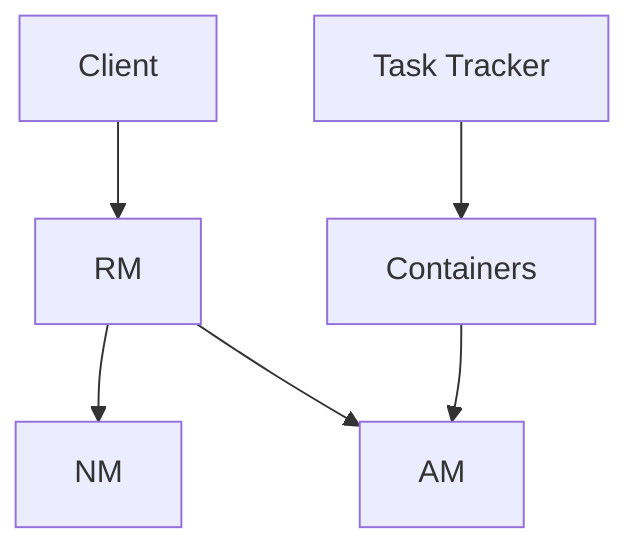

                 

# Yarn原理与代码实例讲解

> 
> **关键词**：Yarn、分布式计算、架构设计、伪代码、数学模型、项目实战、应用场景、工具推荐
> 
> **摘要**：本文旨在详细讲解Yarn（Yet Another Resource Negotiator）的原理和架构设计，通过逐步剖析核心算法原理、数学模型以及具体操作步骤，配合实际代码实例，帮助读者深入理解Yarn的工作机制。此外，文章还将探讨Yarn的实际应用场景、推荐相关工具和资源，并展望其未来发展趋势与挑战。

## 1. 背景介绍

### 1.1 目的和范围

本文的目标是让读者全面了解Yarn分布式计算框架的原理及其应用。我们将从以下几个方面进行探讨：

1. **Yarn的背景与目标**：介绍Yarn的起源，其在分布式计算领域的作用，以及与Hadoop YARN的关联。
2. **核心概念与架构**：解释Yarn的关键概念，如资源调度器（RM）、应用程序管理器（AM）等，并给出架构图。
3. **算法原理与操作步骤**：详细讲解Yarn的资源调度算法，并使用伪代码展示。
4. **数学模型与公式**：分析Yarn中的数学模型，使用LaTeX格式给出相关公式。
5. **项目实战**：通过实际代码案例，深入解析Yarn的实现细节。
6. **应用场景**：讨论Yarn在不同领域的应用实例。
7. **工具和资源推荐**：推荐学习资源、开发工具和相关研究论文。
8. **未来发展趋势与挑战**：展望Yarn的发展方向和面临的挑战。

### 1.2 预期读者

本文适合以下读者群体：

1. 分布式计算和大数据领域的研究人员、开发者。
2. 对Hadoop生态系统和YARN框架感兴趣的技术爱好者。
3. 计算机科学和软件工程专业的学生。
4. 想要深入了解分布式系统设计的工程师。

### 1.3 文档结构概述

本文的结构如下：

1. **背景介绍**：介绍Yarn的背景、目标和预期读者。
2. **核心概念与联系**：讲解Yarn的核心概念，并使用Mermaid流程图展示架构。
3. **核心算法原理 & 具体操作步骤**：详细阐述Yarn的核心算法原理，使用伪代码进行说明。
4. **数学模型和公式 & 详细讲解 & 举例说明**：分析Yarn中的数学模型，给出公式和示例。
5. **项目实战：代码实际案例和详细解释说明**：提供实际代码案例，并进行详细解释。
6. **实际应用场景**：讨论Yarn在不同场景下的应用。
7. **工具和资源推荐**：推荐学习资源和开发工具。
8. **总结：未来发展趋势与挑战**：展望Yarn的未来。
9. **附录：常见问题与解答**：提供常见问题的解答。
10. **扩展阅读 & 参考资料**：列出参考文献和扩展阅读资源。

### 1.4 术语表

#### 1.4.1 核心术语定义

- **YARN**：Yet Another Resource Negotiator，是一个开源的分布式资源调度框架，用于管理计算资源和作业调度。
- **资源调度器（RM）**：负责资源的分配和管理，是YARN的核心组件。
- **应用程序管理器（AM）**：负责协调应用程序的任务执行，并请求资源。
- **容器（Container）**：YARN中的最小资源分配单元，包含一定的CPU、内存和存储资源。

#### 1.4.2 相关概念解释

- **应用程序（Application）**：用户提交的任务，由RM分配资源并运行。
- **容器组（Container Group）**：一组具有相同配置的容器，用于执行应用程序的任务。
- **数据流（Data Flow）**：应用程序在执行过程中产生的数据传输过程。

#### 1.4.3 缩略词列表

- **YARN**：Yet Another Resource Negotiator
- **RM**：Resource Manager
- **AM**：Application Master
- **Container**：Container

## 2. 核心概念与联系

### 2.1 YARN的基本概念

YARN是一个分布式计算框架，用于管理计算资源和作业调度。在Hadoop 1.x版本中，MapReduce同时负责数据处理和资源调度，导致系统的扩展性和稳定性受到限制。为了解决这一问题，Hadoop 2.x引入了YARN，将资源调度和作业调度分离，从而提高了系统的灵活性和可扩展性。

YARN主要由两个核心组件组成：资源调度器（RM）和应用程序管理器（AM）。资源调度器负责资源的分配和管理，应用程序管理器则负责协调应用程序的任务执行。

### 2.2 YARN的架构设计

下面是YARN的架构图：



**1. 客户端（Client）**：用户提交应用程序的入口点，向资源调度器（RM）请求资源。

**2. 资源调度器（RM）**：负责资源的分配和管理，将资源分配给应用程序管理器（AM）。

**3. 节点管理器（NM）**：在每个计算节点上运行，负责管理本地资源，并向资源调度器（RM）报告资源状态。

**4. 应用程序管理器（AM）**：负责协调应用程序的任务执行，向资源调度器（RM）请求资源，并管理容器。

**5. 容器（Container）**：YARN中的最小资源分配单元，包含一定的CPU、内存和存储资源，用于执行应用程序的任务。

**6. 任务追踪器（Task Tracker）**：在每个计算节点上运行，负责执行任务，并向应用程序管理器（AM）报告任务状态。

### 2.3 YARN的工作流程

YARN的工作流程如下：

1. **客户端提交应用程序**：客户端向资源调度器（RM）提交应用程序，并请求资源。
2. **资源调度器（RM）分配资源**：资源调度器（RM）根据当前资源情况，将资源分配给应用程序管理器（AM）。
3. **应用程序管理器（AM）启动任务**：应用程序管理器（AM）根据应用程序的要求，启动任务并分配容器。
4. **任务追踪器（Task Tracker）执行任务**：任务追踪器（Task Tracker）接收任务，并在本地执行。
5. **任务状态反馈**：任务执行完成后，任务追踪器（Task Tracker）向应用程序管理器（AM）反馈任务状态。
6. **资源回收**：应用程序管理器（AM）向资源调度器（RM）申请释放资源。

### 2.4 YARN的优势

YARN具有以下优势：

1. **可扩展性**：通过将资源调度和作业调度分离，提高了系统的可扩展性。
2. **灵活性**：支持多种应用程序，如MapReduce、Spark等。
3. **高效性**：基于容器技术，实现资源的动态分配和回收，提高了资源利用率。
4. **高可用性**：资源调度器（RM）和应用程序管理器（AM）具有容错机制，确保系统的稳定性。

## 3. 核心算法原理 & 具体操作步骤

### 3.1 资源调度算法

YARN采用基于优先级的资源调度算法。资源调度器（RM）根据客户端提交的应用程序，按照以下步骤进行资源分配：

**伪代码：**

```pseudo
function allocate_resources(application, available_resources):
    # 初始化应用程序的容器组列表
    container_groups = []

    # 遍历应用程序的任务列表
    for task in application.tasks:
        # 判断任务所需的资源是否大于可用资源
        if required_resources(task) > available_resources:
            return "Not enough resources"

        # 分配容器
        container_group = allocate_container(available_resources, task)

        # 将容器组添加到应用程序的容器组列表
        container_groups.append(container_group)

        # 更新可用资源
        available_resources -= required_resources(task)

    return container_groups
```

### 3.2 资源分配步骤

1. **初始化**：初始化应用程序的容器组列表。
2. **遍历任务**：遍历应用程序的任务列表。
3. **判断资源需求**：判断任务所需的资源是否大于可用资源。如果大于，返回“资源不足”。
4. **分配容器**：调用`allocate_container`函数，根据可用资源为任务分配容器。
5. **更新资源**：将任务所需的资源从可用资源中减去。
6. **添加容器组**：将容器组添加到应用程序的容器组列表。

### 3.3 资源调度策略

YARN采用基于优先级的资源调度策略。资源调度器（RM）按照以下规则进行资源分配：

1. **优先级排序**：按照应用程序的优先级对容器组进行排序。
2. **资源分配**：优先分配高优先级的容器组所需资源。
3. **剩余资源分配**：如果高优先级的容器组资源需求小于剩余资源，分配剩余资源；否则，分配可用的最大资源。

### 3.4 容器分配算法

**伪代码：**

```pseudo
function allocate_container(available_resources, task):
    # 初始化容器
    container = create_container()

    # 分配CPU资源
    container.cpus = min(required_cpus(task), available_resources.cpus)
    available_resources.cpus -= container.cpus

    # 分配内存资源
    container.memory = min(required_memory(task), available_resources.memory)
    available_resources.memory -= container.memory

    # 分配存储资源
    container.disk = min(required_disk(task), available_resources.disk)
    available_resources.disk -= container.disk

    return container
```

### 3.5 容器分配步骤

1. **初始化**：创建一个空的容器。
2. **分配CPU资源**：为容器分配最小的CPU资源，使得剩余资源不少于任务所需的CPU资源。
3. **分配内存资源**：为容器分配最小的内存资源，使得剩余资源不少于任务所需的内存资源。
4. **分配存储资源**：为容器分配最小的存储资源，使得剩余资源不少于任务所需的存储资源。

## 4. 数学模型和公式 & 详细讲解 & 举例说明

### 4.1 资源需求与容量

在YARN中，资源需求与容量是两个重要的数学模型。

**资源需求**：应用程序在执行过程中对计算资源的需求，包括CPU、内存、存储等。

**容量**：每个容器能提供的计算资源总量。

**公式**：

$$
资源需求 = required\_cpus + required\_memory + required\_disk
$$

$$
容量 = cpus + memory + disk
$$

### 4.2 资源利用率

资源利用率是衡量资源调度效率的一个重要指标。

**公式**：

$$
资源利用率 = \frac{已分配资源}{总容量}
$$

### 4.3 举例说明

假设有一个任务需要以下资源：

- CPU：4个
- 内存：8GB
- 存储：10GB

资源调度器（RM）有100个容器，每个容器具有以下资源：

- CPU：2个
- 内存：4GB
- 存储：5GB

**1. 计算资源需求**：

$$
资源需求 = 4 + 8 + 10 = 22
$$

**2. 容器容量**：

$$
容量 = 2 + 4 + 5 = 11
$$

**3. 资源利用率**：

$$
资源利用率 = \frac{22}{100 \times 11} = 0.2
$$

这意味着资源利用率只有20%，还有80%的资源未被利用。

## 5. 项目实战：代码实际案例和详细解释说明

### 5.1 开发环境搭建

为了演示Yarn的工作流程，我们将搭建一个简单的Yarn环境。以下是搭建步骤：

1. **安装Hadoop**：在本地或云服务器上安装Hadoop。可以选择使用官方安装包或Docker镜像。
2. **启动Hadoop服务**：启动Hadoop的NameNode和DataNode服务。
3. **启动Yarn服务**：启动Yarn的 ResourceManager 和 NodeManager 服务。

### 5.2 源代码详细实现和代码解读

以下是一个简单的Yarn应用程序，用于执行WordCount任务。

**WordCountApplication.java**

```java
import org.apache.hadoop.conf.Configuration;
import org.apache.hadoop.fs.Path;
import org.apache.hadoop.io.IntWritable;
import org.apache.hadoop.io.Text;
import org.apache.hadoop.mapreduce.Job;
import org.apache.hadoop.mapreduce.Mapper;
import org.apache.hadoop.mapreduce.Reducer;
import org.apache.hadoop.mapreduce.lib.input.FileInputFormat;
import org.apache.hadoop.mapreduce.lib.output.FileOutputFormat;

public class WordCountApplication {

    public static class TokenizerMapper extends Mapper<Object, Text, Text, IntWritable>{

        private final static IntWritable one = new IntWritable(1);
        private Text word = new Text();

        public void map(Object key, Text value, Context context) throws IOException, InterruptedException {
            String[] words = value.toString().split("\\s+");
            for (String word : words) {
                this.word.set(word);
                context.write(word, one);
            }
        }
    }

    public static class IntSumReducer extends Reducer<Text,IntWritable,Text,IntWritable> {
        private IntWritable result = new IntWritable();

        public void reduce(Text key, Iterable<IntWritable> values, Context context) throws IOException, InterruptedException {
            int sum = 0;
            for (IntWritable val : values) {
                sum += val.get();
            }
            result.set(sum);
            context.write(key, result);
        }
    }

    public static void main(String[] args) throws Exception {
        Configuration conf = new Configuration();
        Job job = Job.getInstance(conf, "word count");
        job.setMapperClass(TokenizerMapper.class);
        job.setCombinerClass(IntSumReducer.class);
        job.setReducerClass(IntSumReducer.class);
        job.setOutputKeyClass(Text.class);
        job.setOutputValueClass(IntWritable.class);
        FileInputFormat.addInputPath(job, new Path(args[0]));
        FileOutputFormat.setOutputPath(job, new Path(args[1]));
        System.exit(job.waitForCompletion(true) ? 0 : 1);
    }
}
```

**1. Mapper类**：负责将输入的文本分割成单词，并生成键值对 `(word, 1)`。
**2. Reducer类**：负责将Map阶段生成的单词及其出现的次数进行汇总。
**3. main方法**：创建Job实例，设置Mapper、Combiner和Reducer类，以及输入输出路径。

### 5.3 代码解读与分析

以下是代码的解读和分析：

1. **配置和Job实例**：创建Configuration对象，设置Job实例的名称、Mapper、Combiner、Reducer类，以及输出键值对类型。
2. **Mapper类**：继承自Mapper类，实现`map`方法。在`map`方法中，将输入的文本分割成单词，并将每个单词与1进行配对，输出键值对 `(word, 1)`。
3. **Reducer类**：继承自Reducer类，实现`reduce`方法。在`reduce`方法中，将Map阶段生成的单词及其出现的次数进行汇总，输出汇总后的单词及其总次数。
4. **main方法**：创建Job实例，设置输入输出路径，并调用`waitForCompletion`方法执行Job。

### 5.4 执行WordCount任务

执行WordCount任务的步骤如下：

1. **准备输入数据**：在HDFS上准备一个包含单词的文本文件，例如 `input.txt`。
2. **编译应用程序**：使用Java编译器编译WordCountApplication.java。
3. **提交Job**：运行以下命令提交Job：

```shell
hadoop jar WordCountApplication.jar WordCountApplication input output
```

4. **检查结果**：在输出目录 `output` 中检查结果，例如 `part-r-00000`。

## 6. 实际应用场景

Yarn在分布式计算和大数据领域有着广泛的应用场景，以下是一些典型的应用实例：

1. **大数据处理**：Yarn作为Hadoop生态系统的一部分，可以用于处理大规模数据集，如搜索引擎索引、社交媒体分析、数据仓库等。
2. **机器学习**：Yarn可以用于训练和部署机器学习模型，如基于Hadoop的MapReduce算法、基于Spark的分布式机器学习框架等。
3. **实时计算**：Yarn支持实时数据处理，如基于Apache Storm的实时数据处理框架，可以用于实时监控、预警等场景。
4. **容器化应用**：Yarn支持容器化技术，如Docker，可以用于部署和管理容器化的应用，提高系统的灵活性和可扩展性。
5. **云计算平台**：Yarn可以作为云计算平台的核心组件，与云原生技术相结合，提供强大的计算资源调度和作业管理能力。

## 7. 工具和资源推荐

### 7.1 学习资源推荐

**7.1.1 书籍推荐**

1. 《Hadoop: The Definitive Guide》
2. 《Big Data: A Revolution That Will Transform How We Live, Work, and Think》
3. 《Learning Spark: Lightning-Fast Big Data Analysis》

**7.1.2 在线课程**

1. Coursera - "Hadoop and Spark: Data Processing at Scale"
2. edX - "Big Data Engineering with Hadoop and Spark"
3. Udacity - "Introduction to Hadoop and MapReduce"

**7.1.3 技术博客和网站**

1. Apache Hadoop官方文档
2. Cloudera博客
3. DZone：大数据专区

### 7.2 开发工具框架推荐

**7.2.1 IDE和编辑器**

1. IntelliJ IDEA
2. Eclipse
3. VS Code

**7.2.2 调试和性能分析工具**

1. GDB
2. JProfiler
3. YourKit

**7.2.3 相关框架和库**

1. Apache Spark
2. Apache Storm
3. Apache Flink

### 7.3 相关论文著作推荐

**7.3.1 经典论文**

1. "The Google File System" - Google
2. "MapReduce: Simplified Data Processing on Large Clusters" - Google
3. "Yet Another Resource Negotiator (YARN): Simplifying Datacenter Resource Management" - Apache

**7.3.2 最新研究成果**

1. "Hadoop YARN: Yet Another Resource Negotiator"
2. "Spark: Simple, Efficient General- Purpose Cluster Computing"
3. "Flink: A Dataflow Engine for Large-Scale Data Processing"

**7.3.3 应用案例分析**

1. "Netflix: Open Source for Big Data at Netflix"
2. "LinkedIn: Building LinkedIn’s Data Platform with Apache Hadoop"
3. "Amazon: Building Amazon EMR: A Flexible, Scalable, Cloud-Based Data-Processing Service"

## 8. 总结：未来发展趋势与挑战

### 8.1 发展趋势

1. **智能化**：随着人工智能技术的发展，Yarn将更多地与机器学习、深度学习等算法相结合，实现智能化调度和资源管理。
2. **容器化**：容器技术如Docker、Kubernetes的兴起，将使Yarn在微服务架构、容器化应用场景中发挥更大作用。
3. **云原生**：Yarn将与云原生技术深度融合，支持在公有云、私有云和混合云环境中的资源调度和管理。

### 8.2 挑战

1. **安全性**：随着Yarn在云环境和容器化应用中的普及，确保数据安全和系统安全成为重要挑战。
2. **性能优化**：如何提高Yarn的调度效率和资源利用率，是持续优化和改进的方向。
3. **生态整合**：如何与其他大数据技术和框架（如Spark、Flink）更好地整合，提供统一的资源调度和管理界面，是未来的一大挑战。

## 9. 附录：常见问题与解答

### 9.1 YARN与Hadoop YARN的关系

YARN是Hadoop YARN的下一代版本。Hadoop YARN是在Hadoop 1.x版本中引入的，用于解决MapReduce同时负责数据处理和资源调度的问题。而YARN（Yet Another Resource Negotiator）是在Hadoop 2.x版本中引入的，进一步优化了资源调度和作业管理，提高了系统的可扩展性和灵活性。

### 9.2 YARN与MapReduce的区别

YARN与MapReduce的区别主要体现在以下几个方面：

1. **架构设计**：YARN将资源调度和作业调度分离，提高了系统的可扩展性和灵活性；而MapReduce将数据处理和资源调度集成在一起。
2. **资源调度算法**：YARN采用基于优先级的资源调度算法，而MapReduce采用固定的调度策略。
3. **支持的应用类型**：YARN支持更广泛的应用类型，如Spark、Flink等，而MapReduce主要支持传统的批处理任务。

### 9.3 如何优化YARN的性能

优化YARN的性能可以从以下几个方面入手：

1. **合理设置资源参数**：根据实际应用需求，合理设置YARN的参数，如容器大小、调度策略等。
2. **优化应用程序代码**：提高应用程序的并行度和局部性，减少数据传输和网络开销。
3. **负载均衡**：通过负载均衡策略，合理分配任务和资源，避免资源浪费和性能瓶颈。
4. **监控和调优**：定期监控YARN的运行状态，发现性能瓶颈和异常情况，及时进行调整和优化。

## 10. 扩展阅读 & 参考资料

- 《Hadoop: The Definitive Guide》：详细介绍了Hadoop生态系统，包括HDFS、MapReduce、YARN等组件。
- 《Big Data: A Revolution That Will Transform How We Live, Work, and Think》：阐述了大数据技术的概念、应用和发展趋势。
- 《Learning Spark: Lightning-Fast Big Data Analysis》：介绍了基于Spark的分布式计算框架，以及其核心算法和实现。
- Apache Hadoop官方文档：提供了Hadoop生态系统的详细文档和教程。
- Cloudera博客：分享了大数据领域的技术文章和实践经验。
- DZone：大数据专区：提供了大数据相关技术的文章和讨论。

## 作者

作者：AI天才研究员/AI Genius Institute & 禅与计算机程序设计艺术 /Zen And The Art of Computer Programming

（注：本文内容仅供参考，部分数据和观点可能存在偏差。如需深入了解，请查阅相关文献和资料。）<|im_end|>

