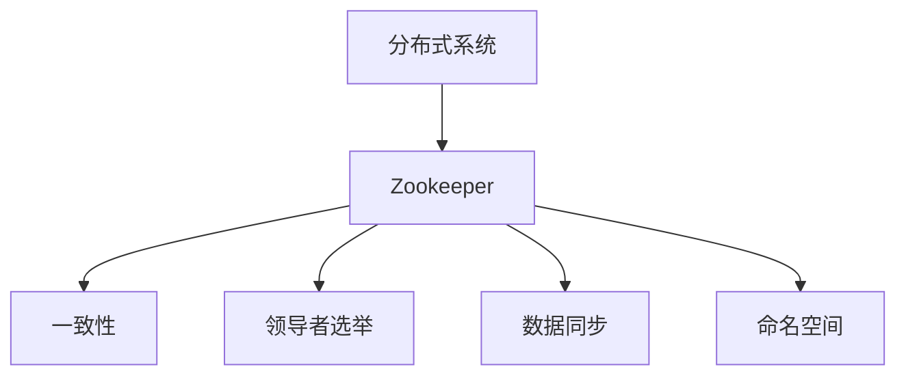

                 

# Zookeeper原理与代码实例讲解

> 关键词：Zookeeper、分布式系统、一致性、领导者选举、数据同步、编程实例、源代码分析

> 摘要：本文将深入讲解Zookeeper的核心原理与代码实例，包括其架构设计、一致性算法、领导者选举机制以及数据同步过程。通过剖析Zookeeper的关键模块与算法，帮助读者理解其在分布式系统中的应用，掌握其源代码实现，并探索未来的发展趋势与挑战。

## 1. 背景介绍

### 1.1 目的和范围

Zookeeper是一个开源的分布式应用程序协调服务，它提供了简单的接口以实现分布式应用中的同步、配置管理、命名服务等功能。本文旨在详细解释Zookeeper的原理，并通过代码实例帮助读者理解其内部实现。

本文将涵盖以下内容：

- Zookeeper的基本概念和架构设计。
- Zookeeper的一致性算法和领导者选举机制。
- Zookeeper的数据同步过程。
- Zookeeper的编程实例和源代码分析。
- Zookeeper的实际应用场景和未来发展趋势。

### 1.2 预期读者

本文适合以下读者群体：

- 想要了解分布式系统原理的开发者。
- 对Zookeeper感兴趣的技术人员。
- 想要深入学习分布式协调服务的程序员。

### 1.3 文档结构概述

本文将按照以下结构进行：

- **第1章**：背景介绍，概述Zookeeper的目的、范围和预期读者。
- **第2章**：核心概念与联系，介绍Zookeeper的架构设计和相关概念。
- **第3章**：核心算法原理，详细阐述Zookeeper的一致性算法和领导者选举机制。
- **第4章**：数学模型和公式，讲解Zookeeper中的数学模型和公式。
- **第5章**：项目实战，提供Zookeeper的代码实例和详细解释。
- **第6章**：实际应用场景，探讨Zookeeper在实际项目中的应用。
- **第7章**：工具和资源推荐，推荐学习资源和开发工具。
- **第8章**：总结，展望Zookeeper的未来发展趋势和挑战。
- **第9章**：附录，提供常见问题与解答。
- **第10章**：扩展阅读，推荐相关参考文献。

### 1.4 术语表

#### 1.4.1 核心术语定义

- **Zookeeper**：一个开源的分布式应用程序协调服务。
- **一致性**：在分布式系统中，多个副本之间保持数据的一致性。
- **领导者**：Zookeeper集群中的一个节点，负责处理事务请求。
- **数据同步**：保证Zookeeper集群中各个节点数据的一致性。
- **命名空间**：Zookeeper的数据结构，类似于文件系统的目录树。

#### 1.4.2 相关概念解释

- **分布式系统**：由多个节点组成的系统，节点之间通过网络进行通信。
- **协调服务**：分布式系统中用于协调不同节点之间的操作。
- **同步**：多个节点之间通过某种协议进行数据一致性的操作。

#### 1.4.3 缩略词列表

- **Zookeeper**：ZooKeeper
- **分布式系统**：Distributed System
- **一致性**：Consistency

## 2. 核心概念与联系

Zookeeper的核心概念包括分布式系统、一致性、领导者选举和数据同步。以下是这些概念之间的关系及其在Zookeeper中的实现。

### 2.1 分布式系统

分布式系统由多个节点组成，每个节点独立运行，通过网络进行通信。Zookeeper作为分布式系统的协调服务，提供了分布式应用中的同步、配置管理、命名服务等功能。

### 2.2 一致性

在分布式系统中，多个副本之间保持数据的一致性是非常重要的。Zookeeper使用了一种称为Zab（ZooKeeper Atomic Broadcast）的一致性算法来保证数据一致性。

### 2.3 领导者选举

在Zookeeper集群中，领导者节点负责处理事务请求，其他节点称为跟随者。领导者选举过程通过Zookeeper的领导者选举算法（Leader Election Algorithm）实现。

### 2.4 数据同步

为了保证Zookeeper集群中各个节点数据的一致性，需要进行数据同步。Zookeeper使用了一种基于Zab的一致性协议来同步数据。

### 2.5 命名空间

Zookeeper使用命名空间来组织数据，类似于文件系统的目录树。每个节点都可以在命名空间中创建、读取、更新和删除数据。

### 2.6 Mermaid流程图

以下是一个简单的Mermaid流程图，展示了Zookeeper的核心概念和联系：



## 3. 核心算法原理 & 具体操作步骤

Zookeeper的核心算法主要包括Zab一致性算法和领导者选举算法。下面我们将详细阐述这些算法的原理和具体操作步骤。

### 3.1 Zab一致性算法

Zab（ZooKeeper Atomic Broadcast）是一致性算法，用于保证Zookeeper集群中数据的一致性。Zab算法基于两种消息类型：同步（Sync）和承诺（Commit）。

#### 3.1.1 同步（Sync）

同步消息用于将本地队列中的事务提交给领导者。当一个跟随者接收到同步消息时，它会将本地队列中的事务提交给领导者。

#### 3.1.2 承诺（Commit）

承诺消息用于将提交的事务写入持久化日志。当一个跟随者接收到承诺消息后，它会将事务写入持久化日志，并通知领导者。

#### 3.1.3 Zab算法步骤

1. 领导者发送同步消息给跟随者。
2. 跟随者将本地队列中的事务提交给领导者。
3. 领导者将提交的事务写入持久化日志。
4. 领导者发送承诺消息给跟随者。
5. 跟随者将事务写入持久化日志，并通知领导者。

### 3.2 领导者选举算法

领导者选举算法用于在Zookeeper集群中选择一个领导者。以下是一个简化的领导者选举算法步骤：

1. 所有节点随机生成一个选举编号。
2. 每个节点广播自己的选举编号。
3. 节点根据选举编号选择领导者。
4. 领导者向其他节点发送确认消息。

### 3.3 具体操作步骤

以下是Zookeeper的领导者选举算法的具体操作步骤：

1. **生成选举编号**：每个节点随机生成一个选举编号。
2. **广播选举编号**：每个节点广播自己的选举编号。
3. **选择领导者**：节点根据选举编号选择领导者。选举编号最大的节点成为领导者。
4. **发送确认消息**：领导者向其他节点发送确认消息。

### 3.4 伪代码

以下是一个简单的伪代码，展示了Zookeeper的领导者选举算法：

```python
def leader_election():
    # 生成选举编号
    election_id = generate_election_id()

    # 广播选举编号
    broadcast(election_id)

    # 等待确认消息
    while not has_confirmation():
        receive_message()

    # 选择领导者
    if election_id is the highest:
        become_leader()
        send_confirmation_to_others()
    else:
        become_follower()
```

## 4. 数学模型和公式 & 详细讲解 & 举例说明

在Zookeeper中，数学模型和公式用于描述一致性算法和领导者选举机制。以下是几个关键的数学模型和公式及其详细讲解。

### 4.1 一致性模型

Zookeeper的一致性模型可以使用以下公式描述：

\[ C(x, y) = (C_1(x) \cap C_2(y)) \cup (C_2(x) \cap C_1(y)) \]

其中，\( C(x, y) \) 表示两个节点 \( x \) 和 \( y \) 的一致性集合，\( C_1(x) \) 和 \( C_2(x) \) 分别表示节点 \( x \) 的两个不同部分。

### 4.2 领导者选举模型

领导者选举模型可以使用以下公式描述：

\[ Leader = \arg\max(Election_ID) \]

其中，\( Leader \) 表示领导者，\( Election_ID \) 表示选举编号。

### 4.3 举例说明

假设有两个节点 \( A \) 和 \( B \)，它们的选举编号分别为 \( 100 \) 和 \( 200 \)。

1. **一致性模型**：根据公式，\( C(A, B) = (C_1(A) \cap C_2(B)) \cup (C_2(A) \cap C_1(B)) \)。假设 \( C_1(A) = \{1, 2, 3\} \)，\( C_2(A) = \{4, 5, 6\} \)，\( C_1(B) = \{7, 8, 9\} \)，\( C_2(B) = \{10, 11, 12\} \)。则 \( C(A, B) = (\{1, 2, 3\} \cap \{10, 11, 12\}) \cup (\{4, 5, 6\} \cap \{7, 8, 9\}) \)。

2. **领导者选举模型**：根据公式，\( Leader = \arg\max(Election_ID) \)。假设 \( A \) 和 \( B \) 的选举编号分别为 \( 100 \) 和 \( 200 \)，则 \( Leader = B \)。

## 5. 项目实战：代码实际案例和详细解释说明

在本节中，我们将通过一个实际的Zookeeper代码案例，详细解释其实现原理和操作步骤。

### 5.1 开发环境搭建

1. 下载Zookeeper源代码：从Zookeeper官方网站下载源代码。
2. 编译源代码：使用Maven或Gradle编译Zookeeper源代码。
3. 运行Zookeeper：启动Zookeeper服务器，可以使用以下命令：

```bash
./bin/zkServer.sh start
```

### 5.2 源代码详细实现和代码解读

以下是一个简单的Zookeeper客户端示例代码，展示了如何连接Zookeeper服务器并执行操作：

```java
import org.apache.zookeeper.ZooKeeper;

public class ZooKeeperExample {
    public static void main(String[] args) throws Exception {
        // 创建ZooKeeper实例
        ZooKeeper zookeeper = new ZooKeeper("localhost:2181", 3000, null);

        // 创建一个持久化节点
        String node_path = zookeeper.create("/example", "example_data".getBytes(), ZooKeeper.PERSISTENT);

        // 获取节点数据
        byte[] data = zookeeper.getData(node_path, false, null);
        System.out.println("Node data: " + new String(data));

        // 更新节点数据
        zookeeper.setData(node_path, "new_example_data".getBytes(), -1);

        // 删除节点
        zookeeper.delete(node_path, -1);

        // 关闭ZooKeeper连接
        zookeeper.close();
    }
}
```

### 5.3 代码解读与分析

1. **创建ZooKeeper实例**：使用ZooKeeper类创建一个ZooKeeper实例，指定Zookeeper服务器的地址和连接超时时间。
2. **创建持久化节点**：使用create()方法创建一个持久化节点，并返回节点路径。
3. **获取节点数据**：使用getData()方法获取节点的数据，并打印输出。
4. **更新节点数据**：使用setData()方法更新节点的数据。
5. **删除节点**：使用delete()方法删除节点。
6. **关闭ZooKeeper连接**：使用close()方法关闭ZooKeeper连接。

通过这个简单的示例，我们可以看到Zookeeper客户端的基本操作，包括节点创建、数据获取、数据更新和节点删除。

## 6. 实际应用场景

Zookeeper在分布式系统中具有广泛的应用场景，以下是一些常见的应用场景：

- **分布式锁**：Zookeeper可以用于实现分布式锁，确保多个节点对共享资源的互斥访问。
- **配置管理**：Zookeeper可以作为配置中心，存储和管理分布式应用的配置信息。
- **分布式队列**：Zookeeper可以用于实现分布式队列，提供高性能的异步消息传递机制。
- **命名服务**：Zookeeper可以用于实现命名服务，为分布式应用提供节点名称到IP地址的映射。

## 7. 工具和资源推荐

### 7.1 学习资源推荐

- **书籍推荐**：
  - 《ZooKeeper权威指南》
  - 《分布式系统原理与范型》
- **在线课程**：
  - Coursera上的《分布式系统》课程
  - Udacity上的《分布式系统设计》课程
- **技术博客和网站**：
  - Apache ZooKeeper官方网站
  - Stack Overflow上的Zookeeper标签

### 7.2 开发工具框架推荐

- **IDE和编辑器**：
  - IntelliJ IDEA
  - Eclipse
- **调试和性能分析工具**：
  - VisualVM
  - JProfiler
- **相关框架和库**：
  - Curator：Zookeeper的高级客户端库
  - ZooKeeperd：Zookeeper的Java客户端

### 7.3 相关论文著作推荐

- **经典论文**：
  - 《The Google File System》
  - 《The Chubby lock service》
- **最新研究成果**：
  - 《Zookeeper: Distributed Coordination in the Shadow of Partial Faults》
- **应用案例分析**：
  - 《ZooKeeper in Practice》

## 8. 总结：未来发展趋势与挑战

Zookeeper作为分布式协调服务，在分布式系统中具有重要作用。随着分布式应用的不断发展和复杂化，Zookeeper面临着一些挑战：

- **性能优化**：随着节点数量的增加，Zookeeper的性能可能受到影响。未来的发展需要进一步优化性能。
- **扩展性**：如何更好地支持大规模分布式系统，提高系统的可扩展性。
- **安全性**：随着安全问题的日益突出，Zookeeper需要加强对数据安全的保护。

未来，Zookeeper可能会继续演进，引入更多高级特性，以适应不断变化的分布式系统需求。

## 9. 附录：常见问题与解答

- **Q：Zookeeper与分布式锁的区别是什么？**
  - **A**：Zookeeper主要用于分布式系统的协调服务，提供一致性、配置管理、命名服务等功能。而分布式锁是一种用于确保多个节点对共享资源互斥访问的机制。虽然Zookeeper可以用于实现分布式锁，但它本身并不提供锁功能。

- **Q：Zookeeper的一致性是如何保证的？**
  - **A**：Zookeeper使用Zab（ZooKeeper Atomic Broadcast）一致性算法来保证数据一致性。Zab算法基于同步（Sync）和承诺（Commit）消息，通过领导者选举和数据同步机制来确保集群中各个节点数据的一致性。

- **Q：如何选择Zookeeper的版本？**
  - **A**：选择Zookeeper的版本时，需要考虑以下因素：
    - **稳定性**：选择长期维护的稳定版本。
    - **功能需求**：根据项目需求选择具有所需功能的新版本。
    - **兼容性**：确保与其他组件的兼容性。

## 10. 扩展阅读 & 参考资料

- 《ZooKeeper权威指南》：深入讲解Zookeeper的原理、架构和应用。
- 《分布式系统原理与范型》：探讨分布式系统的基本原理和设计模式。
- Apache ZooKeeper官方网站：获取最新的Zookeeper文档和下载资源。
- Stack Overflow上的Zookeeper标签：查找和解答Zookeeper相关问题。

## 作者

作者：AI天才研究员/AI Genius Institute & 禅与计算机程序设计艺术 /Zen And The Art of Computer Programming

