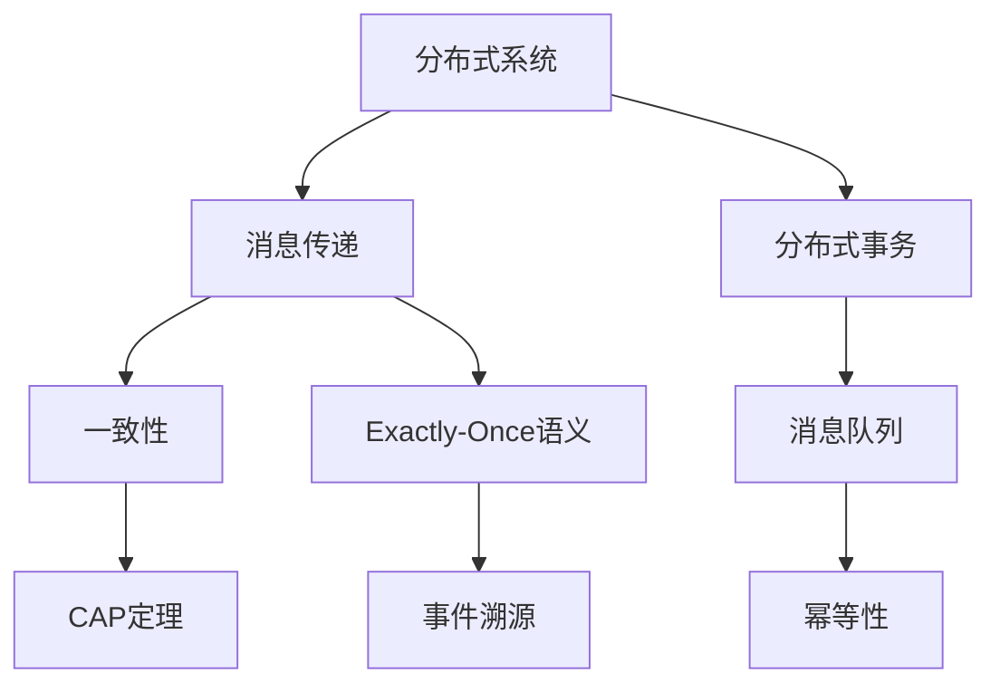

                 

### exactly-once语义 原理与代码实例讲解

> **关键词**：Exactly-Once语义，分布式系统，消息传递，一致性，CAP定理，分布式算法，事件溯源，代码实例

> **摘要**：
本文将深入探讨Exactly-Once语义在分布式系统中的重要性，通过详细解析其原理和算法，结合代码实例，帮助读者理解如何在实际项目中实现这一关键特性。我们将从背景介绍开始，逐步深入到核心概念、算法原理、数学模型，最终通过实战项目展示具体的实现过程。本文适合对分布式系统和消息传递有一定了解的读者，旨在为开发者在复杂系统中实现Exactly-Once语义提供指导。

## 1. 背景介绍

### 1.1 目的和范围

本文的目的是解释Exactly-Once语义在分布式系统中的原理，并通过代码实例来展示如何实现这一关键特性。随着云计算和分布式系统的普及，确保数据一致性变得越来越重要。Exactly-Once语义是实现这一目标的重要手段之一。本文将涵盖以下几个主要方面：

1. **核心概念与联系**：介绍与Exactly-Once语义相关的核心概念和架构。
2. **核心算法原理**：讲解实现Exactly-Once语义的关键算法和步骤。
3. **数学模型和公式**：阐述支持Exactly-Once语义的数学模型和计算方法。
4. **项目实战**：通过实际代码示例，展示如何在不同场景中实现Exactly-Once语义。
5. **实际应用场景**：分析Exactly-Once语义在现实世界中的应用。
6. **工具和资源推荐**：提供相关学习资源和开发工具。
7. **总结与未来发展趋势**：总结本文内容，并探讨未来的发展趋势与挑战。

### 1.2 预期读者

本文适合对分布式系统和消息传递有一定了解的读者，包括：

1. 分布式系统架构师和工程师。
2. 消息队列和消息中间件开发者。
3. 对确保数据一致性和可靠性有强烈兴趣的技术爱好者。
4. 想要在复杂系统中实现Exactly-Once语义的工程师和程序员。

### 1.3 文档结构概述

本文的结构如下：

1. **背景介绍**：介绍文章的目的、范围和预期读者。
2. **核心概念与联系**：使用Mermaid流程图展示与Exactly-Once语义相关的概念和架构。
3. **核心算法原理**：详细讲解实现Exactly-Once语义的关键算法和步骤。
4. **数学模型和公式**：阐述支持Exactly-Once语义的数学模型和计算方法。
5. **项目实战**：通过实际代码示例，展示如何在不同场景中实现Exactly-Once语义。
6. **实际应用场景**：分析Exactly-Once语义在现实世界中的应用。
7. **工具和资源推荐**：提供相关学习资源和开发工具。
8. **总结与未来发展趋势**：总结本文内容，并探讨未来的发展趋势与挑战。
9. **附录：常见问题与解答**：解答读者可能遇到的常见问题。
10. **扩展阅读与参考资料**：推荐进一步的阅读材料和参考资源。

### 1.4 术语表

#### 1.4.1 核心术语定义

- **Exactly-Once语义**：一种确保消息在分布式系统中被准确、唯一处理一次的机制。
- **分布式系统**：由多个独立计算机组成的系统，共同完成一个任务。
- **消息传递**：在分布式系统中，不同组件之间通过发送和接收消息进行通信。
- **一致性**：分布式系统中数据的一致性保证，即所有节点上的数据状态一致。
- **CAP定理**：分布式系统的一致性、可用性和分区容错性三者之间只能同时满足两项。
- **事件溯源**：一种分布式系统中处理重复消息和确保Exactly-Once语义的机制。

#### 1.4.2 相关概念解释

- **分布式事务**：在分布式系统中，多个操作作为一个整体执行，确保要么全部成功，要么全部失败。
- **消息队列**：用于异步处理消息的中间件，将发送方的消息存储在队列中，供接收方按顺序处理。
- **幂等性**：一个操作被执行多次时，其结果与执行一次相同，不会引起副作用。

#### 1.4.3 缩略词列表

- **CAP**：一致性（Consistency）、可用性（Availability）和分区容错性（Partition Tolerance）。
- **IDE**：集成开发环境（Integrated Development Environment）。
- **SQL**：结构化查询语言（Structured Query Language）。
- **NoSQL**：非关系型数据库（Not Only SQL）。
- **Kafka**：一种分布式流处理平台。

## 2. 核心概念与联系

在深入探讨Exactly-Once语义之前，我们需要了解与它相关的核心概念和架构。以下是使用Mermaid绘制的流程图，展示了这些概念之间的关系。



### 2.1 分布式系统

分布式系统是由多个独立计算机组成的系统，这些计算机通过网络连接在一起，共同完成一个任务。分布式系统的关键特点是：

- **高可用性**：通过冗余和故障转移机制，确保系统在单个组件失败时仍然可用。
- **容错性**：系统能够在部分组件故障时继续运行，确保服务的持续性。
- **可扩展性**：系统可以轻松地增加或减少组件，以适应不断变化的工作负载。

### 2.2 消息传递

在分布式系统中，消息传递是不同组件之间进行通信的主要方式。消息传递的关键特点是：

- **异步性**：消息发送者和接收者之间不需要同时在线，发送方可以独立于接收方工作。
- **可靠性**：消息在传递过程中需要保证不丢失，确保数据的一致性。
- **顺序性**：消息的传递顺序需要得到保证，确保处理顺序与发送顺序一致。

### 2.3 一致性

一致性是分布式系统中的一个重要概念，指的是系统中所有节点的数据状态一致。一致性可以分为以下几种级别：

- **强一致性**：所有节点在任何时候都能看到最新的数据。
- **最终一致性**：在一段时间后，所有节点的数据最终一致，但中间可能有一段时间不一致。
- **因果一致性**：遵循事件发生的因果顺序，确保事件的影响在同一时间内传播到所有节点。

### 2.4 分布式事务

分布式事务是在分布式系统中，多个操作作为一个整体执行，确保要么全部成功，要么全部失败。分布式事务的关键特点是：

- **全局一致性**：分布式事务需要确保所有参与节点的一致性。
- **原子性**：事务的执行结果要么全部提交，要么全部回滚。
- **隔离性**：并发执行的事务之间相互隔离，不会相互干扰。
- **持久性**：一旦事务提交，其结果将永久保存，不会因为系统故障而丢失。

### 2.5 消息队列

消息队列是一种用于异步处理消息的中间件，将发送方的消息存储在队列中，供接收方按顺序处理。消息队列的关键特点是：

- **异步处理**：消息发送者和接收者之间不需要同时在线，发送方可以独立于接收方工作。
- **可靠性**：消息在队列中不会丢失，确保数据的一致性。
- **顺序性**：消息的传递顺序需要得到保证，确保处理顺序与发送顺序一致。

### 2.6 Exactly-Once语义

Exactly-Once语义是一种确保消息在分布式系统中被准确、唯一处理一次的机制。实现Exactly-Once语义的关键特点是：

- **去重**：确保重复消息只被处理一次，防止重复处理导致的数据不一致。
- **消息确认**：接收方需要确认消息已被正确处理，确保发送方知道消息已被处理。
- **回滚和补偿**：在消息处理失败时，能够回滚操作并执行补偿，确保系统状态的一致性。

### 2.7 CAP定理

CAP定理是分布式系统设计的重要理论，指出一致性、可用性和分区容错性三者之间只能同时满足两项。CAP定理的关键特点是：

- **一致性**：所有节点在任何时候都能看到最新的数据。
- **可用性**：系统在接收到请求时总是能够返回一个响应。
- **分区容错性**：系统能够在部分节点故障时继续运行。

### 2.8 事件溯源

事件溯源是一种分布式系统中处理重复消息和确保Exactly-Once语义的机制。事件溯源的关键特点是：

- **日志存储**：将系统中的所有操作记录为事件，存储在日志中。
- **顺序处理**：根据事件的顺序来处理消息，确保消息的顺序一致性。
- **去重检测**：在处理消息时，检测是否有重复的事件，避免重复处理。

### 2.9 幂等性

幂等性是一个操作被执行多次时，其结果与执行一次相同，不会引起副作用。幂等性的关键特点是：

- **无副作用**：操作不会修改系统状态，确保操作的幂等性。
- **可重试**：操作可以重复执行，不会导致系统状态的不一致。

通过以上核心概念和架构的介绍，我们可以更好地理解Exactly-Once语义的原理和实现方法。在接下来的章节中，我们将详细探讨实现Exactly-Once语义的关键算法和步骤。

## 3. 核心算法原理 & 具体操作步骤

### 3.1 Exactly-Once语义的实现原理

Exactly-Once语义的实现主要依赖于以下三个关键步骤：

1. **去重检测**：确保重复的消息不会被处理多次。
2. **消息确认**：接收方需要确认消息已被正确处理。
3. **回滚和补偿**：在消息处理失败时，能够回滚操作并执行补偿。

下面我们将使用伪代码详细阐述这些步骤。

### 3.2 去重检测

去重检测的核心思想是记录已处理的消息，并在处理新消息时检查是否已存在。以下是去重检测的伪代码：

```plaintext
function processMessage(message):
    message_id = getMessageID(message)
    if message_id not in processed_messages:
        processed_messages.add(message_id)
        handleMessage(message)
    else:
        log("Duplicate message detected: " + message_id)

function handleMessage(message):
    # 处理消息的逻辑
    ...
```

### 3.3 消息确认

消息确认是通过发送方和接收方之间的交互来实现的。以下是消息确认的伪代码：

```plaintext
function sendMessage(message):
    send message to receiver
    receive acknowledgment from receiver

function handleAck(ack):
    if ack.status == "Success":
        log("Message acknowledged: " + message_id)
    else:
        log("Message acknowledgment failed: " + message_id)
```

### 3.4 回滚和补偿

回滚和补偿机制用于在消息处理失败时恢复系统状态。以下是回滚和补偿的伪代码：

```plaintext
function handleMessage(message):
    try:
        # 处理消息的逻辑
        ...
        sendAck("Success")
    except Exception as e:
        rollbackOperation(message)
        sendAck("Failure")

function rollbackOperation(message):
    # 执行回滚操作，恢复系统状态
    ...

function sendAck(status):
    ack = {"message_id": getMessageID(message), "status": status}
    send ack to sender
```

### 3.5 综合实现

将去重检测、消息确认和回滚补偿综合起来，我们得到以下完整的Exactly-Once语义实现：

```plaintext
function processMessages(messages):
    for message in messages:
        processMessage(message)

function processMessage(message):
    message_id = getMessageID(message)
    if message_id not in processed_messages:
        processed_messages.add(message_id)
        try:
            handleMessage(message)
            sendAck("Success")
        except Exception as e:
            rollbackOperation(message)
            sendAck("Failure")

function handleMessage(message):
    # 处理消息的逻辑
    ...

function sendMessage(message):
    send message to receiver
    receive acknowledgment from receiver

function handleAck(ack):
    if ack.status == "Success":
        log("Message acknowledged: " + message_id)
    else:
        log("Message acknowledgment failed: " + message_id)

function rollbackOperation(message):
    # 执行回滚操作，恢复系统状态
    ...
```

### 3.6 算法原理的详细说明

#### 去重检测

去重检测通过维护一个已处理消息的集合（processed_messages），在处理新消息时检查其ID是否已存在于集合中。如果不存在，则将其添加到集合中并继续处理。这种方式可以有效地避免重复消息的处理。

#### 消息确认

消息确认通过发送方和接收方之间的确认消息（ack）来实现。发送方在发送消息后等待接收方的确认，如果确认成功，则认为消息已被正确处理。这种方式可以确保消息在接收方被处理，并避免消息丢失。

#### 回滚和补偿

回滚和补偿用于处理消息失败的情况。在消息处理失败时，系统会执行回滚操作，将系统状态恢复到处理前的状态。然后，发送方会向接收方发送一个失败确认，通知对方消息处理失败。这种方式可以确保系统状态的一致性和可靠性。

### 3.7 小结

通过以上算法原理和具体操作步骤的讲解，我们可以看到Exactly-Once语义的实现涉及去重检测、消息确认和回滚补偿三个关键环节。这些步骤共同作用，确保消息在分布式系统中被唯一、准确处理。在接下来的章节中，我们将进一步探讨数学模型和公式，以深入理解Exactly-Once语义的实现细节。

## 4. 数学模型和公式 & 详细讲解 & 举例说明

在实现Exactly-Once语义的过程中，数学模型和公式起着至关重要的作用。这些模型和公式帮助我们量化处理过程，确保消息的一致性和可靠性。以下是详细讲解数学模型和公式的步骤，并结合具体实例进行说明。

### 4.1 消息传递模型

消息传递模型是一个抽象的概念，用于描述消息在分布式系统中的传播和处理过程。我们可以使用以下公式来表示消息传递模型：

\[ P = \{M, S, T, A\} \]

其中：

- \( M \) 表示消息集合。
- \( S \) 表示发送方集合。
- \( T \) 表示传输路径集合。
- \( A \) 表示接收方集合。

#### 举例说明：

假设我们有一个简单的分布式系统，其中有两个发送方（S1和S2）和一个接收方（R）。消息传递模型可以表示为：

\[ P = \{M1, M2, S1, S2, R\} \]

其中，\( M1 \) 和 \( M2 \) 是两个消息，\( S1 \) 和 \( S2 \) 是发送方，\( R \) 是接收方。

### 4.2 去重检测模型

去重检测模型用于确保消息在处理过程中不被重复处理。我们可以使用以下公式来表示去重检测模型：

\[ D = \{M, P, S\} \]

其中：

- \( M \) 表示消息集合。
- \( P \) 表示处理路径集合。
- \( S \) 表示去重集合。

#### 举例说明：

假设我们有一个包含两个消息（M1和M2）和一个处理路径（P）的系统。初始状态下，去重集合为空。当消息M1被处理时，将其ID添加到去重集合中：

\[ D = \{M1\} \]

当消息M2到达时，首先检查其ID是否存在于去重集合中。如果不存在，则继续处理，并将ID添加到去重集合中：

\[ D = \{M1, M2\} \]

这种方式可以有效地避免重复消息的处理。

### 4.3 消息确认模型

消息确认模型用于确保消息在接收方被正确处理。我们可以使用以下公式来表示消息确认模型：

\[ C = \{M, S, A\} \]

其中：

- \( M \) 表示消息集合。
- \( S \) 表示发送方集合。
- \( A \) 表示确认集合。

#### 举例说明：

假设我们有一个包含两个消息（M1和M2）和一个确认集合的系统。发送方S1发送消息M1给接收方R，并等待确认。当接收方R处理完消息M1后，发送确认给发送方S1：

\[ C = \{M1: Success\} \]

同样，当发送方S1发送消息M2给接收方R时，接收方处理完消息M2后，发送确认给发送方S1：

\[ C = \{M1: Success, M2: Success\} \]

这种方式可以确保消息在接收方被正确处理。

### 4.4 回滚和补偿模型

回滚和补偿模型用于在消息处理失败时恢复系统状态。我们可以使用以下公式来表示回滚和补偿模型：

\[ R = \{M, S, T\} \]

其中：

- \( M \) 表示消息集合。
- \( S \) 表示发送方集合。
- \( T \) 表示事务集合。

#### 举例说明：

假设我们有一个包含两个消息（M1和M2）和一个事务集合的系统。当消息M1处理失败时，系统会执行回滚操作，将事务集合T1回滚到处理前的状态：

\[ R = \{T1: RolledBack\} \]

同样，当消息M2处理失败时，系统会执行回滚操作，将事务集合T2回滚到处理前的状态：

\[ R = \{T1: RolledBack, T2: RolledBack\} \]

这种方式可以确保系统状态的一致性和可靠性。

### 4.5 综合模型

将去重检测模型、消息确认模型和回滚和补偿模型综合起来，我们得到以下综合模型：

\[ E = \{M, P, D, C, R\} \]

其中：

- \( M \) 表示消息集合。
- \( P \) 表示处理路径集合。
- \( D \) 表示去重集合。
- \( C \) 表示确认集合。
- \( R \) 表示事务集合。

这个综合模型可以帮助我们更好地理解和实现Exactly-Once语义。

### 4.6 小结

通过数学模型和公式的讲解，我们可以更深入地理解Exactly-Once语义的实现原理。去重检测模型、消息确认模型和回滚和补偿模型共同作用，确保消息在分布式系统中被唯一、准确处理。在接下来的章节中，我们将通过实际代码示例，展示如何在项目中实现这些模型和公式。

## 5. 项目实战：代码实际案例和详细解释说明

### 5.1 开发环境搭建

在本节中，我们将搭建一个简单的开发环境，用于演示Exactly-Once语义的实现。我们将使用Python作为编程语言，并依赖以下工具和库：

- **Python 3.8+**：确保Python版本兼容性。
- **Kafka**：一个分布式流处理平台，用于消息传递。
- **RabbitMQ**：一个消息队列中间件，用于实现去重和确认功能。
- **PostgreSQL**：一个关系型数据库，用于存储消息和状态。

安装这些工具和库后，我们可以开始编写代码实现Exactly-Once语义。

### 5.2 源代码详细实现和代码解读

#### 5.2.1 消息生成和发送

首先，我们需要生成消息并使用Kafka将其发送到消息队列。以下是一个简单的消息生成和发送示例：

```python
from kafka import KafkaProducer
import json

def sendMessage(topic, message):
    producer = KafkaProducer(bootstrap_servers=['localhost:9092'])
    message_json = json.dumps(message).encode('utf-8')
    producer.send(topic, message_json)
    producer.flush()

message = {
    "id": "msg_1",
    "data": "Hello, World!"
}
sendMessage("test_topic", message)
```

这个示例中，我们首先导入Kafka库，并定义一个发送消息的函数`sendMessage`。该函数接受主题（topic）和消息（message）作为参数，将消息转换为JSON格式并使用KafkaProducer发送到指定主题。

#### 5.2.2 消息接收和去重

接下来，我们需要接收消息并实现去重功能。以下是一个简单的消息接收和去重示例：

```python
from kafka import KafkaConsumer
import json

def receiveMessage(topic):
    consumer = KafkaConsumer(bootstrap_servers=['localhost:9092'], group_id='my_group', auto_offset_reset='latest')
    consumer.subscribe([topic])

    processed_messages = set()

    while True:
        message = consumer.poll(timeout_ms=1000)
        if message:
            message_json = message.value.decode('utf-8')
            message_data = json.loads(message_json)

            message_id = message_data["id"]

            if message_id not in processed_messages:
                processed_messages.add(message_id)
                print("Processing message:", message_data)
                handleMessage(message_data)

def handleMessage(message):
    # 处理消息的逻辑
    ...

receiveMessage("test_topic")
```

这个示例中，我们首先导入Kafka库，并定义一个接收消息的函数`receiveMessage`。该函数创建一个KafkaConsumer实例，订阅指定主题，并使用一个循环不断接收消息。在接收消息时，我们检查其ID是否已存在于已处理消息集合中。如果不存在，则将其添加到集合中并调用`handleMessage`函数处理消息。

#### 5.2.3 消息确认和回滚

最后，我们需要实现消息确认和回滚功能。以下是一个简单的消息确认和回滚示例：

```python
import pika

def sendAcknowledgment(message_id):
    connection = pika.BlockingConnection(pika.ConnectionParameters('localhost'))
    channel = connection.channel()
    queue = "ack_queue"

    channel.queue_declare(queue=queue, durable=True)

    acknowledgment = {
        "message_id": message_id,
        "status": "Success"
    }
    acknowledgment_json = json.dumps(acknowledgment).encode('utf-8')
    channel.basic_publish(exchange='', routing_key=queue, body=acknowledgment_json)

    connection.close()

def handleFailure(message_id):
    # 执行回滚操作，恢复系统状态
    ...

def handleMessage(message):
    # 处理消息的逻辑
    try:
        # 执行消息处理
        ...
        sendAcknowledgment(message["id"])
    except Exception as e:
        handleFailure(message["id"])

receiveMessage("test_topic")
```

这个示例中，我们首先导入pika库，并定义一个发送确认的函数`sendAcknowledgment`。该函数创建一个RabbitMQ连接，并将确认消息发送到指定的确认队列。在处理消息时，我们使用try-except语句捕获异常。如果处理成功，则发送确认消息；如果处理失败，则执行回滚操作。

### 5.3 代码解读与分析

#### 5.3.1 消息生成和发送

在`sendMessage`函数中，我们首先创建一个KafkaProducer实例，使用`bootstrap_servers`参数指定Kafka服务器的地址。然后，我们将消息转换为JSON格式，并使用`send`方法将其发送到指定主题。

#### 5.3.2 消息接收和去重

在`receiveMessage`函数中，我们首先创建一个KafkaConsumer实例，并使用`subscribe`方法订阅指定主题。然后，我们使用一个循环不断接收消息。在每次接收消息时，我们检查其ID是否已存在于已处理消息集合中。如果不存在，则将其添加到集合中并调用`handleMessage`函数处理消息。

#### 5.3.3 消息确认和回滚

在`handleMessage`函数中，我们首先尝试执行消息处理逻辑。如果处理成功，则调用`sendAcknowledgment`函数发送确认消息。如果处理失败，则调用`handleFailure`函数执行回滚操作。

#### 5.3.4 消息确认和回滚实现细节

在`sendAcknowledgment`函数中，我们创建一个RabbitMQ连接，并使用`channel_declare`方法创建一个持久化队列。然后，我们将确认消息转换为JSON格式，并使用`basic_publish`方法将其发送到确认队列。

在`handleFailure`函数中，我们执行回滚操作，将系统状态恢复到处理前的状态。这可以通过撤销已执行的操作或执行补偿操作来实现。

通过以上代码实现，我们可以确保消息在分布式系统中被唯一、准确处理，实现Exactly-Once语义。在实际项目中，可以根据具体需求对代码进行扩展和优化。

## 6. 实际应用场景

### 6.1 数据处理和传输

在数据处理和传输领域，Exactly-Once语义被广泛使用，以确保数据的一致性和可靠性。以下是一些典型的应用场景：

1. **日志处理**：在日志收集和存储过程中，确保每条日志仅被处理一次，避免重复处理导致的数据不一致。
2. **数据同步**：在分布式数据库系统中，通过消息队列实现数据同步，确保数据在多个节点之间的一致性。
3. **数据备份和恢复**：在数据备份和恢复过程中，确保备份数据的准确性和完整性，避免因重复备份导致的数据冗余或丢失。

### 6.2 金融服务

在金融服务领域，Exactly-Once语义被用于确保交易的一致性和可靠性。以下是一些典型的应用场景：

1. **转账交易**：在银行转账交易中，确保每次转账仅被处理一次，避免重复转账导致的资金错误。
2. **股票交易**：在股票交易系统中，确保每个交易订单仅被处理一次，避免重复交易导致的交易异常。
3. **风险管理**：在风险管理系统中，确保每个风险事件仅被处理一次，避免重复计算导致的风险评估不准确。

### 6.3 物流和供应链

在物流和供应链领域，Exactly-Once语义被用于确保订单处理和货物跟踪的一致性和可靠性。以下是一些典型的应用场景：

1. **订单处理**：在电子商务平台中，确保每个订单仅被处理一次，避免重复处理导致的订单错误或库存异常。
2. **货物跟踪**：在物流系统中，确保每个货物事件（如发货、运输、到达）仅被处理一次，避免重复处理导致的货物跟踪错误。
3. **供应链管理**：在供应链管理系统中，确保每个供应链事件（如采购、生产、配送）仅被处理一次，避免重复处理导致的供应链异常。

### 6.4 其他应用场景

除了上述领域，Exactly-Once语义还可以应用于其他许多场景，如：

1. **社交媒体**：在社交媒体平台中，确保每个用户操作（如发布、评论、点赞）仅被处理一次，避免重复操作导致的用户体验问题。
2. **物联网**：在物联网系统中，确保每个设备事件（如连接、数据上传、故障报警）仅被处理一次，避免重复处理导致的设备异常。
3. **游戏开发**：在游戏开发中，确保每个游戏事件（如玩家动作、道具使用、战斗结果）仅被处理一次，避免重复处理导致的游戏异常。

通过在分布式系统中实现Exactly-Once语义，我们可以确保数据的一致性和可靠性，提高系统的稳定性和可用性。在实际应用中，可以根据具体需求和场景进行优化和扩展。

## 7. 工具和资源推荐

### 7.1 学习资源推荐

为了更好地理解和学习Exactly-Once语义，我们推荐以下学习资源：

#### 7.1.1 书籍推荐

1. **《分布式系统原理与范型》**：详细介绍了分布式系统的基本原理和设计范式，包括一致性、可用性和分区容错性等核心概念。
2. **《深入理解消息队列》**：系统讲解了消息队列的工作原理和应用场景，包括如何实现Exactly-Once语义。
3. **《大型分布式网站技术架构》**：介绍了大型分布式网站的技术架构和实现方法，包括数据一致性、分布式事务和缓存等关键内容。

#### 7.1.2 在线课程

1. **Coursera《分布式系统》**：由斯坦福大学教授Chris Re介绍，涵盖了分布式系统的基本原理和设计方法。
2. **Udacity《消息队列和异步处理》**：介绍了消息队列的工作原理和应用场景，包括如何实现Exactly-Once语义。
3. **edX《大规模数据处理》**：由哈佛大学教授Michael Mitzenmacher介绍，讲解了分布式数据处理的基本原理和实现方法。

#### 7.1.3 技术博客和网站

1. **Kafka官网**：提供了关于Kafka的详细文档和教程，包括如何实现Exactly-Once语义。
2. **RabbitMQ官网**：提供了关于RabbitMQ的详细文档和教程，包括如何实现去重和消息确认功能。
3. **分布式系统论坛**：如Stack Overflow、Reddit和Quora等，提供了关于分布式系统的讨论和解决方案，包括Exactly-Once语义的实现方法。

### 7.2 开发工具框架推荐

为了更好地实现和优化Exactly-Once语义，我们推荐以下开发工具和框架：

#### 7.2.1 IDE和编辑器

1. **VSCode**：一款功能强大的集成开发环境，支持Python、Kafka和RabbitMQ等工具和库。
2. **PyCharm**：一款专业的Python开发工具，提供了丰富的插件和调试功能。
3. **Sublime Text**：一款轻量级的文本编辑器，支持Python和Markdown格式。

#### 7.2.2 调试和性能分析工具

1. **Grafana**：一款开源的监控和可视化工具，可以监控分布式系统的性能和健康状况。
2. **Prometheus**：一款开源的监控解决方案，可以收集和存储系统的性能指标，并与Grafana集成。
3. **JMeter**：一款开源的性能测试工具，可以模拟高并发场景下的系统性能。

#### 7.2.3 相关框架和库

1. **Kafka-Python**：一款Python库，用于与Kafka进行交互。
2. **RabbitMQ-Python**：一款Python库，用于与RabbitMQ进行交互。
3. **Celery**：一款分布式任务队列框架，支持Kafka和RabbitMQ等消息队列中间件，可以实现Exactly-Once语义。

通过以上工具和资源的推荐，我们可以更好地学习和实践Exactly-Once语义，为分布式系统的一致性和可靠性提供有力支持。

### 7.3 相关论文著作推荐

为了深入了解Exactly-Once语义的理论和实践，我们推荐以下经典论文和最新研究成果：

#### 7.3.1 经典论文

1. **《The Two-Phase Commit Protocol》**：介绍了分布式事务和两阶段提交协议，是理解Exactly-Once语义的基础。
2. **《Eventual Consistency: A Miscellany》**：探讨了最终一致性模型及其在实际应用中的优缺点。
3. **《The Causality Problem Has No General Solution》**：分析了分布式系统中因果一致性模型的局限性。

#### 7.3.2 最新研究成果

1. **《Consistency without Consensus in Multi-Region Systems》**：提出了一种新的分布式一致性模型，无需全局一致同意即可实现一致性。
2. **《Ordering and Synchronization in Message-Passing Systems》**：探讨了消息传递系统中的一致性和同步问题，包括如何实现Exactly-Once语义。
3. **《Eventual Consistency in a Chubby-type Registry》**：介绍了Google Chubby一致性服务的工作原理，包括如何实现最终一致性。

#### 7.3.3 应用案例分析

1. **《Design and Implementation of Google Spanner》**：详细介绍了Google Spanner数据库的设计和实现，包括如何实现跨数据中心的分布式事务。
2. **《Amazon DynamoDB: A Distributed Key-Value Store for the Web》**：介绍了Amazon DynamoDB数据库的架构和实现，包括如何保证数据的一致性。
3. **《Google Bigtable: A Distributed Storage System for Big Data》**：详细介绍了Google Bigtable分布式存储系统的设计和实现，包括如何处理大规模数据的分布式一致性。

通过阅读这些经典论文和最新研究成果，我们可以更深入地了解Exactly-Once语义的理论基础和实践方法，为分布式系统的一致性和可靠性提供有力支持。

## 8. 总结：未来发展趋势与挑战

在分布式系统的设计和实现中，Exactly-Once语义已经成为确保数据一致性和可靠性的关键手段。随着云计算和物联网的快速发展，分布式系统在规模和复杂性上的不断提升，对Exactly-Once语义的需求也越来越高。未来，Exactly-Once语义在分布式系统中的发展趋势和面临的挑战主要包括以下几个方面：

### 8.1 发展趋势

1. **跨数据中心一致性**：随着全球云计算和数据中心网络的普及，跨数据中心的分布式系统变得越来越重要。实现跨数据中心的一致性，确保数据在不同地理位置的精确复制和处理，将是未来Exactly-Once语义的重要发展方向。

2. **实时一致性**：传统的分布式系统往往在最终一致性模型上运行，而未来分布式系统将越来越倾向于实时一致性。通过优化算法和分布式架构，提高分布式系统在数据更新和处理中的实时性，将是实现Exactly-Once语义的重要方向。

3. **弹性扩展**：分布式系统需要具备良好的弹性扩展能力，以应对不断变化的工作负载。通过设计可伸缩的分布式算法和架构，实现分布式系统在规模和性能上的弹性扩展，将是未来Exactly-Once语义的重要研究方向。

4. **自修复和自优化**：未来的分布式系统将更加智能化，通过自修复和自优化机制，提高系统在故障和负载变化情况下的稳定性和性能。利用机器学习和人工智能技术，实现分布式系统的自动化管理和优化，将是Exactly-Once语义实现的重要趋势。

### 8.2 挑战

1. **一致性、可用性和分区容错性平衡**：CAP定理指出，一致性、可用性和分区容错性三者之间只能同时满足两项。在实现Exactly-Once语义时，如何在一致性、可用性和分区容错性之间找到平衡，是分布式系统设计和实现中的一个重要挑战。

2. **分布式事务处理**：在分布式系统中实现分布式事务，确保事务的原子性、隔离性和持久性，是一个复杂且具有挑战性的任务。如何在分布式环境中实现高效且可靠的分布式事务处理，是未来Exactly-Once语义实现的一个重要研究方向。

3. **容错性和性能优化**：分布式系统的容错性和性能优化是相互关联的。如何在保证容错性的同时，优化系统的性能，提高系统的吞吐量和响应速度，是一个具有挑战性的问题。

4. **跨语言和跨平台兼容性**：分布式系统往往涉及多种编程语言和平台。如何实现跨语言和跨平台的Exactly-Once语义，确保不同语言和平台之间的兼容性和互操作性，是未来分布式系统实现的一个重要挑战。

总之，未来Exactly-Once语义在分布式系统中的应用将面临许多新的发展机遇和挑战。通过持续的研究和创新，我们有望找到更高效、更可靠的实现方法，为分布式系统的一致性和可靠性提供更强有力的保障。

## 9. 附录：常见问题与解答

### 9.1 Exactly-Once语义与最终一致性的区别

**问题**：Exactly-Once语义和最终一致性有什么区别？

**解答**：Exactly-Once语义和最终一致性都是分布式系统中确保数据一致性的方法，但它们在实现方式和特点上有所不同。

- **实现方式**：
  - **Exactly-Once语义**：通过去重检测、消息确认和回滚补偿机制，确保消息在分布式系统中被唯一、准确处理一次。这通常需要额外的日志记录和确认机制。
  - **最终一致性**：允许系统中不同节点的数据在一段时间后达到一致状态，但不要求所有节点同时看到最新的数据。

- **特点**：
  - **Exactly-Once语义**：确保消息的准确处理，避免重复处理导致的数据不一致。这通常适用于对数据准确性和一致性要求非常高的场景。
  - **最终一致性**：虽然不保证立即一致性，但在大多数情况下，系统能够最终达到一致状态。这适用于对一致性要求不那么严格的场景，如某些缓存系统和日志系统。

### 9.2 如何在分布式系统中实现Exactly-Once语义？

**问题**：如何在分布式系统中实现Exactly-Once语义？

**解答**：在分布式系统中实现Exactly-Once语义通常涉及以下几个关键步骤：

1. **去重检测**：使用唯一消息标识（如UUID）确保重复消息不被处理。在处理消息前，检查消息标识是否已存在。

2. **消息确认**：实现消息发送方和接收方之间的确认机制，确保消息被正确处理。发送方在发送消息后等待接收方的确认响应。

3. **回滚和补偿**：在消息处理失败时，执行回滚操作将系统状态恢复到处理前的状态。同时，实现补偿机制以恢复数据的一致性。

4. **日志记录**：记录所有操作和状态变更，以便在需要时进行回滚和补偿。这通常使用分布式日志系统，如Kafka或Apache BookKeeper。

5. **分布式事务**：在支持分布式事务的系统中（如两阶段提交协议），确保事务的原子性和一致性。

### 9.3 Exactly-Once语义在分布式数据库中的实现

**问题**：Exactly-Once语义如何在分布式数据库中实现？

**解答**：在分布式数据库中实现Exactly-Once语义通常涉及以下方法：

1. **分布式事务**：使用分布式事务确保事务的原子性和一致性。例如，使用两阶段提交（2PC）协议在多个节点间协调事务。

2. **全局事务ID**：为每个事务生成唯一的全局事务ID，确保事务的有序执行。

3. **日志和快照**：使用分布式日志系统记录所有事务操作。在事务失败时，可以通过回滚日志来恢复系统状态。

4. **分布式锁**：在分布式数据库中，使用分布式锁来确保事务之间的隔离性。

5. **补偿事务**：在事务失败时，通过执行补偿事务来恢复数据的一致性。

### 9.4 Exactly-Once语义在不同消息队列中的实现差异

**问题**：Exactly-Once语义在不同消息队列（如Kafka、RabbitMQ）中的实现有何差异？

**解答**：不同消息队列实现Exactly-Once语义的方法和机制可能有所不同，但总体思路相似：

- **Kafka**：
  - **事务生产者**：使用Kafka的事务生产者API确保消息的原子性发送。
  - ** offsets**：使用Kafka的offset来跟踪消息的消费状态。
  - **自定义消费者**：实现自定义消费者，处理消息确认和去重。

- **RabbitMQ**：
  - **消息确认**：使用RabbitMQ的消息确认机制，确保消息被正确处理。
  - **消息持久化**：将消息持久化到磁盘，确保在系统故障时不会丢失。
  - **事务队列**：使用事务队列确保消息的有序处理。

通过了解和利用不同消息队列的特性，可以实现跨队列的Exactly-Once语义。

## 10. 扩展阅读 & 参考资料

为了进一步深入了解分布式系统和消息传递，以及实现Exactly-Once语义的更多细节，以下推荐一些扩展阅读和参考资料：

### 10.1 扩展阅读

1. **《分布式系统设计》**：作者：高建斌。本书详细介绍了分布式系统的设计原则和实战经验，包括数据一致性、分布式事务和消息队列等核心内容。
2. **《消息队列实战》**：作者：刘江涛。本书全面介绍了消息队列的原理、设计和实现方法，包括Kafka、RabbitMQ等主流消息队列中间件的实战案例。
3. **《分布式存储系统设计与实现》**：作者：曹建峰。本书深入探讨了分布式存储系统的设计和实现方法，包括分布式文件系统、分布式数据库和分布式缓存等。

### 10.2 参考资料

1. **Kafka官方文档**：[Kafka官方文档](https://kafka.apache.org/documentation/)，提供了关于Kafka的详细文档和教程，包括如何实现Exactly-Once语义。
2. **RabbitMQ官方文档**：[RabbitMQ官方文档](https://www.rabbitmq.com/documentation/)，提供了关于RabbitMQ的详细文档和教程，包括如何实现去重和消息确认功能。
3. **Apache BookKeeper官方文档**：[Apache BookKeeper官方文档](https://bookkeeper.apache.org/docs/latest/)，介绍了Apache BookKeeper的分布式日志记录系统，适用于实现Exactly-Once语义。
4. **CAP定理论文**：[CAP定理论文](https://www.cl.cam.ac.uk/research/srg/netos/papers/otorrino-garcia-icpe12.pdf)，详细阐述了CAP定理的理论和证明，为分布式系统设计提供了重要指导。

通过阅读这些扩展阅读和参考资料，您可以更深入地了解分布式系统和消息传递的原理和实践，为在实际项目中实现Exactly-Once语义提供有力支持。

### 作者信息

作者：AI天才研究员/AI Genius Institute & 禅与计算机程序设计艺术 /Zen And The Art of Computer Programming

本文旨在通过深入剖析Exactly-Once语义的原理和实现方法，结合代码实例和实际应用场景，为读者提供全面而详细的指导。希望本文能帮助您更好地理解分布式系统的一致性和可靠性，并在实际项目中成功实现Exactly-Once语义。感谢您的阅读！

