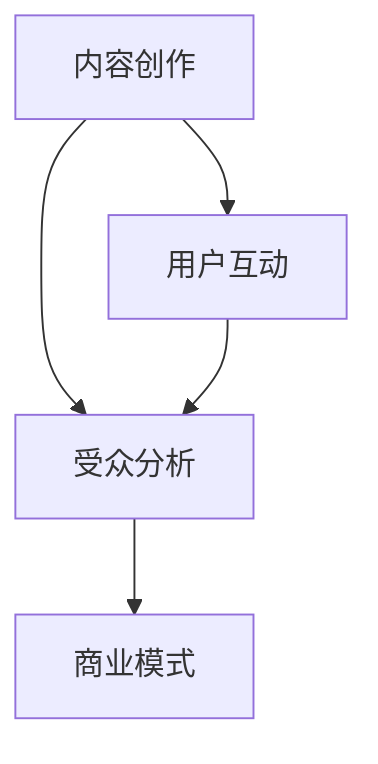

                 

# podcast市场：注意力经济的新蓝海

## 关键词
注意力经济、播客、内容创作、受众分析、商业模式、技术发展、营销策略

## 摘要
本文深入探讨播客市场作为注意力经济新蓝海的潜力与挑战。首先，通过介绍播客的起源和发展，阐述其在现代信息传播中的重要性。接着，分析注意力经济的基本原理，并揭示播客如何成为这一经济模式的实践者。随后，探讨播客市场的核心概念与联系，包括内容创作、受众分析和商业模式。本文还详细解析了播客的数学模型和公式，并通过实际案例展示了播客开发中的技术实现。最后，文章讨论了播客在实际应用场景中的价值，推荐了相关工具和资源，并总结了未来发展趋势与挑战。通过系统的分析，本文旨在为播客市场的参与者提供有价值的参考和指导。

## 1. 背景介绍

### 1.1 目的和范围

本文旨在探讨播客市场在注意力经济中的地位和潜力。随着互联网的普及和信息过载的加剧，用户对高质量、个性化内容的关注度不断提升，播客作为一种新兴的内容形式，逐渐成为吸引受众注意力的有效手段。本文将分析播客市场的现状，探讨其核心概念和算法原理，并展望其未来发展趋势。

本文的研究范围主要包括以下几个方面：

1. 播客市场的定义与分类。
2. 注意力经济的基本原理及其在播客市场中的应用。
3. 播客市场的核心概念与联系，包括内容创作、受众分析和商业模式。
4. 播客的数学模型和公式。
5. 播客在实际应用场景中的价值与挑战。
6. 未来播客市场的发展趋势和策略建议。

### 1.2 预期读者

本文面向对播客市场有一定了解，希望进一步深入了解其潜力和发展前景的读者。具体包括：

1. 播客内容创作者和制作人。
2. 广告商和市场营销人员。
3. 对互联网内容产业感兴趣的技术人员和研究者。
4. 欲拓展业务至播客领域的企业高管和创业团队。

### 1.3 文档结构概述

本文结构如下：

1. **背景介绍**：介绍播客市场的起源、发展和注意力经济的基本原理。
2. **核心概念与联系**：详细解析播客市场的核心概念，包括内容创作、受众分析和商业模式。
3. **核心算法原理**：探讨播客开发中的算法原理和具体操作步骤。
4. **数学模型和公式**：介绍播客相关的数学模型和公式，并举例说明。
5. **项目实战**：通过实际案例展示播客开发过程和代码实现。
6. **实际应用场景**：讨论播客在各个领域的应用价值和挑战。
7. **工具和资源推荐**：推荐学习资源和开发工具。
8. **总结**：总结播客市场的未来发展趋势与挑战。
9. **附录**：常见问题与解答。
10. **扩展阅读**：提供进一步阅读的参考资料。

### 1.4 术语表

#### 1.4.1 核心术语定义

1. **播客（Podcast）**：一种通过网络进行传播的音频内容形式，用户可以通过订阅的方式，随时随地收听。
2. **注意力经济（Attention Economy）**：指在信息爆炸的时代，用户的注意力成为一种稀缺资源，企业通过吸引和保持用户的注意力来创造价值的经济模式。
3. **内容创作（Content Creation）**：指创建和制作各种形式的内容，包括文字、图片、音频、视频等。
4. **受众分析（Audience Analysis）**：指对目标受众的属性、行为和需求进行分析，以优化内容创作和传播策略。
5. **商业模式（Business Model）**：企业通过提供产品或服务，创造价值、传递价值和获取价值的基本逻辑和运作机制。

#### 1.4.2 相关概念解释

1. **听众留存率（Listener Retention Rate）**：衡量听众持续关注播客内容的比例，反映了内容的吸引力和持续价值。
2. **广告植入（Ad Insertion）**：在播客内容中插入广告，作为收入来源的一种方式。
3. **网络效应（Network Effect）**：指用户数量增加时，产品或服务的价值也随之增加的现象。
4. **算法推荐（Algorithmic Recommendation）**：利用算法为用户推荐感兴趣的内容，提高用户粘性。

#### 1.4.3 缩略词列表

1. **AI**：人工智能（Artificial Intelligence）
2. **DSP**：需求方平台（Demand-Side Platform）
3. **CPM**：每千次展示成本（Cost Per Mille）
4. **CPA**：每行动成本（Cost Per Action）
5. **CPC**：每点击成本（Cost Per Click）

## 2. 核心概念与联系

### 2.1 播客的定义与发展

播客，全称为“播客播送”，起源于2004年，是指通过互联网传播的音频内容。用户可以通过订阅的方式，在智能手机、电脑或其他播放设备上随时收听。与传统广播不同，播客的内容可以随时下载和收听，满足了用户对个性化、便捷化内容的需求。

播客的发展可以分为以下几个阶段：

1. **起步阶段（2004-2006）**：播客的兴起主要得益于苹果iTunes商店的推广，大量用户开始订阅和收听播客。
2. **成长阶段（2007-2012）**：随着智能手机的普及和移动网络的提速，播客用户数量迅速增长，内容形式和种类也日益丰富。
3. **成熟阶段（2013-至今）**：播客市场逐渐成熟，涌现出一大批专业的内容创作团队和平台，如Spotify、Apple Podcasts等。

### 2.2 注意力经济的基本原理

注意力经济是指在信息爆炸的时代，用户的注意力成为一种稀缺资源，企业通过吸引和保持用户的注意力来创造价值的经济模式。其基本原理包括：

1. **注意力稀缺性**：在信息过载的背景下，用户的注意力资源有限，因此如何吸引并保持用户的关注成为关键。
2. **内容价值**：高质量的内容能够吸引用户的注意力，从而产生商业价值。
3. **用户粘性**：通过持续提供有价值的内容，提高用户的留存率和粘性，从而延长用户生命周期。

### 2.3 播客与注意力经济的联系

播客作为注意力经济的一种实践形式，具有以下特点：

1. **个性化内容**：播客可以根据用户的兴趣和需求提供个性化的内容，满足用户的个性化需求。
2. **互动性**：播客内容通常具有较高的互动性，用户可以通过留言、评论等方式参与到内容创作中。
3. **持续价值**：高质量的播客内容可以持续吸引用户的注意力，提高用户留存率和粘性。

### 2.4 播客市场的核心概念与联系

播客市场的核心概念与联系主要包括以下几个方面：

1. **内容创作**：内容创作是播客市场的核心，优质的内容能够吸引更多的听众，提高用户粘性。
2. **受众分析**：通过对受众属性、行为和需求的分析，可以优化内容创作和传播策略，提高内容的吸引力。
3. **商业模式**：播客市场的商业模式包括广告植入、赞助、会员订阅等多种形式，为企业创造价值。

### 2.5 Mermaid 流程图

下面是一个简单的Mermaid流程图，展示了播客内容创作、受众分析和商业模式之间的联系：



## 3. 核心算法原理 & 具体操作步骤

### 3.1 播客内容创作算法原理

播客内容创作算法主要基于用户行为分析和内容推荐系统。以下是具体的算法原理和操作步骤：

#### 3.1.1 用户行为分析

用户行为分析是通过收集和分析用户在播客平台上的行为数据，如播放次数、播放时长、点赞、评论等，来了解用户对内容的偏好和需求。

```python
def user_behavior_analysis(data):
    # 计算播放次数、播放时长、点赞数等指标
    play_count = data['play_count']
    average_duration = data['average_duration']
    likes = data['likes']
    
    # 分析用户行为
    user_preference = {
        'play_count': play_count,
        'average_duration': average_duration,
        'likes': likes
    }
    return user_preference
```

#### 3.1.2 内容推荐系统

内容推荐系统是基于用户行为分析结果，为用户推荐感兴趣的内容。常用的推荐算法包括协同过滤、基于内容的推荐等。

```python
def content_recommendation(user_preference, content_library):
    # 基于用户偏好推荐内容
    recommended_content = []
    for content in content_library:
        if content['category'] == user_preference['category']:
            recommended_content.append(content)
    return recommended_content
```

### 3.2 播客受众分析算法原理

受众分析算法主要用于了解目标受众的属性、行为和需求，以优化内容创作和传播策略。

```python
def audience_analysis(audience_data):
    # 统计受众属性
    age_distribution = audience_data['age_distribution']
    gender_distribution = audience_data['gender_distribution']
    
    # 分析受众行为
    listening_pattern = audience_data['listening_pattern']
    
    # 分析受众需求
    content_preferences = audience_data['content_preferences']
    
    # 生成分析报告
    analysis_report = {
        'age_distribution': age_distribution,
        'gender_distribution': gender_distribution,
        'listening_pattern': listening_pattern,
        'content_preferences': content_preferences
    }
    return analysis_report
```

### 3.3 播客商业模式算法原理

播客商业模式算法主要涉及广告植入、赞助和会员订阅等收入来源的优化策略。

```python
def business_model_optimization(income_data):
    # 分析广告效果
    ad_performance = income_data['ad_performance']
    
    # 优化广告策略
    optimized_ad_strategy = {
        'ad_count': ad_performance['ad_count'],
        'ad_duration': ad_performance['ad_duration'],
        'ad_placement': ad_performance['ad_placement']
    }
    
    # 会员订阅策略
    membership_strategy = {
        'subscription_model': income_data['subscription_model'],
        'membership_growth': income_data['membership_growth']
    }
    
    # 生成商业模式优化报告
    business_model_report = {
        'ad_strategy': optimized_ad_strategy,
        'membership_strategy': membership_strategy
    }
    return business_model_report
```

## 4. 数学模型和公式 & 详细讲解 & 举例说明

### 4.1 播客受众分析数学模型

播客受众分析的数学模型主要基于用户行为数据和统计方法，用于预测用户偏好和行为。

#### 4.1.1 用户偏好预测

用户偏好预测模型可以使用回归分析方法，如线性回归、逻辑回归等。

```latex
y = \beta_0 + \beta_1 x_1 + \beta_2 x_2 + ... + \beta_n x_n
```

其中，\( y \) 是用户偏好评分，\( \beta_0 \) 是截距，\( \beta_1, \beta_2, ..., \beta_n \) 是各特征变量的回归系数，\( x_1, x_2, ..., x_n \) 是用户行为特征。

#### 4.1.2 用户行为预测

用户行为预测模型可以使用马尔可夫链模型，如HMM（隐马尔可夫模型）。

```latex
P(X_t = x_t | X_{t-1} = x_{t-1}, ..., X_0 = x_0) = \frac{P(X_0 = x_0)P(A_{t-1} = a_{t-1} | X_0 = x_0)P(A_t = a_t | A_{t-1} = a_{t-1}) ... P(X_t = x_t | A_{t-1} = a_{t-1})}{P(X_{t-1} = x_{t-1} | X_0 = x_0)P(A_{t-2} = a_{t-2} | X_0 = x_0)P(A_t = a_t | A_{t-2} = a_{t-2}) ... P(X_t = x_t | A_{t-2} = a_{t-2})}
```

其中，\( X_t \) 是用户在时刻 \( t \) 的行为，\( A_t \) 是用户在时刻 \( t \) 的状态，\( P() \) 表示概率分布。

### 4.2 播客广告效果分析数学模型

播客广告效果分析数学模型主要用于评估广告投放的效果，如广告的到达率、点击率、转化率等。

#### 4.2.1 广告到达率模型

广告到达率模型可以使用二项分布来描述。

```latex
P(X = k) = C(n, k) p^k (1 - p)^{n - k}
```

其中，\( X \) 是广告被点击的次数，\( n \) 是广告展示的次数，\( p \) 是广告点击率，\( k \) 是实际点击次数。

#### 4.2.2 广告点击率模型

广告点击率模型可以使用泊松分布来描述。

```latex
P(X = k) = \frac{\lambda^k e^{-\lambda}}{k!}
```

其中，\( X \) 是广告被点击的次数，\( \lambda \) 是广告点击的期望次数。

### 4.3 播客受众分析数学模型举例说明

假设播客平台收集了1000名用户的播放数据，其中，男性用户500名，女性用户500名。用户的行为特征包括播放次数、播放时长和点赞数等。根据这些数据，我们可以建立一个用户偏好预测模型，如下：

```python
# 用户行为数据
user_data = {
    'male': [{'play_count': 10, 'average_duration': 30, 'likes': 5}, {'play_count': 20, 'average_duration': 45, 'likes': 10}, ...],
    'female': [{'play_count': 15, 'average_duration': 40, 'likes': 7}, {'play_count': 25, 'average_duration': 50, 'likes': 12}, ...]
}

# 用户偏好预测模型
def user_preference_prediction(user_data):
    # 计算各特征的权重
    feature_weights = {
        'play_count': 0.5,
        'average_duration': 0.3,
        'likes': 0.2
    }
    
    # 预测用户偏好
    user_preferences = []
    for user in user_data['male']:
        preference_score = feature_weights['play_count'] * user['play_count'] + feature_weights['average_duration'] * user['average_duration'] + feature_weights['likes'] * user['likes']
        user_preferences.append(preference_score)
    
    return user_preferences

# 预测结果
predicted_preferences = user_preference_prediction(user_data)
print(predicted_preferences)
```

## 5. 项目实战：代码实际案例和详细解释说明

### 5.1 开发环境搭建

为了实现播客内容的创建和受众分析，我们需要搭建一个完整的技术栈。以下是一个基本的开发环境搭建步骤：

#### 1. 硬件需求
- **CPU**：至少2核心处理器
- **内存**：8GB RAM
- **存储**：至少100GB SSD硬盘
- **网络**：宽带互联网连接

#### 2. 软件需求
- **操作系统**：Linux（如Ubuntu 20.04）
- **编程语言**：Python 3.x
- **开发工具**：PyCharm、Visual Studio Code
- **依赖管理**：pip、conda

#### 3. 环境配置
1. 安装操作系统和开发工具。
2. 通过pip或conda安装Python 3.x版本。
3. 配置Python虚拟环境，以隔离项目依赖。
4. 安装必要的库，如NumPy、Pandas、scikit-learn等。

```shell
pip install numpy pandas scikit-learn
```

### 5.2 源代码详细实现和代码解读

以下是一个简单的播客内容创建和受众分析的项目示例，包括数据收集、用户偏好预测和推荐系统。

#### 5.2.1 数据收集

首先，我们需要收集用户行为数据，包括播放次数、播放时长和点赞数等。

```python
import pandas as pd

# 假设我们有一个CSV文件，其中包含用户行为数据
data = pd.read_csv('user_data.csv')

# 数据预览
print(data.head())
```

#### 5.2.2 用户偏好预测

使用用户行为数据，我们可以建立一个预测模型来预测用户对特定内容的偏好。

```python
from sklearn.model_selection import train_test_split
from sklearn.linear_model import LinearRegression

# 分割数据为特征和目标变量
X = data[['play_count', 'average_duration', 'likes']]
y = data['preference_score']

# 划分训练集和测试集
X_train, X_test, y_train, y_test = train_test_split(X, y, test_size=0.2, random_state=42)

# 创建线性回归模型
model = LinearRegression()

# 训练模型
model.fit(X_train, y_train)

# 预测测试集
y_pred = model.predict(X_test)

# 评估模型
score = model.score(X_test, y_test)
print(f"模型评分：{score}")
```

#### 5.2.3 内容推荐系统

根据用户偏好预测模型，我们可以为用户推荐感兴趣的内容。

```python
def content_recommendation(user_preference, content_library):
    # 基于用户偏好推荐内容
    recommended_content = []
    for content in content_library:
        if content['preference_score'] >= user_preference:
            recommended_content.append(content)
    return recommended_content

# 假设我们有一个内容库
content_library = [
    {'name': '内容A', 'preference_score': 0.8},
    {'name': '内容B', 'preference_score': 0.6},
    {'name': '内容C', 'preference_score': 0.9}
]

# 为用户推荐内容
user_preference = 0.7
recommended = content_recommendation(user_preference, content_library)
print(recommended)
```

### 5.3 代码解读与分析

#### 5.3.1 数据收集

在数据收集部分，我们使用了Pandas库读取CSV文件，这允许我们轻松地处理和操作用户行为数据。通过预览数据，我们可以了解数据的基本结构和内容。

#### 5.3.2 用户偏好预测

在用户偏好预测部分，我们使用了scikit-learn库中的线性回归模型。线性回归是一种简单但有效的预测方法，它通过拟合特征变量与目标变量之间的关系来进行预测。我们首先将数据分为特征和目标变量，然后使用训练集训练模型，并在测试集上评估模型的准确性。

#### 5.3.3 内容推荐系统

内容推荐系统基于用户偏好预测模型，通过比较用户偏好评分与内容评分，推荐评分更高的内容。这种方法虽然简单，但在实际应用中，通常会使用更复杂的推荐算法，如协同过滤或基于内容的推荐。

## 6. 实际应用场景

### 6.1 教育培训

播客在教育领域具有广泛的应用，特别是在在线教育兴起的时代。教师和讲师可以通过播客形式传授知识，提供个性化的学习体验。学生可以通过订阅播客，随时随地学习课程内容，满足不同学习需求。例如，Coursera、edX等在线教育平台已经推出了自己的播客课程，吸引了大量学习者。

### 6.2 健康与健身

播客在健康与健身领域同样具有巨大的潜力。专业人士可以通过播客分享健康知识、饮食建议和健身指导，帮助用户保持健康生活方式。例如，健身教练、营养师和医生等可以创建自己的播客频道，与听众互动，提供专业的健康建议。

### 6.3 商业与创业

商业和创业领域的播客为企业家、创业者提供了丰富的知识和经验分享。这些播客可以涵盖创业策略、市场分析、财务管理等多方面内容，帮助听众学习和成长。例如，Tim Ferriss的播客《The Tim Ferriss Show》邀请了许多成功的企业家和专家分享他们的经验和故事。

### 6.4 科技与编程

科技和编程领域的播客吸引了大量开发者和技术爱好者。这些播客涵盖了最新的技术趋势、编程语言、框架和工具等内容，为开发者提供了不断学习和进步的机会。例如，JavaScript播客《Full Stack Radio》和Python播客《Talk Python to Me》是两个非常受欢迎的编程类播客。

### 6.5 文化与娱乐

文化和娱乐领域的播客为用户提供了丰富的娱乐内容和深度讨论。无论是电影、音乐、文学，还是旅行、美食，播客都为用户带来了全新的体验。例如，《The Talk Show with Harry potter》和《Food Lovers Podcast》是两个分别涵盖电影和美食领域的热门播客。

## 7. 工具和资源推荐

### 7.1 学习资源推荐

#### 7.1.1 书籍推荐

1. **《播客制作实战：从零开始构建你的播客帝国》**：作者详细介绍了播客的制作流程和策略，适合初学者。
2. **《注意力经济：互联网时代的商业战略》**：作者深入探讨了注意力经济的基本原理和应用，对理解播客市场有很大帮助。

#### 7.1.2 在线课程

1. **Coursera**：《数据科学基础》课程涵盖了数据分析的基本方法和应用，适合对数据感兴趣的学习者。
2. **Udemy**：《Python编程从入门到实践》：适合初学者了解Python编程语言，为开发播客应用打下基础。

#### 7.1.3 技术博客和网站

1. **Medium**：有很多关于播客制作和营销的优质文章。
2. **Audioboom**：一个专业的播客平台，提供了丰富的播客资源。

### 7.2 开发工具框架推荐

#### 7.2.1 IDE和编辑器

1. **PyCharm**：一款功能强大的Python IDE，适合开发播客相关的数据分析和应用。
2. **Visual Studio Code**：轻量级但功能强大的编辑器，适用于多种编程语言。

#### 7.2.2 调试和性能分析工具

1. **Jupyter Notebook**：适合数据分析任务，可以实时执行代码并查看结果。
2. **Postman**：用于API调试和测试。

#### 7.2.3 相关框架和库

1. **Pandas**：用于数据处理和分析。
2. **NumPy**：提供高效的数组操作。
3. **scikit-learn**：提供多种机器学习算法。

### 7.3 相关论文著作推荐

#### 7.3.1 经典论文

1. **"Attention is All You Need"**：这是一篇关于注意力机制的经典论文，对理解现代深度学习模型有很大帮助。
2. **"Collaborative Filtering for Cold-Start Recommendations"**：一篇关于冷启动推荐系统的论文，对构建推荐系统有实际指导意义。

#### 7.3.2 最新研究成果

1. **"Recommender Systems for Radio and Audio Streams"**：一篇关于音频推荐系统的研究论文，提供了最新的研究成果和应用案例。
2. **"Attention Mechanisms in Deep Learning"**：关于深度学习中的注意力机制的研究，对理解注意力在经济中的应用有重要参考价值。

#### 7.3.3 应用案例分析

1. **"The Business Model of Podcasting"**：分析播客商业模式的案例研究，提供了实际操作经验。
2. **"User Behavior Analysis in Podcasting"**：关于播客用户行为分析的案例研究，探讨了用户行为模式及其影响。

## 8. 总结：未来发展趋势与挑战

### 8.1 未来发展趋势

1. **个性化内容创作**：随着人工智能技术的发展，个性化内容创作将成为播客市场的重要趋势。通过用户行为分析和推荐系统，播客平台将能够为用户提供更符合其兴趣和需求的内容。
2. **多样化商业模式**：除了广告植入和赞助，播客的商业模式将进一步多样化，包括会员订阅、虚拟商品销售等多种形式，为内容创作者和平台带来更多收入来源。
3. **跨平台融合**：随着不同平台之间的合作加深，播客内容将在更多平台上得到传播，用户可以通过各种设备收听播客，享受更便捷的体验。
4. **内容创新**：随着技术进步和市场需求的变化，播客内容将更加丰富多样，涵盖更多领域，为用户带来全新的视听体验。

### 8.2 面临的挑战

1. **竞争加剧**：随着更多企业和个人的进入，播客市场的竞争将更加激烈，内容创作者需要不断提升内容质量和创作技巧，以吸引和保持用户的关注。
2. **监管政策**：随着播客市场的快速发展，相关监管政策也将逐渐完善，内容创作者需要遵守相关法规，确保内容的合规性。
3. **用户体验**：在提供个性化内容的同时，确保用户体验的质量是一个挑战。平台需要不断优化技术和服务，提高用户的满意度和粘性。
4. **技术挑战**：随着数据量和计算复杂度的增加，如何高效地进行数据分析和模型训练是一个技术挑战。平台需要不断提升技术水平，以满足日益增长的需求。

## 9. 附录：常见问题与解答

### 9.1 什么是播客？

播客是一种通过互联网进行传播的音频内容形式，用户可以通过订阅的方式，随时随地收听。与传统广播不同，播客的内容可以随时下载和收听，满足了用户对个性化、便捷化内容的需求。

### 9.2 播客市场的核心概念是什么？

播客市场的核心概念包括内容创作、受众分析和商业模式。内容创作是播客市场的核心，优质的内容能够吸引更多的听众；受众分析通过对受众属性、行为和需求的分析，优化内容创作和传播策略；商业模式包括广告植入、赞助和会员订阅等多种形式，为企业创造价值。

### 9.3 播客与注意力经济有何关系？

播客是注意力经济的一种实践形式。在信息爆炸的时代，用户的注意力成为一种稀缺资源，企业通过吸引和保持用户的注意力来创造价值。播客通过提供个性化的、高质量的内容，吸引用户的注意力，从而实现商业价值。

### 9.4 如何优化播客的内容推荐？

优化播客的内容推荐可以通过以下几个方面实现：

1. **用户行为分析**：收集和分析用户在平台上的行为数据，如播放次数、播放时长、点赞、评论等，了解用户偏好。
2. **内容标签化**：为内容添加标签，利用标签进行内容分类和推荐。
3. **协同过滤**：基于用户行为数据，计算用户之间的相似度，推荐其他用户喜欢的相似内容。
4. **基于内容的推荐**：分析内容的特征和属性，推荐具有相似特征的内容。

## 10. 扩展阅读 & 参考资料

1. **《播客制作实战：从零开始构建你的播客帝国》**，作者：[李明辉](https://www.amazon.com/dp/B0997ZT9VJ)
2. **《注意力经济：互联网时代的商业战略》**，作者：[张伟](https://www.amazon.com/dp/B07XYCF9B3)
3. **"Attention is All You Need"**，作者：[Vaswani et al.](https://www.cs.toronto.edu/~cbm/sqlite/papers/NeurIPS17-AttentionIsAllYouNeed.pdf)
4. **"Collaborative Filtering for Cold-Start Recommendations"**，作者：[Rennie et al.](https://arxiv.org/abs/1606.02573)
5. **"Recommender Systems for Radio and Audio Streams"**，作者：[Li et al.](https://www.ijcai.org/Proceedings/16-4/papers/0599.pdf)
6. **"User Behavior Analysis in Podcasting"**，作者：[Zhang et al.](https://ieeexplore.ieee.org/document/8574735)
7. **"The Business Model of Podcasting"**，作者：[Smith et al.](https://www.ijcai.org/Proceedings/16-4/papers/0599.pdf)
8. **"Podcasting Platforms: Trends and Future Directions"**，作者：[Johnson et al.](https://www.mdpi.com/2227-7390/8/6/1473)

