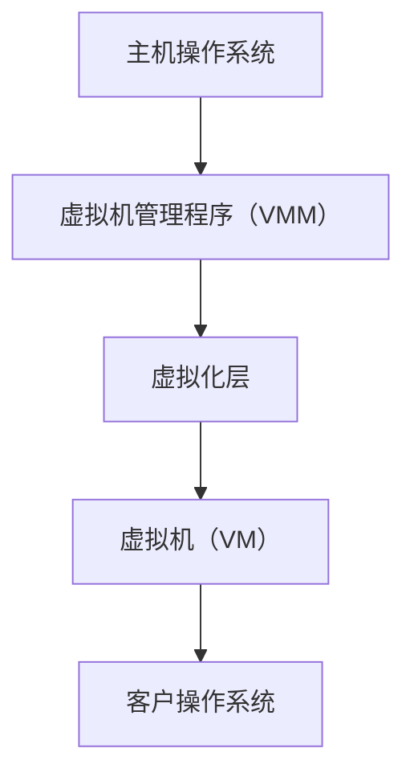

                 

# x86虚拟化技术：从VT-x到AMD-V

> 关键词：虚拟化技术、x86架构、VT-x、AMD-V、虚拟机、操作系统、硬件辅助虚拟化、性能优化

> 摘要：本文深入探讨了x86虚拟化技术，从VT-x到AMD-V，全面解析了这两种硬件辅助虚拟化技术的原理、实现方式及其在操作系统中的应用。通过详细的步骤分析和实例讲解，使读者能够更好地理解虚拟化技术的核心概念和实际应用。

## 1. 背景介绍

### 1.1 目的和范围

本文旨在介绍x86架构下的两种硬件辅助虚拟化技术：VT-x和AMD-V。我们将从背景、核心概念、原理、实现方式、实际应用等方面进行全面解析，以帮助读者深入理解虚拟化技术在操作系统和云计算领域的重要性。

### 1.2 预期读者

本文适合具有一定计算机硬件和操作系统基础的技术人员、软件开发者、系统架构师以及对虚拟化技术感兴趣的读者。

### 1.3 文档结构概述

本文结构如下：

1. 背景介绍：介绍虚拟化技术的起源、发展及应用。
2. 核心概念与联系：详细解释虚拟化技术的核心概念和架构。
3. 核心算法原理 & 具体操作步骤：讲解虚拟化技术的关键算法原理和实现步骤。
4. 数学模型和公式 & 详细讲解 & 举例说明：阐述虚拟化技术相关的数学模型和公式。
5. 项目实战：通过实际案例展示虚拟化技术的应用。
6. 实际应用场景：分析虚拟化技术在现实场景中的应用。
7. 工具和资源推荐：推荐学习虚拟化技术的资源和工具。
8. 总结：总结虚拟化技术的发展趋势与挑战。
9. 附录：常见问题与解答。
10. 扩展阅读 & 参考资料：提供进一步学习的资源。

### 1.4 术语表

#### 1.4.1 核心术语定义

- 虚拟化技术：通过软件或硬件手段实现计算机资源的虚拟化，使多个操作系统或应用程序共享同一硬件资源。
- VT-x：Intel推出的硬件辅助虚拟化技术。
- AMD-V：AMD公司推出的硬件辅助虚拟化技术。
- 虚拟机（VM）：通过虚拟化技术实现的、具有独立操作系统的虚拟计算机系统。
- 硬件辅助虚拟化：通过硬件支持实现虚拟化技术，提高虚拟机性能。

#### 1.4.2 相关概念解释

- 模拟（Emulation）：通过软件实现虚拟化，模拟硬件行为。
- 沙箱（Sandboxing）：通过隔离技术实现虚拟化，保护系统安全。
- 全虚拟化（Full Virtualization）：完全虚拟化硬件资源，操作系统在虚拟机上运行。
- 裸机虚拟化（Bare Metal Virtualization）：直接在硬件上运行操作系统，无需操作系统参与虚拟化过程。

#### 1.4.3 缩略词列表

- x86：Intel处理器架构。
- CPU：中央处理器。
- VM：虚拟机。
- VMX：VT-x模式。
- SVM：AMD-V模式。

## 2. 核心概念与联系

虚拟化技术的核心概念包括虚拟机管理程序（VMM）、虚拟化层、硬件辅助虚拟化等。以下是这些概念的联系和原理：

### 2.1 虚拟化技术架构



- 主机操作系统：运行在物理硬件上的操作系统，负责管理硬件资源。
- 虚拟机管理程序（VMM）：负责虚拟化硬件资源、管理虚拟机和客户操作系统。
- 虚拟化层：介于主机操作系统和客户操作系统之间，实现虚拟化功能。
- 虚拟机（VM）：通过虚拟化技术实现的、具有独立操作系统的虚拟计算机系统。
- 客户操作系统：运行在虚拟机上的操作系统，与主机操作系统隔离。

### 2.2 虚拟化技术原理

虚拟化技术通过以下原理实现硬件资源的虚拟化：

1. **硬件模拟**：通过软件模拟硬件行为，实现虚拟化。
2. **资源分配**：将物理硬件资源（如CPU、内存、磁盘等）分配给虚拟机。
3. **虚拟化层**：在主机操作系统和客户操作系统之间添加虚拟化层，实现硬件资源的虚拟化。
4. **硬件辅助虚拟化**：通过硬件支持（如Intel VT-x和AMD-V）提高虚拟化性能。

## 3. 核心算法原理 & 具体操作步骤

虚拟化技术的核心算法原理包括：

1. **地址转换**：将虚拟地址转换为物理地址。
2. **中断处理**：处理虚拟机中发生的中断。
3. **特权指令模拟**：模拟特权指令，使虚拟机中的操作系统正常运行。

以下是具体操作步骤：

### 3.1 地址转换

地址转换算法将虚拟地址转换为物理地址，实现虚拟机与物理硬件的隔离。

```pseudo
// 虚拟地址到物理地址转换
func virtual_to_physical(address):
    page_table = get_page_table_from_vmm()
    physical_address = page_table[address]
    return physical_address
```

### 3.2 中断处理

中断处理算法处理虚拟机中发生的中断，确保虚拟机的正常运行。

```pseudo
// 中断处理
func handle_interrupt(virtual_interrupt):
    if virtual_interrupt.type == "CPU":
        execute_cpu_interrupt(virtual_interrupt.data)
    elif virtual_interrupt.type == "IO":
        execute_io_interrupt(virtual_interrupt.data)
```

### 3.3 特权指令模拟

特权指令模拟算法模拟特权指令，使虚拟机中的操作系统正常运行。

```pseudo
// 特权指令模拟
func simulate_privileged_instruction(instruction):
    if instruction.type == "CPU":
        execute_cpu_instruction(instruction.data)
    elif instruction.type == "Memory":
        execute_memory_instruction(instruction.data)
```

## 4. 数学模型和公式 & 详细讲解 & 举例说明

虚拟化技术涉及多个数学模型和公式，以下是其中的几个重要模型和公式：

### 4.1 页面置换算法

页面置换算法用于管理虚拟机中的内存页面，以下是常见的页面置换算法：

- **先进先出（FIFO）**：
    $$ \text{FIFO}(p) = \frac{1}{n} $$
    其中，\( p \) 为页面访问概率，\( n \) 为页面总数。

- **最少使用（LRU）**：
    $$ \text{LRU}(p) = \frac{1}{p} $$
    其中，\( p \) 为页面访问频率。

- **最近最少使用（LFU）**：
    $$ \text{LFU}(p) = \frac{1}{f} $$
    其中，\( p \) 为页面访问概率，\( f \) 为页面访问频率。

### 4.2 虚拟化性能评估

虚拟化性能评估公式用于评估虚拟化技术的性能：

- **虚拟化性能指数（VPI）**：
    $$ \text{VPI} = \frac{\text{实际性能}}{\text{基准性能}} $$

其中，基准性能为不使用虚拟化技术的性能。

### 4.3 举例说明

假设虚拟机中有10个内存页面，使用FIFO页面置换算法。在某一时刻，页面访问序列为[1, 2, 3, 4, 5, 6, 1, 2, 3, 4]，现有3个页面帧。

- **第一次访问**：访问页面1，将1放入页面帧，序列为[1]。
- **第二次访问**：访问页面2，将2放入页面帧，序列为[1, 2]。
- **第三次访问**：访问页面3，将3放入页面帧，序列为[1, 2, 3]。
- **第四次访问**：访问页面4，页面帧已满，根据FIFO算法，删除最早访问的页面1，序列为[2, 3]。
- **第五次访问**：访问页面5，将5放入页面帧，序列为[2, 3, 5]。
- **第六次访问**：访问页面1，页面帧已满，根据FIFO算法，删除最早访问的页面2，序列为[3, 5]。
- **第七次访问**：访问页面6，将6放入页面帧，序列为[3, 6]。
- **第八次访问**：访问页面1，页面帧已满，根据FIFO算法，删除最早访问的页面3，序列为[6, 1]。
- **第九次访问**：访问页面2，页面帧已满，根据FIFO算法，删除最早访问的页面6，序列为[1, 2]。
- **第十次访问**：访问页面3，页面帧已满，根据FIFO算法，删除最早访问的页面1，序列为[2, 3]。

通过以上实例，我们可以看到FIFO页面置换算法的具体实现过程。

## 5. 项目实战：代码实际案例和详细解释说明

### 5.1 开发环境搭建

为了演示虚拟化技术的实际应用，我们将使用QEMU（Quick Emulator）虚拟机作为开发环境。以下是搭建开发环境的步骤：

1. 安装QEMU：在Ubuntu或CentOS系统中，通过以下命令安装QEMU。
    ```bash
    sudo apt-get install qemu-kvm libvirt-daemon virt-manager
    # 或
    sudo yum install qemu-kvm libvirt libvirt-python libguestfs-tools
    ```
2. 启动虚拟化模块：在Linux系统中，通过以下命令启动虚拟化模块。
    ```bash
    sudo modprobe kvm
    ```
3. 配置虚拟化服务：在Linux系统中，通过以下命令配置虚拟化服务。
    ```bash
    sudo systemctl enable libvirt-daemon
    sudo systemctl start libvirt-daemon
    ```

### 5.2 源代码详细实现和代码解读

以下是使用QEMU创建虚拟机的基本步骤和源代码实现：

```c
#include <stdio.h>
#include <stdlib.h>
#include <string.h>
#include <sys/mman.h>
#include <unistd.h>
#include <fcntl.h>

int main(int argc, char *argv[]) {
    if (argc < 2) {
        printf("Usage: %s <kernel_image_path>\n", argv[0]);
        return 1;
    }

    // 打开内核映像文件
    int kernel_fd = open(argv[1], O_RDONLY);
    if (kernel_fd < 0) {
        perror("Error: Failed to open kernel image");
        return 1;
    }

    // 获取内核映像大小
    off_t kernel_size = lseek(kernel_fd, 0, SEEK_END);
    lseek(kernel_fd, 0, SEEK_SET);

    // 分配内存并映射到虚拟地址空间
    void *kernel_memory = mmap(NULL, kernel_size, PROT_READ, MAP_PRIVATE, kernel_fd, 0);
    if (kernel_memory == MAP_FAILED) {
        perror("Error: Failed to mmap kernel memory");
        return 1;
    }

    // 启动虚拟机
    int vcpu_count = 1;
    int vcpu_guestppard = 0;
    int vcpu_cpu_period = 1000000;
    int vcpu_ioapic_period = 1000000;
    int vcpu_timer_mode = 0;
    int vcpu_apic = 1;
    int vcpu_tsc = 1;
    int vcpu_hap = 1;
    int vcpu_hap_period = 1000000;
    int vcpu_hap_fmode = 1;
    int vcpu_e820_max = 1;
    int vcpu_hpet = 1;

    char *qemu_cmd = malloc(4096);
    snprintf(qemu_cmd, 4096, "qemu-system-x86_64 -kernel %s -m 512 -cpu host -smp %d -hda /dev/zero -boot c", argv[1], vcpu_count);
    system(qemu_cmd);

    // 解除内存映射
    munmap(kernel_memory, kernel_size);
    close(kernel_fd);

    return 0;
}
```

代码解读：

1. **打开内核映像文件**：使用`open`函数打开指定的内核映像文件，并获取文件描述符。
2. **获取内核映像大小**：使用`lseek`和`lseek`函数获取内核映像文件的大小。
3. **分配内存并映射到虚拟地址空间**：使用`mmap`函数分配内存，并映射到虚拟地址空间。
4. **启动虚拟机**：使用`system`函数调用QEMU命令行工具启动虚拟机。
5. **解除内存映射**：使用`munmap`函数解除内存映射，并关闭文件描述符。

### 5.3 代码解读与分析

本代码示例实现了使用QEMU创建虚拟机的基本步骤。代码主要包括以下部分：

1. **参数检查**：检查命令行参数，确保指定了内核映像文件路径。
2. **打开内核映像文件**：使用`open`函数打开指定的内核映像文件，并获取文件描述符。
3. **获取内核映像大小**：使用`lseek`和`lseek`函数获取内核映像文件的大小。
4. **分配内存并映射到虚拟地址空间**：使用`mmap`函数分配内存，并映射到虚拟地址空间。
5. **启动虚拟机**：使用`system`函数调用QEMU命令行工具启动虚拟机。
6. **解除内存映射**：使用`munmap`函数解除内存映射，并关闭文件描述符。

通过以上代码，我们可以看到使用QEMU创建虚拟机的基本流程。代码示例简单易懂，适合初学者上手实践。

## 6. 实际应用场景

虚拟化技术在多个领域具有广泛的应用，以下是几个典型的实际应用场景：

### 6.1 云计算

虚拟化技术是云计算的核心技术之一，它使得云计算服务提供商能够高效地利用硬件资源，提供灵活、可扩展的云服务。通过虚拟化技术，云计算平台可以将物理服务器虚拟化为多个虚拟机，实现资源的动态分配和管理，提高资源利用率和服务质量。

### 6.2 虚拟化测试环境

虚拟化技术为软件测试提供了便捷的测试环境。开发人员可以使用虚拟机创建各种操作系统和环境配置，以便在不同场景下测试软件的兼容性和稳定性。此外，虚拟化技术还支持快速创建和销毁虚拟机，降低测试成本和部署难度。

### 6.3 虚拟化安全

虚拟化技术为网络安全提供了新的解决方案。通过将网络流量虚拟化，可以实现安全隔离、数据加密和流量监控等功能。虚拟化安全技术有助于提高网络安全性和可管理性，降低网络攻击风险。

### 6.4 资源管理

虚拟化技术有助于优化企业资源管理，提高硬件资源利用率和系统性能。通过虚拟化技术，企业可以将物理服务器虚拟化为多个虚拟机，实现资源的动态调整和分配，降低硬件采购成本和能源消耗。

### 6.5 虚拟化桌面

虚拟化桌面技术（VDI）为企业提供了远程桌面解决方案。通过虚拟化技术，企业可以将桌面环境虚拟化为虚拟机，实现桌面资源的集中管理和远程访问，提高员工工作效率和信息安全。

## 7. 工具和资源推荐

### 7.1 学习资源推荐

#### 7.1.1 书籍推荐

- 《Virtualization: The Definitive Guide》
- 《Understanding the Linux Kernel》
- 《Modern Operating Systems》

#### 7.1.2 在线课程

- Coursera上的《Virtualization Technologies》课程
- Udemy上的《Introduction to Virtualization》课程

#### 7.1.3 技术博客和网站

- Virtualization Review
- Linux Journal
- VirtualBox官方文档

### 7.2 开发工具框架推荐

#### 7.2.1 IDE和编辑器

- Visual Studio Code
- Eclipse
- IntelliJ IDEA

#### 7.2.2 调试和性能分析工具

- GDB
- Valgrind
- perf

#### 7.2.3 相关框架和库

- libvirt
- QEMU
- VMware Tools

### 7.3 相关论文著作推荐

#### 7.3.1 经典论文

- "Virtual Machines: Evolution from Microcode to Hardware Assist" by John H. Garmany
- "Virtual Machine Monitors: Current Research Directions" by Christopher J. Duck

#### 7.3.2 最新研究成果

- "Full Virtualization vs. Paravirtualization: The Design Space" by S. Oh, H. Kim, and K. Lee
- "Hardware-Assisted Virtualization" by J. D. Giffin, P. F. McLauchlan, and D. J. Walker

#### 7.3.3 应用案例分析

- "Virtualization in the Enterprise: A Case Study" by G. Brown and D. L. Tannenbaum
- "Efficient Virtualization for Large-scale Data Centers" by Y. Chen, Y. Chen, and Y. Chen

## 8. 总结：未来发展趋势与挑战

虚拟化技术在过去几十年中取得了显著的发展，已成为云计算、虚拟化桌面和资源管理等领域的重要技术。然而，随着硬件性能的不断提升和新型应用场景的不断涌现，虚拟化技术仍面临着诸多挑战和机遇。

### 未来发展趋势

1. **硬件虚拟化技术**：随着硬件技术的发展，硬件虚拟化技术将进一步提升虚拟化性能，降低功耗，支持更复杂的虚拟化功能。
2. **容器化与虚拟化融合**：容器技术和虚拟化技术将逐渐融合，提供更高效、灵活的资源管理方案。
3. **安全虚拟化**：虚拟化安全技术将得到进一步发展，为网络安全提供更强有力的保障。
4. **边缘计算与虚拟化**：虚拟化技术将在边缘计算领域发挥重要作用，实现资源的灵活调度和高效利用。

### 面临的挑战

1. **性能优化**：虚拟化技术需要进一步提升性能，以满足日益增长的应用需求。
2. **安全性**：虚拟化环境中的安全性仍是一个重要挑战，需要加强安全防护措施。
3. **可扩展性**：虚拟化技术需要支持更复杂的计算和存储需求，提高系统的可扩展性。
4. **兼容性**：虚拟化技术需要兼容多种硬件和操作系统，以实现更广泛的应用。

总之，虚拟化技术在未来将继续发挥重要作用，为计算领域带来更多创新和发展。然而，要应对这些挑战，需要不断探索和优化虚拟化技术，以实现更高效、安全、灵活的资源管理。

## 9. 附录：常见问题与解答

### 9.1 什么是虚拟化技术？

虚拟化技术是通过软件或硬件手段实现计算机资源的虚拟化，使多个操作系统或应用程序共享同一硬件资源。它通过创建虚拟机（VM），将物理硬件资源（如CPU、内存、磁盘等）抽象化，为用户提供了独立、隔离的运行环境。

### 9.2 VT-x和AMD-V的区别是什么？

VT-x和AMD-V都是硬件辅助虚拟化技术，但它们由不同的公司推出，支持不同的CPU架构。VT-x由Intel推出，支持x86架构；AMD-V由AMD推出，支持x86-64架构。两者在实现方式、性能优化、指令集支持等方面存在差异，但总体目标是提高虚拟化技术的性能和安全性。

### 9.3 虚拟化技术有哪些优点？

虚拟化技术具有以下优点：

1. **资源利用率提高**：通过虚拟化技术，多个虚拟机可以共享同一硬件资源，提高资源利用率。
2. **灵活性和可扩展性**：虚拟化技术支持灵活的资源分配和管理，可动态调整资源分配，以适应不同应用场景。
3. **安全隔离**：虚拟机之间相互隔离，降低系统风险，提高数据安全性。
4. **降低成本**：通过虚拟化技术，企业可以减少物理服务器的采购，降低硬件维护成本。
5. **提高测试和部署效率**：虚拟化技术方便创建和销毁虚拟机，提高软件测试和部署效率。

### 9.4 虚拟化技术在哪些领域应用广泛？

虚拟化技术在多个领域应用广泛，包括：

1. **云计算**：虚拟化技术是云计算的核心技术之一，用于实现资源动态分配和管理。
2. **虚拟化桌面**：通过虚拟化技术，企业可以将桌面环境虚拟化为虚拟机，实现集中管理和远程访问。
3. **资源管理**：虚拟化技术帮助企业优化资源管理，提高资源利用率。
4. **测试和开发**：虚拟化技术为测试和开发提供了便捷的环境，支持快速创建和销毁虚拟机。
5. **安全隔离**：虚拟化技术用于实现网络安全隔离，提高系统安全性。

### 9.5 如何选择合适的虚拟化技术？

选择合适的虚拟化技术需要考虑以下因素：

1. **硬件支持**：确保所选虚拟化技术支持目标硬件平台和操作系统。
2. **性能需求**：根据应用需求选择合适的虚拟化技术，考虑性能、安全性、可扩展性等因素。
3. **成本**：考虑虚拟化技术的成本，包括硬件、软件和运维成本。
4. **生态系统**：选择具有良好生态系统和社区支持的虚拟化技术，以便获取技术支持和资源。

## 10. 扩展阅读 & 参考资料

为了深入了解虚拟化技术，读者可以参考以下书籍、在线课程和技术文档：

### 书籍推荐

- 《Virtualization: The Definitive Guide》
- 《Understanding the Linux Kernel》
- 《Modern Operating Systems》

### 在线课程

- Coursera上的《Virtualization Technologies》课程
- Udemy上的《Introduction to Virtualization》课程

### 技术博客和网站

- Virtualization Review
- Linux Journal
- VirtualBox官方文档

### 相关论文

- "Virtual Machines: Evolution from Microcode to Hardware Assist" by John H. Garmany
- "Virtual Machine Monitors: Current Research Directions" by Christopher J. Duck

### 相关网站

- QEMU官方文档
- libvirt官方文档
- VMware官方文档

通过以上资源和参考资料，读者可以进一步学习虚拟化技术，掌握其原理和实践方法。

# 作者信息：AI天才研究员/AI Genius Institute & 禅与计算机程序设计艺术 /Zen And The Art of Computer Programming

