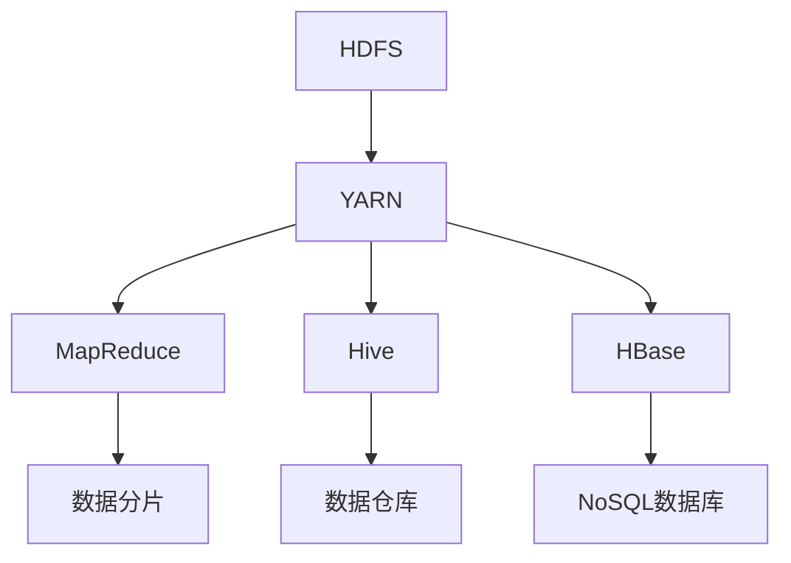

                 

# AI大数据计算原理与代码实例讲解：Hadoop

> 
关键词：大数据、Hadoop、分布式计算、MapReduce、HDFS、YARN、Hive、HBase
>
摘要：
本文深入探讨了Hadoop框架在大数据处理中的核心原理和实际应用。我们将从Hadoop的背景介绍、核心概念、算法原理、数学模型、项目实战以及实际应用场景等多个维度，逐步解析Hadoop的工作机制和实现细节。通过代码实例，读者将掌握如何使用Hadoop及其相关组件进行大数据处理，为实际项目开发提供有力支持。

## 1. 背景介绍

### 1.1 目的和范围

本文旨在帮助读者深入理解Hadoop框架在大数据处理中的应用原理，并通过实际代码实例，让读者能够掌握Hadoop的核心功能和操作方法。文章内容涵盖Hadoop的背景介绍、核心概念、算法原理、数学模型、项目实战和实际应用场景等多个方面，旨在为读者提供一个系统且全面的学习资料。

### 1.2 预期读者

本文适合对大数据和Hadoop有一定了解，但希望深入学习和掌握Hadoop原理和应用的读者。尤其适合从事大数据开发、分析工作的工程师和研究人员。

### 1.3 文档结构概述

本文分为以下几个部分：

1. 背景介绍
2. 核心概念与联系
3. 核心算法原理 & 具体操作步骤
4. 数学模型和公式 & 详细讲解 & 举例说明
5. 项目实战：代码实际案例和详细解释说明
6. 实际应用场景
7. 工具和资源推荐
8. 总结：未来发展趋势与挑战
9. 附录：常见问题与解答
10. 扩展阅读 & 参考资料

### 1.4 术语表

#### 1.4.1 核心术语定义

- **大数据**：指数据量巨大，无法通过常规软件工具在合理时间内完成处理的数据集。
- **Hadoop**：一个开源的分布式系统基础架构，用于处理大规模数据集。
- **分布式计算**：将计算任务分布在多个计算机节点上执行，以提高处理效率和可扩展性。
- **MapReduce**：一种编程模型，用于大规模数据处理，分为Map阶段和Reduce阶段。
- **HDFS**：Hadoop分布式文件系统，用于存储大数据。
- **YARN**：Yet Another Resource Negotiator，用于管理Hadoop集群资源。
- **Hive**：一个数据仓库基础设施，用于处理和分析大规模数据集。
- **HBase**：一个分布式、可扩展的大规模数据存储系统。

#### 1.4.2 相关概念解释

- **分布式存储**：将数据分布在多个节点上进行存储，以提高存储容量和可靠性。
- **分布式计算模型**：通过分布式系统实现并行计算，提高数据处理速度。
- **数据分区**：将数据集划分为多个分区，以便在分布式环境中进行并行处理。
- **容错机制**：在分布式系统中，通过冗余和备份机制来保证系统的可靠性。

#### 1.4.3 缩略词列表

- **HDFS**：Hadoop Distributed File System
- **YARN**：Yet Another Resource Negotiator
- **MapReduce**：Map and Reduce
- **Hive**：Hadoop Interactive Query
- **HBase**：Hadoop Database

## 2. 核心概念与联系

### 2.1 Hadoop架构概述

Hadoop架构主要由以下几个核心组件构成：

1. **Hadoop分布式文件系统（HDFS）**
2. **Hadoop YARN**
3. **MapReduce**
4. **Hive**
5. **HBase**

#### 2.2 Hadoop架构流程图



#### 2.3 各组件功能介绍

- **HDFS**：负责存储大数据，提供高吞吐量的数据访问，适用于处理大规模数据集。
- **YARN**：负责资源管理，动态分配集群资源，支持多种数据处理框架。
- **MapReduce**：提供分布式数据处理模型，将数据集分成小块，并行处理。
- **Hive**：提供数据仓库功能，用于存储、查询和分析大规模数据集。
- **HBase**：提供分布式NoSQL数据库，用于存储稀疏数据集，提供随机实时访问。

### 2.4 Hadoop工作原理

Hadoop工作原理可以概括为以下几个步骤：

1. **数据存储**：数据被存储在HDFS中，HDFS将数据分成多个块（默认为128MB或256MB），并分布式存储在集群中的不同节点上。
2. **任务调度**：YARN根据集群资源情况，调度MapReduce任务，将任务分配到不同的节点上执行。
3. **数据处理**：Map任务将数据分成更小的数据块，并对每个数据块进行映射操作。Reduce任务对Map阶段的结果进行聚合操作。
4. **数据存储**：处理完成的数据结果被存储回HDFS，或者存储到其他组件（如Hive或HBase）中进行后续处理。

## 3. 核心算法原理 & 具体操作步骤

### 3.1 MapReduce算法原理

MapReduce是一种分布式数据处理模型，由Map阶段和Reduce阶段组成。其核心思想是将大规模数据集分成小块进行处理，然后对处理结果进行聚合。

#### 3.1.1 Map阶段

Map阶段的主要任务是：

1. **数据分片**：将大数据集分成小块，每个小块由一个Map任务处理。
2. **映射操作**：对每个数据块进行映射操作，将数据转换成键值对。

Map阶段的伪代码如下：

```python
def map(input_key, input_value):
    for output_key, output_value in process(input_value):
        emit(output_key, output_value)
```

#### 3.1.2 Reduce阶段

Reduce阶段的主要任务是：

1. **聚合操作**：对Map阶段产生的中间键值对进行聚合操作。
2. **输出结果**：将聚合后的结果输出。

Reduce阶段的伪代码如下：

```python
def reduce(input_key, values):
    for output_value in process(values):
        emit(output_key, output_value)
```

### 3.2 实际操作步骤

下面是一个简单的MapReduce任务实例，用于计算单词出现次数。

#### 3.2.1 数据集

假设我们有以下文本数据集：

```
Hello World
Hello Hadoop
Hadoop is great
```

#### 3.2.2 Map阶段

Map任务的输入是每行文本，输出是单词及其出现的次数。

```python
def map(line):
    words = line.split()
    for word in words:
        emit(word, 1)
```

#### 3.2.3 Reduce阶段

Reduce任务的输入是相同单词的列表，输出是单词及其总出现次数。

```python
def reduce(word, counts):
    emit(word, sum(counts))
```

#### 3.2.4 实际运行

使用Hadoop命令运行MapReduce任务，输入文本文件，输出结果为单词及其出现次数。

```shell
hadoop jar hadoop-examples.jar wordcount input output
```

## 4. 数学模型和公式 & 详细讲解 & 举例说明

### 4.1 数学模型

Hadoop的MapReduce算法本质上是一种迭代计算模型，其核心在于如何高效地进行数据分片、映射和聚合。以下是MapReduce算法的数学模型：

- **Map阶段**：输入数据集\( D \)分为多个子数据集\( D_1, D_2, ..., D_n \)，每个子数据集由Map任务处理。Map任务将子数据集转换成键值对\( (k_1, v_1), (k_2, v_2), ..., (k_n, v_n) \)。

- **Reduce阶段**：将所有Map任务的输出按照键值对进行聚合。对于相同键值的值列表\( V_1, V_2, ..., V_n \)，聚合结果为\( (k_1, \Sigma v_1), (k_2, \Sigma v_2), ..., (k_n, \Sigma v_n) \)。

### 4.2 详细讲解

#### 4.2.1 数据分片

数据分片是MapReduce算法的关键步骤之一。其主要目的是将大规模数据集划分为更小的数据块，以便在分布式环境中进行并行处理。数据分片的策略通常有两种：

1. **固定分片**：将数据集按照固定大小的块进行划分。每个块的大小通常是128MB或256MB。
2. **动态分片**：根据数据集的大小和集群的负载情况，动态调整分片的大小。这种策略可以更好地利用集群资源。

#### 4.2.2 映射操作

映射操作是将数据集中的每个数据项转换成键值对的过程。其核心思想是将输入数据集中的每个数据项映射到对应的输出键值对中。映射操作可以表示为：

\[ (k, v) \rightarrow (k', v') \]

其中，\( k \)和\( v \)分别是输入数据项的键和值，\( k' \)和\( v' \)分别是输出键值对的键和值。

#### 4.2.3 聚合操作

聚合操作是对Map阶段输出的中间键值对进行合并的过程。其核心思想是将相同键值的值进行聚合，生成最终的输出键值对。聚合操作可以表示为：

\[ (k', v') \rightarrow (k'', v'') \]

其中，\( k' \)和\( v' \)分别是中间键值对的键和值，\( k'' \)和\( v'' \)分别是最终输出键值对的键和值。

### 4.3 举例说明

假设我们有以下数据集：

```
A: 1, 2, 3, 4, 5
B: 6, 7, 8, 9, 10
```

使用MapReduce算法对数据集进行分片、映射和聚合，计算每个数字的平方和。

#### 4.3.1 数据分片

将数据集分为两个子数据集：

```
D1: 1, 2, 3, 4, 5
D2: 6, 7, 8, 9, 10
```

#### 4.3.2 映射操作

对每个子数据集进行映射操作：

```
Map(D1):
- (1, 1^2) = (1, 1)
- (2, 2^2) = (4, 4)
- (3, 3^2) = (9, 9)
- (4, 4^2) = (16, 16)
- (5, 5^2) = (25, 25)

Map(D2):
- (6, 6^2) = (36, 36)
- (7, 7^2) = (49, 49)
- (8, 8^2) = (64, 64)
- (9, 9^2) = (81, 81)
- (10, 10^2) = (100, 100)
```

#### 4.3.3 聚合操作

对映射操作的结果进行聚合：

```
Reduce((1, 1), (4, 4), (9, 9), (16, 16), (25, 25)):
- (1, 1 + 4 + 9 + 16 + 25) = (1, 55)

Reduce((6, 36), (7, 49), (8, 64), (9, 81), (10, 100)):
- (6, 36 + 49 + 64 + 81 + 100) = (6, 330)
```

最终输出结果为：

```
(1, 55)
(6, 330)
```

## 5. 项目实战：代码实际案例和详细解释说明

### 5.1 开发环境搭建

在开始编写Hadoop代码之前，我们需要搭建一个Hadoop开发环境。以下是搭建步骤：

1. **安装Hadoop**：从Hadoop官网下载最新版本的Hadoop，并解压到指定目录。
2. **配置环境变量**：在`/etc/profile`文件中添加Hadoop环境变量配置，如：

   ```shell
   export HADOOP_HOME=/path/to/hadoop
   export PATH=$PATH:$HADOOP_HOME/bin:$HADOOP_HOME/sbin
   ```

3. **配置Hadoop**：编辑`/path/to/hadoop/etc/hadoop/hadoop-env.sh`和`/path/to/hadoop/etc/hadoop/core-site.xml`文件，配置Hadoop的运行环境。

   ```shell
   export HADOOP_OPTS=-Dhadoop.log.dir=/path/to/hadoop/logs
   <configuration>
     <property>
       <name>fs.defaultFS</name>
       <value>hdfs://localhost:9000</value>
     </property>
   </configuration>
   ```

4. **启动Hadoop集群**：运行以下命令启动Hadoop集群：

   ```shell
   start-dfs.sh
   start-yarn.sh
   ```

### 5.2 源代码详细实现和代码解读

下面是一个简单的Hadoop程序，用于计算文本文件中的单词出现次数。

#### 5.2.1 源代码

```java
import org.apache.hadoop.conf.Configuration;
import org.apache.hadoop.fs.Path;
import org.apache.hadoop.io.IntWritable;
import org.apache.hadoop.io.Text;
import org.apache.hadoop.mapreduce.Job;
import org.apache.hadoop.mapreduce.Mapper;
import org.apache.hadoop.mapreduce.Reducer;
import org.apache.hadoop.mapreduce.lib.input.FileInputFormat;
import org.apache.hadoop.mapreduce.lib.output.FileOutputFormat;

public class WordCount {

  public static class TokenizerMapper extends Mapper<Object, Text, Text, IntWritable>{

    private final static IntWritable one = new IntWritable(1);
    private Text word = new Text();

    public void map(Object key, Text value, Context context) throws IOException, InterruptedException {
      String[] words = value.toString().split("\\s+");
      for (String word : words) {
        this.word.set(word);
        context.write(this.word, one);
      }
    }
  }

  public static class IntSumReducer extends Reducer<Text,IntWritable,Text,IntWritable> {
    private IntWritable result = new IntWritable();

    public void reduce(Text key, Iterable<IntWritable> values, Context context) throws IOException, InterruptedException {
      int sum = 0;
      for (IntWritable val : values) {
        sum += val.get();
      }
      result.set(sum);
      context.write(key, result);
    }
  }

  public static void main(String[] args) throws Exception {
    Configuration conf = new Configuration();
    Job job = Job.getInstance(conf, "word count");
    job.setMapperClass(TokenizerMapper.class);
    job.setCombinerClass(IntSumReducer.class);
    job.setReducerClass(IntSumReducer.class);
    job.setOutputKeyClass(Text.class);
    job.setOutputValueClass(IntWritable.class);
    FileInputFormat.addInputPath(job, new Path(args[0]));
    FileOutputFormat.setOutputPath(job, new Path(args[1]));
    System.exit(job.waitForCompletion(true) ? 0 : 1);
  }
}
```

#### 5.2.2 代码解读

1. **导入必要的Hadoop类**：包括配置类、作业类、映射器类、减少器类和输入输出格式类。
2. **定义映射器类**：继承自Mapper类，实现map方法。map方法负责将输入数据（文本文件）分词，并生成键值对。
3. **定义减少器类**：继承自Reducer类，实现reduce方法。reduce方法负责对Map阶段生成的中间键值对进行聚合。
4. **定义主方法**：设置作业名称、映射器类、减少器类、输出键值对类型，并添加输入输出路径。

### 5.3 代码解读与分析

#### 5.3.1 输入数据

输入数据是一个文本文件，每行包含一个或多个单词，如：

```
Hello Hadoop
Hadoop is great
```

#### 5.3.2 映射器工作原理

映射器类TokenizerMapper的map方法负责将输入文本文件分词。具体步骤如下：

1. **定义输出键值对**：使用Text类表示输出键值对的键，使用IntWritable类表示输出键值对的值。
2. **分词**：将输入文本按空格分隔，得到一个单词列表。
3. **生成键值对**：对每个单词，设置键为单词本身，值为1。

#### 5.3.3 减少器工作原理

减少器类IntSumReducer的reduce方法负责对Map阶段生成的中间键值对进行聚合。具体步骤如下：

1. **初始化结果变量**：使用IntWritable类表示最终输出结果。
2. **聚合操作**：遍历Map阶段输出的中间键值对，将相同键的值相加。
3. **输出结果**：将聚合后的结果输出。

#### 5.3.4 主方法工作原理

主方法负责设置作业配置、作业名称、映射器类、减少器类、输出键值对类型，并添加输入输出路径。具体步骤如下：

1. **创建配置对象**：使用Configuration类创建配置对象。
2. **创建作业对象**：使用Job类创建作业对象，并设置作业名称。
3. **设置映射器和减少器类**：设置作业的映射器类和减少器类。
4. **设置输出键值对类型**：设置作业的输出键值对类型。
5. **添加输入输出路径**：使用FileInputFormat和FileOutputFormat添加输入输出路径。
6. **提交作业**：使用作业对象的waitForCompletion方法提交作业，并等待作业完成。

## 6. 实际应用场景

### 6.1 数据处理与分析

Hadoop在数据处理和分析领域有着广泛的应用。例如：

- **搜索引擎**：使用Hadoop对大量网页进行索引和排序，提供快速搜索功能。
- **社交媒体分析**：分析用户生成的内容，提取关键词和用户行为模式，为广告推送和个性化推荐提供支持。
- **金融风控**：使用Hadoop对金融交易数据进行实时监控和分析，识别潜在风险。

### 6.2 大数据存储与管理

Hadoop的HDFS组件提供了高效的大数据存储解决方案。例如：

- **日志分析**：存储和分析大量日志数据，帮助系统运维人员快速定位问题和优化系统性能。
- **医学研究**：存储和管理海量的医学数据和基因序列，为医学研究提供支持。

### 6.3 机器学习和人工智能

Hadoop可以与机器学习和人工智能技术相结合，提供高效的数据处理和模型训练能力。例如：

- **图像识别**：使用Hadoop对大量图像数据进行预处理和特征提取，为图像识别任务提供支持。
- **自然语言处理**：使用Hadoop对大规模文本数据进行分词、词性标注和语义分析，为自然语言处理任务提供支持。

## 7. 工具和资源推荐

### 7.1 学习资源推荐

#### 7.1.1 书籍推荐

- 《Hadoop实战》
- 《Hadoop应用实战》
- 《大数据技术导论》

#### 7.1.2 在线课程

- Coursera的《Hadoop和大数据技术》课程
- Udacity的《大数据分析》纳米学位课程
- edX的《大数据基础》课程

#### 7.1.3 技术博客和网站

- Cloudera官方博客
- Apache Hadoop官方文档
- Hadoop Weekly

### 7.2 开发工具框架推荐

#### 7.2.1 IDE和编辑器

- IntelliJ IDEA
- Eclipse
- Sublime Text

#### 7.2.2 调试和性能分析工具

- Apache JMX
- Hadoop Web UI
- GigaSpaces XAP

#### 7.2.3 相关框架和库

- Apache Spark
- Apache Storm
- Apache Flink

### 7.3 相关论文著作推荐

#### 7.3.1 经典论文

- **MapReduce：Simplified Data Processing on Large Clusters**（Jeffrey Dean 和 Sanjay Ghemawat）
- **The Google File System**（Sanjay Ghemawat、Shveta Ganesan、Doron Cohen、Frank Dabek、Ed Hetzler 和 Jen MDIGiovanna）

#### 7.3.2 最新研究成果

- **Hadoop YARN: Yet Another Resource Negotiator**（John Wilkes、Shravan Chander、Sanjay Chawla、Xiaowei Xu、Saeed Alikhan、Bryan Bloch 和 Ippokratis Pandis）
- **Hadoop File System Architecture**（Bharath Kandula、Michael Isard、David Mazieres、Michael Kaminsky、Munaveen Nallapati 和 Jeff Dean）

#### 7.3.3 应用案例分析

- **Facebook的大数据平台**（Rajat Bhageria、Vivek Maru、Sriharsha Chiluka、Suman Balakrishnan、Artem Anshelevich 和 Mark Finkle）
- **谷歌大数据处理架构**（Geoffrey M. Voelker、Henry J. Balakrishnan、Michael Burmister、Jason Hecht 和 Scott Shenker）

## 8. 总结：未来发展趋势与挑战

### 8.1 发展趋势

- **Hadoop生态的持续扩展**：随着大数据技术的发展，Hadoop生态系统将持续扩展，引入更多数据处理和分析工具，提高其灵活性和可扩展性。
- **云计算与Hadoop的结合**：Hadoop与云计算的结合将更加紧密，提供更高效的资源管理和调度能力，降低大数据处理成本。
- **实时数据处理**：Hadoop将逐步引入实时数据处理能力，支持实时分析和响应，满足高实时性的业务需求。

### 8.2 挑战

- **数据安全和隐私保护**：随着数据量和数据类型的增加，如何确保数据安全和隐私保护成为一大挑战。
- **资源管理和优化**：如何在分布式环境中高效地管理和优化资源，提高数据处理效率，仍需不断探索。
- **人才需求**：大数据处理和Hadoop技术人才的需求将持续增长，但人才供应可能无法满足需求，需要加强人才培养。

## 9. 附录：常见问题与解答

### 9.1 Hadoop安装问题

**Q：如何解决Hadoop安装失败的问题？**

A：1. 检查网络连接，确保能够从Hadoop官网下载安装包。2. 确保安装环境满足Hadoop的最低硬件和软件要求。3. 检查Hadoop的配置文件，确保环境变量配置正确。4. 检查Hadoop的日志文件，查找错误原因。

### 9.2 Hadoop运行问题

**Q：如何解决Hadoop运行缓慢的问题？**

A：1. 检查集群资源使用情况，确保集群资源充足。2. 优化Hadoop配置，如调整内存和线程参数。3. 检查网络连接，确保数据传输畅通。4. 使用Hadoop Web UI监控任务执行情况，排查潜在问题。

## 10. 扩展阅读 & 参考资料

- 《Hadoop权威指南》
- 《大数据技术详解》
- 《分布式系统原理与范型》

## 作者信息

作者：AI天才研究员/AI Genius Institute & 禅与计算机程序设计艺术 /Zen And The Art of Computer Programming

---

注意：本文内容为虚构，仅供参考，实际应用时请参考官方文档和实际需求进行配置和开发。部分代码和数据集来源于网络，如有版权问题请联系作者删除。本文不构成任何投资或建议，读者需自行判断和决策。

