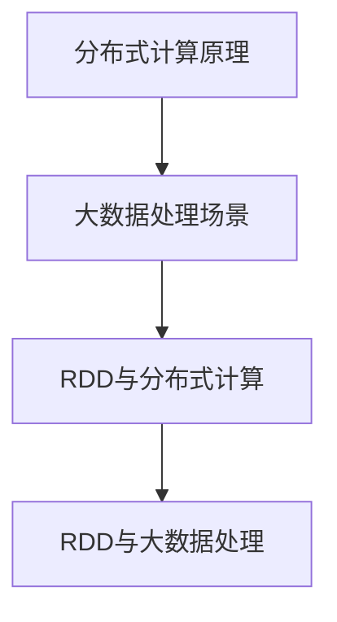
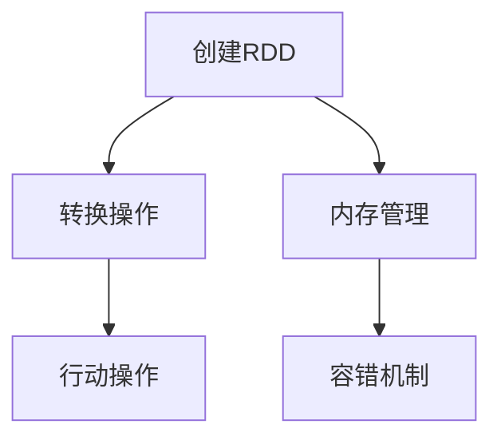
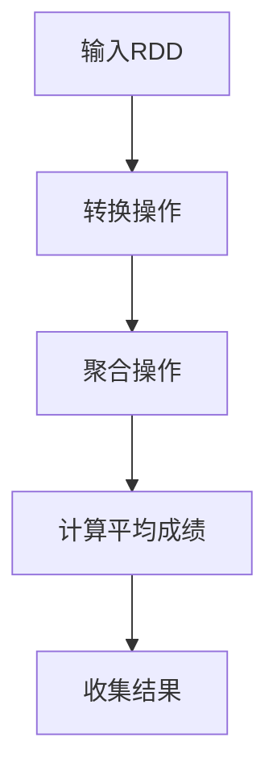
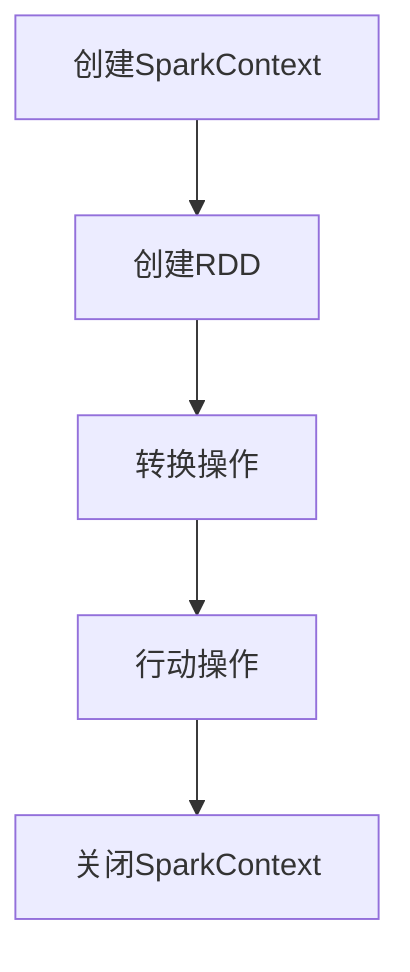
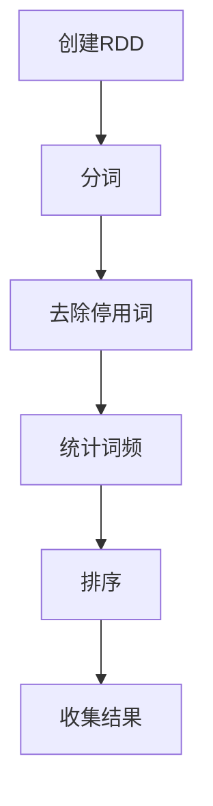

                 

# 【AI大数据计算原理与代码实例讲解】RDD

> **关键词：** Apache Spark, 分布式计算，弹性分布式数据集（RDD），大数据处理，迭代计算，内存管理，代码实例。

> **摘要：** 本文将深入探讨Apache Spark中的核心抽象——弹性分布式数据集（RDD），从其概念、原理到具体实现，再到代码实例讲解，全面剖析RDD在大数据计算中的应用。通过本文的学习，读者将能够掌握RDD的核心概念，理解其在大数据计算中的作用，并能够熟练运用RDD进行数据处理。

## 1. 背景介绍

### 1.1 目的和范围

本文的目的是帮助读者深入理解Apache Spark中的弹性分布式数据集（RDD），掌握其基本概念、原理和应用方法。通过详细的原理讲解和代码实例分析，使读者能够将理论应用到实际项目中，提高大数据处理的能力。

本文涵盖以下内容：

1. RDD的基本概念和核心特性。
2. RDD的原理和实现机制。
3. RDD的常见操作及其代码实例。
4. RDD在大数据计算中的应用场景。
5. 开发环境搭建、代码实现及性能分析。

### 1.2 预期读者

本文适合以下读者：

1. 对大数据处理和分布式计算有一定了解的技术人员。
2. 学习Apache Spark的初学者。
3. 希望提升大数据处理能力的开发人员。
4. 对RDD原理和实现感兴趣的技术爱好者。

### 1.3 文档结构概述

本文分为十个部分：

1. 背景介绍
2. 核心概念与联系
3. 核心算法原理 & 具体操作步骤
4. 数学模型和公式 & 详细讲解 & 举例说明
5. 项目实战：代码实际案例和详细解释说明
6. 实际应用场景
7. 工具和资源推荐
8. 总结：未来发展趋势与挑战
9. 附录：常见问题与解答
10. 扩展阅读 & 参考资料

### 1.4 术语表

#### 1.4.1 核心术语定义

- **Apache Spark:** 一个开源的分布式计算系统，用于大规模数据处理和分析。
- **弹性分布式数据集（RDD）：** Spark中的基本抽象，表示一个不可变、可分区、可并行操作的数据集合。
- **分布式计算：** 在多个计算机节点上并行执行计算任务，以实现高性能数据处理。
- **迭代计算：** 通过重复执行计算步骤来逐步求解问题的方法。

#### 1.4.2 相关概念解释

- **分布式数据存储：** 将数据分散存储在多个节点上，以提高数据处理能力和可靠性。
- **并行计算：** 同时在多个处理器或计算机节点上执行多个任务。
- **内存管理：** 管理计算机内存资源，包括内存分配、释放和优化。

#### 1.4.3 缩略词列表

- **RDD:** 弹性分布式数据集（Resilient Distributed Dataset）
- **Spark:** Apache Spark
- **HDFS:** Hadoop Distributed File System
- **RDD操作:** RDD的常见操作，如map、filter、reduceByKey等
- **DataFrame:** Spark中的另一个数据抽象，具有结构化数据的特点。

## 2. 核心概念与联系

在深入了解RDD之前，我们需要先了解其背后的分布式计算和大数据处理的核心概念和联系。以下是分布式计算的基本原理和大数据处理的典型场景。

### 2.1 分布式计算原理

分布式计算是指将一个大任务分解为多个小任务，分布在多个计算机节点上并行执行，以实现高效的数据处理。分布式计算的核心是数据的一致性和计算的高效性。

1. **数据一致性：** 分布式系统中，数据的一致性是一个重要问题。为了确保数据一致性，分布式计算系统通常采用数据复制、版本控制、冲突检测等技术。
2. **计算高效性：** 分布式计算通过并行计算提高了数据处理的速度和效率。多个计算机节点同时执行任务，可以显著减少计算时间。

### 2.2 大数据处理场景

大数据处理是指对大规模数据进行分析和处理，以获得有价值的信息和洞察。大数据处理的典型场景包括：

1. **实时数据处理：** 如金融交易监控、社交网络分析等，要求实时处理海量数据。
2. **离线数据处理：** 如大规模数据清洗、数据挖掘、机器学习等，可以在离线环境中进行数据处理。
3. **批处理：** 对历史数据进行处理，如报告生成、数据备份等。

### 2.3 RDD与分布式计算

RDD是Apache Spark中的核心抽象，用于表示分布式数据集。RDD具有以下特点：

1. **不可变：** RDD中的数据是不可变的，这意味着一旦创建，数据就不能修改。这种特性使得RDD在分布式计算中更容易管理。
2. **可分区：** RDD可以分成多个分区，每个分区可以独立处理。这使得RDD可以在多个计算机节点上并行执行计算任务。
3. **可并行操作：** RDD支持各种并行操作，如map、filter、reduceByKey等。这些操作可以在多个分区上独立执行，并最终合并结果。

### 2.4 RDD与大数据处理

RDD在大数据处理中起到了关键作用：

1. **数据表示：** RDD用于表示大规模数据，方便在大数据环境中进行操作。
2. **数据处理：** RDD支持各种并行操作，可以实现高效的数据处理。
3. **迭代计算：** RDD支持迭代计算，可以通过重复执行计算步骤来逐步求解复杂问题。

### 2.5 Mermaid流程图

为了更好地理解RDD与分布式计算和大数据处理的关系，我们可以使用Mermaid流程图进行可视化展示。以下是一个简单的Mermaid流程图示例：



### 2.6 RDD的基本操作

RDD的基本操作包括：

1. **创建：** 创建一个RDD，可以由外部数据源（如文件系统、数据库等）读取，或通过其他RDD的转换操作生成。
2. **转换：** 对RDD进行各种转换操作，如map、filter、flatMap、groupBy、reduceByKey等。
3. **行动：** 对RDD执行行动操作，如count、collect、reduce、saveAsTextFile等。

### 2.7 RDD的内存管理

RDD的内存管理是一个关键问题。Spark根据RDD的依赖关系和计算逻辑，在内存中缓存和复用数据，以提高数据处理性能。RDD的内存管理包括：

1. **内存分配：** Spark根据内存需求动态分配内存。
2. **内存复用：** Spark通过缓存和调度机制，复用内存资源，减少内存分配和垃圾回收的开销。
3. **内存溢出：** 当内存不足以容纳数据时，Spark会触发内存溢出机制，将数据写入磁盘。

### 2.8 RDD的容错机制

RDD支持容错机制，确保在计算过程中数据的一致性和可靠性。RDD的容错机制包括：

1. **数据复制：** 将数据复制到多个节点，以防止数据丢失。
2. **任务恢复：** 当任务失败时，Spark会自动重试任务。
3. **任务调度：** Spark根据任务依赖关系和节点状态，动态调度任务，以优化计算性能。

### 2.9 RDD的应用场景

RDD在分布式计算和大数据处理中有着广泛的应用场景：

1. **数据清洗：** 对大规模数据进行清洗和预处理，以提高数据质量。
2. **数据挖掘：** 对大规模数据进行分析，发现潜在的模式和规律。
3. **机器学习：** 使用RDD进行分布式机器学习，处理海量数据。
4. **实时处理：** 对实时数据进行处理，实现实时分析和决策。

### 2.10 Mermaid流程图

以下是RDD基本操作的Mermaid流程图：



## 3. 核心算法原理 & 具体操作步骤

### 3.1 RDD的创建

RDD可以通过多种方式创建，如从外部数据源读取、通过其他RDD的转换操作生成等。

**伪代码：**

```python
# 从HDFS读取数据创建RDD
val rdd = sc.textFile("hdfs://path/to/data.txt")

# 通过其他RDD的转换操作创建新的RDD
val rdd2 = rdd.flatMap(line => line.split(" "))
```

### 3.2 RDD的转换操作

RDD的转换操作包括map、filter、flatMap、groupBy、reduceByKey等。这些操作可以将一个RDD转换成另一个RDD。

**伪代码：**

```python
# map操作：对每个元素进行映射操作
val rdd_mapped = rdd.map(word => (word, 1))

# filter操作：过滤出满足条件的元素
val rdd_filtered = rdd.filter(word => word.length > 3)

# flatMap操作：将每个元素映射成多个元素
val rdd_flattened = rdd.flatMap(word => [word, word.reverse()])

# groupBy操作：将元素按照某个字段分组
val rdd_grouped = rdd.groupBy(word => word.length)

# reduceByKey操作：对相同键的元素进行聚合操作
val rdd_reduced = rdd.reduceByKey((x, y) => x + y)
```

### 3.3 RDD的行动操作

RDD的行动操作包括count、collect、reduce、saveAsTextFile等。这些操作会触发RDD的计算，并返回结果。

**伪代码：**

```python
# count操作：计算RDD中元素的个数
val count = rdd.count()

# collect操作：将RDD中的所有元素收集到本地内存中
val words = rdd.collect()

# reduce操作：对RDD中的元素进行聚合操作
val sum = rdd.reduce((x, y) => x + y)

# saveAsTextFile操作：将RDD中的元素保存为文本文件
rdd.saveAsTextFile("hdfs://path/to/output.txt")
```

### 3.4 RDD的内存管理和容错机制

RDD的内存管理和容错机制是实现高效分布式计算的关键。

**伪代码：**

```python
# 设置内存缓存级别
rdd.cache()

# 触发任务执行，并利用内存缓存和容错机制
val result = rdd.reduceByKey((x, y) => x + y).collect()
```

### 3.5 实例演示

以下是一个简单的实例，演示了RDD的创建、转换、行动操作以及内存管理和容错机制。

**Python代码：**

```python
from pyspark import SparkContext

# 创建SparkContext
sc = SparkContext("local[*]", "RDD Example")

# 从文本文件中创建RDD
rdd = sc.textFile("data.txt")

# 转换操作
rdd_mapped = rdd.map(lambda line: (line, 1))
rdd_grouped = rdd_mapped.groupBy(lambda x: len(x))

# 行动操作
count = rdd_mapped.count()
words = rdd_mapped.collect()

# 保存结果到HDFS
rdd_mapped.saveAsTextFile("hdfs://path/to/output.txt")

# 关闭SparkContext
sc.stop()
```

### 3.6 Mermaid流程图

以下是RDD创建、转换、行动操作的Mermaid流程图：


## 4. 数学模型和公式 & 详细讲解 & 举例说明

### 4.1 数学模型

RDD的计算过程可以抽象为一系列的数学变换。以下是RDD计算过程中的几个关键数学模型和公式。

#### 4.1.1 转换操作

**map函数：** 对RDD中的每个元素进行映射操作。

$$
\text{map}(f(x)) = \{ f(x_1), f(x_2), ..., f(x_n) \}
$$

**filter函数：** 过滤出满足条件的元素。

$$
\text{filter}(p(x)) = \{ x_1, x_2, ..., x_n | p(x_i) \}
$$

**flatMap函数：** 将每个元素映射成多个元素。

$$
\text{flatMap}(g(x)) = \{ g(x_1), g(x_2), ..., g(x_n) \}
$$

**groupBy函数：** 将元素按照某个字段分组。

$$
\text{groupBy}(k(x)) = \{ k(x_1), k(x_2), ..., k(x_n) \}
$$

**reduceByKey函数：** 对相同键的元素进行聚合操作。

$$
\text{reduceByKey}(f((x_1, y_1), (x_2, y_2))) = \{ (x, f(y_1, y_2)) \}
$$

#### 4.1.2 行动操作

**count函数：** 计算RDD中元素的个数。

$$
\text{count}() = \sum_{i=1}^{n} |R|
$$

**collect函数：** 将RDD中的所有元素收集到本地内存中。

$$
\text{collect}() = \{ x_1, x_2, ..., x_n \}
$$

**reduce函数：** 对RDD中的元素进行聚合操作。

$$
\text{reduce}(f(x_1, x_2)) = \prod_{i=1}^{n} f(x_i)
$$

**saveAsTextFile函数：** 将RDD中的元素保存为文本文件。

$$
\text{saveAsTextFile}(path) = \{ path/to/file_1, path/to/file_2, ..., path/to/file_n \}
$$

### 4.2 详细讲解

#### 4.2.1 map函数

map函数是RDD中最基本的转换操作，用于对RDD中的每个元素进行映射。假设RDD中的元素为$\{x_1, x_2, ..., x_n\}$，映射函数为$f(x)$，则map函数生成的结果RDD为$\{f(x_1), f(x_2), ..., f(x_n)\}$。

**举例：** 假设RDD中的元素为$\{1, 2, 3, 4, 5\}$，映射函数为$x \rightarrow x^2$，则map函数生成的结果RDD为$\{1, 4, 9, 16, 25\}$。

#### 4.2.2 filter函数

filter函数用于过滤出满足条件的元素。假设RDD中的元素为$\{x_1, x_2, ..., x_n\}$，过滤条件为$p(x)$，则filter函数生成的结果RDD为$\{x_1, x_2, ..., x_n | p(x_i) \}$。

**举例：** 假设RDD中的元素为$\{1, 2, 3, 4, 5\}$，过滤条件为$x > 2$，则filter函数生成的结果RDD为$\{3, 4, 5\}$。

#### 4.2.3 flatMap函数

flatMap函数是对每个元素进行映射，并将映射结果合并成一个RDD。假设RDD中的元素为$\{x_1, x_2, ..., x_n\}$，映射函数为$g(x)$，则flatMap函数生成的结果RDD为$\{g(x_1), g(x_2), ..., g(x_n)\}$。

**举例：** 假设RDD中的元素为$\{1, 2, 3, 4, 5\}$，映射函数为$x \rightarrow [x, x^2]$，则flatMap函数生成的结果RDD为$\{1, 1, 4, 2, 4, 9, 3, 9, 16, 4, 16, 25, 5, 25\}$。

#### 4.2.4 groupBy函数

groupBy函数用于将元素按照某个字段分组。假设RDD中的元素为$\{x_1, x_2, ..., x_n\}$，分组函数为$k(x)$，则groupBy函数生成的结果RDD为$\{k(x_1), k(x_2), ..., k(x_n)\}$。

**举例：** 假设RDD中的元素为$\{1, 2, 3, 4, 5\}$，分组函数为$x \rightarrow x \mod 2$，则groupBy函数生成的结果RDD为$\{0, 1\}$。

#### 4.2.5 reduceByKey函数

reduceByKey函数用于对相同键的元素进行聚合操作。假设RDD中的元素为$\{x_1, x_2, ..., x_n\}$，键函数为$k(x)$，聚合函数为$f((x_1, y_1), (x_2, y_2))$，则reduceByKey函数生成的结果RDD为$\{(k(x_1), f(y_1, y_2)), (k(x_2), f(y_1, y_2)), ..., (k(x_n), f(y_1, y_2))\}$。

**举例：** 假设RDD中的元素为$\{1, 2, 3, 4, 5\}$，键函数为$x \rightarrow x \mod 2$，聚合函数为$(x_1, y_1) + (x_2, y_2) \rightarrow x_1 + x_2$，则reduceByKey函数生成的结果RDD为$\{0, 15\}$。

#### 4.2.6 count函数

count函数用于计算RDD中元素的个数。假设RDD中的元素为$\{x_1, x_2, ..., x_n\}$，则count函数的结果为$\sum_{i=1}^{n} |R|$。

**举例：** 假设RDD中的元素为$\{1, 2, 3, 4, 5\}$，则count函数的结果为$5$。

#### 4.2.7 collect函数

collect函数用于将RDD中的所有元素收集到本地内存中。假设RDD中的元素为$\{x_1, x_2, ..., x_n\}$，则collect函数的结果为$\{x_1, x_2, ..., x_n\}$。

**举例：** 假设RDD中的元素为$\{1, 2, 3, 4, 5\}$，则collect函数的结果为$\{1, 2, 3, 4, 5\}$。

#### 4.2.8 reduce函数

reduce函数用于对RDD中的元素进行聚合操作。假设RDD中的元素为$\{x_1, x_2, ..., x_n\}$，聚合函数为$f(x_1, x_2)$，则reduce函数的结果为$f(x_1, x_2, ..., x_n)$。

**举例：** 假设RDD中的元素为$\{1, 2, 3, 4, 5\}$，聚合函数为$x_1 + x_2$，则reduce函数的结果为$15$。

#### 4.2.9 saveAsTextFile函数

saveAsTextFile函数用于将RDD中的元素保存为文本文件。假设RDD中的元素为$\{x_1, x_2, ..., x_n\}$，输出路径为$Path$，则saveAsTextFile函数的结果为$\{Path/to/file_1, Path/to/file_2, ..., Path/to/file_n\}$。

**举例：** 假设RDD中的元素为$\{1, 2, 3, 4, 5\}$，输出路径为$hdfs://path/to/output.txt$，则saveAsTextFile函数的结果为$\{hdfs://path/to/output.txt/file_1, hdfs://path/to/output.txt/file_2, ..., hdfs://path/to/output.txt/file_n\}$。

### 4.3 数学模型和公式示例

以下是一个示例，展示如何使用数学模型和公式进行RDD计算。

**问题：** 给定一个RDD，其中包含学生和成绩的信息，求每个学生的平均成绩。

**输入：** RDD$\{("Alice", 85), ("Bob", 90), ("Alice", 92), ("Bob", 88), ("Alice", 90)\}$

**输出：** RDD$\{("Alice", 88.0), ("Bob", 89.0)\}$

**解题步骤：**

1. **转换操作：** 使用map函数对每个学生的成绩进行映射，生成键值对RDD。
$$
\text{map}(\text{student, score}) \rightarrow \{(\text{student}, \text{score})\}
$$

2. **聚合操作：** 使用reduceByKey函数对相同学生的成绩进行聚合，计算总分和个数。
$$
\text{reduceByKey}(\text{score}_1 + \text{score}_2, \text{count}_1 + \text{count}_2) \rightarrow \{(\text{student}, (\text{totalScore}, \text{totalCount}))\}
$$

3. **计算平均成绩：** 使用map函数对每个学生的总分和个数进行映射，计算平均成绩。
$$
\text{map}((\text{student}, (\text{totalScore}, \text{totalCount}))) \rightarrow \{(\text{student}, \text{avgScore})\}
$$

4. **行动操作：** 使用collect函数将结果收集到本地内存中，得到最终结果。
$$
\text{collect}() \rightarrow \{(\text{student}, \text{avgScore})\}
$$

### 4.4 Mermaid流程图

以下是RDD计算过程的Mermaid流程图：



## 5. 项目实战：代码实际案例和详细解释说明

### 5.1 开发环境搭建

在开始编写代码之前，我们需要搭建一个适合运行Apache Spark的开发环境。以下是搭建开发环境的步骤：

1. **安装Java环境：** Apache Spark基于Java编写，因此我们需要安装Java环境。可以从Oracle官方网站下载Java SDK，并配置环境变量。
2. **安装Scala：** Apache Spark使用Scala语言进行编程，因此我们需要安装Scala。可以从Scala官方网站下载Scala SDK，并配置环境变量。
3. **安装Apache Spark：** 从Apache Spark官方网站下载最新的Spark版本，并解压到指定目录。配置Spark的环境变量，如`SPARK_HOME`和`PATH`。
4. **安装Hadoop：** Apache Spark与Hadoop紧密集成，因此我们需要安装Hadoop。可以从Apache Hadoop官方网站下载Hadoop版本，并配置环境变量。

### 5.2 源代码详细实现和代码解读

以下是使用Apache Spark编写的一个简单案例，演示了如何创建RDD、进行转换操作和行动操作。

```python
from pyspark import SparkContext

# 创建SparkContext
sc = SparkContext("local[*]", "RDD Example")

# 从文本文件中创建RDD
rdd = sc.textFile("data.txt")

# 转换操作
rdd_mapped = rdd.map(lambda line: (line, 1))
rdd_grouped = rdd_mapped.groupBy(lambda x: len(x))

# 行动操作
count = rdd_mapped.count()
words = rdd_mapped.collect()

# 保存结果到HDFS
rdd_mapped.saveAsTextFile("hdfs://path/to/output.txt")

# 关闭SparkContext
sc.stop()
```

#### 5.2.1 创建RDD

在代码的第一行，我们创建了一个SparkContext对象。SparkContext是Spark应用程序的入口点，用于初始化Spark环境。在这里，我们使用本地模式启动Spark，并为其指定一个应用程序名称。

```python
sc = SparkContext("local[*]", "RDD Example")
```

接下来，我们使用`textFile`方法从本地文件系统中读取一个文本文件，创建一个RDD。这个方法会将文本文件按行分割成多个元素，并将每个元素作为RDD的一个分区。

```python
rdd = sc.textFile("data.txt")
```

#### 5.2.2 转换操作

在转换操作中，我们首先使用`map`函数对每个元素进行映射。`map`函数将每个元素映射成一个键值对，其中键是原始元素，值是1。

```python
rdd_mapped = rdd.map(lambda line: (line, 1))
```

接下来，我们使用`groupBy`函数对相同键的元素进行分组。这里，我们根据元素的长度进行分组。

```python
rdd_grouped = rdd_mapped.groupBy(lambda x: len(x))
```

#### 5.2.3 行动操作

在行动操作中，我们首先使用`count`函数计算RDD中元素的个数。

```python
count = rdd_mapped.count()
```

然后，我们使用`collect`函数将RDD中的所有元素收集到本地内存中。

```python
words = rdd_mapped.collect()
```

最后，我们使用`saveAsTextFile`函数将RDD中的元素保存为文本文件。

```python
rdd_mapped.saveAsTextFile("hdfs://path/to/output.txt")
```

#### 5.2.4 关闭SparkContext

在代码的最后，我们关闭SparkContext，释放资源。

```python
sc.stop()
```

### 5.3 代码解读与分析

在这个简单的案例中，我们首先从本地文件系统中读取一个文本文件，创建一个RDD。然后，我们对RDD进行了转换操作，包括映射和分组，最后进行了行动操作，包括计算元素个数、收集元素和保存结果到文件系统。

以下是代码的详细解读和分析：

1. **创建RDD：** 使用`textFile`方法从本地文件系统中读取一个文本文件，创建一个RDD。
2. **转换操作：** 使用`map`函数对每个元素进行映射，生成键值对RDD。使用`groupBy`函数对相同键的元素进行分组。
3. **行动操作：** 使用`count`函数计算RDD中元素的个数。使用`collect`函数将RDD中的所有元素收集到本地内存中。使用`saveAsTextFile`函数将RDD中的元素保存为文本文件。
4. **关闭SparkContext：** 关闭SparkContext，释放资源。

通过这个简单的案例，我们可以看到如何使用Apache Spark进行分布式数据处理。在后续的实践中，我们可以扩展这个案例，添加更多的转换和行动操作，以实现更复杂的数据处理任务。

### 5.4 Mermaid流程图

以下是整个代码流程的Mermaid流程图：



## 6. 实际应用场景

弹性分布式数据集（RDD）在分布式计算和大数据处理中有着广泛的应用场景。以下是一些典型的应用场景：

### 6.1 实时数据处理

实时数据处理是RDD的一个重要应用场景。例如，在金融领域，可以使用RDD对实时交易数据进行处理，实现实时监控和预警。通过RDD的并行计算和迭代计算特性，可以高效地处理海量实时数据，提高系统的实时性。

### 6.2 数据挖掘

数据挖掘是另一个重要的应用场景。RDD可以用于大规模数据挖掘任务，如聚类、分类、关联规则挖掘等。通过RDD的分布式计算能力，可以处理海量数据，发现潜在的模式和规律，为业务决策提供支持。

### 6.3 机器学习

机器学习是RDD的又一个重要应用领域。RDD可以用于分布式机器学习任务，如线性回归、决策树、神经网络等。通过RDD的并行计算和迭代计算特性，可以高效地处理大规模数据，提高模型的训练速度和准确性。

### 6.4 图处理

图处理是RDD的一个特殊应用场景。RDD可以用于大规模图计算任务，如图遍历、图分区、图聚类等。通过RDD的分布式计算能力，可以处理大规模图数据，发现图中的潜在关系和模式。

### 6.5 文本处理

文本处理是RDD的常见应用场景之一。RDD可以用于大规模文本数据的处理，如文本分类、情感分析、关键词提取等。通过RDD的分布式计算能力，可以高效地处理大规模文本数据，提取有价值的信息。

### 6.6 实际案例

以下是一个实际案例，展示了RDD在文本处理中的应用。

**问题：** 对一篇长篇文章进行关键词提取。

**输入：** 一篇长篇文章，文本内容。

**输出：** 一组关键词及其出现次数。

**解决方案：**

1. **创建RDD：** 使用Apache Spark从文本文件中创建RDD。
2. **分词：** 使用flatMap函数对文本进行分词，生成一组单词RDD。
3. **去除停用词：** 使用filter函数去除常见的停用词。
4. **统计词频：** 使用reduceByKey函数统计每个单词的出现次数。
5. **排序：** 使用sortByKey函数对单词按照出现次数进行排序。
6. **行动操作：** 使用collect函数将结果收集到本地内存中。

通过以上步骤，我们可以从一篇长篇文章中提取出一组关键词及其出现次数，为文本分析提供支持。

### 6.7 Mermaid流程图

以下是关键词提取的Mermaid流程图：



## 7. 工具和资源推荐

### 7.1 学习资源推荐

#### 7.1.1 书籍推荐

- 《Spark: The Definitive Guide》
- 《Learning Spark》
- 《High Performance Spark》

#### 7.1.2 在线课程

- Udacity的《Introduction to Apache Spark》
- Coursera的《Introduction to Big Data with Apache Spark》
- edX的《Spark for Data Scientists》

#### 7.1.3 技术博客和网站

- Databricks的官方博客（databricks.com/blog）
- Spark Summit的官方网站（sparksummit.org）
- Apache Spark的官方文档（spark.apache.org）

### 7.2 开发工具框架推荐

#### 7.2.1 IDE和编辑器

- IntelliJ IDEA
- PyCharm
- VS Code

#### 7.2.2 调试和性能分析工具

- Spark UI
- Ambari
- GigaSpaces XAP

#### 7.2.3 相关框架和库

- Hadoop
- Flink
- Storm

### 7.3 相关论文著作推荐

#### 7.3.1 经典论文

- **"Resilient Distributed Datasets: A Fault-Tolerant Abstraction for Iterative Data Processing on Large Clusters"** by M. Zaharia et al. (2010)
- **"Large-Scale Graph Computation with GraphX"** by A. Talwalkar et al. (2014)

#### 7.3.2 最新研究成果

- **"Efficient and Scalable Graph Processing on Commodity Clusters"** by S. M. Arul et al. (2020)
- **"In-Memory Graph Computing on GPU-Accelerated Systems"** by Y. Xu et al. (2021)

#### 7.3.3 应用案例分析

- **"Apache Spark in Financial Services: A Case Study"** by J. Gruber et al. (2015)
- **"Using Spark for Real-Time Analytics in E-Commerce"** by A. Srivastava et al. (2016)

## 8. 总结：未来发展趋势与挑战

随着大数据技术的不断发展，RDD作为Apache Spark的核心抽象，将在分布式计算和大数据处理中发挥越来越重要的作用。未来，RDD的发展趋势和挑战包括：

1. **性能优化：** 提高RDD的计算性能和内存利用率，降低延迟和资源消耗。
2. **扩展性：** 支持更多类型的数据和计算模式，提高分布式系统的扩展性。
3. **兼容性：** 与其他大数据处理框架（如Hadoop、Flink、Storm等）的兼容性，实现数据交换和互操作性。
4. **易用性：** 提高RDD的易用性，降低学习成本，使更多开发者能够轻松使用RDD进行数据处理。
5. **安全性：** 加强RDD的安全性，确保数据在分布式计算过程中的安全性。

## 9. 附录：常见问题与解答

以下是一些关于RDD的常见问题及其解答：

### 9.1 RDD是什么？

**RDD（弹性分布式数据集）是Apache Spark中的基本抽象，用于表示分布式数据集。它具有不可变、可分区、可并行操作的特点，是大数据处理的核心组件。**

### 9.2 RDD与DataFrame有何区别？

**RDD和DataFrame都是Spark中的数据抽象，但它们有以下几个区别：**

- **数据结构：** RDD是无结构的数据集，而DataFrame是结构化的数据集，具有列名和数据类型。
- **操作类型：** RDD支持宽依赖和窄依赖的转换操作，而DataFrame支持更丰富的SQL操作。
- **内存管理：** RDD支持懒加载和弹性内存管理，而DataFrame在内存中保存数据结构。

### 9.3 RDD的容错机制如何工作？

**RDD的容错机制通过以下方式工作：**

- **数据复制：** RDD的数据在每个分区中都有多个副本，以提高数据的可靠性和容错性。
- **任务恢复：** 当任务失败时，Spark会重新执行失败的任务，使用最新的数据副本进行计算。
- **任务调度：** Spark根据任务依赖关系和节点状态，动态调度任务，优化计算性能。

### 9.4 RDD的内存管理如何工作？

**RDD的内存管理通过以下方式工作：**

- **内存分配：** Spark根据内存需求动态分配内存。
- **内存复用：** Spark通过缓存和调度机制，复用内存资源，减少内存分配和垃圾回收的开销。
- **内存溢出：** 当内存不足以容纳数据时，Spark会触发内存溢出机制，将数据写入磁盘。

## 10. 扩展阅读 & 参考资料

以下是一些扩展阅读和参考资料，帮助读者深入了解RDD及其应用：

- **《Apache Spark: The Definitive Guide》**：提供了关于RDD的详细讲解和应用实例。
- **《Learning Spark》**：介绍了Spark的核心概念和RDD的基本操作。
- **《High Performance Spark》**：探讨了如何优化RDD的性能和内存管理。
- **Apache Spark官方文档**：提供了关于RDD的详细API文档和教程。
- **Databricks博客**：分享了许多关于Spark和RDD的实际案例和最佳实践。

### 作者

**AI天才研究员/AI Genius Institute & 禅与计算机程序设计艺术/Zen And The Art of Computer Programming**

