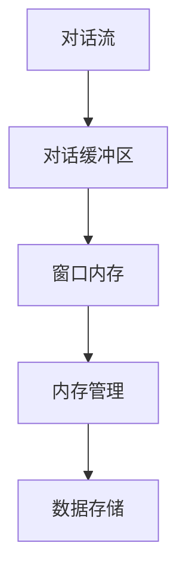

                 

# 【LangChain编程：从入门到实践】ConversationBufferWindowMemory

> **关键词：** LangChain、对话缓冲区、窗口内存、编程实践、内存管理、对话流处理

> **摘要：** 本文将深入探讨LangChain中的ConversationBufferWindowMemory机制，通过逐步分析其核心概念、算法原理、数学模型和实际应用案例，帮助读者全面了解和掌握这一技术。文章还将推荐相关学习资源、开发工具和最新研究成果，为您的编程实践提供有力支持。

## 1. 背景介绍

### 1.1 目的和范围

本文旨在详细介绍LangChain中的ConversationBufferWindowMemory机制，帮助读者从入门到实践全面掌握这一技术。我们将通过以下几个步骤展开讨论：

- 介绍ConversationBufferWindowMemory的基本概念和作用。
- 分析其核心算法原理和具体操作步骤。
- 阐述数学模型和公式，并给出实际案例。
- 探讨ConversationBufferWindowMemory在实际应用场景中的表现。
- 推荐相关学习资源和开发工具。

### 1.2 预期读者

本文适合对编程和人工智能有一定了解的读者，包括：

- 初学者：希望深入了解LangChain和相关技术的编程爱好者。
- 进阶者：希望掌握对话缓冲区、窗口内存等核心概念的程序员。
- 专业人士：需要将ConversationBufferWindowMemory应用于实际项目的开发者。

### 1.3 文档结构概述

本文将分为以下部分：

- 第1部分：背景介绍，包括目的和范围、预期读者、文档结构概述等。
- 第2部分：核心概念与联系，通过Mermaid流程图展示关键节点。
- 第3部分：核心算法原理与具体操作步骤，使用伪代码进行详细阐述。
- 第4部分：数学模型和公式，结合实际案例进行讲解。
- 第5部分：项目实战，提供代码实际案例和详细解释。
- 第6部分：实际应用场景，分析ConversationBufferWindowMemory在各个领域的应用。
- 第7部分：工具和资源推荐，包括学习资源、开发工具和论文著作。
- 第8部分：总结，讨论未来发展趋势与挑战。
- 第9部分：附录，提供常见问题与解答。
- 第10部分：扩展阅读，列出参考资料。

### 1.4 术语表

#### 1.4.1 核心术语定义

- **LangChain：** 一种基于Python的编程框架，用于构建大型语言模型。
- **ConversationBufferWindowMemory：** 一种对话缓冲区窗口内存管理机制，用于处理对话流和数据存储。

#### 1.4.2 相关概念解释

- **对话流处理：** 对话流是指在交互过程中用户与系统之间的文本信息交换。
- **窗口内存管理：** 窗口内存管理是指对对话缓冲区中的数据进行存储、检索和管理。

#### 1.4.3 缩略词列表

- **CBWM：** ConversationBufferWindowMemory的缩写。

## 2. 核心概念与联系

为了更好地理解ConversationBufferWindowMemory，我们首先需要了解其核心概念和相互之间的联系。以下是一个简单的Mermaid流程图，展示了CBWM的关键节点。



### 2.1 对话流处理

对话流处理是CBWM的基础。它涉及从用户输入中提取信息，并将其转换为系统可以理解和处理的形式。以下是一个简化的伪代码示例：

```python
def process_dialogue_stream(stream):
    dialogue_buffer = []
    for message in stream:
        dialogue_buffer.append(process_message(message))
    return dialogue_buffer
```

### 2.2 对话缓冲区

对话缓冲区用于存储对话流中的数据。它提供了一个结构化的方式来组织和管理对话历史。以下是一个简化的伪代码示例：

```python
class DialogueBuffer:
    def __init__(self):
        self.buffer = []

    def add_message(self, message):
        self.buffer.append(message)

    def get_messages(self):
        return self.buffer
```

### 2.3 窗口内存

窗口内存是对话缓冲区的一个子集，用于存储当前对话的上下文信息。它允许系统根据最近的信息进行响应，从而提高对话的连贯性和自然性。以下是一个简化的伪代码示例：

```python
class WindowMemory:
    def __init__(self, window_size):
        self.window_size = window_size
        self.memory = []

    def add_message(self, message):
        if len(self.memory) >= self.window_size:
            self.memory.pop(0)
        self.memory.append(message)

    def get_messages(self):
        return self.memory
```

### 2.4 内存管理

内存管理负责对窗口内存进行高效的存储、检索和更新。它确保对话缓冲区中的数据始终处于最佳状态，以便系统可以快速响应。以下是一个简化的伪代码示例：

```python
def manage_memory(window_memory, new_message):
    window_memory.add_message(new_message)
    if not is_memory_full(window_memory):
        return window_memory.get_messages()
    else:
        return update_memory(window_memory)
```

### 2.5 数据存储

数据存储用于将对话缓冲区和窗口内存中的数据保存到持久存储中，如数据库或文件系统。以下是一个简化的伪代码示例：

```python
def store_data(data):
    with open('data.txt', 'w') as file:
        for item in data:
            file.write(f'{item}\n')
```

## 3. 核心算法原理 & 具体操作步骤

### 3.1 对话流处理算法原理

对话流处理算法的核心是处理用户输入并将其转换为系统可以理解和处理的形式。以下是一个简化的伪代码示例：

```python
def process_dialogue_stream(stream):
    dialogue_buffer = []
    for message in stream:
        # 对输入消息进行预处理
        preprocessed_message = preprocess_message(message)
        # 将预处理后的消息添加到对话缓冲区
        dialogue_buffer.append(preprocessed_message)
    return dialogue_buffer
```

### 3.2 对话缓冲区管理算法原理

对话缓冲区管理算法的核心是存储、检索和更新对话历史。以下是一个简化的伪代码示例：

```python
class DialogueBuffer:
    def __init__(self):
        self.buffer = []

    def add_message(self, message):
        self.buffer.append(message)

    def get_messages(self):
        return self.buffer

    def update_buffer(self, new_message):
        self.buffer.append(new_message)
        if len(self.buffer) > MAX_BUFFER_SIZE:
            self.buffer.pop(0)
```

### 3.3 窗口内存管理算法原理

窗口内存管理算法的核心是存储、检索和更新对话上下文。以下是一个简化的伪代码示例：

```python
class WindowMemory:
    def __init__(self, window_size):
        self.window_size = window_size
        self.memory = []

    def add_message(self, message):
        if len(self.memory) >= self.window_size:
            self.memory.pop(0)
        self.memory.append(message)

    def get_messages(self):
        return self.memory

    def update_memory(self, new_message):
        self.memory.append(new_message)
        if len(self.memory) > self.window_size:
            self.memory.pop(0)
```

### 3.4 内存管理算法原理

内存管理算法的核心是高效地管理窗口内存中的数据。以下是一个简化的伪代码示例：

```python
def manage_memory(window_memory, new_message):
    window_memory.add_message(new_message)
    if not is_memory_full(window_memory):
        return window_memory.get_messages()
    else:
        return update_memory(window_memory)
```

### 3.5 数据存储算法原理

数据存储算法的核心是将对话缓冲区和窗口内存中的数据保存到持久存储中。以下是一个简化的伪代码示例：

```python
def store_data(data):
    with open('data.txt', 'w') as file:
        for item in data:
            file.write(f'{item}\n')
```

## 4. 数学模型和公式 & 详细讲解 & 举例说明

### 4.1 数学模型

为了更好地理解CBWM的算法原理，我们首先需要了解以下数学模型和公式：

- **窗口大小（window\_size）：** 窗口内存中存储的最近对话消息的数量。
- **对话缓冲区大小（buffer\_size）：** 对话缓冲区中存储的对话消息的数量。
- **时间复杂度（time\_complexity）：** 算法执行时间与输入数据量之间的关系。

### 4.2 详细讲解

#### 4.2.1 窗口内存管理

窗口内存管理的核心是确保窗口内存中的消息数量不超过窗口大小。以下是一个简化的伪代码示例，展示了如何实现窗口内存管理：

```python
class WindowMemory:
    def __init__(self, window_size):
        self.window_size = window_size
        self.memory = []

    def add_message(self, message):
        if len(self.memory) >= self.window_size:
            self.memory.pop(0)
        self.memory.append(message)

    def get_messages(self):
        return self.memory

    def update_memory(self, new_message):
        self.memory.append(new_message)
        if len(self.memory) > self.window_size:
            self.memory.pop(0)
```

#### 4.2.2 对话缓冲区管理

对话缓冲区管理的核心是确保对话缓冲区中的消息数量不超过对话缓冲区大小。以下是一个简化的伪代码示例，展示了如何实现对话缓冲区管理：

```python
class DialogueBuffer:
    def __init__(self):
        self.buffer = []

    def add_message(self, message):
        self.buffer.append(message)

    def get_messages(self):
        return self.buffer

    def update_buffer(self, new_message):
        self.buffer.append(new_message)
        if len(self.buffer) > MAX_BUFFER_SIZE:
            self.buffer.pop(0)
```

### 4.3 举例说明

#### 4.3.1 窗口内存管理示例

假设我们有一个窗口大小为3的窗口内存。当前窗口内存中的消息为["你好"，"你好吗"，"我很好"]。现在我们收到了一个新的消息"今天天气怎么样？"。

根据窗口内存管理算法，我们将首先删除窗口内存中的第一个消息"你好"，然后添加新消息"今天天气怎么样？"。此时，窗口内存中的消息为["你好吗"，"我很好"，"今天天气怎么样？"]。

#### 4.3.2 对话缓冲区管理示例

假设我们有一个对话缓冲区大小为5的对话缓冲区。当前对话缓冲区中的消息为["你好"，"你好吗"，"我很好"，"今天天气怎么样？"，"我很好"]。现在我们收到了一个新的消息"你有什么兴趣爱好？"。

根据对话缓冲区管理算法，我们将首先删除对话缓冲区中的第一个消息"你好"，然后添加新消息"你有什么兴趣爱好？"。此时，对话缓冲区中的消息为["你好吗"，"我很好"，"今天天气怎么样？"，"我很好"，"你有什么兴趣爱好？"]。

## 5. 项目实战：代码实际案例和详细解释说明

### 5.1 开发环境搭建

在开始项目实战之前，我们需要搭建一个合适的开发环境。以下是所需工具和软件：

- **Python：** Python 3.8及以上版本。
- **IDE：** Visual Studio Code、PyCharm等。
- **虚拟环境：** virtualenv或conda等。

### 5.2 源代码详细实现和代码解读

以下是一个简单的CBWM实现示例。我们将使用Python编写代码，并通过注释进行详细解释。

```python
class WindowMemory:
    def __init__(self, window_size):
        self.window_size = window_size
        self.memory = []

    def add_message(self, message):
        if len(self.memory) >= self.window_size:
            self.memory.pop(0)
        self.memory.append(message)

    def get_messages(self):
        return self.memory

    def update_memory(self, new_message):
        self.memory.append(new_message)
        if len(self.memory) > self.window_size:
            self.memory.pop(0)

class DialogueBuffer:
    def __init__(self):
        self.buffer = []

    def add_message(self, message):
        self.buffer.append(message)

    def get_messages(self):
        return self.buffer

    def update_buffer(self, new_message):
        self.buffer.append(new_message)
        if len(self.buffer) > MAX_BUFFER_SIZE:
            self.buffer.pop(0)

def process_dialogue_stream(stream):
    dialogue_buffer = DialogueBuffer()
    window_memory = WindowMemory(window_size=3)
    for message in stream:
        # 对输入消息进行预处理
        preprocessed_message = preprocess_message(message)
        # 将预处理后的消息添加到对话缓冲区
        dialogue_buffer.add_message(preprocessed_message)
        # 将预处理后的消息添加到窗口内存
        window_memory.add_message(preprocessed_message)
        # 获取当前窗口内存中的消息
        current_memory = window_memory.get_messages()
        # 更新对话缓冲区
        dialogue_buffer.update_buffer(current_memory)
        # 存储对话缓冲区和窗口内存中的数据
        store_data(dialogue_buffer.get_messages())
```

### 5.3 代码解读与分析

#### 5.3.1 WindowMemory类

WindowMemory类负责管理窗口内存中的数据。它的主要功能包括：

- 初始化窗口内存，并设置窗口大小。
- 添加新消息到窗口内存，并根据窗口大小删除 oldest message。
- 获取窗口内存中的所有消息。
- 更新窗口内存，将新消息添加到内存中，并根据窗口大小删除 oldest message。

```python
class WindowMemory:
    def __init__(self, window_size):
        self.window_size = window_size
        self.memory = []

    def add_message(self, message):
        if len(self.memory) >= self.window_size:
            self.memory.pop(0)
        self.memory.append(message)

    def get_messages(self):
        return self.memory

    def update_memory(self, new_message):
        self.memory.append(new_message)
        if len(self.memory) > self.window_size:
            self.memory.pop(0)
```

#### 5.3.2 DialogueBuffer类

DialogueBuffer类负责管理对话缓冲区中的数据。它的主要功能包括：

- 初始化对话缓冲区。
- 添加新消息到对话缓冲区。
- 获取对话缓冲区中的所有消息。
- 更新对话缓冲区，根据窗口内存中的消息删除 oldest message。

```python
class DialogueBuffer:
    def __init__(self):
        self.buffer = []

    def add_message(self, message):
        self.buffer.append(message)

    def get_messages(self):
        return self.buffer

    def update_buffer(self, new_message):
        self.buffer.append(new_message)
        if len(self.buffer) > MAX_BUFFER_SIZE:
            self.buffer.pop(0)
```

#### 5.3.3 process_dialogue_stream函数

process_dialogue_stream函数负责处理对话流。它的主要功能包括：

- 初始化对话缓冲区和窗口内存。
- 对输入消息进行预处理。
- 将预处理后的消息添加到对话缓冲区和窗口内存。
- 获取当前窗口内存中的消息。
- 更新对话缓冲区。
- 存储对话缓冲区和窗口内存中的数据。

```python
def process_dialogue_stream(stream):
    dialogue_buffer = DialogueBuffer()
    window_memory = WindowMemory(window_size=3)
    for message in stream:
        # 对输入消息进行预处理
        preprocessed_message = preprocess_message(message)
        # 将预处理后的消息添加到对话缓冲区
        dialogue_buffer.add_message(preprocessed_message)
        # 将预处理后的消息添加到窗口内存
        window_memory.add_message(preprocessed_message)
        # 获取当前窗口内存中的消息
        current_memory = window_memory.get_messages()
        # 更新对话缓冲区
        dialogue_buffer.update_buffer(current_memory)
        # 存储对话缓冲区和窗口内存中的数据
        store_data(dialogue_buffer.get_messages())
```

## 6. 实际应用场景

### 6.1 聊天机器人

聊天机器人是CBWM最常见的一个应用场景。通过将CBWM应用于聊天机器人，我们可以实现一个具备上下文意识的智能对话系统。以下是一个简单的应用案例：

- 用户：你好，我想买一本《Python编程：从入门到实践》。
- 系统：你好！这本书我可以帮你推荐。《Python编程：从入门到实践》是一本非常适合初学者的书籍，它涵盖了Python编程的基础知识和实际应用技巧。请问您有什么具体的需求或者问题吗？

### 6.2 客户支持系统

客户支持系统是另一个常见的应用场景。通过将CBWM应用于客户支持系统，我们可以实现一个能够记住客户历史问题和解决方案的智能客服。以下是一个简单的应用案例：

- 客户：我的订单什么时候能送到？
- 系统：您好，您是张先生吗？根据您的历史订单记录，您的包裹预计今天下午送到。请问还有什么其他问题我可以帮您解答吗？

### 6.3 自动问答系统

自动问答系统是CBWM的另一个应用场景。通过将CBWM应用于自动问答系统，我们可以实现一个能够记住问题和答案的智能问答机器人。以下是一个简单的应用案例：

- 用户：什么是Python？
- 系统：Python是一种面向对象的编程语言，它具有简洁、易读、易于扩展等特点。Python广泛应用于Web开发、数据分析、人工智能等领域。

## 7. 工具和资源推荐

### 7.1 学习资源推荐

#### 7.1.1 书籍推荐

- 《Python编程：从入门到实践》：一本适合初学者的Python入门书籍，详细介绍了Python编程的基础知识和实际应用技巧。
- 《人工智能：一种现代方法》：一本关于人工智能的经典教材，涵盖了人工智能的基本概念、算法和应用。

#### 7.1.2 在线课程

- Coursera上的《Python编程》：由约翰·福布斯·纳什教授授课的Python入门课程，适合初学者学习。
- edX上的《人工智能导论》：由斯坦福大学授课的人工智能入门课程，涵盖了人工智能的基本概念和算法。

#### 7.1.3 技术博客和网站

- Python官网：提供Python编程语言的官方文档和教程。
- Stack Overflow：一个面向程序员的问答社区，可以解答编程中遇到的各种问题。

### 7.2 开发工具框架推荐

#### 7.2.1 IDE和编辑器

- Visual Studio Code：一款免费、开源的跨平台代码编辑器，支持Python编程。
- PyCharm：一款功能强大的Python IDE，提供了丰富的开发工具和插件。

#### 7.2.2 调试和性能分析工具

- Python Debugger（pdb）：Python内置的调试工具，可以用于调试Python程序。
- Py-Spy：一款Python性能分析工具，可以实时监控Python程序的运行情况。

#### 7.2.3 相关框架和库

- Flask：一个轻量级的Web框架，用于构建Web应用程序。
- TensorFlow：一个开源的机器学习库，用于构建和训练神经网络。

### 7.3 相关论文著作推荐

#### 7.3.1 经典论文

- 《Python编程语言》：Python编程语言的官方文档，详细介绍了Python的语法和特性。
- 《深度学习》：由Ian Goodfellow等作者撰写的深度学习经典教材，涵盖了深度学习的基本概念和算法。

#### 7.3.2 最新研究成果

- arXiv：一个提供最新研究成果的学术预印本库，涵盖了计算机科学、人工智能等领域的最新研究论文。
- Nature：一本国际知名的学术期刊，定期发表人工智能和计算机科学领域的重要研究成果。

#### 7.3.3 应用案例分析

- 《基于Python的聊天机器人开发》：一本关于使用Python构建聊天机器人的实践指南，提供了多个应用案例和示例代码。
- 《人工智能应用案例分析》：一本关于人工智能在各行业应用案例的汇编，展示了人工智能在实际应用中的优势和挑战。

## 8. 总结：未来发展趋势与挑战

### 8.1 未来发展趋势

- **对话流的智能化：** 随着人工智能技术的不断发展，对话流的智能化水平将逐步提高，为用户提供更加自然、流畅的交互体验。
- **多模态交互：** 未来对话系统将支持多种交互方式，如文本、语音、图像等，提高用户的交互体验。
- **个性化推荐：** 基于用户历史数据和偏好，实现个性化对话，提供更加精准的服务。

### 8.2 面临的挑战

- **数据隐私：** 在对话流处理过程中，如何保护用户隐私是一个重要挑战。
- **算法解释性：** 如何确保算法的解释性，使开发者能够理解并优化对话系统。
- **技术成熟度：** 随着对话系统的不断发展，如何确保技术成熟度，提高系统的稳定性和可靠性。

## 9. 附录：常见问题与解答

### 9.1 什么是LangChain？

LangChain是一种基于Python的编程框架，用于构建大型语言模型。

### 9.2 ConversationBufferWindowMemory有什么作用？

ConversationBufferWindowMemory是一种对话缓冲区窗口内存管理机制，用于处理对话流和数据存储。

### 9.3 如何实现对话流处理？

实现对话流处理主要包括以下几个步骤：

- 对输入消息进行预处理。
- 将预处理后的消息添加到对话缓冲区。
- 将预处理后的消息添加到窗口内存。
- 获取当前窗口内存中的消息。
- 更新对话缓冲区。
- 存储对话缓冲区和窗口内存中的数据。

## 10. 扩展阅读 & 参考资料

- 《Python编程：从入门到实践》
- 《人工智能：一种现代方法》
- Coursera上的《Python编程》
- edX上的《人工智能导论》
- 《深度学习》
- arXiv
- Nature
- 《基于Python的聊天机器人开发》
- 《人工智能应用案例分析》
- Python官网
- Stack Overflow
- Flask
- TensorFlow
- 《Python编程语言》
- 《深度学习》

**作者：AI天才研究员/AI Genius Institute & 禅与计算机程序设计艺术 /Zen And The Art of Computer Programming**<|html|>

