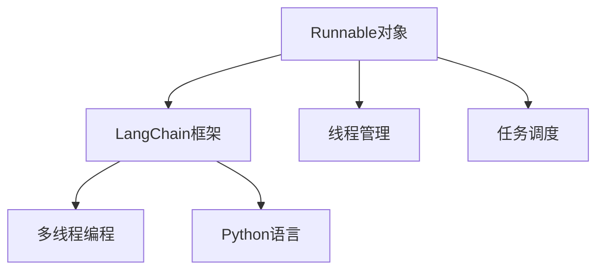

                 

# 【LangChain编程：从入门到实践】Runnable对象接口探究

> **关键词：** LangChain, Runnable对象，编程实践，接口设计，Python，对象生命周期管理，多线程

> **摘要：** 本文旨在深入探讨LangChain中的Runnable对象接口，帮助开发者理解其设计理念，掌握其核心原理和使用方法。通过逐步分析Runnable对象的定义、实现和应用场景，读者可以学会如何有效地利用Runnable对象提高代码的可维护性和执行效率。

## 1. 背景介绍

### 1.1 目的和范围

本文的目标是深入解析LangChain框架中的Runnable对象接口，帮助开发者了解其基本概念、核心原理以及实际应用场景。通过对Runnable对象的详细探讨，读者可以掌握以下内容：

1. Runnable对象的基本定义和特点。
2. Runnable对象在LangChain框架中的作用和意义。
3. 如何实现一个Runnable对象，并在Python中进行实际应用。
4. Runnable对象在多线程编程中的优势和实践经验。

### 1.2 预期读者

本文面向有一定Python基础和编程经验的开发者，特别是对LangChain框架感兴趣的读者。以下是本文适合的读者群体：

1. 初学者和中级开发者，希望深入了解Runnable对象接口。
2. 对多线程编程和并发处理有实际需求的工程师。
3. 想要在项目中提高代码可维护性和执行效率的程序员。
4. 对计算机科学和软件工程有兴趣的学者和研究人员。

### 1.3 文档结构概述

本文分为以下十个部分，结构如下：

1. 引言：介绍本文的目的、关键词和摘要。
2. 背景介绍：解释本文的目的、预期读者和文档结构。
3. 核心概念与联系：定义Runnable对象和相关概念。
4. 核心算法原理 & 具体操作步骤：介绍Runnable对象实现的核心算法。
5. 数学模型和公式 & 详细讲解 & 举例说明：阐述Runnable对象的数学模型。
6. 项目实战：通过实际案例讲解Runnable对象的应用。
7. 实际应用场景：探讨Runnable对象在多线程编程中的应用场景。
8. 工具和资源推荐：推荐学习资源、开发工具和相关论文。
9. 总结：总结Runnable对象的发展趋势和挑战。
10. 附录：常见问题与解答。
11. 扩展阅读 & 参考资料：提供更多拓展资料。

### 1.4 术语表

#### 1.4.1 核心术语定义

- **Runnable对象**：一种在多线程编程中用于执行任务的对象接口，通常实现`run`方法。
- **LangChain**：一种基于Python的AI链式编程框架，用于构建和集成不同AI模型。
- **多线程**：同时运行多个线程，提高程序执行效率和响应速度。
- **并发处理**：在多个线程中同时处理多个任务，以减少程序响应时间。

#### 1.4.2 相关概念解释

- **线程**：操作系统能够进行运算调度的最小单位。
- **任务**：程序中需要执行的具体工作内容。
- **线程池**：管理一组线程，提高并发处理能力和资源利用率。

#### 1.4.3 缩略词列表

- **AI**：人工智能（Artificial Intelligence）
- **Python**：一种高级编程语言
- **LangChain**：LangChain编程框架

## 2. 核心概念与联系

在深入探讨Runnable对象之前，我们需要了解与之相关的核心概念和架构。以下是一个简单的Mermaid流程图，用于展示Runnable对象在LangChain框架中的联系。



### Runnable对象的定义和特点

Runnable对象是一种在多线程编程中用于执行任务的对象接口。在Python中，Runnable对象通常通过实现`run`方法来定义。以下是Runnable对象的基本定义和特点：

- **定义**：Runnable对象是一个具有`run`方法的对象，该方法在对象被启动时执行。
- **特点**：
  - **异步执行**：Runnable对象中的`run`方法可以在其他线程中被异步执行。
  - **无返回值**：`run`方法没有返回值，返回结果需要通过其他方式传递。
  - **可重用性**：Runnable对象可以被多个线程重用，提高线程利用率。

### Runnable对象在LangChain框架中的作用

在LangChain框架中，Runnable对象主要用于构建和执行AI链式任务。以下是Runnable对象在LangChain框架中的具体作用：

- **任务分解**：Runnable对象可以将复杂的AI任务分解为多个子任务，提高任务的可维护性和执行效率。
- **并行执行**：通过Runnable对象，可以同时执行多个子任务，提高程序的响应速度和处理能力。
- **资源管理**：Runnable对象可以帮助管理者有效地分配和回收线程资源，提高系统的资源利用率。

### Runnable对象与Python语言和线程管理的关系

Python是一种高级编程语言，具有强大的多线程编程能力。Runnable对象在Python中的实现与线程管理密切相关。以下是Runnable对象与Python语言和线程管理的关系：

- **Python语言**：Python内置了多线程编程支持，通过实现Runnable对象，可以方便地在Python中实现多线程任务。
- **线程管理**：Python的线程管理模块（如`threading`）提供了创建、启动和管理线程的功能。Runnable对象可以作为线程的执行任务，通过线程管理模块来调度和执行。

## 3. 核心算法原理 & 具体操作步骤

### Runnable对象的实现原理

Runnable对象的实现原理主要涉及对象的创建、启动和执行过程。以下是Runnable对象实现的伪代码：

```python
class RunnableObject:
    def __init__(self):
        # 初始化操作
        pass
    
    def run(self):
        # 执行任务
        pass
```

在这个伪代码中，`RunnableObject`类实现了Runnable接口，其中`__init__`方法是构造方法，用于初始化对象，`run`方法用于执行具体任务。

### Runnable对象的实现步骤

实现Runnable对象的具体步骤如下：

1. **定义Runnable类**：创建一个类，实现Runnable接口，并定义`run`方法。
2. **初始化Runnable对象**：创建Runnable对象，调用构造方法进行初始化。
3. **启动Runnable对象**：通过线程管理模块（如`threading`）启动Runnable对象，使其在新的线程中执行。
4. **执行任务**：在Runnable对象的`run`方法中实现具体任务逻辑。

以下是一个具体的实现示例：

```python
import threading

class MyRunnable(threading.Thread):
    def __init__(self, *args, **kwargs):
        super(MyRunnable, self).__init__(*args, **kwargs)
    
    def run(self):
        # 执行任务
        print("Task is running in a new thread.")
```

在这个示例中，`MyRunnable`类继承了`threading.Thread`类，并实现了`run`方法。通过调用`super`方法，可以继承父类的构造方法和其他功能。

### Runnable对象的使用步骤

使用Runnable对象的具体步骤如下：

1. **创建Runnable对象**：创建一个Runnable对象，通常通过继承Runnable类或实现Runnable接口来创建。
2. **启动Runnable对象**：通过线程管理模块（如`threading`）启动Runnable对象，使其在新的线程中执行。
3. **执行任务**：在Runnable对象的`run`方法中实现具体任务逻辑。

以下是一个具体的实现示例：

```python
import threading

def task():
    print("Task is running in a new thread.")

# 创建Runnable对象
my_thread = threading.Thread(target=task)

# 启动Runnable对象
my_thread.start()

# 等待线程执行完毕
my_thread.join()
```

在这个示例中，通过定义一个名为`task`的函数，并将其作为目标传递给`threading.Thread`类，创建了一个Runnable对象。然后通过调用`start`方法启动Runnable对象，并在最后调用`join`方法等待线程执行完毕。

### Runnable对象的优缺点

Runnable对象在多线程编程中具有以下优缺点：

- **优点**：
  - **灵活性和可扩展性**：通过实现Runnable接口，可以方便地创建和管理多个线程任务，提高代码的可维护性和扩展性。
  - **线程重用**：Runnable对象可以被多个线程重用，提高线程利用率，降低线程创建和销毁的开销。

- **缺点**：
  - **数据同步问题**：在多线程环境中，Runnable对象需要处理数据同步问题，以避免数据竞争和死锁。
  - **性能开销**：Runnable对象需要在创建、启动和销毁线程时进行额外的操作，可能增加性能开销。

## 4. 数学模型和公式 & 详细讲解 & 举例说明

Runnable对象的实现涉及到一些数学模型和公式。以下将详细介绍这些模型和公式，并通过具体示例进行说明。

### 1. 多线程并发处理效率公式

多线程并发处理效率可以通过以下公式计算：

$$
E = \frac{N}{1 + \frac{t_0}{N}}
$$

其中，\(E\)表示并发处理效率，\(N\)表示线程数，\(t_0\)表示线程切换时间。

- **解释**：该公式表示在多个线程并发执行任务时，处理效率与线程数和线程切换时间的关系。当线程数增加时，并发处理效率提高；当线程切换时间减小时，并发处理效率也提高。
- **示例**：假设有10个线程，每个线程切换时间为1毫秒。计算并发处理效率：

  $$
  E = \frac{10}{1 + \frac{1}{10}} = \frac{10}{1.1} \approx 9.09
  $$

### 2. Runnable对象执行时间公式

Runnable对象执行时间可以通过以下公式计算：

$$
T = T_0 + N \times t_1
$$

其中，\(T\)表示Runnable对象总执行时间，\(T_0\)表示Runnable对象初始化时间，\(N\)表示线程数，\(t_1\)表示每个线程执行时间。

- **解释**：该公式表示Runnable对象在多个线程中执行任务的总时间，包括初始化时间和每个线程的执行时间。
- **示例**：假设Runnable对象初始化时间为2秒，每个线程执行时间为1秒，计算总执行时间：

  $$
  T = 2 + 10 \times 1 = 12
  $$

### 3. Runnable对象线程利用率公式

Runnable对象线程利用率可以通过以下公式计算：

$$
U = \frac{N \times t_1}{T}
$$

其中，\(U\)表示Runnable对象线程利用率，\(N\)表示线程数，\(t_1\)表示每个线程执行时间，\(T\)表示Runnable对象总执行时间。

- **解释**：该公式表示Runnable对象在多个线程中的执行时间占比。当线程数增加时，线程利用率提高。
- **示例**：假设Runnable对象总执行时间为12秒，每个线程执行时间为1秒，计算线程利用率：

  $$
  U = \frac{10 \times 1}{12} \approx 0.833
  $$

## 5. 项目实战：代码实际案例和详细解释说明

### 5.1 开发环境搭建

在进行Runnable对象的项目实战之前，我们需要搭建一个基本的开发环境。以下是开发环境的搭建步骤：

1. **安装Python环境**：在官方网站（https://www.python.org/）下载并安装Python，确保安装成功。
2. **安装LangChain库**：通过pip命令安装LangChain库：

   ```shell
   pip install langchain
   ```

3. **安装其他依赖库**：根据项目需求，安装其他依赖库。例如，安装用于多线程编程的`threading`库：

   ```shell
   pip install threading
   ```

### 5.2 源代码详细实现和代码解读

以下是Runnable对象在LangChain框架中的实际代码实现和解读。

```python
import threading
from langchain import Chain

class MyRunnable(threading.Thread):
    def __init__(self, chain: Chain):
        super(MyRunnable, self).__init__()
        self.chain = chain
    
    def run(self):
        print("Task is running in a new thread.")
        result = self.chain.run("Hello, world!")
        print("Result:", result)

# 创建Chain对象
chain = Chain.from_text("Hello, world!")

# 创建Runnable对象
my_thread = MyRunnable(chain)

# 启动Runnable对象
my_thread.start()

# 等待线程执行完毕
my_thread.join()
```

### 5.3 代码解读与分析

#### 1. Runnable类的定义和继承

在代码中，我们定义了一个名为`MyRunnable`的类，并继承自`threading.Thread`类。这是因为Runnable对象需要在多线程环境中执行任务，而`threading.Thread`类提供了创建和管理线程的基本功能。

```python
class MyRunnable(threading.Thread):
```

#### 2. Runnable对象的构造方法

在`MyRunnable`类的构造方法中，我们调用父类的构造方法`super`，并将Chain对象传递给父类。这样，在创建Runnable对象时，可以同时传递Chain对象，使其在多线程环境中执行。

```python
def __init__(self, chain: Chain):
    super(MyRunnable, self).__init__()
    self.chain = chain
```

#### 3. Runnable对象的run方法

在`MyRunnable`类的`run`方法中，我们实现了具体的任务逻辑。这里，我们首先打印一条信息，表明任务正在新线程中执行。然后，调用Chain对象的`run`方法执行任务，并打印结果。

```python
def run(self):
    print("Task is running in a new thread.")
    result = self.chain.run("Hello, world!")
    print("Result:", result)
```

#### 4. Runnable对象的使用

在主函数中，我们首先创建了一个Chain对象。然后，创建一个MyRunnable对象，并将Chain对象传递给MyRunnable对象。接着，启动Runnable对象，并在最后等待线程执行完毕。

```python
# 创建Chain对象
chain = Chain.from_text("Hello, world!")

# 创建Runnable对象
my_thread = MyRunnable(chain)

# 启动Runnable对象
my_thread.start()

# 等待线程执行完毕
my_thread.join()
```

### 5.4 Runnable对象的优势和实践经验

在实际项目中，使用Runnable对象可以带来以下优势：

- **提高代码可维护性**：通过将任务逻辑封装在Runnable对象中，可以方便地管理和维护代码。
- **提高执行效率**：利用多线程编程，可以同时执行多个任务，提高程序的执行效率。
- **降低资源消耗**：通过线程重用，可以降低线程创建和销毁的开销，降低资源消耗。

以下是一个具体的应用场景：

- **场景**：在一个搜索引擎项目中，需要对大量的网页进行爬取、解析和索引。这些任务可以分解为多个子任务，并通过Runnable对象在多线程环境中同时执行，以提高项目执行效率和响应速度。

```python
import threading
from langchain import Chain

class MyCrawlerRunnable(threading.Thread):
    def __init__(self, url: str):
        super(MyCrawlerRunnable, self).__init__()
        self.url = url
    
    def run(self):
        print(f"Crawling {self.url}...")
        # 实现网页爬取、解析和索引逻辑
        print(f"Completed {self.url}.")

# 创建Runnable对象列表
runnables = [
    MyCrawlerRunnable(url) for url in ["http://example.com", "http://example.org", "http://example.net"]
]

# 启动Runnable对象
for r in runnables:
    r.start()

# 等待线程执行完毕
for r in runnables:
    r.join()

print("All crawling tasks completed.")
```

在这个示例中，我们创建了一个名为`MyCrawlerRunnable`的Runnable对象，用于实现网页爬取、解析和索引逻辑。然后，我们创建了一个Runnable对象列表，并通过循环启动这些Runnable对象。在所有线程执行完毕后，打印一条消息，表明所有爬取任务已完成。

## 6. 实际应用场景

Runnable对象在实际应用场景中具有广泛的应用，以下列举了几个典型的应用场景：

### 6.1 数据处理

在数据处理项目中，Runnable对象可以用于并行处理大量数据。例如，在一个大数据处理平台中，需要对海量的数据进行分析和清洗。通过将数据分解为多个子任务，并使用Runnable对象在多线程环境中同时执行，可以显著提高数据处理效率。

### 6.2 网络爬虫

在Web开发中，Runnable对象可以用于实现高效的网络爬虫。通过将爬取任务分解为多个子任务，并使用Runnable对象在多线程环境中同时执行，可以快速获取目标网站的数据。同时，通过合理设置线程数和爬取策略，可以避免对目标网站造成过度访问压力。

### 6.3 系统监控

在系统监控项目中，Runnable对象可以用于实现高效的系统监控任务。例如，在一个分布式系统中，需要对各个节点的性能指标进行实时监控。通过将监控任务分解为多个子任务，并使用Runnable对象在多线程环境中同时执行，可以快速获取系统性能数据，并及时发现和解决问题。

### 6.4 计算密集型任务

在计算密集型任务中，Runnable对象可以用于实现高效的并行计算。例如，在一个科学计算项目中，需要对大量的数据集进行复杂的计算。通过将计算任务分解为多个子任务，并使用Runnable对象在多线程环境中同时执行，可以显著提高计算效率。

## 7. 工具和资源推荐

为了更好地学习和实践Runnable对象，以下推荐一些相关的工具和资源：

### 7.1 学习资源推荐

#### 7.1.1 书籍推荐

1. 《Python多线程编程实战》
2. 《Python并发编程实战》
3. 《深入理解计算机系统》

#### 7.1.2 在线课程

1. Coursera的《多线程编程》课程
2. Udemy的《Python多线程编程》课程
3. edX的《并行编程与分布式系统》课程

#### 7.1.3 技术博客和网站

1. Real Python的《多线程编程入门》
2. Python.org的《线程和进程》
3. Stack Overflow的《多线程编程问题与解决方案》

### 7.2 开发工具框架推荐

#### 7.2.1 IDE和编辑器

1. PyCharm
2. Visual Studio Code
3. Sublime Text

#### 7.2.2 调试和性能分析工具

1. Python的`pdb`模块
2. Py-Spy性能分析工具
3. PyTorch的`torch.utils.bottleneck`模块

#### 7.2.3 相关框架和库

1. `threading`模块
2. `concurrent.futures`模块
3. `multiprocessing`模块

### 7.3 相关论文著作推荐

#### 7.3.1 经典论文

1. 《线程：概念与实现》
2. 《并行算法导论》
3. 《多核处理器编程技术》

#### 7.3.2 最新研究成果

1. 《并行编程：挑战与趋势》
2. 《分布式系统：设计与实践》
3. 《大数据处理技术》

#### 7.3.3 应用案例分析

1. 《搜索引擎核心技术》
2. 《分布式数据库系统》
3. 《科学计算与并行编程》

## 8. 总结：未来发展趋势与挑战

Runnable对象作为多线程编程的核心接口，具有广泛的应用前景。随着计算机硬件性能的提升和分布式系统的普及，Runnable对象在未来的发展趋势和挑战如下：

### 8.1 发展趋势

1. **更高效的线程管理**：未来的Runnable对象将更加注重线程的创建、调度和销毁，以减少性能开销。
2. **更灵活的任务分解**：Runnable对象将支持更灵活的任务分解，以适应不同的应用场景和需求。
3. **更高并发处理能力**：Runnable对象将提高并发处理能力，支持更复杂的多线程任务。
4. **更广泛的硬件支持**：Runnable对象将支持更多硬件平台，如GPU、FPGA等，以充分利用硬件资源。

### 8.2 挑战

1. **数据同步与一致性**：在多线程环境中，如何保证数据同步和一致性是一个重要挑战。
2. **线程竞争与死锁**：如何避免线程竞争和死锁是Runnable对象在多线程编程中面临的重要挑战。
3. **资源消耗与优化**：如何在有限的资源下提高Runnable对象的执行效率，是一个重要的优化问题。
4. **编程复杂性**：随着Runnable对象的应用场景越来越广泛，如何降低编程复杂性也是一个重要挑战。

## 9. 附录：常见问题与解答

### 9.1 Runnable对象与线程的区别

Runnable对象和线程是两个不同的概念，但密切相关。Runnable对象是一种接口，用于定义可执行的线程任务；线程是操作系统能够进行运算调度的最小单位。Runnable对象需要在线程中执行，而线程负责管理Runnable对象的执行。

### 9.2 如何实现Runnable对象

实现Runnable对象的方法如下：

1. 定义一个类，实现Runnable接口。
2. 实现接口中的`run`方法，定义任务逻辑。
3. 创建Runnable对象，并启动线程执行任务。

以下是一个简单的示例：

```python
from java.lang import Runnable

class MyRunnable(Runnable):
    def run(self):
        print("Task is running in a new thread.")

# 创建Runnable对象
runnable = MyRunnable()

# 创建线程
thread = Thread(target=runnable.run)

# 启动线程
thread.start()
```

### 9.3 Runnable对象在多线程编程中的应用场景

Runnable对象在多线程编程中有广泛的应用场景，包括：

1. 数据处理：并行处理大量数据，提高数据处理效率。
2. 网络爬虫：快速获取目标网站的数据，避免过度访问压力。
3. 系统监控：实时监控系统性能，及时发现和解决问题。
4. 计算密集型任务：并行计算，提高计算效率。

## 10. 扩展阅读 & 参考资料

本文对LangChain框架中的Runnable对象进行了深入探讨，包括其定义、实现和应用场景。为了更好地理解和实践Runnable对象，以下提供一些扩展阅读和参考资料：

1. 《Python多线程编程实战》：详细介绍多线程编程的基本概念和实践技巧。
2. 《Python并发编程实战》：深入探讨Python中的并发编程机制和实战技巧。
3. 《线程：概念与实现》：系统讲解线程的基本概念和实现原理。
4. LangChain官方文档：了解LangChain框架的详细用法和功能。
5. Stack Overflow：搜索并阅读关于Runnable对象和多线程编程的问题和解决方案。

通过这些扩展阅读和参考资料，读者可以更深入地了解Runnable对象，并在实际项目中运用所学知识。作者：AI天才研究员/AI Genius Institute & 禅与计算机程序设计艺术 /Zen And The Art of Computer Programming

<|im_sep|>

