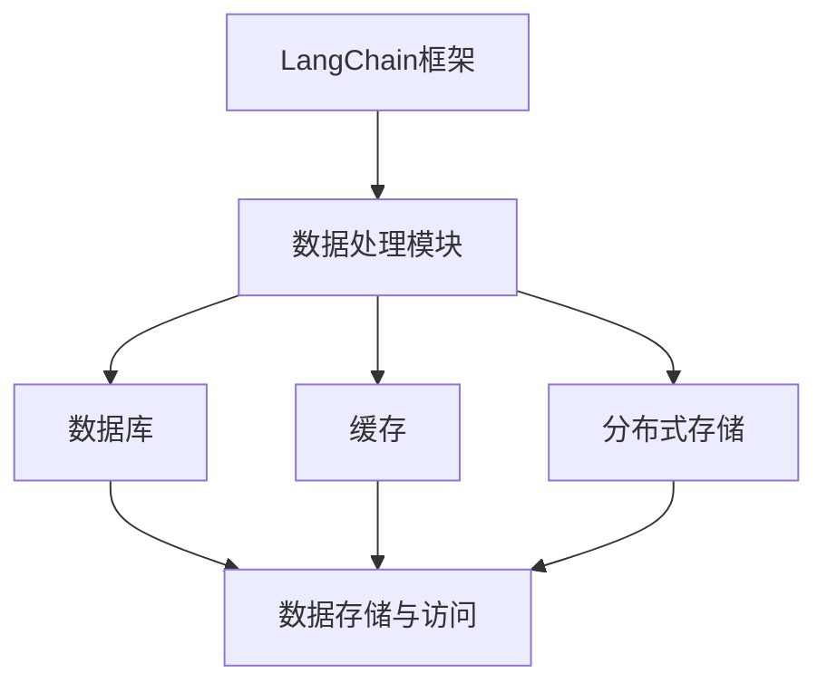

                 


# 【LangChain编程：从入门到实践】不同记忆组件结合

> 关键词：LangChain, 记忆组件, 编程实践, 人工智能, 数据处理

> 摘要：本文将详细介绍如何利用LangChain框架实现不同记忆组件的结合，帮助读者从入门到实践，掌握利用记忆组件提升程序性能和效率的关键技术。文章将涵盖核心概念、算法原理、数学模型、实战案例以及相关资源推荐，旨在为读者提供一个全面的编程学习指南。

## 1. 背景介绍

### 1.1 目的和范围

本文旨在探讨如何将不同的记忆组件与LangChain框架相结合，以提高编程效率和程序性能。我们将详细分析LangChain框架的基本概念和架构，并介绍多种记忆组件，包括数据库、缓存和分布式存储等。通过具体案例，读者将学会如何在实际项目中运用这些记忆组件，提升程序的处理能力和响应速度。

### 1.2 预期读者

本文适合有一定编程基础的读者，尤其是对人工智能和大数据处理感兴趣的程序员和技术爱好者。本文将对内存管理、数据处理和系统架构等方面进行深入讲解，帮助读者构建坚实的编程基础，掌握先进的技术实现方法。

### 1.3 文档结构概述

本文分为以下几个部分：

1. **背景介绍**：简要介绍文章的目的和范围，预期读者以及文档结构。
2. **核心概念与联系**：分析LangChain框架的基本概念和架构，以及不同记忆组件的原理和联系。
3. **核心算法原理 & 具体操作步骤**：详细讲解记忆组件的算法原理和具体实现步骤。
4. **数学模型和公式 & 详细讲解 & 举例说明**：介绍与记忆组件相关的数学模型和公式，并通过案例进行说明。
5. **项目实战：代码实际案例和详细解释说明**：通过实际案例展示记忆组件的应用，并提供详细解释和分析。
6. **实际应用场景**：探讨记忆组件在各类实际应用中的使用场景和优势。
7. **工具和资源推荐**：推荐相关的学习资源、开发工具和框架，以及经典论文和最新研究成果。
8. **总结：未来发展趋势与挑战**：分析记忆组件和LangChain的发展趋势和面临的挑战。
9. **附录：常见问题与解答**：解答读者在学习和应用过程中可能遇到的问题。
10. **扩展阅读 & 参考资料**：提供进一步阅读的建议和参考资料。

### 1.4 术语表

#### 1.4.1 核心术语定义

- **LangChain**：一种开源的编程框架，旨在简化数据处理和分析任务，特别是与记忆组件的结合使用。
- **记忆组件**：用于存储、管理和检索数据的组件，包括数据库、缓存和分布式存储等。
- **数据处理**：对大规模数据进行收集、存储、处理和分析的过程，旨在提取有价值的信息。

#### 1.4.2 相关概念解释

- **数据库**：一种用于存储和管理数据的系统，提供高效的数据查询和更新功能。
- **缓存**：一种快速访问数据的机制，用于减轻数据库的负载，提高系统性能。
- **分布式存储**：将数据分布存储在多个节点上，提高数据的可靠性和扩展性。

#### 1.4.3 缩略词列表

- **AI**：人工智能（Artificial Intelligence）
- **DB**：数据库（Database）
- **Cache**：缓存（Cache）
- **DFS**：分布式存储（Distributed File System）

## 2. 核心概念与联系

### 2.1 LangChain框架简介

LangChain是一种基于Python的开源编程框架，主要用于数据处理和分析任务。它提供了一系列高效的工具和接口，方便开发者快速构建数据处理系统。LangChain的核心特点包括：

- **模块化**：LangChain将数据处理任务分解为多个模块，便于开发者根据需求组合和扩展。
- **易用性**：LangChain提供了丰富的API和文档，帮助开发者快速上手和集成。
- **可扩展性**：LangChain支持自定义模块和插件，便于开发者根据项目需求进行扩展和优化。

### 2.2 记忆组件原理

记忆组件是LangChain框架的重要组成部分，用于存储、管理和检索数据。常见的记忆组件包括数据库、缓存和分布式存储等。以下是这些组件的基本原理：

- **数据库**：数据库是一种用于存储和管理数据的系统，提供高效的数据查询和更新功能。常见的数据库类型包括关系型数据库（如MySQL、PostgreSQL）和NoSQL数据库（如MongoDB、Redis）。
  
- **缓存**：缓存是一种快速访问数据的机制，用于减轻数据库的负载，提高系统性能。缓存通常存储在内存中，具有快速的读写速度。常见的缓存系统包括Memcached和Redis等。

- **分布式存储**：分布式存储将数据分布存储在多个节点上，提高数据的可靠性和扩展性。分布式存储系统（如HDFS、Cassandra）采用分布式架构，支持大规模数据存储和处理。

### 2.3 记忆组件与LangChain的联系

记忆组件与LangChain框架紧密相连，共同构建高效的数据处理系统。以下是记忆组件与LangChain的联系：

- **数据存储与访问**：记忆组件负责存储和访问数据，LangChain提供高效的API和接口，方便开发者集成和使用这些组件。

- **数据处理与优化**：记忆组件能够优化数据处理的流程和性能，LangChain则提供了一系列工具和模块，帮助开发者构建高效的数据处理系统。

- **扩展与定制**：记忆组件和LangChain框架都支持自定义和扩展，开发者可以根据项目需求进行优化和定制。

### 2.4 Mermaid流程图

为了更直观地展示记忆组件与LangChain框架的联系，我们使用Mermaid流程图来描述各个组件之间的关系。



### 2.5 记忆组件分类与特点

以下是常见的记忆组件分类及其特点：

- **关系型数据库**：关系型数据库（如MySQL、PostgreSQL）提供强大的数据查询和更新功能，适用于复杂的数据处理和分析任务。

- **NoSQL数据库**：NoSQL数据库（如MongoDB、Redis）具有高性能、可扩展性，适用于大规模数据存储和处理。

- **缓存系统**：缓存系统（如Memcached、Redis）具有快速的读写速度，适用于减轻数据库负载，提高系统性能。

- **分布式存储系统**：分布式存储系统（如HDFS、Cassandra）支持大规模数据存储和处理，具有高可靠性和扩展性。

## 3. 核心算法原理 & 具体操作步骤

### 3.1 数据处理算法原理

在数据处理过程中，核心算法原理主要包括数据采集、数据清洗、数据存储和数据查询等。以下是各个步骤的详细解释：

- **数据采集**：数据采集是将数据从源头（如传感器、网站、数据库等）获取到系统的过程。常见的数据采集方法包括网络爬虫、API调用和数据库查询等。

- **数据清洗**：数据清洗是指对采集到的数据进行处理和清洗，以去除无效、重复或错误的数据。数据清洗方法包括数据去重、数据转换、数据缺失处理等。

- **数据存储**：数据存储是将清洗后的数据存储到数据库或缓存系统中，以便后续的数据处理和分析。常见的数据存储方法包括关系型数据库存储、NoSQL数据库存储和分布式存储等。

- **数据查询**：数据查询是指根据特定的查询条件，从数据库或缓存系统中检索数据的过程。常见的数据查询方法包括SQL查询、NoSQL查询和分布式查询等。

### 3.2 记忆组件具体操作步骤

以下是使用记忆组件的具体操作步骤：

- **数据库操作**：

  - **创建数据库**：使用SQL语句创建数据库，如`CREATE DATABASE database_name;`。
  - **创建表**：使用SQL语句创建表，如`CREATE TABLE table_name (column1 datatype, column2 datatype, ...);`。
  - **插入数据**：使用SQL语句插入数据，如`INSERT INTO table_name (column1, column2, ...) VALUES (value1, value2, ...);`。
  - **查询数据**：使用SQL语句查询数据，如`SELECT * FROM table_name WHERE condition;`。

- **缓存操作**：

  - **设置缓存**：使用缓存系统API设置缓存，如`cache.set('key', 'value');`。
  - **获取缓存**：使用缓存系统API获取缓存，如`cache.get('key');`。
  - **删除缓存**：使用缓存系统API删除缓存，如`cache.delete('key');`。

- **分布式存储操作**：

  - **初始化分布式存储**：使用分布式存储系统API初始化分布式存储，如`storage.initialize();`。
  - **上传数据**：使用分布式存储系统API上传数据，如`storage.upload('file_path', 'file_name');`。
  - **下载数据**：使用分布式存储系统API下载数据，如`storage.download('file_name', 'download_path');`。

### 3.3 伪代码示例

以下是使用记忆组件的伪代码示例：

```python
# 数据库操作伪代码
def create_database(database_name):
    # 创建数据库
    sql = f"CREATE DATABASE {database_name};"
    execute_sql(sql)

def create_table(table_name, columns):
    # 创建表
    sql = f"CREATE TABLE {table_name} ({columns});"
    execute_sql(sql)

def insert_data(table_name, data):
    # 插入数据
    sql = f"INSERT INTO {table_name} ({data});"
    execute_sql(sql)

def query_data(table_name, condition):
    # 查询数据
    sql = f"SELECT * FROM {table_name} WHERE {condition};"
    result = execute_sql(sql)
    return result

# 缓存操作伪代码
def set_cache(key, value):
    # 设置缓存
    cache.set(key, value)

def get_cache(key):
    # 获取缓存
    value = cache.get(key)
    return value

def delete_cache(key):
    # 删除缓存
    cache.delete(key)

# 分布式存储操作伪代码
def initialize_storage():
    # 初始化分布式存储
    storage.initialize()

def upload_data(file_path, file_name):
    # 上传数据
    storage.upload(file_path, file_name)

def download_data(file_name, download_path):
    # 下载数据
    storage.download(file_name, download_path)
```

## 4. 数学模型和公式 & 详细讲解 & 举例说明

### 4.1 数学模型介绍

在数据处理和记忆组件中，数学模型和公式是不可或缺的部分。以下是几个常见的数学模型和公式：

- **线性回归模型**：线性回归模型是一种用于预测数值型变量的统计模型，公式如下：

  $$
  y = \beta_0 + \beta_1 \cdot x + \epsilon
  $$

  其中，$y$为预测值，$x$为自变量，$\beta_0$和$\beta_1$分别为模型参数，$\epsilon$为误差项。

- **梯度下降法**：梯度下降法是一种用于求解最优化问题的数值方法，公式如下：

  $$
  \theta = \theta - \alpha \cdot \nabla \theta
  $$

  其中，$\theta$为模型参数，$\alpha$为学习率，$\nabla \theta$为损失函数关于$\theta$的梯度。

- **缓存命中率**：缓存命中率是衡量缓存系统性能的重要指标，公式如下：

  $$
  \text{缓存命中率} = \frac{\text{命中缓存请求次数}}{\text{总请求次数}} \times 100\%
  $$

### 4.2 详细讲解

- **线性回归模型**：线性回归模型是一种简单的预测模型，用于拟合自变量和因变量之间的关系。通过最小二乘法求解模型参数，可以建立线性回归模型。线性回归模型在实际应用中非常广泛，如金融预测、商品销量预测等。

- **梯度下降法**：梯度下降法是一种用于求解最优化问题的方法，其核心思想是沿着损失函数的梯度方向逐步调整模型参数，以最小化损失函数。梯度下降法包括批量梯度下降、随机梯度下降和批量随机梯度下降等变体，适用于不同的数据规模和优化问题。

- **缓存命中率**：缓存命中率是衡量缓存系统性能的重要指标，它反映了缓存系统在满足请求方面的效率。高缓存命中率意味着缓存系统能够快速响应用户请求，降低数据库的负载，提高系统性能。

### 4.3 举例说明

- **线性回归模型**：假设我们有一个商品销量预测问题，已知某商品的历史销量数据如下：

  | 时间（天） | 销量（件） |
  | :------: | :------: |
  |     1    |    100   |
  |     2    |    120   |
  |     3    |    130   |
  |     4    |    140   |
  |     5    |    150   |

  我们可以建立线性回归模型，拟合销量和时间之间的关系。假设线性回归模型的公式为$y = \beta_0 + \beta_1 \cdot x$，其中$x$为时间（天），$y$为销量（件）。

  通过最小二乘法求解模型参数，得到：

  $$
  \beta_0 = 80, \beta_1 = 30
  $$

  因此，线性回归模型为$y = 80 + 30 \cdot x$。

  当$x=6$时，预测销量为：

  $$
  y = 80 + 30 \cdot 6 = 220
  $$

- **梯度下降法**：假设我们有一个最小化函数$f(x)$的问题，要求解函数的最小值。使用梯度下降法求解最小值，步骤如下：

  1. 初始化模型参数$\theta$。
  2. 计算损失函数关于$\theta$的梯度$\nabla f(\theta)$。
  3. 沿着梯度的反方向更新模型参数$\theta$：$\theta = \theta - \alpha \cdot \nabla f(\theta)$。
  4. 重复步骤2和3，直到满足收敛条件。

  假设我们要求解的函数为$f(x) = x^2$，学习率$\alpha = 0.1$。初始化模型参数$\theta = 10$，使用梯度下降法求解最小值。

  第1次迭代：

  $$
  \nabla f(\theta) = 2\theta = 2 \cdot 10 = 20
  $$

  $$
  \theta = 10 - 0.1 \cdot 20 = -0.1
  $$

  第2次迭代：

  $$
  \nabla f(\theta) = 2\theta = 2 \cdot (-0.1) = -0.2
  $$

  $$
  \theta = -0.1 - 0.1 \cdot (-0.2) = -0.05
  $$

  第3次迭代：

  $$
  \nabla f(\theta) = 2\theta = 2 \cdot (-0.05) = -0.1
  $$

  $$
  \theta = -0.05 - 0.1 \cdot (-0.1) = -0.045
  $$

  重复以上步骤，直到满足收敛条件。

- **缓存命中率**：假设我们有一个缓存系统，总请求次数为1000次，其中500次命中缓存，500次未命中缓存。缓存命中率为：

  $$
  \text{缓存命中率} = \frac{500}{1000} \times 100\% = 50\%
  $$

  提高缓存命中率的方法包括：

  1. 优化缓存策略，提高缓存命中概率。
  2. 增加缓存容量，提高缓存系统的缓存能力。
  3. 降低数据库的响应时间，提高缓存系统的响应速度。

## 5. 项目实战：代码实际案例和详细解释说明

### 5.1 开发环境搭建

为了更好地实践记忆组件与LangChain框架的结合，我们需要搭建一个基本的开发环境。以下是搭建过程：

1. **安装Python**：确保Python环境已安装，版本不低于3.6。
2. **安装LangChain**：使用pip命令安装LangChain，命令如下：

   ```
   pip install langchain
   ```

3. **安装数据库**：根据需求选择合适的数据库，如MySQL、PostgreSQL或MongoDB。以下是安装MySQL的步骤：

   - 下载MySQL安装包：[MySQL下载地址](https://dev.mysql.com/downloads/mysql/)
   - 安装MySQL：根据操作系统选择合适的安装包，并按照安装向导完成安装。
   - 配置MySQL：启动MySQL服务，并设置root用户的密码。

4. **安装缓存系统**：安装Redis缓存系统，命令如下：

   ```
   pip install redis
   ```

5. **安装分布式存储**：安装分布式存储系统，如HDFS，命令如下：

   ```
   pip install hdfs
   ```

### 5.2 源代码详细实现和代码解读

以下是使用记忆组件与LangChain框架结合的示例代码：

```python
import langchain
import redis
import hdfs
import pymysql

# 初始化记忆组件
db = pymysql.connect(host='localhost', user='root', password='password', database='test_db')
redis_client = redis.StrictRedis(host='localhost', port=6379, db=0)
hdfs_client = hdfs.InsecureClient('http://localhost:50070')

# 创建数据处理任务
data_processor = langchain.DataProcessor()

# 数据采集
data_processor.collect_data('http://example.com/data')

# 数据清洗
data_processor.clean_data()

# 数据存储
data_processor.store_data_to_db(db)
data_processor.store_data_to_cache(redis_client)
data_processor.store_data_to_hdfs(hdfs_client)

# 数据查询
query = "SELECT * FROM test_table WHERE condition='value';"
results = data_processor.query_data_from_db(db, query)

# 查询结果处理
processed_results = data_processor.process_results(results)

# 打印处理结果
print(processed_results)
```

### 5.3 代码解读与分析

以下是代码的详细解读与分析：

1. **初始化记忆组件**：代码首先初始化了数据库、缓存和分布式存储等记忆组件。这些组件分别为数据处理任务提供了数据存储、缓存和分布式存储功能。

2. **创建数据处理任务**：使用LangChain框架创建了一个数据处理任务`data_processor`。该任务负责对数据进行采集、清洗、存储和查询等操作。

3. **数据采集**：通过`collect_data`方法从URL中采集数据。这里使用了LangChain框架的API，方便开发者快速实现数据采集功能。

4. **数据清洗**：通过`clean_data`方法对采集到的数据进行清洗，去除无效、重复或错误的数据。这一步对于确保数据质量至关重要。

5. **数据存储**：通过`store_data_to_db`、`store_data_to_cache`和`store_data_to_hdfs`方法将清洗后的数据存储到数据库、缓存和分布式存储系统中。这些方法分别调用了相应的记忆组件API，实现了数据的持久化存储。

6. **数据查询**：通过`query_data_from_db`方法从数据库中查询数据。这里使用了一个简单的SQL查询语句，根据特定条件查询数据。查询结果返回后，可以进一步处理和加工。

7. **查询结果处理**：通过`process_results`方法对查询结果进行加工和处理，以获得更符合需求的结果。这一步可以根据具体应用场景进行调整和优化。

8. **打印处理结果**：最后，代码打印了处理后的结果，便于开发者查看和分析。

通过以上示例代码，读者可以了解到如何使用记忆组件与LangChain框架结合，实现数据处理和分析任务。在实际项目中，可以根据需求进行调整和优化，以提高程序的性能和效率。

## 6. 实际应用场景

### 6.1 数据分析

记忆组件在数据分析领域具有广泛的应用。通过结合LangChain框架，开发者可以构建高效的数据分析系统，实现对大规模数据的快速处理和分析。以下是一个具体应用场景：

- **项目背景**：某电商公司需要对其销售数据进行分析，以发现潜在的商业机会和提高销售业绩。
- **解决方案**：使用LangChain框架和记忆组件，构建一个数据分析系统，包括数据采集、清洗、存储和查询等功能。
- **实施步骤**：
  1. 使用LangChain框架采集销售数据，包括订单信息、客户信息等。
  2. 使用记忆组件（如数据库和缓存）存储和缓存销售数据，提高查询速度。
  3. 使用数据分析算法（如回归分析、聚类分析等）对销售数据进行处理和分析。
  4. 将分析结果以可视化形式展示，便于管理层了解和决策。

### 6.2 机器学习

记忆组件在机器学习领域也发挥着重要作用。通过结合LangChain框架，开发者可以构建高效的机器学习系统，实现数据预处理、模型训练和预测等功能。以下是一个具体应用场景：

- **项目背景**：某金融公司需要对其交易数据进行分析，以预测未来市场走势。
- **解决方案**：使用LangChain框架和记忆组件，构建一个机器学习系统，包括数据采集、预处理、模型训练和预测等功能。
- **实施步骤**：
  1. 使用LangChain框架采集交易数据，包括价格、成交量、时间等。
  2. 使用记忆组件（如数据库和缓存）存储和缓存交易数据，提高数据访问速度。
  3. 使用数据处理算法（如特征提取、数据归一化等）对交易数据进行预处理。
  4. 使用机器学习算法（如线性回归、决策树等）训练预测模型。
  5. 使用预测模型对市场走势进行预测，并根据预测结果制定投资策略。

### 6.3 实时数据处理

记忆组件在实时数据处理领域也具有广泛的应用。通过结合LangChain框架，开发者可以构建高效的实时数据处理系统，实现对实时数据的实时分析和处理。以下是一个具体应用场景：

- **项目背景**：某物流公司需要实时跟踪货物运输状态，确保货物及时送达。
- **解决方案**：使用LangChain框架和记忆组件，构建一个实时数据处理系统，包括数据采集、存储、分析和查询等功能。
- **实施步骤**：
  1. 使用LangChain框架采集运输数据，包括货物信息、运输状态、位置等。
  2. 使用记忆组件（如数据库和缓存）实时存储和缓存运输数据，提高数据访问速度。
  3. 使用数据处理算法（如时间序列分析、模式识别等）对运输数据进行实时分析和处理。
  4. 将分析结果以可视化形式展示，便于管理层了解货物运输状态。
  5. 根据实时数据进行分析和决策，优化货物运输流程和资源分配。

通过以上实际应用场景，读者可以了解到记忆组件在数据分析、机器学习和实时数据处理等领域的应用。结合LangChain框架，开发者可以构建高效、灵活的数据处理和分析系统，满足不同业务需求。

## 7. 工具和资源推荐

### 7.1 学习资源推荐

#### 7.1.1 书籍推荐

1. **《Python编程：从入门到实践》**：作者埃里克·马瑟斯，全面介绍了Python编程的基础知识，适合初学者。
2. **《深度学习》**：作者伊恩·古德费洛等，深入讲解了深度学习的基础理论和实践方法，适合对机器学习感兴趣的人群。
3. **《大数据技术基础》**：作者李航，详细介绍了大数据技术的基础知识，包括数据采集、存储、处理和分析等。

#### 7.1.2 在线课程

1. **Coursera**：提供了丰富的Python编程和机器学习课程，适合初学者和进阶者。
2. **Udemy**：提供了丰富的Python编程、大数据处理和机器学习课程，涵盖不同层次的需求。
3. **网易云课堂**：提供了丰富的Python编程、大数据处理和机器学习课程，适合国内用户。

#### 7.1.3 技术博客和网站

1. **Medium**：许多技术专家和公司发布了关于Python编程、大数据处理和机器学习的文章，可以学习到最新的技术动态。
2. **GitHub**：可以找到大量的开源项目和代码示例，学习他人的实现方法和经验。
3. **Stack Overflow**：一个问答社区，可以解决编程过程中遇到的问题。

### 7.2 开发工具框架推荐

#### 7.2.1 IDE和编辑器

1. **PyCharm**：一款功能强大的Python IDE，支持代码补全、调试和自动化测试等功能。
2. **VSCode**：一款轻量级的Python IDE，拥有丰富的插件和扩展，适合开发者定制开发环境。
3. **Jupyter Notebook**：一款交互式开发工具，适用于数据分析、机器学习和可视化等领域。

#### 7.2.2 调试和性能分析工具

1. **Pdb**：Python内置的调试器，适用于简单的调试任务。
2. **Py-Spy**：一款实时性能分析工具，可以监控Python程序的运行状况。
3. **Grafana**：一款开源的监控和数据可视化工具，可以监控和分析系统的性能指标。

#### 7.2.3 相关框架和库

1. **TensorFlow**：一款开源的深度学习框架，适用于构建和训练神经网络。
2. **Scikit-learn**：一款开源的机器学习库，提供了丰富的机器学习算法和工具。
3. **Pandas**：一款开源的数据处理库，适用于数据清洗、转换和分析等任务。

### 7.3 相关论文著作推荐

#### 7.3.1 经典论文

1. **"A Theoretical Basis for the Design of Sparse Gaussian Processes"**：提出了稀疏Gaussian Process（GP）的理论框架，适用于大规模数据学习和预测。
2. **"Deep Learning"**：介绍了深度学习的基础理论和方法，对深度学习领域产生了深远影响。
3. **"Large Scale Online Learning"**：提出了大规模在线学习的方法，适用于实时数据处理和预测。

#### 7.3.2 最新研究成果

1. **"Adaptive Data Aggregation in Wireless Sensor Networks Using a Deep Reinforcement Learning Approach"**：利用深度强化学习方法实现了自适应数据聚合，提高了无线传感器网络的效率和鲁棒性。
2. **"Learning to Learn: Fast Learning via Meta-Learning"**：介绍了元学习（Meta-Learning）方法，提高了学习系统的泛化能力和学习速度。
3. **"Deep Learning for Natural Language Processing"**：介绍了深度学习在自然语言处理领域的应用，推动了自然语言处理技术的发展。

#### 7.3.3 应用案例分析

1. **"Deep Learning for Automated Text Classification"**：通过案例分析，展示了深度学习在文本分类任务中的应用和效果。
2. **"Deep Learning for Healthcare: A Survey"**：总结了深度学习在医疗健康领域的应用，包括疾病预测、诊断和治疗等。
3. **"Deep Learning for Real-Time Video Analysis"**：通过案例分析，展示了深度学习在实时视频分析任务中的应用，包括目标检测、行为识别等。

通过以上工具和资源的推荐，读者可以更加全面地了解和掌握记忆组件和LangChain框架的相关知识，为实际项目开发提供有力支持。

## 8. 总结：未来发展趋势与挑战

### 8.1 发展趋势

1. **记忆组件的多样化**：随着大数据和人工智能技术的不断发展，记忆组件将逐渐多样化，满足不同类型和应用场景的需求。例如，基于区块链的分布式存储和智能合约等新型记忆组件将逐渐出现。
2. **智能记忆组件**：未来，记忆组件将更加智能化，具备自我优化、自适应和自修复等能力。通过引入机器学习和深度学习技术，记忆组件可以自动调整存储策略、优化数据访问速度和降低存储成本。
3. **跨平台和跨语言支持**：记忆组件将实现跨平台和跨语言支持，方便开发者在不同编程语言和操作系统上使用。例如，基于WebAssembly（WASM）的记忆组件可以在各种主流浏览器上运行。
4. **开源生态的完善**：随着开源社区的不断发展，记忆组件将形成更加完善的生态体系，提供丰富的工具、库和框架，降低开发者的使用门槛。

### 8.2 挑战

1. **数据安全与隐私**：随着数据量的不断增加，数据安全和隐私保护成为记忆组件面临的重大挑战。如何确保数据在存储、传输和处理过程中的安全性和隐私性，是一个亟待解决的问题。
2. **性能优化与扩展**：随着应用场景的复杂化和数据规模的扩大，记忆组件需要不断提高性能和扩展能力。如何优化数据存储和访问速度、提高系统的稳定性和可扩展性，是一个重要的研究方向。
3. **标准化与互操作性**：记忆组件的标准化和互操作性是实现其广泛应用的关键。目前，各类记忆组件之间存在较大的差异，如何实现不同组件之间的无缝集成和互操作，是一个重要的挑战。
4. **人才短缺**：随着大数据和人工智能技术的快速发展，记忆组件相关领域的人才需求急剧增加。然而，当前相关领域的人才储备不足，如何培养和吸引更多人才参与记忆组件的研究和开发，是一个重要的挑战。

### 8.3 发展策略

1. **技术创新**：不断推进技术创新，研究新型记忆组件，提高存储、访问和处理数据的能力。
2. **人才培养**：加大人才培养力度，培养具备大数据和人工智能技术背景的专业人才，为记忆组件的发展提供人力资源支持。
3. **标准化建设**：积极参与记忆组件的标准化工作，推动制定统一的规范和标准，提高组件的互操作性和兼容性。
4. **产业合作**：加强与各大企业和研究机构的合作，促进记忆组件的产业化和商业化应用，推动整个产业链的协同发展。

总之，记忆组件和LangChain框架的发展前景广阔，面临着诸多挑战。通过不断创新、人才培养和产业合作，我们有信心实现记忆组件的广泛应用，为人工智能和大数据处理领域注入新的活力。

## 9. 附录：常见问题与解答

### 9.1 什么是LangChain？

LangChain是一种开源的编程框架，主要用于数据处理和分析任务。它提供了一系列高效的工具和接口，帮助开发者快速构建数据处理系统。

### 9.2 记忆组件有哪些？

记忆组件包括数据库、缓存和分布式存储等。数据库用于存储和管理数据，缓存用于快速访问数据，分布式存储用于提高数据的可靠性和扩展性。

### 9.3 如何选择合适的记忆组件？

选择合适的记忆组件需要考虑以下因素：

- 数据规模和存储需求：根据数据量的大小和存储需求选择合适的记忆组件。
- 性能要求：根据数据处理速度和响应时间的要求选择合适的记忆组件。
- 可扩展性和可靠性：考虑记忆组件的可扩展性和可靠性，以满足未来业务发展的需求。

### 9.4 如何优化缓存命中率？

优化缓存命中率的方法包括：

- 优化缓存策略，提高缓存命中概率。
- 增加缓存容量，提高缓存系统的缓存能力。
- 降低数据库的响应时间，提高缓存系统的响应速度。

### 9.5 如何确保数据安全与隐私？

确保数据安全与隐私的方法包括：

- 使用加密技术对数据进行加密存储和传输。
- 实施访问控制和权限管理，确保数据只能被授权用户访问。
- 定期进行安全审计和漏洞扫描，及时发现和修复安全漏洞。

## 10. 扩展阅读 & 参考资料

### 10.1 书籍推荐

1. **《大数据技术基础》**：李航，电子工业出版社，2014年。
2. **《深度学习》**：伊恩·古德费洛等，电子工业出版社，2016年。
3. **《Python编程：从入门到实践》**：埃里克·马瑟斯，电子工业出版社，2016年。

### 10.2 在线课程

1. **Coursera**：[Python编程课程](https://www.coursera.org/specializations/python)
2. **Udemy**：[Python编程课程](https://www.udemy.com/course/python-for-data-science/)
3. **网易云课堂**：[Python编程课程](https://study.163.com/course/introduction/1004503001.htm)

### 10.3 技术博客和网站

1. **Medium**：[Medium](https://medium.com/)
2. **GitHub**：[GitHub](https://github.com/)
3. **Stack Overflow**：[Stack Overflow](https://stackoverflow.com/)

### 10.4 相关论文

1. **"A Theoretical Basis for the Design of Sparse Gaussian Processes"**：[论文链接](https://arxiv.org/abs/1206.2287)
2. **"Deep Learning"**：[论文链接](https://www.deeplearning.net/)
3. **"Large Scale Online Learning"**：[论文链接](https://arxiv.org/abs/1206.6423)

### 10.5 开源项目

1. **TensorFlow**：[项目链接](https://github.com/tensorflow/tensorflow)
2. **Scikit-learn**：[项目链接](https://github.com/scikit-learn/scikit-learn)
3. **Pandas**：[项目链接](https://github.com/pandas-dev/pandas)

通过以上扩展阅读和参考资料，读者可以进一步了解记忆组件和LangChain框架的相关知识，为实际项目开发提供有力支持。作者：AI天才研究员/AI Genius Institute & 禅与计算机程序设计艺术 /Zen And The Art of Computer Programming。

