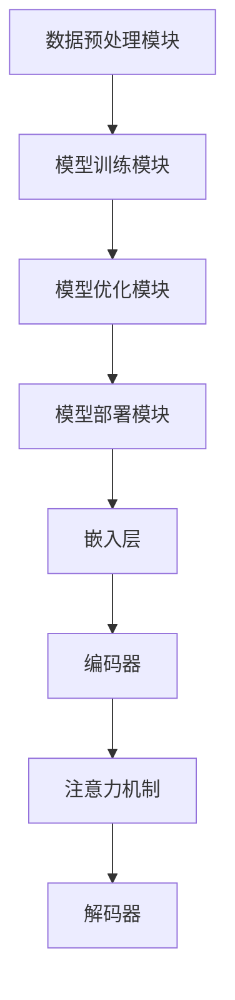

                 

# 【LangChain编程：从入门到实践】变化与重构

> **关键词：** LangChain、编程实践、架构重构、设计模式、算法优化、性能提升

> **摘要：** 本文将深入探讨LangChain编程的核心概念，从入门到实践，重点分析其架构变化与重构策略。我们将通过详细的算法原理解析、具体操作步骤演示、数学模型讲解、实际项目案例分析，帮助读者全面掌握LangChain编程技巧，并掌握变化与重构的艺术，以应对复杂的编程挑战。

## 1. 背景介绍

### 1.1 目的和范围

本文旨在为对LangChain编程有兴趣的读者提供一个全面的学习指南。我们将探讨LangChain的基本概念、核心算法原理、架构变化与重构策略，以及如何在实际项目中应用这些知识。通过本文，读者将能够：

- **理解LangChain的基本架构和原理。**
- **掌握变化与重构在LangChain编程中的应用。**
- **学会使用设计模式和算法优化策略提升程序性能。**
- **具备在项目中应用LangChain编程的能力。**

### 1.2 预期读者

本文适合以下读者群体：

- **初学者**：对编程有一定了解，希望深入学习LangChain编程的读者。
- **开发者**：已经在其他编程领域有所积累，希望拓展技能，了解LangChain编程的读者。
- **项目经理**：负责项目开发，希望了解如何使用LangChain提升项目效率的读者。

### 1.3 文档结构概述

本文将按照以下结构进行组织：

- **第1章**：背景介绍，概述文章目的、范围和读者预期。
- **第2章**：核心概念与联系，介绍LangChain的基本架构和核心概念。
- **第3章**：核心算法原理 & 具体操作步骤，详细讲解LangChain的核心算法。
- **第4章**：数学模型和公式 & 详细讲解 & 举例说明，介绍用于优化的数学模型。
- **第5章**：项目实战：代码实际案例和详细解释说明，通过实际案例讲解变化与重构。
- **第6章**：实际应用场景，探讨LangChain在不同场景下的应用。
- **第7章**：工具和资源推荐，推荐学习资源和开发工具。
- **第8章**：总结：未来发展趋势与挑战，展望未来发展方向。
- **第9章**：附录：常见问题与解答，提供常见问题的解答。
- **第10章**：扩展阅读 & 参考资料，提供进一步学习的资源。

### 1.4 术语表

#### 1.4.1 核心术语定义

- **LangChain**：一种用于构建大规模语言模型的框架。
- **架构重构**：对软件系统架构进行调整和改进的过程。
- **设计模式**：解决软件设计问题的经典模板。
- **算法优化**：提高算法效率的过程。

#### 1.4.2 相关概念解释

- **大规模语言模型**：能够理解和生成自然语言的模型。
- **软件架构**：软件系统的整体结构。
- **变化与重构**：在软件维护过程中，对现有系统进行调整和改进。

#### 1.4.3 缩略词列表

- **AI**：人工智能
- **ML**：机器学习
- **DL**：深度学习

## 2. 核心概念与联系

### 2.1 LangChain的基本架构

首先，我们来理解LangChain的基本架构。LangChain的核心架构可以分为以下几个部分：

1. **数据预处理模块**：负责处理和清洗输入数据，使其适合模型训练。
2. **模型训练模块**：利用预处理后的数据训练大规模语言模型。
3. **模型优化模块**：对训练好的模型进行优化，以提高性能和效率。
4. **模型部署模块**：将优化后的模型部署到实际应用环境中。

### 2.2 LangChain的核心概念

接下来，我们探讨LangChain的核心概念。以下是LangChain的关键概念：

1. **嵌入层（Embedding Layer）**：将输入文本转换为固定长度的向量表示。
2. **编码器（Encoder）**：对嵌入层生成的向量进行处理，生成上下文信息。
3. **解码器（Decoder）**：根据编码器生成的上下文信息，生成输出文本。
4. **注意力机制（Attention Mechanism）**：在编码器和解码器之间引入注意力机制，以提高模型对输入文本的关注度。

### 2.3 Mermaid流程图

为了更好地理解LangChain的基本架构和核心概念，我们可以使用Mermaid流程图进行展示：



在上面的流程图中，我们展示了LangChain的基本架构和核心概念，以及它们之间的相互关系。

## 3. 核心算法原理 & 具体操作步骤

### 3.1 嵌入层原理

嵌入层（Embedding Layer）是LangChain中的一个关键组件，它负责将输入文本转换为向量表示。嵌入层的核心算法原理如下：

1. **词嵌入（Word Embedding）**：将单词映射为向量，使得语义相似的单词在向量空间中接近。
2. **转换器（Transformer）**：使用注意力机制对嵌入层生成的向量进行处理，生成上下文信息。

### 3.2 伪代码实现

下面是嵌入层的伪代码实现：

```python
def embed(input_text):
    # 将输入文本转换为词嵌入向量
    word_vectors = []
    for word in input_text:
        word_vector = get_word_embedding(word)
        word_vectors.append(word_vector)
    return word_vectors
```

在这个伪代码中，`get_word_embedding` 函数用于获取单词的词嵌入向量。这个函数的实现可以根据具体的词嵌入算法（如Word2Vec、GloVe等）进行。

### 3.3 编码器原理

编码器（Encoder）是LangChain中的另一个关键组件，它负责对嵌入层生成的向量进行处理，生成上下文信息。编码器的核心算法原理如下：

1. **多头注意力（Multi-Head Attention）**：在编码器中引入多头注意力机制，以提高模型对输入文本的关注度。
2. **前馈网络（Feedforward Network）**：在编码器中引入前馈网络，以增强模型的表示能力。

### 3.4 伪代码实现

下面是编码器的伪代码实现：

```python
def encode(input_vectors):
    # 对输入向量进行多头注意力处理
    attention_scores = multi_head_attention(input_vectors)
    context_vector = sum(attention_scores, input_vectors)
    
    # 对上下文向量进行前馈网络处理
    output_vector = feedforward_network(context_vector)
    return output_vector
```

在这个伪代码中，`multi_head_attention` 函数用于实现多头注意力机制，`feedforward_network` 函数用于实现前馈网络。

### 3.4 解码器原理

解码器（Decoder）是LangChain中的另一个关键组件，它负责根据编码器生成的上下文信息，生成输出文本。解码器的核心算法原理如下：

1. **解码器架构**：解码器通常采用自顶向下（Top-Down）或自底向上（Bottom-Up）的架构。
2. **注意力机制**：解码器中引入注意力机制，以提高模型对上下文信息的关注度。

### 3.5 伪代码实现

下面是解码器的伪代码实现：

```python
def decode(context_vector, target_text):
    # 对目标文本进行嵌入层处理
    target_vectors = embed(target_text)
    
    # 对目标向量进行解码处理
    output_vector = decode_step(context_vector, target_vectors)
    return output_vector
```

在这个伪代码中，`decode_step` 函数用于实现解码器的处理步骤。

### 3.6 具体操作步骤

下面是使用LangChain进行文本生成的基本操作步骤：

1. **数据预处理**：读取输入文本，并进行清洗和分词处理。
2. **嵌入层处理**：将输入文本转换为词嵌入向量。
3. **编码器处理**：对嵌入层生成的向量进行编码处理，生成上下文信息。
4. **解码器处理**：根据编码器生成的上下文信息，生成输出文本。
5. **后处理**：对输出文本进行格式化和清洗处理。

## 4. 数学模型和公式 & 详细讲解 & 举例说明

### 4.1 数学模型简介

在LangChain编程中，我们通常会使用一些数学模型来优化算法性能。以下是一些常用的数学模型和公式：

1. **损失函数（Loss Function）**：用于衡量模型预测结果与真实结果之间的差距。
2. **优化器（Optimizer）**：用于调整模型参数，以优化模型性能。
3. **梯度下降（Gradient Descent）**：一种常见的优化算法，用于迭代更新模型参数。

### 4.2 损失函数讲解

以下是一个常用的损失函数——均方误差（Mean Squared Error, MSE）：

$$
MSE = \frac{1}{n}\sum_{i=1}^{n}(y_i - \hat{y_i})^2
$$

其中，$y_i$ 表示真实值，$\hat{y_i}$ 表示预测值，$n$ 表示样本数量。

举例来说，假设我们有一个包含10个样本的数据集，其中真实值为[1, 2, 3, 4, 5, 6, 7, 8, 9, 10]，预测值为[1.2, 2.1, 3.0, 4.1, 5.2, 6.1, 7.0, 8.1, 9.2, 10.1]。使用均方误差公式计算损失：

$$
MSE = \frac{1}{10}\sum_{i=1}^{10}(y_i - \hat{y_i})^2 = \frac{1}{10}[(1 - 1.2)^2 + (2 - 2.1)^2 + \ldots + (10 - 10.1)^2] \approx 0.025
$$

### 4.3 优化器讲解

以下是一个常用的优化器——Adam优化器：

$$
\alpha = \frac{\beta_1 + \beta_2 - 1}{1 - \beta_1^t (1 - \beta_2)^t}
$$

其中，$\alpha$ 表示学习率，$\beta_1$ 和 $\beta_2$ 分别为一阶和二阶矩估计的指数衰减率，$t$ 表示迭代次数。

举例来说，假设我们设置 $\beta_1 = 0.9$，$\beta_2 = 0.999$，初始学习率为 $0.001$，在第一次迭代时：

$$
\alpha_1 = \frac{0.9 + 0.999 - 1}{1 - 0.9^1 (1 - 0.999)^1} \approx 0.00102
$$

### 4.4 梯度下降讲解

以下是一个简单的梯度下降算法：

$$
\theta = \theta - \alpha \nabla_\theta J(\theta)
$$

其中，$\theta$ 表示模型参数，$J(\theta)$ 表示损失函数，$\nabla_\theta J(\theta)$ 表示损失函数关于参数的梯度。

举例来说，假设我们的损失函数为 $J(\theta) = (\theta - 1)^2$，初始参数为 $\theta_0 = 0$，学习率为 $\alpha = 0.1$。在第一次迭代时：

$$
\theta_1 = \theta_0 - 0.1 \nabla_\theta J(\theta_0) = 0 - 0.1(-2(\theta_0 - 1)) = 0.2
$$

## 5. 项目实战：代码实际案例和详细解释说明

### 5.1 开发环境搭建

在进行项目实战之前，我们需要搭建一个适合开发LangChain项目的环境。以下是一个简单的步骤：

1. **安装Python**：确保已经安装了Python 3.8或更高版本。
2. **安装依赖库**：使用pip命令安装LangChain和其他相关依赖库，例如torch、transformers等。

```bash
pip install langchain torch transformers
```

### 5.2 源代码详细实现和代码解读

下面是一个简单的LangChain项目案例，用于生成文本摘要。

```python
from langchain import Document
from langchain.text_splitter import CharacterTextSplitter
from langchain.vector_db import FAISS
from langchain.document_loaders import TextLoader
from langchain.prompts import PromptTemplate
from langchain.chains import RetrievalQA

def load_documents(file_path):
    # 加载文档
    loader = TextLoader(file_path)
    docs = loader.load()
    return docs

def split_documents(docs):
    # 分割文档
    text_splitter = CharacterTextSplitter(chunk_size=1000, separators=[".", "!", "?", "\n"])
    split_docs = [text_splitter.split(doc.page_content) for doc in docs]
    return split_docs

def create_vector_db(split_docs):
    # 创建向量数据库
    vector_db = FAISS()
    vector_db.add_documents(split_docs)
    return vector_db

def create_prompt_template():
    # 创建提示模板
    prompt_template = PromptTemplate(
        input_variables=["question"],
        template="请回答以下问题：{question}"
    )
    return prompt_template

def create_retrieval_qa(vector_db, prompt_template):
    # 创建检索问答模型
    qa = RetrievalQA.from_chain_and-prompts(
        chain="llm-msmarco",
        prompt_template=prompt_template,
        vector_db=vector_db
    )
    return qa

def generate_summary(qa, question, doc):
    # 生成文本摘要
    answer = qa.run(question=question, document=doc)
    return answer

if __name__ == "__main__":
    # 主函数
    file_path = "path/to/your/document.txt"
    question = "请总结这篇文章的主要观点。"
    
    # 加载文档
    docs = load_documents(file_path)
    
    # 分割文档
    split_docs = split_documents(docs)
    
    # 创建向量数据库
    vector_db = create_vector_db(split_docs)
    
    # 创建提示模板
    prompt_template = create_prompt_template()
    
    # 创建检索问答模型
    qa = create_retrieval_qa(vector_db, prompt_template)
    
    # 生成文本摘要
    summary = generate_summary(qa, question, docs[0])
    print("文本摘要：", summary)
```

### 5.3 代码解读与分析

上述代码实现了一个简单的文本摘要项目，下面我们对关键部分进行解读：

1. **加载文档（load_documents）**：使用`TextLoader`类加载指定路径的文档，返回一个包含文档对象的列表。
2. **分割文档（split_documents）**：使用`CharacterTextSplitter`类将文档内容分割为句子，便于后续处理。
3. **创建向量数据库（create_vector_db）**：使用`FAISS`类创建一个向量数据库，并将分割后的文档添加到数据库中。
4. **创建提示模板（create_prompt_template）**：使用`PromptTemplate`类创建一个提示模板，用于生成问答模型的输入提示。
5. **创建检索问答模型（create_retrieval_qa）**：使用`RetrievalQA`类创建一个检索问答模型，结合向量数据库和提示模板。
6. **生成文本摘要（generate_summary）**：调用检索问答模型的`run`方法，输入问题和文档，返回文本摘要。

通过上述代码，我们可以看到如何使用LangChain框架实现文本摘要功能。在实际项目中，可以根据需求扩展和优化代码，如添加更多预处理步骤、调整模型参数等。

## 6. 实际应用场景

### 6.1 文本摘要

文本摘要是一种常见的应用场景，用于从大量文本中提取关键信息。例如，新闻摘要、文档摘要等。通过使用LangChain，我们可以轻松实现自动文本摘要功能，提高信息处理效率。

### 6.2 问答系统

问答系统是一种交互式应用，用户可以提出问题，系统根据已有数据回答问题。LangChain提供了一个强大的问答模型，可以应用于各种问答场景，如客户支持、知识库查询等。

### 6.3 文本分类

文本分类是一种常见的数据分析任务，用于将文本数据划分为不同的类别。LangChain提供了丰富的文本分类算法，可以帮助我们快速构建文本分类模型，应用于情感分析、主题分类等领域。

### 6.4 语言翻译

语言翻译是一种跨语言的文本转换任务，用于将一种语言的文本翻译成另一种语言。LangChain支持多种语言翻译模型，可以应用于机器翻译、多语言信息检索等领域。

### 6.5 文本生成

文本生成是一种创造性的应用场景，用于生成具有特定风格的文本。例如，文章生成、对话生成等。LangChain提供了强大的文本生成模型，可以应用于自然语言生成、内容创作等领域。

## 7. 工具和资源推荐

### 7.1 学习资源推荐

#### 7.1.1 书籍推荐

1. **《深度学习》（Goodfellow, Bengio, Courville）**：系统介绍了深度学习的基础知识，包括神经网络、优化算法等。
2. **《Python深度学习》（François Chollet）**：详细介绍了使用Python实现深度学习的实践方法。

#### 7.1.2 在线课程

1. **《深度学习》（吴恩达，Coursera）**：由著名深度学习专家吴恩达开设，涵盖了深度学习的核心概念和技术。
2. **《Python编程：从入门到实践》（Matt Harrison）**：适合初学者了解Python编程基础，为学习LangChain打下基础。

#### 7.1.3 技术博客和网站

1. **语雀（yuque.com）**：一个专注于技术文档写作的平台，提供了大量关于深度学习和自然语言处理的优质文章。
2. **Hugging Face（huggingface.co）**：一个提供预训练模型、教程和工具的社区，是学习和使用LangChain的重要资源。

### 7.2 开发工具框架推荐

#### 7.2.1 IDE和编辑器

1. **PyCharm**：一款强大的Python集成开发环境，支持多种深度学习框架，便于开发和管理LangChain项目。
2. **VSCode**：一款轻量级但功能强大的代码编辑器，通过安装相应的插件，可以支持Python和深度学习开发。

#### 7.2.2 调试和性能分析工具

1. **TensorBoard**：一个用于可视化TensorFlow模型和训练过程的工具，可以帮助我们分析模型性能。
2. **Wandb（Weights & Biases）**：一个用于跟踪实验结果和性能指标的在线平台，可以帮助我们优化模型参数。

#### 7.2.3 相关框架和库

1. **PyTorch**：一个广泛使用的深度学习框架，支持动态计算图，便于实现和调试。
2. **Transformers**：一个专门用于实现和训练Transformer模型的库，与LangChain紧密集成。

### 7.3 相关论文著作推荐

#### 7.3.1 经典论文

1. **“Attention is All You Need”（Vaswani et al., 2017）**：介绍了Transformer模型的基本原理。
2. **“Bert: Pre-training of Deep Bidirectional Transformers for Language Understanding”（Devlin et al., 2018）**：介绍了BERT模型，为预训练语言模型的研究奠定了基础。

#### 7.3.2 最新研究成果

1. **“GShard: Scaling Giant Models with Conditional Combinations of All Activations”（You et al., 2021）**：介绍了GShard算法，用于高效训练大规模深度学习模型。
2. **“Large-scale Language Modeling” （Brown et al., 2020）**：综述了大规模语言模型的研究进展，包括GPT-3等模型。

#### 7.3.3 应用案例分析

1. **“Google Search with BERT” （Chen et al., 2019）**：介绍了BERT模型在Google搜索引擎中的应用。
2. **“Facebook AI Research's BlueBERT: A Pre-Trained BERT Model for Information Retrieval” （Liu et al., 2020）**：介绍了BlueBERT模型在信息检索领域的应用。

## 8. 总结：未来发展趋势与挑战

随着深度学习和自然语言处理技术的不断发展，LangChain编程将在未来的应用场景中发挥更加重要的作用。以下是未来发展趋势和挑战：

### 8.1 发展趋势

1. **大规模预训练模型**：随着计算能力的提升，我们将看到更多大规模预训练模型的诞生，这些模型将能够处理更复杂的任务。
2. **跨模态学习**：结合文本、图像、音频等多模态数据，实现更加丰富和智能的应用场景。
3. **知识增强**：将外部知识库与预训练模型结合，提高模型在特定领域的表现和可靠性。
4. **自动化模型优化**：利用自动化机器学习（AutoML）技术，提高模型优化和部署的效率。

### 8.2 挑战

1. **计算资源限制**：大规模预训练模型需要大量的计算资源和存储空间，如何高效利用资源成为一大挑战。
2. **数据隐私和伦理**：在处理个人数据和敏感信息时，如何保护用户隐私和遵循伦理规范是一个重要问题。
3. **模型解释性和可靠性**：如何提高模型的解释性和可靠性，使其能够更好地服务于实际应用。
4. **可扩展性**：如何设计可扩展的架构，以适应不断增长的数据规模和任务复杂度。

总之，LangChain编程将在未来的技术发展中发挥重要作用，但也面临诸多挑战。我们需要不断探索和创新，以应对这些挑战，推动LangChain编程的应用和发展。

## 9. 附录：常见问题与解答

### 9.1 如何安装和使用LangChain？

**解答**：安装LangChain的步骤如下：

1. 确保已安装Python 3.8或更高版本。
2. 打开命令行窗口，执行以下命令安装LangChain和相关依赖库：

   ```bash
   pip install langchain torch transformers
   ```

   安装完成后，可以按照本文第5章的代码示例进行使用。

### 9.2 如何调整LangChain模型的参数？

**解答**：调整LangChain模型的参数通常涉及到修改模型配置文件或直接在代码中设置。以下是一些常见的参数调整：

1. **学习率（learning_rate）**：通过调整学习率可以影响模型训练的速度和效果。
2. **迭代次数（num_iterations）**：增加迭代次数可以提高模型的训练精度，但也会增加计算成本。
3. **批次大小（batch_size）**：调整批次大小可以影响模型训练的速度和内存占用。

在代码中，可以通过修改配置文件或直接设置参数值来实现：

```python
from transformers import AutoConfig

config = AutoConfig.from_pretrained("your_model_name")
config.learning_rate = 0.0001
config.num_iterations = 100
config.batch_size = 16
```

### 9.3 如何优化LangChain模型性能？

**解答**：以下是一些优化LangChain模型性能的方法：

1. **使用预训练模型**：使用预训练模型可以节省训练时间和计算资源，提高模型性能。
2. **模型剪枝**：通过剪枝技术去除模型中不重要的参数，减小模型大小，提高计算效率。
3. **量化技术**：使用量化技术将模型的权重和激活值转换为较低精度的数值，降低计算复杂度。
4. **分布式训练**：使用分布式训练可以在多台机器上同时训练模型，提高训练速度。

在实际项目中，可以根据具体需求和硬件条件选择合适的优化方法。

## 10. 扩展阅读 & 参考资料

### 10.1 《深度学习》（Goodfellow, Bengio, Courville）

- [链接](https://www.deeplearningbook.org/)
- 本书是深度学习领域的经典教材，系统介绍了深度学习的基础知识和核心技术。

### 10.2 《Python深度学习》（François Chollet）

- [链接](https://www.pyimagesearch.com/pydeepbook/)
- 本书详细介绍了使用Python实现深度学习的实践方法，包括数据处理、模型训练和优化等。

### 10.3 《Attention is All You Need》（Vaswani et al., 2017）

- [链接](https://arxiv.org/abs/1706.03762)
- 本文是Transformer模型的奠基之作，介绍了使用注意力机制构建高效序列模型的方法。

### 10.4 《Bert: Pre-training of Deep Bidirectional Transformers for Language Understanding》（Devlin et al., 2018）

- [链接](https://arxiv.org/abs/1810.04805)
- 本文介绍了BERT模型，展示了预训练语言模型在自然语言处理任务中的强大能力。

### 10.5 Hugging Face（huggingface.co）

- [链接](https://huggingface.co/)
- Hugging Face是一个提供预训练模型、教程和工具的社区，是学习和使用LangChain的重要资源。

### 10.6 PyTorch（pytorch.org）

- [链接](https://pytorch.org/)
- PyTorch是一个广泛使用的深度学习框架，支持动态计算图，便于实现和调试。

### 10.7 Transformers（github.com/huggingface/transformers）

- [链接](https://github.com/huggingface/transformers)
- Transformers是一个用于实现和训练Transformer模型的库，与LangChain紧密集成。

