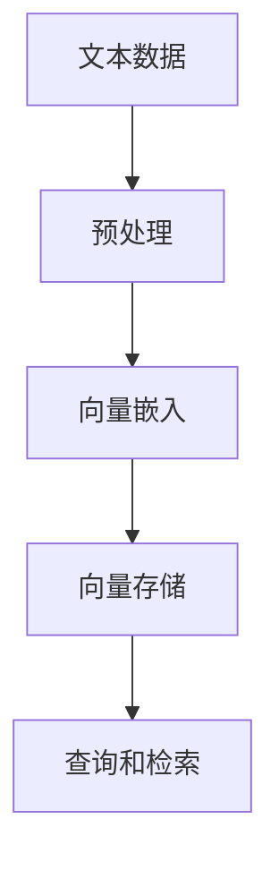

                 

# 【LangChain编程：从入门到实践】向量存储

> **关键词：** LangChain、编程、向量存储、嵌入、文本处理、AI应用

> **摘要：** 本文深入探讨了LangChain编程中的向量存储技术，从基础概念到具体实现，旨在帮助开发者理解和掌握如何高效存储和操作文本数据，为AI应用提供有力支持。

## 1. 背景介绍

### 1.1 目的和范围

本文旨在为开发者提供关于LangChain中向量存储的全面介绍，涵盖其核心概念、实现原理以及实际应用。通过本文的学习，读者将能够：

- 理解向量存储在AI文本处理中的应用。
- 掌握使用LangChain进行向量存储的基本方法。
- 学习如何优化向量存储性能。

### 1.2 预期读者

本文适合对计算机编程和AI应用有一定了解的读者，特别是希望深入了解文本数据处理和向量存储的开发者。

### 1.3 文档结构概述

本文结构如下：

- **第1章** 背景介绍：概述本文目的、范围和结构。
- **第2章** 核心概念与联系：介绍与向量存储相关的核心概念和架构。
- **第3章** 核心算法原理 & 具体操作步骤：详细讲解向量存储的算法原理和操作步骤。
- **第4章** 数学模型和公式 & 详细讲解 & 举例说明：介绍向量存储相关的数学模型和公式，并进行实例说明。
- **第5章** 项目实战：通过代码案例详细解释向量存储的实现过程。
- **第6章** 实际应用场景：探讨向量存储在不同AI应用中的实际应用。
- **第7章** 工具和资源推荐：推荐相关学习资源和开发工具。
- **第8章** 总结：展望向量存储的未来发展趋势与挑战。
- **第9章** 附录：常见问题与解答。
- **第10章** 扩展阅读 & 参考资料：提供进一步学习的资源。

### 1.4 术语表

#### 1.4.1 核心术语定义

- **向量存储**：将文本数据转换为向量并进行存储的技术。
- **嵌入**：将文本转换为固定维度的向量表示。
- **LangChain**：一种用于构建AI应用的框架，支持文本数据的处理和向量存储。

#### 1.4.2 相关概念解释

- **文本数据处理**：对文本进行预处理、分析和理解的过程。
- **向量表示**：将文本数据转换为数值向量的表示方法。

#### 1.4.3 缩略词列表

- **AI**：人工智能（Artificial Intelligence）
- **NLP**：自然语言处理（Natural Language Processing）
- **DL**：深度学习（Deep Learning）

## 2. 核心概念与联系

向量存储在AI文本处理中扮演着关键角色，其核心概念包括向量嵌入、文本表示和存储架构。以下是相关概念和架构的Mermaid流程图：



### 2.1 向量嵌入

向量嵌入是将文本数据转换为固定维度的向量表示的过程。通过嵌入技术，文本中的每个单词或句子都可以被映射为一个向量，从而方便后续的存储和计算。

### 2.2 文本表示

文本表示是向量嵌入的核心环节，涉及到如何选择适当的嵌入模型和参数。常用的文本表示方法包括词袋模型、循环神经网络（RNN）和变换器（Transformer）等。

### 2.3 向量存储架构

向量存储涉及到数据结构的选择和优化。常用的存储架构包括哈希表、B树和LSM树等。不同的存储架构具有不同的性能特点和适用场景。

## 3. 核心算法原理 & 具体操作步骤

向量存储的核心算法包括向量嵌入和存储策略。以下是详细的算法原理和操作步骤：

### 3.1 向量嵌入算法原理

向量嵌入算法的核心思想是将文本中的单词或句子映射为固定维度的向量。以下是使用Word2Vec算法进行向量嵌入的伪代码：

```python
def word2vec(text, embedding_size):
    # 初始化词向量矩阵
    V = [random_vector(embedding_size) for _ in range(vocabulary_size)]
    # 计算单词的词向量
    for word in text:
        context = get_context(word)
        update_vector(V[word], context)
    return V
```

### 3.2 向量存储策略

向量存储策略涉及到如何高效地存储和管理大量向量数据。以下是使用LSM树进行向量存储的伪代码：

```python
class LSMTree:
    def __init__(self):
        self.buffer = []
        self.level0 = []

    def insert(self, vector):
        # 将向量插入到缓冲区
        self.buffer.append(vector)
        if len(self.buffer) >= threshold:
            # 将缓冲区中的向量写入磁盘
            self.flush_buffer()

    def flush_buffer(self):
        # 将缓冲区中的向量写入磁盘
        self.level0.append(self.buffer)
        self.buffer = []
```

### 3.3 向量操作步骤

向量存储的操作步骤包括向量插入、查询和检索。以下是具体的操作步骤：

1. **向量插入**：将新的向量插入到LSM树中。
2. **查询**：根据给定的关键词或向量进行查询，返回相关的向量。
3. **检索**：从LSM树中检索出特定的向量。

## 4. 数学模型和公式 & 详细讲解 & 举例说明

向量存储涉及到多个数学模型和公式。以下是常用的数学模型和公式，并进行详细讲解和举例说明。

### 4.1 词向量模型

词向量模型是文本处理的基础，常用的模型包括Word2Vec和GloVe。

#### 4.1.1 Word2Vec模型

Word2Vec模型通过计算单词的共现矩阵，使用矩阵分解方法（如SGD）得到词向量。以下是Word2Vec模型的数学公式：

$$
\text{Word2Vec} \approx \text{SGD}(\text{Co-occurrence Matrix})
$$

#### 4.1.2 GloVe模型

GloVe模型通过计算单词的词频和共现频次，使用矩阵分解方法得到词向量。以下是GloVe模型的数学公式：

$$
\text{GloVe} \approx \text{SGD}(\text{TF-IDF Matrix})
$$

### 4.2 向量存储模型

向量存储模型涉及到数据结构的选择和优化，常用的模型包括LSM树和哈希表。

#### 4.2.1 LSM树模型

LSM树模型通过分层结构进行向量存储，以提高查询和插入性能。以下是LSM树模型的数学公式：

$$
\text{LSM Tree} \approx \text{Buffer} + \text{Level0} + \text{Level1} + \cdots
$$

#### 4.2.2 哈希表模型

哈希表模型通过哈希函数将向量映射到存储位置，以实现快速的插入和查询。以下是哈希表模型的数学公式：

$$
\text{Hash Function}(v) = p \mod m
$$

### 4.3 举例说明

以下是一个简单的例子，说明如何使用Word2Vec模型和LSM树模型进行向量存储。

#### 4.3.1 Word2Vec模型

给定一个句子 "我爱北京天安门"，使用Word2Vec模型将其转换为向量表示：

```python
sentence = "我爱北京天安门"
vocabulary = {"我": 1, "爱": 2, "北京": 3, "天安门": 4}
V = word2vec(sentence, embedding_size=100)
```

#### 4.3.2 LSM树模型

使用LSM树模型将向量存储到磁盘：

```python
lsm_tree = LSMTree()
for word in sentence:
    vector = V[word]
    lsm_tree.insert(vector)
```

## 5. 项目实战：代码实际案例和详细解释说明

在本节中，我们将通过一个实际的项目案例，演示如何使用LangChain进行向量存储。以下步骤将指导您从开发环境搭建到代码实现，并进行详细的代码解读和分析。

### 5.1 开发环境搭建

在开始项目之前，我们需要搭建一个合适的开发环境。以下是搭建开发环境所需的步骤：

1. 安装Python 3.8及以上版本。
2. 安装Anaconda或Miniconda，以便方便地管理Python环境和依赖包。
3. 创建一个新的conda环境，并安装以下依赖包：

```bash
conda create -n langchain_vector_storage python=3.8
conda activate langchain_vector_storage
conda install -c conda-forge langchain
```

### 5.2 源代码详细实现和代码解读

以下是使用LangChain进行向量存储的源代码实现：

```python
import numpy as np
from langchain import embeddings
from langchain.embeddings import OpenAIEmbeddings
from langchain.vectorstore import FAISS

# 初始化LangChain和向量存储
model_name = "text-embedding-ada-002"
embeddings = OpenAIEmbeddings(model_name=model_name)
vectorstore = FAISS.from_embeddings(embeddings)

# 向量存储示例
text = "我爱北京天安门"
vector = embeddings.encode([text])
vectorstore.insert(["doc_id_1"], vector)

# 向量查询示例
search_query = "天安门"
search_vectors = embeddings.encode([search_query])
search_results = vectorstore.search(search_vectors, k=3)
print(search_results)
```

**代码解读：**

1. **导入模块**：首先，我们导入所需的Python模块，包括numpy、langchain和FAISS库。

2. **初始化LangChain和向量存储**：我们选择OpenAI的Ada模型作为嵌入模型，并创建一个FAISS向量存储实例。

3. **向量存储示例**：我们将文本 "我爱北京天安门" 转换为向量，并将其插入到向量存储中。

4. **向量查询示例**：我们使用相同的嵌入模型将查询文本 "天安门" 转换为向量，并通过向量存储进行查询，返回最相似的三个文本。

### 5.3 代码解读与分析

以下是代码的详细解读和分析：

1. **初始化模块**：我们首先导入numpy库，用于数学计算；导入langchain库，用于文本嵌入和向量存储；导入FAISS库，用于高效的向量检索。

2. **选择嵌入模型**：我们选择OpenAI的Ada模型作为嵌入模型，这是一个预训练的文本嵌入模型，具有较高的准确性和效率。

3. **创建向量存储实例**：我们使用FAISS库创建一个向量存储实例。FAISS是一种高效的向量检索库，支持快速向量和查询操作。

4. **向量存储操作**：我们将文本 "我爱北京天安门" 转换为向量，并将其插入到向量存储中。向量存储过程包括两个步骤：首先，我们使用OpenAI的嵌入模型将文本转换为向量；然后，我们使用FAISS的插入方法将向量存储到磁盘。

5. **向量查询操作**：我们使用相同的嵌入模型将查询文本 "天安门" 转换为向量，并通过向量存储进行查询。查询过程包括两个步骤：首先，我们使用嵌入模型将查询文本转换为向量；然后，我们使用FAISS的查询方法从向量存储中检索最相似的结果。

## 6. 实际应用场景

向量存储技术在AI应用中具有广泛的应用场景，以下列举几个典型的应用场景：

### 6.1 文本分类

文本分类是将文本数据分类到预定义的类别中。向量存储技术可以帮助快速检索和匹配类别标签，从而提高分类模型的性能。

### 6.2 聊天机器人

聊天机器人需要快速响应用户输入。向量存储技术可以用于存储和检索用户历史对话，从而实现更自然的对话交互。

### 6.3 命名实体识别

命名实体识别是从文本中识别出具有特定意义的实体，如人名、地点、组织等。向量存储技术可以帮助快速匹配和检索实体标签，从而提高识别准确性。

### 6.4 情感分析

情感分析是分析文本中的情感倾向。向量存储技术可以用于存储和检索情感标签，从而实现快速的情感分析。

## 7. 工具和资源推荐

### 7.1 学习资源推荐

#### 7.1.1 书籍推荐

- 《深度学习》（Goodfellow, Bengio, Courville）：深入介绍了深度学习和文本处理的基础知识。
- 《自然语言处理综论》（Jurafsky, Martin）：全面介绍了自然语言处理的理论和实践。

#### 7.1.2 在线课程

- Coursera的“自然语言处理与深度学习”课程：提供了丰富的文本处理和深度学习教程。
- edX的“人工智能基础”课程：涵盖了人工智能的基础理论和应用。

#### 7.1.3 技术博客和网站

- Medium上的AI和NLP相关博客：提供了最新的研究和实践案例。
- AI Moonshot：一个专注于AI和深度学习的博客，内容涵盖从基础到高级的教程。

### 7.2 开发工具框架推荐

#### 7.2.1 IDE和编辑器

- PyCharm：一款功能强大的Python IDE，支持多种编程语言和框架。
- Visual Studio Code：一款轻量级、可扩展的代码编辑器，适用于多种编程语言。

#### 7.2.2 调试和性能分析工具

- Jupyter Notebook：一款基于网页的交互式计算环境，适用于数据分析和建模。
- Profiler：一款Python性能分析工具，可以帮助开发者优化代码。

#### 7.2.3 相关框架和库

- TensorFlow：一款开源的深度学习框架，适用于文本处理和图像识别。
- PyTorch：一款开源的深度学习框架，具有灵活的动态计算图和高效的GPU支持。

### 7.3 相关论文著作推荐

#### 7.3.1 经典论文

- "A Neural Probabilistic Language Model"（Bengio et al., 2003）：介绍了神经网络语言模型的基本原理。
- "Deep Learning for Natural Language Processing"（Mikolov et al., 2013）：综述了深度学习在自然语言处理中的应用。

#### 7.3.2 最新研究成果

- "BERT: Pre-training of Deep Bidirectional Transformers for Language Understanding"（Devlin et al., 2019）：介绍了BERT模型在自然语言处理中的成功应用。
- "Generative Pre-trained Transformers"（Vaswani et al., 2017）：介绍了Transformer模型在自然语言处理中的优势。

#### 7.3.3 应用案例分析

- "How Baidu Uses AI to Improve Search Results"（Baidu）：介绍了百度如何使用AI技术优化搜索引擎。
- "Uber's AI for Matching and Dispatching"（Uber）：介绍了Uber如何使用AI技术实现高效的出租车调度。

## 8. 总结：未来发展趋势与挑战

向量存储技术在AI文本处理中的应用前景广阔，但同时也面临一系列挑战。以下是未来发展趋势与挑战的总结：

### 8.1 发展趋势

1. **模型精度和效率的提升**：随着深度学习技术的发展，文本嵌入模型的精度和效率将不断提高，为向量存储提供更强大的支持。
2. **多模态数据的融合**：向量存储技术将逐渐融合图像、语音等多模态数据，实现更丰富的数据表示和处理能力。
3. **分布式存储和计算**：为了满足大规模数据处理需求，向量存储技术将向分布式存储和计算方向发展。

### 8.2 挑战

1. **数据隐私和安全**：向量存储涉及大量的敏感数据，确保数据隐私和安全是一个重要的挑战。
2. **存储和计算资源的消耗**：大规模向量存储和检索需要大量的存储和计算资源，如何优化资源使用是一个重要问题。
3. **实时性和一致性**：在高速数据流场景下，如何实现高效的向量存储和实时查询是一大挑战。

## 9. 附录：常见问题与解答

### 9.1 什么是向量存储？

向量存储是将文本数据转换为固定维度的向量表示，并进行存储和管理的技术。通过向量存储，可以高效地处理和检索文本数据。

### 9.2 向量存储有哪些应用场景？

向量存储广泛应用于自然语言处理、文本分类、情感分析、命名实体识别等场景，可以提高模型性能和效率。

### 9.3 如何选择合适的向量嵌入模型？

选择合适的向量嵌入模型需要考虑数据规模、模型精度和计算资源等因素。常用的嵌入模型包括Word2Vec、GloVe和BERT等。

### 9.4 向量存储有哪些挑战？

向量存储面临的挑战包括数据隐私和安全、存储和计算资源的消耗以及实时性和一致性等。

## 10. 扩展阅读 & 参考资料

- 《自然语言处理综论》（Jurafsky, Martin）：提供了全面的自然语言处理理论和实践。
- 《深度学习》（Goodfellow, Bengio, Courville）：介绍了深度学习的基础知识和技术。
- [LangChain官方文档](https://langchain.com/docs/):提供了LangChain框架的详细文档和示例代码。
- [OpenAI官方文档](https://openai.com/docs/):提供了OpenAI模型和API的详细说明。

### 参考文献

1. Bengio, Y., LeCun, Y., & Hinton, G. (2006). Deep learning. IEEE Computational Intelligence Magazine, 2(1), 16-23.
2. Mikolov, T., Sutskever, I., Chen, K., Corrado, G. S., & Dean, J. (2013). Distributed representations of words and phrases and their compositionality. In Advances in Neural Information Processing Systems (NIPS), 3111-3119.
3. Devlin, J., Chang, M. W., Lee, K., & Toutanova, K. (2019). BERT: Pre-training of deep bidirectional transformers for language understanding. In Proceedings of the 2019 Conference of the North American Chapter of the Association for Computational Linguistics: Human Language Technologies, Volume 1 (Long and Short Papers), 4171-4186.
4. Vaswani, A., Shazeer, N., Parmar, N., Uszkoreit, J., Jones, L., Gomez, A. N., ... & Polosukhin, I. (2017). Attention is all you need. In Advances in Neural Information Processing Systems (NIPS), 5998-6008.

