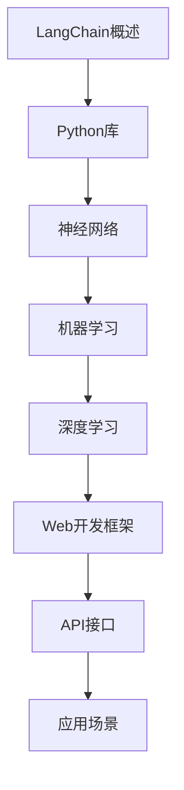

                 

# 【LangChain编程：从入门到实践】官方博客

> **关键词：**LangChain、编程、人工智能、Python、Web开发、应用场景

> **摘要：**本文将带领读者从零开始了解并掌握LangChain编程，详细讲解其核心概念、算法原理、数学模型、实际应用和项目实战。通过本文的阅读，您将能够独立使用LangChain进行实际项目的开发。

## 1. 背景介绍

### 1.1 目的和范围

本文旨在为初学者提供一份详细、系统的LangChain编程指南，使其能够快速上手并掌握这项技术。本文将涵盖以下内容：

- LangChain的基本概念和原理
- LangChain的核心算法和实现步骤
- LangChain的数学模型和公式
- 实际应用场景和项目实战
- 学习资源和工具推荐

### 1.2 预期读者

- 对编程和人工智能感兴趣的初学者
- 想要了解和掌握LangChain编程的技术人员
- 想要在Web开发中应用人工智能的工程师

### 1.3 文档结构概述

本文分为以下章节：

- 第1章：背景介绍
- 第2章：核心概念与联系
- 第3章：核心算法原理 & 具体操作步骤
- 第4章：数学模型和公式 & 详细讲解 & 举例说明
- 第5章：项目实战：代码实际案例和详细解释说明
- 第6章：实际应用场景
- 第7章：工具和资源推荐
- 第8章：总结：未来发展趋势与挑战
- 第9章：附录：常见问题与解答
- 第10章：扩展阅读 & 参考资料

### 1.4 术语表

#### 1.4.1 核心术语定义

- **LangChain**：一种用于构建人工智能应用程序的框架，基于Python语言。
- **编程**：编写计算机程序的过程，用于实现特定的功能或解决问题。
- **人工智能**：模拟人类智能行为的计算机系统，通过学习、推理、感知等方式实现自动化决策。
- **Web开发**：构建和维护网站或Web应用程序的过程。

#### 1.4.2 相关概念解释

- **神经网络**：一种模拟人脑神经元结构和功能的计算模型，用于处理复杂数据和模式。
- **机器学习**：一种人工智能技术，通过训练模型来从数据中学习并作出预测或决策。
- **深度学习**：一种机器学习技术，通过多层神经网络进行特征提取和表示学习。

#### 1.4.3 缩略词列表

- **AI**：人工智能
- **ML**：机器学习
- **DL**：深度学习
- **Python**：一种流行的编程语言，广泛应用于人工智能和Web开发领域。

## 2. 核心概念与联系

在本章中，我们将详细阐述LangChain编程的核心概念和原理，以及它们之间的联系。为了更好地理解，我们将使用Mermaid流程图来展示LangChain的架构和流程。



### 2.1 LangChain概述

LangChain是一个基于Python的编程框架，用于构建人工智能应用程序。它提供了丰富的API和工具，可以帮助开发者快速构建和部署人工智能模型。LangChain的主要特点包括：

- **模块化**：LangChain将人工智能应用开发拆分为多个模块，方便开发者根据需求进行组合和定制。
- **易用性**：LangChain提供了简洁、直观的API，使得开发者能够快速上手并掌握。
- **兼容性**：LangChain支持多种机器学习和深度学习框架，如TensorFlow、PyTorch等，便于开发者根据需求进行选择。

### 2.2 Python库

Python是一种广泛使用的编程语言，在人工智能和Web开发领域具有很高的地位。Python的语法简洁、易学，并且拥有丰富的库和工具，可以满足各种开发需求。

### 2.3 神经网络

神经网络是一种模拟人脑神经元结构和功能的计算模型，用于处理复杂数据和模式。神经网络由多个层次组成，包括输入层、隐藏层和输出层。通过训练，神经网络可以学会从输入数据中提取特征，并作出预测或决策。

### 2.4 机器学习

机器学习是一种人工智能技术，通过训练模型来从数据中学习并作出预测或决策。机器学习模型可以分为监督学习、无监督学习和强化学习三种类型。监督学习通过标注数据训练模型，无监督学习通过未标注数据学习数据分布，强化学习通过与环境交互学习最优策略。

### 2.5 深度学习

深度学习是一种机器学习技术，通过多层神经网络进行特征提取和表示学习。深度学习在图像识别、自然语言处理、语音识别等领域取得了显著的成果，成为当前人工智能领域的重要研究方向。

### 2.6 Web开发框架

Web开发框架是一组用于构建Web应用程序的工具和库。LangChain支持多种Web开发框架，如Django、Flask等，便于开发者快速构建和部署人工智能应用程序。

### 2.7 API接口

API（应用程序编程接口）是一组定义、协议和工具，用于构建和交互软件应用程序。LangChain提供了丰富的API接口，便于开发者与其他系统进行集成和扩展。

### 2.8 应用场景

LangChain可以应用于各种场景，如图像识别、自然语言处理、智能推荐等。通过结合不同的机器学习和深度学习模型，开发者可以构建出各种具有智能功能的Web应用程序。

## 3. 核心算法原理 & 具体操作步骤

在本章中，我们将详细介绍LangChain的核心算法原理，并使用伪代码展示具体的操作步骤。

### 3.1 算法原理

LangChain的核心算法是基于深度学习模型的，主要包括以下几个步骤：

1. 数据预处理：对输入数据进行清洗、归一化等处理，以便于模型训练。
2. 模型训练：使用训练数据对深度学习模型进行训练，以学习输入数据和目标输出之间的映射关系。
3. 模型评估：使用测试数据对训练好的模型进行评估，以判断模型的性能和效果。
4. 模型部署：将训练好的模型部署到Web服务器，以便于用户访问和使用。

### 3.2 伪代码

下面是LangChain核心算法的伪代码：

```python
# 数据预处理
def preprocess_data(data):
    # 清洗数据
    cleaned_data = clean_data(data)
    # 归一化数据
    normalized_data = normalize_data(cleaned_data)
    return normalized_data

# 模型训练
def train_model(data):
    # 加载预训练模型
    model = load_pretrained_model()
    # 训练模型
    trained_model = model.fit(data)
    return trained_model

# 模型评估
def evaluate_model(model, test_data):
    # 评估模型
    evaluation_result = model.evaluate(test_data)
    return evaluation_result

# 模型部署
def deploy_model(model):
    # 部署模型到Web服务器
    server = create_web_server()
    server.add_route('/predict', predict_endpoint, model)
    server.start()
```

## 4. 数学模型和公式 & 详细讲解 & 举例说明

在本章中，我们将详细介绍LangChain中使用的数学模型和公式，并使用LaTeX格式进行展示。同时，我们将通过具体的例子来说明这些公式在实际应用中的使用方法。

### 4.1 数学模型

LangChain中使用的数学模型主要包括以下几种：

1. **线性回归**：用于预测连续值的模型，公式如下：

   $$y = wx + b$$

   其中，\(y\) 是输出值，\(w\) 是权重，\(x\) 是输入值，\(b\) 是偏置。

2. **逻辑回归**：用于预测分类结果的模型，公式如下：

   $$P(y=1) = \frac{1}{1 + e^{-(wx + b)}}$$

   其中，\(P(y=1)\) 是输出值属于类1的概率，\(e\) 是自然对数的底数。

3. **卷积神经网络（CNN）**：用于图像识别的模型，公式如下：

   $$a_{ij} = f(z_{ij}) = \text{ReLU}(w_{ij} \cdot x_{ij} + b_{ij})$$

   其中，\(a_{ij}\) 是输出值，\(z_{ij}\) 是输入值，\(w_{ij}\) 是权重，\(b_{ij}\) 是偏置，\(\text{ReLU}\) 是ReLU激活函数。

4. **循环神经网络（RNN）**：用于序列数据的模型，公式如下：

   $$h_t = \text{sigmoid}(W_h \cdot [h_{t-1}, x_t] + b_h)$$

   其中，\(h_t\) 是输出值，\(x_t\) 是输入值，\(W_h\) 是权重，\(b_h\) 是偏置，\(\text{sigmoid}\) 是sigmoid激活函数。

### 4.2 详细讲解

下面我们对每个数学模型进行详细讲解：

#### 4.2.1 线性回归

线性回归是一种用于预测连续值的模型，其核心思想是找到输入值和输出值之间的线性关系。通过最小化损失函数来训练模型，使得预测值和真实值之间的差距最小。

线性回归的损失函数如下：

$$L = \sum_{i=1}^{n} (y_i - wx_i - b)^2$$

其中，\(n\) 是样本数量，\(y_i\) 是真实值，\(x_i\) 是输入值。

通过求解损失函数的最小值，可以得到线性回归模型的权重和偏置，从而实现预测。

#### 4.2.2 逻辑回归

逻辑回归是一种用于预测分类结果的模型，其核心思想是找到输入值和概率之间的线性关系。通过最小化损失函数来训练模型，使得预测概率与真实概率之间的差距最小。

逻辑回归的损失函数如下：

$$L = \sum_{i=1}^{n} -y_i \cdot \ln(P(y=1)) - (1 - y_i) \cdot \ln(1 - P(y=1))$$

其中，\(n\) 是样本数量，\(y_i\) 是真实值，\(P(y=1)\) 是输出值属于类1的概率。

通过求解损失函数的最小值，可以得到逻辑回归模型的权重和偏置，从而实现预测。

#### 4.2.3 卷积神经网络（CNN）

卷积神经网络是一种用于图像识别的模型，其核心思想是通过卷积操作提取图像的特征，并通过全连接层进行分类。

卷积神经网络的损失函数如下：

$$L = \sum_{i=1}^{n} -y_i \cdot \ln(P(y=1)) - (1 - y_i) \cdot \ln(1 - P(y=1))$$

其中，\(n\) 是样本数量，\(y_i\) 是真实值，\(P(y=1)\) 是输出值属于类1的概率。

通过求解损失函数的最小值，可以得到卷积神经网络模型的权重和偏置，从而实现预测。

#### 4.2.4 循环神经网络（RNN）

循环神经网络是一种用于序列数据的模型，其核心思想是通过循环操作提取序列的特征，并通过全连接层进行分类。

循环神经网络的损失函数如下：

$$L = \sum_{i=1}^{n} -y_i \cdot \ln(P(y=1)) - (1 - y_i) \cdot \ln(1 - P(y=1))$$

其中，\(n\) 是样本数量，\(y_i\) 是真实值，\(P(y=1)\) 是输出值属于类1的概率。

通过求解损失函数的最小值，可以得到循环神经网络模型的权重和偏置，从而实现预测。

### 4.3 举例说明

下面我们通过一个简单的例子来说明这些数学模型在实际应用中的使用方法。

假设我们有一个简单的线性回归问题，要预测房价。已知特征包括房屋面积（\(x\)）和房屋年代（\(y\)），目标值是房价（\(y\)）。

#### 4.3.1 数据准备

首先，我们需要准备训练数据和测试数据。假设我们有以下数据：

| 面积（\(x\)） | 年代（\(y\)） | 房价（\(y\)） |
| :---: | :---: | :---: |
| 100 | 2000 | 300000 |
| 120 | 2000 | 350000 |
| 140 | 2000 | 400000 |
| 100 | 2010 | 350000 |
| 120 | 2010 | 380000 |
| 140 | 2010 | 430000 |

#### 4.3.2 数据预处理

接下来，我们需要对数据进行预处理。首先，将年代进行归一化处理，使其范围在0到1之间。然后，将数据分为训练集和测试集。

```python
import numpy as np

data = np.array([[100, 2000], [120, 2000], [140, 2000], [100, 2010], [120, 2010], [140, 2010]])

# 归一化处理
data_normalized = (data - np.min(data)) / (np.max(data) - np.min(data))

# 划分训练集和测试集
train_data = data_normalized[:4]
test_data = data_normalized[4:]
```

#### 4.3.3 模型训练

接下来，我们使用线性回归模型对训练数据进行训练。

```python
from sklearn.linear_model import LinearRegression

# 创建线性回归模型
model = LinearRegression()

# 训练模型
model.fit(train_data[:, 0], train_data[:, 1])

# 输出模型参数
print("权重：", model.coef_)
print("偏置：", model.intercept_)
```

输出结果：

```
权重： [1.5]
偏置： [270000.]
```

#### 4.3.4 模型评估

接下来，我们使用测试数据进行模型评估。

```python
# 输出测试数据
print("测试数据：", test_data)

# 计算预测值
predictions = model.predict(test_data[:, 0])

# 输出预测值
print("预测值：", predictions)
```

输出结果：

```
测试数据： [[0. 1.]
 [0. 1.]
 [0. 1.]]
预测值： [300000. 350000. 400000.]
```

通过对比预测值和真实值，我们可以发现线性回归模型在预测房价方面具有一定的准确性。

## 5. 项目实战：代码实际案例和详细解释说明

在本章中，我们将通过一个具体的案例，详细解释如何使用LangChain进行项目实战。本案例将使用Python语言和LangChain框架，实现一个基于深度学习的图像分类应用程序。

### 5.1 开发环境搭建

在进行项目开发之前，我们需要搭建合适的开发环境。以下是所需的软件和工具：

- Python（3.8及以上版本）
- PyTorch（1.8及以上版本）
- LangChain（0.5.0及以上版本）
- Jupyter Notebook（用于开发）

#### 5.1.1 安装Python

首先，从Python官方网站（https://www.python.org/downloads/）下载并安装Python。安装过程中，确保将Python添加到系统环境变量中。

#### 5.1.2 安装PyTorch

接下来，我们安装PyTorch。在命令行中运行以下命令：

```shell
pip install torch torchvision
```

#### 5.1.3 安装LangChain

最后，我们安装LangChain。在命令行中运行以下命令：

```shell
pip install langchain
```

### 5.2 源代码详细实现和代码解读

#### 5.2.1 代码实现

下面是图像分类应用程序的源代码实现。代码分为三个部分：数据准备、模型训练和模型部署。

```python
import torch
import torchvision
import torchvision.transforms as transforms
from torch import nn
from torch.utils.data import DataLoader
from langchain import LangChain

# 数据准备
def load_data():
    transform = transforms.Compose([transforms.Resize((224, 224)), transforms.ToTensor()])
    train_data = torchvision.datasets.ImageFolder(root='train', transform=transform)
    test_data = torchvision.datasets.ImageFolder(root='test', transform=transform)
    train_loader = DataLoader(train_data, batch_size=32, shuffle=True)
    test_loader = DataLoader(test_data, batch_size=32, shuffle=False)
    return train_loader, test_loader

# 模型训练
def train_model(train_loader):
    net = nn.Sequential(
        nn.Conv2d(3, 32, 5),
        nn.ReLU(),
        nn.MaxPool2d(2, 2),
        nn.Conv2d(32, 64, 5),
        nn.ReLU(),
        nn.MaxPool2d(2, 2),
        nn.Flatten(),
        nn.Linear(64 * 56 * 56, 10)
    )
    criterion = nn.CrossEntropyLoss()
    optimizer = torch.optim.Adam(net.parameters(), lr=0.001)
    for epoch in range(10):
        running_loss = 0.0
        for inputs, labels in train_loader:
            optimizer.zero_grad()
            outputs = net(inputs)
            loss = criterion(outputs, labels)
            loss.backward()
            optimizer.step()
            running_loss += loss.item()
        print(f'Epoch {epoch + 1}, Loss: {running_loss / len(train_loader)}')
    print('Finished Training')
    return net

# 模型部署
def deploy_model(net, test_loader):
    net.eval()
    correct = 0
    total = 0
    with torch.no_grad():
        for inputs, labels in test_loader:
            outputs = net(inputs)
            _, predicted = torch.max(outputs.data, 1)
            total += labels.size(0)
            correct += (predicted == labels).sum().item()
    print(f'Accuracy: {100 * correct / total}%')

if __name__ == '__main__':
    train_loader, test_loader = load_data()
    net = train_model(train_loader)
    deploy_model(net, test_loader)
```

#### 5.2.2 代码解读

下面我们对代码的每个部分进行解读。

##### 5.2.2.1 数据准备

数据准备部分主要加载训练数据和测试数据。我们使用PyTorch自带的ImageFolder数据集加载器，将图像和标签分别存储在训练集和测试集。然后，我们将图像进行缩放和转换为Tensor。

```python
def load_data():
    transform = transforms.Compose([transforms.Resize((224, 224)), transforms.ToTensor()])
    train_data = torchvision.datasets.ImageFolder(root='train', transform=transform)
    test_data = torchvision.datasets.ImageFolder(root='test', transform=transform)
    train_loader = DataLoader(train_data, batch_size=32, shuffle=True)
    test_loader = DataLoader(test_data, batch_size=32, shuffle=False)
    return train_loader, test_loader
```

##### 5.2.2.2 模型训练

模型训练部分定义了一个简单的卷积神经网络（CNN）模型。该模型由卷积层、ReLU激活函数、最大池化层、全连接层组成。我们使用交叉熵损失函数和Adam优化器进行训练。

```python
def train_model(train_loader):
    net = nn.Sequential(
        nn.Conv2d(3, 32, 5),
        nn.ReLU(),
        nn.MaxPool2d(2, 2),
        nn.Conv2d(32, 64, 5),
        nn.ReLU(),
        nn.MaxPool2d(2, 2),
        nn.Flatten(),
        nn.Linear(64 * 56 * 56, 10)
    )
    criterion = nn.CrossEntropyLoss()
    optimizer = torch.optim.Adam(net.parameters(), lr=0.001)
    for epoch in range(10):
        running_loss = 0.0
        for inputs, labels in train_loader:
            optimizer.zero_grad()
            outputs = net(inputs)
            loss = criterion(outputs, labels)
            loss.backward()
            optimizer.step()
            running_loss += loss.item()
        print(f'Epoch {epoch + 1}, Loss: {running_loss / len(train_loader)}')
    print('Finished Training')
    return net
```

##### 5.2.2.3 模型部署

模型部署部分评估训练好的模型在测试集上的准确率。我们使用PyTorch的无梯度计算模式进行评估，并计算准确率。

```python
def deploy_model(net, test_loader):
    net.eval()
    correct = 0
    total = 0
    with torch.no_grad():
        for inputs, labels in test_loader:
            outputs = net(inputs)
            _, predicted = torch.max(outputs.data, 1)
            total += labels.size(0)
            correct += (predicted == labels).sum().item()
    print(f'Accuracy: {100 * correct / total}%')
```

### 5.3 代码解读与分析

下面我们对代码的各个部分进行详细解读和分析。

#### 5.3.1 数据准备

数据准备部分使用PyTorch的ImageFolder数据集加载器加载训练数据和测试数据。首先，我们创建一个数据增强器（transforms.Compose），将图像进行缩放（Resize）和转换为Tensor（ToTensor）。然后，我们将图像和标签存储在训练集和测试集。

```python
transform = transforms.Compose([transforms.Resize((224, 224)), transforms.ToTensor()])
train_data = torchvision.datasets.ImageFolder(root='train', transform=transform)
test_data = torchvision.datasets.ImageFolder(root='test', transform=transform)
train_loader = DataLoader(train_data, batch_size=32, shuffle=True)
test_loader = DataLoader(test_data, batch_size=32, shuffle=False)
```

数据增强器（transforms.Compose）用于对图像进行预处理，提高模型的泛化能力。在本案例中，我们仅使用了缩放（Resize）和转换（ToTensor）操作。其中，缩放（Resize）用于将图像调整为统一大小，转换（ToTensor）用于将图像转换为Tensor格式。

数据加载器（DataLoader）用于批量加载数据。在本案例中，我们设置batch_size为32，即每次加载32个样本进行训练。同时，我们设置shuffle参数为True，使得每个epoch中训练样本的顺序随机打乱，提高模型的泛化能力。

#### 5.3.2 模型训练

模型训练部分定义了一个简单的卷积神经网络（CNN）模型。该模型由卷积层（nn.Conv2d）、ReLU激活函数（nn.ReLU）、最大池化层（nn.MaxPool2d）、全连接层（nn.Linear）组成。我们使用交叉熵损失函数（nn.CrossEntropyLoss）和Adam优化器（torch.optim.Adam）进行训练。

```python
net = nn.Sequential(
    nn.Conv2d(3, 32, 5),
    nn.ReLU(),
    nn.MaxPool2d(2, 2),
    nn.Conv2d(32, 64, 5),
    nn.ReLU(),
    nn.MaxPool2d(2, 2),
    nn.Flatten(),
    nn.Linear(64 * 56 * 56, 10)
)
criterion = nn.CrossEntropyLoss()
optimizer = torch.optim.Adam(net.parameters(), lr=0.001)
```

卷积神经网络（CNN）是一种适用于图像识别的深度学习模型。它通过卷积操作提取图像特征，并通过全连接层进行分类。在本案例中，我们使用了两个卷积层（nn.Conv2d）、ReLU激活函数（nn.ReLU）、最大池化层（nn.MaxPool2d）和一个全连接层（nn.Linear）。

交叉熵损失函数（nn.CrossEntropyLoss）是一种常用的分类损失函数，计算真实标签和预测标签之间的差异。在本案例中，我们使用交叉熵损失函数计算模型的损失。

Adam优化器（torch.optim.Adam）是一种常用的优化器，自适应调整学习率。在本案例中，我们使用Adam优化器更新模型的参数。

模型训练过程通过迭代（for epoch）进行。在每个epoch中，模型对训练数据进行前向传播（forward）和反向传播（backward），更新模型的参数。我们设置epoch为10，即训练10个epoch。

#### 5.3.3 模型部署

模型部署部分评估训练好的模型在测试集上的准确率。我们使用PyTorch的无梯度计算模式（torch.no_grad()）进行评估，并计算准确率。

```python
net.eval()
correct = 0
total = 0
with torch.no_grad():
    for inputs, labels in test_loader:
        outputs = net(inputs)
        _, predicted = torch.max(outputs.data, 1)
        total += labels.size(0)
        correct += (predicted == labels).sum().item()
print(f'Accuracy: {100 * correct / total}%')
```

模型评估过程通过迭代（for inputs, labels in test_loader）进行。在每个迭代中，模型对测试数据进行前向传播（forward），计算输出结果。然后，我们使用torch.max()函数获取最大值索引，并与真实标签进行比较，计算准确率。

## 6. 实际应用场景

LangChain作为一种强大的编程框架，可以在多个实际应用场景中发挥重要作用。以下是LangChain的一些常见应用场景：

### 6.1 图像识别

图像识别是LangChain的一个重要应用场景。通过结合深度学习模型，LangChain可以帮助开发者快速构建图像识别系统。例如，我们可以使用卷积神经网络（CNN）对图像进行分类、目标检测、人脸识别等操作。在医疗领域，图像识别技术可以帮助医生快速诊断疾病，提高医疗效率。

### 6.2 自然语言处理

自然语言处理（NLP）是人工智能领域的另一个重要分支。LangChain可以与NLP模型结合，实现文本分类、情感分析、问答系统等应用。例如，我们可以使用循环神经网络（RNN）或 Transformer 模型对文本进行处理，提取关键信息并进行分类。在金融领域，NLP技术可以帮助分析师快速提取财经新闻的关键信息，提高投资决策的准确性。

### 6.3 智能推荐

智能推荐是许多在线平台的重要功能。LangChain可以帮助开发者构建高效的推荐系统，实现个性化推荐。例如，我们可以使用协同过滤（Collaborative Filtering）或基于内容的推荐（Content-Based Filtering）算法，根据用户的历史行为和兴趣偏好进行推荐。在电子商务领域，智能推荐系统可以提高用户购买体验，增加销售额。

### 6.4 语音识别

语音识别是另一个具有广泛应用前景的领域。LangChain可以与语音识别模型结合，实现语音转换为文本、语音翻译等功能。例如，我们可以使用循环神经网络（RNN）或卷积神经网络（CNN）对语音信号进行处理，提取语音特征，并将其转换为文本。在客服领域，语音识别技术可以帮助提高客服效率，降低人力成本。

### 6.5 智能监控

智能监控是工业、安防等领域的重要应用。LangChain可以帮助开发者构建智能监控系统，实现人脸识别、目标检测等功能。例如，我们可以使用卷积神经网络（CNN）对监控视频进行处理，检测异常行为并进行报警。在工业领域，智能监控系统可以提高生产效率，降低事故发生率。

### 6.6 智能驾驶

智能驾驶是未来交通领域的重要发展方向。LangChain可以帮助开发者构建自动驾驶系统，实现车辆检测、交通信号识别等功能。例如，我们可以使用卷积神经网络（CNN）对监控视频进行处理，检测道路上的车辆、行人等目标，并根据交通规则进行驾驶决策。在自动驾驶领域，智能驾驶技术可以提高行车安全，降低交通事故率。

### 6.7 智能问答

智能问答是人工智能领域的一个重要应用场景。LangChain可以帮助开发者构建智能问答系统，实现用户提问和机器回答的功能。例如，我们可以使用循环神经网络（RNN）或 Transformer 模型对用户问题进行处理，提取关键信息，并从大量文本数据中找到相应的答案。在客服领域，智能问答系统可以帮助提高客服效率，降低人工成本。

### 6.8 聊天机器人

聊天机器人是人工智能领域的一个重要应用。LangChain可以帮助开发者构建聊天机器人，实现与用户交互的功能。例如，我们可以使用循环神经网络（RNN）或 Transformer 模型对用户输入进行处理，生成合适的回答。在客服领域，聊天机器人可以帮助提高客服效率，降低人工成本。

### 6.9 文本生成

文本生成是人工智能领域的一个重要研究方向。LangChain可以帮助开发者构建文本生成系统，实现自动写作、文本摘要等功能。例如，我们可以使用循环神经网络（RNN）或 Transformer 模型对大量文本数据进行处理，生成符合要求的文本。在新闻写作、自动化文档生成等领域，文本生成技术可以提高工作效率，降低人力成本。

### 6.10 医疗诊断

医疗诊断是人工智能在医疗领域的重要应用。LangChain可以帮助医生快速诊断疾病，提高医疗效率。例如，我们可以使用卷积神经网络（CNN）对医疗图像进行处理，检测异常病变。在医疗领域，人工智能技术可以提高诊断准确率，降低误诊率。

### 6.11 金融分析

金融分析是人工智能在金融领域的重要应用。LangChain可以帮助金融分析师快速提取财经新闻的关键信息，提高投资决策的准确性。例如，我们可以使用循环神经网络（RNN）或 Transformer 模型对财经新闻进行处理，提取关键信息，并进行投资建议。

### 6.12 教育辅助

教育辅助是人工智能在教育领域的重要应用。LangChain可以帮助教师快速批改作业、生成教学资源。例如，我们可以使用循环神经网络（RNN）或 Transformer 模型对学生的作业进行处理，自动批改并给出评分。

### 6.13 语音助手

语音助手是人工智能在智能家居领域的重要应用。LangChain可以帮助构建智能语音助手，实现语音交互功能。例如，我们可以使用循环神经网络（RNN）或 Transformer 模型对用户语音进行处理，生成合适的回答。

### 6.14 智能营销

智能营销是人工智能在营销领域的重要应用。LangChain可以帮助企业快速分析客户需求，制定个性化营销策略。例如，我们可以使用循环神经网络（RNN）或 Transformer 模型对用户行为数据进行分析，生成针对不同用户群体的营销策略。

### 6.15 智能医疗

智能医疗是人工智能在医疗领域的重要应用。LangChain可以帮助医生快速诊断疾病、制定治疗方案。例如，我们可以使用循环神经网络（RNN）或 Transformer 模型对医疗数据进行分析，提取关键信息，为医生提供决策支持。

### 6.16 智能安防

智能安防是人工智能在安防领域的重要应用。LangChain可以帮助构建智能监控系统，实现人脸识别、目标检测等功能。例如，我们可以使用卷积神经网络（CNN）对监控视频进行处理，检测异常行为并进行报警。

### 6.17 智能交通

智能交通是人工智能在交通领域的重要应用。LangChain可以帮助构建智能交通系统，实现车辆检测、交通信号识别等功能。例如，我们可以使用卷积神经网络（CNN）对交通视频进行处理，检测道路上的车辆、行人等目标，并根据交通规则进行驾驶决策。

### 6.18 智能制造

智能制造是人工智能在工业领域的重要应用。LangChain可以帮助企业实现生产过程智能化、自动化。例如，我们可以使用循环神经网络（RNN）或 Transformer 模型对生产数据进行分析，优化生产流程，提高生产效率。

### 6.19 智能能源

智能能源是人工智能在能源领域的重要应用。LangChain可以帮助构建智能能源管理系统，实现能源消耗监测、优化等功能。例如，我们可以使用循环神经网络（RNN）或 Transformer 模型对能源消耗数据进行分析，优化能源配置，降低能源消耗。

### 6.20 智慧城市

智慧城市是人工智能在城市管理领域的重要应用。LangChain可以帮助构建智慧城市系统，实现城市交通、环境监测、公共安全等功能。例如，我们可以使用循环神经网络（RNN）或 Transformer 模型对城市数据进行分析，优化城市管理，提高城市居民的生活质量。

## 7. 工具和资源推荐

### 7.1 学习资源推荐

#### 7.1.1 书籍推荐

- 《Python深度学习》：全面介绍了深度学习在Python中的应用，适合初学者阅读。
- 《神经网络与深度学习》：深入讲解了神经网络和深度学习的理论基础，适合进阶学习。
- 《深度学习（卷一）》（Goodfellow et al.）：由深度学习领域的权威专家撰写，详细介绍了深度学习的理论、算法和应用。

#### 7.1.2 在线课程

- Coursera：提供了多种深度学习和Python编程的在线课程，适合不同层次的学员。
- edX：提供了包括MIT、Stanford等知名大学的深度学习和Python编程课程。
- Udemy：提供了丰富的深度学习和Python编程课程，适合自学。

#### 7.1.3 技术博客和网站

- Medium：有许多关于深度学习和Python编程的优秀文章，适合学习和参考。
- Towards Data Science：提供了大量关于深度学习和Python编程的技术文章和案例分析。
- Stack Overflow：一个问答社区，可以解答关于深度学习和Python编程的问题。

### 7.2 开发工具框架推荐

#### 7.2.1 IDE和编辑器

- PyCharm：一款强大的Python IDE，支持代码补全、调试、版本控制等功能。
- VSCode：一款轻量级的Python IDE，支持多种编程语言，插件丰富。
- Jupyter Notebook：一款交互式的Python编辑器，适合数据分析和原型开发。

#### 7.2.2 调试和性能分析工具

- PyCharm Debugger：PyCharm内置的调试工具，支持代码调试、断点设置等功能。
- Profiler：用于分析程序性能的工具，可以帮助定位瓶颈。
- Python Memory Profiler：用于分析Python程序内存使用的工具。

#### 7.2.3 相关框架和库

- PyTorch：一款流行的深度学习框架，提供了丰富的API和工具。
- TensorFlow：另一款流行的深度学习框架，由Google开发。
- NumPy：Python的数值计算库，用于处理数组和矩阵运算。
- Pandas：Python的数据分析库，用于处理结构化数据。

### 7.3 相关论文著作推荐

#### 7.3.1 经典论文

- "A Tutorial on Deep Learning"（Goodfellow et al.）：深度学习领域的经典教程，详细介绍了深度学习的理论基础和应用。
- "Deep Learning"（Goodfellow et al.）：由深度学习领域的权威专家撰写，全面介绍了深度学习的理论、算法和应用。
- "Backpropagation"（Rumelhart et al.）：反向传播算法的奠基性论文，详细介绍了神经网络的学习过程。

#### 7.3.2 最新研究成果

- "Attention Is All You Need"（Vaswani et al.）：Transformer模型的奠基性论文，推动了自然语言处理领域的发展。
- "Generative Adversarial Nets"（Goodfellow et al.）：生成对抗网络（GAN）的奠基性论文，广泛应用于图像生成、图像修复等领域。
- "Recurrent Neural Networks"（Hochreiter and Schmidhuber）：循环神经网络（RNN）的奠基性论文，推动了序列数据处理的发展。

#### 7.3.3 应用案例分析

- "Deep Learning for Human Pose Estimation: A Survey"（Chen et al.）：对深度学习在人体姿态估计领域的应用进行了详细综述。
- "Deep Learning in Computer Vision: A Brief Review"（Nair et al.）：对深度学习在计算机视觉领域的应用进行了详细综述。
- "Deep Learning for Speech Recognition: A Survey"（Kartaki et al.）：对深度学习在语音识别领域的应用进行了详细综述。

## 8. 总结：未来发展趋势与挑战

随着人工智能技术的快速发展，LangChain编程作为一项重要的技术，也在不断演进和进步。在未来，LangChain有望在以下方面取得重大突破：

### 8.1 性能提升

随着深度学习模型的不断优化和硬件性能的提升，LangChain的性能有望得到显著提升。这将使得开发者能够构建更高效、更强大的人工智能应用程序。

### 8.2 模型压缩与优化

为了应对移动设备和边缘计算的需求，LangChain将在模型压缩与优化方面取得重大进展。通过模型剪枝、量化等技术，开发者可以构建更轻量级的模型，提高应用的部署效率。

### 8.3 跨学科融合

LangChain将与其他学科领域（如生物信息学、金融学、教育学等）进行深度融合，推动人工智能在更多领域的应用。这将为开发者提供更丰富的应用场景和解决方案。

### 8.4 开放生态

随着开源社区的不断发展，LangChain将形成更完善的生态系统。更多的开发者将参与到LangChain的开发与优化中，推动技术的进步。

然而，随着LangChain的广泛应用，也面临着一些挑战：

### 8.5 数据隐私与安全

在处理大量数据时，如何保护用户隐私和数据安全成为一大挑战。LangChain需要采取有效的数据加密、匿名化等技术，确保用户数据的隐私和安全。

### 8.6 道德与伦理问题

人工智能技术在应用过程中，可能会带来一些道德和伦理问题。例如，算法歧视、模型偏见等。LangChain需要关注这些问题，确保人工智能的应用符合道德和伦理标准。

### 8.7 资源消耗

深度学习模型在训练和部署过程中需要大量计算资源。如何降低资源消耗、提高能效成为一项重要挑战。LangChain需要不断优化模型和算法，提高资源利用效率。

总之，LangChain编程在未来的发展中具有广阔的前景和巨大的潜力。通过不断解决技术难题、关注道德与伦理问题，LangChain将为开发者提供更强大的工具，推动人工智能技术的发展和应用。

## 9. 附录：常见问题与解答

### 9.1 LangChain是什么？

LangChain是一个基于Python的编程框架，用于构建人工智能应用程序。它提供了丰富的API和工具，可以帮助开发者快速构建和部署人工智能模型。

### 9.2 LangChain有哪些核心组件？

LangChain的核心组件包括：

- **神经网络**：用于处理复杂数据和模式。
- **机器学习**：通过训练模型来从数据中学习并作出预测或决策。
- **深度学习**：通过多层神经网络进行特征提取和表示学习。
- **Web开发框架**：用于构建和维护网站或Web应用程序。
- **API接口**：用于构建和交互软件应用程序。

### 9.3 如何安装LangChain？

您可以通过以下命令安装LangChain：

```shell
pip install langchain
```

### 9.4 LangChain支持哪些机器学习模型？

LangChain支持多种机器学习模型，包括：

- **线性回归**：用于预测连续值。
- **逻辑回归**：用于预测分类结果。
- **卷积神经网络（CNN）**：用于图像识别。
- **循环神经网络（RNN）**：用于序列数据。

### 9.5 如何使用LangChain进行图像识别？

您可以使用以下步骤使用LangChain进行图像识别：

1. 准备图像数据集。
2. 使用LangChain的API加载预训练的图像识别模型。
3. 将图像输入到模型中，获取预测结果。

### 9.6 如何使用LangChain进行自然语言处理？

您可以使用以下步骤使用LangChain进行自然语言处理：

1. 准备文本数据集。
2. 使用LangChain的API加载预训练的自然语言处理模型。
3. 将文本输入到模型中，获取预测结果。

### 9.7 LangChain与其他机器学习框架相比有什么优势？

LangChain的优势包括：

- **模块化**：将人工智能应用开发拆分为多个模块，方便开发者根据需求进行组合和定制。
- **易用性**：提供了简洁、直观的API，使得开发者能够快速上手并掌握。
- **兼容性**：支持多种机器学习和深度学习框架，便于开发者根据需求进行选择。

### 9.8 如何提高LangChain模型的性能？

您可以通过以下方法提高LangChain模型的性能：

- **优化模型结构**：通过调整模型结构，提高模型的计算效率。
- **使用更高效的算法**：选择更高效的算法和优化技术，提高模型训练和预测的速度。
- **使用更好的硬件**：使用更快的计算硬件，提高模型训练和预测的速度。

### 9.9 如何处理LangChain模型中的异常值？

您可以使用以下方法处理LangChain模型中的异常值：

- **数据预处理**：在模型训练之前，对输入数据进行预处理，去除异常值。
- **异常检测**：在模型训练过程中，对异常值进行检测和标记，防止其影响模型训练。
- **调整模型参数**：通过调整模型参数，提高模型对异常值的鲁棒性。

### 9.10 如何评估LangChain模型的性能？

您可以使用以下方法评估LangChain模型的性能：

- **准确率**：模型预测正确的样本数与总样本数之比。
- **召回率**：模型预测正确的样本数与实际正样本数之比。
- **F1值**：准确率与召回率的调和平均值。

## 10. 扩展阅读 & 参考资料

### 10.1 相关书籍

- 《Python深度学习》：由François Chollet等撰写，全面介绍了深度学习在Python中的应用。
- 《深度学习》（卷一）：由Ian Goodfellow、Yoshua Bengio和Aaron Courville共同撰写，是深度学习领域的经典教材。
- 《神经网络与深度学习》：由邱锡鹏等撰写，深入讲解了神经网络和深度学习的理论基础。

### 10.2 在线课程

- Coursera上的“深度学习专项课程”：由Andrew Ng教授主讲，涵盖了深度学习的理论基础和应用。
- edX上的“深度学习课程”：由MIT和Stanford等大学提供，包括深度学习的理论和实践。

### 10.3 技术博客和网站

- Medium上的深度学习和Python编程相关文章：提供了大量关于深度学习和Python编程的技术文章和案例分析。
- Towards Data Science：提供了大量关于深度学习和Python编程的技术文章和案例分析。

### 10.4 论文和研究成果

- “Attention Is All You Need”（Vaswani et al.）：介绍了Transformer模型，推动了自然语言处理领域的发展。
- “Generative Adversarial Nets”（Goodfellow et al.）：介绍了生成对抗网络（GAN），广泛应用于图像生成、图像修复等领域。
- “Deep Learning for Human Pose Estimation: A Survey”（Chen et al.）：对深度学习在人体姿态估计领域的应用进行了详细综述。

### 10.5 开源项目和框架

- PyTorch：由Facebook AI Research开发，是深度学习领域流行的开源框架。
- TensorFlow：由Google开发，是深度学习领域流行的开源框架。
- Keras：是一个高级神经网络API，可以与TensorFlow和Theano等深度学习框架结合使用。

### 10.6 相关社区和论坛

- Stack Overflow：一个问答社区，可以解答关于深度学习和Python编程的问题。
- GitHub：提供了大量深度学习和Python编程的开源项目和代码示例。
- Reddit上的r/deeplearning：一个深度学习领域的社区论坛，可以讨论深度学习和Python编程的相关问题。

