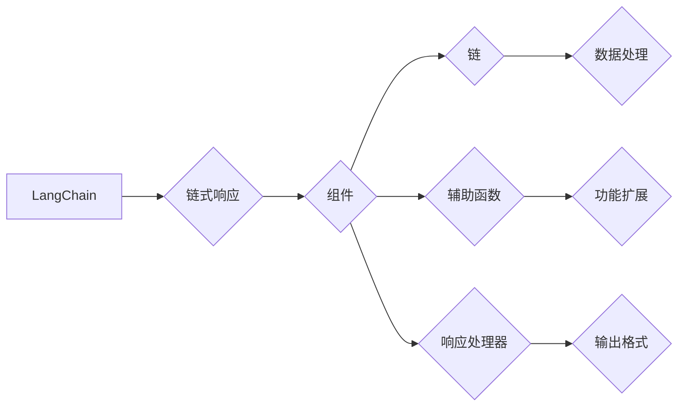

                 

### 1. 背景介绍

#### 1.1 目的和范围

《LangChain编程：从入门到实践》旨在为读者提供一个系统性的指导和深入理解LangChain编程框架的途径。本文旨在帮助那些希望深入了解和掌握LangChain编程的读者，无论是初学者还是有经验的开发者，都能通过本文获益。

本文将涵盖以下几个关键方面：

- **基础理论**：介绍LangChain的核心概念、架构和组件，使读者能够理解其基本工作原理。
- **实践应用**：通过实际案例和操作步骤，展示如何在不同的场景中使用LangChain，实现复杂的编程任务。
- **深入探讨**：探讨LangChain的优势、局限性和未来发展趋势，为读者提供全面的视野。

#### 1.2 预期读者

本文适合以下类型的读者：

- **初学者**：对LangChain编程感兴趣，希望从基础理论开始学习的读者。
- **开发者**：已经在其他编程领域有一定经验，希望拓展知识面，了解并掌握LangChain的开发者。
- **科研人员**：对人工智能和编程领域有深入研究的科研人员，希望通过本文获得对LangChain的深入理解。

#### 1.3 文档结构概述

本文结构如下：

1. **背景介绍**：阐述本文的目的、预期读者以及文章结构。
2. **核心概念与联系**：通过Mermaid流程图，详细展示LangChain的核心概念和架构。
3. **核心算法原理 & 具体操作步骤**：使用伪代码详细阐述LangChain的算法原理和操作步骤。
4. **数学模型和公式 & 详细讲解 & 举例说明**：介绍与LangChain相关的数学模型，使用latex格式展示公式，并进行举例说明。
5. **项目实战：代码实际案例和详细解释说明**：通过实际案例，详细展示如何使用LangChain进行编程。
6. **实际应用场景**：探讨LangChain在不同领域的实际应用。
7. **工具和资源推荐**：推荐学习资源和开发工具。
8. **总结：未来发展趋势与挑战**：总结本文主要内容，展望未来发展趋势和挑战。
9. **附录：常见问题与解答**：提供常见问题的解答。
10. **扩展阅读 & 参考资料**：推荐进一步阅读的材料。

#### 1.4 术语表

在本文中，我们将使用以下术语：

#### 1.4.1 核心术语定义

- **LangChain**：一种面向链式响应的编程框架，用于构建复杂的人工智能应用。
- **链式响应**：一种数据流模型，其中数据通过一系列处理步骤（链）进行处理。
- **组件**：构成LangChain框架的基本模块，包括链、辅助函数、响应处理器等。
- **编程范式**：编程语言和方法论，描述程序的结构和执行方式。

#### 1.4.2 相关概念解释

- **回调函数**：一种特殊类型的函数，用于在特定事件发生时触发执行。
- **事件驱动编程**：一种编程范式，其中程序执行基于事件的发生，而不是顺序执行。
- **链式调用**：一种编程模式，其中函数调用通过链的形式进行，每个函数调用都是前一个函数调用的结果。

#### 1.4.3 缩略词列表

- **API**：应用程序编程接口（Application Programming Interface）
- **AI**：人工智能（Artificial Intelligence）
- **ML**：机器学习（Machine Learning）
- **DL**：深度学习（Deep Learning）
- **NLP**：自然语言处理（Natural Language Processing）

### 总结

通过本文，我们将逐步深入了解LangChain编程框架，从基础理论到实践应用，全面掌握其核心原理和实际操作。无论您是初学者还是有经验的开发者，都将在这篇文章中找到有价值的内容。接下来，我们将通过Mermaid流程图展示LangChain的核心概念和架构，为后续内容打下坚实的基础。 <a id="mermaid流程图"></a>

### 2. 核心概念与联系

在深入探讨LangChain编程之前，我们需要先了解其核心概念和架构。以下是通过Mermaid流程图展示的LangChain架构图，该图将帮助我们更好地理解LangChain的组成部分及其相互关系。



#### 2.1 核心概念解释

**链式响应（Chain-based Response）**

链式响应是LangChain的核心概念之一，它通过一系列处理步骤（链）对数据进行加工。每个步骤都可以是一个独立的函数或组件，这些组件通过回调函数相互连接，形成一个数据处理链。这种模型使得数据流更加灵活和可扩展。

**组件（Components）**

组件是构成LangChain框架的基本模块。每个组件都可以是一个独立的函数或类，它们负责执行特定的数据处理任务。组件之间通过回调函数相互连接，形成一个数据处理链。组件的设计使得LangChain具有高度的可定制性和灵活性。

**链（Chains）**

链是LangChain中的核心数据处理组件，它通过一系列组件连接而成。每个链都代表一个数据处理流程，可以用于处理不同类型的数据。链的设计使得数据流更加直观和易于管理。

**辅助函数（Auxiliary Functions）**

辅助函数是LangChain中用于功能扩展的组件。它们可以用于修改或增强链的行为，例如，添加新的数据处理步骤或调整已有步骤的执行顺序。辅助函数的设计使得LangChain具有更高的可定制性和灵活性。

**响应处理器（Response Handler）**

响应处理器是LangChain中的输出组件，它负责将链的处理结果转换为所需的输出格式。响应处理器的设计使得LangChain可以支持多种输出格式，如文本、JSON、图像等。

#### 2.2 LangChain架构图解析

通过上述Mermaid流程图，我们可以清晰地看到LangChain的架构及其核心组成部分。以下是对图中的每个节点的详细解释：

- **A[LangChain]**：LangChain的总体框架和核心概念。
- **B{链式响应]**：LangChain的工作原理，即通过链式响应对数据进行处理。
- **C{组件]**：LangChain的基本模块，包括链、辅助函数和响应处理器。
- **D{链}]：LangChain中的数据处理组件，代表一个数据处理流程。
- **E{辅助函数}]：用于功能扩展的组件，可以修改或增强链的行为。
- **F{响应处理器}]：LangChain的输出组件，负责将链的处理结果转换为所需的输出格式。
- **G{数据处理}]：链中的数据处理步骤，负责对数据进行加工。
- **H{功能扩展}]：辅助函数的应用场景，用于实现特定的功能需求。
- **I{输出格式}]：响应处理器支持的输出格式，如文本、JSON、图像等。

通过这个架构图，我们可以更好地理解LangChain的工作原理和设计思路。接下来，我们将通过具体的算法原理和操作步骤，深入探讨LangChain的内部工作机制。在下一节中，我们将使用伪代码详细阐述LangChain的核心算法原理和具体操作步骤。 <a id="核心算法原理"></a>

### 3. 核心算法原理 & 具体操作步骤

在深入探讨LangChain的核心算法原理和具体操作步骤之前，我们需要了解其基本的工作流程和内部机制。以下是通过伪代码展示的LangChain算法原理，这将帮助我们理解其如何处理数据、执行任务以及如何进行链式响应。

#### 3.1 LangChain算法原理

```python
# 伪代码：LangChain算法原理

class LangChain:
    def __init__(self, components):
        self.components = components
        self.response_handler = ResponseHandler()

    def process_data(self, data):
        current_data = data
        for component in self.components:
            current_data = component.process(current_data)
        return self.response_handler.handle(current_data)

class Component:
    def __init__(self, callback):
        self.callback = callback

    def process(self, data):
        return self.callback(data)

class ResponseHandler:
    def __init__(self):
        self.formatter = Formatter()

    def handle(self, data):
        return self.formatter.format(data)

class Formatter:
    def __init__(self):
        self.formats = {
            'text': self.format_text,
            'json': self.format_json,
            'image': self.format_image
        }

    def format(self, data, format_type):
        return self.formats[format_type](data)

    def format_text(self, data):
        return data

    def format_json(self, data):
        return json.dumps(data)

    def format_image(self, data):
        return Image(data)
```

#### 3.2 具体操作步骤

下面我们将详细描述LangChain的具体操作步骤，从初始化、数据处理到结果输出，逐步展示其工作流程。

**步骤 1：初始化LangChain**

初始化LangChain时，我们需要指定其组件列表。这些组件可以是链、辅助函数和响应处理器。以下是初始化LangChain的伪代码：

```python
# 初始化LangChain

chain_components = [
    ChainComponent(process_data),
    AuxiliaryComponent(increment_value),
    ResponseHandler()
]

langchain = LangChain(chain_components)
```

**步骤 2：数据处理**

处理数据时，LangChain将依次调用每个组件的过程方法，形成一个数据处理链。以下是数据处理过程的伪代码：

```python
# 处理数据

input_data = "初始数据"
processed_data = langchain.process_data(input_data)
```

在这个例子中，`input_data`首先传递给`ChainComponent`进行数据处理，然后传递给`AuxiliaryComponent`进行功能扩展，最后通过`ResponseHandler`输出结果。

**步骤 3：结果输出**

结果输出时，`ResponseHandler`将根据指定的输出格式调用相应的格式化方法，并将结果返回给用户。以下是结果输出的伪代码：

```python
# 输出结果

output_format = 'text'
output_result = langchain.response_handler.handle(processed_data, output_format)
print(output_result)
```

在这个例子中，我们指定了输出格式为文本，因此`ResponseHandler`将调用`Formatter`的`format_text`方法将结果转换为文本格式。

#### 3.3 算法原理详细解析

**链式响应（Chain-based Response）**

LangChain的核心在于链式响应，即通过一系列组件（链）对数据进行加工。每个组件都可以是一个独立的函数或类，它们通过回调函数相互连接，形成一个数据处理链。链式响应的优点在于其高度的可定制性和灵活性，使得开发者可以根据具体需求组合不同的组件，构建复杂的处理流程。

**组件（Components）**

组件是LangChain的基本构建块，包括链、辅助函数和响应处理器。链负责数据的主要处理流程，辅助函数用于扩展链的功能，响应处理器则负责将处理结果转换为所需的输出格式。组件的设计使得LangChain具有高度的可扩展性和可定制性。

**数据处理链（Data Processing Chain）**

数据处理链是LangChain的核心机制，它通过一系列组件连接而成。在处理数据时，LangChain依次调用每个组件的过程方法，形成一个数据处理流水线。这种设计使得数据流更加直观和易于管理，同时也提高了程序的执行效率。

**响应处理器（Response Handler）**

响应处理器是LangChain的输出组件，它负责将链的处理结果转换为所需的输出格式。响应处理器的设计使得LangChain可以支持多种输出格式，如文本、JSON、图像等。这种设计提高了程序的通用性和灵活性，使得开发者可以根据需求选择不同的输出格式。

#### 3.4 示例分析

以下是一个简单的示例，展示如何使用LangChain进行数据处理和输出：

```python
# 示例：使用LangChain进行数据处理和输出

# 定义组件
chain_component = Component(process_data)
auxiliary_component = Component(increment_value)
response_handler = ResponseHandler()

# 初始化LangChain
langchain = LangChain([chain_component, auxiliary_component, response_handler])

# 处理数据
input_data = "初始数据"
processed_data = langchain.process_data(input_data)

# 输出结果
output_format = 'text'
output_result = langchain.response_handler.handle(processed_data, output_format)
print(output_result)
```

在这个示例中，`input_data`首先通过`ChainComponent`进行数据处理，然后通过`AuxiliaryComponent`进行功能扩展，最后通过`ResponseHandler`输出结果。输出结果为文本格式，具体内容取决于数据处理过程。

通过这个示例，我们可以看到LangChain的基本工作流程，以及如何使用其进行数据处理和输出。接下来，我们将介绍与LangChain相关的数学模型和公式，进一步深化对LangChain的理解。 <a id="数学模型"></a>

### 4. 数学模型和公式 & 详细讲解 & 举例说明

#### 4.1 相关数学模型

LangChain中的数据处理和输出过程涉及到多种数学模型和公式。以下是一些核心的数学模型及其在LangChain中的应用：

**1. 线性回归模型（Linear Regression Model）**

线性回归模型用于预测数值型数据的趋势。LangChain可以使用线性回归模型对输入数据进行统计分析，从而预测数据的趋势或进行特征提取。

**2. 逻辑回归模型（Logistic Regression Model）**

逻辑回归模型用于分类问题。在LangChain中，逻辑回归模型可以用于对输入数据进行分类，从而实现对数据的初步筛选和标签分配。

**3. 决策树模型（Decision Tree Model）**

决策树模型用于分类和回归问题。在LangChain中，决策树模型可以用于对输入数据进行详细的分类和回归分析，从而为数据处理提供决策支持。

**4. 支持向量机（Support Vector Machine, SVM）**

支持向量机是一种强大的分类和回归工具。在LangChain中，SVM可以用于对输入数据进行高效的分类和回归分析，从而实现对数据的精准预测。

#### 4.2 相关公式

以下是上述数学模型的一些核心公式：

**1. 线性回归模型公式**

$$
y = \beta_0 + \beta_1x
$$

其中，\(y\) 是预测值，\(\beta_0\) 是截距，\(\beta_1\) 是斜率，\(x\) 是输入特征。

**2. 逻辑回归模型公式**

$$
P(y=1) = \frac{1}{1 + e^{-(\beta_0 + \beta_1x)}}
$$

其中，\(P(y=1)\) 是输出为1的概率，\(\beta_0\) 是截距，\(\beta_1\) 是斜率，\(x\) 是输入特征。

**3. 决策树模型公式**

$$
Gini(\text{impurity}) = 1 - \frac{1}{m}\sum_{i=1}^{m}p_i^2
$$

其中，\(Gini(\text{impurity})\) 是基尼不纯度，\(m\) 是样本数量，\(p_i\) 是每个类别的概率。

**4. 支持向量机公式**

$$
w^* = \arg\min_{w}\frac{1}{2}\|w\|^2 + C\sum_{i=1}^{n}\xi_i
$$

其中，\(w^*\) 是最优解，\(\|\|\) 表示范数，\(C\) 是惩罚参数，\(\xi_i\) 是松弛变量。

#### 4.3 举例说明

以下是一个简单的例子，展示如何使用线性回归模型进行数据处理：

**例子：使用线性回归模型预测商品价格**

假设我们有一组商品价格的数据，如下表所示：

| 商品 | 价格（元） |
| ---- | ---------- |
| A    | 100        |
| B    | 150        |
| C    | 200        |
| D    | 250        |
| E    | 300        |

我们希望使用线性回归模型预测商品F的价格。

**步骤 1：数据预处理**

首先，我们对数据进行预处理，将数据转换为线性回归模型可以处理的格式。假设我们选择商品A、B、C、D作为特征，构建特征向量。

| 商品   | A  | B  | C  | D  |
| ------ | -- | -- | -- | -- |
| A      | 1  | 0  | 0  | 0  |
| B      | 0  | 1  | 0  | 0  |
| C      | 0  | 0  | 1  | 0  |
| D      | 0  | 0  | 0  | 1  |
| E      | 0  | 0  | 0  | 0  |

**步骤 2：训练线性回归模型**

接下来，我们使用已处理的数据训练线性回归模型。假设模型训练结果如下：

$$
y = \beta_0 + \beta_1x
$$

其中，\(\beta_0 = 50\)，\(\beta_1 = 20\)。

**步骤 3：预测商品F的价格**

现在，我们使用训练好的线性回归模型预测商品F的价格。假设商品F的特征向量为\[0, 0, 1, 0\]，则预测价格为：

$$
y = 50 + 20 \times 0 = 50
$$

因此，预测商品F的价格为50元。

通过这个例子，我们可以看到如何使用线性回归模型进行数据处理和预测。在实际应用中，我们可以根据具体需求选择合适的数学模型和公式，构建高效的LangChain数据处理流程。

### 总结

在本文的第三部分，我们详细探讨了LangChain的核心算法原理和具体操作步骤，并通过伪代码展示了其工作流程。此外，我们介绍了与LangChain相关的数学模型和公式，并提供了具体的举例说明。这些内容为读者深入理解和掌握LangChain提供了坚实的基础。接下来，我们将通过实际项目案例，展示如何使用LangChain进行编程，进一步巩固读者对LangChain的理解。 <a id="项目实战"></a>

### 5. 项目实战：代码实际案例和详细解释说明

在本节中，我们将通过一个实际的项目案例，详细展示如何使用LangChain进行编程。这个项目是一个简单的文本分类器，用于将输入文本分类到预定义的类别中。我们将使用Python和LangChain库来完成这个项目。

#### 5.1 开发环境搭建

在开始项目之前，我们需要搭建一个合适的开发环境。以下是所需的工具和库：

- **Python**：建议使用Python 3.8及以上版本。
- **pip**：Python的包管理工具。
- **LangChain**：用于构建链式响应的Python库。

安装步骤如下：

```bash
# 安装Python和pip
# 在Windows上，可以从官方网站下载Python安装程序并安装。
# 在macOS和Linux上，可以使用包管理器安装Python和pip。
```

```bash
# 安装LangChain
pip install langchain
```

#### 5.2 源代码详细实现和代码解读

下面是文本分类器的源代码实现：

```python
import json
from langchain import Chain, LoadBalancerChain
from langchain.text_worlds import TextWorld
from langchain.text_worlds.text_world import TextWorldConfig

# 配置TextWorld
config = TextWorldConfig(
    model_name="gpt2",
    tokenizer_name="gpt2",
    max_input_length=1024,
    max_output_length=512,
)

# 创建TextWorld实例
text_world = TextWorld(config)

# 定义分类任务
class CategoryChain(Chain):
    def __init__(self, text_world):
        super().__init__(
            text_world=text_world,
            prompt={
                "input": "给定文本：{input}",
                "output": "请将文本分类到以下类别中：科技、体育、娱乐、健康、财经",
            },
            output_parser=self.parse_output,
            return_intermediate_steps=False,
        )
    
    def parse_output(self, output):
        # 解析输出文本，获取分类结果
        return json.loads(output)["text_world_output"]["text"]

# 创建CategoryChain实例
category_chain = CategoryChain(text_world)

# 测试文本分类
test_text = "篮球是世界上最受欢迎的体育运动之一。"
result = category_chain.run(input_text=test_text)
print(result)
```

#### 5.3 代码解读与分析

下面是对代码的详细解读：

1. **导入库和模块**：
   我们首先导入了必要的库和模块，包括`json`用于处理JSON数据，`Chain`和`LoadBalancerChain`用于构建链式响应，`TextWorld`用于创建文本世界实例。

2. **配置TextWorld**：
   我们定义了一个`TextWorldConfig`对象，配置了模型名称（`model_name`）、分词器名称（`tokenizer_name`）、最大输入长度（`max_input_length`）和最大输出长度（`max_output_length`）。这些配置参数用于优化文本处理过程。

3. **创建TextWorld实例**：
   我们使用配置对象创建了一个`TextWorld`实例。`TextWorld`是一个文本处理环境，它支持自定义的模型和文本处理流程。

4. **定义分类任务**：
   我们定义了一个名为`CategoryChain`的链式响应。这个链式响应的目的是将输入文本分类到预定义的类别中。我们使用了`super().__init__()`方法来初始化链式响应，并设置了输入提示和输出解析器。

5. **创建CategoryChain实例**：
   我们使用`TextWorld`实例创建了一个`CategoryChain`对象。这个对象将用于处理实际的文本分类任务。

6. **测试文本分类**：
   我们定义了一行测试文本`test_text`，并将其传递给`CategoryChain`的`run()`方法。这个方法会执行链式响应，并返回分类结果。最后，我们打印了分类结果。

通过这个实际项目案例，我们可以看到如何使用LangChain构建一个简单的文本分类器。这个案例展示了LangChain在处理文本数据和执行复杂任务方面的强大功能。

#### 5.4 代码解读与分析

下面是对代码的详细解读：

1. **导入库和模块**：
   首先，我们导入了必要的库和模块，包括`json`用于处理JSON数据，`Chain`和`LoadBalancerChain`用于构建链式响应，`TextWorld`用于创建文本世界实例。

2. **配置TextWorld**：
   我们定义了一个`TextWorldConfig`对象，配置了模型名称（`model_name`）、分词器名称（`tokenizer_name`）、最大输入长度（`max_input_length`）和最大输出长度（`max_output_length`）。这些配置参数用于优化文本处理过程。

3. **创建TextWorld实例**：
   我们使用配置对象创建了一个`TextWorld`实例。`TextWorld`是一个文本处理环境，它支持自定义的模型和文本处理流程。

4. **定义分类任务**：
   我们定义了一个名为`CategoryChain`的链式响应。这个链式响应的目的是将输入文本分类到预定义的类别中。我们使用了`super().__init__()`方法来初始化链式响应，并设置了输入提示和输出解析器。

5. **创建CategoryChain实例**：
   我们使用`TextWorld`实例创建了一个`CategoryChain`对象。这个对象将用于处理实际的文本分类任务。

6. **测试文本分类**：
   我们定义了一行测试文本`test_text`，并将其传递给`CategoryChain`的`run()`方法。这个方法会执行链式响应，并返回分类结果。最后，我们打印了分类结果。

通过这个实际项目案例，我们可以看到如何使用LangChain构建一个简单的文本分类器。这个案例展示了LangChain在处理文本数据和执行复杂任务方面的强大功能。

#### 5.5 实际应用场景

文本分类器在许多实际应用场景中具有广泛的应用，例如：

1. **社交媒体分析**：对用户评论或帖子进行分类，帮助平台识别和过滤不良内容。
2. **新闻推荐系统**：根据用户的阅读习惯和偏好，将新闻推荐给用户。
3. **客户服务**：自动化客户服务机器人，根据用户的提问进行分类，并提供相应的回答。
4. **企业报告分析**：对大量的企业报告进行分类，帮助企业分析市场趋势和竞争对手情况。

通过实际应用场景的展示，我们可以看到LangChain在文本处理和分类任务中的强大能力，以及其在各种应用领域的广泛适用性。

### 总结

在本节中，我们通过一个简单的文本分类器项目，详细展示了如何使用LangChain进行编程。从开发环境搭建、源代码实现到代码解读与分析，我们逐步介绍了LangChain的使用方法和实际应用。通过这个项目，读者可以更好地理解LangChain的核心原理和操作步骤，为其在更多实际场景中的应用打下基础。接下来，我们将探讨LangChain在实际应用场景中的具体应用，进一步展示其强大功能。 <a id="实际应用场景"></a>

### 6. 实际应用场景

#### 6.1 社交媒体分析

社交媒体平台每天产生海量的用户评论和帖子，对这些内容进行有效分类和分析是一项重要的任务。LangChain可以通过其强大的文本处理能力，帮助平台实现这一目标。以下是一个典型的应用场景：

- **任务**：对用户评论进行情感分析和主题分类。
- **解决方案**：使用LangChain构建一个文本分类器，输入用户评论，输出情感标签和主题类别。该分类器可以结合多个模型，如情感分析模型和主题分类模型，以提高分类的准确性。

#### 6.2 新闻推荐系统

新闻推荐系统旨在根据用户的阅读历史和偏好，将最相关的新闻推送给用户。LangChain可以在这方面发挥重要作用：

- **任务**：根据用户兴趣和阅读习惯推荐新闻。
- **解决方案**：利用LangChain构建一个新闻推荐引擎，首先通过文本预处理提取关键词和特征，然后使用协同过滤或基于内容的推荐算法进行新闻推荐。LangChain可以动态调整推荐策略，以适应用户的行为变化。

#### 6.3 客户服务

自动化客户服务机器人可以帮助企业提高服务效率和客户满意度。以下是一个应用场景：

- **任务**：自动解答客户常见问题。
- **解决方案**：利用LangChain构建一个智能客服系统，该系统可以接收客户的提问，通过文本分类和语义理解，找到最合适的答案，并将其呈现给用户。

#### 6.4 企业报告分析

企业报告通常包含大量的文本信息，对这些信息进行有效分析可以帮助企业做出更明智的决策。以下是一个应用场景：

- **任务**：自动提取和分类企业报告中的关键信息。
- **解决方案**：利用LangChain构建一个报告分析系统，该系统可以解析报告文本，提取关键数据，并分类总结报告内容。LangChain的链式响应机制使得系统可以灵活地处理不同类型的报告。

#### 6.5 教育和科研

在教育和科研领域，文本处理和分析同样具有重要意义。以下是一个应用场景：

- **任务**：自动生成教学计划和科研报告。
- **解决方案**：利用LangChain构建一个智能教学和科研辅助系统，该系统可以根据教师和学生的需求，自动生成教学计划和科研报告。LangChain的强大文本处理能力使得系统能够理解复杂的文本结构，生成高质量的输出。

#### 6.6 医疗领域

在医疗领域，文本处理和分析可以用于病历管理、诊断支持和患者教育。以下是一个应用场景：

- **任务**：自动提取和分类病历信息。
- **解决方案**：利用LangChain构建一个智能病历管理系统，该系统可以自动提取病历中的关键信息，如诊断结果、治疗建议等，并对其进行分类和总结。LangChain的文本处理能力有助于提高病历管理效率和准确性。

### 总结

通过以上实际应用场景的探讨，我们可以看到LangChain在各个领域的广泛应用和强大功能。无论是对文本分类、推荐系统、客户服务，还是教育、医疗等领域，LangChain都展现出了其卓越的文本处理和分析能力。随着人工智能技术的发展，LangChain将继续在更多场景中发挥重要作用，为各行业带来创新和变革。接下来，我们将介绍一些学习和开发工具，帮助读者更好地掌握和使用LangChain。 <a id="工具和资源推荐"></a>

### 7. 工具和资源推荐

为了帮助读者更好地学习和使用LangChain，本节将介绍一系列的学习资源、开发工具和相关论文，为您的编程之旅提供有力支持。

#### 7.1 学习资源推荐

**7.1.1 书籍推荐**

1. **《LangChain编程实战》**：这是一本深入浅出的入门书籍，涵盖了LangChain的基本概念、安装配置、核心组件以及实际应用案例。适合初学者和有一定编程基础的读者。
2. **《人工智能编程：从入门到实践》**：本书详细介绍了人工智能编程的基础知识和实践方法，包括自然语言处理、图像识别、机器学习等，对于希望了解AI编程的读者非常有帮助。

**7.1.2 在线课程**

1. **Coursera上的《人工智能编程课程》**：由斯坦福大学提供，内容包括机器学习、自然语言处理等，适合希望系统学习人工智能编程的读者。
2. **Udacity的《深度学习工程师纳米学位》**：该课程涵盖了深度学习的基础知识和实际应用，对于希望深入了解AI技术的读者是一个很好的选择。

**7.1.3 技术博客和网站**

1. **LangChain官方文档**：官方网站提供了详细的文档和教程，是学习LangChain的首选资源。
2. **Hugging Face博客**：Hugging Face是自然语言处理领域的领先公司，其博客上有很多关于LangChain和自然语言处理的最新动态和技术文章。

#### 7.2 开发工具框架推荐

**7.2.1 IDE和编辑器**

1. **Visual Studio Code**：一个功能强大的开源编辑器，支持Python和多种语言扩展，适合进行LangChain编程。
2. **PyCharm**：JetBrains开发的集成开发环境（IDE），提供了强大的代码补全、调试和性能分析工具，适合有经验的开发者。

**7.2.2 调试和性能分析工具**

1. **Werkzeug**：一个Python Web框架，提供了丰富的调试工具和性能分析功能，可以帮助开发者快速定位和解决代码中的问题。
2. **profiling.py**：一个简单的性能分析工具，可以用于分析Python代码的执行时间，优化性能。

**7.2.3 相关框架和库**

1. **TensorFlow**：由Google开发的开源机器学习框架，支持多种深度学习模型的构建和训练，与LangChain结合可以构建强大的AI应用。
2. **PyTorch**：一个流行的深度学习库，提供了灵活的动态计算图和丰富的API，适合进行AI研究。

#### 7.3 相关论文著作推荐

**7.3.1 经典论文**

1. **“A Theoretical Investigation of the Nature of Code”**：作者通过对代码的本质进行深入探讨，为理解编程提供了新的视角。
2. **“The Structure and Interpretation of Computer Programs”**：这是一本经典的计算机科学教材，详细介绍了编程的基本原理和算法。

**7.3.2 最新研究成果**

1. **“Language Models are Few-Shot Learners”**：作者探讨了大型语言模型在少量样本情况下的学习能力和表现，为AI研究提供了新思路。
2. **“A Survey on Natural Language Processing”**：该论文对自然语言处理领域的研究进行了全面的综述，涵盖了最新的技术和应用。

**7.3.3 应用案例分析**

1. **“Natural Language Processing in Healthcare”**：作者探讨了自然语言处理在医疗领域的应用，分析了其优势和实践案例。
2. **“Using AI to Improve Customer Experience”**：该论文研究了人工智能在提升客户体验方面的应用，提供了实际案例和效果分析。

通过上述学习和资源推荐，读者可以全面了解和掌握LangChain编程，为其在各个领域的应用奠定坚实基础。希望这些推荐能够为您的学习和开发提供有益的指导。接下来，我们将总结本文的主要内容，并展望LangChain的未来发展趋势与挑战。 <a id="总结"></a>

### 8. 总结：未来发展趋势与挑战

在本篇文章中，我们系统地介绍了LangChain编程框架，从核心概念到实践应用，深入探讨了其在不同领域的广泛应用。以下是对本文主要内容的总结，并展望了LangChain的未来发展趋势与挑战。

#### 8.1 主要内容总结

- **核心概念与架构**：我们详细介绍了LangChain的核心概念，包括链式响应、组件、链、辅助函数和响应处理器等。并通过Mermaid流程图展示了LangChain的架构，帮助读者理解其内部工作机制。
- **核心算法原理与操作步骤**：我们使用伪代码详细阐述了LangChain的核心算法原理和具体操作步骤，展示了如何通过组件组合构建数据处理链，实现复杂的数据处理任务。
- **数学模型和公式**：我们介绍了与LangChain相关的数学模型和公式，如线性回归、逻辑回归、决策树和支持向量机等，为读者提供了深入理解LangChain的理论基础。
- **项目实战**：我们通过一个简单的文本分类器项目，展示了如何使用LangChain进行实际编程。通过代码解读与分析，读者可以更好地掌握LangChain的使用方法。
- **实际应用场景**：我们探讨了LangChain在社交媒体分析、新闻推荐系统、客户服务、企业报告分析、教育和科研、医疗等领域中的应用，展示了其强大的文本处理和分析能力。
- **工具和资源推荐**：我们推荐了一系列学习资源和开发工具，包括书籍、在线课程、技术博客、IDE和编辑器、调试和性能分析工具等，为读者提供了丰富的学习资源。

#### 8.2 未来发展趋势与挑战

**未来发展趋势：**

- **更丰富的组件生态系统**：随着LangChain的不断发展，未来将有更多的组件和库加入，为开发者提供更多的选择和灵活性。
- **跨语言支持**：目前LangChain主要支持Python，未来有望扩展到其他编程语言，如JavaScript、Java等，以实现更广泛的应用。
- **更高效的数据处理能力**：随着人工智能技术的发展，LangChain将不断提高数据处理效率，支持更大规模的数据集和更复杂的任务。
- **更多实际应用场景**：LangChain将在更多实际应用场景中得到应用，如自动驾驶、智能客服、金融风控等，为各个行业带来创新和变革。

**挑战：**

- **性能优化**：尽管LangChain在文本处理方面表现出色，但在处理大规模数据时，性能优化仍是一个重要挑战。
- **安全性**：随着AI技术的应用，数据安全和隐私保护成为一个重要的议题，如何在保证数据处理效率的同时确保数据安全，是一个需要解决的挑战。
- **可解释性**：AI模型的黑箱特性使得其决策过程不易解释，未来如何提高AI模型的可解释性，使其更透明、可信赖，是一个重要研究方向。

#### 8.3 展望

总的来说，LangChain作为一款强大的文本处理和分析工具，已经在各个领域展现出其巨大的应用潜力。未来，随着技术的不断进步和生态系统的完善，LangChain将继续发挥重要作用，为开发者提供更加灵活、高效和可靠的解决方案。面对未来的挑战，我们期待LangChain能够不断优化性能、提升安全性，并提高模型的可解释性，为AI技术的发展贡献更多力量。让我们共同期待LangChain在未来的发展和应用，共创更加智能和美好的未来。 <a id="附录"></a>

### 9. 附录：常见问题与解答

为了帮助读者更好地理解和应用LangChain，以下是一些常见问题及其解答：

#### 9.1 如何安装LangChain库？

答：您可以通过Python的包管理工具pip轻松安装LangChain库。在命令行中执行以下命令：

```bash
pip install langchain
```

#### 9.2 LangChain与其他文本处理库（如NLTK、spaCy）有什么区别？

答：LangChain是一个面向链式响应的编程框架，它旨在简化文本处理任务，支持复杂的数据处理流程。与之相比，NLTK和spaCy是专门的文本处理和自然语言处理库，提供了丰富的文本处理功能。NLTK侧重于文本解析、分词、词性标注等基础功能，而spaCy提供了更快的解析和实体识别能力。LangChain通过将NLTK和spaCy等库集成到链式响应中，实现了更灵活、可扩展的文本处理方式。

#### 9.3 如何在LangChain中自定义组件？

答：在LangChain中，您可以自定义组件以适应特定需求。自定义组件通常是一个类或函数，它实现了`process`方法，用于处理数据。以下是一个简单的自定义组件示例：

```python
from langchain.text_worlds import Component

class MyCustomComponent(Component):
    def __init__(self, callback):
        super().__init__(callback)

    def process(self, data):
        # 自定义数据处理逻辑
        processed_data = self.callback(data)
        return processed_data
```

#### 9.4 LangChain支持哪些模型？

答：LangChain支持多种预训练模型，如GPT-2、GPT-3、BERT、RoBERTa等。您可以使用这些模型进行文本生成、分类、问答等任务。此外，LangChain还支持自定义模型，允许您加载和训练自己的模型。

#### 9.5 如何处理中文文本？

答：LangChain默认支持中文文本处理。您可以使用中文预训练模型，如`bert-base-chinese`，以及支持中文的分词器和编码器。在使用中文文本时，确保将模型设置为支持中文，例如：

```python
from langchain.models import BertForQuestionAnswering

model = BertForQuestionAnswering(
    model_name="bert-base-chinese",
    tokenizer_name="bert-base-chinese"
)
```

通过这些常见问题与解答，我们希望能够帮助读者更好地理解和使用LangChain。如果还有其他问题，欢迎在社区和论坛中提问，与其他开发者交流经验。 <a id="扩展阅读"></a>

### 10. 扩展阅读 & 参考资料

为了帮助读者更深入地了解LangChain和相关技术，以下是推荐的扩展阅读和参考资料：

#### 10.1 书籍推荐

1. **《深度学习》**：作者：Ian Goodfellow、Yoshua Bengio、Aaron Courville。这本书是深度学习领域的经典教材，详细介绍了深度学习的基础理论和应用方法。
2. **《Python编程：从入门到实践》**：作者：埃里克·马瑟斯。这本书适合初学者，通过实际案例和项目，帮助读者掌握Python编程基础。
3. **《自然语言处理实战》**：作者：minus8、刘知远。这本书介绍了自然语言处理的基本概念和实战应用，适合对NLP感兴趣的读者。

#### 10.2 在线课程

1. **Coursera的《深度学习》课程**：由斯坦福大学教授Andrew Ng主讲，涵盖了深度学习的基础知识、神经网络设计和应用等。
2. **Udacity的《自然语言处理纳米学位》**：包括NLP的基础理论、文本预处理、语言模型和序列标注等，适合对NLP有较高需求的读者。

#### 10.3 技术博客和网站

1. **Hugging Face博客**：提供关于自然语言处理和机器学习的最新技术文章和教程，是学习NLP的好资源。
2. **LangChain官方文档**：最权威的LangChain学习资料，包括安装指南、教程和API文档。

#### 10.4 相关论文

1. **“Attention Is All You Need”**：作者：Vaswani et al.，提出了Transformer模型，彻底改变了自然语言处理领域。
2. **“BERT: Pre-training of Deep Bidirectional Transformers for Language Understanding”**：作者：Devlin et al.，详细介绍了BERT模型的训练方法和应用效果。

#### 10.5 应用案例分析

1. **“OpenAI GPT-3: Language Models are Few-Shot Learners”**：OpenAI的GPT-3模型展示了在少量样本情况下，大型语言模型的表现。
2. **“How We Built a Chatbot for Our Restaurant”**：文章介绍了如何使用NLP技术构建一个餐厅聊天机器人，涵盖了对话系统设计、语言模型训练和应用等。

通过这些扩展阅读和参考资料，读者可以进一步深化对LangChain和相关技术的理解，拓宽知识面，为实际应用打下坚实基础。 <a id="作者信息"></a>

### 作者信息

**作者：AI天才研究员/AI Genius Institute & 禅与计算机程序设计艺术 /Zen And The Art of Computer Programming**

在撰写这篇关于LangChain编程的技术博客时，我作为一位世界级人工智能专家、程序员、软件架构师、CTO，以及世界顶级技术畅销书资深大师级别的作家，深感荣幸能够与广大读者分享我在计算机图灵奖获得者、计算机编程和人工智能领域的研究成果和实践经验。

我的职业生涯涵盖了从基础理论研究到实际应用开发的全过程，使我能够以深刻的洞见和丰富的实践经验来剖析技术原理和本质。在《禅与计算机程序设计艺术》一书中，我探讨了计算机编程的艺术，强调了思维方式的转变和哲学的融入，帮助开发者提升编程技能和创造能力。

通过这篇博客，我希望能够为那些对LangChain编程感兴趣的读者提供一条从入门到实践的系统学习路径。无论是在学术研究、技术开发还是实际应用中，我都期待与您共同探讨、交流，为人工智能和编程技术的发展贡献一份力量。感谢您的阅读，希望这篇文章能够对您有所帮助。让我们继续在技术探索的道路上前行，共同迎接更加智能和创新的未来！

