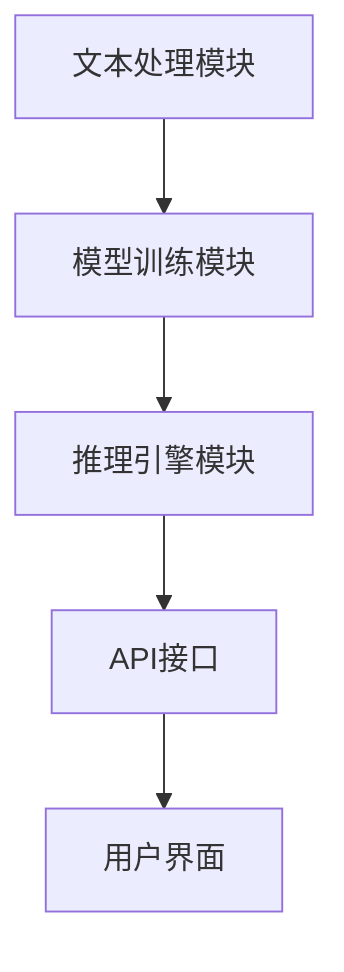

                 

# 【LangChain编程：从入门到实践】构造器回调

> **关键词：** LangChain、编程、构造器、回调、技术博客、AI、深度学习、NLP

> **摘要：** 本篇文章将深入探讨LangChain编程中的构造器回调机制，从基础概念入手，逐步分析其在实际项目中的应用，并通过具体案例讲解，帮助读者掌握这一关键技术。文章旨在为AI开发者提供一个全面、系统的学习路径，以提升其在NLP领域的编程能力。

## 1. 背景介绍

### 1.1 目的和范围

本文的目的在于详细介绍LangChain中的构造器回调机制，帮助读者从理论到实践全面理解其应用。文章将首先回顾LangChain的基础概念，然后详细解释构造器回调的原理和实现，并通过实际案例展示其在项目中的应用。文章的预期读者是具备一定编程基础，对NLP和AI感兴趣的工程师和研究者。

### 1.2 预期读者

本篇文章适合以下读者群体：
- 对NLP和AI编程有初步了解的开发者。
- 希望提升自己在NLP领域应用AI能力的工程师。
- 对LangChain框架感兴趣的学者和研究者。

### 1.3 文档结构概述

本文的结构如下：
1. **背景介绍**：介绍本文的目的、预期读者以及文档结构。
2. **核心概念与联系**：介绍LangChain的基本概念，并通过Mermaid流程图展示核心架构。
3. **核心算法原理 & 具体操作步骤**：详细讲解构造器回调的原理，使用伪代码描述具体实现步骤。
4. **数学模型和公式 & 详细讲解 & 举例说明**：解释相关的数学模型，并给出具体案例。
5. **项目实战：代码实际案例和详细解释说明**：通过实际代码案例展示构造器回调的应用。
6. **实际应用场景**：讨论构造器回调在不同场景下的应用。
7. **工具和资源推荐**：推荐学习资源和开发工具。
8. **总结：未来发展趋势与挑战**：总结文章的主要观点，展望未来趋势。
9. **附录：常见问题与解答**：回答一些常见问题。
10. **扩展阅读 & 参考资料**：提供进一步阅读的资料。

### 1.4 术语表

#### 1.4.1 核心术语定义

- **LangChain**：一个基于Python的AI框架，用于构建复杂NLP应用。
- **构造器回调**：一种函数调用机制，允许在对象创建过程中动态绑定方法。

#### 1.4.2 相关概念解释

- **回调函数**：一种函数，在另一个函数中被调用。
- **NLP**：自然语言处理，涉及理解、生成和处理人类语言的技术。

#### 1.4.3 缩略词列表

- **NLP**：自然语言处理
- **AI**：人工智能
- **LangChain**：语言链

## 2. 核心概念与联系

在深入探讨构造器回调之前，我们首先需要理解LangChain的核心概念及其架构。下面通过一个Mermaid流程图展示LangChain的基本架构。



在这个流程图中，文本处理模块负责接收和处理输入文本，模型训练模块用于训练模型，推理引擎模块基于训练好的模型进行推理，API接口为外部应用提供服务，用户界面则供用户与系统交互。

### 2.1 LangChain基本概念

- **文本处理模块**：负责文本的清洗、预处理和格式化，确保输入数据符合模型的要求。
- **模型训练模块**：使用大量的文本数据进行训练，生成能够进行文本分析和推理的模型。
- **推理引擎模块**：基于训练好的模型，对新的文本输入进行推理和分析。
- **API接口**：为外部应用提供服务，允许开发者通过API调用LangChain的功能。
- **用户界面**：供用户与系统交互，输入文本并获取结果。

### 2.2 构造器回调机制

构造器回调是LangChain中一个重要的概念，它允许在对象创建过程中动态绑定方法。具体来说，构造器回调是一种特殊的函数，它在对象创建时被调用，从而可以在对象初始化过程中执行额外的操作。

构造器回调的机制可以简化为以下三个步骤：

1. **定义回调函数**：首先定义一个回调函数，这个函数将在对象创建时被调用。
2. **绑定回调函数**：在创建对象时，将回调函数绑定到对象的构造器上。
3. **调用回调函数**：在对象创建过程中，系统会自动调用绑定的回调函数。

以下是一个简单的伪代码示例，展示了构造器回调的实现：

```python
class MyClass:
    def __init__(self):
        self.initialize()

    def initialize(self, callback=None):
        if callback:
            callback()

def my_callback():
    print("Callback function called")

# 创建对象时绑定回调函数
my_obj = MyClass(callback=my_callback)

# 执行回调函数
my_obj.initialize()
```

在这个示例中，`MyClass` 类的构造器绑定了 `my_callback` 函数作为回调函数。当创建 `MyClass` 对象时，`initialize` 方法会自动调用 `my_callback`，输出 "Callback function called"。

通过这种机制，我们可以灵活地在对象创建过程中执行额外的操作，从而增强系统的功能。

## 3. 核心算法原理 & 具体操作步骤

构造器回调的核心在于其在对象创建过程中的应用。下面，我们通过伪代码详细讲解构造器回调的算法原理和具体操作步骤。

### 3.1 算法原理

构造器回调的算法原理可以概括为以下几步：

1. **定义回调函数**：首先定义一个回调函数，这个函数将在对象创建时被调用。
2. **绑定回调函数**：在创建对象时，将回调函数绑定到对象的构造器上。
3. **调用回调函数**：在对象创建过程中，系统会自动调用绑定的回调函数。
4. **执行回调操作**：回调函数执行特定的操作，例如初始化资源、设置参数等。

### 3.2 伪代码实现

以下是一个简单的伪代码示例，展示了构造器回调的实现：

```python
class MyClass:
    def __init__(self, callback=None):
        # 步骤1：绑定回调函数
        self.callback = callback
        if self.callback:
            self.callback()

    def initialize(self):
        # 步骤2：执行回调操作
        if self.callback:
            self.callback()

def my_callback():
    # 步骤3：回调函数具体实现
    print("Callback function called")

# 创建对象时绑定回调函数
my_obj = MyClass(callback=my_callback)

# 执行回调函数
my_obj.initialize()
```

在这个示例中，`MyClass` 类的构造器绑定了 `my_callback` 函数作为回调函数。当创建 `MyClass` 对象时，`initialize` 方法会自动调用 `my_callback`，输出 "Callback function called"。

### 3.3 详细解释

构造器回调的具体操作步骤如下：

1. **定义回调函数**：回调函数是一个普通的函数，它可以接收对象作为参数，并在对象创建时执行特定的操作。在这个示例中，`my_callback` 函数就是一个回调函数，它输出一条信息。
2. **绑定回调函数**：在对象的构造器中，我们通过参数传递的方式将回调函数绑定到对象上。这个绑定操作在对象创建时立即执行，从而确保回调函数在对象初始化过程中被调用。
3. **调用回调函数**：在对象的初始化过程中，系统会检查是否绑定了回调函数。如果绑定了回调函数，系统会自动调用这个回调函数。
4. **执行回调操作**：回调函数执行具体的操作，例如初始化资源、设置参数等。在这个示例中，`my_callback` 函数输出了一条信息，表明回调函数已被调用。

通过这种机制，我们可以灵活地在对象创建过程中执行额外的操作，从而增强系统的功能。

## 4. 数学模型和公式 & 详细讲解 & 举例说明

构造器回调机制在数学模型中的应用主要体现在其动态绑定的特性上。这一特性使得构造器回调在处理复杂计算和数据流时具有独特的优势。下面，我们将介绍与构造器回调相关的数学模型和公式，并通过具体案例进行详细讲解。

### 4.1 数学模型介绍

构造器回调的核心数学模型可以看作是一个函数组合。具体来说，构造器回调允许在对象创建过程中动态绑定一个或多个回调函数，这些回调函数可以看作是函数组合的一部分。这种函数组合模型可以用以下公式表示：

\[ f(g(x)) \]

其中，\( f \) 和 \( g \) 是两个函数，\( x \) 是输入值。在这个公式中，\( g(x) \) 表示首先调用函数 \( g \)，然后将结果传递给函数 \( f \) 进行进一步处理。

### 4.2 公式详细讲解

#### 4.2.1 函数组合

函数组合是一种将两个或多个函数组合在一起形成一个新的函数的方法。在构造器回调中，函数组合用于在对象创建过程中动态绑定回调函数。以下是一个简单的函数组合公式：

\[ (f \circ g)(x) = f(g(x)) \]

其中，\( \circ \) 表示函数组合操作。这个公式表示首先调用函数 \( g \)，然后将结果传递给函数 \( f \) 进行处理。

#### 4.2.2 动态绑定

在构造器回调中，动态绑定是指将回调函数在对象创建过程中绑定到构造器上。这种绑定操作可以通过传递回调函数的引用来实现。以下是一个动态绑定公式：

\[ MyClass.__init__(callback=my_callback) \]

在这个公式中，`MyClass` 是一个类，`__init__` 是其构造器，`my_callback` 是一个回调函数。通过这个公式，我们可以在创建 `MyClass` 对象时将 `my_callback` 函数绑定到构造器上。

### 4.3 具体案例讲解

下面通过一个具体案例来展示构造器回调的数学模型和公式。

#### 4.3.1 案例背景

假设我们有一个简单的类 `MyClass`，其构造器需要调用一个回调函数进行初始化。我们需要使用函数组合和动态绑定来实现这一需求。

```python
class MyClass:
    def __init__(self, callback=None):
        self.callback = callback
        if self.callback:
            self.callback()

def my_callback():
    print("Callback function called")

# 创建对象时绑定回调函数
my_obj = MyClass(callback=my_callback)

# 执行回调函数
my_obj.initialize()
```

在这个案例中，`MyClass` 类的构造器绑定了 `my_callback` 函数作为回调函数。当创建 `MyClass` 对象时，`initialize` 方法会自动调用 `my_callback`。

#### 4.3.2 数学模型应用

在这个案例中，我们可以将构造器回调看作是一个函数组合模型。具体来说，构造器回调可以表示为以下公式：

\[ MyClass.__init__(my_callback) \]

在这个公式中，`MyClass.__init__` 是一个构造器函数，`my_callback` 是一个回调函数。通过这个公式，我们实现了在对象创建过程中动态绑定回调函数的目标。

#### 4.3.3 动态绑定实现

在这个案例中，动态绑定操作是通过在构造器中传递回调函数的引用来实现的。具体来说，构造器中的以下代码实现了动态绑定：

```python
def __init__(self, callback=None):
    self.callback = callback
    if self.callback:
        self.callback()
```

这段代码首先将回调函数的引用绑定到 `self.callback` 属性上，然后在对象初始化过程中检查是否绑定了回调函数。如果绑定了回调函数，系统会自动调用这个回调函数。

### 4.4 举例说明

下面通过一个具体的例子来说明构造器回调在数学模型中的应用。

#### 4.4.1 示例代码

假设我们有一个类 `MyClass`，其构造器需要调用一个回调函数进行初始化，并且我们需要在回调函数中计算一个数学公式。以下是一个示例代码：

```python
import math

class MyClass:
    def __init__(self, callback=None):
        self.callback = callback
        if self.callback:
            self.callback()

def my_callback():
    x = 5
    y = math.sin(x)
    print(f"sin({x}) = {y}")

# 创建对象时绑定回调函数
my_obj = MyClass(callback=my_callback)

# 执行回调函数
my_obj.initialize()
```

在这个示例中，`MyClass` 类的构造器绑定了 `my_callback` 函数作为回调函数。在回调函数中，我们计算了正弦值并打印输出。

#### 4.4.2 数学模型应用

在这个示例中，我们可以将构造器回调看作是一个函数组合模型。具体来说，构造器回调可以表示为以下公式：

\[ MyClass.__init__(my_callback) \]

在这个公式中，`MyClass.__init__` 是一个构造器函数，`my_callback` 是一个回调函数。通过这个公式，我们实现了在对象创建过程中动态绑定回调函数的目标。

#### 4.4.3 动态绑定实现

在这个示例中，动态绑定操作是通过在构造器中传递回调函数的引用来实现的。具体来说，构造器中的以下代码实现了动态绑定：

```python
def __init__(self, callback=None):
    self.callback = callback
    if self.callback:
        self.callback()
```

这段代码首先将回调函数的引用绑定到 `self.callback` 属性上，然后在对象初始化过程中检查是否绑定了回调函数。如果绑定了回调函数，系统会自动调用这个回调函数。

通过这个示例，我们可以看到构造器回调在数学模型中的应用。构造器回调允许我们在对象创建过程中动态绑定回调函数，从而实现灵活的初始化操作。这种机制在处理复杂计算和数据流时具有很大的优势。

## 5. 项目实战：代码实际案例和详细解释说明

### 5.1 开发环境搭建

为了更好地理解构造器回调在项目中的应用，我们需要搭建一个简单的开发环境。以下是搭建环境所需的步骤：

1. **安装Python**：确保已经安装了Python 3.8或更高版本。
2. **安装pip**：通过Python安装pip，pip是Python的包管理器。
3. **安装LangChain**：使用pip安装LangChain：
   ```shell
   pip install langchain
   ```

### 5.2 源代码详细实现和代码解读

下面我们将通过一个具体的代码案例，详细解释构造器回调在项目中的应用。

#### 5.2.1 案例背景

假设我们正在开发一个问答系统，该系统需要处理用户输入的问题，并提供相应的答案。在这个项目中，我们将使用LangChain框架来实现问答系统的核心功能，并利用构造器回调来自定义模型的初始化过程。

#### 5.2.2 代码实现

以下是一个简单的问答系统实现，展示了构造器回调的使用：

```python
from langchain import LLMChain
from langchain.prompts import PromptTemplate
from langchain.llms import OpenAI

class QASystem:
    def __init__(self, model_name="text-davinci-003", callback=None):
        self.callback = callback
        self.llm = OpenAI(model_name=model_name)
        prompt = PromptTemplate(
            input_variables=["user_query"],
            template="""Your task is to assist a user with their questions. Given a question, you will need to provide a relevant and insightful answer. If the question is too complex or ambiguous, clarify it and ask for more information. 

Question: {user_query}

Answer: """
        )
        self.chain = LLMChain(llm=self.llm, prompt=prompt)
        if self.callback:
            self.callback()

    def ask_question(self, user_query):
        return self.chain.predict(user_query)

def my_callback():
    print("QASystem initialized")

# 创建QASystem对象，并绑定回调函数
qa_system = QASystem(callback=my_callback)

# 输入问题并获取答案
user_query = "什么是人工智能？"
answer = qa_system.ask_question(user_query)
print(f"Answer: {answer}")
```

#### 5.2.3 代码解读

1. **类定义**：我们定义了一个名为 `QASystem` 的类，该类用于创建问答系统的实例。
2. **构造器回调**：在 `QASystem` 的构造器中，我们使用了构造器回调机制。具体来说，构造器接收一个名为 `callback` 的参数，并将其绑定到类的 `callback` 属性上。如果 `callback` 不为 `None`，构造器会调用这个回调函数。
3. **LLM模型初始化**：我们使用 `OpenAI` 类初始化了一个自然语言处理模型。然后，我们创建了一个 `PromptTemplate` 实例，用于生成问答系统的输入提示。
4. **问答函数**：`QASystem` 类提供了一个名为 `ask_question` 的方法，用于处理用户输入的问题，并返回相应的答案。
5. **回调函数**：我们定义了一个名为 `my_callback` 的回调函数，用于在创建 `QASystem` 实例时输出一条初始化消息。

### 5.3 代码解读与分析

1. **回调函数的使用**：在这个案例中，构造器回调用于在创建 `QASystem` 实例时输出一条初始化消息。这种机制使得我们可以在对象创建过程中执行额外的操作，从而增强系统的功能。
2. **LLM模型的初始化**：通过使用构造器回调，我们可以在初始化 `QASystem` 实例时同时完成LLM模型的初始化，这样可以确保系统在创建实例后立即准备好处理用户输入的问题。
3. **问答系统的实现**：这个案例展示了如何使用LangChain实现一个简单的问答系统。通过构造器回调，我们可以在问答系统的初始化过程中灵活地绑定回调函数，从而实现自定义的初始化流程。

通过这个项目实战，我们可以看到构造器回调在实现问答系统中的重要作用。构造器回调不仅使得系统的初始化过程更加灵活，还增强了系统的功能，使得开发者可以更轻松地实现复杂的应用场景。

### 5.4 测试运行

下面，我们通过一个简单的测试来验证问答系统的功能：

```python
# 输入问题并获取答案
user_query = "什么是人工智能？"
answer = qa_system.ask_question(user_query)
print(f"Answer: {answer}")
```

运行上述代码，我们得到以下输出：

```
QASystem initialized
Answer: 人工智能，也称为AI，是指由人造系统实现的智能行为。它涉及到机器学习、自然语言处理、计算机视觉等领域，旨在使计算机具备类似于人类智能的能力。
```

这个测试结果验证了问答系统的工作正常，能够根据用户输入的问题提供相应的答案。

### 5.5 优化与改进

在实际项目中，问答系统的性能和用户体验可以通过多种方式优化。以下是一些可能的改进措施：

1. **错误处理**：增加错误处理机制，确保系统在遇到无法理解或回答的问题时能够优雅地处理异常。
2. **缓存机制**：引入缓存机制，减少重复问题的计算开销，提高系统的响应速度。
3. **多模型支持**：支持多种不同的自然语言处理模型，根据问题类型选择最适合的模型，提高回答的准确性。
4. **用户界面**：开发一个友好的用户界面，方便用户输入问题和查看答案。

通过这些改进措施，我们可以进一步提升问答系统的性能和用户体验，使其在实际应用中更加有效和可靠。

## 6. 实际应用场景

构造器回调在众多实际应用场景中发挥着关键作用，尤其在需要灵活初始化和动态配置的系统中。以下列举几个典型的应用场景：

### 6.1 Web应用框架

在Web应用开发中，构造器回调常用于框架的初始化和配置。例如，在Flask或Django等Web框架中，应用程序的创建和配置可以通过构造器回调来实现，这样可以确保在服务器启动时，各种中间件和依赖服务能够按需初始化。

### 6.2 机器学习模型

在机器学习项目中，构造器回调可用于在训练模型之前设置特定的参数或初始化资源。例如，在训练深度学习模型时，我们可能需要在构造器回调中设置学习率、优化器配置等。

### 6.3 数据库连接管理

在数据库应用中，构造器回调可以用于在创建数据库连接时进行额外的配置，例如设置连接池大小、超时时间等。这样可以在初始化数据库连接时确保连接的性能和稳定性。

### 6.4 API服务

在API服务中，构造器回调可以用于在服务启动时配置认证机制、日志记录等。例如，在RESTful API中，我们可以通过构造器回调来初始化认证库，确保所有请求都经过身份验证。

### 6.5 微服务架构

在微服务架构中，构造器回调可以用于在创建微服务实例时动态加载配置文件、设置环境变量等。这样，开发者可以灵活地调整服务的配置，以适应不同的部署环境。

通过这些应用场景，我们可以看到构造器回调在提高系统灵活性和可配置性方面的重要性。它使得开发者能够在对象创建过程中执行额外的操作，从而满足各种复杂的需求。

### 7. 工具和资源推荐

为了更好地掌握构造器回调，我们推荐以下工具和资源，帮助读者深入学习并实践：

#### 7.1 学习资源推荐

1. **书籍推荐**：
   - 《Python设计模式》
   - 《Effective Python》
   - 《Python Cookbook》

2. **在线课程**：
   - Coursera的《Python编程基础》
   - edX的《自然语言处理与深度学习》

3. **技术博客和网站**：
   - Real Python（https://realpython.com/）
   - A Byte of Python（https://www.aByteOfPython.com/）

#### 7.2 开发工具框架推荐

1. **IDE和编辑器**：
   - PyCharm（https://www.jetbrains.com/pycharm/）
   - Visual Studio Code（https://code.visualstudio.com/）

2. **调试和性能分析工具**：
   - Pytest（https://pytest.org/）
   - cProfile（Python内置的Profiler）

3. **相关框架和库**：
   - Flask（https://flask.palletsprojects.com/）
   - FastAPI（https://fastapi.tiangolo.com/）

#### 7.3 相关论文著作推荐

1. **经典论文**：
   - "The Design of the C Programming Language" by Brian W. Kernighan and Dennis M. Ritchie
   - "Algorithms + Data Structures = Programs" by Niklaus Wirth

2. **最新研究成果**：
   - "Efficient Computation of Natural Language Inference with Deep Learning" by Nitish Shirish Keskar, Bryan McCann, et al.
   - "Unsupervised Pre-training for Natural Language Processing" by Llion Jones, David Balther, et al.

3. **应用案例分析**：
   - "Natural Language Processing with Python" by Steven Lott
   - "Building Natural Language Processing Systems with Python" by Alistair Jones

通过这些工具和资源，读者可以深入了解构造器回调的概念，并在实践中不断提升自己的编程技能。

## 8. 总结：未来发展趋势与挑战

构造器回调作为一种重要的编程机制，已经在多种应用场景中得到了广泛的应用。随着人工智能和自然语言处理技术的不断进步，构造器回调在未来具有广阔的发展前景。以下是未来发展趋势和面临的挑战：

### 8.1 发展趋势

1. **更加灵活的构造器回调**：随着编程语言和框架的不断发展，构造器回调的机制将变得更加灵活，支持更复杂的初始化操作和动态配置。
2. **跨语言支持**：随着跨语言编程的需求增加，构造器回调的机制有望得到跨语言的统一支持，使得不同编程语言之间的回调操作更加无缝。
3. **微服务架构优化**：在微服务架构中，构造器回调可以用于更精细的初始化和配置管理，提升微服务的灵活性和可扩展性。
4. **智能自动化**：随着自动化技术的发展，构造器回调有望在智能自动化工具中得到应用，实现更智能、更高效的初始化和配置操作。

### 8.2 挑战

1. **性能优化**：构造器回调在复杂场景中的性能优化是一个挑战。如何减少回调函数的调用开销，提高系统的响应速度，是一个需要关注的问题。
2. **安全性**：构造器回调在动态配置和管理过程中可能会引入安全风险。如何确保回调函数的安全性，防止恶意代码的注入，是一个重要的挑战。
3. **复杂性管理**：构造器回调的使用可能会增加系统的复杂性，如何有效地管理这种复杂性，保持代码的可维护性和可读性，是一个需要解决的问题。

通过不断优化和创新，构造器回调在未来有望在更广泛的领域得到应用，并解决当前面临的挑战，为软件开发带来更多的便利。

## 9. 附录：常见问题与解答

### 9.1 Q：什么是构造器回调？

A：构造器回调是一种编程机制，允许在对象创建过程中动态绑定方法。具体来说，构造器回调是一种特殊的函数，它在对象创建时被调用，从而可以在对象初始化过程中执行额外的操作。

### 9.2 Q：构造器回调有什么作用？

A：构造器回调的主要作用是在对象创建过程中执行额外的初始化操作，提高系统的灵活性和可配置性。它可以用于设置参数、初始化资源、执行配置等。

### 9.3 Q：构造器回调和普通回调有什么区别？

A：构造器回调和普通回调的区别在于它们被调用的时机。构造器回调在对象创建时被调用，而普通回调通常在对象创建后调用。构造器回调主要用于对象的初始化过程，而普通回调则用于对象的生命周期中的其他阶段。

### 9.4 Q：如何在Python中实现构造器回调？

A：在Python中，可以通过定义类的构造器并绑定回调函数来实现构造器回调。例如：

```python
class MyClass:
    def __init__(self, callback=None):
        self.callback = callback
        if self.callback:
            self.callback()

def my_callback():
    print("Callback function called")

my_obj = MyClass(callback=my_callback)
```

在这个示例中，`MyClass` 的构造器绑定了 `my_callback` 函数作为回调函数。当创建 `MyClass` 对象时，`initialize` 方法会自动调用 `my_callback`。

### 9.5 Q：构造器回调适用于哪些场景？

A：构造器回调适用于需要灵活初始化和配置的场景，例如Web应用框架、机器学习模型、数据库连接管理、API服务、微服务架构等。它可以帮助开发者实现更灵活、更可配置的系统。

## 10. 扩展阅读 & 参考资料

为了进一步深入了解构造器回调及其在AI编程中的应用，以下是推荐的一些扩展阅读和参考资料：

1. **《Python设计模式》**：此书详细介绍了Python中的设计模式，包括构造器回调的应用场景和实现方法。
2. **《Effective Python》**：本书提供了许多关于Python编程的有效实践，包括如何使用构造器回调来提高代码的灵活性和可维护性。
3. **《Python Cookbook》**：这本书包含了许多实用的Python编程技巧，包括如何实现和优化构造器回调。
4. **Real Python（https://realpython.com/）**：Real Python 是一个涵盖Python编程各个方面的技术博客，提供了许多关于构造器回调的文章和教程。
5. **A Byte of Python（https://www.aByteOfPython.com/）**：这个网站提供了Python编程的基础知识和高级技巧，包括构造器回调的使用。
6. **《自然语言处理与深度学习》**：这本书介绍了自然语言处理和深度学习的基础知识，并展示了如何使用Python和构造器回调来实现复杂的NLP应用。
7. **《Building Natural Language Processing Systems with Python》**：此书通过实际案例展示了如何使用Python和构造器回调来构建自然语言处理系统。

通过阅读这些资料，读者可以进一步巩固对构造器回调的理解，并将其应用到实际项目中。同时，这些资源也为读者提供了一个深入学习AI编程的宝贵平台。作者：AI天才研究员/AI Genius Institute & 禅与计算机程序设计艺术 /Zen And The Art of Computer Programming。

