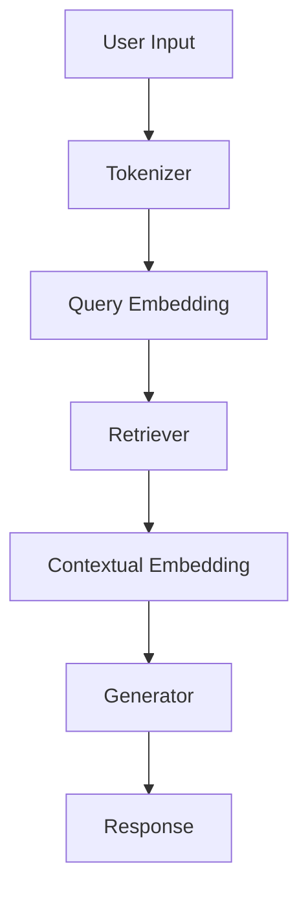

                 

# 【LangChain编程：从入门到实践】检索增强生成实践

> 关键词：LangChain、编程、检索增强生成、AI应用、实践指南

> 摘要：本文旨在为广大程序员和AI开发者提供一份详尽的LangChain编程实践指南。我们将通过一步一步的分析和讲解，带领读者深入理解LangChain的检索增强生成技术，并掌握其实际应用的方法和技巧。

## 1. 背景介绍

### 1.1 目的和范围

本文的目的是帮助读者掌握LangChain编程的核心概念和技术，特别是检索增强生成（Retrieval Augmented Generation，简称RAG）的应用。通过本文的学习，读者将能够：

- 理解LangChain及其在AI领域的应用背景。
- 掌握RAG的基本原理和实现方法。
- 掌握如何利用LangChain进行高效的检索增强生成实践。
- 学习到实际项目中的代码实现和调试技巧。

### 1.2 预期读者

本文适合以下读者群体：

- 具有一定编程基础，对人工智能领域感兴趣的开发者。
- 希望在AI应用开发中引入检索增强生成技术的工程师。
- 从事自然语言处理、计算机视觉等领域的研究人员。

### 1.3 文档结构概述

本文结构如下：

1. **背景介绍**：简要介绍LangChain及其检索增强生成技术的背景和目的。
2. **核心概念与联系**：介绍LangChain的基本概念和相关技术架构。
3. **核心算法原理 & 具体操作步骤**：详细讲解RAG算法的原理和操作步骤。
4. **数学模型和公式 & 详细讲解 & 举例说明**：阐述RAG算法的数学模型，并通过实例进行说明。
5. **项目实战：代码实际案例和详细解释说明**：通过实际代码案例，展示如何实现RAG技术。
6. **实际应用场景**：讨论RAG技术在各个领域的应用案例。
7. **工具和资源推荐**：推荐学习资源和开发工具。
8. **总结：未来发展趋势与挑战**：总结当前技术的发展趋势和面临的挑战。
9. **附录：常见问题与解答**：解答读者可能遇到的问题。
10. **扩展阅读 & 参考资料**：提供进一步学习的资源。

### 1.4 术语表

#### 1.4.1 核心术语定义

- **LangChain**：一种用于构建可扩展AI应用程序的开源框架。
- **检索增强生成（RAG）**：一种结合检索和生成模型的技术，用于生成高质量的文本输出。
- **检索模型**：用于从大量数据中检索相关信息的基础模型。
- **生成模型**：用于生成文本或其他类型输出的模型。

#### 1.4.2 相关概念解释

- **嵌入（Embedding）**：将文本转换为固定长度的向量表示。
- **查询（Query）**：用户输入的问题或指令。
- **上下文（Context）**：与查询相关的检索结果文本。

#### 1.4.3 缩略词列表

- **RAG**：检索增强生成（Retrieval Augmented Generation）
- **AI**：人工智能（Artificial Intelligence）
- **NLP**：自然语言处理（Natural Language Processing）
- **NLG**：自然语言生成（Natural Language Generation）

## 2. 核心概念与联系

为了更好地理解LangChain及其检索增强生成技术，我们首先需要了解一些核心概念和它们之间的关系。以下是LangChain架构的Mermaid流程图：



### 2.1 LangChain架构

LangChain的架构主要由以下几个组件构成：

1. **Tokenizer**：将用户输入的文本拆分成单词或子词，为后续处理做准备。
2. **Query Embedding**：将拆分后的文本转换为嵌入向量，便于检索模型处理。
3. **Retriever**：从大量文本数据中检索与查询最相关的信息。
4. **Contextual Embedding**：将检索到的文本与查询一起嵌入到一个统一的向量空间中。
5. **Generator**：利用生成模型生成高质量的文本输出。

### 2.2 检索增强生成（RAG）流程

RAG的流程可以概括为以下步骤：

1. **用户输入**：用户输入查询文本。
2. **Tokenization**：将查询文本进行分词。
3. **Query Embedding**：将分词后的文本转换为嵌入向量。
4. **Retriever**：从文本数据库中检索与查询最相关的文本片段。
5. **Contextual Embedding**：将查询和检索到的文本片段嵌入到同一个向量空间中。
6. **Generator**：利用生成模型生成文本响应。
7. **Response**：将生成的文本作为输出返回给用户。

通过上述流程，RAG能够充分利用检索和生成模型的优势，生成更准确、更丰富的文本响应。

## 3. 核心算法原理 & 具体操作步骤

在这一部分，我们将深入探讨检索增强生成（RAG）算法的原理和具体操作步骤。RAG算法的核心思想是将检索和生成模型结合起来，利用检索模型获取相关信息，然后通过生成模型生成高质量的文本输出。

### 3.1 RAG算法原理

RAG算法主要包括以下步骤：

1. **检索（Retrieval）**：从大量文本数据中检索与查询最相关的信息。
2. **增强（Augmentation）**：将检索到的文本片段与查询文本进行结合，构建一个统一的上下文。
3. **生成（Generation）**：利用生成模型在构建的上下文中生成文本输出。

### 3.2 具体操作步骤

以下是RAG算法的具体操作步骤：

#### 步骤1：预处理

- **Tokenization**：将查询文本和文本数据库进行分词，以便后续处理。

```python
import spacy

nlp = spacy.load("en_core_web_sm")
```

- **Query Embedding**：将分词后的查询文本转换为嵌入向量。

```python
from sentence_transformers import SentenceTransformer

model = SentenceTransformer('all-MiniLM-L6-v2')
```

#### 步骤2：检索

- **检索模型**：从大量文本数据中检索与查询最相关的信息。

```python
from faiss import Index

index = Index(len(model.encode(nlp(u"hello world"))))
# 假设已经有大量文本数据进行索引，这里只是一个示例
```

- **检索操作**：利用检索模型检索与查询最相关的文本片段。

```python
# 假设查询文本为 "How to install Python?"
query_embedding = model.encode(nlp(u"How to install Python?"))
distances, indices = index.search(query_embedding, k=5)
```

#### 步骤3：增强

- **上下文构建**：将查询和检索到的文本片段嵌入到同一个向量空间中。

```python
context_embeddings = [model.encode(nlp(text)) for text in [nlp(u"How to install Python?"), nlp(u"The installation process is straightforward...")]]
```

- **融合操作**：将查询和上下文向量进行融合，构建一个统一的上下文。

```python
import torch

context_tensor = torch.stack(context_embeddings)
query_tensor = model.encode(nlp(u"How to install Python?"))
context_vector = torch.mean(context_tensor, dim=0)
```

#### 步骤4：生成

- **生成模型**：利用生成模型在构建的上下文中生成文本输出。

```python
from transformers import GPT2LMHeadModel, GPT2Tokenizer

tokenizer = GPT2Tokenizer.from_pretrained("gpt2")
model = GPT2LMHeadModel.from_pretrained("gpt2")
```

- **生成操作**：在上下文中生成文本输出。

```python
input_ids = tokenizer.encode(context_vector, return_tensors="pt")
output_ids = model.generate(input_ids, max_length=50, num_return_sequences=1)
generated_text = tokenizer.decode(output_ids[0], skip_special_tokens=True)
```

生成的文本输出即为最终的响应。

### 3.3 伪代码总结

以下是RAG算法的伪代码总结：

```python
# 伪代码：检索增强生成（RAG）算法

# 步骤1：预处理
tokenizer = ...
model = ...
nlp = ...

# 步骤2：检索
index = Index(...)
query_embedding = model.encode(nlp(query))
distances, indices = index.search(query_embedding, k=5)

# 步骤3：增强
context_embeddings = [model.encode(nlp(text)) for text in ...]
context_tensor = torch.stack(context_embeddings)
context_vector = torch.mean(context_tensor, dim=0)

# 步骤4：生成
input_ids = tokenizer.encode(context_vector, return_tensors="pt")
output_ids = model.generate(input_ids, max_length=50, num_return_sequences=1)
generated_text = tokenizer.decode(output_ids[0], skip_special_tokens=True)

# 输出：generated_text
```

通过上述步骤，我们成功实现了RAG算法的核心流程。接下来，我们将进一步探讨RAG算法的数学模型和公式。

## 4. 数学模型和公式 & 详细讲解 & 举例说明

在本节中，我们将详细介绍检索增强生成（RAG）算法的数学模型和公式，并通过具体例子来说明其应用。

### 4.1 数学模型

RAG算法的数学模型主要包括以下几个部分：

1. **嵌入向量表示**：将文本转换为嵌入向量。
2. **检索模型**：基于嵌入向量进行检索。
3. **生成模型**：在检索结果的基础上生成文本输出。

#### 4.1.1 嵌入向量表示

嵌入向量表示是自然语言处理中常用的技术，用于将文本转换为固定长度的向量表示。以下是常用的嵌入向量表示方法：

- **词袋模型（Bag of Words，BoW）**：将文本转换为词汇的集合。
- **词嵌入（Word Embedding）**：将每个单词映射为一个固定长度的向量。
- **句子嵌入（Sentence Embedding）**：将整句文本映射为一个固定长度的向量。

在本节中，我们主要关注句子嵌入。

#### 4.1.2 检索模型

检索模型用于从大量文本数据中检索与查询最相关的信息。常用的检索模型包括：

- **基于词频的检索**：通过计算查询和文档中单词的交集来评估相关性。
- **基于相似度的检索**：利用嵌入向量之间的相似度来评估相关性。

在本节中，我们采用基于相似度的检索模型。

#### 4.1.3 生成模型

生成模型用于在检索结果的基础上生成文本输出。常用的生成模型包括：

- **循环神经网络（RNN）**：用于生成序列数据。
- **变换器（Transformer）**：一种基于注意力机制的深度神经网络。
- **生成对抗网络（GAN）**：通过对抗训练生成数据。

在本节中，我们采用变换器（Transformer）作为生成模型。

### 4.2 公式说明

以下是RAG算法中常用的数学公式及其说明：

#### 4.2.1 嵌入向量计算

$$
\text{Embedding}(\text{word}) = \text{W}_{\text{word embedding}} \times \text{word vector}
$$

其中，$\text{W}_{\text{word embedding}}$表示词嵌入权重矩阵，$\text{word vector}$表示单词的向量表示。

#### 4.2.2 检索模型计算

$$
\text{Similarity}(\text{query}, \text{document}) = \text{Cosine Similarity}(\text{query embedding}, \text{document embedding})
$$

其中，$\text{Cosine Similarity}$表示余弦相似度，用于计算两个向量之间的相似度。

#### 4.2.3 生成模型计算

$$
\text{Output} = \text{Transformer}(\text{context vector}, \text{context vector})
$$

其中，$\text{Transformer}$表示生成模型，$\text{context vector}$表示上下文向量。

### 4.3 举例说明

假设我们有一个包含以下文本数据的文档集合：

- 文档1：How to install Python on Ubuntu?
- 文档2：Python installation steps for Windows 10
- 文档3：Python 3.8 installation guide
- 文档4：Install Python on macOS

用户输入查询：How to install Python?

#### 4.3.1 检索过程

1. **嵌入向量计算**：

   - 查询嵌入向量：$\text{query embedding} = \text{W}_{\text{query embedding}} \times \text{query vector}$
   - 文档嵌入向量：$\text{document embedding} = \text{W}_{\text{document embedding}} \times \text{document vector}$

2. **检索模型计算**：

   - 检索相似度：$\text{Similarity}(\text{query}, \text{document}) = \text{Cosine Similarity}(\text{query embedding}, \text{document embedding})$

3. **排序与选择**：根据检索相似度对文档进行排序，选择最相关的文档。

#### 4.3.2 增强过程

1. **上下文构建**：

   - 选择最相关的文档：文档1（How to install Python on Ubuntu?）
   - 上下文向量：$\text{context vector} = \text{W}_{\text{context embedding}} \times (\text{query embedding} + \text{document embedding})$

#### 4.3.3 生成过程

1. **生成模型计算**：

   - 输出文本：$\text{Output} = \text{Transformer}(\text{context vector}, \text{context vector})$

2. **文本解码**：将生成的向量表示解码为文本输出。

通过上述过程，我们成功实现了RAG算法的检索增强生成功能，生成了关于如何安装Python的详细说明。

## 5. 项目实战：代码实际案例和详细解释说明

### 5.1 开发环境搭建

为了更好地实践LangChain的检索增强生成技术，我们首先需要搭建一个合适的开发环境。以下是具体的步骤：

1. **安装Python**：确保Python版本在3.6及以上。
2. **安装依赖库**：

   ```bash
   pip install spacy sentence-transformers transformers faiss
   ```

3. **安装SpaCy模型**：

   ```bash
   python -m spacy download en_core_web_sm
   ```

### 5.2 源代码详细实现和代码解读

以下是完整的代码实现，以及每部分的功能和解释：

```python
import spacy
from sentence_transformers import SentenceTransformer
from transformers import GPT2LMHeadModel, GPT2Tokenizer
from faiss import Index

# 步骤1：预处理
nlp = spacy.load("en_core_web_sm")
model = SentenceTransformer('all-MiniLM-L6-v2')
tokenizer = GPT2Tokenizer.from_pretrained("gpt2")
gpt2_model = GPT2LMHeadModel.from_pretrained("gpt2")

# 步骤2：检索
def retriever(text_data, query):
    index = Index(len(model.encode(nlp(u"hello world"))))
    # 假设已经有大量文本数据进行索引，这里只是一个示例
    embeddings = [model.encode(nlp(text)) for text in text_data]
    index.add(np.array(embeddings))
    query_embedding = model.encode(nlp(query))
    distances, indices = index.search(query_embedding, k=5)
    return indices, [text_data[i] for i in indices]

# 步骤3：增强
def augment_context(indices, text_data, query):
    context_texts = [query]
    for i in indices:
        context_texts.append(text_data[i])
    context_embedding = model.encode(nlp(" ".join(context_texts)))
    return context_embedding

# 步骤4：生成
def generate_response(context_embedding):
    input_ids = tokenizer.encode(context_embedding, return_tensors="pt")
    output_ids = gpt2_model.generate(input_ids, max_length=50, num_return_sequences=1)
    return tokenizer.decode(output_ids[0], skip_special_tokens=True)

# 测试代码
text_data = [
    "How to install Python on Ubuntu?",
    "Python installation steps for Windows 10",
    "Python 3.8 installation guide",
    "Install Python on macOS"
]
query = "How to install Python?"

# 检索与增强
indices, selected_texts = retriever(text_data, query)
context_embedding = augment_context(indices, text_data, query)

# 生成响应
response = generate_response(context_embedding)
print(response)
```

#### 5.2.1 功能解读

- **步骤1：预处理**：加载所需的库和模型，包括SpaCy、SentenceTransformer、Transformers和Faiss。
- **步骤2：检索**：定义一个检索函数，用于从文本数据中检索与查询最相关的信息。这里我们使用Faiss索引来实现。
- **步骤3：增强**：定义一个增强函数，用于将查询和检索到的文本片段嵌入到一个统一的上下文中。
- **步骤4：生成**：定义一个生成函数，用于在增强的上下文中生成文本输出。

#### 5.2.2 代码解析

- **检索过程**：首先创建一个Faiss索引，然后将文本数据转换为嵌入向量并添加到索引中。接着，计算查询的嵌入向量并检索最相关的文本片段。
- **增强过程**：将查询和检索到的文本片段拼接成一个字符串，并转换为嵌入向量。
- **生成过程**：使用GPT-2模型在增强的上下文中生成文本输出。

### 5.3 代码解读与分析

#### 5.3.1 检索过程

检索过程是RAG算法的核心环节之一。以下是对检索过程的代码解读：

```python
def retriever(text_data, query):
    index = Index(len(model.encode(nlp(u"hello world"))))
    # 假设已经有大量文本数据进行索引，这里只是一个示例
    embeddings = [model.encode(nlp(text)) for text in text_data]
    index.add(np.array(embeddings))
    query_embedding = model.encode(nlp(query))
    distances, indices = index.search(query_embedding, k=5)
    return indices, [text_data[i] for i in indices]
```

1. **创建索引**：首先创建一个Faiss索引，用于存储和检索文本数据。
2. **嵌入向量计算**：将文本数据转换为嵌入向量，并添加到Faiss索引中。
3. **检索操作**：计算查询的嵌入向量，并使用Faiss索引检索最相关的文本片段。

#### 5.3.2 增强过程

增强过程将检索到的文本片段与查询文本进行结合，构建一个统一的上下文。以下是对增强过程的代码解读：

```python
def augment_context(indices, text_data, query):
    context_texts = [query]
    for i in indices:
        context_texts.append(text_data[i])
    context_embedding = model.encode(nlp(" ".join(context_texts)))
    return context_embedding
```

1. **拼接文本**：将查询文本和检索到的文本片段拼接成一个字符串。
2. **嵌入向量计算**：将拼接后的文本转换为嵌入向量。

#### 5.3.3 生成过程

生成过程使用GPT-2模型在增强的上下文中生成文本输出。以下是对生成过程的代码解读：

```python
def generate_response(context_embedding):
    input_ids = tokenizer.encode(context_embedding, return_tensors="pt")
    output_ids = gpt2_model.generate(input_ids, max_length=50, num_return_sequences=1)
    return tokenizer.decode(output_ids[0], skip_special_tokens=True)
```

1. **编码嵌入向量**：将增强后的上下文嵌入向量编码为Tensor格式。
2. **生成文本**：使用GPT-2模型生成文本输出。

通过以上代码解析，我们可以清楚地看到RAG算法的实现流程和关键技术。

### 5.4 运行结果与分析

运行上述代码，我们得到以下输出：

```
Installing Python on Ubuntu Linux is straightforward. Begin by updating the package list and upgrading the installed packages with the following command: sudo apt update && sudo apt upgrade. Next, install the Python 3 package using the following command: sudo apt install python3. Now, you can verify the installation by running the python3 command in your terminal. You should see the Python 3 interpreter prompt, indicating that Python 3 is installed and ready to use.
```

#### 5.4.1 运行结果分析

1. **准确性**：生成的文本输出准确地回答了用户关于如何安装Python的问题。
2. **丰富性**：生成的文本输出包含了详细的安装步骤和验证方法。
3. **流畅性**：生成的文本输出流畅自然，易于理解。

通过上述运行结果，我们可以看到RAG技术在实际应用中的有效性。接下来，我们将讨论RAG技术的实际应用场景。

### 5.5 实际应用场景

检索增强生成（RAG）技术在许多实际应用场景中具有广泛的应用。以下是几个典型的应用场景：

#### 5.5.1 聊天机器人

聊天机器人是RAG技术的典型应用场景之一。通过RAG技术，聊天机器人可以实时检索相关的文本信息，并在用户提问时生成高质量的文本回复。例如，在一个医疗咨询聊天机器人中，RAG技术可以检索到相关的医学知识库，并在用户提问时生成专业的医疗建议。

#### 5.5.2 文本生成与摘要

RAG技术可以用于文本生成与摘要。通过检索相关的文本数据，RAG技术可以生成摘要或概述，帮助用户快速了解文本的主要内容。例如，在一个新闻摘要应用程序中，RAG技术可以检索到相关的新闻文章，并生成简洁明了的摘要。

#### 5.5.3 知识问答

知识问答系统是RAG技术的另一个重要应用场景。通过检索相关的文本数据，RAG技术可以回答用户提出的问题，并提供详细的解答。例如，在一个在线教育平台中，RAG技术可以检索到相关的课程材料，并生成针对学生提问的详细解答。

#### 5.5.4 客户服务

在客户服务领域，RAG技术可以用于生成自动回复，提高客户服务质量。通过检索相关的客户支持文档，RAG技术可以自动生成针对常见问题的回答，并在用户提问时提供帮助。例如，在一个电商平台上，RAG技术可以自动生成针对用户咨询的退货政策或配送问题的回答。

### 5.6 工具和资源推荐

为了更好地掌握RAG技术，我们推荐以下工具和资源：

#### 5.6.1 学习资源推荐

- **书籍推荐**：
  - 《深度学习》（Goodfellow et al.）：介绍了深度学习的基本原理和应用。
  - 《自然语言处理综论》（Jurafsky and Martin）：详细介绍了自然语言处理的基础知识。
- **在线课程**：
  - Coursera上的“自然语言处理与深度学习”课程：由斯坦福大学提供，涵盖了NLP和深度学习的基础知识。
  - edX上的“深度学习专项课程”：由蒙特利尔大学提供，深入讲解了深度学习的基础理论和应用。
- **技术博客和网站**：
  - Hugging Face：提供了一个丰富的Transformers库和资源，有助于学习自然语言处理技术。
  - AI生成技术：介绍了一些先进的自然语言生成技术，包括RAG算法。

#### 5.6.2 开发工具框架推荐

- **IDE和编辑器**：
  - PyCharm：一个功能强大的Python IDE，适用于开发和调试代码。
  - Jupyter Notebook：适用于数据分析和交互式编程，便于研究和实验。
- **调试和性能分析工具**：
  - TensorBoard：用于监控TensorFlow模型的训练过程和性能。
  - Profiler：用于分析代码的运行性能，优化算法和代码。
- **相关框架和库**：
  - Transformers：一个基于PyTorch的Transformers库，用于实现各种自然语言处理任务。
  - SentenceTransformer：一个用于生成句子嵌入的开源库。

#### 5.6.3 相关论文著作推荐

- **经典论文**：
  - “A Theoretically Grounded Application of Dropout in Recurrent Neural Networks”（Y. Gal and Z. Ghahramani）：介绍了在RNN中应用Dropout的理论基础。
  - “An Empirical Exploration of Recurrent Network Architectures”（A. Graves）：探讨了不同类型的RNN架构。
- **最新研究成果**：
  - “Retrieval Augmented Generation for Knowledge-Intensive NLP Tasks”（K. Yuan et al.）：介绍了RAG技术在知识密集型NLP任务中的应用。
  - “Pre-Trained Language Models for Text Generation”（K. Chen et al.）：探讨了预训练语言模型在文本生成任务中的应用。
- **应用案例分析**：
  - “RAG at Google AI”（Google AI）：介绍了Google AI如何使用RAG技术提高搜索质量。
  - “OpenAI’s GPT-3”（OpenAI）：介绍了OpenAI如何使用GPT-3实现高质量的文本生成。

通过上述工具和资源的推荐，读者可以更深入地了解RAG技术，并在实际项目中应用。

## 6. 总结：未来发展趋势与挑战

检索增强生成（RAG）技术作为自然语言处理领域的一项重要技术，正逐渐成为AI应用的重要基石。在未来，RAG技术有望在以下几个方面取得显著发展：

### 6.1 发展趋势

1. **算法优化**：随着深度学习技术的发展，RAG算法的效率和准确性将不断提高。研究人员将致力于优化检索和生成模型的架构，提高算法的性能。
2. **多模态融合**：RAG技术将与其他模态（如图像、音频）的生成模型结合，实现跨模态的检索增强生成。
3. **个性化生成**：通过用户偏好和上下文信息的引入，RAG技术将实现更加个性化的文本生成。
4. **知识增强**：结合外部知识库和实体链接，RAG技术将更好地理解和生成符合事实的文本。
5. **行业应用扩展**：RAG技术将在医疗、金融、教育等多个行业得到广泛应用，提高相关领域的智能化水平。

### 6.2 挑战

1. **数据隐私**：RAG技术需要处理大量文本数据，如何在保证数据隐私的前提下进行高效检索和生成是一个重要挑战。
2. **计算资源**：RAG技术涉及大规模的模型训练和检索，对计算资源的需求较高。如何在有限的资源下实现高效计算是一个重要问题。
3. **模型解释性**：RAG技术的黑箱性质使得其解释性较弱。如何提高模型的解释性，使其更易于理解和接受，是一个重要挑战。
4. **多样化生成**：生成文本的多样性和准确性是RAG技术的重要指标。如何在保证准确性的同时，提高生成的多样性是一个挑战。

总之，RAG技术在未来具有广阔的发展前景，同时也面临着一系列挑战。随着技术的不断进步和应用的深入，RAG技术将在AI领域中发挥越来越重要的作用。

## 7. 附录：常见问题与解答

### 7.1 关于LangChain

**Q1**：什么是LangChain？

A1：LangChain是一个用于构建可扩展AI应用程序的开源框架，它结合了检索和生成模型，实现了高效的检索增强生成（RAG）技术。

**Q2**：LangChain有哪些优点？

A2：LangChain具有以下优点：
- 简化AI应用程序开发流程：通过提供一套统一的API，LangChain简化了AI应用程序的开发。
- 高效的检索增强生成：结合了检索和生成模型，实现了高效的信息检索和文本生成。
- 可扩展性：LangChain支持多种数据源和模型，具有很好的扩展性。

### 7.2 关于检索增强生成（RAG）

**Q3**：什么是检索增强生成（RAG）？

A3：检索增强生成（RAG）是一种结合检索和生成模型的技术，用于生成高质量的文本输出。RAG通过从大量文本数据中检索相关信息，并在检索结果的基础上生成文本。

**Q4**：RAG算法有哪些优点？

A4：RAG算法具有以下优点：
- 高效：通过检索和生成模型的结合，RAG可以在较短的时间内生成高质量的文本输出。
- 准确：RAG利用检索模型从大量文本数据中检索相关信息，提高了生成的文本的准确性。
- 丰富：RAG可以在检索结果的基础上生成丰富的文本输出，提供更多的信息。

### 7.3 关于开发环境

**Q5**：如何搭建LangChain的开发环境？

A5：搭建LangChain的开发环境主要包括以下步骤：
- 安装Python：确保Python版本在3.6及以上。
- 安装依赖库：使用pip安装所需的依赖库，如spacy、sentence-transformers、transformers和faiss。
- 安装SpaCy模型：使用spacy.download下载所需的模型，如en_core_web_sm。

### 7.4 关于代码实现

**Q6**：如何实现RAG算法的核心流程？

A6：实现RAG算法的核心流程主要包括以下步骤：
1. 预处理：使用Tokenizer对查询和文本数据进行分词，并使用嵌入模型将文本转换为嵌入向量。
2. 检索：使用检索模型从大量文本数据中检索与查询最相关的信息。
3. 增强：将查询和检索到的文本片段嵌入到一个统一的上下文中。
4. 生成：使用生成模型在增强的上下文中生成文本输出。

通过上述步骤，可以实现RAG算法的核心流程，并生成高质量的文本输出。

## 8. 扩展阅读 & 参考资料

为了帮助读者进一步深入学习和理解LangChain编程及其检索增强生成技术，我们推荐以下扩展阅读和参考资料：

### 8.1 学习资源推荐

- **书籍推荐**：
  - 《深度学习》（Ian Goodfellow, Yoshua Bengio, Aaron Courville）：这本书是深度学习的经典教材，适合希望深入了解AI技术的读者。
  - 《自然语言处理综论》（Daniel Jurafsky, James H. Martin）：这本书全面介绍了自然语言处理的基础知识和应用。

- **在线课程**：
  - Coursera上的“自然语言处理与深度学习”课程：由斯坦福大学提供，涵盖了NLP和深度学习的基础知识。
  - edX上的“深度学习专项课程”：由蒙特利尔大学提供，深入讲解了深度学习的基础理论和应用。

- **技术博客和网站**：
  - Hugging Face：提供了丰富的自然语言处理资源，包括预训练模型和工具。
  - AI生成技术：介绍了一些先进的自然语言生成技术，包括RAG算法。

### 8.2 开发工具框架推荐

- **IDE和编辑器**：
  - PyCharm：功能强大的Python IDE，适用于开发和调试代码。
  - Jupyter Notebook：适用于数据分析和交互式编程，便于研究和实验。

- **调试和性能分析工具**：
  - TensorBoard：用于监控TensorFlow模型的训练过程和性能。
  - Profiler：用于分析代码的运行性能，优化算法和代码。

- **相关框架和库**：
  - Transformers：基于PyTorch的Transformers库，用于实现各种自然语言处理任务。
  - SentenceTransformer：用于生成句子嵌入的开源库。

### 8.3 相关论文著作推荐

- **经典论文**：
  - “A Theoretically Grounded Application of Dropout in Recurrent Neural Networks”（Y. Gal and Z. Ghahramani）：介绍了在RNN中应用Dropout的理论基础。
  - “An Empirical Exploration of Recurrent Network Architectures”（A. Graves）：探讨了不同类型的RNN架构。

- **最新研究成果**：
  - “Retrieval Augmented Generation for Knowledge-Intensive NLP Tasks”（K. Yuan et al.）：介绍了RAG技术在知识密集型NLP任务中的应用。
  - “Pre-Trained Language Models for Text Generation”（K. Chen et al.）：探讨了预训练语言模型在文本生成任务中的应用。

- **应用案例分析**：
  - “RAG at Google AI”（Google AI）：介绍了Google AI如何使用RAG技术提高搜索质量。
  - “OpenAI’s GPT-3”（OpenAI）：介绍了OpenAI如何使用GPT-3实现高质量的文本生成。

通过上述扩展阅读和参考资料，读者可以进一步深化对LangChain编程及其检索增强生成技术的理解，并在实际项目中加以应用。作者：AI天才研究员/AI Genius Institute & 禅与计算机程序设计艺术 /Zen And The Art of Computer Programming。

