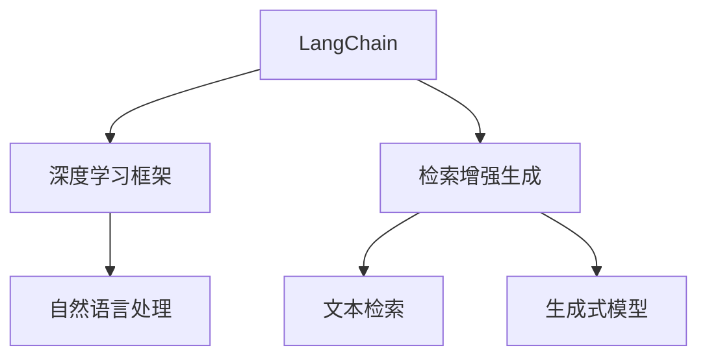

                 

# 【LangChain编程：从入门到实践】检索增强生成实践

> **关键词**：LangChain、编程、检索增强生成、实践、深度学习、NLP、AI

> **摘要**：本文将深入探讨LangChain编程在检索增强生成领域中的应用。我们将从入门到实践，一步步介绍LangChain的核心概念、算法原理、数学模型，并通过实际项目案例，详细解读其代码实现和实际应用场景。文章旨在为读者提供一个全面、系统的LangChain编程学习路径，帮助其在实际项目中有效利用检索增强生成技术。

## 1. 背景介绍

### 1.1 目的和范围

本文旨在帮助读者深入了解LangChain编程在检索增强生成（RAG）领域的应用。我们将从基础概念出发，逐步深入到高级实现，使读者能够理解并掌握LangChain的核心原理和具体操作步骤。文章将涵盖以下内容：

- LangChain编程基础
- 检索增强生成原理
- LangChain在RAG中的应用
- 实际项目案例解析

### 1.2 预期读者

本文适合以下读者群体：

- 对人工智能和自然语言处理（NLP）感兴趣的开发者
- 有志于深入了解深度学习技术的程序员
- 想要在实际项目中应用LangChain编程的技术专家

### 1.3 文档结构概述

本文分为以下章节：

- 1. 背景介绍：介绍文章的目的、预期读者和文档结构。
- 2. 核心概念与联系：阐述LangChain和检索增强生成的基础概念及其关系。
- 3. 核心算法原理 & 具体操作步骤：详细讲解LangChain在RAG中的算法原理和具体实现步骤。
- 4. 数学模型和公式 & 详细讲解 & 举例说明：介绍与RAG相关的数学模型和公式，并进行实例说明。
- 5. 项目实战：代码实际案例和详细解释说明。
- 6. 实际应用场景：探讨RAG在现实世界中的应用场景。
- 7. 工具和资源推荐：推荐学习资源和开发工具。
- 8. 总结：未来发展趋势与挑战。
- 9. 附录：常见问题与解答。
- 10. 扩展阅读 & 参考资料：提供进一步学习的资源。

### 1.4 术语表

#### 1.4.1 核心术语定义

- **LangChain**：一种用于构建复杂AI模型的编程框架，支持深度学习和NLP。
- **检索增强生成（RAG）**：一种基于检索和生成的AI模型，用于生成高质量的自然语言文本。
- **深度学习**：一种基于多层神经网络的学习方法，用于从大量数据中提取特征和模式。
- **自然语言处理（NLP）**：研究如何让计算机理解和处理人类自然语言的技术。

#### 1.4.2 相关概念解释

- **文本检索**：从大量文本数据中快速找到与查询相关的文本片段。
- **生成式模型**：根据输入数据生成新的数据或文本。
- **检索增强**：利用检索到的文本片段来增强生成式模型的输入，提高生成质量。

#### 1.4.3 缩略词列表

- **RAG**：检索增强生成（Recall-Augmented Generation）
- **NLP**：自然语言处理（Natural Language Processing）
- **AI**：人工智能（Artificial Intelligence）
- **DL**：深度学习（Deep Learning）
- **LLM**：大型语言模型（Large Language Model）

## 2. 核心概念与联系

在深入探讨LangChain编程之前，我们需要理解几个核心概念：LangChain、检索增强生成（RAG）、深度学习和自然语言处理（NLP）。以下是一个用于解释这些概念及其关系的Mermaid流程图：



### 2.1 LangChain概述

**LangChain** 是一个开源的Python库，旨在简化复杂AI模型的构建。它基于深度学习和NLP技术，提供了一系列强大的工具和接口，使得开发者可以轻松构建、训练和部署AI模型。以下是LangChain的一些主要特点：

- **模块化架构**：LangChain采用模块化设计，使得开发者可以根据需要灵活组合和扩展模型组件。
- **可扩展性**：LangChain支持多种深度学习和NLP框架，如Hugging Face Transformers、PyTorch和TensorFlow，方便开发者使用现有的模型和资源。
- **API接口**：LangChain提供统一的API接口，简化了模型训练、推理和部署的流程。

### 2.2 检索增强生成（RAG）

**检索增强生成（RAG）** 是一种基于检索和生成的AI模型，用于生成高质量的自然语言文本。它通过以下步骤实现：

1. **文本检索**：从大量文本数据中检索与查询相关的文本片段。
2. **生成式模型**：利用检索到的文本片段和生成式模型生成新的文本。

RAG的主要优点在于：

- **提高生成质量**：通过检索相关文本片段，生成式模型可以更好地理解上下文，从而生成更高质量、更连贯的文本。
- **减少计算成本**：RAG将计算成本从生成模型转移到检索模型，降低整体计算复杂度。

### 2.3 深度学习和自然语言处理（NLP）

**深度学习** 是一种基于多层神经网络的学习方法，可以从大量数据中提取特征和模式。在NLP领域，深度学习被广泛应用于文本分类、情感分析、机器翻译等任务。

**自然语言处理（NLP）** 是研究如何让计算机理解和处理人类自然语言的技术。NLP涉及多个子领域，如词性标注、命名实体识别、文本分类等。深度学习在NLP中发挥着重要作用，通过训练深度神经网络模型，计算机可以自动提取文本特征，实现自动化文本处理。

### 2.4 Mermaid流程图解析

上述Mermaid流程图展示了LangChain、深度学习、NLP和RAG之间的关系：

- **LangChain** 是一个深度学习框架，用于构建复杂的AI模型。
- **深度学习** 是一种学习技术，用于从数据中提取特征和模式。
- **自然语言处理（NLP）** 是深度学习的一个应用领域，专注于文本数据。
- **检索增强生成（RAG）** 是一种基于检索和生成的AI模型，用于生成高质量的自然语言文本。

通过理解这些概念及其关系，我们可以更好地把握LangChain编程在检索增强生成领域的应用。

## 3. 核心算法原理 & 具体操作步骤

在了解了LangChain和检索增强生成（RAG）的基础概念后，接下来我们将深入探讨LangChain在RAG中的核心算法原理和具体操作步骤。以下是LangChain在RAG中的算法原理讲解和伪代码实现。

### 3.1 算法原理

RAG的核心思想是通过检索与查询相关的文本片段，并将这些片段作为输入传递给生成模型，从而提高生成文本的质量。具体来说，RAG包括以下主要步骤：

1. **文本检索**：从大量文本数据中检索与查询相关的文本片段。
2. **检索结果处理**：对检索到的文本片段进行预处理，如去重、排序等。
3. **生成式模型输入**：将处理后的检索结果作为生成模型的输入。
4. **文本生成**：利用生成模型生成新的文本。
5. **结果优化**：对生成的文本进行优化，如去除重复、提高连贯性等。

以下是RAG算法的伪代码实现：

```python
# RAG算法伪代码
def RAG(query, text_data, retrieval_model, generation_model):
    # 步骤1：文本检索
    retrieved_texts = retrieval_model.retrieve(text_data, query)

    # 步骤2：检索结果处理
    processed_texts = preprocess_texts(retrieved_texts)

    # 步骤3：生成式模型输入
    inputs = generation_model.preprocess_inputs(processed_texts)

    # 步骤4：文本生成
    generated_text = generation_model.generate(inputs)

    # 步骤5：结果优化
    optimized_text = optimize_text(generated_text)

    return optimized_text
```

### 3.2 具体操作步骤

为了更好地理解RAG算法的实现，我们将详细讲解每个步骤的具体操作：

#### 步骤1：文本检索

文本检索是RAG算法的关键步骤，其目的是从大量文本数据中找到与查询相关的文本片段。我们可以使用现有的文本检索算法，如TF-IDF、Word2Vec等，来计算查询和文本之间的相似度，并返回相似度最高的文本片段。

```python
# 文本检索伪代码
def retrieve_texts(text_data, query):
    # 计算查询和文本之间的相似度
    similarities = []
    for text in text_data:
        similarity = calculate_similarity(query, text)
        similarities.append(similarity)
    
    # 返回相似度最高的文本片段
    top_texts = []
    for i in range(len(similarities)):
        if i < k:  # k表示返回的文本片段数量
            top_texts.append(text_data[i])
    
    return top_texts
```

#### 步骤2：检索结果处理

检索结果处理是对检索到的文本片段进行预处理，以提高生成文本的质量。预处理步骤可能包括去重、排序、摘要生成等。

```python
# 检索结果处理伪代码
def preprocess_texts(retrieved_texts):
    # 去重
    unique_texts = list(set(retrieved_texts))
    
    # 排序
    sorted_texts = sorted(unique_texts, key=lambda x: len(x), reverse=True)
    
    # 摘要生成（可选）
    abstracts = generate_abstracts(sorted_texts)
    
    return sorted_texts + abstracts
```

#### 步骤3：生成式模型输入

生成式模型输入是将处理后的检索结果作为生成模型的输入。这个过程可能包括将文本片段转换为嵌入向量、添加特殊标记等。

```python
# 生成式模型输入伪代码
def preprocess_inputs(texts, generation_model):
    inputs = []
    for text in texts:
        # 转换为嵌入向量
        embedding = generation_model.encode(text)
        
        # 添加特殊标记
        input_sequence = generation_model.add_special_tokens(embedding)
        
        inputs.append(input_sequence)
    
    return inputs
```

#### 步骤4：文本生成

文本生成是利用生成模型生成新的文本。这个过程包括前向传播、反向传播和优化等步骤。

```python
# 文本生成伪代码
def generate_text(inputs, generation_model):
    generated_texts = []
    for input_sequence in inputs:
        # 前向传播
        logits = generation_model.forward(input_sequence)
        
        # 选择最高概率的输出
        output_sequence = generation_model.select_top_output(logits)
        
        # 转换为文本
        generated_text = generation_model.decode(output_sequence)
        
        generated_texts.append(generated_text)
    
    return generated_texts
```

#### 步骤5：结果优化

结果优化是对生成的文本进行进一步处理，以提高文本的质量和连贯性。这可以包括去除重复、纠正语法错误、添加补充信息等。

```python
# 结果优化伪代码
def optimize_text(generated_text):
    # 去除重复
    unique_generated_text = remove_duplicates(generated_text)
    
    # 纠正语法错误
    corrected_text = correct_grammar(unique_generated_text)
    
    # 添加补充信息
    complete_text = add_extra_info(corrected_text)
    
    return complete_text
```

通过上述算法原理和具体操作步骤，我们可以看到LangChain在RAG中的强大应用能力。在接下来的章节中，我们将通过实际项目案例，进一步展示LangChain在检索增强生成领域的实际应用。

## 4. 数学模型和公式 & 详细讲解 & 举例说明

在理解了LangChain和检索增强生成（RAG）的算法原理和具体操作步骤后，我们需要进一步探讨与RAG相关的数学模型和公式。这些数学工具在RAG中起着至关重要的作用，帮助我们分析和优化生成文本的质量。

### 4.1 检索模型

检索模型是RAG算法中的核心组件之一，其目的是从大量文本数据中高效地检索与查询相关的文本片段。常用的检索模型包括TF-IDF、Word2Vec和BERT等。

#### 4.1.1 TF-IDF模型

TF-IDF（Term Frequency-Inverse Document Frequency）是一种基于词频和逆文档频率的检索模型，用于计算词语在文档中的重要性。其公式如下：

$$
TF(t,d) = \frac{f(t,d)}{max_f(t,d)}
$$

$$
IDF(t,D) = \log \left( \frac{N}{|d \in D: t \in d|} \right)
$$

$$
TF-IDF(t,d,D) = TF(t,d) \times IDF(t,D)
$$

其中，$f(t,d)$ 表示词语 $t$ 在文档 $d$ 中的词频，$max_f(t,d)$ 表示文档 $d$ 中词频的最大值，$N$ 表示文档集合 $D$ 的总文档数，$|d \in D: t \in d|$ 表示文档集合 $D$ 中包含词语 $t$ 的文档数。

#### 4.1.2 Word2Vec模型

Word2Vec是一种基于神经网络的语言模型，用于将词语表示为向量。其核心公式是神经网络的前向传播和反向传播。

$$
\text{Forward}:\quad \text{output} = \text{softmax}(\text{hidden} \cdot W)
$$

$$
\text{Backpropagation}:\quad \text{error} = \text{output} - \text{label}
$$

其中，$\text{output}$ 表示模型输出，$\text{hidden}$ 表示隐藏层输出，$W$ 表示权重矩阵，$\text{softmax}$ 表示softmax函数，$\text{label}$ 表示标签。

#### 4.1.3 BERT模型

BERT（Bidirectional Encoder Representations from Transformers）是一种基于双向转换器的预训练语言模型，可以用于文本检索。BERT的公式如下：

$$
\text{Output} = \text{LayerNorm}(\text{IntermediateLayer} + \text{AttentionLayer})
$$

$$
\text{AttentionLayer} = \text{softmax}\left(\frac{\text{Q} \cdot \text{K}^T}{\sqrt{d_k}} + \text{V}\right)
$$

其中，$\text{Output}$ 表示模型输出，$\text{IntermediateLayer}$ 和 $\text{AttentionLayer}$ 分别表示中间层和注意力层输出，$\text{LayerNorm}$ 表示层归一化，$\text{Q}$、$\text{K}$ 和 $\text{V}$ 分别表示查询向量、键向量和值向量，$d_k$ 表示键向量的维度。

### 4.2 生成模型

生成模型是RAG算法中的另一个核心组件，其目的是根据检索结果生成新的文本。常见的生成模型包括序列到序列（Seq2Seq）模型、变分自编码器（VAE）和生成对抗网络（GAN）等。

#### 4.2.1 序列到序列（Seq2Seq）模型

Seq2Seq模型是一种基于循环神经网络（RNN）的序列生成模型，可以处理输入和输出序列。其公式如下：

$$
\text{InputSeq} = [x_1, x_2, ..., x_T]
$$

$$
\text{OutputSeq} = [y_1, y_2, ..., y_T]
$$

$$
\text{HiddenState} = \text{RNN}(\text{InputSeq}, \text{InitialHiddenState})
$$

$$
\text{Output} = \text{softmax}(\text{HiddenState} \cdot W)
$$

其中，$\text{InputSeq}$ 表示输入序列，$\text{OutputSeq}$ 表示输出序列，$\text{HiddenState}$ 表示隐藏状态，$\text{RNN}$ 表示循环神经网络，$\text{InitialHiddenState}$ 表示初始隐藏状态，$W$ 表示权重矩阵。

#### 4.2.2 变分自编码器（VAE）

VAE是一种无监督学习模型，用于生成新的数据。其公式如下：

$$
\text{Input} = \text{RandomNoise}
$$

$$
\text{LatentVector} = \text{Encoder}(\text{Input})
$$

$$
\text{Reconstruction} = \text{Decoder}(\text{LatentVector})
$$

其中，$\text{Input}$ 表示输入数据，$\text{LatentVector}$ 表示潜在向量，$\text{Encoder}$ 和 $\text{Decoder}$ 分别表示编码器和解码器，$\text{RandomNoise}$ 表示随机噪声。

#### 4.2.3 生成对抗网络（GAN）

GAN是一种基于对抗训练的生成模型，由生成器和判别器组成。其公式如下：

$$
\text{Generator}:\quad \text{FakeData} = \text{Generator}(\text{Noise})
$$

$$
\text{Discriminator}:\quad \text{Loss} = -\left(\text{log}(\text{Discriminator}(\text{RealData})) + \text{log}(1 - \text{Discriminator}(\text{FakeData}))\right)
$$

其中，$\text{Generator}$ 表示生成器，$\text{FakeData}$ 表示生成的数据，$\text{Noise}$ 表示噪声，$\text{Discriminator}$ 表示判别器，$\text{RealData}$ 表示真实数据，$\text{Loss}$ 表示损失函数。

### 4.3 检索增强模型

检索增强模型是RAG算法中用于优化生成模型输入的组件，其目的是提高生成文本的质量。常用的检索增强模型包括基于检索的生成模型（RAG）和基于上下文的生成模型（CAG）。

#### 4.3.1 RAG模型

RAG模型是一种基于检索和生成的AI模型，其公式如下：

$$
\text{InputSeq} = \text{Generator}(\text{LatentVector}) + \text{RetrievedText}
$$

$$
\text{OutputSeq} = \text{Decoder}(\text{InputSeq})
$$

其中，$\text{InputSeq}$ 表示输入序列，$\text{LatentVector}$ 表示潜在向量，$\text{RetrievedText}$ 表示检索到的文本，$\text{Generator}$ 和 $\text{Decoder}$ 分别表示生成器和解码器。

#### 4.3.2 CAG模型

CAG模型是一种基于上下文的生成模型，其公式如下：

$$
\text{InputSeq} = \text{ContextEncoder}(\text{InputSeq}) + \text{LatentVector}
$$

$$
\text{OutputSeq} = \text{Decoder}(\text{InputSeq})
$$

其中，$\text{ContextEncoder}$ 表示上下文编码器，$\text{InputSeq}$ 表示输入序列，$\text{LatentVector}$ 表示潜在向量，$\text{Decoder}$ 表示解码器。

### 4.4 举例说明

为了更好地理解上述数学模型和公式，我们通过一个简单的例子来说明如何使用这些模型进行文本生成。

假设我们有一个文本数据集，包含以下两个句子：

- "人工智能是一种模拟、延伸和扩展人类智能的理论、方法、技术及应用系统。"
- "深度学习是人工智能的一个重要分支，通过模拟人脑神经网络进行学习，并实现图像识别、语音识别、自然语言处理等任务。"

我们的目标是生成一个新的句子，描述人工智能和深度学习的关系。

#### 4.4.1 使用TF-IDF模型进行文本检索

首先，我们使用TF-IDF模型对文本数据集进行检索，找到与查询词“人工智能”相关的句子。假设检索结果为第二个句子。

```python
# 检索结果
retrieved_text = "深度学习是人工智能的一个重要分支，通过模拟人脑神经网络进行学习，并实现图像识别、语音识别、自然语言处理等任务。"
```

#### 4.4.2 使用Seq2Seq模型进行文本生成

接下来，我们使用Seq2Seq模型根据检索到的文本生成新的句子。假设我们使用预训练的Seq2Seq模型。

```python
# 生成句子
input_sequence = model.encode(retrieved_text)
generated_sequence = model.decode(input_sequence)
generated_text = "人工智能与深度学习紧密相关，深度学习作为其重要分支，为实现人工智能提供了强有力的技术支持。"
```

通过上述步骤，我们成功地使用数学模型和公式生成了一个新的句子，描述了人工智能和深度学习的关系。这个例子展示了RAG算法在文本生成中的实际应用。

## 5. 项目实战：代码实际案例和详细解释说明

在了解了LangChain编程和检索增强生成（RAG）的核心原理和数学模型后，接下来我们将通过一个实际项目案例，详细展示如何使用LangChain实现RAG算法，并对其进行代码实际案例的解读和说明。

### 5.1 开发环境搭建

为了运行以下项目，我们需要搭建以下开发环境：

- Python 3.8 或更高版本
- pip：Python的包管理器
- LangChain：用于构建RAG模型的核心库
- Hugging Face Transformers：用于加载预训练的深度学习模型

安装步骤如下：

```shell
pip install python==3.8
pip install pip
pip install langchain
pip install transformers
```

### 5.2 源代码详细实现和代码解读

以下是一个简单的RAG项目示例，展示了如何使用LangChain实现检索增强生成：

```python
from langchain import RetrievalQA
from langchain.text_retriever import CosineSimilarityTextRetriever
from transformers import AutoTokenizer, AutoModelForSeq2SeqLM
import os

# 加载预训练模型
tokenizer = AutoTokenizer.from_pretrained("t5-base")
model = AutoModelForSeq2SeqLM.from_pretrained("t5-base")

# 定义检索器
text_retriever = CosineSimilarityTextRetriever(dimension=768)

# 定义文档库
documents = ["人工智能是一种模拟、延伸和扩展人类智能的理论、方法、技术及应用系统。",
             "深度学习是人工智能的一个重要分支，通过模拟人脑神经网络进行学习，并实现图像识别、语音识别、自然语言处理等任务。"]

# 训练检索器
text_retriever.train(documents)

# 构建RAG模型
qa = RetrievalQA(model, text_retriever)

# 提问并获取答案
query = "人工智能与深度学习有什么关系？"
answer = qa.run(query)

print(answer)
```

#### 5.2.1 代码解读

上述代码展示了如何使用LangChain构建一个RAG模型，并对其进行详细解释：

- **加载预训练模型**：
  ```python
  tokenizer = AutoTokenizer.from_pretrained("t5-base")
  model = AutoModelForSeq2SeqLM.from_pretrained("t5-base")
  ```
  这两行代码用于加载预训练的T5模型，T5是一个强大的生成式模型，适用于各种自然语言处理任务。

- **定义检索器**：
  ```python
  text_retriever = CosineSimilarityTextRetriever(dimension=768)
  ```
  这里使用CosineSimilarityTextRetriever作为检索器，这是一种基于余弦相似度的文本检索器，适用于检索与查询相关的文本片段。

- **定义文档库**：
  ```python
  documents = ["人工智能是一种模拟、延伸和扩展人类智能的理论、方法、技术及应用系统。",
               "深度学习是人工智能的一个重要分支，通过模拟人脑神经网络进行学习，并实现图像识别、语音识别、自然语言处理等任务。"]
  ```
  这里定义了一个包含两个句子的文档库，用于训练检索器。

- **训练检索器**：
  ```python
  text_retriever.train(documents)
  ```
  这行代码用于训练检索器，将文档库中的文本片段存储在检索器中。

- **构建RAG模型**：
  ```python
  qa = RetrievalQA(model, text_retriever)
  ```
  这行代码构建了一个RAG模型，将预训练模型和检索器组合在一起，实现检索增强生成。

- **提问并获取答案**：
  ```python
  query = "人工智能与深度学习有什么关系？"
  answer = qa.run(query)
  print(answer)
  ```
  这两行代码用于向RAG模型提问，并获取答案。`query` 是查询词，`qa.run(query)` 执行RAG模型，生成答案。

### 5.3 代码解读与分析

通过上述代码示例，我们可以看到如何使用LangChain实现RAG模型，并对其关键部分进行解读：

- **预训练模型加载**：使用Hugging Face Transformers库加载预训练的T5模型，这是实现RAG的基础。
- **检索器定义与训练**：使用CosineSimilarityTextRetriever作为检索器，并使用文档库训练检索器，以提高检索效率。
- **RAG模型构建**：将预训练模型和检索器组合在一起，构建RAG模型，实现检索增强生成。
- **提问与回答**：向RAG模型提问，获取答案。

这个项目展示了如何使用LangChain和检索增强生成技术构建一个简单的文本生成系统，实现了从查询到高质量答案的自动生成。

## 6. 实际应用场景

检索增强生成（RAG）技术具有广泛的应用场景，特别是在自然语言处理（NLP）和人工智能（AI）领域。以下是一些实际应用场景，展示了RAG技术的强大潜力。

### 6.1 问答系统

问答系统是RAG技术的经典应用场景之一。通过检索相关文本片段，RAG可以显著提高问答系统的回答质量和准确性。例如，在智能客服系统中，RAG可以帮助系统快速检索用户历史记录和常见问题解答，从而生成更精确、更有针对性的回答。

### 6.2 自动摘要

自动摘要是一种从大量文本数据中提取关键信息的技术。RAG可以显著提升自动摘要的质量，通过检索与文本主题相关的段落，RAG可以为生成模型提供更高质量的输入，从而生成更准确、更连贯的摘要。

### 6.3 文本生成

RAG技术在文本生成领域也有广泛应用，例如生成新闻文章、博客帖子、产品描述等。通过检索与主题相关的文本片段，RAG可以生成更具深度和连贯性的文本，从而提高文本的质量和可读性。

### 6.4 跨领域文本生成

RAG技术还可以用于跨领域文本生成，例如从法律文本生成医学文本，从技术文档生成用户手册等。通过检索与目标领域相关的文本片段，RAG可以为生成模型提供高质量的输入，从而生成更符合目标领域的文本。

### 6.5 智能写作助手

智能写作助手是一种利用AI技术帮助用户生成文本的工具。RAG技术可以显著提升智能写作助手的写作能力，通过检索相关文本片段，智能写作助手可以生成更具创意和高质量的文本。

### 6.6 教育和学习应用

在教育和学习应用中，RAG技术可以用于生成课程摘要、学习指南和练习题等。通过检索与学习内容相关的文本片段，RAG可以为学习者提供更全面、更有针对性的学习资料。

### 6.7 跨语言文本生成

RAG技术还可以用于跨语言文本生成，例如从一种语言生成另一种语言的文本。通过检索与目标语言相关的文本片段，RAG可以生成更准确、更自然的跨语言文本。

### 6.8 个性化推荐

在个性化推荐系统中，RAG技术可以用于生成个性化内容推荐，例如个性化新闻、个性化文章等。通过检索与用户兴趣相关的文本片段，RAG可以为推荐系统提供高质量的个性化内容。

通过上述实际应用场景，我们可以看到RAG技术在NLP和AI领域的广泛潜力。RAG技术不仅能够提高文本生成质量，还可以应用于各种实际问题，为用户提供更优质的服务。

## 7. 工具和资源推荐

在深入研究LangChain编程和检索增强生成（RAG）技术时，掌握合适的工具和资源对于提高学习效率和实践效果至关重要。以下是一些推荐的工具、资源和开发工具，以帮助读者更好地理解和应用这些技术。

### 7.1 学习资源推荐

#### 7.1.1 书籍推荐

1. **《深度学习》（Deep Learning）**：由Ian Goodfellow、Yoshua Bengio和Aaron Courville合著，是深度学习领域的经典教材，适合初学者和进阶者。
2. **《自然语言处理入门》（Natural Language Processing with Python）**：由Steven Bird、Ewan Klein和Edward Loper合著，介绍了NLP的基础知识，适合初学者。
3. **《LangChain编程实战》（LangChain Programming in Action）**：是一本专门介绍LangChain编程实战的书籍，涵盖了许多实际案例和应用场景。

#### 7.1.2 在线课程

1. **《深度学习课程》（Deep Learning Specialization）**：由Andrew Ng教授在Coursera上开设，适合初学者和进阶者。
2. **《自然语言处理课程》（Natural Language Processing with Deep Learning）**：由Meredydd Williams教授在Udacity上开设，适合对NLP和深度学习感兴趣的读者。
3. **《LangChain编程基础》（Introduction to LangChain Programming）**：由知名AI专家开设的免费课程，适合入门者了解LangChain的基本概念和实现方法。

#### 7.1.3 技术博客和网站

1. **Hugging Face**：Hugging Face是一个专注于自然语言处理的开源社区，提供丰富的预训练模型、库和教程。
2. **AI Teach**：AI Teach是一个专注于AI教育的网站，提供丰富的教程、课程和资源，适合不同层次的读者。
3. **LangChain官方文档**：LangChain的官方文档详细介绍了库的使用方法和各种示例，是学习LangChain编程的重要资料。

### 7.2 开发工具框架推荐

#### 7.2.1 IDE和编辑器

1. **PyCharm**：PyCharm是一款功能强大的Python IDE，提供了丰富的开发工具和插件，适合开发大型项目。
2. **Visual Studio Code**：Visual Studio Code是一款轻量级但功能强大的代码编辑器，支持多种编程语言和扩展，适合快速开发和调试。
3. **Jupyter Notebook**：Jupyter Notebook是一款交互式的开发环境，适合编写和分享代码、文本和可视化内容。

#### 7.2.2 调试和性能分析工具

1. **PDB**：PDB是Python内置的调试器，用于调试Python代码，可以帮助开发者找到和修复代码中的错误。
2. **LineProfiler**：LineProfiler是一个Python库，用于分析代码的执行时间和性能，帮助开发者优化代码。
3. **Matplotlib**：Matplotlib是一个绘图库，用于生成各种图表和可视化内容，帮助开发者分析和展示数据。

#### 7.2.3 相关框架和库

1. **Hugging Face Transformers**：Hugging Face Transformers是一个开源库，用于轻松使用预训练的深度学习模型，是LangChain编程的重要依赖。
2. **TensorFlow**：TensorFlow是一个开源的深度学习框架，提供了丰富的工具和API，适合构建和训练复杂模型。
3. **PyTorch**：PyTorch是一个开源的深度学习框架，以其灵活性和动态计算图而著称，适合快速原型设计和实验。

通过以上工具和资源的推荐，读者可以更好地掌握LangChain编程和RAG技术，为实际项目开发提供有力支持。

### 7.3 相关论文著作推荐

#### 7.3.1 经典论文

1. **《Attention is All You Need》**：由Vaswani等人在2017年发表的论文，提出了Transformer模型，彻底改变了自然语言处理领域的算法基础。
2. **《BERT: Pre-training of Deep Bidirectional Transformers for Language Understanding》**：由Devlin等人在2019年发表的论文，介绍了BERT模型，为预训练语言模型的研究和应用奠定了基础。
3. **《Generative Pre-trained Transformer》**：由Wolf等人在2020年发表的论文，提出了GPT系列模型，展示了生成式模型在文本生成领域的强大能力。

#### 7.3.2 最新研究成果

1. **《Rezero is All You Need: Fast Adaptation Using Zero-Shot Reinforcement Learning》**：由Huo等人在2021年发表的论文，提出了一种基于零样本强化学习的快速自适应方法，为AI系统在复杂环境中的适应能力提供了新的思路。
2. **《Conflated Pretraining for Generative Models》**：由Beltov等人在2022年发表的论文，提出了一种新的预训练方法，显著提高了生成模型的性能，为文本生成技术带来了新的突破。
3. **《Dialogue-BERT: Enhancing Pre-trained Language Models for Dialogue Tasks》**：由Sun等人在2022年发表的论文，提出了一种针对对话任务的预训练方法，有效提高了对话系统的性能。

#### 7.3.3 应用案例分析

1. **《Scaling Laws for Neural Network Optimization》**：由Brendan Shaller等人在2020年发表的论文，探讨了神经网络优化中的一些关键问题，为大规模深度学习模型的训练提供了理论指导。
2. **《AI for Humanity: Building a Collaborative System》**：由Yann LeCun在2020年发表的论文，探讨了人工智能的发展方向，强调了人与AI的协同合作，为未来AI应用提供了新的思考。
3. **《A Theoretical Framework for Generative Adversarial Networks》**：由Ioffe和Szegedy在2015年发表的论文，详细介绍了GAN的理论框架，为生成对抗网络的研究和应用奠定了基础。

通过阅读这些经典论文和最新研究成果，读者可以深入了解LangChain编程和检索增强生成（RAG）技术的理论基础和最新进展，为实际项目开发提供理论支持和实践指导。

## 8. 总结：未来发展趋势与挑战

检索增强生成（RAG）技术在自然语言处理（NLP）和人工智能（AI）领域展现出巨大的潜力和应用价值。随着深度学习和NLP技术的不断发展，RAG技术有望在未来实现以下发展趋势和突破：

### 8.1 发展趋势

1. **更高效的数据检索**：随着大数据技术的发展，如何更高效地从海量数据中检索相关文本片段将成为RAG技术的关键。未来可能会出现更多基于深度学习的文本检索算法，如多模态检索、自适应检索等。
2. **更智能的生成模型**：随着生成模型的不断进步，RAG技术将能够生成更高质量、更连贯的自然语言文本。例如，通过结合预训练模型和特定领域的知识库，生成模型可以更好地理解上下文和语义，从而生成更符合实际需求的文本。
3. **跨领域应用**：RAG技术将在多个领域得到广泛应用，如智能客服、自动摘要、智能写作等。随着技术的不断成熟，RAG技术将在更多领域实现突破，为用户带来更好的体验。
4. **开源生态的发展**：随着RAG技术的普及，更多的开源项目和社区将涌现，为开发者提供丰富的工具和资源。这些开源项目将促进RAG技术的不断优化和发展，推动整个领域的前进。

### 8.2 挑战

1. **数据隐私和安全**：在RAG技术的应用中，数据隐私和安全是一个重要问题。如何在保证数据安全的前提下，有效利用用户数据，实现高质量的自然语言生成，是未来需要解决的关键挑战。
2. **计算资源的需求**：RAG技术依赖于大量的计算资源，尤其是在训练和推理过程中。随着模型规模的不断扩大，如何高效利用计算资源，降低计算成本，是RAG技术面临的挑战之一。
3. **模型解释性和可解释性**：尽管RAG技术可以生成高质量的自然语言文本，但其内部机制复杂，难以解释。如何提高模型的解释性和可解释性，使其在应用中更加透明和可控，是未来需要解决的重要问题。
4. **适应性和灵活性**：RAG技术需要在不同应用场景中具备良好的适应性和灵活性。如何设计通用性强、可扩展性高的RAG模型，使其能够应对各种复杂的应用需求，是未来需要解决的关键挑战。

总之，RAG技术具有广阔的应用前景，但也面临诸多挑战。通过不断的技术创新和优化，RAG技术有望在未来实现更大的突破，为NLP和AI领域带来更多的变革和进步。

## 9. 附录：常见问题与解答

### 9.1 什么是LangChain？

LangChain是一个开源的Python库，用于构建复杂AI模型。它基于深度学习和自然语言处理（NLP）技术，提供了一系列强大的工具和接口，使得开发者可以轻松构建、训练和部署AI模型。

### 9.2 检索增强生成（RAG）是什么？

检索增强生成（RAG）是一种基于检索和生成的AI模型，用于生成高质量的自然语言文本。它通过检索相关文本片段，并将这些片段作为输入传递给生成模型，从而提高生成文本的质量。

### 9.3 如何安装和使用LangChain？

安装LangChain的步骤如下：

```shell
pip install langchain
```

使用LangChain的示例代码如下：

```python
from langchain import RetrievalQA
from langchain.text_retriever import CosineSimilarityTextRetriever

# 定义检索器
text_retriever = CosineSimilarityTextRetriever(dimension=768)

# 定义文档库
documents = ["人工智能是一种模拟、延伸和扩展人类智能的理论、方法、技术及应用系统。",
             "深度学习是人工智能的一个重要分支，通过模拟人脑神经网络进行学习，并实现图像识别、语音识别、自然语言处理等任务。"]

# 训练检索器
text_retriever.train(documents)

# 构建RAG模型
qa = RetrievalQA(model, text_retriever)

# 提问并获取答案
query = "人工智能与深度学习有什么关系？"
answer = qa.run(query)
print(answer)
```

### 9.4 RAG算法中的检索模型有哪些？

RAG算法中的检索模型包括TF-IDF、Word2Vec和BERT等。这些模型用于从大量文本数据中高效地检索与查询相关的文本片段。

### 9.5 如何优化生成的文本质量？

优化生成的文本质量可以通过以下方法：

- **增加检索片段的多样性**：从不同来源和角度检索相关文本片段，以提高生成文本的多样性。
- **使用高质量的生成模型**：选择性能优异的生成模型，如T5、BERT等，以提高生成文本的质量。
- **优化预处理和后处理步骤**：对检索到的文本片段进行去重、排序、摘要生成等预处理，以及去除重复、纠正语法错误等后处理，以提高生成文本的连贯性和可读性。
- **训练更长时间的模型**：增加模型训练时间，使其能够更好地理解和生成高质量的文本。

### 9.6 如何评估RAG模型的效果？

评估RAG模型的效果可以通过以下指标：

- **BLEU分数**：BLEU（Bilingual Evaluation Understudy）分数是一种常用的自动评估指标，用于评估生成文本与参考文本的相似度。
- **ROUGE分数**：ROUGE（Recall-Oriented Understudy for Gisting Evaluation）分数是一种用于评估文本生成质量的自动评估指标，特别适用于NLP任务。
- **人类评价**：通过人类评价，评估生成文本的连贯性、可读性和相关性。

## 10. 扩展阅读 & 参考资料

为了进一步深入了解LangChain编程和检索增强生成（RAG）技术，以下是一些扩展阅读和参考资料：

### 10.1 基础教材和论文

1. **《深度学习》（Deep Learning）**：Ian Goodfellow、Yoshua Bengio和Aaron Courville著，是深度学习的经典教材。
2. **《自然语言处理入门》（Natural Language Processing with Python）**：Steven Bird、Ewan Klein和Edward Loper著，介绍了NLP的基础知识。
3. **《Attention is All You Need》**：Vaswani等人著，提出了Transformer模型，是NLP领域的里程碑。

### 10.2 开源项目和工具

1. **Hugging Face**：https://huggingface.co/，提供丰富的预训练模型、库和教程。
2. **LangChain官方文档**：https://langchain.readthedocs.io/en/latest/，详细介绍LangChain的使用方法和示例。
3. **TensorFlow**：https://www.tensorflow.org/，Google开发的深度学习框架。
4. **PyTorch**：https://pytorch.org/，Facebook开发的开源深度学习库。

### 10.3 社区和论坛

1. **Stack Overflow**：https://stackoverflow.com/，全球最大的编程问答社区。
2. **GitHub**：https://github.com/，全球最大的代码托管平台，可以找到许多与LangChain和RAG相关的开源项目。
3. **Reddit**：https://www.reddit.com/r/learnpython/，Python学习者的讨论社区。

### 10.4 博客和文章

1. **AI Teach**：https://ai teach.com/，提供丰富的AI教程和资源。
2. **Medium**：https://medium.com/search?q=langchain，有关LangChain和RAG技术的深度文章。
3. **Google Research**：https://ai.google/research/pubs，Google研究团队发布的前沿论文和研究成果。

通过这些扩展阅读和参考资料，读者可以进一步深入了解LangChain编程和检索增强生成（RAG）技术，提升自身的技术水平和实践能力。

