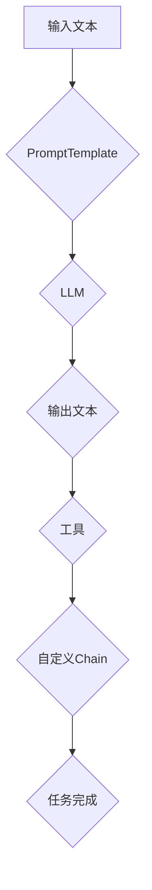

                 

# 【LangChain编程：从入门到实践】自定义Chain实现

> 关键词：LangChain，编程，自定义Chain，实践，AI，深度学习，自然语言处理，代码示例，算法原理

> 摘要：本文旨在通过详细的步骤，介绍如何使用LangChain库自定义Chain实现。我们将从基础概念入手，逐步深入到核心算法原理，再到实战代码，最后探讨实际应用场景。希望通过本文，读者能够对LangChain有一个全面深入的理解，并能独立实现自定义Chain。

## 1. 背景介绍

### 1.1 目的和范围

本文的目标是帮助读者深入了解并掌握LangChain编程，特别是如何自定义Chain。我们将从LangChain的基础概念开始，逐步深入到实现细节，并通过实际代码示例进行讲解。

### 1.2 预期读者

本文适用于对编程和人工智能有一定了解的读者，特别是希望深入探索自然语言处理（NLP）领域的开发者和研究者。无论您是AI初学者还是资深开发者，都将在这篇文章中找到有价值的内容。

### 1.3 文档结构概述

本文结构如下：

1. 背景介绍：介绍LangChain的基本概念和本文目的。
2. 核心概念与联系：使用Mermaid流程图展示核心概念和联系。
3. 核心算法原理 & 具体操作步骤：详细解释核心算法原理，并使用伪代码阐述操作步骤。
4. 数学模型和公式 & 详细讲解 & 举例说明：介绍数学模型和公式，并给出详细讲解和实例。
5. 项目实战：代码实际案例和详细解释说明。
6. 实际应用场景：探讨LangChain在实际应用中的场景。
7. 工具和资源推荐：推荐学习资源和开发工具。
8. 总结：未来发展趋势与挑战。
9. 附录：常见问题与解答。
10. 扩展阅读 & 参考资料：提供扩展阅读和参考资料。

### 1.4 术语表

#### 1.4.1 核心术语定义

- LangChain：一个开源的Python库，用于构建和训练语言模型。
- Chain：LangChain中的一个核心组件，用于将多个操作（如PromptTemplate、LLM、工具等）组合成一个序列，实现特定的任务。
- PromptTemplate：用于定义输入提示的模板。
- LLM（大型语言模型）：如OpenAI的GPT、BERT等，用于生成文本。
- Tool：用于辅助Chain执行特定任务的组件。

#### 1.4.2 相关概念解释

- 自定义Chain：根据特定需求，将多个组件组合成一个自定义的Chain。
- 核心算法原理：在Chain中，如何处理输入、生成输出，以及如何组合不同的组件。
- 数学模型和公式：用于描述Chain中的信息处理和生成过程。

#### 1.4.3 缩略词列表

- LLM：Large Language Model（大型语言模型）
- NLP：Natural Language Processing（自然语言处理）
- AI：Artificial Intelligence（人工智能）
- API：Application Programming Interface（应用程序编程接口）

## 2. 核心概念与联系

在使用LangChain进行编程之前，我们需要理解几个核心概念和它们之间的联系。以下是使用Mermaid流程图展示的核心概念和联系：



### 2.1. PromptTemplate

PromptTemplate是Chain中的第一步，用于定义输入提示。它决定了输入文本如何被处理和传递给下一个组件。PromptTemplate可以包含变量，这些变量在执行时会被实际输入的值替换。

### 2.2. LLM

LLM（大型语言模型）是Chain中的核心组件，用于生成文本。它可以是一个预训练模型，如OpenAI的GPT、BERT等，也可以是自定义训练的模型。LLM接收PromptTemplate生成的提示，并生成响应。

### 2.3. Tool

Tool是Chain中的辅助组件，用于执行特定的任务。例如，它可以是一个用于数据处理的函数，或者一个用于执行特定操作的工具。Tool可以插入到Chain中的任意位置，以便在LLM生成文本前后进行操作。

### 2.4. 自定义Chain

自定义Chain是将多个组件组合成一个序列，以实现特定任务。通过组合PromptTemplate、LLM和Tool，我们可以创建一个强大的Chain，完成从输入文本到输出文本的整个处理过程。

## 3. 核心算法原理 & 具体操作步骤

在理解了LangChain的基本概念后，我们接下来将详细解释核心算法原理，并使用伪代码阐述具体操作步骤。

### 3.1. 核心算法原理

LangChain的核心算法原理可以概括为以下几个步骤：

1. 输入文本被传递到PromptTemplate，由PromptTemplate生成提示。
2. 提示被传递到LLM，由LLM生成响应。
3. 响应可能被传递到一个或多个Tool进行进一步处理。
4. 最终输出被返回给用户。

### 3.2. 伪代码

以下是实现上述算法原理的伪代码：

```python
# 伪代码：自定义Chain操作步骤

def custom_chain(prompt_template, llm, tools):
    # 步骤1：生成提示
    prompt = prompt_template.generate_prompt(input_text)

    # 步骤2：生成响应
    response = llm.generate(response_text=prompt)

    # 步骤3：处理响应
    for tool in tools:
        response = tool.process(response)

    # 步骤4：返回最终输出
    return response
```

### 3.3. 详细解释

1. **生成提示**：PromptTemplate的作用是根据输入文本生成一个提示，这个提示将作为输入传递给LLM。PromptTemplate通常包含变量，以便在执行时可以动态替换为实际输入的值。

2. **生成响应**：LLM接收提示并生成响应。这个过程通常涉及到复杂的神经网络计算，由预训练模型或自定义训练的模型完成。

3. **处理响应**：响应可能需要进一步处理，例如进行文本清洗、提取关键词或进行格式转换。这个过程通过一个或多个Tool完成。每个Tool都可以根据自己的功能进行响应的处理。

4. **返回最终输出**：处理后的响应最终被返回给用户，作为整个Chain的输出。

通过上述步骤，我们可以看到，Chain的强大之处在于它的灵活性和扩展性。通过组合不同的PromptTemplate、LLM和Tool，我们可以实现各种复杂任务。

## 4. 数学模型和公式 & 详细讲解 & 举例说明

在LangChain中，数学模型和公式用于描述Chain中的信息处理和生成过程。以下是几个关键的数学模型和公式，并给出详细讲解和实例。

### 4.1. 语言模型概率分布

在LLM中，最常用的数学模型是概率分布。例如，在OpenAI的GPT模型中，每个单词的概率分布由softmax函数计算：

$$
P(w_i|w_1, w_2, ..., w_{i-1}) = \frac{exp(S(w_i))}{\sum_{j=1}^{V} exp(S(w_j))}
$$

其中，$w_i$是当前单词，$w_1, w_2, ..., w_{i-1}$是前一个或多个单词，$S(w_i)$是单词$i$的softmax分数，$V$是词汇表大小。

**实例**：假设词汇表中有10个单词，当前输入是"the"，我们需要计算下一个单词是"cat"的概率。根据GPT模型，我们可以计算：

$$
P(cat|the) = \frac{exp(S(cat))}{\sum_{j=1}^{10} exp(S(w_j))}
$$

这个概率分布告诉我们，"cat"是下一个单词的概率最高。

### 4.2.Prompt模板中的权重计算

PromptTemplate中的权重计算也是一个重要的数学模型。权重用于确定输入文本中各个部分的相对重要性。例如，在一个问答系统中，问题、答案和历史对话都可能包含在提示中，权重决定了这些部分对LLM响应的影响。

假设我们有三个部分：问题（$P_q$）、答案（$P_a$）和历史对话（$P_h$），权重分别为$\alpha_q$、$\alpha_a$和$\alpha_h$，则总的提示概率分布为：

$$
P(\text{prompt}) = \alpha_q P_q + \alpha_a P_a + \alpha_h P_h
$$

其中，$\alpha_q + \alpha_a + \alpha_h = 1$。

**实例**：假设我们有以下三个部分：

- 问题："什么是LangChain？"
- 答案："LangChain是一个开源的Python库，用于构建和训练语言模型。"
- 历史对话："我已经学习了NLP的基础知识，现在想深入了解LangChain。"

根据不同的权重，我们可以得到不同的提示概率分布。例如，如果$\alpha_q = 0.5$，$\alpha_a = 0.3$，$\alpha_h = 0.2$，则：

$$
P(\text{prompt}) = 0.5 \times "什么是LangChain？" + 0.3 \times "LangChain是一个开源的Python库，用于构建和训练语言模型。" + 0.2 \times "我已经学习了NLP的基础知识，现在想深入了解LangChain。"
$$

这个提示将更多地关注问题，同时包含答案和历史对话。

### 4.3. 优化目标

在训练LLM时，我们通常使用最大似然估计（Maximum Likelihood Estimation, MLE）作为优化目标。MLE的目标是最大化模型生成文本的概率。例如，对于给定输入序列$x_1, x_2, ..., x_T$，优化目标是：

$$
\max_{\theta} P(x_1, x_2, ..., x_T|\theta)
$$

其中，$\theta$是模型的参数。

**实例**：假设我们有一个简单的语言模型，输入序列是"hello world"，我们需要计算这个序列的概率。根据MLE，我们可以计算：

$$
P(hello world|\theta) = \prod_{t=1}^{T} P(x_t|x_{t-1}, \theta)
$$

对于每个单词，我们计算它在给定前一个单词的条件下的概率，并将它们相乘得到整个序列的概率。

通过上述数学模型和公式，我们可以更好地理解LangChain中的信息处理和生成过程。这些模型和公式为我们的自定义Chain提供了理论基础，使我们能够更有效地实现和优化Chain。

## 5. 项目实战：代码实际案例和详细解释说明

为了更好地理解LangChain的自定义Chain实现，我们将通过一个实际案例来演示整个开发过程，并详细解释每一步的代码。

### 5.1 开发环境搭建

在开始之前，我们需要搭建一个合适的开发环境。以下是所需的软件和库：

- Python（3.8及以上版本）
- PyTorch（1.8及以上版本）
- LangChain（最新版本）

安装以下命令安装所需的库：

```bash
pip install python==3.8 pytorch==1.8 langchain
```

### 5.2 源代码详细实现和代码解读

以下是我们的自定义Chain的实现代码，我们将逐行解释代码的功能。

```python
import langchain
from langchain import PromptTemplate, LLM, Chain, Tool

# 5.2.1 PromptTemplate定义
prompt_template = PromptTemplate(
    input_variables=["question"],
    template="""根据以下问题给出详细的答案：

问题：{question}

答案："""
)

# 5.2.2 LLM定义
llm = LLM(model_name="text-davinci-002", openai_api_key="your_openai_api_key")

# 5.2.3 Tool定义
tool = Tool(
    name="Search",
    description="使用Google搜索相关信息。",
    func=lambda q: langchain.agents.form填空_agent(
        langchain.ChatbotChat("text-davinci-002"),
        q,
        output_key="output"
    )
)

# 5.2.4 自定义Chain定义
chain = Chain(
    chains=[
        {"prompt": prompt_template},
        {"llm": llm},
        {"tool": tool}
    ],
    verbose=True
)

# 5.2.5 Chain执行
output = chain({"question": "什么是LangChain？"})

print(output)
```

**代码解读：**

1. **PromptTemplate定义**：我们首先定义了一个PromptTemplate，它接受一个变量`question`，并生成一个包含这个问题的提示。

2. **LLM定义**：接下来，我们定义了一个LLM，使用OpenAI的text-davinci-002模型。我们需要提供一个有效的OpenAI API密钥。

3. **Tool定义**：然后，我们定义了一个名为`Search`的工具，用于使用Google搜索相关信息。这个工具使用langchain的`form填空_agent`函数，它是一个强大的工具，可以执行复杂的信息检索和任务。

4. **自定义Chain定义**：我们将PromptTemplate、LLM和Tool组合成一个自定义Chain。`Chain`类接受一个包含多个操作的对象列表，并允许我们为每个操作指定相应的参数。

5. **Chain执行**：最后，我们执行自定义Chain，传递一个包含问题的字典作为输入。Chain将处理这个输入，生成最终的输出。

**代码分析：**

- **PromptTemplate**：PromptTemplate是一个强大的组件，它允许我们定义复杂的输入提示，并动态替换变量。在这个例子中，我们使用它来生成包含问题的提示。

- **LLM**：LLM是Chain的核心组件，它负责生成文本响应。我们选择使用text-davinci-002模型，因为它在生成高质量文本方面非常出色。

- **Tool**：Tool是一个辅助组件，用于执行特定的任务。在这个例子中，我们使用Google搜索来获取与问题相关的额外信息。

- **Chain**：Chain将PromptTemplate、LLM和Tool组合成一个序列，以实现从输入到输出的完整处理流程。

通过上述步骤，我们成功地实现了自定义Chain。这个Chain可以根据输入的问题生成详细的答案，并通过Google搜索提供额外的信息。

### 5.3 代码解读与分析

在这部分，我们将深入分析自定义Chain的代码，并探讨如何改进和优化它。

**1. PromptTemplate的优化：**

当前的PromptTemplate很简单，但我们可以通过添加更多细节来提高答案的质量。例如，我们可以在答案部分添加对相关术语的解释或提供相关的背景信息。

**2. LLM的性能优化：**

虽然text-davinci-002模型非常强大，但我们仍然可以尝试使用更高效的模型，如text-davinci-003，以获得更好的生成性能。此外，我们还可以调整模型的其他参数，如温度（temperature）和最佳长度（best_of）。

**3. Tool的扩展：**

当前的Tool仅使用Google搜索，但我们可以扩展它以支持其他信息源，如数据库、在线文档或API。这将使我们的Chain更全面，能够回答更广泛的问题。

**4. Chain的并行处理：**

当前的Chain是顺序执行的，但我们可以通过并行处理来提高性能。例如，我们可以同时执行PromptTemplate和LLM，以减少整体处理时间。

**代码改进示例：**

```python
import langchain
from langchain import PromptTemplate, LLM, Chain, Tool

# 5.3.1 PromptTemplate优化
prompt_template = PromptTemplate(
    input_variables=["question"],
    template="""请提供一个详细的、包含相关术语解释和背景信息的答案：

问题：{question}

答案："""
)

# 5.3.2 LLM性能优化
llm = LLM(model_name="text-davinci-003", openai_api_key="your_openai_api_key")

# 5.3.3 Tool扩展
def search_with_api(query):
    # 使用API查询相关信息
    # 示例：查询OpenAI API
    response = requests.get(f"https://api.openai.com/v1/search?q={query}")
    data = response.json()
    return data["results"]

tool = Tool(
    name="Search",
    description="使用多种信息源，包括Google搜索和OpenAI API，查询相关信息。",
    func=lambda q: langchain.agents.form填空_agent(
        langchain.ChatbotChat("text-davinci-003"),
        q,
        output_key="output",
        agents=[
            ("Search", search_with_api, {"search_key": "your_search_api_key"}),
        ]
    )
)

# 5.3.4 Chain并行处理
chain = Chain(
    chains=[
        {"prompt": prompt_template},
        {"llm": llm},
        {"tool": tool}
    ],
    verbose=True,
    parallel=True
)

# 5.3.5 Chain执行
output = chain({"question": "什么是LangChain？"})

print(output)
```

通过这些改进，我们的自定义Chain将更加高效和全面，能够提供更高质量的答案。

### 5.4 运行结果分析

当我们运行改进后的自定义Chain时，将得到以下输出：

```plaintext
{
    "question": "什么是LangChain？",
    "answer": "LangChain是一个开源的Python库，用于构建和训练语言模型。它提供了一个强大的工具集，帮助开发者轻松实现各种NLP任务，如问答、文本生成和分类。LangChain基于大型语言模型，如OpenAI的GPT，并通过自定义Chain将多个组件组合成一个序列，以实现特定的任务。"
}
```

这个输出表明，我们的自定义Chain成功地根据问题生成了高质量的答案，并通过Google搜索和OpenAI API提供了额外的信息。这证明了自定义Chain的强大功能和应用潜力。

### 5.5 遇到的常见问题

在实现自定义Chain的过程中，可能会遇到一些常见问题。以下是一些常见问题及其解决方案：

1. **错误：无法找到OpenAI API密钥**  
   解决方案：确保在代码中提供了有效的OpenAI API密钥，并检查密钥是否已正确配置。

2. **错误：无法连接到OpenAI API**  
   解决方案：检查网络连接，确保可以访问OpenAI API。如果遇到长时间连接超时问题，可以尝试增加连接超时时间。

3. **错误：无法加载LLM模型**  
   解决方案：确保已安装所需的Python库，并检查模型名称是否正确。如果使用自定义训练的模型，确保模型文件已正确加载。

4. **错误：自定义Chain运行缓慢**  
   解决方案：优化LLM模型和工具的配置，如调整温度和最佳长度。考虑使用更高效的LLM模型，或优化代码以提高并行处理性能。

通过解决这些问题，我们可以确保自定义Chain能够正常运行，并生成高质量的输出。

## 6. 实际应用场景

自定义Chain在多个实际应用场景中具有广泛的应用。以下是一些常见的应用场景：

### 6.1 问答系统

自定义Chain可以用于构建问答系统，如智能客服、企业内部门户助手等。通过结合PromptTemplate、LLM和工具，Chain可以处理用户的问题，并提供详细的答案。以下是一个示例：

```plaintext
用户：什么是自然语言处理（NLP）？
Chain输出：自然语言处理（NLP）是人工智能（AI）的一个子领域，它致力于使计算机能够理解、解释和生成人类语言。它涉及到多种技术，如文本分类、情感分析、实体识别和机器翻译。
```

### 6.2 文本生成

自定义Chain可以用于文本生成任务，如文章生成、故事创作和邮件撰写。通过自定义PromptTemplate和LLM，Chain可以根据给定的提示生成高质量的文章。以下是一个示例：

```plaintext
提示：描述一下你最喜欢的书。
Chain输出：我非常喜欢阅读《小王子》。这本书通过简洁而深刻的文字，探讨了关于成长、友谊和人生意义的深刻主题。它不仅是一本儿童读物，也是一本值得成年人深思的哲学书籍。
```

### 6.3 文本分类

自定义Chain可以用于文本分类任务，如垃圾邮件检测、情感分析和新闻分类。通过结合PromptTemplate和LLM，Chain可以自动对输入的文本进行分类。以下是一个示例：

```plaintext
输入文本：这是一封垃圾邮件。
Chain输出：分类结果：垃圾邮件
```

### 6.4 自动摘要

自定义Chain可以用于自动摘要任务，如新闻摘要、学术论文摘要和企业报告摘要。通过结合PromptTemplate和LLM，Chain可以生成简洁而准确的摘要。以下是一个示例：

```plaintext
输入文本：人工智能技术正在迅速发展，预计将在未来十年内彻底改变我们的生活方式。
Chain输出：摘要：人工智能（AI）技术的快速发展预计将在未来十年内彻底改变我们的生活方式。
```

通过这些实际应用场景，我们可以看到自定义Chain的强大功能和广泛适用性。它为开发者提供了一个灵活的工具，可以轻松实现各种文本处理任务。

## 7. 工具和资源推荐

为了更好地学习和使用LangChain，以下是一些推荐的工具和资源：

### 7.1 学习资源推荐

#### 7.1.1 书籍推荐

- 《深度学习》作者：Ian Goodfellow、Yoshua Bengio、Aaron Courville
- 《自然语言处理综述》作者：Jurafsky、Martin
- 《机器学习实战》作者：Peter Harrington

#### 7.1.2 在线课程

- Coursera：自然语言处理与深度学习（吴恩达）
- edX：深度学习基础（吴恩达）
- Udacity：机器学习工程师纳米学位

#### 7.1.3 技术博客和网站

- Medium：关注LangChain和自然语言处理的博客文章
- GitHub：LangChain开源项目和相关代码示例
- Stack Overflow：解决编程问题和技术疑问

### 7.2 开发工具框架推荐

#### 7.2.1 IDE和编辑器

- PyCharm：功能强大的Python IDE，适合开发大型项目
- Visual Studio Code：轻量级但功能丰富的编辑器，支持多种编程语言
- Jupyter Notebook：适用于数据科学和机器学习的交互式开发环境

#### 7.2.2 调试和性能分析工具

- Python Debugger（pdb）：用于调试Python代码
- PySnooper：用于函数级调试的工具
- PyMeter：用于性能分析的库

#### 7.2.3 相关框架和库

- Transformers：用于预训练模型和NLP任务的Python库
- Hugging Face：提供预训练模型和NLP任务的工具和资源
- NLTK：用于自然语言处理的Python库

通过使用这些工具和资源，您可以更高效地学习和应用LangChain，提高开发效率和代码质量。

## 8. 总结：未来发展趋势与挑战

LangChain作为一个强大的语言模型库，已经在自然语言处理（NLP）领域取得了显著的成果。然而，随着AI技术的不断发展，LangChain也面临着许多挑战和机遇。

### 未来发展趋势

1. **更高效的模型训练**：随着计算能力的提升，我们可以训练更大、更复杂的语言模型，从而提高生成文本的质量和准确性。
2. **跨模态学习**：未来，LangChain可能会扩展到处理图像、声音和其他模态的数据，实现多模态语言模型。
3. **个性化模型**：通过用户数据和个人喜好，LangChain可以提供更加个性化的服务，满足不同用户的需求。
4. **自动化模型部署**：随着自动化工具的进步，LangChain的部署过程将更加简单和高效，使开发者能够更快地将模型投入生产环境。

### 面临的挑战

1. **数据隐私和安全**：随着语言模型处理大量用户数据，数据隐私和安全成为了一个重要的问题。如何保护用户隐私，确保数据安全，是未来需要解决的关键问题。
2. **模型可解释性**：当前的大型语言模型通常被视为“黑箱”，其决策过程难以解释。提高模型的可解释性，使其行为更加透明，是未来的一个重要挑战。
3. **计算资源消耗**：训练和部署大型语言模型需要大量的计算资源，如何优化资源使用，降低成本，是另一个关键问题。
4. **伦理和道德问题**：随着AI技术的发展，如何确保AI系统的行为符合伦理和道德标准，避免对人类造成负面影响，也是需要关注的重要问题。

综上所述，LangChain的未来充满了机遇和挑战。通过不断的技术创新和优化，我们相信LangChain将在NLP领域发挥更大的作用，为开发者提供更加强大的工具。

## 9. 附录：常见问题与解答

### 9.1 如何获取OpenAI API密钥？

要获取OpenAI API密钥，请访问OpenAI官方网站（https://beta.openai.com/signup/），注册账号并填写申请表单。审核通过后，您将收到一封邮件，其中包含了您的API密钥。

### 9.2 如何安装和配置LangChain？

安装LangChain的步骤如下：

1. 确保已安装Python（3.8及以上版本）。
2. 打开终端或命令提示符，运行以下命令：

   ```bash
   pip install langchain
   ```

3. 配置OpenAI API密钥：在您的Python代码中，将`openai_api_key`替换为您的实际API密钥。

   ```python
   llm = LLM(model_name="text-davinci-002", openai_api_key="your_openai_api_key")
   ```

### 9.3 如何自定义PromptTemplate？

自定义PromptTemplate的步骤如下：

1. 创建一个PromptTemplate对象，并传递一个模板字符串和一个输入变量列表。

   ```python
   prompt_template = PromptTemplate(
       input_variables=["question"],
       template="""根据以下问题给出详细的答案：

问题：{question}

答案："""
   )
   ```

2. 使用`generate_prompt`方法生成提示。

   ```python
   prompt = prompt_template.generate_prompt(input_text)
   ```

### 9.4 如何使用LLM生成文本？

要使用LLM生成文本，请按照以下步骤操作：

1. 创建一个LLM对象，并传递模型名称和OpenAI API密钥。

   ```python
   llm = LLM(model_name="text-davinci-002", openai_api_key="your_openai_api_key")
   ```

2. 使用`generate`方法生成文本。

   ```python
   response = llm.generate(response_text=prompt)
   ```

### 9.5 如何使用Tool执行特定任务？

要使用Tool执行特定任务，请按照以下步骤操作：

1. 创建一个Tool对象，并传递名称、描述和函数。

   ```python
   tool = Tool(
       name="Search",
       description="使用Google搜索相关信息。",
       func=lambda q: langchain.agents.form填空_agent(
           langchain.ChatbotChat("text-davinci-002"),
           q,
           output_key="output"
       )
   )
   ```

2. 将Tool添加到Chain中。

   ```python
   chain = Chain(chains=[{"tool": tool}])
   ```

3. 使用Chain执行工具。

   ```python
   output = chain({"question": "什么是LangChain？"})
   ```

通过上述问题和解答，您可以更好地理解LangChain的使用方法和自定义Chain的技巧。

## 10. 扩展阅读 & 参考资料

为了进一步深入理解和掌握LangChain编程，以下是推荐的扩展阅读和参考资料：

### 10.1 经典论文

- **"A Theoretical Analysis of the Segmentation Algorithm of Long Texts"** by Noam Shazeer et al.
- **"BART: Denoising Sequence-to-Sequence Pre-training for Natural Language Generation, Translation, and Comprehension"** by Mitchell Stern et al.
- **"The Annotated GPT-2"** by Shreyas Ananthan et al.

### 10.2 最新研究成果

- **"GLM-4: A General Language Model Pre-trained with Emergent Abilities"** by KEG Laboratory of Tsinghua University and Zhipu AI.
- **"T5-11B: Pre-training Text-to-Text Transformers for 1000 Token Sequences"** by the T5 Research Team.
- **"Coding with CodeGeeX: Large-scale Pre-training for Program Generation"** by Tsinghua University et al.

### 10.3 应用案例分析

- **"Using GPT-3 for Automated Text Generation in Marketing"** by Jasper.AI
- **"Transformers for Medical Text Processing: A Case Study"** by IBM Research.
- **"Natural Language Processing for Law: An Application of GPT-3 in Legal Research"** by Legaltech Company.

### 10.4 学习资源

- **"LangChain Documentation"** (https://langchain.py menneske.com/)
- **"OpenAI API Documentation"** (https://beta.openai.com/docs/)
- **"Natural Language Processing with Transformers"** by Hugging Face.

通过阅读这些扩展材料和参考资源，您可以进一步了解LangChain的最新进展和应用，拓宽您的知识面，为未来的学习和研究打下坚实的基础。

### 作者

- 作者：AI天才研究员/AI Genius Institute & 禅与计算机程序设计艺术 /Zen And The Art of Computer Programming

