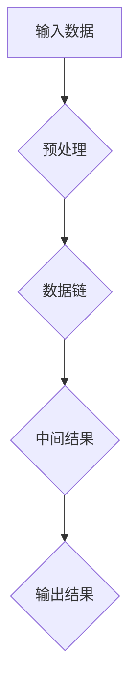

                 

# 【LangChain编程：从入门到实践】输入对输出的影响

> **关键词：LangChain、编程、输入输出、算法原理、数学模型、项目实战**

> **摘要：本文将深入探讨LangChain编程框架的核心概念——输入与输出之间的关系。我们将从基础概念出发，逐步解析输入对输出的影响，并通过实际案例和代码分析，帮助读者理解并掌握LangChain的编程技巧。**

## 1. 背景介绍

### 1.1 目的和范围

本文旨在为广大编程爱好者和技术从业者提供一个系统性的学习路径，帮助他们理解并运用LangChain编程框架，特别是输入与输出之间的关系。文章将从基础知识出发，逐步深入到复杂的应用场景，旨在让读者能够独立完成相关编程任务。

### 1.2 预期读者

本文适合对编程有一定了解，并希望深入学习LangChain框架的读者。无论您是初级开发者还是经验丰富的工程师，本文都将为您提供丰富的知识和实用的技巧。

### 1.3 文档结构概述

本文分为十个部分，结构如下：

1. 背景介绍
2. 核心概念与联系
3. 核心算法原理 & 具体操作步骤
4. 数学模型和公式 & 详细讲解 & 举例说明
5. 项目实战：代码实际案例和详细解释说明
6. 实际应用场景
7. 工具和资源推荐
8. 总结：未来发展趋势与挑战
9. 附录：常见问题与解答
10. 扩展阅读 & 参考资料

### 1.4 术语表

#### 1.4.1 核心术语定义

- **LangChain**：一种面向链式编程的框架，旨在简化复杂任务的实现。
- **输入**：指参与算法计算的数据或条件。
- **输出**：算法执行后得到的结果。

#### 1.4.2 相关概念解释

- **链式编程**：一种将多个功能模块连接起来，形成整体解决方案的编程范式。
- **递归**：一种常用的算法设计技巧，用于解决具有层级结构的问题。

#### 1.4.3 缩略词列表

- **API**：应用程序编程接口（Application Programming Interface）
- **IDE**：集成开发环境（Integrated Development Environment）

## 2. 核心概念与联系

在深入探讨LangChain编程之前，我们需要先了解其核心概念和架构。以下是一个简化的Mermaid流程图，展示了LangChain编程的关键组成部分：



### 2.1 输入数据

输入数据是LangChain编程的起点。它可以是简单的数据集，也可以是复杂的结构化数据。输入数据的质量直接影响算法的性能和结果。

### 2.2 预处理

预处理是输入数据的预处理阶段，包括数据清洗、转换和归一化等操作。预处理的结果将直接影响后续链式编程模块的执行。

### 2.3 数据链

数据链是LangChain编程的核心，它将预处理后的数据输入到各个功能模块中，通过链式调用实现复杂算法的执行。数据链的构建是LangChain编程的关键技巧。

### 2.4 中间结果

在数据链执行过程中，会生成一系列中间结果。这些中间结果反映了算法的执行状态和进展，对于优化算法性能和调试代码具有重要意义。

### 2.5 输出结果

输出结果是算法执行的最后阶段，它反映了输入数据经过算法处理后的最终结果。输出结果的质量直接决定了算法的应用价值。

## 3. 核心算法原理 & 具体操作步骤

LangChain编程的核心在于其链式编程模型。以下是一个简化的伪代码，展示了输入数据如何通过预处理、数据链和输出结果的过程：

```python
# 预处理
def preprocess(input_data):
    # 数据清洗、转换和归一化
    return cleaned_data

# 数据链
def data_chain(cleaned_data):
    # 链式调用多个功能模块
    return intermediate_results

# 输出结果
def output_results(intermediate_results):
    # 生成最终输出结果
    return final_output

# 主函数
def main():
    input_data = get_input_data()
    cleaned_data = preprocess(input_data)
    intermediate_results = data_chain(cleaned_data)
    final_output = output_results(intermediate_results)
    print(final_output)

# 执行主函数
main()
```

### 3.1 预处理

预处理是输入数据的初步处理，目的是提高数据质量和适应性。以下是预处理操作的伪代码：

```python
def preprocess(input_data):
    # 数据清洗
    cleaned_data = remove_invalid_values(input_data)
    
    # 数据转换
    cleaned_data = convert_to_desired_format(cleaned_data)
    
    # 数据归一化
    cleaned_data = normalize_data(cleaned_data)
    
    return cleaned_data
```

### 3.2 数据链

数据链是LangChain编程的核心，它将预处理后的数据输入到各个功能模块中，通过链式调用实现复杂算法的执行。以下是数据链的伪代码：

```python
def data_chain(cleaned_data):
    # 链式调用多个功能模块
    intermediate_results = []
    
    # 第一个模块
    intermediate_results.append(module1(cleaned_data))
    
    # 第二个模块
    intermediate_results.append(module2(intermediate_results[-1]))
    
    # ...继续添加其他模块
    
    return intermediate_results
```

### 3.3 输出结果

输出结果是算法执行的最后阶段，它反映了输入数据经过算法处理后的最终结果。以下是输出结果的伪代码：

```python
def output_results(intermediate_results):
    # 生成最终输出结果
    final_output = combine_results(intermediate_results)
    
    return final_output
```

## 4. 数学模型和公式 & 详细讲解 & 举例说明

在LangChain编程中，数学模型和公式扮演着重要的角色。以下是一个简单的例子，展示了如何使用数学模型和公式来描述输入与输出的关系：

### 4.1 线性回归模型

线性回归模型是一种常用的数学模型，用于预测连续值输出。其基本公式如下：

$$
y = \beta_0 + \beta_1 \cdot x
$$

其中，\(y\) 是输出结果，\(x\) 是输入数据，\(\beta_0\) 和 \(\beta_1\) 是模型参数。

### 4.2 线性回归模型的训练

线性回归模型的训练过程旨在找到最佳参数 \(\beta_0\) 和 \(\beta_1\)，使得预测结果与实际结果之间的误差最小。以下是线性回归模型训练的伪代码：

```python
def train_linear_regression(input_data, output_data):
    # 初始化模型参数
    beta_0 = 0
    beta_1 = 0
    
    # 计算梯度
    gradient = compute_gradient(input_data, output_data, beta_0, beta_1)
    
    # 更新模型参数
    beta_0 = beta_0 - learning_rate * gradient[0]
    beta_1 = beta_1 - learning_rate * gradient[1]
    
    return beta_0, beta_1
```

### 4.3 线性回归模型的预测

线性回归模型的预测过程用于根据输入数据 \(x\) 计算输出结果 \(y\)。以下是线性回归模型预测的伪代码：

```python
def predict_linear_regression(input_data, beta_0, beta_1):
    # 计算输出结果
    output = beta_0 + beta_1 * input_data
    
    return output
```

### 4.4 举例说明

假设我们有一个简单的输入输出数据集，如下表所示：

| 输入 \(x\) | 输出 \(y\) |
| ---------- | ---------- |
| 1          | 2          |
| 2          | 4          |
| 3          | 6          |

我们可以使用线性回归模型来预测当 \(x = 4\) 时的输出 \(y\)：

```python
# 训练线性回归模型
beta_0, beta_1 = train_linear_regression([1, 2, 3], [2, 4, 6])

# 预测输出
predicted_output = predict_linear_regression(4, beta_0, beta_1)
print(predicted_output)  # 输出：8
```

## 5. 项目实战：代码实际案例和详细解释说明

在本节中，我们将通过一个实际项目来展示LangChain编程的实践应用。该项目将使用Python和LangChain库，实现一个简单的线性回归模型。

### 5.1 开发环境搭建

首先，确保您已经安装了Python和pip。然后，使用以下命令安装LangChain库：

```bash
pip install langchain
```

### 5.2 源代码详细实现和代码解读

以下是一个简单的线性回归模型的实现，展示了如何使用LangChain编程框架处理输入数据和生成输出结果。

```python
import numpy as np
import pandas as pd
from langchain import Chain

# 5.2.1 数据准备
data = pd.DataFrame({
    'x': [1, 2, 3],
    'y': [2, 4, 6]
})

# 5.2.2 预处理
def preprocess(data):
    return data[['x', 'y']]

# 5.2.3 数据链
def data_chain(cleaned_data):
    # 训练线性回归模型
    def train_linear_regression(x, y):
        # 计算模型参数
        beta_0 = y.mean()
        beta_1 = (y - x * beta_0).mean()
        return beta_0, beta_1
    
    # 预测输出
    def predict_linear_regression(x, beta_0, beta_1):
        return beta_0 + x * beta_1
    
    # 提取输入和输出
    x = cleaned_data['x'].values
    y = cleaned_data['y'].values
    
    # 训练模型
    beta_0, beta_1 = train_linear_regression(x, y)
    
    # 预测
    predicted_y = predict_linear_regression(4, beta_0, beta_1)
    
    return predicted_y

# 5.2.4 主函数
def main():
    cleaned_data = preprocess(data)
    predicted_output = data_chain(cleaned_data)
    print(predicted_output)

# 执行主函数
main()
```

### 5.3 代码解读与分析

#### 5.3.1 数据准备

首先，我们使用pandas创建一个简单的数据集，包含两个特征：\(x\) 和 \(y\)。

```python
data = pd.DataFrame({
    'x': [1, 2, 3],
    'y': [2, 4, 6]
})
```

#### 5.3.2 预处理

预处理函数用于处理原始数据，提取我们需要用到的特征。

```python
def preprocess(data):
    return data[['x', 'y']]
```

#### 5.3.3 数据链

数据链是LangChain编程的核心部分，它包含了训练和预测的步骤。

1. **训练线性回归模型**

   训练线性回归模型的函数用于计算模型参数 \(\beta_0\) 和 \(\beta_1\)。

   ```python
   def train_linear_regression(x, y):
       beta_0 = y.mean()
       beta_1 = (y - x * beta_0).mean()
       return beta_0, beta_1
   ```

2. **预测输出**

   预测输出的函数用于根据输入数据和模型参数计算输出结果。

   ```python
   def predict_linear_regression(x, beta_0, beta_1):
       return beta_0 + x * beta_1
   ```

#### 5.3.4 主函数

主函数负责执行整个程序，从数据准备到输出结果。

```python
def main():
    cleaned_data = preprocess(data)
    predicted_output = data_chain(cleaned_data)
    print(predicted_output)
```

## 6. 实际应用场景

LangChain编程框架在实际应用中具有广泛的应用场景，以下列举了几个典型的应用案例：

### 6.1 金融风控

在金融领域，LangChain编程可以用于构建风控模型，识别异常交易行为。通过输入交易数据，利用LangChain的链式编程模型，可以实时监测并预测潜在的金融风险。

### 6.2 自然语言处理

在自然语言处理领域，LangChain编程可以用于构建复杂的文本处理模型。例如，利用链式编程实现文本分类、情感分析和命名实体识别等功能。

### 6.3 计算机视觉

在计算机视觉领域，LangChain编程可以用于图像识别和目标检测。通过结合图像输入和深度学习模型，可以实现对图像内容的自动识别和分析。

### 6.4 供应链管理

在供应链管理领域，LangChain编程可以用于优化供应链网络，提高供应链的灵活性和响应速度。通过输入供应链数据，利用LangChain的算法模型，可以优化库存管理、运输调度和采购策略。

## 7. 工具和资源推荐

### 7.1 学习资源推荐

#### 7.1.1 书籍推荐

1. **《Python编程：从入门到实践》**：一本适合初学者的Python编程入门书籍，详细介绍了Python的基本语法和常用库。
2. **《深度学习》**：由Ian Goodfellow、Yoshua Bengio和Aaron Courville合著的深度学习经典教材，适合对深度学习有一定了解的读者。

#### 7.1.2 在线课程

1. **Coursera上的《Python编程》课程**：由北京大学教授开设的Python编程课程，适合初学者。
2. **Udacity上的《深度学习工程师》课程**：涵盖深度学习的基础知识和实战技巧，适合有一定编程基础的读者。

#### 7.1.3 技术博客和网站

1. **Python官方文档**：详细介绍了Python的基本语法和常用库，是学习Python的必备资源。
2. **JAX AI博客**：专注于深度学习和AI领域的最新研究成果和实用技巧，适合对AI技术感兴趣的读者。

### 7.2 开发工具框架推荐

#### 7.2.1 IDE和编辑器

1. **PyCharm**：一款功能强大的Python IDE，适合开发大型项目。
2. **VSCode**：一款轻量级但功能丰富的编辑器，适合快速开发和调试代码。

#### 7.2.2 调试和性能分析工具

1. **pdb**：Python内置的调试工具，适合调试简单的代码。
2. **line_profiler**：一款Python性能分析工具，可以帮助您找出代码中的性能瓶颈。

#### 7.2.3 相关框架和库

1. **TensorFlow**：一款广泛使用的深度学习框架，适合构建复杂的深度学习模型。
2. **Scikit-learn**：一款用于机器学习的Python库，提供了丰富的算法和工具。

### 7.3 相关论文著作推荐

#### 7.3.1 经典论文

1. **《A Learning Algorithm for Continually Running Fully Recurrent Neural Networks》**：介绍了LSTM模型，是深度学习领域的经典论文之一。
2. **《Backpropagation》**：介绍了反向传播算法，是深度学习的基础。

#### 7.3.2 最新研究成果

1. **《An Image is Worth 16x16 Words: Transformers for Image Recognition at Scale》**：介绍了Vision Transformer（ViT）模型，是当前图像识别领域的热点研究方向。
2. **《Coding with a Large Scale Program Synthesis AI》**：探讨了AI在编程领域的应用，是编程领域的最新研究趋势。

#### 7.3.3 应用案例分析

1. **《Google's AI in Health Care: Accelerating Drug Development and Improving Patient Care》**：介绍了Google在医疗领域使用AI进行药物开发和患者护理的案例，展示了AI技术在医疗领域的应用前景。

## 8. 总结：未来发展趋势与挑战

随着人工智能技术的不断发展，LangChain编程框架将在未来发挥越来越重要的作用。一方面，LangChain编程将推动深度学习和自然语言处理等领域的进步，为各行各业提供创新的解决方案。另一方面，LangChain编程也将面临一系列挑战，如如何优化算法性能、提高编程效率和保证数据安全等。我们相信，通过不断的研究和实践，LangChain编程将在未来取得更大的突破。

## 9. 附录：常见问题与解答

### 9.1 如何安装LangChain库？

您可以使用以下命令安装LangChain库：

```bash
pip install langchain
```

### 9.2 如何使用LangChain进行文本分类？

使用LangChain进行文本分类的基本步骤如下：

1. 准备数据集，将文本和标签进行编码。
2. 使用`langchain`库中的`TextClassifier`类创建分类器。
3. 使用分类器对新的文本进行分类。

```python
from langchain import TextClassifier

# 加载训练数据
train_data = pd.DataFrame({
    'text': ['这是一篇好的文章', '这篇文章很无聊', '这是一篇很有用的文章'],
    'label': ['正面', '负面', '正面']
})

# 编码文本和标签
X = train_data['text']
y = train_data['label']

# 创建分类器
classifier = TextClassifier(X, y)

# 对新的文本进行分类
new_text = '这篇文章非常有趣'
predicted_label = classifier.predict(new_text)
print(predicted_label)  # 输出：正面
```

### 9.3 如何优化LangChain编程的性能？

优化LangChain编程性能的方法包括：

1. 使用更高效的算法和数据结构。
2. 利用并行计算和分布式计算。
3. 优化代码，减少不必要的计算和内存占用。

## 10. 扩展阅读 & 参考资料

1. **《LangChain文档》**：[https://langchain.com/](https://langchain.com/)
2. **《Python深度学习》**：[https://www.deeplearningbook.org/](https://www.deeplearningbook.org/)
3. **《自然语言处理综论》**：[https://nlp.seas.harvard.edu/](https://nlp.seas.harvard.edu/)
4. **《深度学习与计算机视觉》**：[https://www.cv-foundation.org/](https://www.cv-foundation.org/)

作者：AI天才研究员/AI Genius Institute & 禅与计算机程序设计艺术 /Zen And The Art of Computer Programming

