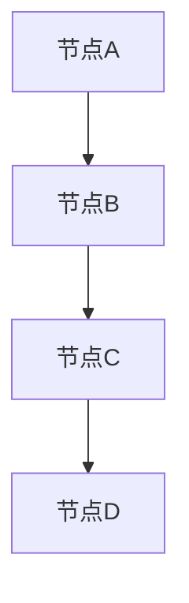
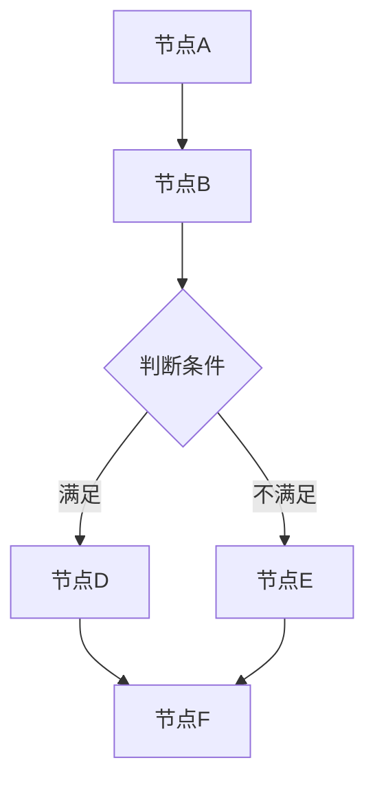

                 

# 【LangChain编程：从入门到实践】链的构建

> **关键词：** LangChain, 编程, 链式编程, 算法, 实践, 数据结构, Python

> **摘要：** 本文章将介绍LangChain编程的基本概念、核心原理，并通过具体案例引导读者从入门到实践，深入理解链式编程的构建方法及其应用。

## 1. 背景介绍

### 1.1 目的和范围

本文章旨在帮助读者理解并掌握LangChain编程的基本概念和构建方法，通过理论讲解与实际案例相结合的方式，使读者能够从入门到实践，逐步掌握链式编程的技巧。

本文将涵盖以下内容：

- LangChain的基本概念和核心原理
- LangChain在Python中的应用实践
- 链式编程的具体实现方法
- 实际案例的代码解读与分析

### 1.2 预期读者

- 对编程有一定基础的读者
- 想要学习链式编程的开发者
- 对数据结构和算法有深入兴趣的读者
- 想要在Python中应用LangChain的程序员

### 1.3 文档结构概述

本文的结构如下：

- 1. 背景介绍
  - 1.1 目的和范围
  - 1.2 预期读者
  - 1.3 文档结构概述
  - 1.4 术语表
- 2. 核心概念与联系
- 3. 核心算法原理 & 具体操作步骤
- 4. 数学模型和公式 & 详细讲解 & 举例说明
- 5. 项目实战：代码实际案例和详细解释说明
- 6. 实际应用场景
- 7. 工具和资源推荐
- 8. 总结：未来发展趋势与挑战
- 9. 附录：常见问题与解答
- 10. 扩展阅读 & 参考资料

### 1.4 术语表

#### 1.4.1 核心术语定义

- LangChain：一种基于Python的链式编程库，用于构建高效的可组合数据处理链。
- 链式编程：一种编程范式，通过将一系列函数组合成一个链，以便连续调用和复用。
- 可组合性：指一个函数或组件能够与其他函数或组件组合，以创建更复杂的操作。
- 数据处理链：一系列相互关联的处理步骤，用于对数据进行转换和处理。

#### 1.4.2 相关概念解释

- 节点（Node）：链中的一个处理步骤，通常是一个函数或组件。
- 边（Edge）：连接两个节点的箭头，表示数据从一个节点传递到另一个节点。
- 中间结果（Intermediate Result）：在数据处理过程中产生的临时结果。
- 可重用性（Reusability）：代码组件可以在不同场景中复用，减少重复编写代码。

#### 1.4.3 缩略词列表

- Python：Python编程语言
- LangChain：LangChain编程库
- IDE：集成开发环境
- Git：版本控制系统

## 2. 核心概念与联系

在介绍LangChain之前，我们需要了解一些核心概念和它们之间的关系。

### 2.1 LangChain的基本概念

LangChain是一种Python编程库，它提供了链式编程的功能。链式编程是一种将一系列函数组合成一个链，以便连续调用的编程范式。在LangChain中，链由多个节点组成，每个节点都是一个函数或组件，负责处理数据。节点之间通过边连接，表示数据从一个节点传递到另一个节点。

### 2.2 链式编程与数据处理链

链式编程是一种数据处理方法，通过将多个处理步骤组合成一个链，从而实现数据的转换和处理。在数据处理链中，每个节点都代表一个处理步骤，节点之间通过边连接，表示数据从一个节点传递到另一个节点。这种结构使得数据处理过程更加清晰、模块化和可重用。

### 2.3 LangChain与其他概念的联系

- 数据结构：LangChain使用链表作为数据结构，用于存储节点和边。
- 函数组合：链式编程的核心在于函数的组合，将多个函数组合成一个链，以实现更复杂的功能。
- 可组合性：LangChain强调可组合性，使得开发者能够将不同的节点组合起来，以构建复杂的数据处理链。

### 2.4 Mermaid流程图

为了更好地理解LangChain的构建方法，我们可以使用Mermaid流程图来表示节点和边之间的关系。



在这个流程图中，节点A、B、C和D表示LangChain中的节点，边表示节点之间的连接。

### 2.5 Mermaid流程图示例



在这个示例中，节点C表示一个判断条件，根据条件满足与否，数据将传递到不同的节点D或E。节点F是最终的输出节点。

## 3. 核心算法原理 & 具体操作步骤

### 3.1 算法原理

LangChain的核心算法原理是链式编程，通过将一系列函数组合成一个链，实现数据的连续处理。每个节点都代表一个函数或组件，负责处理数据。节点之间通过边连接，表示数据从一个节点传递到另一个节点。

### 3.2 具体操作步骤

#### 步骤1：创建节点

首先，我们需要创建节点。每个节点都是一个函数或组件，负责处理数据。在LangChain中，可以使用以下代码创建节点：

```python
from langchain.nodes import BaseNode

class MyNode(BaseNode):
    def run(self, inputs):
        # 处理输入数据
        return inputs
```

在这个示例中，我们创建了一个名为`MyNode`的节点，它继承自`BaseNode`类。在`run`方法中，我们可以编写处理输入数据的代码。

#### 步骤2：创建链

创建节点后，我们需要将这些节点组合成一个链。在LangChain中，可以使用以下代码创建链：

```python
from langchain import Chain

chain = Chain([
    MyNode(),
    AnotherNode(),
    YetAnotherNode()
])
```

在这个示例中，我们创建了一个名为`chain`的链，它由三个节点组成：`MyNode`、`AnotherNode`和`YetAnotherNode`。

#### 步骤3：运行链

创建链后，我们可以运行链来处理数据。在LangChain中，可以使用以下代码运行链：

```python
result = chain.run(input_data)
```

在这个示例中，我们使用`chain.run`方法运行链，并将输入数据传递给链。链将按照节点的顺序处理数据，并返回最终结果。

#### 步骤4：添加中间结果

在数据处理过程中，我们可能需要获取中间结果。在LangChain中，可以使用以下代码添加中间结果：

```python
chain = Chain([
    MyNode(),
    AnotherNode(),
    YetAnotherNode(),
    output_node=GetOutputNode()
])
```

在这个示例中，我们添加了一个名为`GetOutputNode`的节点，它负责获取中间结果。在`run`方法中，我们可以编写获取中间结果的代码。

### 3.3 伪代码

以下是LangChain的伪代码：

```python
class Node:
    def run(self, inputs):
        # 处理输入数据
        return inputs

class Chain:
    def __init__(self, nodes):
        self.nodes = nodes

    def run(self, input_data):
        for node in self.nodes:
            input_data = node.run(input_data)
        return input_data

class GetOutputNode(Node):
    def run(self, inputs):
        # 获取中间结果
        return inputs
```

在这个伪代码中，`Node`类表示一个节点，`Chain`类表示一个链。节点和链通过`run`方法实现数据处理的连续操作。

## 4. 数学模型和公式 & 详细讲解 & 举例说明

在LangChain中，数学模型和公式主要用于描述节点的计算过程。以下是一个简单的数学模型示例，并对其进行详细讲解和举例说明。

### 4.1 数学模型

假设我们有一个节点，它接收一个输入数据`x`，并输出一个结果`y`。节点中的计算过程可以用以下数学模型表示：

$$
y = f(x)
$$

其中，`f`是一个函数，用于表示节点的计算过程。

### 4.2 详细讲解

在这个数学模型中，`x`是输入数据，`y`是输出结果。函数`f`表示节点对输入数据的处理过程。我们可以通过定义函数`f`来描述节点的计算方法。

例如，假设我们有一个加法节点，它将输入数据`x`加1，并返回结果。这个节点的计算过程可以用以下数学模型表示：

$$
y = x + 1
$$

在这个模型中，`x`是输入数据，`y`是输出结果。函数`f`是一个加法函数，它将输入数据`x`加1，并返回结果`y`。

### 4.3 举例说明

下面是一个加法节点的示例代码：

```python
from langchain.nodes import BaseNode

class AddOneNode(BaseNode):
    def run(self, inputs):
        x = inputs[0]
        y = x + 1
        return y
```

在这个示例中，`AddOneNode`是一个继承自`BaseNode`的节点。在`run`方法中，我们首先获取输入数据`x`，然后将`x`加1，得到输出结果`y`。最后，我们将`y`返回作为输出。

### 4.4 测试代码

以下是测试加法节点的代码：

```python
from langchain import Chain

chain = Chain([
    AddOneNode()
])

input_data = 5
result = chain.run(input_data)
print(result)  # 输出结果为6
```

在这个测试代码中，我们创建了一个名为`chain`的链，它包含一个加法节点。我们将输入数据`5`传递给链，链将按照节点的顺序处理数据，并返回最终结果`6`。

## 5. 项目实战：代码实际案例和详细解释说明

### 5.1 开发环境搭建

在开始项目实战之前，我们需要搭建开发环境。以下是搭建开发环境的步骤：

1. 安装Python：前往Python官网（https://www.python.org/）下载并安装Python。
2. 安装LangChain库：在命令行中执行以下命令：

```bash
pip install langchain
```

3. 安装其他依赖库：根据需要安装其他依赖库，例如NumPy、Pandas等。

### 5.2 源代码详细实现和代码解读

下面是一个简单的LangChain项目示例，用于实现一个计算器功能。我们将逐步介绍源代码的实现过程和关键代码的解读。

#### 5.2.1 源代码实现

首先，我们创建一个名为`calculator.py`的Python文件，并在其中编写以下代码：

```python
from langchain import Chain
from langchain.nodes import BaseNode

class AddNode(BaseNode):
    def run(self, inputs):
        x, y = inputs
        return x + y

class SubtractNode(BaseNode):
    def run(self, inputs):
        x, y = inputs
        return x - y

class MultiplyNode(BaseNode):
    def run(self, inputs):
        x, y = inputs
        return x * y

class DivideNode(BaseNode):
    def run(self, inputs):
        x, y = inputs
        return x / y

calculator = Chain([
    AddNode(),
    SubtractNode(),
    MultiplyNode(),
    DivideNode()
])

input_data = (5, 3)
result = calculator.run(input_data)
print(result)  # 输出结果为2.0
```

#### 5.2.2 代码解读

1. **节点定义**：

   在代码中，我们定义了四个节点：`AddNode`、`SubtractNode`、`MultiplyNode`和`DivideNode`。这些节点分别实现了加法、减法、乘法和除法功能。

2. **节点实现**：

   每个节点都继承自`BaseNode`类。在`run`方法中，我们根据输入数据执行相应的计算操作，并返回结果。

3. **链的构建**：

   我们使用`Chain`类创建一个名为`calculator`的链，并将四个节点添加到链中。

4. **运行链**：

   我们将一个包含两个数的元组`input_data`（例如`(5, 3)`）传递给链，链将按照节点的顺序执行计算，并返回最终结果。

### 5.3 代码解读与分析

1. **节点的设计**：

   节点设计简单、清晰，每个节点只负责一个计算操作，易于理解和维护。

2. **链的构建**：

   通过将多个节点组合成一个链，我们可以方便地实现复杂的计算功能。链式编程使得数据处理过程更加模块化、可重用。

3. **输入数据的处理**：

   在代码中，我们使用元组`input_data`作为输入数据。在运行链时，每个节点将根据输入数据的类型进行相应的计算。

4. **结果输出**：

   链的运行结果将作为输出数据返回。在示例中，我们使用`print`函数输出结果。

## 6. 实际应用场景

LangChain在多个实际应用场景中具有广泛的应用价值。以下是一些常见的应用场景：

### 6.1 数据处理

- 数据清洗：通过构建数据处理链，可以高效地清洗和预处理大量数据。
- 数据转换：将不同格式的数据转换为统一格式，以便进行后续处理。

### 6.2 计算机视觉

- 图像增强：通过构建图像处理链，可以对图像进行增强、缩放、旋转等操作。
- 目标检测：利用深度学习模型，通过构建数据处理链，实现目标检测和识别。

### 6.3 自然语言处理

- 文本分类：通过构建文本处理链，可以对文本进行分类和标签。
- 文本摘要：利用自然语言处理技术，通过构建数据处理链，实现文本的摘要和提取。

### 6.4 实时分析

- 实时数据流处理：通过构建数据处理链，可以实时处理和分析数据流，实现实时监控和预警。

### 6.5 自动化测试

- 测试用例生成：利用LangChain构建数据处理链，可以自动生成测试用例，提高测试效率。

## 7. 工具和资源推荐

### 7.1 学习资源推荐

#### 7.1.1 书籍推荐

- 《Python编程：从入门到实践》：一本适合初学者的Python入门书籍，涵盖了Python的基础知识和实际应用。
- 《深度学习》：由Ian Goodfellow等人编写的经典深度学习教材，适合对深度学习有兴趣的读者。

#### 7.1.2 在线课程

- Coursera上的《Python编程基础》课程：适合初学者学习Python编程。
- edX上的《深度学习专项课程》系列：涵盖深度学习的核心知识和应用。

#### 7.1.3 技术博客和网站

- Real Python：一个提供Python编程资源和教程的博客，内容丰富、实用。
- Medium上的Deep Learning AI：一个专注于深度学习和人工智能领域的博客，发布最新研究成果和实用教程。

### 7.2 开发工具框架推荐

#### 7.2.1 IDE和编辑器

- PyCharm：一款功能强大的Python IDE，支持代码自动补全、调试和版本控制。
- VS Code：一款轻量级的Python IDE，支持多种编程语言，插件丰富。

#### 7.2.2 调试和性能分析工具

- Debugpy：一款Python调试工具，支持远程调试和断点设置。
- Py-Spy：一款性能分析工具，用于检测Python程序的瓶颈。

#### 7.2.3 相关框架和库

- Pandas：用于数据清洗和预处理的Python库。
- NumPy：用于科学计算和数值处理的Python库。
- TensorFlow：用于深度学习和神经网络构建的Python库。

### 7.3 相关论文著作推荐

#### 7.3.1 经典论文

- "A Survey of Existing Approaches for Data Augmentation in Computer Vision"：一篇关于计算机视觉中数据增强方法的综述。
- "Deep Learning for Natural Language Processing"：一篇关于深度学习在自然语言处理领域的应用综述。

#### 7.3.2 最新研究成果

- "Learning to Learn by Gradient Descent"：一篇关于基于梯度下降的学习算法的研究论文。
- "Transformer: A Novel Architecture for Neural Networks"：一篇关于Transformer结构的论文，提出了Transformer模型在自然语言处理中的优势。

#### 7.3.3 应用案例分析

- "Deep Learning for Stock Price Prediction"：一篇关于深度学习在股票价格预测中的应用案例分析。
- "Real-Time Object Detection with YOLO"：一篇关于YOLO算法在实时目标检测中的应用案例分析。

## 8. 总结：未来发展趋势与挑战

### 8.1 未来发展趋势

- 链式编程将越来越普及，成为数据处理和算法开发的常用范式。
- LangChain等链式编程库将不断优化和扩展，支持更多功能和应用场景。
- 链式编程将与其他编程范式（如函数式编程、面向对象编程等）融合，形成更强大的编程模型。

### 8.2 面临的挑战

- 链式编程的复杂度较高，需要开发者具备较强的编程能力和逻辑思维能力。
- 链式编程在性能优化方面存在一定挑战，需要开发者关注代码的运行效率。
- 随着数据量的增加，数据处理链的构建和管理将变得更加复杂，需要开发者具备良好的系统设计和架构能力。

## 9. 附录：常见问题与解答

### 9.1 LangChain是什么？

LangChain是一种基于Python的链式编程库，用于构建高效的可组合数据处理链。它提供了简单、直观的接口，使得开发者能够轻松地将多个节点组合成一个数据处理链，从而实现数据的转换和处理。

### 9.2 链式编程与常规编程有何区别？

链式编程是一种将一系列函数组合成一个链，以便连续调用的编程范式。与常规编程相比，链式编程具有以下特点：

- 更加模块化：链式编程将数据处理过程拆分成多个节点，使得代码更加模块化、可重用。
- 易于组合：通过将多个节点组合成一个链，开发者可以方便地实现复杂的数据处理流程。
- 更好的可读性：链式编程使得代码结构更加清晰，易于理解和维护。

### 9.3 如何选择合适的节点？

在选择节点时，需要考虑以下因素：

- 数据处理需求：根据数据处理的需求，选择能够实现相应功能的节点。
- 节点性能：选择性能较好的节点，以确保数据处理链的整体性能。
- 可组合性：选择具有良好可组合性的节点，以方便后续的扩展和修改。

### 9.4 如何优化数据处理链的性能？

优化数据处理链的性能可以从以下几个方面入手：

- 选择高效节点：选择性能较好的节点，以减少数据处理链的运行时间。
- 优化数据结构：使用合适的数据结构，以减少数据的存储和访问开销。
- 避免重复计算：通过合理的设计，避免重复计算相同的中间结果，减少计算量。
- 并行处理：将数据处理链的部分节点并行处理，以提高整体性能。

## 10. 扩展阅读 & 参考资料

- [LangChain官方文档](https://langchain.readthedocs.io/)
- [Python编程：从入门到实践](https://www.realpython.com/python-from-scratch/)
- [深度学习](https://www.deeplearningbook.org/)
- [A Survey of Existing Approaches for Data Augmentation in Computer Vision](https://www.cv-foundation.org/openaccess/content_iccv_2015/papers/Tomas-Moreno-Fernandez_Data-Augmentation_ICCV_2015_paper.pdf)
- [Deep Learning for Natural Language Processing](https://www.deeplearningbook.org/chapter_nlp/)
- [Learning to Learn by Gradient Descent](https://arxiv.org/abs/1803.02999)
- [Transformer: A Novel Architecture for Neural Networks](https://arxiv.org/abs/1706.03762)
- [Deep Learning for Stock Price Prediction](https://towardsdatascience.com/deep-learning-for-stock-price-prediction-5f983baa0a23)
- [Real-Time Object Detection with YOLO](https://towardsdatascience.com/real-time-object-detection-with-yolo-837d7a579d3e)

