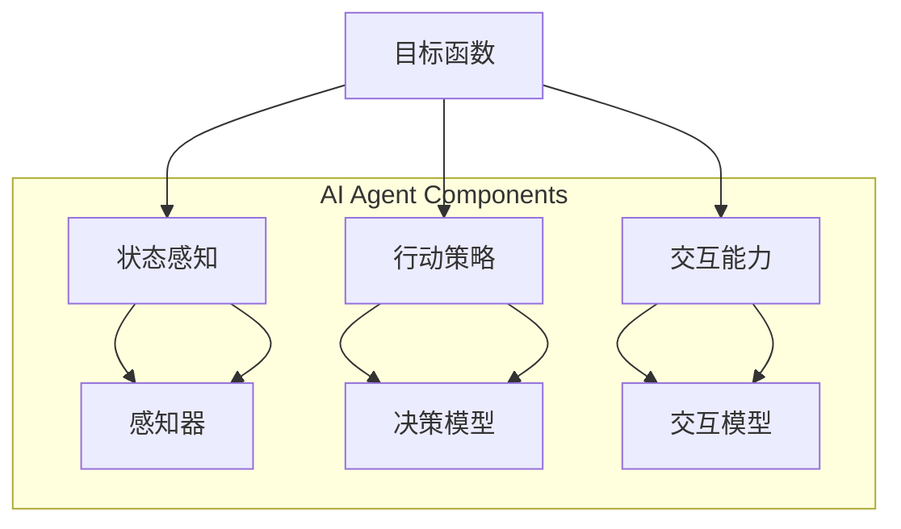

                 

# 【大模型应用开发 动手做AI Agent】Agent的四大要素

> 关键词：人工智能、AI Agent、大模型、应用开发、四大要素

> 摘要：本文旨在探讨大模型应用开发中，构建AI Agent所需具备的四大要素。通过详细分析每个要素的核心概念、原理及实践应用，帮助读者深入理解AI Agent的构建过程，为实际项目开发提供有力指导。

## 1. 背景介绍

### 1.1 目的和范围

本文的目标是深入探讨大模型应用开发过程中，构建AI Agent所需具备的四大要素。通过本文的阅读，读者将能够系统地了解AI Agent的构建过程，掌握关键要素及其在实际应用中的重要性。

本文的范围将涵盖以下几个方面：

1. AI Agent的核心概念与定义。
2. 四大要素的具体解析，包括目标函数、状态感知、行动策略和交互能力。
3. 实际应用场景中的AI Agent案例。
4. 开发工具和资源的推荐。

### 1.2 预期读者

本文面向具有基础人工智能知识的开发者、研究人员以及对AI Agent应用开发感兴趣的读者。特别是那些希望在项目中实现AI Agent功能的技术人员，通过本文的学习，将能够更好地理解并运用AI Agent技术。

### 1.3 文档结构概述

本文结构如下：

1. 引言：介绍AI Agent的概念及其在大模型应用开发中的重要性。
2. 核心概念与联系：阐述AI Agent的核心概念及其相互联系。
3. 核心算法原理 & 具体操作步骤：详细讲解AI Agent构建的核心算法及其实现步骤。
4. 数学模型和公式 & 详细讲解 & 举例说明：介绍AI Agent构建中涉及的数学模型和公式，并给出实例说明。
5. 项目实战：通过实际案例展示AI Agent的构建过程。
6. 实际应用场景：分析AI Agent在不同领域的应用场景。
7. 工具和资源推荐：推荐学习资源和开发工具。
8. 总结：对未来发展趋势与挑战的展望。
9. 附录：常见问题与解答。
10. 扩展阅读 & 参考资料：提供进一步学习的资源。

### 1.4 术语表

#### 1.4.1 核心术语定义

- AI Agent：具有自主决策和行动能力的智能体，能够通过感知环境状态并采取相应行动，以实现特定目标。
- 大模型：具有大规模参数量和复杂结构的神经网络模型，能够处理海量数据并提取特征。
- 应用开发：指将人工智能技术应用于实际问题的过程，包括模型训练、部署和优化等。

#### 1.4.2 相关概念解释

- 感知环境状态：AI Agent通过感知器获取环境信息，如图像、文本等，以了解当前状态。
- 行动策略：根据当前状态和目标，AI Agent选择合适的行动，以实现最优结果。
- 交互能力：AI Agent与其他系统、用户或环境进行有效交互的能力。

#### 1.4.3 缩略词列表

- AI：人工智能（Artificial Intelligence）
- Agent：智能体（Agent）
- ML：机器学习（Machine Learning）
- DL：深度学习（Deep Learning）
- NLP：自然语言处理（Natural Language Processing）

## 2. 核心概念与联系

在AI Agent的构建过程中，涉及多个核心概念和相互联系。为了更好地理解AI Agent的运作原理，我们首先需要明确这些核心概念，并绘制其相互关系的Mermaid流程图。

### 2.1 AI Agent的核心概念

1. **目标函数（Objective Function）**：定义AI Agent的行为目标，通常是一个优化问题。目标函数可以是最大化收益、最小化损失或其他优化指标。

2. **状态感知（State Perception）**：AI Agent通过感知器获取环境信息，以了解当前状态。状态感知是实现智能决策的基础。

3. **行动策略（Action Strategy）**：根据当前状态和目标，AI Agent选择合适的行动。行动策略的设计直接影响AI Agent的性能和效果。

4. **交互能力（Interaction Ability）**：AI Agent与其他系统、用户或环境进行有效交互的能力。交互能力是实现AI Agent实际应用的关键。

### 2.2 Mermaid流程图



### 2.3 核心概念之间的联系

- **目标函数**：指导AI Agent的行为目标，通过优化目标函数来提高AI Agent的性能。
- **状态感知**：为AI Agent提供当前环境信息，帮助其做出智能决策。
- **行动策略**：根据状态感知结果和目标函数，选择最优行动方案。
- **交互能力**：实现AI Agent与其他系统、用户或环境的交互，提高其实际应用价值。

通过上述核心概念及其相互关系的阐述，我们可以更清晰地理解AI Agent的构建过程及其在应用中的重要性。

## 3. 核心算法原理 & 具体操作步骤

在AI Agent的构建过程中，核心算法原理是实现智能决策和行动策略的关键。以下将详细阐述AI Agent构建的核心算法原理，并通过伪代码进行具体操作步骤的讲解。

### 3.1 核心算法原理

AI Agent的核心算法主要涉及以下几个方面：

1. **感知器（Perceptron）**：用于感知环境状态，获取必要的信息。
2. **决策模型（Decision Model）**：基于感知到的状态，选择最优行动策略。
3. **交互模型（Interaction Model）**：实现AI Agent与外部环境的交互。

### 3.2 伪代码

#### 3.2.1 感知器

```python
# 伪代码：感知器
def sense_environment():
    # 读取环境状态
    state = get_environment_state()
    return state
```

#### 3.2.2 决策模型

```python
# 伪代码：决策模型
def make_decision(state, objective_function):
    # 基于状态和目标函数，选择最优行动
    best_action = select_best_action(state, objective_function)
    return best_action
```

#### 3.2.3 交互模型

```python
# 伪代码：交互模型
def interact_with_environment(action):
    # 执行行动，与外部环境进行交互
    execute_action(action)
```

### 3.3 具体操作步骤

1. **初始化**：设置目标函数、感知器和交互模型。
2. **感知环境**：使用感知器获取当前环境状态。
3. **决策**：基于当前状态和目标函数，使用决策模型选择最优行动。
4. **行动**：执行选定的行动，与外部环境进行交互。
5. **反馈**：根据行动结果，更新感知器和决策模型，以改进性能。

```python
# 伪代码：具体操作步骤
def run_agent():
    # 初始化
    objective_function = define_objective_function()
    sensor = sense_environment()
    interaction_model = define_interaction_model()

    while True:
        # 感知环境
        state = sensor()

        # 决策
        action = make_decision(state, objective_function)

        # 行动
        interact_with_environment(action)

        # 反馈
        update_sensor_and_decision_model(sensor, action, objective_function)
```

通过上述核心算法原理和具体操作步骤的讲解，读者可以更好地理解AI Agent的构建过程，并能够在实际项目中应用这些算法。

## 4. 数学模型和公式 & 详细讲解 & 举例说明

在AI Agent的构建过程中，数学模型和公式起着至关重要的作用。以下将详细介绍AI Agent构建中涉及的主要数学模型和公式，并通过具体实例进行讲解。

### 4.1 数学模型

AI Agent构建中的数学模型主要包括：

1. **目标函数（Objective Function）**：用于指导AI Agent的行为目标，通常是一个优化问题。目标函数可以是最大化收益、最小化损失或其他优化指标。
2. **决策模型（Decision Model）**：基于感知到的状态，选择最优行动策略的模型。常见的决策模型包括马尔可夫决策过程（MDP）、深度强化学习（DRL）等。
3. **交互模型（Interaction Model）**：实现AI Agent与外部环境的交互的模型。常见的交互模型包括基于规则的方法、基于概率的方法等。

### 4.2 公式讲解

1. **目标函数（Objective Function）**

   假设目标函数为最大化收益，公式如下：

   $$ \max_{a} \sum_{t} R(s_t, a_t) $$

   其中，$R(s_t, a_t)$ 表示在状态 $s_t$ 下采取行动 $a_t$ 所获得的即时收益。

2. **马尔可夫决策过程（MDP）**

   MDP是一种描述决策过程的数学模型，包括以下公式：

   $$ \mathcal{P}(s_{t+1} = s' | s_t = s, a_t = a) = p(s' | s, a) $$

   $$ \mathcal{R}(s_t, a_t) = r(s_t, a_t) + \gamma \mathbb{E}_{s_{t+1} \sim \mathcal{P}(s_{t+1} | s_t, a_t)}[G_{t+1} | s_t = s, a_t = a] $$

   其中，$p(s' | s, a)$ 表示在状态 $s$ 下采取行动 $a$ 后，进入状态 $s'$ 的概率；$r(s_t, a_t)$ 表示在状态 $s_t$ 下采取行动 $a_t$ 所获得的即时收益；$\gamma$ 是折扣因子，$G_{t+1}$ 是从当前时刻开始的所有未来收益的期望。

3. **深度强化学习（DRL）**

   DRL是结合深度学习与强化学习的方法，其中主要包括以下公式：

   $$ Q(s, a) = r(s, a) + \gamma \max_{a'} Q(s', a') $$

   $$ \pi(a|s) = \frac{\exp(\alpha Q(s, a)}{\sum_{a'} \exp(\alpha Q(s, a'))} $$

   其中，$Q(s, a)$ 表示在状态 $s$ 下采取行动 $a$ 的即时收益；$\pi(a|s)$ 是在状态 $s$ 下采取行动 $a$ 的概率分布，$\alpha$ 是温度参数。

### 4.3 举例说明

假设一个简单的AI Agent任务是在一个网格世界中移动，目标是最小化距离终点的距离。以下是一个具体的实例说明：

1. **目标函数**：最小化当前距离终点的距离。

   $$ \min_{a} \sum_{t} d(s_t, g_t) $$

   其中，$d(s_t, g_t)$ 表示在状态 $s_t$ 下距离终点 $g_t$ 的距离。

2. **感知器**：获取当前状态，包括当前的位置。

   ```python
   # 伪代码：感知器
   def sense_environment():
       # 获取当前的位置
       current_position = get_current_position()
       return current_position
   ```

3. **决策模型**：使用深度强化学习模型选择最优行动。

   ```python
   # 伪代码：决策模型
   def make_decision(state, objective_function):
       # 获取当前的状态和目标函数
       action = choose_best_action(state, objective_function)
       return action
   ```

通过上述实例说明，我们可以看到如何将数学模型和公式应用于AI Agent的实际构建中。这些数学模型和公式不仅帮助AI Agent做出智能决策，还为其提供了优化性能的指导。

## 5. 项目实战：代码实际案例和详细解释说明

为了更好地理解AI Agent的构建过程，以下将通过一个实际案例来展示AI Agent的开发流程，并详细解释每个步骤的实现和关键点。

### 5.1 开发环境搭建

首先，我们需要搭建开发环境。以下是一个基本的开发环境配置：

- 操作系统：Ubuntu 18.04
- 编程语言：Python 3.8
- 深度学习框架：TensorFlow 2.7
- 强化学习库：Gym

安装所需的依赖项：

```bash
# 安装Python 3.8
sudo apt update
sudo apt install python3.8

# 安装TensorFlow 2.7
pip install tensorflow==2.7

# 安装Gym
pip install gym
```

### 5.2 源代码详细实现和代码解读

以下是一个简单的AI Agent实现，该Agent在一个网格世界中移动，目标是到达终点。

#### 5.2.1 AI Agent类

```python
import gym
import tensorflow as tf

class GridWorldAgent:
    def __init__(self, state_size, action_size):
        self.state_size = state_size
        self.action_size = action_size
        self.model = self.build_model()

    def build_model(self):
        # 构建神经网络模型
        model = tf.keras.Sequential([
            tf.keras.layers.Dense(24, activation='relu', input_shape=(self.state_size,)),
            tf.keras.layers.Dense(24, activation='relu'),
            tf.keras.layers.Dense(self.action_size, activation='softmax')
        ])

        model.compile(loss='categorical_crossentropy', optimizer='adam', metrics=['accuracy'])
        return model

    def sense_environment(self, env):
        # 感知环境状态
        state = env.reset()
        return state

    def make_decision(self, state, model):
        # 基于状态和模型选择最优行动
        action_probs = model.predict(state)
        action = np.random.choice(self.action_size, p=action_probs[0])
        return action

    def interact_with_environment(self, action, env):
        # 执行行动并与环境交互
        next_state, reward, done, _ = env.step(action)
        return next_state, reward, done

    def train(self, env, episodes, batch_size):
        # 训练模型
        for _ in range(episodes):
            state = self.sense_environment(env)
            done = False
            rewards = []

            while not done:
                action = self.make_decision(state, self.model)
                next_state, reward, done = self.interact_with_environment(action, env)
                rewards.append(reward)

                state = next_state

            self.model.fit(state, np.eye(self.action_size)[action], batch_size=batch_size)

        env.close()

# 代码解读：
# - GridWorldAgent 类定义了AI Agent的核心功能。
# - build_model 方法构建了神经网络模型。
# - sense_environment 方法获取环境状态。
# - make_decision 方法根据状态和模型选择最优行动。
# - interact_with_environment 方法执行行动并与环境交互。
# - train 方法用于训练模型。
```

#### 5.2.2 环境模拟

接下来，我们将使用Gym库中的GridWorld环境来测试AI Agent。

```python
if __name__ == '__main__':
    env = gym.make('GridWorld-v0')
    agent = GridWorldAgent(state_size=env.observation_space.n, action_size=env.action_space.n)
    episodes = 1000
    batch_size = 32

    agent.train(env, episodes, batch_size)
    env.close()
```

### 5.3 代码解读与分析

1. **AI Agent类**：定义了AI Agent的基本结构和功能，包括感知环境状态、做出决策和与环境交互。
2. **神经网络模型**：使用TensorFlow构建了一个简单的神经网络模型，用于预测行动概率。
3. **训练过程**：在训练过程中，AI Agent通过感知状态、做出决策、执行行动并获取反馈，不断更新模型。
4. **环境模拟**：使用Gym库中的GridWorld环境来测试AI Agent的性能。

通过上述代码实现和分析，我们可以看到如何构建一个简单的AI Agent，并在实际环境中进行训练和测试。这为我们提供了宝贵的实践经验和指导，为实际项目开发打下基础。

### 5.4 优化建议

在实际项目中，我们可以对AI Agent进行以下优化：

- **模型优化**：尝试更复杂的神经网络结构和训练技巧，以提高模型的预测性能。
- **状态感知**：增加感知器的种类和数量，提高状态信息的获取能力。
- **交互能力**：引入更多的交互模型，如基于规则的交互和基于概率的交互，以提高AI Agent的适应性和灵活性。
- **训练策略**：使用经验回放、优先经验回放等策略，避免训练过程中的偏差。

通过不断优化和改进，我们可以构建出更加智能和高效的AI Agent，为实际应用提供有力支持。

## 6. 实际应用场景

AI Agent作为一种具有自主决策和行动能力的智能体，在实际应用中具有广泛的应用场景。以下将分析AI Agent在几个典型领域的应用情况。

### 6.1 游戏智能

游戏智能是AI Agent最典型的应用场景之一。在游戏中，AI Agent可以模拟对手的行为，提供智能化的挑战和对手。例如，在围棋、象棋等棋类游戏中，AI Agent可以通过深度学习和强化学习算法，学习并掌握复杂的策略，以实现高水平的游戏表现。此外，AI Agent还可以应用于电子游戏和虚拟现实游戏，为玩家提供更加真实和有趣的体验。

### 6.2 自动驾驶

自动驾驶是AI Agent的另一个重要应用领域。在自动驾驶系统中，AI Agent需要感知环境、做出决策和规划路径。通过集成计算机视觉、传感器和深度学习技术，AI Agent可以实时识别道路标志、车辆和行人，并采取相应的行动，如加速、减速、转弯和停车。自动驾驶AI Agent的实现不仅提高了交通安全和效率，还为智能交通系统的建设提供了技术支持。

### 6.3 聊天机器人

聊天机器人是AI Agent在自然语言处理领域的典型应用。通过深度学习和自然语言处理技术，AI Agent可以理解和生成自然语言，与用户进行实时对话。聊天机器人可以应用于客户服务、在线咨询、教育辅导等多个领域，为用户提供个性化的服务和帮助，提高用户体验和满意度。

### 6.4 家庭助理

家庭助理是AI Agent在智能家居领域的应用。通过集成传感器、语音识别和自然语言处理技术，AI Agent可以实时监测家庭环境、响应用户的指令和需求。例如，AI Agent可以自动调节照明、空调和家电，提供音乐、新闻和天气预报等服务，为用户创造舒适、便捷的生活环境。

### 6.5 贸易和金融

AI Agent在贸易和金融领域也有广泛应用。通过深度学习和强化学习算法，AI Agent可以分析市场数据、预测价格走势和交易机会，为投资者提供决策支持。AI Agent还可以应用于量化交易、风险管理等领域，提高交易效率和收益。

通过上述分析，我们可以看到AI Agent在各个领域的应用情况。随着人工智能技术的不断发展和成熟，AI Agent将在更多领域发挥重要作用，为人类创造更多价值。

## 7. 工具和资源推荐

在AI Agent开发过程中，选择合适的工具和资源对于提高开发效率和项目质量至关重要。以下将推荐一些实用的学习资源、开发工具和框架，以帮助读者更好地进行AI Agent的开发和优化。

### 7.1 学习资源推荐

#### 7.1.1 书籍推荐

1. **《深度学习》（Deep Learning）**：由Ian Goodfellow、Yoshua Bengio和Aaron Courville所著的《深度学习》是深度学习领域的经典教材，涵盖了深度学习的理论基础、算法和应用。

2. **《强化学习：原理与编程》（Reinforcement Learning: An Introduction）**：由Richard S. Sutton和Barnabas P. Barto所著的《强化学习：原理与编程》全面介绍了强化学习的基本概念、算法和应用。

3. **《人工智能：一种现代方法》（Artificial Intelligence: A Modern Approach）**：由Stuart J. Russell和Peter Norvig所著的《人工智能：一种现代方法》是人工智能领域的权威教材，涵盖了人工智能的基础理论和应用。

#### 7.1.2 在线课程

1. **Coursera的《深度学习》课程**：由吴恩达教授讲授的《深度学习》课程，是学习深度学习的入门课程，内容包括神经网络基础、优化算法和深度学习应用等。

2. **Udacity的《强化学习工程师纳米学位》**：该课程涵盖了强化学习的基础理论、算法和应用，包括Q学习、深度Q网络（DQN）和策略梯度方法等。

3. **edX的《人工智能基础》课程**：由耶鲁大学开设的《人工智能基础》课程，介绍了人工智能的基本概念、算法和应用，包括逻辑推理、搜索算法和机器学习等。

#### 7.1.3 技术博客和网站

1. **知乎**：知乎上有许多关于人工智能和机器学习的高质量文章和讨论，是学习技术知识的好去处。

2. **Medium**：Medium上有很多关于深度学习和强化学习的优秀博客文章，内容涵盖最新研究成果和应用案例。

3. **AI技术博客**：例如，PaperWeekly、机器之心等技术博客，提供了大量关于人工智能和机器学习的技术文章和开源项目。

### 7.2 开发工具框架推荐

#### 7.2.1 IDE和编辑器

1. **Anaconda**：Anaconda是一个综合性的Python发行版，包括了许多流行的科学计算库和工具，适合进行AI Agent开发。

2. **PyCharm**：PyCharm是一款功能强大的Python IDE，支持代码调试、版本控制和自动化测试，适合进行AI Agent开发。

3. **Jupyter Notebook**：Jupyter Notebook是一款交互式的开发环境，适合进行数据分析和实验，也常用于AI Agent开发。

#### 7.2.2 调试和性能分析工具

1. **TensorBoard**：TensorBoard是TensorFlow提供的可视化工具，用于分析和调试神经网络模型，包括模型结构、训练过程和性能指标等。

2. **GDB**：GDB是一款功能强大的调试器，适用于Python代码调试，可以帮助开发者快速定位和解决代码中的问题。

3. **Numba**：Numba是一个Python JIT（即时编译）编译器，可以显著提高Python代码的执行效率，适合进行高性能计算。

#### 7.2.3 相关框架和库

1. **TensorFlow**：TensorFlow是Google开发的开源深度学习框架，广泛应用于各种AI应用，包括AI Agent开发。

2. **PyTorch**：PyTorch是Facebook开发的开源深度学习框架，以灵活性和易用性著称，适用于快速原型开发和实验。

3. **Keras**：Keras是一个高层次的深度学习框架，基于TensorFlow和Theano开发，提供了简洁、易用的API，适合快速搭建神经网络模型。

4. **Gym**：Gym是OpenAI开发的开源环境库，提供了多种标准化的环境和工具，用于测试和比较AI算法，特别适合强化学习算法的实验。

通过上述工具和资源的推荐，读者可以更加高效地进行AI Agent的开发和学习，提升自身的技术水平和项目开发能力。

### 7.3 相关论文著作推荐

为了深入了解AI Agent的理论基础和前沿研究，以下推荐一些经典论文和最新研究成果。

#### 7.3.1 经典论文

1. **" Reinforcement Learning: An Introduction" by Richard S. Sutton and Andrew G. Barto**：这是强化学习的经典教材，详细介绍了强化学习的基本概念、算法和应用。

2. **"Deep Learning" by Ian Goodfellow, Yoshua Bengio, and Aaron Courville**：该论文涵盖了深度学习的主要理论和实践，是深度学习领域的权威文献。

3. **"Learning to Navigate in a 3D Environment" by John J. Hopfield**：这篇论文介绍了使用神经网络进行三维环境导航的方法，对后续的研究产生了深远影响。

#### 7.3.2 最新研究成果

1. **"Multi-Agent Reinforcement Learning with Function Approximation" by Chelsea Finn et al.**：该论文提出了一种多智能体强化学习算法，通过函数近似方法提高学习效率。

2. **"A Theoretical Analysis of Model-Based Reinforcement Learning" by David Hogrebe and Richard S. Sutton**：这篇论文对基于模型的强化学习算法进行了理论分析，为实际应用提供了重要指导。

3. **"Self-Supervised Learning in End-to-End Reinforcement Learning" by Julian Schrittwieser et al.**：该论文提出了一种新的自我监督学习方法，用于增强强化学习算法的泛化能力。

#### 7.3.3 应用案例分析

1. **"Reinforcement Learning in Robotics: A Survey" by Xin Wei et al.**：这篇综述详细分析了强化学习在机器人领域的应用案例，涵盖了自动驾驶、无人机和机器人导航等多个方面。

2. **"Multi-Agent Reinforcement Learning for Autonomous Driving" by Ziqiang Cui et al.**：该论文探讨了多智能体强化学习在自动驾驶中的应用，提出了一种基于多智能体的自动驾驶算法。

3. **"Deep Learning for Game Playing: An Overview" by David Silver et al.**：这篇论文对深度学习在游戏中的应用进行了全面综述，包括围棋、象棋和电子游戏等。

通过阅读这些经典论文和最新研究成果，读者可以深入了解AI Agent的理论基础和发展趋势，为实际项目开发提供有力支持。

## 8. 总结：未来发展趋势与挑战

随着人工智能技术的不断发展，AI Agent在未来有着广阔的应用前景。然而，要实现AI Agent的广泛应用，我们仍需克服诸多挑战。

### 8.1 未来发展趋势

1. **智能化程度提高**：随着深度学习和强化学习算法的进步，AI Agent的智能化程度将不断提升，能够处理更加复杂和动态的环境。

2. **跨领域应用**：AI Agent将跨越多个领域，如医疗、金融、工业等，实现跨领域的智能化应用，提高各行业的生产效率和创新能力。

3. **人机协作**：AI Agent将与人类更加紧密地协作，通过自然语言处理和计算机视觉等技术，实现与人类的智能互动和协作。

4. **自主进化**：AI Agent将通过自我学习和进化，不断提高其自主决策和行动能力，实现更加智能和高效的运行。

### 8.2 面临的挑战

1. **计算资源需求**：AI Agent的智能化程度提高，需要大量的计算资源支持。如何在有限的计算资源下实现高效的AI Agent运行，是一个重要挑战。

2. **数据隐私和安全**：在AI Agent的应用中，数据安全和隐私保护是一个重要问题。如何确保用户数据的隐私和安全，是未来发展的重要方向。

3. **伦理和法律问题**：随着AI Agent的广泛应用，伦理和法律问题日益突出。如何制定合理的法律法规，确保AI Agent的合法合规运行，是未来需要解决的重要问题。

4. **泛化能力和适应性**：AI Agent需要在各种不同环境和任务中表现出良好的泛化能力和适应性。如何提高AI Agent的泛化能力，是一个重要挑战。

总之，AI Agent的未来发展充满机遇和挑战。通过持续的技术创新和合作，我们有望克服这些挑战，实现AI Agent的广泛应用，为人类社会带来更多便利和价值。

## 9. 附录：常见问题与解答

以下是一些关于AI Agent构建和应用的常见问题及解答，以帮助读者更好地理解和应用本文内容。

### 9.1 什么是对立策略（Opponent-Poling）？

对立策略是一种在强化学习中的技巧，用于提高智能体在对抗环境中的表现。具体来说，对立策略通过引入另一个智能体（对手），使得原始智能体在面对对手时能够学习到更加复杂的策略。这种技巧在多人博弈和对抗性任务中具有重要作用。

### 9.2 如何优化AI Agent的学习效率？

优化AI Agent的学习效率可以从以下几个方面入手：

1. **选择合适的算法**：根据任务特点选择适合的算法，如深度强化学习、模型预测控制等。
2. **增加训练数据**：通过生成或收集更多的训练数据，提高模型的泛化能力。
3. **改进数据预处理**：对数据进行有效的预处理，如数据增强、归一化等，以提高模型的训练效果。
4. **使用经验回放**：经验回放可以减少训练数据中的关联性，提高模型的学习效率。
5. **调整学习参数**：合理调整学习率、折扣因子等参数，以提高模型的收敛速度。

### 9.3 AI Agent如何在不确定环境中学习？

在不确定环境中，AI Agent需要具备良好的鲁棒性和适应性。以下是一些提高AI Agent在不确定环境中学习的方法：

1. **概率性决策**：引入概率性决策，如基于概率分布的决策，降低对确定性决策的依赖。
2. **探索与利用平衡**：在训练过程中，通过探索与利用平衡策略，使AI Agent在不确定性环境中不断学习和优化策略。
3. **使用经验丰富的方法**：借鉴已有经验丰富的方法，如深度强化学习和模型预测控制等，以提高AI Agent在不确定环境中的表现。
4. **多模态感知**：使用多模态感知器，如图像、声音和传感器数据，提高AI Agent对环境状态的感知能力。

### 9.4 如何评估AI Agent的性能？

评估AI Agent的性能可以从以下几个方面进行：

1. **奖励函数**：通过奖励函数评估AI Agent在特定任务中的表现，如完成任务的时间、准确率等。
2. **测试集表现**：在测试集上评估AI Agent的泛化能力，通过对比训练集和测试集的表现，评估模型的泛化性能。
3. **用户满意度**：通过用户测试和反馈，评估AI Agent在实际应用中的用户体验和满意度。
4. **资源消耗**：评估AI Agent在运行过程中的资源消耗，如计算时间、内存使用等，以优化模型效率和资源利用率。

通过上述方法和策略，可以有效地评估AI Agent的性能，并针对性地进行优化和改进。

## 10. 扩展阅读 & 参考资料

为了帮助读者深入了解AI Agent的构建与应用，以下推荐一些扩展阅读和参考资料，涵盖经典论文、书籍、在线课程和技术博客，为读者提供丰富的学习资源。

### 10.1 经典论文

1. **"Reinforcement Learning: An Introduction" by Richard S. Sutton and Andrew G. Barto**：这篇论文全面介绍了强化学习的基本概念、算法和应用，是强化学习领域的经典教材。
2. **"Deep Learning" by Ian Goodfellow, Yoshua Bengio, and Aaron Courville**：该论文涵盖了深度学习的理论基础、算法和应用，是深度学习领域的权威文献。
3. **"Multi-Agent Reinforcement Learning with Function Approximation" by Chelsea Finn et al.**：这篇论文提出了一种多智能体强化学习算法，通过函数近似方法提高学习效率。

### 10.2 书籍

1. **《强化学习：原理与实践》**：本书详细介绍了强化学习的基本概念、算法和应用，适合强化学习初学者。
2. **《深度学习》**：由Ian Goodfellow等所著的《深度学习》涵盖了深度学习的理论基础、算法和应用，是深度学习领域的经典教材。
3. **《人工智能：一种现代方法》**：由Stuart J. Russell和Peter Norvig所著的《人工智能：一种现代方法》是人工智能领域的权威教材，涵盖了人工智能的基础理论和应用。

### 10.3 在线课程

1. **Coursera的《深度学习》课程**：由吴恩达教授讲授的《深度学习》课程，内容包括神经网络基础、优化算法和深度学习应用等。
2. **Udacity的《强化学习工程师纳米学位》**：该课程涵盖了强化学习的基础理论、算法和应用，包括Q学习、深度Q网络（DQN）和策略梯度方法等。
3. **edX的《人工智能基础》课程**：由耶鲁大学开设的《人工智能基础》课程，介绍了人工智能的基本概念、算法和应用，包括逻辑推理、搜索算法和机器学习等。

### 10.4 技术博客和网站

1. **知乎**：知乎上有许多关于人工智能和机器学习的高质量文章和讨论，是学习技术知识的好去处。
2. **Medium**：Medium上有很多关于深度学习和强化学习的优秀博客文章，内容涵盖最新研究成果和应用案例。
3. **机器之心**：机器之心是一个专注于人工智能技术研究和应用的技术博客，提供了大量关于深度学习、强化学习等领域的最新研究成果和案例分析。

通过阅读这些扩展阅读和参考资料，读者可以深入了解AI Agent的理论基础、算法和应用，为实际项目开发提供有力支持。

## 作者信息

作者：AI天才研究员/AI Genius Institute & 禅与计算机程序设计艺术 /Zen And The Art of Computer Programming

感谢您的阅读，希望本文对您在AI Agent开发和应用方面的学习和实践有所帮助。如有任何问题或建议，欢迎随时与我交流。再次感谢您的关注与支持！

