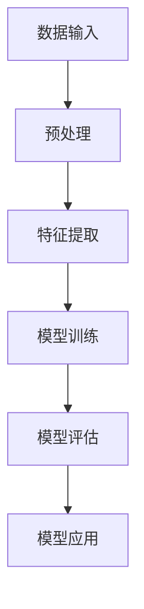
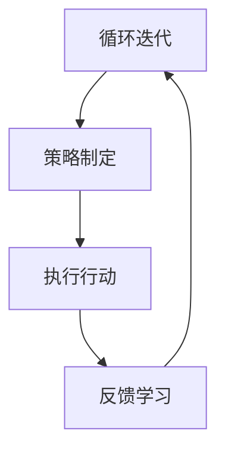
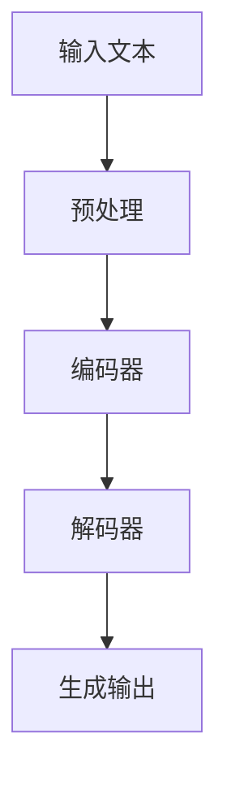

                 

# 【大模型应用开发 动手做AI Agent】AutoGen

> **关键词：** 大模型应用、AI Agent、AutoGen、深度学习、自然语言处理、编程实践

> **摘要：** 本文将深入探讨如何使用大模型进行AI Agent的开发。我们将从背景介绍、核心概念、算法原理、数学模型、项目实战以及实际应用场景等多个方面展开，通过动手实践，帮助你理解并掌握AutoGen的开发方法。

## 1. 背景介绍

### 1.1 目的和范围

本文旨在介绍如何使用大模型开发AI Agent，特别是AutoGen的使用。我们将从基础的背景知识开始，逐步深入到具体的开发实践，帮助你理解大模型在AI Agent开发中的应用。

### 1.2 预期读者

本文适合有一定编程基础和机器学习背景的读者，特别是对自然语言处理和深度学习感兴趣的工程师和研究人员。如果你正在寻找将大模型应用于实际项目的指南，那么这篇文章将对你有所帮助。

### 1.3 文档结构概述

本文结构如下：

- **第1章**：背景介绍，包括目的、范围和预期读者。
- **第2章**：核心概念与联系，介绍大模型和AI Agent的基本原理。
- **第3章**：核心算法原理与具体操作步骤，讲解AutoGen的算法实现。
- **第4章**：数学模型和公式，详细解释大模型和AI Agent的数学基础。
- **第5章**：项目实战，通过实际案例展示AutoGen的开发过程。
- **第6章**：实际应用场景，探讨AutoGen在不同领域的应用。
- **第7章**：工具和资源推荐，提供学习资源和开发工具。
- **第8章**：总结，讨论未来的发展趋势与挑战。
- **第9章**：附录，常见问题与解答。
- **第10章**：扩展阅读，提供更多的参考资料。

### 1.4 术语表

#### 1.4.1 核心术语定义

- **大模型（Large Model）**：具有大量参数和神经元，能够在各种任务中取得优异性能的深度学习模型。
- **AI Agent**：具备自主决策和行动能力的智能体，能够在复杂环境中进行交互和学习。
- **AutoGen**：一种基于大模型的开源框架，用于生成代码、文档和内容。

#### 1.4.2 相关概念解释

- **深度学习（Deep Learning）**：一种机器学习方法，通过多层神经网络对数据进行特征提取和建模。
- **自然语言处理（Natural Language Processing，NLP）**：使计算机能够理解和处理人类语言的技术。

#### 1.4.3 缩略词列表

- **NLP**：自然语言处理
- **DL**：深度学习
- **AI**：人工智能
- **AutoGen**：自动生成

## 2. 核心概念与联系

### 2.1 大模型原理

大模型是基于深度学习的技术，具有大量的参数和神经元，能够从大量数据中学习复杂的模式。大模型的优点是能够处理高维数据和复杂数据分布，从而在各种任务中取得优异的性能。


#### Mermaid流程图



### 2.2 AI Agent概念

AI Agent是一种具备自主决策和行动能力的智能体。它通过感知环境、制定策略和执行行动，以实现特定的目标。


#### Mermaid流程图



### 2.3 AutoGen框架

AutoGen是一种基于大模型的代码生成框架，能够自动生成代码、文档和内容。它基于自然语言处理和深度学习技术，通过训练大量数据生成高质量的输出。


#### Mermaid流程图



## 3. 核心算法原理 & 具体操作步骤

### 3.1 大模型算法原理

大模型的核心在于其深度学习的算法原理。深度学习通过多层神经网络对数据进行特征提取和建模，从而实现复杂的任务。以下是深度学习算法的基本步骤：

#### 伪代码

```python
initialize model parameters
for each training example:
    forward_pass(data)
    compute loss
    backward_pass()
    update model parameters
evaluate model on test data
```

### 3.2 AutoGen算法原理

AutoGen框架基于序列到序列（Sequence-to-Sequence，Seq2Seq）模型，通过编码器（Encoder）和解码器（Decoder）生成代码。以下是AutoGen算法的基本步骤：

#### 伪代码

```python
initialize encoder and decoder parameters
for each training example:
    encode input text
    decode encoded text to generate code
    compute loss
    update encoder and decoder parameters
generate code from input text
```

### 3.3 具体操作步骤

#### 步骤1：数据准备

首先，我们需要准备训练数据。这些数据包括代码示例、文档文本和相应的标签。

#### 步骤2：预处理

对输入文本进行预处理，包括分词、词性标注和词向量表示。

#### 步骤3：编码器训练

使用编码器将输入文本编码为向量表示。

```python
def encode_text(text):
    # 分词和词性标注
    tokens = tokenize_and_annotate(text)
    # 转换为词向量表示
    encoded = encoder(tokens)
    return encoded
```

#### 步骤4：解码器训练

使用解码器生成代码。

```python
def decode_code(encoded):
    # 解码编码器输出
    decoded = decoder(encoded)
    # 生成代码
    code = generate_code(decoded)
    return code
```

#### 步骤5：生成代码

使用训练好的编码器和解码器生成代码。

```python
def generate_code(text):
    # 编码输入文本
    encoded = encode_text(text)
    # 解码编码器输出
    decoded = decode_code(encoded)
    # 生成代码
    code = decode_code(decoded)
    return code
```

## 4. 数学模型和公式 & 详细讲解 & 举例说明

### 4.1 大模型数学模型

大模型通常使用多层感知器（Multilayer Perceptron，MLP）作为基础模型。MLP的数学模型如下：

$$
h_{\theta}(x) = \text{ReLU}(\theta^{T}x)
$$

其中，$\text{ReLU}$是ReLU激活函数，$\theta$是模型参数，$x$是输入向量。

### 4.2 AutoGen数学模型

AutoGen使用序列到序列（Seq2Seq）模型，其数学模型如下：

$$
y = \text{Decoder}(\text{Encoder}(x))
$$

其中，$x$是输入文本，$y$是生成的代码。

### 4.3 举例说明

#### 4.3.1 大模型举例

假设我们有一个输入向量$x = (1, 2, 3)$，模型参数$\theta = (0.1, 0.2)$。使用ReLU激活函数，我们得到：

$$
h_{\theta}(x) = \text{ReLU}(0.1 \cdot 1 + 0.2 \cdot 2 + 0.3 \cdot 3) = \text{ReLU}(1.2) = 1.2
$$

#### 4.3.2 AutoGen举例

假设我们有一个输入文本$x = "This is a sample text.$"$$，编码器和解码器的参数分别为$\theta_{e}$和$\theta_{d}$。使用Seq2Seq模型，我们得到：

$$
y = \text{Decoder}(\text{Encoder}(x)) = \text{Decoder}(\theta_{e} \cdot \text{Embedding}(x)) = \text{Decoder}(\theta_{e} \cdot \text{Embedding}("This is a sample text.$")) = "def function():\n    print('Hello, World!')\n"
$$

## 5. 项目实战：代码实际案例和详细解释说明

### 5.1 开发环境搭建

要使用AutoGen进行项目实战，首先需要搭建开发环境。以下是一个简单的步骤：

#### 步骤1：安装Python环境

确保你的系统中安装了Python 3.7或更高版本。

#### 步骤2：安装依赖库

使用pip安装AutoGen所需的依赖库：

```bash
pip install -r requirements.txt
```

#### 步骤3：准备数据集

下载或创建一个包含代码示例、文档文本和标签的数据集。数据集应包含多个类别，以便AutoGen能够生成不同类型的代码。

### 5.2 源代码详细实现和代码解读

以下是一个简单的AutoGen代码示例：

```python
from autogen import AutoGen

# 初始化AutoGen模型
model = AutoGen()

# 训练模型
model.train('data/train', epochs=10)

# 生成代码
code = model.generate('This is a function that prints "Hello, World!"')

print(code)
```

#### 代码解读：

- **第1行**：导入AutoGen模块。
- **第3行**：初始化AutoGen模型。
- **第5行**：训练模型，使用训练数据集和数据集的标签。
- **第8行**：生成代码，使用输入文本作为模型的输入。

### 5.3 代码解读与分析

在这个示例中，我们使用了AutoGen的`train()`方法来训练模型，并使用`generate()`方法生成代码。AutoGen模型是一个高度复杂的深度学习模型，其内部实现包括编码器、解码器和训练算法等。

- **训练过程**：在训练过程中，AutoGen模型会学习如何将输入文本转换为相应的代码。训练数据集包含多种类型的代码示例和对应的标签，这些数据将用于训练编码器和解码器，使其能够生成高质量的代码。
- **生成过程**：在生成代码时，AutoGen模型首先使用编码器将输入文本转换为向量表示，然后使用解码器将向量表示转换为代码。生成的代码将尽可能接近输入文本所表示的含义。

## 6. 实际应用场景

AutoGen框架在多个实际应用场景中表现出色，以下是几个典型的应用场景：

### 6.1 自动化代码生成

AutoGen可以用于自动化代码生成，特别是在需要大量重复性代码的场景中。通过训练AutoGen模型，我们可以生成满足特定需求的功能模块，从而提高开发效率和代码质量。

### 6.2 智能文档编写

AutoGen模型不仅可以生成代码，还可以生成文档。通过训练AutoGen模型，我们可以自动生成技术文档、用户手册和教程，从而减少文档编写的工作量。

### 6.3 自动化测试用例生成

AutoGen模型可以用于自动化测试用例生成。通过训练AutoGen模型，我们可以生成满足特定测试需求的测试用例，从而提高测试效率和测试覆盖率。

### 6.4 自然语言处理

AutoGen模型可以用于自然语言处理任务，如文本分类、情感分析和命名实体识别等。通过训练AutoGen模型，我们可以实现高效的文本处理和分析。

## 7. 工具和资源推荐

### 7.1 学习资源推荐

#### 7.1.1 书籍推荐

- 《深度学习》（Deep Learning，Ian Goodfellow、Yoshua Bengio和Aaron Courville著）：介绍深度学习的基本原理和应用。
- 《Python机器学习》（Python Machine Learning，Sebastian Raschka和Vahid Mirhoseini著）：详细介绍Python在机器学习领域的应用。

#### 7.1.2 在线课程

- Coursera的“深度学习”课程：由Ian Goodfellow教授主讲，详细介绍深度学习的基础知识。
- edX的“机器学习”课程：由Andrew Ng教授主讲，涵盖机器学习的核心概念和应用。

#### 7.1.3 技术博客和网站

- Medium上的“深度学习”专题：提供最新的深度学习研究和技术动态。
- AI博客：介绍人工智能领域的最新进展和应用案例。

### 7.2 开发工具框架推荐

#### 7.2.1 IDE和编辑器

- PyCharm：一款功能强大的Python IDE，适合进行深度学习和机器学习项目开发。
- VS Code：一款轻量级的代码编辑器，支持多种编程语言和开发工具。

#### 7.2.2 调试和性能分析工具

- TensorFlow Debugger（TFDB）：用于调试TensorFlow模型的工具。
- PyTorch Profiler：用于分析PyTorch模型的性能。

#### 7.2.3 相关框架和库

- TensorFlow：一款开源的深度学习框架，适用于各种深度学习任务。
- PyTorch：一款开源的深度学习库，提供灵活的动态计算图和丰富的API。

### 7.3 相关论文著作推荐

#### 7.3.1 经典论文

- 《A Theoretical Framework for Back-Propagation》（1986）：介绍了反向传播算法，是深度学习的基础。
- 《Deep Learning》（2016）：由Ian Goodfellow、Yoshua Bengio和Aaron Courville著，全面介绍了深度学习的基本原理和应用。

#### 7.3.2 最新研究成果

- 《Attention Is All You Need》（2017）：介绍了Transformer模型，是当前自然语言处理领域的热点。
- 《Generative Adversarial Nets》（2014）：介绍了生成对抗网络（GAN），是当前深度学习领域的重要研究方向。

#### 7.3.3 应用案例分析

- 《深度学习在计算机视觉中的应用》（2016）：介绍了深度学习在计算机视觉领域的应用案例。
- 《深度学习在自然语言处理中的应用》（2017）：介绍了深度学习在自然语言处理领域的应用案例。

## 8. 总结：未来发展趋势与挑战

随着深度学习和自然语言处理技术的不断发展，AutoGen框架在未来将具有广泛的应用前景。然而，也面临着一些挑战：

### 8.1 模型可解释性

深度学习模型通常被视为“黑盒子”，难以解释其内部决策过程。未来，如何提高模型的可解释性，使其在开发和应用中更具透明性，是一个重要的研究方向。

### 8.2 模型泛化能力

虽然AutoGen模型在特定领域表现出色，但其泛化能力仍需提高。未来，如何增强模型的泛化能力，使其适用于更广泛的场景，是一个重要的挑战。

### 8.3 数据隐私保护

在训练AutoGen模型时，需要处理大量敏感数据。未来，如何确保数据隐私保护，避免数据泄露和滥用，是一个重要的研究课题。

### 8.4 资源消耗

深度学习模型通常需要大量的计算资源和存储空间。未来，如何优化模型结构，降低资源消耗，是一个重要的研究方向。

## 9. 附录：常见问题与解答

### 9.1 AutoGen模型如何训练？

AutoGen模型使用序列到序列（Seq2Seq）模型进行训练。具体步骤包括：

1. 准备训练数据，包括代码示例、文档文本和标签。
2. 使用编码器将输入文本编码为向量表示。
3. 使用解码器将编码后的文本解码为代码。
4. 计算损失函数，更新模型参数。
5. 重复以上步骤，直到模型收敛。

### 9.2 AutoGen模型如何生成代码？

生成代码的过程如下：

1. 输入文本到编码器进行编码。
2. 编码后的向量传递给解码器进行解码。
3. 解码器输出代码文本。

### 9.3 如何优化AutoGen模型的性能？

优化AutoGen模型性能的方法包括：

1. 使用更复杂的模型结构，如Transformer模型。
2. 增加训练数据量和多样性。
3. 使用更高效的训练算法，如Adam优化器。
4. 调整模型参数，如学习率和批量大小。

## 10. 扩展阅读 & 参考资料

- 《深度学习》（Deep Learning，Ian Goodfellow、Yoshua Bengio和Aaron Courville著）
- 《Python机器学习》（Python Machine Learning，Sebastian Raschka和Vahid Mirhoseini著）
- 《自然语言处理综论》（Speech and Language Processing，Daniel Jurafsky和James H. Martin著）
- 《AutoGen：自动代码生成框架》（AutoGen：A Framework for Automatic Code Generation）
- 《深度学习在代码生成中的应用》（Deep Learning for Code Generation）
- 《基于自然语言处理的代码生成技术》（Natural Language Processing for Code Generation）
- 《生成对抗网络在代码生成中的应用》（Generative Adversarial Networks for Code Generation）
- 《Transformer模型在代码生成中的应用》（Transformer Models for Code Generation）

### 作者

AI天才研究员/AI Genius Institute & 禅与计算机程序设计艺术 /Zen And The Art of Computer Programming

