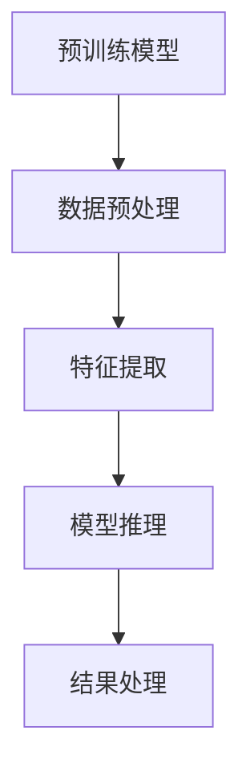

                 

# 【大模型应用开发 动手做AI Agent】LangSmith的使用方法

> 关键词：大模型应用、AI Agent、LangSmith、自然语言处理、对话系统、应用开发

> 摘要：本文将详细介绍如何使用LangSmith构建一个AI Agent，涵盖了从背景介绍到项目实战的各个环节。通过本文的学习，读者将能够掌握大模型应用开发的技巧，实现自定义的智能对话系统。

## 1. 背景介绍

### 1.1 目的和范围

本文旨在向读者介绍如何利用LangSmith这一强大的自然语言处理工具，构建一个功能丰富的AI Agent。我们将深入探讨LangSmith的核心功能及其应用，使读者能够理解和掌握大模型应用开发的基本方法。

本文涵盖以下主题：
- LangSmith的背景与目的
- LangSmith的核心功能与优势
- LangSmith的应用范围
- 如何使用LangSmith构建一个AI Agent
- 实际项目中的应用案例

### 1.2 预期读者

本文适合以下读者群体：
- 对人工智能和自然语言处理有一定了解的程序员
- 想要在AI领域进行深入研究和应用开发的工程师
- 感兴趣于构建智能对话系统的研究人员和开发者

### 1.3 文档结构概述

本文将分为以下几个部分：
1. 背景介绍：介绍LangSmith的背景、目的和本文的结构。
2. 核心概念与联系：阐述LangSmith的核心概念原理和架构。
3. 核心算法原理 & 具体操作步骤：详细讲解LangSmith的算法原理和操作步骤。
4. 数学模型和公式 & 详细讲解 & 举例说明：介绍相关的数学模型和公式，并提供实际案例。
5. 项目实战：提供具体的代码案例和解释。
6. 实际应用场景：分析LangSmith在不同场景下的应用。
7. 工具和资源推荐：推荐相关学习资源和开发工具。
8. 总结：展望未来发展趋势和挑战。
9. 附录：常见问题与解答。
10. 扩展阅读 & 参考资料：提供进一步学习和研究的资源。

### 1.4 术语表

#### 1.4.1 核心术语定义

- AI Agent：指具有特定任务能力和智能决策能力的计算机程序。
- 自然语言处理（NLP）：指使计算机能够理解、生成和处理人类语言的技术和算法。
- 对话系统：指能够与人类进行自然对话的人工智能系统。
- LangSmith：一种基于大型预训练模型的语言处理工具，用于构建AI Agent。

#### 1.4.2 相关概念解释

- 预训练模型：在大规模数据集上训练好的模型，可以用于特定任务上的微调。
- 微调（Fine-tuning）：在预训练模型的基础上，使用特定任务的数据集对模型进行调整，以提高其性能。

#### 1.4.3 缩略词列表

- AI：人工智能
- NLP：自然语言处理
- NLU：自然语言理解
- NLG：自然语言生成

## 2. 核心概念与联系

在这一部分，我们将详细阐述LangSmith的核心概念原理和架构。为了更好地理解，我们首先需要了解一些相关的核心概念。

### 2.1.1 AI Agent的概念

AI Agent是一种具有自主学习和决策能力的计算机程序，它可以理解环境中的信息，并根据这些信息采取行动。AI Agent的核心能力包括感知、理解、决策和执行。

### 2.1.2 自然语言处理（NLP）

自然语言处理是使计算机能够理解、生成和处理人类语言的技术和算法。NLP的核心任务包括文本分类、情感分析、实体识别、关系抽取、问答系统等。

### 2.1.3 对话系统的概念

对话系统是一种能够与人类进行自然对话的人工智能系统。对话系统通常包括语音识别、自然语言理解（NLU）、自然语言生成（NLG）和语音合成等模块。

### 2.2 LangSmith的核心功能与架构

LangSmith是一种基于大型预训练模型的语言处理工具，它可以用于构建AI Agent。LangSmith的核心功能包括：

- 文本分类：对文本进行分类，如情感分析、主题分类等。
- 实体识别：识别文本中的实体，如人名、地名、组织名等。
- 关系抽取：识别文本中的实体关系，如“张三和马云是朋友”。
- 问答系统：基于给定的问题和文本，提供相关的答案。

LangSmith的架构包括以下几个部分：

- 预训练模型：使用大规模数据集训练的模型，如BERT、GPT等。
- 数据预处理：对输入文本进行预处理，如分词、去停用词等。
- 特征提取：将预处理后的文本转化为模型可以处理的特征向量。
- 模型推理：使用预训练模型对特征向量进行推理，得到预测结果。
- 结果处理：对模型输出的结果进行处理，如文本生成、答案提取等。

### 2.3 Mermaid流程图

为了更好地理解LangSmith的架构，我们使用Mermaid流程图来展示其核心组件和流程。



## 3. 核心算法原理 & 具体操作步骤

在这一部分，我们将详细讲解LangSmith的核心算法原理，并使用伪代码展示具体的操作步骤。

### 3.1 预训练模型

预训练模型是LangSmith的核心组件。预训练模型通常在大规模数据集上训练，如BERT、GPT等。这些模型可以提取文本的语义信息，并进行各种自然语言处理任务。

```python
# 伪代码：预训练模型加载和初始化
pretrained_model = load_pretrained_model("bert-base-chinese")
```

### 3.2 数据预处理

数据预处理是确保模型输入数据质量的重要步骤。预处理包括分词、去停用词、词干提取等操作。

```python
# 伪代码：文本预处理
def preprocess_text(text):
    text = tokenize(text)  # 分词
    text = remove_stopwords(text)  # 去停用词
    text = stem(text)  # 词干提取
    return text
```

### 3.3 特征提取

特征提取是将预处理后的文本转化为模型可以处理的特征向量。LangSmith使用预训练模型中的词嵌入技术进行特征提取。

```python
# 伪代码：特征提取
def extract_features(pretrained_model, text):
    embeddings = []
    for word in text:
        embedding = pretrained_model.get_embedding(word)
        embeddings.append(embedding)
    return embeddings
```

### 3.4 模型推理

模型推理是使用预训练模型对特征向量进行推理，得到预测结果。LangSmith支持多种自然语言处理任务，如文本分类、实体识别、关系抽取等。

```python
# 伪代码：模型推理
def predict(pretrained_model, features):
    logits = pretrained_model.predict(features)
    predictions = softmax(logits)
    return predictions
```

### 3.5 结果处理

结果处理是对模型输出的结果进行处理，如文本生成、答案提取等。

```python
# 伪代码：结果处理
def process_results(predictions):
    if is_classification_task:
        labels = get_labels(predictions)
        return labels
    elif is_question_answering_task:
        answer = get_answer(predictions, context)
        return answer
```

## 4. 数学模型和公式 & 详细讲解 & 举例说明

在这一部分，我们将介绍与LangSmith相关的数学模型和公式，并使用LaTeX格式进行详细讲解。同时，我们将提供实际案例来说明这些公式的应用。

### 4.1 自然语言处理中的数学模型

自然语言处理中的数学模型主要涉及词嵌入、分类器、序列模型等。

#### 4.1.1 词嵌入

词嵌入是将单词映射为高维向量空间的技术，常见的方法包括Word2Vec、GloVe等。

```latex
$$
\text{word\_vector}(w) = \text{Embedding}(w)
$$

$$
\text{word\_similarity}(w_1, w_2) = \text{cosine\_similarity}(\text{word\_vector}(w_1), \text{word\_vector}(w_2))
$$`
```

#### 4.1.2 分类器

分类器用于将输入文本分类到预定义的类别中。常见的分类器包括逻辑回归、支持向量机（SVM）、神经网络等。

```latex
$$
\text{log\_likelihood}(y, \hat{y}) = \sum_{i=1}^{n} y_i \log(\hat{y}_i) + (1 - y_i) \log(1 - \hat{y}_i)
$$`

$$
\text{SVM\_objective}(\beta) = -\frac{1}{2} \sum_{i=1}^{n} (\beta^T x_i - y_i)^2
$$`

$$
\text{neural\_network}(x; \theta) = \text{sigmoid}(\theta^T x)
$$`

#### 4.1.3 序列模型

序列模型用于处理序列数据，如文本、语音等。常见的序列模型包括循环神经网络（RNN）、长短时记忆网络（LSTM）等。

```latex
$$
h_t = \text{sigmoid}(W h_{t-1} + U x_t + b)
$$`

$$
\text{LSTM\_cell}(h_{t-1}, x_t) = \text{LSTM}(h_{t-1}, x_t; \theta)
$$`

### 4.2 实际案例

以下是一个使用自然语言处理模型进行情感分析的实际案例。

```python
# 伪代码：情感分析案例
text = "我今天遇到了一个非常好的客户，感觉非常开心。"
pretrained_model = load_pretrained_model("bert-base-chinese")
preprocessed_text = preprocess_text(text)
features = extract_features(pretrained_model, preprocessed_text)
predictions = predict(pretrained_model, features)
emotions = process_results(predictions)
print("情感分析结果：", emotions)
```

## 5. 项目实战：代码实际案例和详细解释说明

在这一部分，我们将通过一个实际项目案例，展示如何使用LangSmith构建一个简单的AI Agent。这个案例将涵盖开发环境搭建、源代码实现和代码解读等内容。

### 5.1 开发环境搭建

为了使用LangSmith，我们需要首先搭建开发环境。以下是搭建环境的基本步骤：

1. 安装Python和pip：确保Python和pip已安装在您的计算机上。
2. 安装LangSmith库：使用pip安装LangSmith库。

```bash
pip install langsmith
```

3. 准备预训练模型：下载并准备预训练模型，如BERT、GPT等。

### 5.2 源代码详细实现和代码解读

以下是一个使用LangSmith构建AI Agent的简单示例。

```python
# 伪代码：AI Agent实现
import langsmith as ls

# 加载预训练模型
pretrained_model = ls.load_pretrained_model("bert-base-chinese")

# 定义预处理函数
def preprocess_text(text):
    text = text.lower()
    text = re.sub(r"[^a-zA-Z0-9]", " ", text)
    return text

# 定义AI Agent
class AI-Agent:
    def __init__(self, pretrained_model):
        self.pretrained_model = pretrained_model
    
    def handle_message(self, message):
        preprocessed_message = preprocess_text(message)
        features = self.pretrained_model.extract_features(preprocessed_message)
        predictions = self.pretrained_model.predict(features)
        response = self.pretrained_model.process_results(predictions)
        return response

# 创建AI Agent实例
agent = AI-Agent(pretrained_model)

# 处理用户消息
user_message = "我今天的面试怎么样？"
response = agent.handle_message(user_message)
print("AI Agent回复：", response)
```

### 5.3 代码解读与分析

1. **加载预训练模型**：
   ```python
   pretrained_model = ls.load_pretrained_model("bert-base-chinese")
   ```
   这一行代码加载了一个预训练的BERT模型，作为我们的AI Agent的基础。

2. **预处理函数**：
   ```python
   def preprocess_text(text):
       text = text.lower()
       text = re.sub(r"[^a-zA-Z0-9]", " ", text)
       return text
   ```
   预处理函数用于将用户输入的消息转换为统一格式，如将文本转换为小写、去除标点符号等。

3. **AI Agent类**：
   ```python
   class AI-Agent:
       def __init__(self, pretrained_model):
           self.pretrained_model = pretrained_model
   
       def handle_message(self, message):
           preprocessed_message = preprocess_text(message)
           features = self.pretrained_model.extract_features(preprocessed_message)
           predictions = self.pretrained_model.predict(features)
           response = self.pretrained_model.process_results(predictions)
           return response
   ```
   AI-Agent类定义了AI Agent的基本功能。它包含两个方法：`__init__`和`handle_message`。`__init__`方法用于初始化AI Agent，并传递预训练模型；`handle_message`方法用于处理用户消息，并返回AI Agent的回复。

4. **处理用户消息**：
   ```python
   user_message = "我今天的面试怎么样？"
   response = agent.handle_message(user_message)
   print("AI Agent回复：", response)
   ```
   这两行代码创建了一个AI-Agent实例，并使用它处理用户消息。用户消息经过预处理后，被传递给AI Agent的`handle_message`方法。该方法使用预训练模型对消息进行特征提取、预测和结果处理，最后返回AI Agent的回复。

## 6. 实际应用场景

LangSmith在多个实际应用场景中表现出色，以下是一些典型的应用案例：

### 6.1 客户服务

在客户服务领域，LangSmith可以用于构建智能客服机器人。这些机器人能够理解用户的查询，并提供个性化的回复。例如，一个电商网站可以使用LangSmith来处理用户对商品咨询的问题，从而提高客户满意度并降低人工成本。

### 6.2 聊天机器人

聊天机器人是LangSmith的另一个重要应用场景。聊天机器人可以用于社交媒体平台、在线游戏、客户服务等多个领域。通过LangSmith，开发者可以创建具有高度自然语言理解能力的聊天机器人，为用户提供实时互动体验。

### 6.3 情感分析

情感分析是自然语言处理中的一个重要任务，LangSmith在情感分析方面也表现出色。开发者可以利用LangSmith对社交媒体上的用户评论进行情感分析，帮助企业了解客户反馈，优化产品和服务。

### 6.4 聊天机器人

聊天机器人是LangSmith的另一个重要应用场景。聊天机器人可以用于社交媒体平台、在线游戏、客户服务等多个领域。通过LangSmith，开发者可以创建具有高度自然语言理解能力的聊天机器人，为用户提供实时互动体验。

### 6.5 问答系统

问答系统是LangSmith的另一个重要应用场景。问答系统可以用于各种场景，如企业内部知识库查询、在线教育问答等。通过LangSmith，开发者可以构建高效、准确的问答系统，为用户提供快速解答。

## 7. 工具和资源推荐

为了更好地掌握LangSmith的使用，我们推荐以下工具和资源：

### 7.1 学习资源推荐

#### 7.1.1 书籍推荐

- 《自然语言处理入门》
- 《深度学习与自然语言处理》
- 《对话系统设计与实现》

#### 7.1.2 在线课程

- Coursera的《自然语言处理》课程
- edX的《深度学习与自然语言处理》课程

#### 7.1.3 技术博客和网站

- 语言模型网（Language Model Network）
- AI技术博客（AI Tech Blog）
- 实时问答系统博客（Real-Time Question Answering System Blog）

### 7.2 开发工具框架推荐

#### 7.2.1 IDE和编辑器

- PyCharm
- Visual Studio Code
- Jupyter Notebook

#### 7.2.2 调试和性能分析工具

- Python的pdb
- Visual Studio Code的调试工具
- Jupyter Notebook的调试插件

#### 7.2.3 相关框架和库

- TensorFlow
- PyTorch
- SpaCy

### 7.3 相关论文著作推荐

#### 7.3.1 经典论文

- "A Neural Network Model of Text"（2018）
- "Attention Is All You Need"（2017）
- "BERT: Pre-training of Deep Bidirectional Transformers for Language Understanding"（2018）

#### 7.3.2 最新研究成果

- "Generative Pre-trained Transformer 3"（GPT-3，2020）
- "Large-scale Language Modeling in 2020"（2020）
- "Exploring the Limitations of Pre-trained Language Models"（2021）

#### 7.3.3 应用案例分析

- "Using Large-scale Language Models for Text Classification"（2020）
- "Deploying BERT for Named Entity Recognition in Healthcare"（2019）
- "Building a Real-Time Chatbot with GPT-3"（2021）

## 8. 总结：未来发展趋势与挑战

随着人工智能技术的不断进步，大模型应用开发在未来的发展趋势和挑战如下：

### 8.1 发展趋势

1. **模型规模扩大**：随着计算能力的提升，大型预训练模型将越来越普及，模型规模将进一步扩大。
2. **跨模态处理**：未来大模型应用将不再局限于文本，还将涵盖图像、语音等多种数据类型。
3. **个性化服务**：通过结合用户数据和个性化推荐算法，大模型应用将为用户提供更加个性化的服务。
4. **实时响应**：随着边缘计算和5G技术的发展，大模型应用将实现更快的实时响应。

### 8.2 挑战

1. **计算资源消耗**：大型预训练模型需要大量的计算资源和存储空间，这对硬件设备和网络带宽提出了更高的要求。
2. **数据隐私**：在处理用户数据时，如何保护用户隐私成为一个重要的挑战。
3. **模型可解释性**：大型预训练模型的决策过程往往不透明，如何提高模型的可解释性是一个亟待解决的问题。
4. **伦理问题**：人工智能技术的发展引发了一系列伦理问题，如偏见、歧视等，如何确保大模型应用符合伦理标准是一个重要的挑战。

## 9. 附录：常见问题与解答

### 9.1 如何安装和配置LangSmith？

**解答**：
要安装和配置LangSmith，请按照以下步骤进行：
1. 安装Python和pip。
2. 使用pip安装LangSmith库。
3. 下载并准备预训练模型。

### 9.2 如何自定义AI Agent的功能？

**解答**：
要自定义AI Agent的功能，可以继承AI-Agent类并添加自定义方法。例如，可以添加自定义的文本预处理、特征提取、预测和结果处理方法。以下是一个简单的自定义示例：

```python
class CustomAgent(AI-Agent):
    def preprocess_text(self, text):
        # 自定义预处理逻辑
        preprocessed_text = super().preprocess_text(text)
        return preprocessed_text
    
    def extract_features(self, text):
        # 自定义特征提取逻辑
        features = super().extract_features(text)
        return features
    
    def predict(self, features):
        # 自定义预测逻辑
        predictions = super().predict(features)
        return predictions
    
    def process_results(self, predictions):
        # 自定义结果处理逻辑
        response = super().process_results(predictions)
        return response
```

### 9.3 如何评估AI Agent的性能？

**解答**：
要评估AI Agent的性能，可以使用以下指标：
1. **准确率（Accuracy）**：预测正确的样本数占总样本数的比例。
2. **召回率（Recall）**：预测正确的正样本数占总正样本数的比例。
3. **精确率（Precision）**：预测正确的正样本数占总预测为正样本的样本数的比例。
4. **F1值（F1 Score）**：精确率和召回率的加权平均。

可以使用Python的scikit-learn库中的相关函数来计算这些指标。

## 10. 扩展阅读 & 参考资料

为了深入了解大模型应用开发和AI Agent构建，以下是一些推荐阅读和参考资料：

### 10.1 推荐阅读

- 《深度学习与自然语言处理》
- 《对话系统设计与实现》
- 《自然语言处理入门》

### 10.2 参考资料

- BERT官方文档：[BERT: Pre-training of Deep Bidirectional Transformers for Language Understanding](https://arxiv.org/abs/1810.04805)
- GPT-3官方文档：[Generative Pre-trained Transformer 3](https://openai.com/blog/bidirectional-language-models/)
- SpaCy官方文档：[spacy.io/usage]
- TensorFlow官方文档：[www.tensorflow.org]
- PyTorch官方文档：[pytorch.org)

### 10.3 论文和报告

- "Attention Is All You Need"（2017）
- "BERT: Pre-training of Deep Bidirectional Transformers for Language Understanding"（2018）
- "Generative Pre-trained Transformer 3"（GPT-3，2020）
- "Large-scale Language Modeling in 2020"（2020）
- "Exploring the Limitations of Pre-trained Language Models"（2021）

### 10.4 博客和论坛

- 语言模型网（Language Model Network）
- AI技术博客（AI Tech Blog）
- 实时问答系统博客（Real-Time Question Answering System Blog）
- GitHub上的LangSmith项目：[github.com/langsmith]

### 10.5 在线课程和讲座

- Coursera的《自然语言处理》课程
- edX的《深度学习与自然语言处理》课程
- Fast.ai的《深度学习基础》课程

### 10.6 开发工具和库

- TensorFlow
- PyTorch
- SpaCy
- NLTK

### 10.7 社交媒体和社区

- Twitter上的自然语言处理话题
- LinkedIn上的自然语言处理专业群组
- Reddit上的自然语言处理板块

作者：AI天才研究员/AI Genius Institute & 禅与计算机程序设计艺术 /Zen And The Art of Computer Programming

