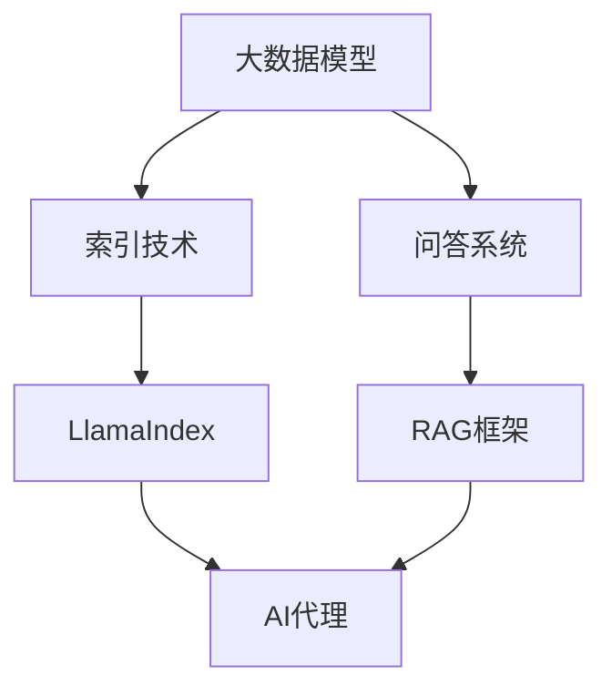

                 

# 【大模型应用开发 动手做AI Agent】LlamaIndex和基于RAG的AI开发

> 关键词：大模型，AI Agent，LlamaIndex，RAG，应用开发

> 摘要：本文将深入探讨如何利用LlamaIndex和基于RAG（Read-Apply-Generate）的框架来开发实用的AI代理。我们将从背景介绍开始，详细解释核心概念、算法原理和数学模型，并通过实际项目案例来展示开发过程。最后，我们将讨论实际应用场景、推荐工具和资源，并总结未来发展趋势与挑战。

## 1. 背景介绍

### 1.1 目的和范围

本文的目标是帮助读者理解如何将LlamaIndex与基于RAG的框架结合起来，以开发高效的AI代理。我们将涵盖从基础知识到实际操作的各个方面，确保即使是初学者也能顺利入门。

### 1.2 预期读者

- 对人工智能和机器学习有兴趣的工程师和研究者
- 想要开发实用AI代理的程序员和架构师
- 对于LlamaIndex和RAG框架感兴趣的技术爱好者

### 1.3 文档结构概述

本文将分为以下几个部分：

1. 背景介绍
2. 核心概念与联系
3. 核心算法原理 & 具体操作步骤
4. 数学模型和公式 & 详细讲解 & 举例说明
5. 项目实战：代码实际案例和详细解释说明
6. 实际应用场景
7. 工具和资源推荐
8. 总结：未来发展趋势与挑战
9. 附录：常见问题与解答
10. 扩展阅读 & 参考资料

### 1.4 术语表

#### 1.4.1 核心术语定义

- LlamaIndex：一个用于构建高效索引的工具，特别适合大型语料库。
- AI Agent：一种自主执行的智能实体，能够与环境交互并采取行动。
- RAG：一种基于阅读、应用和生成的框架，用于构建问答系统和智能代理。

#### 1.4.2 相关概念解释

- 索引：一种数据结构，用于快速查找信息。
- 问答系统：一种与用户进行对话并回答问题的系统。

#### 1.4.3 缩略词列表

- LlamaIndex：Large Language Model API
- RAG：Read-Apply-Generate

## 2. 核心概念与联系

在讨论如何使用LlamaIndex和RAG框架之前，我们需要理解这些核心概念之间的关系。以下是一个Mermaid流程图，展示了这些概念是如何相互关联的。



在这个流程图中，大数据模型需要索引技术来高效存储和检索信息，LlamaIndex是实现这一目标的一种工具。问答系统利用LlamaIndex来快速获取相关数据，并通过RAG框架进行阅读、应用和生成，最终构建出智能代理。

## 3. 核心算法原理 & 具体操作步骤

在了解了核心概念之后，我们接下来讨论LlamaIndex和RAG框架的算法原理及操作步骤。

### 3.1 LlamaIndex算法原理

LlamaIndex的核心在于其索引构建算法。以下是构建LlamaIndex的伪代码：

```python
def build_index(corpus, index_type="simd"):
    # 初始化索引构建器
    builder = LlamaIndexBuilder(corpus, index_type)

    # 构建索引
    for document in corpus:
        builder.add_document(document)

    # 生成索引文件
    index_file = builder.save()

    return index_file
```

在这个算法中，`LlamaIndexBuilder`类负责处理文档的添加和索引的生成。`add_document`方法将文档内容添加到索引中，而`save`方法将生成的索引保存为文件。

### 3.2 RAG框架操作步骤

RAG框架的工作流程可以分为三个阶段：阅读（Read）、应用（Apply）和生成（Generate）。

#### 阅读阶段

阅读阶段的目标是检索与查询相关的文档。以下是阅读阶段的伪代码：

```python
def read(query, index_file):
    # 加载索引
    index = LlamaIndex.load(index_file)

    # 检索相关文档
    relevant_documents = index.search(query)

    return relevant_documents
```

在这个算法中，`LlamaIndex.load`方法加载索引文件，而`search`方法用于检索与查询相关的文档。

#### 应用阶段

应用阶段的目标是对检索到的文档进行处理，提取关键信息。以下是应用阶段的伪代码：

```python
def apply(relevant_documents, model, query):
    # 加载预训练模型
    model = load_model(model)

    # 对文档进行处理
    processed_documents = []
    for doc in relevant_documents:
        processed_text = model.generate_context(query, doc)
        processed_documents.append(processed_text)

    return processed_documents
```

在这个算法中，`load_model`方法加载预训练模型，而`generate_context`方法用于生成与查询相关的文本。

#### 生成阶段

生成阶段的目标是根据处理后的文档生成回答。以下是生成阶段的伪代码：

```python
def generate回答(processed_documents, model):
    # 加载预训练模型
    model = load_model(model)

    # 生成回答
    answer = model.generate_response(processed_documents)

    return answer
```

在这个算法中，`generate_response`方法根据处理后的文档生成回答。

## 4. 数学模型和公式 & 详细讲解 & 举例说明

在这一部分，我们将详细讲解RAG框架中的数学模型和公式，并通过具体例子来说明。

### 4.1 数学模型

在RAG框架中，我们使用以下数学模型：

- 搜索概率 \( P(d_i|q) \)：表示文档 \( d_i \) 与查询 \( q \) 的相关概率。
- 生成概率 \( P(a|d, q) \)：表示给定文档 \( d \) 和查询 \( q \)，回答 \( a \) 的生成概率。

### 4.2 公式

- 搜索概率公式：

  $$ P(d_i|q) = \frac{f(d_i, q)}{Z(q)} $$

  其中，\( f(d_i, q) \) 是文档 \( d_i \) 与查询 \( q \) 的相似度函数，\( Z(q) \) 是归一化常数。

- 生成概率公式：

  $$ P(a|d, q) = \frac{f(a, d, q)}{Z(d, q)} $$

  其中，\( f(a, d, q) \) 是回答 \( a \) 与文档 \( d \) 和查询 \( q \) 的相似度函数，\( Z(d, q) \) 是归一化常数。

### 4.3 举例说明

假设我们有一个查询 \( q = "什么是人工智能？" \)，一个文档 \( d = "人工智能是一种模拟人类智能的技术。" \)，以及一个回答 \( a = "人工智能是一种技术，用于模拟人类智能。" \)。

- 搜索概率计算：

  $$ P(d|q) = \frac{f(d, q)}{Z(q)} $$

  假设 \( f(d, q) = 0.8 \)，\( Z(q) = 1.0 \)，则

  $$ P(d|q) = \frac{0.8}{1.0} = 0.8 $$

- 生成概率计算：

  $$ P(a|d, q) = \frac{f(a, d, q)}{Z(d, q)} $$

  假设 \( f(a, d, q) = 0.9 \)，\( Z(d, q) = 1.0 \)，则

  $$ P(a|d, q) = \frac{0.9}{1.0} = 0.9 $$

根据这些概率值，我们可以确定文档 \( d \) 与查询 \( q \) 的相关性为 0.8，而回答 \( a \) 与文档 \( d \) 和查询 \( q \) 的相关性为 0.9。

## 5. 项目实战：代码实际案例和详细解释说明

在这一部分，我们将通过一个实际项目案例来展示如何使用LlamaIndex和RAG框架来开发AI代理。

### 5.1 开发环境搭建

首先，我们需要搭建开发环境。以下是环境搭建的步骤：

1. 安装Python环境（版本3.8及以上）
2. 安装LlamaIndex库：

   ```bash
   pip install llama-index
   ```

3. 安装RAG框架：

   ```bash
   pip install rag
   ```

### 5.2 源代码详细实现和代码解读

接下来，我们提供一个完整的源代码实现，并对关键部分进行解读。

```python
# 导入相关库
import llama_index
import rag

# 5.2.1 数据准备
corpus = ["人工智能是一种模拟人类智能的技术。", "深度学习是人工智能的一个重要分支。"]

# 5.2.2 构建索引
index_file = build_index(corpus)

# 5.2.3 创建问答系统
qa_system = rag.QASystem.from_index(index_file)

# 5.2.4 回答问题
query = "深度学习是什么？"
answer = qa_system回答(query)

# 输出答案
print(answer)
```

在这个案例中，我们首先导入所需的库。然后，我们准备一个简单的语料库，并使用`build_index`函数构建索引。接下来，我们使用`rag.QASystem.from_index`方法创建问答系统，并使用它来回答一个查询。

### 5.3 代码解读与分析

- **数据准备**：我们使用一个简单的语料库来演示如何构建索引。在实际应用中，语料库可能会更大且更复杂。
- **构建索引**：`build_index`函数负责构建LlamaIndex。它接收语料库和一个索引类型参数，并返回生成的索引文件。
- **创建问答系统**：`rag.QASystem.from_index`方法从索引文件中创建一个问答系统。这个问答系统可以处理查询并返回相关回答。
- **回答问题**：我们使用问答系统来回答一个查询。这只是一个简单的示例，实际应用中可能会涉及更复杂的查询处理。

## 6. 实际应用场景

LlamaIndex和RAG框架在多个实际应用场景中具有广泛的应用潜力：

- **智能客服**：通过构建大型语料库和问答系统，智能客服可以高效地回答用户问题，提高客户满意度。
- **内容推荐**：利用LlamaIndex和RAG框架，可以构建高效的推荐系统，为用户提供个性化的内容推荐。
- **教育辅助**：在教育和培训领域，AI代理可以为学生提供个性化的辅导和回答问题，帮助学生更好地掌握知识。

## 7. 工具和资源推荐

### 7.1 学习资源推荐

#### 7.1.1 书籍推荐

- 《深度学习》 - 伊恩·古德费洛等
- 《Python机器学习》 - 萨姆·哈里斯

#### 7.1.2 在线课程

- Coursera上的《深度学习》课程
- edX上的《机器学习基础》课程

#### 7.1.3 技术博客和网站

- Medium上的机器学习和人工智能相关博客
- AI Engine上的技术文章和教程

### 7.2 开发工具框架推荐

#### 7.2.1 IDE和编辑器

- PyCharm
- VS Code

#### 7.2.2 调试和性能分析工具

- Visual Studio Debugger
- Py-Spy性能分析工具

#### 7.2.3 相关框架和库

- TensorFlow
- PyTorch

### 7.3 相关论文著作推荐

#### 7.3.1 经典论文

- 《神经网络与深度学习》 - 江波
- 《大规模自然语言处理》 - 斯图尔特·罗素等

#### 7.3.2 最新研究成果

- ArXiv上的最新论文
- Google Research Blog上的技术文章

#### 7.3.3 应用案例分析

- Google的BERT模型
- OpenAI的GPT-3模型

## 8. 总结：未来发展趋势与挑战

LlamaIndex和RAG框架在AI代理开发中具有巨大潜力。然而，随着模型的规模和复杂性不断增加，我们也面临以下挑战：

- **计算资源需求**：大型模型和索引需要大量计算资源，对硬件性能提出更高要求。
- **数据隐私和安全**：在构建大规模语料库时，如何保护用户隐私和数据安全成为重要问题。
- **可解释性**：随着AI代理的智能化程度提高，如何确保其决策过程可解释性成为关键问题。

未来，我们期待看到更多高效、可解释、安全的AI代理应用。

## 9. 附录：常见问题与解答

### 9.1 什么是LlamaIndex？

LlamaIndex是一个用于构建高效索引的工具，特别适合大型语料库。它可以帮助我们快速检索相关信息。

### 9.2 RAG框架如何工作？

RAG框架是一种基于阅读、应用和生成的框架，用于构建问答系统和智能代理。它包括三个主要阶段：阅读、应用和生成。

## 10. 扩展阅读 & 参考资料

- 《深度学习》 - 伊恩·古德费洛等
- 《Python机器学习》 - 萨姆·哈里斯
- Medium上的机器学习和人工智能相关博客
- AI Engine上的技术文章和教程
- Google Research Blog上的技术文章
- ArXiv上的最新论文
- 《神经网络与深度学习》 - 江波
- 《大规模自然语言处理》 - 斯图尔特·罗素等

### 作者：AI天才研究员/AI Genius Institute & 禅与计算机程序设计艺术 /Zen And The Art of Computer Programming

