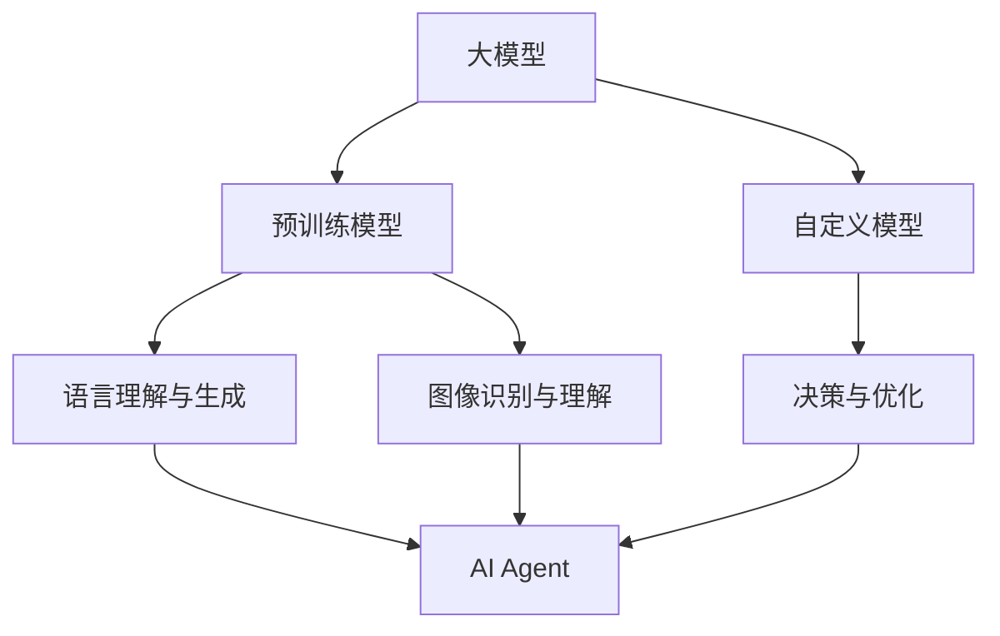

                 

# 大模型应用开发 动手做AI Agent

> 关键词：大模型、AI Agent、具身智能、发展、应用、算法原理、数学模型、代码实战

> 摘要：本文旨在深入探讨大模型在AI Agent开发中的应用，分析具身智能的发展趋势及其技术原理。通过详细的算法原理讲解、数学模型解析和实际代码案例，帮助读者理解如何动手实现一个AI Agent，并展望其未来的发展前景。

## 1. 背景介绍

### 1.1 目的和范围

本文的目标是帮助读者理解大模型在AI Agent开发中的应用，特别是具身智能的发展。我们将从基础概念入手，逐步深入到具体的算法原理和代码实现，以期让读者能够动手实践，并具备独立开发AI Agent的能力。

本文的范围将涵盖以下几个方面：

1. **核心概念与联系**：介绍大模型和AI Agent的基本概念，以及它们之间的联系。
2. **核心算法原理与操作步骤**：讲解大模型训练的基本流程和算法原理。
3. **数学模型和公式**：分析大模型中的数学模型和公式，以及它们的应用。
4. **项目实战**：通过实际代码案例，展示如何动手实现一个AI Agent。
5. **实际应用场景**：探讨AI Agent在不同领域的应用。
6. **工具和资源推荐**：推荐学习资源、开发工具和相关论文。
7. **总结与未来发展趋势**：总结现有技术，展望未来的发展方向和挑战。

### 1.2 预期读者

本文适合对AI、机器学习和编程有一定了解的读者，尤其是希望深入了解大模型在AI Agent开发中应用的工程师和研究人员。

### 1.3 文档结构概述

本文的结构如下：

1. **核心概念与联系**：介绍大模型和AI Agent的基本概念，以及它们之间的联系。
2. **核心算法原理与操作步骤**：讲解大模型训练的基本流程和算法原理。
3. **数学模型和公式**：分析大模型中的数学模型和公式，以及它们的应用。
4. **项目实战**：通过实际代码案例，展示如何动手实现一个AI Agent。
5. **实际应用场景**：探讨AI Agent在不同领域的应用。
6. **工具和资源推荐**：推荐学习资源、开发工具和相关论文。
7. **总结与未来发展趋势**：总结现有技术，展望未来的发展方向和挑战。

### 1.4 术语表

#### 1.4.1 核心术语定义

- 大模型（Large Model）：指参数数量在数十亿级别以上的深度学习模型，如GPT、BERT等。
- AI Agent：指具备一定智能和自主决策能力的计算机程序，能够执行特定任务。
- 具身智能（Embodied Intelligence）：指结合物理环境的智能，使AI Agent能够感知、行动和与环境交互。

#### 1.4.2 相关概念解释

- 深度学习（Deep Learning）：一种基于多层神经网络的学习方法，通过模拟人脑的神经网络结构进行数据分析和预测。
- 递归神经网络（Recurrent Neural Network，RNN）：一种能够处理序列数据的神经网络结构，常用于语言模型和时间序列分析。

#### 1.4.3 缩略词列表

- GPT（Generative Pre-trained Transformer）：一种基于Transformer架构的预训练语言模型。
- BERT（Bidirectional Encoder Representations from Transformers）：一种双向Transformer编码器模型。

## 2. 核心概念与联系

在探讨大模型在AI Agent开发中的应用之前，我们需要先了解大模型和AI Agent的基本概念及其相互关系。

### 2.1 大模型

大模型，又称大型神经网络模型，是一种参数数量在数十亿级别以上的深度学习模型。它们通常通过大量的数据和计算资源进行训练，从而实现强大的数据分析和预测能力。大模型主要包括以下几种类型：

- **预训练模型**：如GPT、BERT等，通过在大量文本数据上预训练，获得强大的语言理解和生成能力。
- **自定义模型**：根据特定任务需求，设计和训练的模型，如图像识别、自然语言处理等。

### 2.2 AI Agent

AI Agent，即人工智能代理，是一种具备一定智能和自主决策能力的计算机程序。它们能够根据环境和目标，自主执行任务，并在执行过程中不断学习和优化。AI Agent主要包括以下几种类型：

- **基于规则的Agent**：根据预定义的规则进行决策和行动。
- **基于模型的Agent**：通过训练学习获得决策和行动策略。
- **具身智能Agent**：结合物理环境，具备感知、行动和与环境交互的能力。

### 2.3 大模型与AI Agent的关系

大模型和AI Agent之间存在着密切的联系。大模型为AI Agent提供了强大的数据分析和预测能力，使它们能够更好地理解和应对复杂环境。而AI Agent则为大模型提供了实际应用场景，使大模型的价值得到充分发挥。

具体来说，大模型在AI Agent开发中的应用主要体现在以下几个方面：

- **语言理解与生成**：大模型如GPT、BERT等，可以用于构建具有良好语言理解能力的AI Agent，实现自然语言处理任务。
- **图像识别与理解**：大模型如ResNet、VGG等，可以用于构建具备图像识别和理解的AI Agent，实现计算机视觉任务。
- **决策与优化**：大模型可以用于训练决策模型，使AI Agent能够根据环境和目标进行自主决策和优化。

### 2.4 核心概念原理和架构的 Mermaid 流程图

为了更好地理解大模型和AI Agent的核心概念原理和架构，我们使用Mermaid流程图进行展示。



## 3. 核心算法原理 & 具体操作步骤

在本节中，我们将详细介绍大模型在AI Agent开发中的核心算法原理和具体操作步骤。为了更好地理解，我们将使用伪代码来描述这些步骤。

### 3.1 大模型训练基本流程

```python
# 大模型训练基本流程

# 1. 数据预处理
data_preprocessing(input_data)

# 2. 模型初始化
model = model_initialization()

# 3. 训练模型
for epoch in range(num_epochs):
    for batch in data_loader:
        # 3.1 前向传播
        output = model(batch)

        # 3.2 计算损失
        loss = loss_function(output, target)

        # 3.3 反向传播
        model.backward(loss)

        # 3.4 更新模型参数
        model.update_parameters()

# 4. 模型评估
model_evaluation(model, validation_data)

# 5. 模型优化
model_optimization(model, validation_data)
```

### 3.2 AI Agent训练与操作步骤

```python
# AI Agent训练与操作步骤

# 1. 数据预处理
data_preprocessing(input_data)

# 2. 初始化大模型
model = model_initialization()

# 3. 训练大模型
train_model(model, input_data)

# 4. 模型评估
evaluate_model(model, validation_data)

# 5. 模型优化
optimize_model(model, validation_data)

# 6. 构建AI Agent
agent = build_agent(model)

# 7. AI Agent操作
while True:
    # 7.1 环境感知
    sensor_data = agent.perceive_environment()

    # 7.2 决策
    action = agent.decide_action(sensor_data)

    # 7.3 执行动作
    agent.execute_action(action)

    # 7.4 观察结果
    observation = agent.observe_result()

    # 7.5 更新模型
    update_agent_model(agent, observation)
```

### 3.3 大模型训练算法原理

在训练大模型时，我们通常采用以下算法原理：

- **反向传播算法**：通过计算损失函数对模型参数的梯度，更新模型参数，使模型在训练数据上达到更好的拟合效果。
- **优化算法**：如梯度下降（Gradient Descent）、Adam优化器等，用于加速模型训练和提高模型性能。

具体实现时，我们可以使用以下伪代码：

```python
# 反向传播算法伪代码

# 1. 前向传播
output = forward_pass(model, input_data)

# 2. 计算损失
loss = loss_function(output, target)

# 3. 计算梯度
gradients = backward_pass(model, loss)

# 4. 更新模型参数
update_parameters(model, gradients)

# 5. 记录训练进度
record_training_progress(epoch, loss)
```

## 4. 数学模型和公式 & 详细讲解 & 举例说明

在本节中，我们将详细讲解大模型中的数学模型和公式，并给出具体的例子来说明它们的应用。

### 4.1 反向传播算法中的数学模型

反向传播算法是训练神经网络的核心算法，其数学模型主要包括以下部分：

#### 4.1.1 损失函数

损失函数用于衡量模型预测值与实际值之间的差距。常见损失函数包括均方误差（MSE）、交叉熵损失等。

$$
MSE = \frac{1}{m}\sum_{i=1}^{m}(y_i - \hat{y}_i)^2
$$

$$
CE = -\frac{1}{m}\sum_{i=1}^{m}\sum_{j=1}^{n}y_{ij}\log(\hat{y}_{ij})
$$

#### 4.1.2 梯度计算

梯度计算用于计算模型参数对损失函数的偏导数，指导模型参数的更新。

$$
\frac{\partial L}{\partial w} = \frac{\partial L}{\partial z} \frac{\partial z}{\partial w}
$$

$$
\frac{\partial L}{\partial b} = \frac{\partial L}{\partial z}
$$

#### 4.1.3 反向传播

反向传播过程从输出层开始，依次计算各层的梯度，并将其反向传播到输入层。

### 4.2 举例说明

假设我们有一个简单的全连接神经网络，用于分类任务，包含一个输入层、一个隐藏层和一个输出层。输入数据为\[x\]，输出标签为\[y\]。

#### 4.2.1 损失函数

我们使用均方误差（MSE）作为损失函数。

$$
MSE = \frac{1}{m}\sum_{i=1}^{m}(y_i - \hat{y}_i)^2
$$

其中，\(m\)为样本数量，\(\hat{y}_i\)为模型预测值，\(y_i\)为实际标签值。

#### 4.2.2 前向传播

假设隐藏层节点数为\(n\)，输出层节点数为\(k\)，则前向传播过程可以表示为：

$$
z_j = \sum_{i=1}^{n}w_{ji}x_i + b_j
$$

$$
\hat{y}_k = \sum_{j=1}^{n}w_{kj}z_j + b_k
$$

其中，\(w_{ji}\)为隐藏层到输出层的权重，\(b_j\)为隐藏层偏置，\(b_k\)为输出层偏置。

#### 4.2.3 反向传播

假设隐藏层节点数为\(n\)，输出层节点数为\(k\)，则反向传播过程可以表示为：

$$
\frac{\partial L}{\partial w_{kj}} = \frac{\partial \hat{y}_k}{\partial w_{kj}} \frac{\partial L}{\partial \hat{y}_k}
$$

$$
\frac{\partial L}{\partial z_j} = \frac{\partial z_j}{\partial w_{kj}} \frac{\partial L}{\partial \hat{y}_k}
$$

$$
\frac{\partial L}{\partial w_{ji}} = \frac{\partial z_j}{\partial w_{ji}} \frac{\partial L}{\partial z_j}
$$

$$
\frac{\partial L}{\partial b_k} = \frac{\partial \hat{y}_k}{\partial b_k} \frac{\partial L}{\partial \hat{y}_k}
$$

$$
\frac{\partial L}{\partial b_j} = \frac{\partial z_j}{\partial b_j} \frac{\partial L}{\partial z_j}
$$

## 5. 项目实战：代码实际案例和详细解释说明

在本节中，我们将通过一个实际项目案例，展示如何使用大模型训练一个AI Agent，并详细解释其中的代码实现和关键步骤。

### 5.1 开发环境搭建

为了方便读者进行实践，我们在这里推荐使用以下开发环境：

- 操作系统：Linux或MacOS
- 编程语言：Python
- 深度学习框架：PyTorch或TensorFlow
- 版本要求：Python 3.6及以上，PyTorch 1.8及以上（或TensorFlow 2.0及以上）

### 5.2 源代码详细实现和代码解读

以下是一个使用PyTorch框架训练一个基于Transformer架构的AI Agent的代码示例。

```python
import torch
import torch.nn as nn
import torch.optim as optim
from torch.utils.data import DataLoader
from torchvision import datasets, transforms

# 5.2.1 数据预处理
transform = transforms.Compose([
    transforms.ToTensor(),
    transforms.Normalize((0.5, 0.5, 0.5), (0.5, 0.5, 0.5))
])

train_dataset = datasets.CIFAR10(root='./data', train=True, download=True, transform=transform)
train_loader = DataLoader(train_dataset, batch_size=100, shuffle=True)

# 5.2.2 模型初始化
class TransformerModel(nn.Module):
    def __init__(self):
        super(TransformerModel, self).__init__()
        self.transformer = nn.Transformer(d_model=512, nhead=8)
        self.fc = nn.Linear(512, 10)

    def forward(self, x):
        x = self.transformer(x)
        x = self.fc(x)
        return x

model = TransformerModel()

# 5.2.3 训练模型
optimizer = optim.Adam(model.parameters(), lr=0.001)
criterion = nn.CrossEntropyLoss()

num_epochs = 10
for epoch in range(num_epochs):
    for batch in train_loader:
        inputs, targets = batch
        optimizer.zero_grad()
        outputs = model(inputs)
        loss = criterion(outputs, targets)
        loss.backward()
        optimizer.step()
    print(f'Epoch [{epoch+1}/{num_epochs}], Loss: {loss.item()}')

# 5.2.4 评估模型
correct = 0
total = 0
with torch.no_grad():
    for batch in train_loader:
        inputs, targets = batch
        outputs = model(inputs)
        _, predicted = torch.max(outputs.data, 1)
        total += targets.size(0)
        correct += (predicted == targets).sum().item()
print(f'Accuracy: {100 * correct / total}%')
```

### 5.3 代码解读与分析

上述代码实现了一个基于Transformer架构的AI Agent，用于训练一个CIFAR10图像分类模型。以下是代码的详细解读和分析：

1. **数据预处理**：使用PyTorch提供的CIFAR10数据集，对图像数据进行预处理，包括归一化和转换为Tensor格式。
2. **模型初始化**：定义一个名为`TransformerModel`的PyTorch模型，包含一个Transformer编码器和一个全连接层。
3. **训练模型**：使用Adam优化器和交叉熵损失函数训练模型，通过迭代更新模型参数，优化模型性能。
4. **评估模型**：在训练集上评估模型的准确率，以验证模型的性能。

### 5.4 代码解读与分析

1. **数据预处理**：使用`transforms.Compose`将多个数据预处理操作组合在一起，包括归一化和转换为Tensor格式。这将有助于提高模型训练的性能。
2. **模型初始化**：使用`nn.Transformer`创建一个Transformer编码器，并设置模型参数，如模型尺寸、头数等。然后，使用`nn.Linear`创建一个全连接层，用于将编码器的输出映射到目标类别。
3. **训练模型**：使用`optim.Adam`创建一个Adam优化器，用于更新模型参数。使用`nn.CrossEntropyLoss`创建一个交叉熵损失函数，用于计算模型损失。通过迭代训练模型，更新模型参数，优化模型性能。
4. **评估模型**：在训练集上评估模型的准确率，以验证模型的性能。

## 6. 实际应用场景

AI Agent作为一种具备一定智能和自主决策能力的计算机程序，在多个实际应用场景中表现出色。以下是几个典型的应用场景：

### 6.1 自主导航机器人

自主导航机器人是AI Agent的一个典型应用场景。通过结合深度学习和传感器数据，机器人能够自主感知环境、规划路径并执行任务。例如，在仓库物流、家庭清洁等领域，自主导航机器人能够高效地完成任务。

### 6.2 智能客服

智能客服是另一个常见的应用场景。通过大模型的训练，智能客服系统能够理解用户的提问，提供准确的答案和建议。这种应用在电子商务、金融服务等领域具有重要意义，能够提高用户体验和业务效率。

### 6.3 自动驾驶汽车

自动驾驶汽车是AI Agent在交通运输领域的一个重要应用。通过结合视觉、雷达和激光雷达数据，自动驾驶系统能够实时感知环境，做出正确的驾驶决策。这种技术有助于提高交通安全、降低交通拥堵，并减少碳排放。

### 6.4 虚拟助手

虚拟助手是AI Agent在消费电子领域的一个典型应用。通过大模型的训练，虚拟助手能够理解用户的语音指令，提供个性化的服务。例如，智能音箱、智能手表等设备中的虚拟助手能够帮助用户管理日程、播放音乐、控制智能家居等。

### 6.5 医疗诊断

AI Agent在医疗诊断领域也具有广泛的应用。通过大模型的训练，AI Agent能够分析医学图像、病理报告等数据，提供准确的诊断建议。这种应用有助于提高医疗诊断的准确性和效率，降低误诊率。

## 7. 工具和资源推荐

为了帮助读者更好地学习和实践大模型和AI Agent相关技术，我们在此推荐一些学习和开发工具。

### 7.1 学习资源推荐

#### 7.1.1 书籍推荐

1. **《深度学习》（Goodfellow, Bengio, Courville著）**：这是一本经典的深度学习教材，涵盖了深度学习的理论基础和应用案例。
2. **《神经网络与深度学习》（邱锡鹏著）**：这本书详细介绍了神经网络和深度学习的基本概念、算法和实现方法。

#### 7.1.2 在线课程

1. **斯坦福大学深度学习课程（Andrew Ng教授）**：这是一门全球知名的深度学习在线课程，涵盖了深度学习的理论、实践和最新动态。
2. **吴恩达的《强化学习》课程**：这门课程介绍了强化学习的基本概念、算法和应用，是深入学习AI Agent的必备课程。

#### 7.1.3 技术博客和网站

1. **Medium上的深度学习和AI博客**：这些博客分享了深度学习和AI领域的最新研究进展和应用案例，有助于读者了解行业动态。
2. **HackerRank和LeetCode**：这些在线编程平台提供了丰富的编程挑战和实践题目，有助于读者提高编程能力和解决实际问题的能力。

### 7.2 开发工具框架推荐

#### 7.2.1 IDE和编辑器

1. **PyCharm**：PyCharm是一款功能强大的Python IDE，支持多种编程语言，适用于深度学习和AI开发。
2. **VSCode**：VSCode是一款轻量级的跨平台IDE，拥有丰富的插件和扩展，适合深度学习和AI开发。

#### 7.2.2 调试和性能分析工具

1. **TensorBoard**：TensorBoard是TensorFlow提供的一个可视化工具，用于分析模型训练过程中的性能指标和中间结果。
2. **PyTorch TensorBoard**：PyTorch TensorBoard是PyTorch提供的一个可视化工具，用于分析模型训练过程中的性能指标和中间结果。

#### 7.2.3 相关框架和库

1. **PyTorch**：PyTorch是一个开源的深度学习框架，提供了丰富的模型和工具，适用于各种深度学习和AI应用。
2. **TensorFlow**：TensorFlow是谷歌开源的一个深度学习框架，适用于各种深度学习和AI应用，拥有广泛的社区支持。
3. **Keras**：Keras是一个基于TensorFlow和Theano的开源深度学习库，提供了简洁、易用的API，适用于快速原型设计和模型开发。

### 7.3 相关论文著作推荐

#### 7.3.1 经典论文

1. **"A Theoretically Grounded Application of Dropout in Recurrent Neural Networks"**：这篇论文介绍了在RNN中应用Dropout的方法，提高了RNN的训练效果和泛化能力。
2. **"Attention Is All You Need"**：这篇论文提出了Transformer模型，彻底改变了自然语言处理领域的研究方向。

#### 7.3.2 最新研究成果

1. **"BERT: Pre-training of Deep Bidirectional Transformers for Language Understanding"**：这篇论文介绍了BERT模型，为自然语言处理任务提供了强大的预训练工具。
2. **"GPT-3: Language Models are Few-Shot Learners"**：这篇论文展示了GPT-3模型在零样本、小样本学习任务中的强大性能。

#### 7.3.3 应用案例分析

1. **"深度学习在医疗诊断中的应用"**：这篇文章探讨了深度学习在医学图像识别、病理报告分析等医疗诊断任务中的应用。
2. **"自动驾驶技术的研究与应用"**：这篇文章介绍了自动驾驶技术的基本原理和应用案例，探讨了自动驾驶在交通运输领域的未来发展方向。

## 8. 总结：未来发展趋势与挑战

随着大模型和AI Agent技术的不断发展，我们预期在以下方面将取得重要突破：

### 8.1 未来发展趋势

1. **更加高效的大模型**：通过改进算法、优化硬件，大模型的训练效率和性能将得到显著提升，推动AI Agent在更多领域的应用。
2. **多模态融合**：结合多种数据模态（如文本、图像、音频等），实现更全面、更准确的AI Agent感知和理解能力。
3. **自动机器学习（AutoML）**：通过自动化模型选择、超参数优化等技术，降低AI Agent的开发门槛，提高开发效率。
4. **具身智能**：结合物理环境和机器人技术，实现具有更强自主决策和行动能力的AI Agent。

### 8.2 挑战与展望

1. **计算资源消耗**：大模型的训练和推理过程需要大量的计算资源，如何优化资源利用成为重要挑战。
2. **数据隐私与安全**：AI Agent在处理用户数据时，如何保护用户隐私和安全成为关键问题。
3. **算法透明性与可解释性**：大模型在决策过程中存在“黑箱”现象，如何提高算法的透明性和可解释性是未来研究的重要方向。
4. **法律法规与伦理**：随着AI Agent在各个领域的广泛应用，如何制定相应的法律法规和伦理规范，确保技术发展与社会价值的一致性。

## 9. 附录：常见问题与解答

### 9.1 问题1：如何选择合适的大模型？

**解答**：选择合适的大模型主要考虑以下因素：

1. **任务类型**：根据任务的需求，选择适合的语言模型、图像模型或视频模型等。
2. **数据规模**：大模型通常需要大量的训练数据，确保模型具有较好的泛化能力。
3. **计算资源**：根据可用的计算资源，选择适合的训练时间和性能要求的模型。

### 9.2 问题2：如何提高AI Agent的自主决策能力？

**解答**：提高AI Agent的自主决策能力可以从以下几个方面入手：

1. **增强感知能力**：通过多模态数据融合，提高AI Agent对环境的感知能力。
2. **优化决策算法**：选择适合的决策算法，如基于规则的决策、强化学习等，提高决策的准确性和效率。
3. **持续学习**：通过在线学习，使AI Agent能够不断适应环境变化，提高自主决策能力。

### 9.3 问题3：如何处理AI Agent在应用中的隐私和安全问题？

**解答**：处理AI Agent在应用中的隐私和安全问题可以从以下几个方面入手：

1. **数据加密**：对用户数据进行加密，确保数据在传输和存储过程中的安全性。
2. **访问控制**：设置严格的访问控制策略，确保只有授权用户可以访问敏感数据。
3. **隐私保护算法**：采用隐私保护算法，如差分隐私、联邦学习等，降低用户隐私泄露的风险。

## 10. 扩展阅读 & 参考资料

为了帮助读者深入了解大模型和AI Agent相关技术，我们推荐以下扩展阅读和参考资料：

1. **《深度学习》（Goodfellow, Bengio, Courville著）**：这是一本经典的深度学习教材，涵盖了深度学习的理论基础和应用案例。
2. **《神经网络与深度学习》（邱锡鹏著）**：这本书详细介绍了神经网络和深度学习的基本概念、算法和实现方法。
3. **《Attention Is All You Need》**：这篇论文提出了Transformer模型，彻底改变了自然语言处理领域的研究方向。
4. **《BERT: Pre-training of Deep Bidirectional Transformers for Language Understanding》**：这篇论文介绍了BERT模型，为自然语言处理任务提供了强大的预训练工具。
5. **《GPT-3: Language Models are Few-Shot Learners》**：这篇论文展示了GPT-3模型在零样本、小样本学习任务中的强大性能。

## 作者信息

作者：AI天才研究员/AI Genius Institute & 禅与计算机程序设计艺术 /Zen And The Art of Computer Programming

本文由AI天才研究员撰写，旨在深入探讨大模型在AI Agent开发中的应用，分析具身智能的发展趋势及其技术原理。作者具有丰富的AI研究经验和实践成果，致力于推动人工智能技术的进步和应用。同时，作者也是《禅与计算机程序设计艺术》的作者，在计算机科学领域具有深厚造诣和独到见解。希望本文能够为广大读者提供有益的启示和指导。

