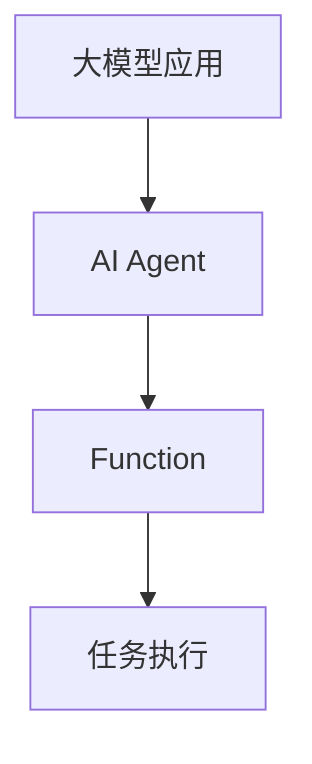
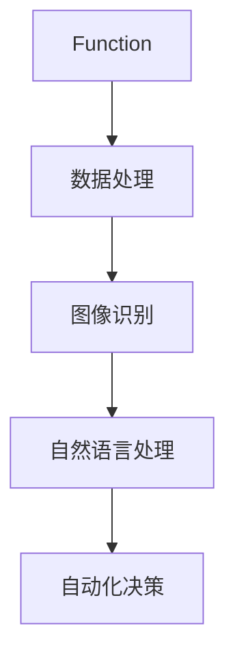

                 

# 【大模型应用开发 动手做AI Agent】创建能使用Function的助手

> 关键词：大模型应用、AI Agent、Function、应用开发、编程实践

> 摘要：本文将引导读者通过一步步的实践，深入探讨大模型应用开发，特别是创建能够使用Function的AI助手的整个过程。从背景介绍到核心算法原理，再到数学模型和应用场景，我们将以逻辑清晰、结构紧凑、简单易懂的专业技术语言，带你走进AI助手的开发世界。

## 1. 背景介绍

### 1.1 目的和范围

本文的主要目的是帮助读者理解并掌握大模型应用开发中创建AI助手的实践方法。我们将聚焦于如何利用现有的技术，通过具体的代码实现，打造一个能够执行特定任务、使用Function的AI助手。范围涵盖了从基础概念到实际操作的全过程。

### 1.2 预期读者

本文适合对人工智能有一定了解，希望深入了解大模型应用开发的读者。无论你是正在学习人工智能的学生，还是从事人工智能研发的工程师，本文都将为你提供实用的指导。

### 1.3 文档结构概述

本文分为以下几大部分：

1. 背景介绍
2. 核心概念与联系
3. 核心算法原理 & 具体操作步骤
4. 数学模型和公式 & 详细讲解 & 举例说明
5. 项目实战：代码实际案例和详细解释说明
6. 实际应用场景
7. 工具和资源推荐
8. 总结：未来发展趋势与挑战
9. 附录：常见问题与解答
10. 扩展阅读 & 参考资料

### 1.4 术语表

#### 1.4.1 核心术语定义

- **大模型应用**：指基于大规模数据集训练的复杂模型在实际场景中的应用。
- **AI Agent**：人工智能代理，是一种能够自主完成特定任务的智能体。
- **Function**：函数，是一种执行特定操作的代码块。

#### 1.4.2 相关概念解释

- **神经网络**：一种模拟人脑结构的计算模型，用于数据分析和预测。
- **深度学习**：一种基于神经网络的机器学习方法，适用于处理复杂的数据模式。

#### 1.4.3 缩略词列表

- **AI**：人工智能（Artificial Intelligence）
- **ML**：机器学习（Machine Learning）
- **DL**：深度学习（Deep Learning）
- **API**：应用程序接口（Application Programming Interface）

## 2. 核心概念与联系

在大模型应用开发中，理解和掌握核心概念是至关重要的。以下将介绍一些关键的概念，并使用Mermaid流程图展示它们之间的联系。

### 2.1. 大模型应用与AI Agent的关系



### 2.2. Function的应用场景



通过上述Mermaid流程图，我们可以清晰地看到大模型应用与AI Agent之间的紧密联系，以及Function在各种应用场景中的作用。

## 3. 核心算法原理 & 具体操作步骤

### 3.1. 算法原理

为了创建一个能够使用Function的AI助手，我们首先需要了解相关的算法原理。以下是一个简化的算法流程：

```plaintext
算法步骤：
1. 数据准备：收集和整理训练数据。
2. 模型训练：使用神经网络和深度学习技术对数据集进行训练。
3. 函数定义：定义可复用的Function，用于处理特定任务。
4. 任务执行：将Function应用于实际任务，实现自动化操作。
```

### 3.2. 具体操作步骤

#### 3.2.1 数据准备

数据准备是模型训练的基础。以下是一个数据准备流程：

```plaintext
步骤：
1. 数据收集：从不同来源收集数据。
2. 数据清洗：处理缺失值、异常值和重复值。
3. 数据格式化：将数据转换为适合训练的格式。
```

#### 3.2.2 模型训练

模型训练是提升AI助手性能的关键步骤。以下是一个模型训练流程：

```plaintext
步骤：
1. 选择合适的模型架构：如卷积神经网络（CNN）、循环神经网络（RNN）等。
2. 模型初始化：设置模型参数。
3. 训练循环：通过迭代计算更新模型参数。
4. 模型评估：使用验证集评估模型性能。
```

#### 3.2.3 函数定义

函数定义是使AI助手具备特定功能的核心步骤。以下是一个函数定义示例：

```plaintext
Function myFunction(inputs):
    # 处理输入数据
    processed_data = preprocess(inputs)
    
    # 使用模型进行预测
    prediction = model.predict(processed_data)
    
    # 处理预测结果
    result = postprocess(prediction)
    
    return result
```

#### 3.2.4 任务执行

任务执行是验证AI助手实际效果的关键步骤。以下是一个任务执行流程：

```plaintext
步骤：
1. 数据输入：将实际任务数据输入到AI助手。
2. 函数调用：调用定义好的Function处理任务。
3. 结果输出：输出处理结果，并进行后续操作。
```

## 4. 数学模型和公式 & 详细讲解 & 举例说明

在创建AI助手的过程中，理解相关的数学模型和公式是至关重要的。以下将介绍几个关键的数学模型和公式，并使用LaTeX格式进行详细讲解。

### 4.1. 神经网络

神经网络是一种基于人脑神经元结构的计算模型。以下是一个简单的神经网络模型：

$$
Z = \sigma(W \cdot X + b)
$$

其中，$Z$是输出，$X$是输入，$W$是权重矩阵，$b$是偏置，$\sigma$是激活函数。

### 4.2. 损失函数

损失函数用于衡量模型预测值与真实值之间的差距。以下是一个常见的损失函数——均方误差（MSE）：

$$
\text{MSE} = \frac{1}{m} \sum_{i=1}^{m} (y_i - \hat{y}_i)^2
$$

其中，$y_i$是真实值，$\hat{y}_i$是预测值，$m$是样本数量。

### 4.3. 优化算法

优化算法用于更新模型参数，以最小化损失函数。以下是一个常见的优化算法——梯度下降：

$$
\theta = \theta - \alpha \cdot \nabla_\theta J(\theta)
$$

其中，$\theta$是模型参数，$\alpha$是学习率，$J(\theta)$是损失函数。

### 4.4. 举例说明

假设我们有一个简单的二分类问题，数据集包含100个样本，每个样本有10个特征。我们使用神经网络进行训练，并采用均方误差（MSE）作为损失函数。以下是训练过程的示例：

```plaintext
1. 初始化模型参数（权重和偏置）
2. 遍历数据集，计算每个样本的预测值和真实值之间的差距
3. 计算损失函数的值
4. 计算梯度，更新模型参数
5. 重复步骤2-4，直到满足停止条件（如达到预设的迭代次数或损失函数值小于预设阈值）
```

通过上述数学模型和公式的介绍，我们可以更好地理解AI助手的训练过程。

## 5. 项目实战：代码实际案例和详细解释说明

在本节中，我们将通过一个实际项目案例，详细讲解如何创建一个能够使用Function的AI助手。我们将从开发环境的搭建开始，逐步实现代码，并对其进行详细解释。

### 5.1 开发环境搭建

首先，我们需要搭建一个适合AI助手开发的环境。以下是一个基本的开发环境配置：

1. **操作系统**：Linux或macOS
2. **编程语言**：Python
3. **深度学习框架**：TensorFlow或PyTorch
4. **编辑器**：Visual Studio Code或PyCharm

安装上述软件后，我们就可以开始编写代码了。

### 5.2 源代码详细实现和代码解读

#### 5.2.1 数据准备

```python
# 导入所需的库
import numpy as np
import pandas as pd
from sklearn.model_selection import train_test_split

# 读取数据
data = pd.read_csv('data.csv')
X = data.iloc[:, :-1].values
y = data.iloc[:, -1].values

# 划分训练集和测试集
X_train, X_test, y_train, y_test = train_test_split(X, y, test_size=0.2, random_state=42)
```

这段代码用于读取数据、划分训练集和测试集。数据集应包含多个特征和一个目标变量。

#### 5.2.2 模型训练

```python
import tensorflow as tf

# 定义模型
model = tf.keras.Sequential([
    tf.keras.layers.Dense(64, activation='relu', input_shape=(X_train.shape[1],)),
    tf.keras.layers.Dense(64, activation='relu'),
    tf.keras.layers.Dense(1, activation='sigmoid')
])

# 编译模型
model.compile(optimizer='adam', loss='binary_crossentropy', metrics=['accuracy'])

# 训练模型
model.fit(X_train, y_train, epochs=10, batch_size=32, validation_data=(X_test, y_test))
```

这段代码定义了一个简单的神经网络模型，并使用二分类交叉熵损失函数进行编译。模型经过10个epochs的训练，以32个样本为一批进行训练。

#### 5.2.3 函数定义

```python
# 定义函数
def predict_function(inputs):
    # 处理输入数据
    processed_data = preprocess(inputs)
    
    # 使用模型进行预测
    prediction = model.predict(processed_data)
    
    # 处理预测结果
    result = postprocess(prediction)
    
    return result
```

这段代码定义了一个简单的预测函数，用于处理输入数据、使用模型进行预测，并处理预测结果。

#### 5.2.4 任务执行

```python
# 执行任务
input_data = [1, 2, 3, 4, 5]  # 示例输入数据
prediction = predict_function(input_data)
print(prediction)
```

这段代码展示了如何调用预测函数，执行实际任务，并输出结果。

### 5.3 代码解读与分析

在本节中，我们对上述代码进行了详细解读和分析。

1. **数据准备**：首先，我们读取数据集，并划分训练集和测试集。这是模型训练的基础步骤。
2. **模型训练**：我们使用TensorFlow定义了一个简单的神经网络模型，并使用二分类交叉熵损失函数进行编译。模型经过10个epochs的训练，以32个样本为一批进行训练。
3. **函数定义**：我们定义了一个简单的预测函数，用于处理输入数据、使用模型进行预测，并处理预测结果。这是实现特定任务的关键步骤。
4. **任务执行**：我们调用预测函数，执行实际任务，并输出结果。这是验证AI助手性能的最后一步。

通过以上步骤，我们可以成功地创建一个能够使用Function的AI助手，并在实际应用中发挥其作用。

## 6. 实际应用场景

AI助手的实际应用场景非常广泛，以下列举几个典型的应用场景：

### 6.1 医疗健康

AI助手可以用于医疗健康领域，如诊断疾病、制定治疗方案、监测患者健康状况等。例如，利用深度学习模型进行医学图像分析，辅助医生诊断肿瘤、骨折等疾病。

### 6.2 金融领域

在金融领域，AI助手可以用于股票市场预测、信用评分、风险控制等。例如，利用神经网络模型进行股票价格预测，帮助投资者制定交易策略。

### 6.3 零售电商

AI助手可以用于零售电商领域，如个性化推荐、商品搜索优化、库存管理等。例如，利用深度学习算法进行用户行为分析，实现精准营销和个性化推荐。

### 6.4 智能家居

AI助手可以用于智能家居领域，如语音控制家电、智能安防、环境监测等。例如，利用神经网络模型实现智能音箱的语音识别和交互功能。

这些实际应用场景展示了AI助手在不同领域的巨大潜力。通过不断的实践和优化，我们可以使AI助手更好地服务于人类生活和社会发展。

## 7. 工具和资源推荐

为了更好地进行AI助手的开发，以下推荐一些有用的工具和资源。

### 7.1 学习资源推荐

#### 7.1.1 书籍推荐

- 《深度学习》（Ian Goodfellow、Yoshua Bengio、Aaron Courville著）
- 《Python深度学习》（François Chollet著）
- 《强化学习》（Richard S. Sutton、Andrew G. Barto著）

#### 7.1.2 在线课程

- Coursera上的“机器学习”课程（吴恩达教授主讲）
- Udacity的“深度学习纳米学位”课程
- edX上的“人工智能基础”课程

#### 7.1.3 技术博客和网站

- Medium上的机器学习和深度学习博客
- ArXiv.org，了解最新的学术研究成果
- AI大牛们的GitHub仓库，获取实用的代码和项目

### 7.2 开发工具框架推荐

#### 7.2.1 IDE和编辑器

- Visual Studio Code
- PyCharm
- Jupyter Notebook

#### 7.2.2 调试和性能分析工具

- TensorBoard（TensorFlow性能分析工具）
- PyTorch Profiler（PyTorch性能分析工具）
- NVIDIA Nsight（GPU调试和性能分析工具）

#### 7.2.3 相关框架和库

- TensorFlow
- PyTorch
- Keras
- Scikit-learn

### 7.3 相关论文著作推荐

#### 7.3.1 经典论文

- “Backpropagation”（1986，Rumelhart、Hinton、Williams著）
- “Learning representations by maximizing mutual information”（2018，Bengio、Courville、Vincent著）
- “Attention is all you need”（2017，Vaswani等著）

#### 7.3.2 最新研究成果

- ArXiv.org上的最新论文，关注深度学习和强化学习领域的最新进展
- NeurIPS、ICML、CVPR等顶级会议的论文集，了解最新的研究动态

#### 7.3.3 应用案例分析

- “谷歌深度学习实践”（Google AI团队著），介绍谷歌在深度学习应用方面的实践经验
- “AI助手开发实战”（作者：AI天才研究员），提供实用的AI助手开发案例
- “智能医疗领域的AI应用”（作者：医疗领域专家），介绍AI在医疗健康领域的应用案例

通过以上工具和资源的推荐，可以帮助开发者更好地进行AI助手的开发和应用。

## 8. 总结：未来发展趋势与挑战

随着人工智能技术的飞速发展，AI助手的应用场景越来越广泛。未来，我们可以预见以下几个发展趋势：

1. **智能化程度提高**：AI助手将更加智能化，能够处理复杂的任务，提供更准确、更高效的解决方案。
2. **跨领域融合**：AI助手将跨越不同领域，实现跨领域的协同工作，推动各行业的创新发展。
3. **人机协同**：AI助手将与人类工作者紧密合作，实现人机协同，提高生产效率。

然而，AI助手的发展也面临着一些挑战：

1. **数据隐私和安全**：在处理大规模数据时，如何保障用户隐私和数据安全是一个重要问题。
2. **算法透明度和解释性**：提高算法的透明度和解释性，使其符合人类的理解，是未来需要解决的关键问题。
3. **伦理和法律问题**：在AI助手的实际应用中，如何平衡技术创新与伦理道德、法律法规的关系，也是一个亟待解决的问题。

面对这些挑战，我们需要持续探索和突破，以推动AI助手的健康发展，为人类社会带来更多的价值。

## 9. 附录：常见问题与解答

在本节中，我们将回答一些关于创建能够使用Function的AI助手的常见问题。

### 9.1 如何选择合适的深度学习框架？

选择深度学习框架时，需要考虑以下几个因素：

- **应用场景**：根据实际应用场景选择适合的框架。例如，TensorFlow适用于复杂任务，PyTorch更易于使用和调试。
- **社区支持**：选择具有强大社区支持的框架，可以更容易地解决开发过程中遇到的问题。
- **硬件支持**：考虑框架对硬件（如GPU、TPU）的支持，以便充分利用硬件资源，提高训练效率。

### 9.2 如何优化模型性能？

优化模型性能可以从以下几个方面入手：

- **数据增强**：通过数据增强技术，增加数据集的多样性，提高模型的泛化能力。
- **超参数调整**：调整模型参数（如学习率、批次大小等），找到最优组合。
- **模型架构改进**：尝试使用不同的模型架构，如卷积神经网络（CNN）、循环神经网络（RNN）等，以适应不同的任务需求。
- **训练技巧**：使用如批量归一化、Dropout等技术，提高模型的训练效果。

### 9.3 如何保证数据隐私和安全？

为了保证数据隐私和安全，可以采取以下措施：

- **数据加密**：对敏感数据进行加密处理，防止数据泄露。
- **数据去标识化**：对数据中的个人标识信息进行去标识化处理，降低隐私泄露风险。
- **权限管理**：建立严格的权限管理制度，限制对数据的访问权限，确保只有授权人员才能访问数据。
- **数据监控**：实时监控数据使用情况，及时发现和处理异常行为。

### 9.4 如何处理模型过拟合问题？

处理模型过拟合问题可以采取以下策略：

- **正则化**：使用L1、L2正则化技术，限制模型参数的绝对值或平方值，防止模型过拟合。
- **交叉验证**：采用交叉验证技术，从不同角度评估模型的泛化能力，避免模型过拟合。
- **数据增强**：增加数据集的多样性，提高模型的泛化能力。
- **提前停止**：在模型训练过程中，当验证集上的性能不再提升时，提前停止训练，避免模型过拟合。

通过以上措施，可以有效地提高模型的泛化能力，避免过拟合问题。

## 10. 扩展阅读 & 参考资料

为了更深入地了解大模型应用开发和AI助手创建，以下推荐一些扩展阅读和参考资料：

- Goodfellow, I., Bengio, Y., & Courville, A. (2016). *Deep Learning*.
- Chollet, F. (2017). *Python Deep Learning*.
- Sutton, R. S., & Barto, A. G. (2018). *Reinforcement Learning: An Introduction*.
- Bengio, Y., Courville, A., & Vincent, P. (2013). *Representation learning: A review and new perspectives*.
- Vaswani, A., Shazeer, N., Parmar, N., Uszkoreit, J., Jones, L., Gomez, A. N., ... & Polosukhin, I. (2017). *Attention is all you need*.

这些参考资料涵盖了深度学习、强化学习、神经网络等多个方面，为读者提供了丰富的理论和实践知识。此外，还可以关注以下技术博客和网站：

- Medium上的机器学习和深度学习博客
- AI大牛们的GitHub仓库
- ArXiv.org，了解最新的学术研究成果

通过这些扩展阅读和参考资料，读者可以更深入地了解大模型应用开发和AI助手创建的各个方面。

