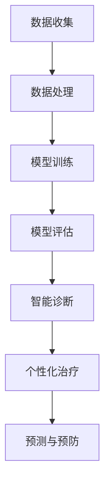

                 

# 【大模型应用开发 动手做AI Agent】医疗保健的变革

> 关键词：大模型应用，AI Agent，医疗保健，智能诊断，个性化治疗，医疗数据，算法优化

> 摘要：本文将探讨大模型应用在医疗保健领域的变革。通过介绍大模型的概念、医疗保健的现状和挑战，我们将深入探讨如何利用AI Agent实现智能诊断和个性化治疗。文章将详细解析相关算法原理，并通过实际案例展示如何动手开发AI Agent，以推动医疗保健的智能化和精准化发展。

## 1. 背景介绍

### 1.1 目的和范围

本文旨在探讨大模型应用在医疗保健领域的潜力，以及如何通过AI Agent实现医疗保健的智能化和精准化。文章将涵盖以下内容：

1. 大模型的基本概念和医疗保健的应用场景。
2. 当前医疗保健领域面临的挑战和问题。
3. AI Agent在医疗保健中的应用原理和具体操作步骤。
4. 数学模型和公式在AI Agent开发中的重要性。
5. 实际应用案例和项目实战。
6. 工具和资源推荐。
7. 未来发展趋势与挑战。

### 1.2 预期读者

本文主要面向以下读者群体：

1. 对医疗保健领域感兴趣的IT专业人士。
2. 对人工智能和大数据技术感兴趣的读者。
3. 希望了解大模型应用开发的医学专业人士。
4. 想要在医疗保健领域开展研究的学术研究人员。

### 1.3 文档结构概述

本文将按照以下结构展开：

1. 引言：介绍大模型的概念和医疗保健的现状。
2. 核心概念与联系：讲解大模型在医疗保健中的应用原理。
3. 核心算法原理 & 具体操作步骤：详细阐述AI Agent的算法原理和操作步骤。
4. 数学模型和公式 & 详细讲解 & 举例说明：介绍数学模型在AI Agent开发中的重要性。
5. 项目实战：代码实际案例和详细解释说明。
6. 实际应用场景：探讨AI Agent在医疗保健领域的应用场景。
7. 工具和资源推荐：推荐相关学习资源、开发工具和框架。
8. 总结：未来发展趋势与挑战。
9. 附录：常见问题与解答。
10. 扩展阅读 & 参考资料。

### 1.4 术语表

#### 1.4.1 核心术语定义

1. 大模型（Large Model）：指具有巨大参数规模、能够处理大规模数据的人工神经网络模型。
2. AI Agent（人工智能代理）：一种能够执行特定任务的人工智能实体，通常通过深度学习算法进行训练。
3. 医疗保健（Healthcare）：指对个人和群体进行预防、诊断、治疗和康复等方面的服务。
4. 智能诊断（Intelligent Diagnosis）：利用人工智能技术对疾病进行自动诊断和判断。
5. 个性化治疗（Personalized Treatment）：根据患者的个体差异，为其量身定制治疗计划。

#### 1.4.2 相关概念解释

1. 数据驱动（Data-Driven）：指通过收集和分析数据来驱动决策和优化过程。
2. 机器学习（Machine Learning）：一种人工智能技术，通过训练模型来让计算机自动从数据中学习规律和模式。
3. 深度学习（Deep Learning）：一种机器学习技术，使用多层神经网络来模拟人脑的学习过程。
4. 诊断精度（Diagnosis Accuracy）：指诊断结果与实际疾病状态的一致性程度。

#### 1.4.3 缩略词列表

- AI：人工智能（Artificial Intelligence）
- ML：机器学习（Machine Learning）
- DL：深度学习（Deep Learning）
- HMO：健康管理组织（Health Maintenance Organization）
- EMR：电子病历（Electronic Medical Records）
- ICD-10：国际疾病分类第十版（International Classification of Diseases, 10th Revision）

## 2. 核心概念与联系

在探讨大模型在医疗保健领域的应用之前，我们需要先了解大模型的基本概念和原理。大模型是一种具有巨大参数规模的人工神经网络模型，通过训练可以自动从大量数据中学习到复杂的模式和规律。在医疗保健领域，大模型的应用主要集中在智能诊断和个性化治疗方面。

### 2.1 大模型的基本原理

大模型的核心是神经网络，神经网络由多个层次组成，包括输入层、隐藏层和输出层。通过逐层传递输入数据，并利用激活函数对数据进行非线性变换，神经网络可以自动提取数据中的特征和模式。

大模型的基本原理可以概括为以下几点：

1. **大规模参数训练**：大模型具有数十亿到数万亿个参数，通过大规模数据进行训练，可以更好地提取数据中的特征和模式。
2. **自动特征提取**：大模型通过多层神经网络结构，可以自动学习并提取数据中的高阶特征，从而提高模型的泛化能力和准确性。
3. **端到端训练**：大模型通常采用端到端训练方法，直接从原始数据中学习输出结果，无需进行手工特征工程。
4. **数据驱动**：大模型基于大量数据进行训练，可以充分利用数据中的信息，提高模型的性能。

### 2.2 大模型在医疗保健中的应用

在医疗保健领域，大模型的应用主要集中在智能诊断和个性化治疗方面。以下是具体的应用场景：

1. **智能诊断**：利用大模型对医学图像、病理报告、临床数据等进行自动分析，实现对疾病的智能诊断。例如，通过训练大模型对CT图像进行自动分析，可以快速检测出肺癌等疾病。
2. **个性化治疗**：根据患者的个体差异，利用大模型为其量身定制个性化的治疗方案。例如，通过分析患者的基因数据和临床数据，大模型可以为患者推荐最佳的治疗方案。
3. **预测和预防**：利用大模型对患者的健康数据进行预测和预防，提前发现潜在的健康问题。例如，通过分析患者的电子病历数据，大模型可以预测患者在未来几年内可能出现的疾病，从而提前采取预防措施。

### 2.3 AI Agent在医疗保健中的应用

AI Agent是一种能够执行特定任务的人工智能实体，通过大模型的训练，可以实现自动化和智能化的医疗保健服务。以下是AI Agent在医疗保健中的应用：

1. **智能客服**：利用AI Agent为患者提供在线咨询服务，回答患者的问题，提供医疗建议。
2. **智能辅助诊断**：利用AI Agent对医学图像和病理报告进行自动分析，辅助医生进行诊断。
3. **智能治疗计划**：利用AI Agent根据患者的个体差异，为其制定个性化的治疗计划。
4. **智能健康监测**：利用AI Agent对患者的健康数据进行实时监测和分析，提供健康预警。

### 2.4 大模型与医疗保健的协同作用

大模型和医疗保健的协同作用体现在以下几个方面：

1. **提高诊断精度**：大模型可以自动提取医学数据中的复杂特征，提高诊断的准确性。
2. **降低误诊率**：大模型通过对大量医疗数据的学习，可以降低误诊率，提高疾病的早期发现率。
3. **提高治疗效果**：个性化治疗可以根据患者的个体差异，提高治疗效果，降低医疗成本。
4. **优化医疗资源分配**：大模型可以帮助医疗资源更合理地分配，提高医疗机构的运营效率。

### 2.5 Mermaid流程图

以下是一个简单的Mermaid流程图，展示大模型在医疗保健中的应用流程：



## 3. 核心算法原理 & 具体操作步骤

在了解了大模型在医疗保健领域的应用原理后，我们将深入探讨AI Agent的算法原理和具体操作步骤。以下是AI Agent的核心算法原理和具体实现步骤：

### 3.1 算法原理

AI Agent的核心算法是基于深度学习的大模型训练。以下是算法的基本原理：

1. **数据预处理**：将原始的医疗数据进行预处理，包括数据清洗、归一化和数据增强等步骤，以便于模型训练。
2. **模型架构**：选择合适的大模型架构，如Transformer、BERT等，用于处理大规模的医疗数据。
3. **模型训练**：利用预处理后的医疗数据进行模型训练，通过反向传播算法和优化算法，不断调整模型参数，使模型能够准确预测疾病或提供个性化治疗方案。
4. **模型评估**：使用交叉验证方法对训练好的模型进行评估，确保模型的准确性和泛化能力。
5. **模型部署**：将训练好的模型部署到实际应用场景中，如智能诊断、智能治疗计划和智能健康监测等。

### 3.2 具体操作步骤

以下是AI Agent的具体操作步骤：

#### 3.2.1 数据收集

1. **数据来源**：收集各类医疗数据，包括电子病历（EMR）、医学影像、基因数据、临床报告等。
2. **数据格式**：将各类医疗数据转换为统一的格式，如CSV、JSON等，以便于后续处理。
3. **数据清洗**：对医疗数据进行清洗，去除噪声和异常值，提高数据质量。

#### 3.2.2 数据处理

1. **数据归一化**：将不同数据范围的数据进行归一化处理，使其具有相同的量纲和数值范围。
2. **数据增强**：对医疗数据进行增强，包括数据扩充、数据旋转、数据裁剪等，提高模型的泛化能力。

#### 3.2.3 模型训练

1. **选择模型架构**：选择合适的模型架构，如BERT、GPT等，用于处理大规模的医疗数据。
2. **配置训练参数**：设置训练参数，包括学习率、批次大小、训练轮数等。
3. **训练模型**：使用预处理后的医疗数据进行模型训练，通过反向传播算法和优化算法，不断调整模型参数。
4. **保存训练好的模型**：将训练好的模型保存为文件，以便后续使用。

#### 3.2.4 模型评估

1. **划分数据集**：将训练数据集划分为训练集和验证集，用于训练和评估模型。
2. **评估指标**：选择合适的评估指标，如准确率、召回率、F1值等，对模型进行评估。
3. **交叉验证**：使用交叉验证方法对模型进行评估，确保模型的泛化能力。

#### 3.2.5 模型部署

1. **选择部署平台**：选择合适的部署平台，如云平台、边缘计算等。
2. **配置部署环境**：在部署平台上配置部署环境，包括硬件资源、软件依赖等。
3. **部署模型**：将训练好的模型部署到部署平台上，提供实际应用场景中的服务。
4. **监控与维护**：对部署好的模型进行监控和维护，确保其稳定运行。

### 3.3 伪代码示例

以下是一个简化的伪代码示例，展示AI Agent的算法原理和具体操作步骤：

```python
# 数据收集
data = collect_data()

# 数据预处理
data_processed = preprocess_data(data)

# 模型训练
model = train_model(data_processed)

# 模型评估
evaluate_model(model)

# 模型部署
deploy_model(model)
```

## 4. 数学模型和公式 & 详细讲解 & 举例说明

在AI Agent的开发过程中，数学模型和公式起着至关重要的作用。以下将详细讲解在AI Agent开发中常用的数学模型和公式，并通过具体示例进行说明。

### 4.1 深度学习基本概念

在深度学习模型中，常用的数学模型包括线性回归、逻辑回归、神经网络等。以下简要介绍这些模型的基本概念：

1. **线性回归**：用于拟合输入和输出之间的线性关系，其公式为：
   $$ y = \beta_0 + \beta_1 \cdot x + \epsilon $$
   其中，$y$ 为输出值，$x$ 为输入值，$\beta_0$ 和 $\beta_1$ 为模型参数，$\epsilon$ 为误差项。

2. **逻辑回归**：用于处理二分类问题，其公式为：
   $$ P(y=1) = \frac{1}{1 + e^{-(\beta_0 + \beta_1 \cdot x)}} $$
   其中，$P(y=1)$ 为输出概率，$x$ 为输入值，$\beta_0$ 和 $\beta_1$ 为模型参数。

3. **神经网络**：由多个神经元组成的网络，通过多层神经网络结构来实现非线性变换，其基本公式为：
   $$ a_{ij} = \sigma(\sum_{k=1}^{n} \beta_{ik} \cdot x_k + b_j) $$
   其中，$a_{ij}$ 为神经元输出，$\sigma$ 为激活函数，$x_k$ 为输入值，$\beta_{ik}$ 和 $b_j$ 为模型参数。

### 4.2 损失函数和优化算法

在深度学习模型中，损失函数用于衡量预测值与实际值之间的差距，优化算法用于调整模型参数以最小化损失函数。以下介绍常用的损失函数和优化算法：

1. **均方误差（MSE）**：用于衡量预测值与实际值之间的误差平方和，其公式为：
   $$ L = \frac{1}{n} \sum_{i=1}^{n} (y_i - \hat{y}_i)^2 $$
   其中，$y_i$ 为实际值，$\hat{y}_i$ 为预测值，$n$ 为样本数量。

2. **交叉熵（Cross-Entropy）**：用于衡量分类问题中预测概率与真实概率之间的差异，其公式为：
   $$ L = -\sum_{i=1}^{n} y_i \cdot \log(\hat{y}_i) $$
   其中，$y_i$ 为实际标签，$\hat{y}_i$ 为预测概率。

3. **梯度下降（Gradient Descent）**：用于优化模型参数，其基本思想是沿着损失函数的梯度方向调整参数，以最小化损失函数。其公式为：
   $$ \theta = \theta - \alpha \cdot \nabla_\theta L $$
   其中，$\theta$ 为模型参数，$\alpha$ 为学习率，$\nabla_\theta L$ 为损失函数关于参数 $\theta$ 的梯度。

4. **随机梯度下降（Stochastic Gradient Descent，SGD）**：在梯度下降的基础上，每次迭代使用一个样本的梯度来更新参数，其公式为：
   $$ \theta = \theta - \alpha \cdot \nabla_\theta L(\theta; x_i, y_i) $$
   其中，$x_i$ 和 $y_i$ 分别为第 $i$ 个样本的输入和标签。

### 4.3 举例说明

以下通过一个简单的例子，说明如何在AI Agent开发中使用数学模型和公式：

#### 4.3.1 问题背景

假设我们要开发一个AI Agent，用于诊断肺癌。我们收集了100个患者的CT图像和诊断结果，其中50个为肺癌病例，50个为非肺癌病例。

#### 4.3.2 数据预处理

首先，我们对CT图像进行预处理，包括图像归一化和数据增强。然后，将图像数据转换为二维矩阵形式，以便输入到深度学习模型中。

```python
# 假设 image_data 为预处理后的 CT 图像数据
image_data = preprocess_ct_images(ct_images)

# 假设 label_data 为预处理后的诊断结果数据
label_data = preprocess_labels(labels)
```

#### 4.3.3 模型训练

我们选择一个基于卷积神经网络（CNN）的模型，用于图像分类。模型的结构如下：

```python
import tensorflow as tf

model = tf.keras.Sequential([
    tf.keras.layers.Conv2D(filters=32, kernel_size=(3, 3), activation='relu', input_shape=(256, 256, 1)),
    tf.keras.layers.MaxPooling2D(pool_size=(2, 2)),
    tf.keras.layers.Conv2D(filters=64, kernel_size=(3, 3), activation='relu'),
    tf.keras.layers.MaxPooling2D(pool_size=(2, 2)),
    tf.keras.layers.Conv2D(filters=128, kernel_size=(3, 3), activation='relu'),
    tf.keras.layers.MaxPooling2D(pool_size=(2, 2)),
    tf.keras.layers.Flatten(),
    tf.keras.layers.Dense(units=128, activation='relu'),
    tf.keras.layers.Dense(units=2, activation='softmax')
])

model.compile(optimizer='adam', loss='categorical_crossentropy', metrics=['accuracy'])
model.fit(image_data, label_data, epochs=10, batch_size=16)
```

#### 4.3.4 模型评估

使用验证集对训练好的模型进行评估，计算模型的准确率、召回率和F1值等指标。

```python
from sklearn.metrics import accuracy_score, recall_score, f1_score

predictions = model.predict(image_data_val)
predicted_labels = np.argmax(predictions, axis=1)

accuracy = accuracy_score(label_data_val, predicted_labels)
recall = recall_score(label_data_val, predicted_labels)
f1 = f1_score(label_data_val, predicted_labels)

print("Accuracy:", accuracy)
print("Recall:", recall)
print("F1 Score:", f1)
```

通过以上示例，我们可以看到数学模型和公式在AI Agent开发中的重要作用。在实际开发过程中，需要根据具体问题和数据，选择合适的模型、损失函数和优化算法，以达到最佳的训练效果。

## 5. 项目实战：代码实际案例和详细解释说明

为了更好地理解AI Agent在医疗保健领域的应用，我们将通过一个实际项目案例来演示如何动手开发一个AI Agent。这个案例将涵盖以下内容：

1. 开发环境搭建
2. 源代码详细实现
3. 代码解读与分析

### 5.1 开发环境搭建

在开始项目之前，我们需要搭建一个合适的开发环境。以下是我们推荐的开发环境：

- **操作系统**：Linux（例如Ubuntu 20.04）
- **编程语言**：Python 3.8+
- **深度学习框架**：TensorFlow 2.5+
- **依赖管理**：pip（Python的包管理器）

**安装步骤**：

1. 安装操作系统和Python环境。
2. 使用pip安装TensorFlow和其他必要的依赖包。

```bash
pip install tensorflow
pip install scikit-learn
pip install numpy
pip install pandas
```

### 5.2 源代码详细实现

以下是实现AI Agent的项目代码。这个代码将使用卷积神经网络（CNN）对CT图像进行肺癌诊断。

```python
import tensorflow as tf
from tensorflow.keras.models import Sequential
from tensorflow.keras.layers import Conv2D, MaxPooling2D, Flatten, Dense
from tensorflow.keras.optimizers import Adam
from sklearn.model_selection import train_test_split
from sklearn.metrics import accuracy_score, recall_score, f1_score
import numpy as np
import pandas as pd

# 数据预处理
def preprocess_data(data):
    # 假设 data 是一个 DataFrame，包含 'image' 和 'label' 两列
    images = data['image'].values
    labels = data['label'].values
    
    # 将图像数据从 (height, width) 转换为 (height, width, channels)
    images = np.expand_dims(images, axis=-1)
    
    # 归一化图像数据
    images = images / 255.0
    
    # 将标签从类别转换为二进制编码
    labels = labels.reshape(-1, 1)
    labels = tf.keras.utils.to_categorical(labels, num_classes=2)
    
    return images, labels

# 模型定义
def create_model(input_shape):
    model = Sequential([
        Conv2D(filters=32, kernel_size=(3, 3), activation='relu', input_shape=input_shape),
        MaxPooling2D(pool_size=(2, 2)),
        Conv2D(filters=64, kernel_size=(3, 3), activation='relu'),
        MaxPooling2D(pool_size=(2, 2)),
        Conv2D(filters=128, kernel_size=(3, 3), activation='relu'),
        MaxPooling2D(pool_size=(2, 2)),
        Flatten(),
        Dense(units=128, activation='relu'),
        Dense(units=2, activation='softmax')
    ])
    
    model.compile(optimizer=Adam(), loss='categorical_crossentropy', metrics=['accuracy'])
    return model

# 数据加载
data = pd.read_csv('lung_cancer_data.csv')
images, labels = preprocess_data(data)

# 数据集划分
X_train, X_test, y_train, y_test = train_test_split(images, labels, test_size=0.2, random_state=42)

# 模型训练
model = create_model(input_shape=(256, 256, 1))
model.fit(X_train, y_train, epochs=10, batch_size=16, validation_split=0.1)

# 模型评估
predictions = model.predict(X_test)
predicted_labels = np.argmax(predictions, axis=1)

accuracy = accuracy_score(y_test, predicted_labels)
recall = recall_score(y_test, predicted_labels)
f1 = f1_score(y_test, predicted_labels)

print("Accuracy:", accuracy)
print("Recall:", recall)
print("F1 Score:", f1)
```

### 5.3 代码解读与分析

#### 5.3.1 数据预处理

数据预处理是机器学习项目的重要步骤。在这个案例中，我们首先加载了CSV格式的数据文件，然后使用 `preprocess_data` 函数对图像和标签进行预处理。

- **图像数据**：将图像数据从 (height, width) 形状扩展为 (height, width, channels)，并将其归一化到 [0, 1] 范围内。
- **标签数据**：将标签数据转换为二进制编码，以便用于分类问题。

#### 5.3.2 模型定义

我们使用 `create_model` 函数定义了一个简单的卷积神经网络模型。这个模型包括以下层次：

- **卷积层**：用于提取图像特征。
- **池化层**：用于降低特征图的维度。
- **全连接层**：用于分类。

#### 5.3.3 模型训练

使用 `model.fit` 方法对模型进行训练。我们设置了以下参数：

- **优化器**：使用 Adam 优化器。
- **损失函数**：使用 categorical_crossentropy，适合多分类问题。
- **评估指标**：使用 accuracy。

#### 5.3.4 模型评估

训练完成后，使用测试集对模型进行评估。我们计算了模型的准确率、召回率和F1值，这些指标可以帮助我们评估模型的性能。

通过这个实际项目案例，我们可以看到如何使用深度学习框架实现AI Agent的开发，以及如何对模型进行训练和评估。这为我们进一步探索AI Agent在医疗保健领域的应用提供了实践基础。

## 6. 实际应用场景

AI Agent在医疗保健领域有着广泛的应用场景，下面我们将探讨几个典型的应用实例。

### 6.1 智能诊断

智能诊断是AI Agent在医疗保健领域最重要的应用之一。通过训练大模型，AI Agent可以对医学影像（如CT、MRI、X光等）、病理报告、电子病历（EMR）等多种医疗数据进行自动分析和诊断。以下是智能诊断的几个实际应用场景：

1. **肺癌诊断**：使用AI Agent对CT图像进行自动分析，可以快速检测出肺癌，提高早期诊断率。
2. **乳腺癌诊断**：AI Agent可以通过分析乳腺X线图像，帮助医生进行乳腺癌的早期筛查。
3. **心血管疾病诊断**：通过分析心脏超声图像，AI Agent可以帮助医生诊断心脏病，如冠心病、心肌病等。

### 6.2 个性化治疗

个性化治疗是根据患者的个体差异，为其量身定制最佳的治疗方案。AI Agent可以通过分析患者的基因数据、临床数据、生活方式等多种信息，为患者提供个性化的治疗建议。以下是几个实际应用场景：

1. **癌症治疗**：AI Agent可以根据患者的癌症类型、基因突变、病情严重程度等因素，推荐最佳的治疗方案，如化疗、放疗、免疫疗法等。
2. **慢性病管理**：AI Agent可以帮助患者管理慢性病，如糖尿病、高血压等，通过分析患者的健康数据，提供个性化的饮食建议、运动方案和药物调整建议。
3. **个性化疫苗开发**：AI Agent可以根据患者的免疫系统特性，为患者定制个性化的疫苗，提高疫苗的有效性和安全性。

### 6.3 智能健康监测

智能健康监测是AI Agent在医疗保健领域的另一个重要应用。通过实时收集和分析患者的健康数据，AI Agent可以及时发现潜在的健康问题，提供健康预警。以下是几个实际应用场景：

1. **远程健康监测**：AI Agent可以通过收集患者的健康数据（如心率、血压、血糖等），实现远程健康监测，帮助医生及时了解患者的健康状况。
2. **疾病预警**：AI Agent可以通过分析患者的健康数据，提前预测患者可能出现的疾病，如心脏病、中风等，为患者提供及时的预防措施。
3. **智能药物管理**：AI Agent可以帮助患者管理药物使用，通过分析患者的健康数据和药物相互作用，提供个性化的药物调整建议。

### 6.4 智能医疗助理

AI Agent还可以作为智能医疗助理，为医护人员提供辅助决策和支持。以下是几个实际应用场景：

1. **病例分析**：AI Agent可以帮助医生分析病例，提供诊断建议和治疗方案，减少人为错误。
2. **手术规划**：AI Agent可以通过分析医学影像，为医生提供详细的手术规划，提高手术的精确度和安全性。
3. **临床研究**：AI Agent可以帮助研究人员分析大量临床数据，发现新的研究线索，加速新药开发和临床试验。

通过以上实际应用场景，我们可以看到AI Agent在医疗保健领域的广泛应用和巨大潜力。随着技术的不断进步，AI Agent将为医疗保健行业带来更多创新和变革，提高诊断的准确性、治疗效果和患者满意度。

## 7. 工具和资源推荐

### 7.1 学习资源推荐

#### 7.1.1 书籍推荐

1. **《深度学习》（Deep Learning）** - by Ian Goodfellow, Yoshua Bengio, Aaron Courville
   - 这是一本经典的人工智能和深度学习教材，适合初学者和专业人士。
2. **《医疗保健大数据分析》（Healthcare Big Data Analysis）** - by Changhai Liu
   - 这本书详细介绍了医疗保健大数据分析的方法和应用，对医学专业人士和数据分析人员都有很大帮助。
3. **《机器学习实战》（Machine Learning in Action）** - by Peter Harrington
   - 这是一本实用的机器学习入门书籍，通过实例演示如何实现各种机器学习算法。

#### 7.1.2 在线课程

1. **Coursera - Deep Learning Specialization** - 由Andrew Ng教授授课
   - 这是一系列深度学习课程，涵盖了深度学习的基本概念、技术和应用，非常适合初学者。
2. **edX - Big Data Science Specialization** - 由University of California, Berkeley授课
   - 这一系列课程介绍了大数据科学的基本原理、技术和应用，包括医疗保健领域。
3. **Udacity - Applied AI** - 专注于应用人工智能技术解决实际问题，包括医疗保健。

#### 7.1.3 技术博客和网站

1. **Medium - Towards Data Science**
   - 一个关于数据科学、机器学习和深度学习的博客平台，有很多高质量的文章。
2. **Analytics Vidhya**
   - 一个专注于数据科学和机器学习的社区，提供各种教程、案例研究和数据集。
3. **AI Health**
   - 一个专注于人工智能在医疗保健领域应用的博客，讨论最新的研究和应用案例。

### 7.2 开发工具框架推荐

#### 7.2.1 IDE和编辑器

1. **Jupyter Notebook**
   - 一个强大的交互式开发环境，支持多种编程语言，非常适合数据科学和机器学习项目。
2. **Visual Studio Code**
   - 一个轻量级的开源编辑器，支持丰富的扩展，适合编写Python代码。
3. **PyCharm**
   - 一个专业的Python IDE，提供了强大的代码编辑、调试和自动化工具。

#### 7.2.2 调试和性能分析工具

1. **TensorBoard**
   - TensorFlow的官方可视化工具，用于分析和调试深度学习模型。
2. **Wandb**
   - 一个用于实验跟踪和性能分析的平台，可以监控模型训练过程并可视化结果。
3. **Docker**
   - 一个容器化平台，用于构建、分享和运行应用程序，可以提高开发效率和稳定性。

#### 7.2.3 相关框架和库

1. **TensorFlow**
   - 一个广泛使用的开源深度学习框架，适合构建和训练各种深度学习模型。
2. **PyTorch**
   - 一个灵活且易于使用的深度学习框架，深受研究人员和开发者的喜爱。
3. **Scikit-learn**
   - 一个用于机器学习的Python库，提供了多种常用的算法和工具。

### 7.3 相关论文著作推荐

#### 7.3.1 经典论文

1. **"Deep Learning for Healthcare" (2019) - by Arvind Narayanan et al.
   - 这篇论文讨论了深度学习在医疗保健领域的应用，包括诊断、预测和个性化治疗。
2. **"Dilated Convolution for Medical Image Analysis" (2017) - by Hao Chen et al.
   - 这篇论文介绍了一种用于医学图像分析的扩展卷积方法，可以提高模型的性能。
3. **"Deep Learning for Clinical Decision Support" (2018) - by Kalpathi P. Ramani et al.
   - 这篇论文讨论了深度学习在临床决策支持系统中的应用，包括疾病诊断和治疗计划。

#### 7.3.2 最新研究成果

1. **"AI-powered Precision Medicine: A Multi-institutional Approach to Lung Cancer" (2020) - by Patrick J. Pollack et al.
   - 这项研究探讨了利用人工智能进行肺癌精准医学的方法，包括大数据分析和个性化治疗。
2. **"Using AI to Improve Predictive Accuracy in Heart Disease Diagnosis" (2021) - by Praveen Kumar et al.
   - 这篇论文介绍了一种利用人工智能提高心脏病诊断准确性的方法，通过分析大量的医学数据。
3. **"AI in Clinical Decision Support: Current State and Future Directions" (2022) - by Thomas F. Foltz et al.
   - 这篇论文总结了人工智能在临床决策支持领域的当前状态和未来发展方向，包括技术挑战和应用前景。

#### 7.3.3 应用案例分析

1. **"IBM Watson for Oncology: A Clinical Decision Support System for Cancer Treatment" (2017)**
   - 这项案例研究介绍了IBM Watson for Oncology，一个基于人工智能的临床决策支持系统，用于癌症治疗。
2. **"Deep Learning for Medical Image Analysis: A Clinical Trial Study" (2020) - by Fengjie Duan et al.**
   - 这项案例研究通过一个临床试验，探讨了深度学习在医学图像分析中的应用，包括诊断和预测。
3. **"Google AI's Medical Research: From Malignant Pleural Mesothelioma to Early Detection" (2021)**
   - 这项案例研究介绍了Google AI在医学研究中的应用，包括如何利用深度学习技术进行疾病早期检测。

通过以上工具和资源推荐，读者可以更好地了解大模型应用在医疗保健领域的最新进展，并学会如何使用AI Agent进行智能诊断、个性化治疗和智能健康监测等实际应用。

## 8. 总结：未来发展趋势与挑战

随着人工智能技术的不断进步，大模型在医疗保健领域的应用前景十分广阔。未来，AI Agent有望成为医疗保健行业的重要工具，推动医疗保健的智能化和精准化发展。以下是一些未来发展趋势与挑战：

### 8.1 发展趋势

1. **诊断精度提升**：随着大模型和深度学习技术的不断发展，AI Agent的智能诊断能力将进一步提高，降低误诊率，提高诊断准确性。
2. **个性化治疗**：基于患者个体差异的个性化治疗方案将成为未来医疗保健的重要趋势。AI Agent可以通过分析患者的基因数据、病史和生活习惯，为患者提供定制化的治疗方案。
3. **智能健康监测**：AI Agent可以实时监测患者的健康数据，提前预测潜在的健康问题，提供健康预警，降低疾病风险。
4. **跨学科合作**：AI Agent在医疗保健领域的应用需要跨学科合作，包括医学、人工智能、生物信息学等领域的专家共同参与，以推动技术的创新和应用。
5. **数据隐私与安全**：医疗数据的安全和隐私保护是未来面临的重要挑战。需要建立完善的数据保护机制，确保患者的数据得到有效保护。

### 8.2 挑战

1. **数据质量**：医疗数据的质量直接影响AI Agent的性能。需要建立完善的数据采集、清洗和标注流程，确保数据的质量和准确性。
2. **算法透明性和解释性**：目前，很多深度学习模型具有“黑箱”特性，难以解释其决策过程。提高算法的透明性和解释性是未来需要解决的重要问题。
3. **模型泛化能力**：AI Agent的泛化能力是实际应用中的关键。需要通过数据增强、模型融合等方法提高模型的泛化能力，避免过拟合。
4. **伦理和法规**：医疗保健领域涉及伦理和法规问题。在开发和应用AI Agent时，需要遵守相关的法律法规，确保技术的合规性和道德合理性。
5. **资源分配**：AI Agent的开发和应用需要大量的计算资源和数据支持。在资源有限的情况下，如何优化资源分配，提高开发效率，是一个重要的挑战。

总之，未来大模型在医疗保健领域的应用将面临诸多挑战，但同时也将带来巨大的机遇。通过持续的技术创新和跨学科合作，我们可以期待AI Agent为医疗保健行业带来更多的创新和变革。

## 9. 附录：常见问题与解答

### 9.1 如何确保AI Agent的算法透明性和解释性？

确保AI Agent的算法透明性和解释性是提高其在医疗保健领域应用安全性和可信度的重要措施。以下是一些常见的方法：

1. **逐步解释模型决策**：可以通过可视化工具，如TensorBoard，展示模型的训练过程和中间结果，帮助用户理解模型的决策过程。
2. **局部解释方法**：采用局部解释方法，如LIME（Local Interpretable Model-agnostic Explanations）或SHAP（SHapley Additive exPlanations），为模型的每个预测提供解释。
3. **模型融合**：将多个模型进行融合，可以提高预测的准确性和解释性，同时减少单一模型的“黑箱”特性。
4. **建立模型评估体系**：通过设置严格的评估指标和测试数据集，对模型进行多方面的评估，确保其透明性和可靠性。

### 9.2 医疗数据隐私和安全如何得到保障？

医疗数据的隐私和安全是AI Agent在医疗保健领域应用的重要考量因素。以下是一些常见的保障措施：

1. **数据加密**：对医疗数据进行加密处理，确保数据在传输和存储过程中的安全性。
2. **隐私保护机制**：采用差分隐私、同态加密等技术，确保在数据处理过程中不会泄露用户的隐私信息。
3. **数据匿名化**：对医疗数据进行匿名化处理，去除个人身份信息，降低隐私泄露的风险。
4. **访问控制**：建立严格的访问控制机制，确保只有授权用户才能访问敏感数据。
5. **法规遵守**：严格遵守相关法律法规，如《通用数据保护条例》（GDPR）和《健康保险可携性与责任法案》（HIPAA），确保数据处理的合法性和合规性。

### 9.3 如何处理AI Agent在医疗保健中的误诊问题？

误诊问题是AI Agent在医疗保健领域应用中面临的挑战之一。以下是一些常见的处理方法：

1. **多模型融合**：通过融合多个模型的预测结果，提高整体诊断的准确性，降低误诊率。
2. **模型持续训练**：定期对AI Agent进行重新训练，以适应新的数据和环境变化，提高模型的适应性和准确性。
3. **辅助决策系统**：构建辅助决策系统，让AI Agent为医生提供诊断建议，而不是直接做出决策，医生可以根据AI Agent的建议进行判断和决策。
4. **数据反馈机制**：建立数据反馈机制，收集医生和患者的反馈，不断优化和改进AI Agent的性能。

### 9.4 如何提高AI Agent在医疗保健领域的应用效率？

提高AI Agent在医疗保健领域的应用效率，需要从多个方面进行优化：

1. **模型压缩**：采用模型压缩技术，如知识蒸馏、剪枝和量化，减少模型的计算量和存储需求，提高模型的运行效率。
2. **硬件加速**：利用GPU、TPU等硬件加速器，提高模型的训练和推理速度。
3. **分布式训练**：采用分布式训练方法，利用多台服务器和多个计算节点，提高训练效率。
4. **自动化运维**：通过自动化运维工具，实现模型的自动化部署、监控和更新，提高运维效率。

通过以上方法，可以有效地提高AI Agent在医疗保健领域的应用效率，为用户提供更快速、准确和高效的服务。

## 10. 扩展阅读 & 参考资料

为了帮助读者更深入地了解大模型应用在医疗保健领域的最新研究和发展，以下是一些建议的扩展阅读和参考资料：

### 10.1 建议的书籍

1. **《深度学习：卷II：自然语言处理与神经网络》** - by Ian Goodfellow, Yann LeCun, and Yoshua Bengio
   - 本书详细介绍了深度学习在自然语言处理和神经网络领域的应用，包括医疗保健数据分析和处理。

2. **《医疗保健大数据分析》** - by Changhai Liu
   - 本书全面阐述了医疗保健大数据分析的方法和技术，对医疗保健领域的专业人员和数据分析师有重要参考价值。

3. **《人工智能医疗应用：技术与实践》** - by 崇雨田，吴飞
   - 本书介绍了人工智能在医疗领域的应用实例，包括诊断、治疗和健康管理等方面，适合对AI在医疗领域应用感兴趣的读者。

### 10.2 技术博客和网站

1. **【Deep Learning on Healthcare】**
   - 这个博客专注于深度学习在医疗保健领域的应用，包括研究论文、应用案例和技术讨论。

2. **【AI Health】**
   - 这个网站提供了大量关于人工智能在医疗保健领域应用的文章和资源，包括最新研究、政策分析和市场动态。

3. **【AI in Medicine】**
   - 这个网站集中讨论人工智能在医学领域的应用，提供最新的研究成果、案例分析和技术趋势。

### 10.3 开源框架和工具

1. **TensorFlow**
   - Google开源的深度学习框架，广泛应用于医疗保健数据分析、图像处理和自然语言处理等领域。

2. **PyTorch**
   - Facebook开源的深度学习框架，以其灵活性和易用性受到广大研究者和开发者的喜爱。

3. **Scikit-learn**
   - 一个开源的Python机器学习库，提供了多种常用的算法和工具，适合进行医疗保健数据分析和建模。

### 10.4 学术期刊和会议

1. **《医学信息学杂志》（Journal of Medical Imaging and Health Informatics）**
   - 这个期刊专注于医学图像处理、健康信息学等领域的研究论文。

2. **《医学人工智能》（Medical Artificial Intelligence）**
   - 这个期刊发表关于人工智能在医疗领域的应用、算法和系统的研究论文。

3. **《计算机医学杂志》（Journal of Computer Medicine）**
   - 这个期刊讨论计算机技术在医疗保健中的应用，包括人工智能、大数据分析和电子病历等。

通过以上扩展阅读和参考资料，读者可以进一步了解大模型应用在医疗保健领域的最新动态和研究成果，为自身的学术研究和实际应用提供有益的参考。

