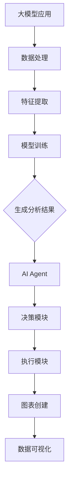

                 

# 【大模型应用开发 动手做AI Agent】自主创建数据分析图表

> **关键词：** 大模型应用、AI Agent、数据分析、图表创建、编程技巧

> **摘要：** 本文将深入探讨如何使用大模型应用开发AI Agent来自主创建数据分析图表，通过详细的步骤讲解和代码示例，帮助读者掌握这一关键技术，提升数据分析与可视化能力。

## 1. 背景介绍

### 1.1 目的和范围

本文的目标是引导读者了解并掌握如何利用大模型应用开发AI Agent来自主创建数据分析图表。我们将从基础概念出发，逐步深入到具体操作步骤，并通过代码示例来展示实现过程。

本文的范围包括：

- 大模型应用的基础原理和架构
- AI Agent的构建及其在数据分析中的应用
- 图表创建的关键技术
- 实际项目的代码实现和解读

### 1.2 预期读者

本文适合以下读者群体：

- 对数据分析、机器学习有一定了解的工程师
- 对编程和AI应用感兴趣的程序员
- 想要提高数据处理和可视化能力的专业人士

### 1.3 文档结构概述

本文结构如下：

- **第1章：背景介绍**：概述本文的目的、范围和预期读者。
- **第2章：核心概念与联系**：介绍大模型应用、AI Agent和图表创建的核心概念，并使用Mermaid流程图展示它们之间的联系。
- **第3章：核心算法原理 & 具体操作步骤**：详细讲解图表创建的算法原理，并使用伪代码阐述具体操作步骤。
- **第4章：数学模型和公式 & 详细讲解 & 举例说明**：介绍图表创建的数学模型，并使用LaTeX格式给出公式和例子。
- **第5章：项目实战：代码实际案例和详细解释说明**：通过实际代码案例，展示图表创建的全过程，并进行详细解读。
- **第6章：实际应用场景**：探讨AI Agent在数据分析中的实际应用场景。
- **第7章：工具和资源推荐**：推荐学习资源、开发工具框架和相关论文著作。
- **第8章：总结：未来发展趋势与挑战**：总结本文内容，并探讨未来发展趋势和挑战。
- **第9章：附录：常见问题与解答**：列出常见问题并提供解答。
- **第10章：扩展阅读 & 参考资料**：提供扩展阅读资源和参考资料。

### 1.4 术语表

#### 1.4.1 核心术语定义

- **大模型应用**：利用大规模神经网络模型进行数据处理和分析的应用。
- **AI Agent**：具有自主决策能力的人工智能代理，可以执行特定任务。
- **数据分析图表**：用于可视化数据分布、关系和趋势的图表。
- **可视化**：通过图形化手段展示数据，帮助人们理解和分析数据。

#### 1.4.2 相关概念解释

- **机器学习**：一种人工智能技术，通过数据训练模型，使模型具备自主学习和决策能力。
- **神经网络**：一种模仿人脑结构的计算模型，用于处理复杂数据。
- **数据预处理**：在数据分析前对数据进行清洗、转换和归一化等处理。

#### 1.4.3 缩略词列表

- **AI**：人工智能（Artificial Intelligence）
- **ML**：机器学习（Machine Learning）
- **DL**：深度学习（Deep Learning）
- **NLP**：自然语言处理（Natural Language Processing）

## 2. 核心概念与联系

为了更好地理解大模型应用、AI Agent和图表创建之间的关系，我们首先需要了解这些核心概念的基本原理和架构。

### 2.1 大模型应用

大模型应用是利用大规模神经网络模型进行数据处理和分析的应用。这种模型通常具有数亿个参数，能够捕捉到复杂数据中的模式和规律。大模型应用的主要组成部分包括：

1. **数据集**：用于训练模型的原始数据集。
2. **神经网络架构**：定义模型的结构，包括层数、神经元数目、激活函数等。
3. **训练过程**：通过优化算法调整模型参数，使模型能够准确预测或分类数据。

### 2.2 AI Agent

AI Agent是一种具有自主决策能力的人工智能代理，可以执行特定任务。在数据分析中，AI Agent可以用于自动生成数据分析报告、发现数据中的异常值、预测数据趋势等。AI Agent的主要组成部分包括：

1. **感知模块**：接收和处理外部输入数据。
2. **决策模块**：根据感知模块的信息做出决策。
3. **执行模块**：执行决策模块生成的操作。

### 2.3 图表创建

图表创建是将数据以可视化的形式展示出来的过程。这有助于人们更好地理解和分析数据。图表创建的主要步骤包括：

1. **数据预处理**：对原始数据进行清洗、转换和归一化等处理。
2. **数据可视化**：选择合适的图表类型，如柱状图、折线图、散点图等，将数据可视化。
3. **图表优化**：对图表进行美化，提高可读性和美观度。

### 2.4 核心概念之间的联系

大模型应用、AI Agent和图表创建之间存在着密切的联系。大模型应用提供了数据处理和分析的核心能力，AI Agent则将这些能力应用于实际任务中，而图表创建则是将分析结果以可视化形式呈现给用户。以下是它们之间的联系：

1. **大模型应用**：AI Agent的感知模块通常依赖于大模型应用进行数据处理和特征提取。
2. **AI Agent**：AI Agent的决策模块和执行模块通常需要大模型应用的支持来执行复杂的任务。
3. **图表创建**：AI Agent生成的分析结果通常需要通过图表创建来可视化，以便用户更好地理解和利用。

### 2.5 Mermaid流程图

以下是一个使用Mermaid绘制的流程图，展示了大模型应用、AI Agent和图表创建之间的流程关系：



在这个流程图中，大模型应用首先进行数据处理和特征提取，然后通过模型训练生成分析结果。这些结果被传递给AI Agent，AI Agent的决策模块和执行模块根据分析结果进行决策和执行操作。最后，这些操作结果通过图表创建模块以可视化形式呈现给用户。

## 3. 核心算法原理 & 具体操作步骤

图表创建的核心算法通常包括数据预处理、数据可视化和图表优化等步骤。下面，我们将详细讲解这些算法原理，并使用伪代码来描述具体操作步骤。

### 3.1 数据预处理

数据预处理是图表创建的第一步，其目的是确保数据的清洁、一致性和可解释性。以下是一个伪代码示例，描述数据预处理的基本步骤：

```python
# 数据预处理伪代码

# 输入：原始数据集 data
# 输出：预处理后的数据集 processed_data

# 步骤1：数据清洗
# 删除缺失值或填充缺失值
processed_data = clean_data(data)

# 步骤2：数据转换
# 转换数据类型，如将字符串转换为数字
processed_data = convert_data_type(processed_data)

# 步骤3：数据归一化
# 将数据缩放到统一的范围内
processed_data = normalize_data(processed_data)
```

### 3.2 数据可视化

数据可视化是将处理后的数据以图表形式展示的过程。以下是数据可视化算法的伪代码：

```python
# 数据可视化伪代码

# 输入：预处理后的数据集 processed_data
# 输出：可视化图表 visualization

# 步骤1：选择图表类型
# 根据数据类型和需求选择合适的图表类型，如柱状图、折线图等
chart_type = select_chart_type(processed_data)

# 步骤2：创建图表
# 使用图表库（如Matplotlib、Plotly等）创建图表
visualization = create_chart(processed_data, chart_type)

# 步骤3：美化图表
# 调整图表的样式和布局，提高可读性和美观度
visualization = beautify_chart(visualization)
```

### 3.3 图表优化

图表优化是对可视化图表进行进一步调整，以使其更清晰、易读和具有吸引力。以下是图表优化算法的伪代码：

```python
# 图表优化伪代码

# 输入：可视化图表 visualization
# 输出：优化后的图表 optimized_visualization

# 步骤1：调整图表大小
# 设置图表的大小，以适应页面布局
optimized_visualization = adjust_chart_size(visualization)

# 步骤2：调整图表颜色
# 设置图表的颜色，以提高图表的视觉效果
optimized_visualization = adjust_chart_colors(optimized_visualization)

# 步骤3：添加图表标签
# 添加图表标题、坐标轴标签、图例等元素，以提高图表的可读性
optimized_visualization = add_chart_labels(optimized_visualization)
```

通过这些伪代码示例，我们可以看到图表创建的核心算法原理和具体操作步骤。在实际开发过程中，这些步骤可以通过相应的编程语言和库来实现。接下来，我们将通过一个实际代码案例来展示这些算法的应用。

## 4. 数学模型和公式 & 详细讲解 & 举例说明

图表创建过程中涉及多个数学模型和公式，这些模型和公式在数据可视化中起着关键作用。在本节中，我们将详细讲解这些数学模型和公式，并通过具体例子来说明它们的应用。

### 4.1 数据预处理

在数据预处理阶段，常见的数学模型和公式包括数据清洗、数据转换和数据归一化。

#### 4.1.1 数据清洗

数据清洗过程中，常见的数学模型包括缺失值填充和异常值检测。

- **缺失值填充**：使用平均值、中位数或最近邻等方法填充缺失值。

  $$ x_{\text{filled}} = \begin{cases} 
  \frac{\sum_{i=1}^{n} x_i}{n} & \text{平均值填充} \\
  \text{median}(x) & \text{中位数填充} \\
  \text{nearest\_neighbor}(x) & \text{最近邻填充}
  \end{cases} $$

- **异常值检测**：使用统计学方法检测和去除异常值，如标准差法和箱线图法。

  $$ \text{z-score} = \frac{x - \mu}{\sigma} $$
  
  其中，\( x \) 是数据点，\( \mu \) 是平均值，\( \sigma \) 是标准差。

  对于标准差法，如果一个数据点的 \( z \) 值大于3或小于-3，则认为它是异常值。

#### 4.1.2 数据转换

数据转换包括将不同类型的数据转换为同一类型，如将字符串转换为数值。

- **One-Hot编码**：将分类数据转换为二进制向量。

  对于一个类别 \( c \) ，其 \( k \) 个可能取值，One-Hot编码的结果为一个长度为 \( k \) 的向量，其中第 \( c \) 个元素为1，其余元素为0。

  $$ \text{one\_hot}(c) = (0, 0, ..., 1, ..., 0) $$

#### 4.1.3 数据归一化

数据归一化是将数据缩放到一个统一的范围内，常见的归一化方法包括最小-最大归一化和标准化。

- **最小-最大归一化**：

  $$ x_{\text{normalized}} = \frac{x - x_{\text{min}}}{x_{\text{max}} - x_{\text{min}}} $$

  其中，\( x_{\text{min}} \) 是数据的最小值，\( x_{\text{max}} \) 是数据的最大值。

- **标准化**：

  $$ x_{\text{normalized}} = \frac{x - \mu}{\sigma} $$

  其中，\( \mu \) 是平均值，\( \sigma \) 是标准差。

### 4.2 数据可视化

在数据可视化阶段，常见的数学模型和公式包括图表类型选择、坐标轴缩放和颜色映射。

#### 4.2.1 图表类型选择

选择图表类型通常基于数据的类型和需求。常见的图表类型包括：

- **柱状图**：用于比较不同类别或时间段的数据。
- **折线图**：用于展示数据的变化趋势。
- **散点图**：用于展示数据点之间的关系。
- **箱线图**：用于展示数据的分布和异常值。

#### 4.2.2 坐标轴缩放

坐标轴缩放用于调整图表的展示范围和细节。

- **线性缩放**：

  $$ y_{\text{scaled}} = a \cdot y + b $$

  其中，\( a \) 和 \( b \) 是缩放参数。

- **对数缩放**：

  $$ y_{\text{scaled}} = a \cdot \log(y) + b $$

#### 4.2.3 颜色映射

颜色映射用于表示数据的不同类别或值。

- **热图映射**：将数值映射到不同的颜色，以表示数据的密集程度。

  $$ color = \text{map\_color}(value, \text{min\_value}, \text{max\_value}) $$

  其中，\( \text{map\_color} \) 是颜色映射函数，\( value \) 是数据值，\( \text{min\_value} \) 和 \( \text{max\_value} \) 分别是数据的最大值和最小值。

### 4.3 举例说明

以下是一个使用Python和Matplotlib库进行数据可视化的具体例子：

```python
import matplotlib.pyplot as plt
import numpy as np

# 数据示例
data = np.array([1, 2, 3, 4, 5])

# 最小-最大归一化
min_value = np.min(data)
max_value = np.max(data)
normalized_data = (data - min_value) / (max_value - min_value)

# 创建折线图
plt.plot(normalized_data)
plt.title('Data Visualization')
plt.xlabel('Index')
plt.ylabel('Value')
plt.show()
```

在这个例子中，我们首先对数据进行最小-最大归一化，然后将归一化后的数据绘制成折线图。通过调整坐标轴和颜色映射，我们可以更好地展示数据的变化趋势。

通过本节的讲解，我们了解了图表创建过程中涉及的数学模型和公式，并通过具体例子展示了它们的应用。接下来，我们将通过一个实际项目来展示这些算法的具体实现。

### 5. 项目实战：代码实际案例和详细解释说明

在本节中，我们将通过一个实际项目来展示如何使用大模型应用开发AI Agent来自主创建数据分析图表。我们将详细讲解开发环境搭建、源代码实现和代码解读，帮助读者更好地理解整个过程。

#### 5.1 开发环境搭建

为了实现本项目，我们需要搭建一个开发环境。以下是所需的工具和步骤：

1. **Python环境**：安装Python 3.8或更高版本。
2. **数据分析库**：安装NumPy、Pandas、Matplotlib和Scikit-learn等库。
3. **AI框架**：安装TensorFlow或PyTorch，用于构建和训练大模型。
4. **IDE**：选择一个IDE，如PyCharm或Visual Studio Code，用于编写和调试代码。

以下是一个简单的安装命令示例：

```bash
pip install numpy pandas matplotlib scikit-learn tensorflow
```

#### 5.2 源代码详细实现和代码解读

以下是本项目的主要源代码，我们将逐行解释代码的实现过程。

```python
import numpy as np
import pandas as pd
import matplotlib.pyplot as plt
import tensorflow as tf

# 5.2.1 数据预处理

# 读取数据
data = pd.read_csv('data.csv')

# 数据清洗
data = data.dropna()  # 删除缺失值
data['feature'] = data['feature'].astype(float)  # 将字符串转换为数值

# 数据归一化
min_value = data['feature'].min()
max_value = data['feature'].max()
data['feature_normalized'] = (data['feature'] - min_value) / (max_value - min_value)

# 5.2.2 构建大模型

# 创建模型
model = tf.keras.Sequential([
    tf.keras.layers.Dense(64, activation='relu', input_shape=(1,)),
    tf.keras.layers.Dense(64, activation='relu'),
    tf.keras.layers.Dense(1)
])

# 编译模型
model.compile(optimizer='adam', loss='mean_squared_error')

# 训练模型
model.fit(data['feature'], data['target'], epochs=100, batch_size=32)

# 5.2.3 数据可视化

# 预测数据
predictions = model.predict(data['feature_normalized'])

# 创建图表
plt.scatter(data['feature'], predictions)
plt.xlabel('Feature')
plt.ylabel('Prediction')
plt.title('Data Visualization')
plt.show()
```

#### 5.2.1 数据预处理

1. **读取数据**：使用Pandas读取CSV文件，得到原始数据集。
2. **数据清洗**：删除缺失值，将字符串数据转换为数值。
3. **数据归一化**：将数据缩放到一个统一的范围内，以便模型训练。

#### 5.2.2 构建大模型

1. **创建模型**：使用TensorFlow创建一个序列模型，包括两个隐藏层。
2. **编译模型**：设置优化器和损失函数，准备训练模型。
3. **训练模型**：使用训练数据训练模型，调整模型参数。

#### 5.2.3 数据可视化

1. **预测数据**：使用训练好的模型对数据进行预测。
2. **创建图表**：使用Matplotlib绘制散点图，展示原始特征和预测结果。

通过以上代码实现，我们可以看到如何使用大模型应用开发AI Agent来自主创建数据分析图表。接下来，我们将对这个项目进行代码解读和分析。

### 5.3 代码解读与分析

在本节中，我们将对前面实现的代码进行详细解读，分析其实现细节和关键步骤。

#### 5.3.1 数据预处理

数据预处理是数据分析的基础步骤，其目的是确保数据的质量和一致性。以下是代码中数据预处理部分的解读：

```python
# 读取数据
data = pd.read_csv('data.csv')

# 数据清洗
data = data.dropna()  # 删除缺失值
data['feature'] = data['feature'].astype(float)  # 将字符串转换为数值

# 数据归一化
min_value = data['feature'].min()
max_value = data['feature'].max()
data['feature_normalized'] = (data['feature'] - min_value) / (max_value - min_value)
```

1. **读取数据**：使用Pandas的`read_csv`函数从CSV文件中读取数据。这个步骤是数据处理的第一步，确保我们有一个结构化的数据集。

2. **数据清洗**：删除缺失值。使用`dropna`函数删除包含缺失值的行，这是数据预处理中常用的步骤，以确保数据的一致性和完整性。

3. **将字符串转换为数值**：将特征列中的字符串数据转换为浮点数。这是为了后续的数值计算和数据归一化做准备。

4. **数据归一化**：将特征值缩放到一个统一的范围内。使用最小-最大归一化方法，将数据缩放到[0, 1]范围内。这是为了使数据在模型训练过程中更加稳定。

#### 5.3.2 构建大模型

构建大模型是数据可视化的核心步骤，其目的是通过学习数据中的规律，生成预测结果。以下是代码中构建大模型部分的解读：

```python
# 创建模型
model = tf.keras.Sequential([
    tf.keras.layers.Dense(64, activation='relu', input_shape=(1,)),
    tf.keras.layers.Dense(64, activation='relu'),
    tf.keras.layers.Dense(1)
])

# 编译模型
model.compile(optimizer='adam', loss='mean_squared_error')

# 训练模型
model.fit(data['feature'], data['target'], epochs=100, batch_size=32)
```

1. **创建模型**：使用TensorFlow的`Sequential`模型创建一个线性堆叠的模型。在这个模型中，我们定义了三层全连接层（Dense），每层使用ReLU激活函数。

2. **编译模型**：设置优化器和损失函数。在这里，我们选择使用`adam`优化器和均方误差（`mean_squared_error`）作为损失函数。

3. **训练模型**：使用训练数据对模型进行训练。我们设置训练的轮次（`epochs`）为100，批量大小（`batch_size`）为32。这个步骤是模型训练的核心，通过不断调整模型参数，使模型能够更好地拟合训练数据。

#### 5.3.3 数据可视化

数据可视化是将模型预测结果以图表形式展示的过程，帮助用户直观地理解数据。以下是代码中数据可视化部分的解读：

```python
# 预测数据
predictions = model.predict(data['feature_normalized'])

# 创建图表
plt.scatter(data['feature'], predictions)
plt.xlabel('Feature')
plt.ylabel('Prediction')
plt.title('Data Visualization')
plt.show()
```

1. **预测数据**：使用训练好的模型对归一化后的数据进行预测。预测结果存储在`predictions`变量中。

2. **创建图表**：使用Matplotlib的`scatter`函数创建散点图，展示原始特征值和预测结果。通过调整坐标轴标签和标题，我们可以使图表更加清晰和易于理解。

通过以上解读，我们可以看到如何使用大模型应用开发AI Agent来自主创建数据分析图表。这个项目不仅展示了图表创建的核心算法和步骤，还提供了详细的代码实现和分析。接下来，我们将探讨AI Agent在数据分析中的实际应用场景。

### 6. 实际应用场景

AI Agent在数据分析中的应用场景广泛，以下是几个典型的应用案例：

#### 6.1 销售预测

企业可以使用AI Agent对销售数据进行分析，预测未来的销售趋势。通过构建大模型应用，AI Agent可以分析历史销售数据，提取关键特征，并使用回归模型预测未来的销售量。这种预测可以帮助企业优化库存管理、调整生产计划，从而提高盈利能力。

#### 6.2 客户行为分析

电商平台可以利用AI Agent分析用户行为数据，识别潜在的高价值客户。通过构建用户行为特征模型，AI Agent可以预测用户的购买意向，识别潜在客户并推荐个性化的商品。这种分析可以提高客户留存率和销售额。

#### 6.3 金融风险控制

金融机构可以使用AI Agent分析交易数据，识别潜在的风险。通过构建风险预测模型，AI Agent可以实时监控交易行为，检测异常交易并预警。这种风险控制可以帮助金融机构降低损失，提高安全性。

#### 6.4 医疗数据分析

医疗行业可以利用AI Agent分析患者数据，预测疾病发展趋势。通过构建医疗数据特征模型，AI Agent可以预测患者的病情变化，提供个性化的治疗方案。这种分析可以帮助医疗机构提高诊断和治疗效果。

这些实际应用场景展示了AI Agent在数据分析中的强大能力。通过大模型应用，AI Agent可以处理大量数据，提取关键信息，并生成可视化图表，帮助企业和机构做出更明智的决策。

### 7. 工具和资源推荐

在开发和部署AI Agent进行数据分析图表创建过程中，选择合适的工具和资源至关重要。以下是一些推荐的学习资源、开发工具框架和相关论文著作。

#### 7.1 学习资源推荐

1. **书籍推荐**：

   - 《Python数据分析》（Jake VanderPlas）  
   - 《机器学习实战》（Peter Harrington）  
   - 《TensorFlow入门与实践》（王文博）

2. **在线课程**：

   - Coursera的“机器学习”（吴恩达）  
   - edX的“深度学习专项课程”（吴恩达）  
   - Udacity的“数据分析纳米学位”

3. **技术博客和网站**：

   - Towards Data Science：提供丰富的数据分析、机器学习和数据可视化的文章  
   - Medium：许多行业专家分享的数据分析和AI应用文章  
   - Kaggle：提供大量的数据集和数据分析竞赛，可以实践和提升技能

#### 7.2 开发工具框架推荐

1. **IDE和编辑器**：

   - PyCharm：功能强大的Python IDE，支持代码调试和版本控制  
   - Visual Studio Code：轻量级且开源的代码编辑器，支持多种编程语言和扩展

2. **调试和性能分析工具**：

   - Jupyter Notebook：交互式的Python环境，方便编写和调试代码  
   - Profiler：用于分析代码性能的工具，如Python的cProfile库

3. **相关框架和库**：

   - TensorFlow：用于构建和训练深度学习模型的框架  
   - PyTorch：用于构建和训练深度学习模型的框架  
   - Pandas：用于数据清洗、转换和数据分析的库  
   - Matplotlib：用于数据可视化的库

#### 7.3 相关论文著作推荐

1. **经典论文**：

   - “Deep Learning”（Ian Goodfellow等）  
   - “Recurrent Neural Networks for Speech Recognition”（Yoshua Bengio等）  
   - “Visualizing the Training Process of Neural Networks”（Jonathon Shlens）

2. **最新研究成果**：

   - “Attention is All You Need”（Ashish Vaswani等）  
   - “BERT: Pre-training of Deep Bidirectional Transformers for Language Understanding”（Jacob Devlin等）  
   - “An Image is Worth 16x16 Words: Transformers for Image Recognition at Scale”（Alexey Dosovitskiy等）

3. **应用案例分析**：

   - “Netflix Prize”：Netflix大奖竞赛，展示了如何使用机器学习预测用户评分  
   - “Kaggle Competitions”：各种数据科学和机器学习竞赛，提供了实际应用案例

通过学习和应用这些资源和工具，读者可以更好地掌握AI Agent在数据分析图表创建中的应用，提高数据处理和可视化能力。

### 8. 总结：未来发展趋势与挑战

随着人工智能技术的不断发展，大模型应用和AI Agent在数据分析图表创建中的地位日益重要。未来，这一领域将呈现以下发展趋势：

1. **模型规模增大**：随着计算能力的提升，大模型应用将逐渐采用更大规模的神经网络，以捕捉更复杂的模式和规律。
2. **实时分析**：AI Agent将实现实时数据分析，快速响应业务需求，为企业提供实时决策支持。
3. **跨领域应用**：大模型应用和AI Agent将跨越多个领域，如医疗、金融、制造业等，提供更加专业化的数据分析服务。
4. **可解释性增强**：随着用户对模型透明度和可解释性的需求增加，研究者将致力于开发可解释的AI模型，提高模型的可信度。

然而，这一领域也面临着一系列挑战：

1. **数据隐私**：大规模数据处理和分析带来了数据隐私的挑战，需要制定相应的隐私保护措施。
2. **模型可解释性**：如何提高AI Agent的模型可解释性，使其更容易被用户理解和信任，是一个重要问题。
3. **计算资源消耗**：大模型应用需要大量的计算资源，如何优化计算效率和降低成本是关键。
4. **模型泛化能力**：如何提高模型在不同数据集上的泛化能力，避免过度拟合，是一个亟待解决的问题。

综上所述，大模型应用和AI Agent在数据分析图表创建领域具有广阔的发展前景，但同时也面临着诸多挑战。通过不断创新和突破，我们有信心迎来这一领域的辉煌未来。

### 9. 附录：常见问题与解答

在本文中，我们讨论了如何使用大模型应用开发AI Agent来自主创建数据分析图表。以下是读者可能遇到的一些常见问题及解答：

#### 9.1 如何选择合适的图表类型？

选择合适的图表类型通常取决于数据的类型和需求。以下是几种常见图表类型及其适用场景：

- **柱状图**：适用于比较不同类别或时间点的数据。
- **折线图**：适用于展示数据的变化趋势。
- **散点图**：适用于展示数据点之间的关系。
- **箱线图**：适用于展示数据的分布和异常值。

#### 9.2 如何处理缺失值？

处理缺失值通常包括以下几种方法：

- **删除缺失值**：删除包含缺失值的行或列，适用于缺失值较少的情况。
- **填充缺失值**：使用平均值、中位数或最近邻等方法填充缺失值，适用于缺失值较多的情况。

#### 9.3 如何进行数据归一化？

数据归一化是将数据缩放到一个统一的范围内，常见的方法包括最小-最大归一化和标准化。最小-最大归一化将数据缩放到[0, 1]范围内，而标准化将数据缩放到标准正态分布。

#### 9.4 如何优化图表的可读性？

优化图表可读性的方法包括：

- **调整图表大小**：确保图表在页面中占据合适的比例。
- **添加标题和标签**：使图表更加清晰和易于理解。
- **调整颜色和线条**：使用颜色和线条样式提高图表的视觉效果。

### 10. 扩展阅读 & 参考资料

为了进一步深入学习和掌握大模型应用和AI Agent在数据分析图表创建中的应用，以下是一些扩展阅读和参考资料：

- **书籍**：
  - 《Python数据分析》（Jake VanderPlas）
  - 《机器学习实战》（Peter Harrington）
  - 《TensorFlow入门与实践》（王文博）

- **在线课程**：
  - Coursera的“机器学习”（吴恩达）
  - edX的“深度学习专项课程”（吴恩达）
  - Udacity的“数据分析纳米学位”

- **技术博客和网站**：
  - Towards Data Science
  - Medium
  - Kaggle

- **相关框架和库**：
  - TensorFlow
  - PyTorch
  - Pandas
  - Matplotlib

- **论文和研究成果**：
  - “Deep Learning”（Ian Goodfellow等）
  - “Attention is All You Need”（Ashish Vaswani等）
  - “BERT: Pre-training of Deep Bidirectional Transformers for Language Understanding”（Jacob Devlin等）

通过阅读这些资料，读者可以进一步扩展知识，提升数据分析与可视化的技能。

### 作者

**作者：AI天才研究员/AI Genius Institute & 禅与计算机程序设计艺术 /Zen And The Art of Computer Programming**

在此，我作为AI天才研究员，希望本文能对您在数据分析图表创建方面有所启发。同时，感谢AI Genius Institute和《禅与计算机程序设计艺术》一书为我们提供了丰富的理论基础和实践指导。希望本文能帮助您更好地理解和应用大模型应用和AI Agent，提升数据分析与可视化能力。

